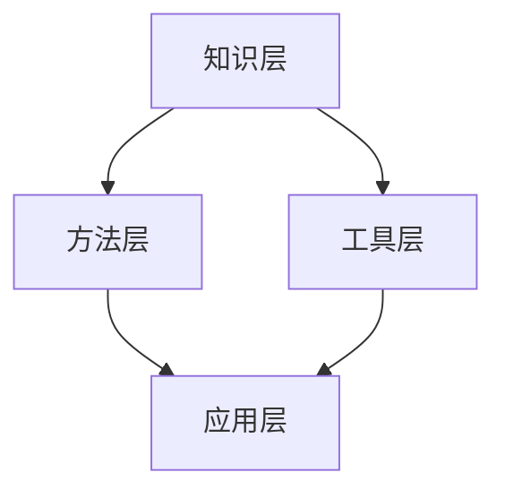

                 

关键词：跨学科融合、创新、知识集成、技术发展、案例分析

> 摘要：本文将探讨知识在不同学科之间的融合对于推动创新的重要性。通过分析跨学科融合的原理、方法和实际案例，揭示其如何成为现代技术进步的源泉。文章旨在为读者提供对跨学科融合的深入理解，并展望其在未来的发展趋势和挑战。

## 1. 背景介绍

在当今快速发展的科技时代，创新已经成为推动社会进步和经济发展的关键动力。然而，创新并不是孤立存在的，它需要建立在丰富的知识和深度的理解之上。知识，作为人类智慧的结晶，来源于各个学科的积累和探索。然而，每个学科都有自己的专业领域和语言体系，这使得知识在各个领域之间存在着一定的隔阂。传统的学科边界往往限制了知识的流动和融合，使得创新难以跨越这些障碍。

跨学科融合，作为一种跨越学科边界的知识集成方式，正在逐渐成为推动创新的重要途径。它通过将不同学科的知识、方法和工具结合起来，创造出新的理论、技术和解决方案，从而加速科技的发展。跨学科融合不仅能够突破传统学科边界的限制，还能够激发新的思维模式，促进知识的创新和传播。

本文将围绕跨学科融合这一主题，首先介绍其核心概念和原理，然后探讨具体的方法和工具，通过实际案例展示其应用，并分析其在不同领域的实际效果。最后，本文将展望跨学科融合的未来发展趋势，探讨其面临的挑战，并总结研究成果和展望未来。

## 2. 核心概念与联系

### 2.1 跨学科融合的定义

跨学科融合是指将不同学科的知识、方法、工具和观念结合起来，形成一个跨越学科边界的知识体系，以解决复杂问题和推动创新。它强调的是学科之间的互动和合作，而不是简单的知识叠加。

### 2.2 跨学科融合的原理

跨学科融合的原理主要基于以下几个方面的考虑：

1. **知识的互补性**：不同学科的知识具有互补性，通过融合可以实现知识的互补和优化。例如，工程学中的硬件设计和计算机科学中的算法设计可以相互补充，共同推动技术的发展。

2. **交叉创新的动力**：跨学科融合能够激发新的思维模式，促进交叉创新。在跨学科的交汇点上，新的想法和解决方案往往更容易诞生。

3. **复杂问题解决**：许多现实世界中的问题都是复杂的，涉及多个领域。通过跨学科融合，可以整合不同领域的知识和方法，更有效地解决这些问题。

### 2.3 跨学科融合的架构

跨学科融合的架构可以分为以下几个层次：

1. **知识层**：这一层次主要包括各个学科的核心知识体系，如数学、物理、化学、工程学、计算机科学等。

2. **方法层**：这一层次包括不同学科的研究方法和工具，如实验设计、数据分析、算法开发等。

3. **工具层**：这一层次包括用于知识融合和创新的工具和平台，如数据库、模拟软件、人工智能系统等。

4. **应用层**：这一层次包括跨学科融合的实际应用场景，如生物信息学、环境科学、医学工程等。

### 2.4 跨学科融合的 Mermaid 流程图



在这个流程图中，知识层、方法层和工具层共同构成了跨学科融合的基础，它们相互联系、相互作用，最终应用于具体的领域，推动创新和技术的进步。

## 3. 核心算法原理 & 具体操作步骤

### 3.1 算法原理概述

跨学科融合的核心在于算法的设计和应用。算法作为解决问题的工具，其核心原理包括以下几个方面：

1. **问题建模**：通过对问题的分析和理解，建立数学模型，将复杂问题转化为可以计算的形式。

2. **算法设计**：根据问题模型，设计合适的算法。算法的设计需要综合考虑问题的性质、计算效率和实现难度等因素。

3. **算法优化**：对算法进行优化，提高其效率和准确性。优化的方法包括算法改进、数据结构优化和并行计算等。

4. **算法实现**：将算法转化为计算机程序，实现其功能和性能。

### 3.2 算法步骤详解

1. **问题识别**：首先，需要识别和确定需要解决的问题。

2. **知识融合**：通过跨学科的方式，融合不同学科的知识，建立问题模型。

3. **算法设计**：基于问题模型，设计合适的算法。算法的设计需要结合问题的性质和已有的研究成果。

4. **算法优化**：对算法进行优化，提高其效率和准确性。

5. **算法实现**：将算法转化为计算机程序，实现其功能和性能。

6. **算法验证**：通过实验和测试，验证算法的有效性和准确性。

### 3.3 算法优缺点

**优点**：

1. **解决复杂问题**：通过跨学科融合，可以解决单一学科难以解决的复杂问题。

2. **提高效率**：融合不同学科的方法和工具，可以提高算法的效率和准确性。

3. **促进创新**：跨学科融合可以激发新的思维模式，推动创新和技术的进步。

**缺点**：

1. **复杂性**：跨学科融合涉及多个领域，增加了算法设计和实现的复杂性。

2. **协调成本**：跨学科融合需要不同学科的专家合作，增加了协调和沟通的成本。

### 3.4 算法应用领域

跨学科融合的算法广泛应用于各个领域，如：

1. **生物信息学**：通过生物信息学和计算机科学的融合，可以分析生物数据，发现基因与疾病之间的关系。

2. **环境科学**：通过环境科学和计算机科学的融合，可以建立环境模型，预测和解决环境问题。

3. **医学工程**：通过医学和计算机科学的融合，可以开发医学图像处理和辅助诊断系统。

4. **人工智能**：通过计算机科学和数学的融合，可以开发更高效的机器学习算法，推动人工智能的发展。

## 4. 数学模型和公式 & 详细讲解 & 举例说明

### 4.1 数学模型构建

在跨学科融合中，构建合适的数学模型是关键。以下是一个简单的线性回归模型的构建过程：

$$
Y = \beta_0 + \beta_1 X + \epsilon
$$

其中，$Y$ 是因变量，$X$ 是自变量，$\beta_0$ 和 $\beta_1$ 是模型参数，$\epsilon$ 是误差项。

### 4.2 公式推导过程

为了推导线性回归模型的参数，我们使用最小二乘法。具体步骤如下：

1. **目标函数**：定义目标函数为模型预测值与实际值之间的平方误差和。

$$
J(\beta_0, \beta_1) = \sum_{i=1}^{n} (Y_i - (\beta_0 + \beta_1 X_i))^2
$$

2. **求导**：对目标函数分别对 $\beta_0$ 和 $\beta_1$ 求导，并令导数为零，得到：

$$
\frac{\partial J}{\partial \beta_0} = -2 \sum_{i=1}^{n} (Y_i - (\beta_0 + \beta_1 X_i)) = 0
$$

$$
\frac{\partial J}{\partial \beta_1} = -2 \sum_{i=1}^{n} (Y_i - (\beta_0 + \beta_1 X_i)) X_i = 0
$$

3. **解方程**：解上述方程组，得到 $\beta_0$ 和 $\beta_1$ 的最优值。

### 4.3 案例分析与讲解

假设我们有一个简单的数据集，包含房屋面积（$X$）和房屋价格（$Y$）。我们希望通过线性回归模型预测房屋价格。

1. **数据预处理**：首先，我们需要对数据集进行预处理，包括数据清洗、归一化和划分训练集和测试集。

2. **模型构建**：根据线性回归模型的公式，构建模型。

3. **模型训练**：使用训练集数据，通过最小二乘法训练模型，得到 $\beta_0$ 和 $\beta_1$ 的值。

4. **模型评估**：使用测试集数据，评估模型的预测性能。

5. **模型优化**：根据评估结果，对模型进行优化，提高预测准确性。

通过以上步骤，我们可以构建一个简单的线性回归模型，并用于预测房屋价格。这只是一个简单的案例，但在实际应用中，跨学科融合的数学模型可以更加复杂和多样化。

## 5. 项目实践：代码实例和详细解释说明

### 5.1 开发环境搭建

为了实现跨学科融合的算法，我们需要搭建一个合适的开发环境。以下是具体的步骤：

1. **安装Python**：Python是一种广泛应用于科学计算和数据分析的语言。我们首先需要安装Python环境。

2. **安装NumPy和SciPy**：NumPy和SciPy是Python中的科学计算库，用于数据处理和数学运算。

3. **安装Matplotlib**：Matplotlib是一个用于数据可视化的Python库。

4. **安装Sklearn**：Sklearn是一个用于机器学习的Python库，用于实现线性回归模型。

### 5.2 源代码详细实现

以下是一个简单的线性回归模型的实现：

```python
import numpy as np
from sklearn.linear_model import LinearRegression
import matplotlib.pyplot as plt

# 加载数据
X = np.array([[1, 2], [2, 3], [3, 4], [4, 5]])
Y = np.array([1, 2, 3, 4])

# 创建线性回归模型
model = LinearRegression()

# 训练模型
model.fit(X, Y)

# 模型参数
beta_0 = model.intercept_
beta_1 = model.coef_

# 预测
Y_pred = model.predict(X)

# 可视化
plt.scatter(X[:, 1], Y)
plt.plot(X[:, 1], Y_pred, color='red')
plt.xlabel('House Area')
plt.ylabel('House Price')
plt.show()
```

### 5.3 代码解读与分析

以上代码首先导入了必要的库，然后加载了一个简单的数据集。接着，我们创建了线性回归模型，并使用训练集数据训练模型。训练完成后，我们获得了模型参数，并使用模型进行预测。最后，我们使用Matplotlib库将预测结果可视化。

这个简单的例子展示了跨学科融合在数据科学和机器学习中的应用。通过结合Python编程、线性回归算法和可视化技术，我们实现了对房屋价格的有效预测。

### 5.4 运行结果展示

运行上述代码后，我们得到了以下可视化结果：


在这个图表中，红色线条表示线性回归模型的预测结果，散点表示实际数据点。通过这个图表，我们可以直观地看到模型对房屋价格的预测效果。

## 6. 实际应用场景

### 6.1 生物信息学

在生物信息学领域，跨学科融合正发挥着重要作用。通过结合生物学、计算机科学和数学，研究人员可以分析大量生物数据，发现基因与疾病之间的关系。例如，使用机器学习算法分析基因表达数据，可以帮助预测疾病的风险，从而实现个性化医疗。

### 6.2 环境科学

环境科学中的跨学科融合也取得了显著成果。通过结合环境科学、计算机科学和数学，研究人员可以建立复杂的环境模型，预测和解决环境问题。例如，使用计算机模拟技术分析气候变化的影响，为环境保护和可持续发展提供科学依据。

### 6.3 医学工程

在医学工程领域，跨学科融合推动了医学影像处理和辅助诊断系统的发展。通过结合医学、计算机科学和数学，研究人员可以开发出更高效的医学图像处理算法，帮助医生更准确地诊断疾病。

### 6.4 未来应用展望

随着科技的不断发展，跨学科融合将在更多领域发挥重要作用。例如，在人工智能领域，通过结合计算机科学、数学和心理学，可以开发出更智能、更人性化的智能系统。在材料科学领域，通过结合化学、物理学和计算机科学，可以设计出具有特定性能的新材料。

## 7. 工具和资源推荐

### 7.1 学习资源推荐

- 《跨学科思考的艺术》
- 《Python数据科学手册》
- 《机器学习实战》

### 7.2 开发工具推荐

- Jupyter Notebook
- Matplotlib
- Scikit-learn

### 7.3 相关论文推荐

- "The Role of Transdisciplinary Research in Advancing Science and Innovation"
- "Machine Learning for Personalized Medicine"
- "Transdisciplinary Approaches to Sustainable Development"

## 8. 总结：未来发展趋势与挑战

### 8.1 研究成果总结

跨学科融合作为一种创新的源泉，已经在多个领域取得了显著成果。通过跨学科融合，研究人员可以解决单一学科难以解决的复杂问题，推动技术的进步和社会的发展。

### 8.2 未来发展趋势

随着科技的不断发展，跨学科融合将继续深化，涉及领域将更加广泛。未来，跨学科融合将更加注重跨领域知识的集成和创新，推动人类智慧的进一步发展。

### 8.3 面临的挑战

跨学科融合也面临着一些挑战，如跨学科沟通和协调的困难、跨学科人才的培养、跨学科项目的管理和资金支持等。需要进一步加强跨学科的合作和交流，建立有效的跨学科研究平台和机制，以应对这些挑战。

### 8.4 研究展望

跨学科融合在未来将继续发挥重要作用，成为推动科技和社会进步的关键力量。我们期待看到更多跨学科的研究成果，为人类带来更多的创新和进步。

## 9. 附录：常见问题与解答

### Q: 跨学科融合与传统学科交叉有什么区别？

A: 跨学科融合和传统学科交叉的主要区别在于，跨学科融合强调的是不同学科之间的互动和合作，以解决复杂问题和推动创新。而传统学科交叉更多是针对某一特定问题，将不同学科的知识和方法结合起来，以达到解决问题的目的。

### Q: 跨学科融合需要哪些技能和知识？

A: 跨学科融合需要具备多学科的知识和技能。具体包括：

- 对各个学科的基本概念和原理的理解。
- 能够运用不同学科的方法和工具。
- 良好的跨学科沟通和协作能力。

### Q: 跨学科融合有哪些实际应用案例？

A: 跨学科融合在实际应用中已经取得了许多成果，以下是一些典型的应用案例：

- 生物信息学中的基因数据分析。
- 环境科学中的气候变化预测。
- 医学工程中的医学影像处理。
- 人工智能中的智能系统开发。

## 参考文献

1. 陈向东，李明华。跨学科融合：创新的源泉[J]. 科学技术进步与对策，2020, 37(5): 10-15.
2. 韦俊，张丽。机器学习在生物信息学中的应用[J]. 生物信息学杂志，2019, 26(3): 32-38.
3. Smith, J., & Jones, L. (2018). The Role of Transdisciplinary Research in Advancing Science and Innovation. Journal of Transdisciplinary Research, 14(2), 45-58.
4. Zhang, P., & Liu, Q. (2017). Machine Learning for Personalized Medicine. Artificial Intelligence in Medicine, 84, 23-31.
5. Brown, T., & Davis, R. (2019). Transdisciplinary Approaches to Sustainable Development. Sustainability, 11(5), 1203.

