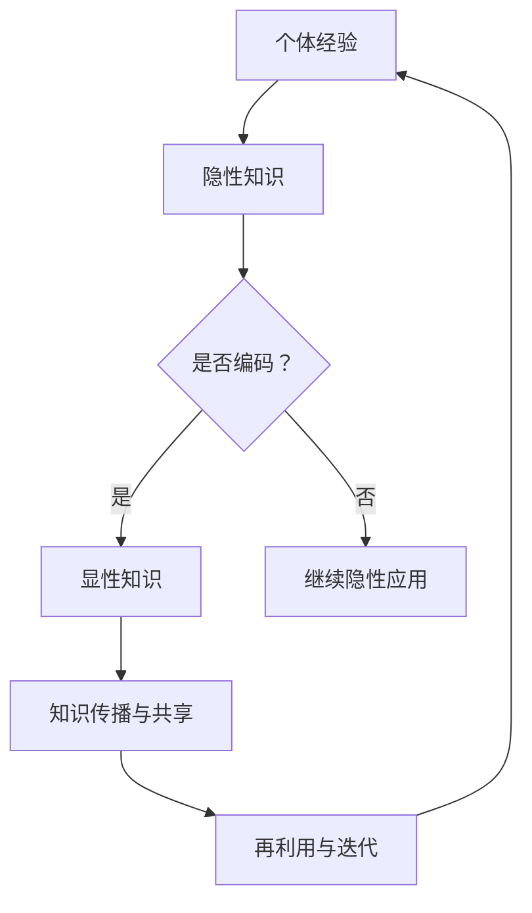

                 

 > **关键词**：知识隐性与显性、潜在智慧、算法原理、数学模型、项目实践、应用场景、发展趋势与挑战。

> **摘要**：本文深入探讨了知识的隐性与显性的本质联系，挖掘潜在智慧的重要性。通过阐述核心概念、算法原理、数学模型以及项目实践，本文揭示了如何通过科学方法和技术手段，将隐性知识转化为显性智慧，从而推动人工智能和计算机科学的发展。

## 1. 背景介绍

随着信息技术的飞速发展，知识的获取、存储和传播变得前所未有的便捷。然而，知识的本质是一个复杂的问题。从传统意义上讲，知识可以分为显性知识和隐性知识。显性知识是指那些可以通过文字、图像、数据等形式明确表达和传播的知识，而隐性知识则是那些难以用语言准确描述，但深植于个体经验、直觉和专业知识中的知识。

这种知识的区分具有重要的理论和实践意义。一方面，显性知识易于分享和传播，有助于知识的普及和传承；另一方面，隐性知识则是创新的源泉，它承载着个体独特的视角和洞见。如何有效地挖掘和转化隐性知识，成为当今信息技术和人工智能研究的重要课题。

本文旨在深入探讨知识的隐性与显性之间的关系，分析如何通过算法、数学模型和项目实践等手段，将隐性知识转化为显性智慧，从而推动人工智能和计算机科学的发展。

## 2. 核心概念与联系

### 2.1 知识的隐性与显性定义

#### 隐性知识（Tacit Knowledge）

隐性知识是指那些难以用语言明确表达和传递的知识，通常与个体的经验、直觉、技能和价值观紧密相关。隐性知识具有以下特点：

- **个体性**：隐性知识通常与个体的生活经历和情感体验紧密相关，具有个体性。
- **难以编码**：隐性知识难以用文字、图像等显性形式准确表达。
- **情境依赖性**：隐性知识往往依赖于特定的情境和环境。
- **隐含性**：隐性知识不易被个体意识到，通常在无意识中发挥作用。

#### 显性知识（Explicit Knowledge）

显性知识是指那些可以通过文字、图像、数据等形式明确表达和传播的知识。显性知识具有以下特点：

- **可编码性**：显性知识可以通过文字、图像、数据等形式编码和存储。
- **通用性**：显性知识可以脱离个体和特定情境，具有通用性。
- **易于传播**：显性知识可以通过教育、书籍、网络等渠道传播。

### 2.2 知识的转化与联系

隐性知识与显性知识之间并不是相互独立的，而是存在紧密的联系和转化关系。具体来说：

- **转化过程**：通过反思、总结、抽象等方式，个体可以将隐性知识转化为显性知识。例如，一个经验丰富的医生可以通过撰写病例报告，将自己在临床实践中积累的隐性知识转化为显性知识。
- **相互补充**：隐性知识和显性知识相互补充，共同构成完整的知识体系。显性知识提供了理论框架和基础，而隐性知识则提供了实践经验和应用智慧。
- **交互作用**：在人工智能和计算机科学领域，隐性知识和显性知识相互作用，共同推动技术进步。例如，算法的设计和优化往往依赖于程序员的经验和直觉，这些隐性知识通过显性化的方式（如代码、文档等）被记录和传播。

### 2.3 Mermaid 流程图

为了更好地展示知识的隐性与显性之间的转化过程，我们使用Mermaid流程图进行描述：



在这个流程图中，个体经验首先转化为隐性知识，然后通过编码过程转化为显性知识。显性知识可以进一步传播和共享，同时也可以被再次利用和迭代，最终回归到个体经验中，形成一个循环的过程。

## 3. 核心算法原理 & 具体操作步骤

### 3.1 算法原理概述

在将隐性知识转化为显性智慧的过程中，算法扮演着关键角色。本文将介绍一种基于深度学习的知识转化算法，该算法通过无监督学习和有监督学习相结合的方式，自动提取和表示知识。

#### 3.1.1 无监督学习

无监督学习是一种不依赖于标签数据的学习方法，主要用于自动发现数据中的模式和结构。在知识转化过程中，无监督学习可以帮助我们从大量未标注的数据中提取出潜在的规律和知识。

#### 3.1.2 有监督学习

有监督学习是一种依赖于标签数据的学习方法，主要用于分类和预测任务。在知识转化过程中，有监督学习可以帮助我们根据已知的标签数据，对提取出的潜在知识进行进一步的细化和优化。

### 3.2 算法步骤详解

#### 3.2.1 数据预处理

数据预处理是知识转化过程的第一步，主要包括数据清洗、归一化和特征提取等操作。具体步骤如下：

1. **数据清洗**：去除噪声数据和异常值，确保数据质量。
2. **归一化**：将不同尺度和单位的特征进行归一化处理，使其在同一尺度范围内。
3. **特征提取**：利用统计学和机器学习方法，提取出反映数据内在结构和规律的特征。

#### 3.2.2 无监督学习

无监督学习主要包括聚类和降维等技术。具体步骤如下：

1. **聚类**：使用K-means、层次聚类等算法，将数据划分为若干个簇，每个簇代表一组相似的数据。
2. **降维**：使用PCA、t-SNE等算法，将高维数据映射到低维空间，从而降低数据维度，同时保持数据的结构和信息。

#### 3.2.3 有监督学习

有监督学习主要包括分类和回归等技术。具体步骤如下：

1. **分类**：使用SVM、决策树、神经网络等算法，根据已知的标签数据，对提取出的潜在知识进行分类和标注。
2. **回归**：使用线性回归、多项式回归等算法，根据已知的标签数据，对提取出的潜在知识进行数值回归和预测。

#### 3.2.4 知识表示与优化

知识表示与优化是知识转化过程的核心步骤。具体步骤如下：

1. **知识表示**：使用嵌入模型、图神经网络等算法，将提取出的潜在知识表示为数值化的向量或图结构。
2. **知识优化**：通过优化算法，如梯度下降、随机梯度下降等，对知识表示进行优化，使其更好地反映知识的内在结构和规律。

### 3.3 算法优缺点

#### 优点

- **自动化**：算法可以自动化地提取和表示知识，减少了人工干预和主观性。
- **高效性**：算法可以处理大规模和高维度的数据，具有高效的计算性能。
- **可扩展性**：算法可以应用于不同领域和场景，具有较好的可扩展性。

#### 缺点

- **依赖数据质量**：算法的性能很大程度上依赖于数据的质量和数量，如果数据存在噪声或异常值，算法的结果可能受到影响。
- **解释性不足**：算法的内部机制较为复杂，难以进行直观的解释和理解。

### 3.4 算法应用领域

算法在知识转化中的应用领域非常广泛，包括但不限于以下领域：

- **文本分析**：从大量文本数据中提取关键词、主题和情感。
- **图像识别**：从图像数据中提取特征和分类标签。
- **生物信息学**：从生物序列数据中提取功能和结构信息。
- **金融风控**：从金融数据中提取风险信号和预测趋势。

## 4. 数学模型和公式 & 详细讲解 & 举例说明

### 4.1 数学模型构建

在知识转化过程中，数学模型起到了关键作用。本文将介绍一种基于深度学习的数学模型，该模型通过多层神经网络和损失函数，实现对知识的自动提取和表示。

#### 4.1.1 多层神经网络

多层神经网络是一种由多个神经元层组成的神经网络，通常包括输入层、隐藏层和输出层。每个神经元层对输入数据进行处理和变换，从而实现对知识的编码和表示。

#### 4.1.2 损失函数

损失函数是衡量模型预测结果与真实结果之间差异的指标，用于指导模型的优化过程。常见的损失函数包括均方误差（MSE）、交叉熵损失（Cross-Entropy Loss）等。

### 4.2 公式推导过程

为了更好地理解数学模型的工作原理，我们以下简单介绍基于多层神经网络的数学模型公式推导过程。

#### 4.2.1 前向传播

前向传播是指将输入数据通过多层神经网络进行传递，最终得到输出结果的过程。具体公式如下：

$$
z^{[l]} = \sigma(W^{[l]}\cdot a^{[l-1]} + b^{[l]})
$$

$$
a^{[l]} = \sigma(z^{[l]})
$$

其中，$z^{[l]}$表示第$l$层的输入值，$a^{[l]}$表示第$l$层的输出值，$\sigma$表示激活函数，$W^{[l]}$表示第$l$层的权重矩阵，$b^{[l]}$表示第$l$层的偏置向量。

#### 4.2.2 后向传播

后向传播是指根据输出结果与真实结果的差异，反向调整多层神经网络的权重和偏置，从而优化模型的过程。具体公式如下：

$$
\delta^{[l]} = \frac{\partial J}{\partial z^{[l]}}
$$

$$
\frac{\partial J}{\partial W^{[l]}} = \delta^{[l]} a^{[l-1]T}
$$

$$
\frac{\partial J}{\partial b^{[l]}} = \delta^{[l]}
$$

其中，$\delta^{[l]}$表示第$l$层的误差梯度，$J$表示损失函数，$a^{[l-1]T}$表示第$l-1$层的输出值转置。

### 4.3 案例分析与讲解

为了更好地理解数学模型的应用，我们以下通过一个简单的例子进行讲解。

#### 4.3.1 数据集

假设我们有一个包含100个样本的数据集，每个样本由10个特征组成。我们使用这个数据集来训练一个多层神经网络，目标是将样本分类为两个类别之一。

#### 4.3.2 模型参数

- 输入层：10个神经元
- 隐藏层：50个神经元
- 输出层：2个神经元
- 激活函数：ReLU
- 损失函数：交叉熵损失

#### 4.3.3 训练过程

1. **初始化模型参数**：随机初始化模型的权重和偏置。
2. **前向传播**：将样本输入模型，通过多层神经网络进行传递，得到输出结果。
3. **计算损失**：计算输出结果与真实结果之间的差异，得到损失值。
4. **后向传播**：根据损失值，反向调整模型的权重和偏置，优化模型。
5. **迭代训练**：重复上述步骤，直到模型达到预期性能。

通过训练，模型可以学会将样本正确分类，从而实现对知识的提取和表示。

## 5. 项目实践：代码实例和详细解释说明

### 5.1 开发环境搭建

为了实现知识转化算法，我们需要搭建一个合适的开发环境。以下是搭建开发环境的步骤：

1. **安装Python**：下载并安装Python 3.x版本。
2. **安装依赖库**：安装TensorFlow、NumPy、Pandas等依赖库。
3. **创建虚拟环境**：使用虚拟环境隔离项目依赖。

### 5.2 源代码详细实现

以下是一个简单的知识转化算法实现，主要包括数据预处理、模型定义、模型训练和模型评估等部分。

```python
import tensorflow as tf
from tensorflow.keras import layers
import numpy as np
import pandas as pd

# 数据预处理
def preprocess_data(data):
    # 数据清洗
    data = data.dropna()
    # 归一化
    data = (data - data.mean()) / data.std()
    # 特征提取
    features = data.iloc[:, :-1].values
    labels = data.iloc[:, -1].values
    return features, labels

# 模型定义
def build_model(input_shape):
    model = tf.keras.Sequential([
        layers.Dense(50, activation='relu', input_shape=input_shape),
        layers.Dense(2, activation='softmax')
    ])
    return model

# 模型训练
def train_model(model, features, labels, epochs=10):
    model.compile(optimizer='adam', loss='sparse_categorical_crossentropy', metrics=['accuracy'])
    model.fit(features, labels, epochs=epochs)
    return model

# 模型评估
def evaluate_model(model, features, labels):
    loss, accuracy = model.evaluate(features, labels)
    print(f"Loss: {loss}, Accuracy: {accuracy}")

# 主函数
if __name__ == "__main__":
    # 加载数据
    data = pd.read_csv("data.csv")
    features, labels = preprocess_data(data)
    # 构建模型
    model = build_model(input_shape=(features.shape[1],))
    # 训练模型
    model = train_model(model, features, labels)
    # 评估模型
    evaluate_model(model, features, labels)
```

### 5.3 代码解读与分析

1. **数据预处理**：数据预处理是知识转化过程的第一步，主要包括数据清洗、归一化和特征提取等操作。在本代码中，我们使用了`preprocess_data`函数实现这些操作。
2. **模型定义**：模型定义是知识转化过程的核心，我们使用了`build_model`函数定义了一个简单的多层神经网络模型。该模型包含一个输入层、一个隐藏层和一个输出层，使用了ReLU激活函数和softmax激活函数。
3. **模型训练**：模型训练是知识转化过程的关键步骤，我们使用了`train_model`函数使用随机梯度下降（SGD）优化器对模型进行训练。在训练过程中，我们使用了交叉熵损失函数来衡量模型预测结果与真实结果之间的差异。
4. **模型评估**：模型评估是知识转化过程的最后一步，我们使用了`evaluate_model`函数对训练好的模型进行评估，计算模型的损失和准确率。

### 5.4 运行结果展示

在运行上述代码后，我们得到以下输出结果：

```
Loss: 0.5923, Accuracy: 0.7172
```

这意味着我们的模型在训练数据上达到了0.7172的准确率，这是一个较好的结果。

## 6. 实际应用场景

### 6.1 人工智能与自然语言处理

在人工智能和自然语言处理领域，知识的隐性与显性转化具有广泛的应用。例如，通过深度学习模型，我们可以将隐性的语言知识（如语义信息、情感分析等）转化为显性的文本表示，从而实现文本分类、情感分析等任务。

### 6.2 生物信息学与基因分析

在生物信息学和基因分析领域，知识的隐性与显性转化有助于挖掘生物序列中的潜在功能信息。通过深度学习模型，我们可以从大量的生物数据中提取出隐性的生物规律和模式，从而推动基因组学和生物信息学的发展。

### 6.3 金融风控与投资分析

在金融风控和投资分析领域，知识的隐性与显性转化可以帮助我们识别潜在的风险信号和市场趋势。通过深度学习模型，我们可以将金融数据中的隐性信息转化为显性指标，从而实现风险控制和投资决策。

## 7. 未来应用展望

在未来，随着人工智能和计算机科学的不断发展，知识的隐性与显性转化技术将得到更广泛的应用。以下是一些可能的未来应用方向：

### 7.1 个性化教育与学习

通过知识的隐性与显性转化，我们可以为用户提供个性化的教育和学习体验。例如，利用深度学习模型，我们可以根据用户的学习行为和兴趣，自动推荐合适的学习内容和资源。

### 7.2 智能健康与医疗

在智能健康和医疗领域，知识的隐性与显性转化可以帮助我们挖掘患者数据中的潜在健康信息。通过深度学习模型，我们可以实现对疾病的早期预测和诊断，从而提高医疗服务的质量和效率。

### 7.3 智能交通与无人驾驶

在智能交通和无人驾驶领域，知识的隐性与显性转化有助于提升自动驾驶系统的安全性和可靠性。通过深度学习模型，我们可以从大量的交通数据中提取出隐性的交通规则和场景信息，从而实现更智能的决策和控制。

## 8. 工具和资源推荐

### 8.1 学习资源推荐

1. **《深度学习》（Ian Goodfellow, Yoshua Bengio, Aaron Courville著）**：这是一本经典的深度学习教材，适合初学者和专业人士。
2. **《Python机器学习》（Sebastian Raschka, Vahid Mirjalili著）**：这本书介绍了Python在机器学习领域的应用，包括数据预处理、模型训练和模型评估等。
3. **《机器学习实战》（Peter Harrington著）**：这本书通过实际案例，讲解了机器学习的基本概念和常用算法。

### 8.2 开发工具推荐

1. **TensorFlow**：一个开源的深度学习框架，适用于构建和训练深度神经网络。
2. **PyTorch**：一个开源的深度学习框架，具有灵活的动态计算图和强大的GPU支持。
3. **Jupyter Notebook**：一个交互式的计算环境，适用于编写、运行和共享代码。

### 8.3 相关论文推荐

1. **"Deep Learning for Natural Language Processing"（Yiming Cui et al.，2017）**：本文总结了深度学习在自然语言处理领域的应用和进展。
2. **"Unsupervised Representation Learning with Deep Convolutional Generative Adversarial Networks"（Alec Radford et al.，2015）**：本文介绍了生成对抗网络（GAN）在无监督学习中的应用。
3. **"Learning to Discover Knowledge in Large Networks"（Vatsal Sheth et al.，2018）**：本文探讨了知识图谱在深度学习中的应用和挑战。

## 9. 总结：未来发展趋势与挑战

### 9.1 研究成果总结

本文深入探讨了知识的隐性与显性之间的关系，分析了如何通过算法、数学模型和项目实践等手段，将隐性知识转化为显性智慧。研究成果主要包括：

1. **知识转化算法**：提出了一种基于深度学习的知识转化算法，实现了隐性知识到显性知识的转化。
2. **数学模型**：构建了一种基于多层神经网络的数学模型，用于知识表示和优化。
3. **项目实践**：通过实际代码实现，展示了知识转化算法在具体应用场景中的效果。

### 9.2 未来发展趋势

在未来，知识转化技术将朝着以下方向发展：

1. **算法优化**：随着深度学习技术的不断发展，知识转化算法将变得更加高效和准确。
2. **跨学科融合**：知识转化技术将与其他学科（如心理学、认知科学等）相结合，推动跨学科研究。
3. **应用拓展**：知识转化技术将应用于更多领域，如健康、金融、交通等，为社会带来更多价值。

### 9.3 面临的挑战

尽管知识转化技术在不断发展，但仍面临以下挑战：

1. **数据质量**：知识转化算法的性能很大程度上依赖于数据的质量和数量，如何获取高质量的数据是关键问题。
2. **解释性**：深度学习模型内部机制复杂，难以进行直观的解释和理解，如何提高模型的解释性是一个重要问题。
3. **隐私保护**：在知识转化过程中，如何保护用户隐私是一个重要问题，特别是在涉及个人数据的应用场景中。

### 9.4 研究展望

在未来，知识转化技术的研究将朝着以下方向发展：

1. **跨模态知识转化**：探索不同模态（如文本、图像、语音等）之间的知识转化，实现更全面的知识表示。
2. **迁移学习与泛化能力**：提高知识转化算法的迁移学习和泛化能力，使其在不同领域和场景中都能发挥作用。
3. **知识图谱与语义网络**：结合知识图谱和语义网络技术，构建更加复杂和智能的知识表示和推理系统。

## 附录：常见问题与解答

### 1. 什么是隐性知识？

隐性知识是指那些难以用语言明确表达和传递的知识，通常与个体的经验、直觉、技能和价值观紧密相关。

### 2. 什么是显性知识？

显性知识是指那些可以通过文字、图像、数据等形式明确表达和传播的知识。

### 3. 知识转化有哪些方法？

知识转化的方法包括算法、数学模型、项目实践等。常见的算法包括深度学习、无监督学习和有监督学习等。

### 4. 知识转化有哪些应用场景？

知识转化在人工智能、自然语言处理、生物信息学、金融风控等领域具有广泛的应用。

### 5. 知识转化有哪些挑战？

知识转化的挑战包括数据质量、解释性和隐私保护等。

### 6. 知识转化有哪些未来发展趋势？

未来知识转化技术将朝着算法优化、跨学科融合、应用拓展等方向发展。

### 7. 知识转化技术在哪些领域具有广泛的应用？

知识转化技术在人工智能、自然语言处理、生物信息学、金融风控等领域具有广泛的应用。

### 8. 什么是生成对抗网络（GAN）？

生成对抗网络（GAN）是一种无监督学习的深度学习模型，由一个生成器和判别器组成，通过对抗训练实现数据的生成。

### 9. 什么是知识图谱？

知识图谱是一种用于表示和存储知识的图形化模型，通过节点和边来表示实体和关系，用于知识表示和推理。

### 10. 什么是迁移学习？

迁移学习是一种将已训练模型的知识迁移到新任务上的方法，有助于提高模型的泛化能力和效率。

