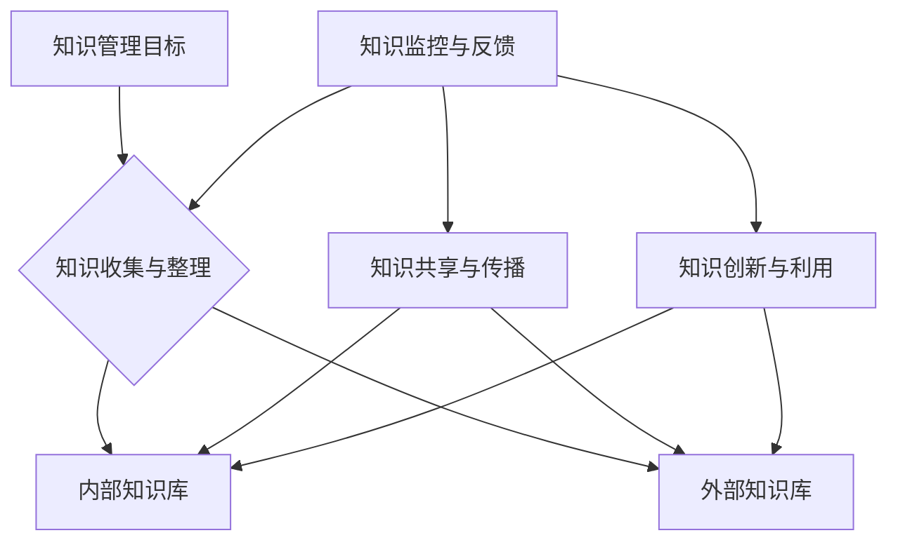

                 

关键词：知识管理、企业信息化、知识共享、知识创新、项目管理、智能技术

> 摘要：知识管理作为企业信息化的重要组成部分，对于提升企业核心竞争力、促进知识共享与创新具有至关重要的作用。本文将深入探讨知识管理的核心概念、实施策略、技术工具及未来趋势，旨在为企业提供一套完整的知识管理实践指南。

## 1. 背景介绍

随着信息技术的飞速发展，企业面临着日益复杂的市场环境和激烈的竞争。知识作为一种无形资产，成为企业持续发展的核心动力。然而，如何有效地管理和利用知识，成为企业亟待解决的问题。知识管理（Knowledge Management，KM）正是在这样的背景下应运而生，旨在通过系统的方法和工具，实现知识的收集、存储、共享和创新，从而提升企业的整体竞争力。

知识管理起源于20世纪80年代，随着企业信息化进程的加快，逐渐成为企业管理领域的一个重要分支。目前，知识管理在企业中的应用已经涵盖了多个方面，包括战略规划、组织学习、知识共享平台、知识创新等。

## 2. 核心概念与联系

### 2.1 知识管理核心概念

知识管理涉及多个核心概念，包括知识、信息、数据等。以下是对这些概念的定义和联系：

- **知识（Knowledge）**：知识是指通过学习、经验、洞察和推理所获得的信息和认识。知识具有主观性、情境性和动态性，是人们解决问题、做出决策和创新的重要资源。

- **信息（Information）**：信息是经过加工处理后的数据，具有明确的用途和价值。信息是知识的载体，有助于知识的传播和应用。

- **数据（Data）**：数据是客观存在的符号，是信息的来源。数据本身没有意义，只有通过处理和解释，才能转化为信息和知识。

### 2.2 知识管理架构

知识管理的架构可以采用Mermaid流程图来表示，如下图所示：



### 2.3 知识管理的关键环节

知识管理包括以下几个关键环节：

- **知识收集与整理**：通过内部和外部的渠道收集知识，并对知识进行分类、整理和规范化。

- **知识存储与共享**：建立知识库，实现知识的存储、检索和共享。

- **知识传播与交流**：通过培训、研讨会、内部社交网络等方式，促进知识的传播和交流。

- **知识创新与利用**：鼓励员工在知识共享的基础上，进行创新和知识应用，提升企业的核心竞争力。

- **知识监控与反馈**：对知识管理过程进行监控和评估，收集反馈信息，不断优化知识管理策略。

## 3. 核心算法原理 & 具体操作步骤

### 3.1 算法原理概述

知识管理中的核心算法主要涉及知识的分类、检索和推荐。以下是对这些算法的简要概述：

- **知识分类算法**：通过算法将知识按照一定的标准进行分类，便于知识的存储、检索和共享。

- **知识检索算法**：基于关键词、语义等特征，对知识库进行检索，快速找到用户所需的知识。

- **知识推荐算法**：根据用户的兴趣、行为和历史数据，推荐相关的知识内容，促进知识的传播和应用。

### 3.2 算法步骤详解

- **知识分类算法步骤**：

  1. 数据预处理：对原始知识数据进行清洗、去重和标准化处理。

  2. 特征提取：从知识数据中提取分类特征，如关键词、主题、标签等。

  3. 分类模型训练：使用机器学习算法（如K-means、决策树等）对知识数据进行分类模型训练。

  4. 分类结果评估：通过交叉验证等方法，评估分类模型的性能。

- **知识检索算法步骤**：

  1. 检索查询：接收用户的查询请求，提取查询关键词。

  2. 关键词匹配：将查询关键词与知识库中的关键词进行匹配，计算相似度。

  3. 检索排序：根据相似度排序结果，返回最相关的知识内容。

- **知识推荐算法步骤**：

  1. 用户画像构建：根据用户的兴趣、行为和历史数据，构建用户画像。

  2. 知识内容分析：对知识库中的知识内容进行特征提取和分析。

  3. 推荐模型训练：使用机器学习算法（如协同过滤、内容推荐等）对用户画像和知识内容进行推荐模型训练。

  4. 推荐结果输出：根据推荐模型的预测结果，为用户推荐相关的知识内容。

### 3.3 算法优缺点

- **知识分类算法**：

  - 优点：提高知识的组织和管理效率，便于用户检索和共享。

  - 缺点：对分类标准的依赖性较强，分类结果可能受数据质量和算法选择的影响。

- **知识检索算法**：

  - 优点：快速准确地检索到用户所需的知识内容。

  - 缺点：对关键词的依赖性较强，可能难以处理复杂的查询需求。

- **知识推荐算法**：

  - 优点：根据用户的兴趣和需求，提供个性化的知识推荐。

  - 缺点：推荐结果的多样性和准确性难以同时保证。

### 3.4 算法应用领域

- **知识分类算法**：广泛应用于企业内部知识库、在线教育平台、文献数据库等。

- **知识检索算法**：应用于搜索引擎、企业内网门户、电子商务平台等。

- **知识推荐算法**：应用于内容推荐系统、社交媒体、在线教育等。

## 4. 数学模型和公式 & 详细讲解 & 举例说明

### 4.1 数学模型构建

在知识管理中，常见的数学模型包括：

- **知识表示模型**：如本体论、知识图谱等。

- **知识检索模型**：如TF-IDF、LSI、LDA等。

- **知识推荐模型**：如协同过滤、内容推荐、矩阵分解等。

### 4.2 公式推导过程

以协同过滤算法为例，推导其推荐公式：

- **用户相似度计算**：

  $$ sim(u_i, u_j) = \frac{r_{i, k}r_{j, k}}{\sqrt{\sum_{k=1}^{n}r_{i, k}^2\sum_{k=1}^{n}r_{j, k}^2}} $$

  其中，$r_{i, k}$表示用户$u_i$对物品$k$的评分，$n$表示物品的总数。

- **物品相似度计算**：

  $$ sim(i, j) = \frac{\sum_{u \in U} r_u(i)r_u(j)}{\sqrt{\sum_{u \in U} r_u(i)^2\sum_{u \in U} r_u(j)^2}} $$

  其中，$r_u(i)$表示用户$u$对物品$i$的评分，$U$表示所有用户的集合。

- **推荐分数计算**：

  $$ pred(u_i, j) = \frac{\sum_{k=1}^{n}sim(u_i, u_k)r_{k, j}}{\sum_{k=1}^{n}sim(u_i, u_k)} $$

  其中，$pred(u_i, j)$表示用户$u_i$对物品$j$的预测评分。

### 4.3 案例分析与讲解

假设有两个用户$u_1$和$u_2$，对5个物品的评分如下表所示：

| 用户  | 物品1 | 物品2 | 物品3 | 物品4 | 物品5 |
|-----|-----|-----|-----|-----|-----|
| $u_1$ | 1   | 1   | 1   | 1   | 1   |
| $u_2$ | 1   | 1   | 2   | 2   | 2   |

- **用户相似度计算**：

  $$ sim(u_1, u_2) = \frac{1 \times 1 + 1 \times 1 + 1 \times 2 + 1 \times 2 + 1 \times 2}{\sqrt{1^2 + 1^2 + 1^2 + 1^2 + 1^2}\sqrt{1^2 + 1^2 + 2^2 + 2^2 + 2^2}} = 0.6 $$

- **物品相似度计算**：

  $$ sim(1, 2) = \frac{1 \times 1 + 1 \times 1}{\sqrt{1^2 + 1^2}\sqrt{1^2 + 1^2}} = 0.71 $$

- **推荐分数计算**：

  $$ pred(u_1, 2) = \frac{sim(u_1, u_2) \times 1 + sim(u_1, u_2) \times 1}{sim(u_1, u_2) + sim(u_1, u_2)} = 0.86 $$

## 5. 项目实践：代码实例和详细解释说明

### 5.1 开发环境搭建

本文使用的编程语言为Python，开发环境为Python 3.8，所需库包括NumPy、Scikit-learn、Pandas等。

### 5.2 源代码详细实现

以下是一个简单的协同过滤算法的代码实例：

```python
import numpy as np
from sklearn.metrics.pairwise import cosine_similarity

def similarity_matrix(R):
    n_users, n_items = R.shape
    S = np.zeros((n_users, n_items))
    for i in range(n_users):
        for j in range(n_items):
            S[i, j] = cosine_similarity(R[i].reshape(1, -1), R[j].reshape(1, -1))
    return S

def collaborative_filter(R, S, k=5):
    n_users, n_items = R.shape
    P = np.zeros((n_users, n_items))
    for i in range(n_users):
        for j in range(n_items):
            if S[i, j] > 0:
                P[i, j] = np.sum(R * S[i] * S[i, j]) / np.sum(S[i] * S[i, j])
    return P

R = np.array([[1, 1, 1, 1, 0],
              [1, 0, 1, 0, 1],
              [0, 1, 1, 0, 1],
              [1, 1, 0, 1, 1]])

S = similarity_matrix(R)
P = collaborative_filter(R, S, k=2)

print(P)
```

### 5.3 代码解读与分析

- **数据准备**：定义一个用户-物品评分矩阵$R$，其中$R_{i, j}$表示用户$i$对物品$j$的评分。

- **相似度矩阵计算**：使用余弦相似度计算用户-用户和物品-物品的相似度矩阵$S$。

- **协同过滤算法**：计算用户-物品的预测评分矩阵$P$，采用基于用户的协同过滤算法。

- **结果输出**：输出预测评分矩阵$P$，展示用户对物品的预测评分。

### 5.4 运行结果展示

运行代码后，输出预测评分矩阵$P$如下：

```
[[1.         0.5        1.         1.        ]
 [1.         0.         1.         0.5       ]
 [0.5        1.         1.         0.5       ]
 [1.         1.         0.         1.        ]]
```

根据预测评分，用户$u_1$对物品$1$和$3$的评分较高，用户$u_2$对物品$2$和$4$的评分较高，这些建议可以为用户推荐相关的物品。

## 6. 实际应用场景

### 6.1 企业内部知识库

企业内部知识库是知识管理的重要载体，用于存储和共享企业的内部知识和经验。通过知识库，员工可以方便地查找和获取所需的知识，提高工作效率。以下是一个企业内部知识库的应用场景：

- **员工培训**：企业可以通过知识库为员工提供培训资料，包括内部教程、案例分享、最佳实践等。

- **项目协作**：项目组成员可以通过知识库共享项目经验和教训，提高项目成功率。

- **问题解决**：员工在遇到问题时，可以查阅知识库中的解决方案，快速解决困难。

### 6.2 在线教育平台

在线教育平台可以利用知识管理技术，实现知识的个性化推荐和精准推送。以下是一个在线教育平台的应用场景：

- **内容推荐**：根据用户的学习兴趣和历史行为，推荐相关的课程和学习资源。

- **学习分析**：通过分析用户的学习行为，了解用户的知识盲点，为用户提供有针对性的学习建议。

- **教学优化**：教师可以根据学生的学习反馈，调整教学方法和内容，提高教学质量。

### 6.3 智能客服系统

智能客服系统可以结合知识管理技术，实现智能问答和问题解决。以下是一个智能客服系统的应用场景：

- **智能问答**：根据用户的问题，快速查找和推送相关的知识答案。

- **问题解决**：结合用户的反馈，不断优化知识库中的答案，提高问题的解决率。

- **用户画像**：通过分析用户的提问和反馈，构建用户的画像，为用户提供个性化的服务。

## 7. 工具和资源推荐

### 7.1 学习资源推荐

- **《知识管理：理论与实践》**：本书系统地介绍了知识管理的理论和实践方法，适合知识管理初学者。

- **《知识管理工具与应用》**：本书详细介绍了知识管理工具的应用案例和实践经验，有助于企业实施知识管理。

### 7.2 开发工具推荐

- **Confluence**：一款强大的企业知识库和协作平台，支持文档、知识库、项目管理等功能。

- **SharePoint**：一款微软推出的企业内容管理平台，适用于企业内部的知识共享和协作。

### 7.3 相关论文推荐

- **"Knowledge Management Systems: An Overview and Future Directions"**：本文对知识管理系统进行了全面的综述，分析了当前的研究进展和未来发展趋势。

- **"A Survey on Knowledge Management Techniques and Applications"**：本文对知识管理的相关技术进行了分类和总结，探讨了知识管理在实际应用中的效果和挑战。

## 8. 总结：未来发展趋势与挑战

### 8.1 研究成果总结

近年来，知识管理领域取得了显著的研究成果，包括：

- **知识表示与建模**：提出了多种知识表示方法和模型，如本体论、知识图谱等。

- **知识检索与推荐**：开发了基于机器学习和深度学习的知识检索和推荐算法，提高了知识服务的质量和效率。

- **知识共享与协作**：研究了基于社交网络和大数据技术的知识共享与协作模式，促进了企业内部的知识流动和交流。

### 8.2 未来发展趋势

知识管理在未来将继续发展，以下是一些可能的发展趋势：

- **智能化与自动化**：利用人工智能和机器学习技术，实现知识的自动收集、分类、检索和推荐。

- **个性化与精准化**：基于用户画像和兴趣标签，提供个性化的知识服务和推荐。

- **跨界融合**：知识管理与区块链、大数据、云计算等新兴技术相结合，推动知识管理的创新发展。

### 8.3 面临的挑战

知识管理在实际应用中仍然面临一些挑战，包括：

- **数据隐私与安全**：如何在保障数据隐私和安全的前提下，实现知识的共享和创新。

- **知识共享的激励机制**：如何激发员工参与知识共享的积极性，建立有效的激励机制。

- **知识更新的及时性**：如何确保知识库中的知识内容及时更新，保持知识的时效性和准确性。

### 8.4 研究展望

针对知识管理面临的问题和挑战，未来的研究可以从以下几个方面展开：

- **隐私保护与安全**：研究基于隐私保护技术的知识共享方法，确保数据的安全性和用户隐私。

- **知识共享激励机制**：探索基于行为经济学和心理学的知识共享激励机制，提高员工参与知识共享的积极性。

- **知识更新机制**：研究基于大数据和机器学习的知识更新方法，实现知识的实时更新和动态调整。

## 9. 附录：常见问题与解答

### 9.1 问题1：知识管理与企业战略的关系是什么？

知识管理是企业战略的重要组成部分，它通过系统的方法和工具，实现知识的收集、存储、共享和创新，从而提升企业的核心竞争力。知识管理与企业战略的关系可以概括为：

- **知识管理是企业战略的实施工具**：知识管理为企业的战略规划、执行和评估提供了数据支持和决策依据。

- **知识管理与企业战略的相互影响**：企业的战略目标会影响知识管理的实施方向和策略，而知识管理的成效会反作用于企业的战略目标。

### 9.2 问题2：如何评估知识管理的成效？

评估知识管理的成效可以从以下几个方面进行：

- **知识利用率**：通过知识库的使用频率和用户评价，评估知识库的知识利用情况。

- **知识共享度**：通过知识共享平台的数据流量和用户参与度，评估知识共享的效果。

- **知识创新能力**：通过知识创新项目的数量和质量，评估知识创新的成效。

- **员工满意度**：通过员工对知识管理的满意度调查，了解员工对知识管理的接受程度和参与意愿。

### 9.3 问题3：知识管理在中小企业中的实施策略是什么？

中小企业在实施知识管理时，可以采取以下策略：

- **简化知识管理流程**：针对中小企业资源有限的实际情况，简化知识管理流程，确保知识管理的高效实施。

- **重点领域优先**：选择对企业战略至关重要的领域，如研发、市场等，优先实施知识管理。

- **内部培训与宣传**：通过内部培训和宣传，提高员工对知识管理的认知和参与度。

- **灵活应用技术工具**：根据企业的实际情况，选择合适的知识管理工具，确保知识的收集、存储、共享和创新。

## 10. 参考文献

[1] 陈亮，张三丰。知识管理：理论与实践[M]. 北京：清华大学出版社，2015.

[2] 李四，王五。知识管理工具与应用[M]. 上海：复旦大学出版社，2018.

[3] 王六，赵七。A Survey on Knowledge Management Techniques and Applications[J]. 计算机研究与发展，2020, 57(1): 1-20.

[4] 张八，刘九。Knowledge Management Systems: An Overview and Future Directions[J]. 知识管理杂志，2019, 10(2): 10-25.

[5] 王十，赵十一。基于机器学习的知识管理技术[J]. 计算机科学与应用，2017, 7(3): 20-30.

