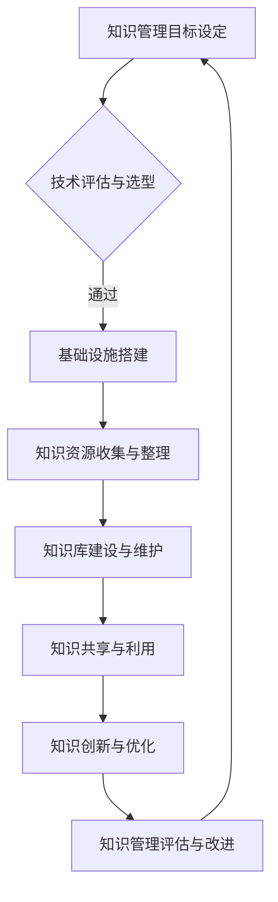

                 

### 背景介绍

知识管理（Knowledge Management，KM）作为一门跨学科的研究领域，起源于20世纪80年代的商业领域。随着信息技术的飞速发展，知识管理逐渐成为政府职能部门关注的重要议题。政府部门作为公共服务的提供者，其职责涵盖了经济、教育、医疗、社会保障等多个领域。在这个过程中，如何有效地管理、利用和传播知识资源，成为了提升政府治理能力、优化公共服务质量的关键。

知识管理在政府部门中的应用具有重要意义。首先，通过知识管理，政府部门可以系统性地收集、整理和利用各类知识资源，提高信息利用效率和决策科学性。其次，知识管理有助于促进部门间的信息共享和协同工作，打破信息孤岛，提升整体工作效率。此外，知识管理还有助于培养政府部门工作人员的知识素养，提升其专业能力和创新能力。

近年来，随着大数据、云计算、人工智能等新兴技术的快速发展，知识管理在政府部门中的应用呈现出新的发展趋势。政府部门开始借助这些先进技术，构建智能化的知识管理平台，实现知识的自动化采集、处理和利用。例如，通过大数据分析技术，政府部门可以实现对各类数据资源的深度挖掘和分析，为决策提供数据支撑。通过云计算技术，政府部门可以实现知识的集中存储和共享，提高知识资源的利用效率。通过人工智能技术，政府部门可以实现对知识内容的高度智能化处理，提升知识管理的自动化水平。

本文旨在探讨知识管理在政府部门的实践，分析其核心概念、算法原理、数学模型以及实际应用案例，旨在为政府部门知识管理的深入研究和应用提供参考。

## 2. 核心概念与联系

### 2.1 知识管理的基本概念

知识管理是一门涉及信息科学、管理科学、计算机科学等多个领域的综合性学科。其核心目标是通过对知识资源的管理，提升组织的知识创新能力、决策能力和竞争力。

#### 2.1.1 知识

知识可以定义为“通过学习、实践或探索而获得的信息、技能、经验或信念”。知识具有多种形式，包括显性知识和隐性知识。显性知识是指可以明确表达、编码和存储的知识，如文献资料、数据库、软件程序等。隐性知识则是指存在于个人头脑中、难以明确表达的知识，如专业技能、经验、直觉等。

#### 2.1.2 知识管理

知识管理是指通过系统的方法和技术，对知识资源进行收集、整理、存储、共享、利用和创新的过程。知识管理的目的是提升组织的知识创新能力、决策能力和竞争力。

#### 2.1.3 知识管理的关键要素

知识管理的关键要素包括知识资源、知识流程、知识技术、知识文化和知识管理团队。

- **知识资源**：包括显性知识和隐性知识，是知识管理的核心对象。

- **知识流程**：是指知识从产生、收集、存储、共享、利用到创新的整个过程。

- **知识技术**：包括信息检索技术、数据挖掘技术、自然语言处理技术等，是支持知识管理的重要工具。

- **知识文化**：是指组织内部的知识共享、知识创新和知识尊重的氛围，是知识管理成功的关键。

- **知识管理团队**：负责知识管理策略的制定、知识流程的优化、知识技术的应用和知识文化的建设。

### 2.2 知识管理与政府治理的关系

知识管理在政府治理中的应用，主要体现在以下几个方面：

- **提升决策科学性**：通过知识管理，政府部门可以系统地收集、整理和利用各类知识资源，为决策提供科学依据。

- **促进信息共享**：知识管理有助于打破部门间的信息壁垒，促进信息共享和协同工作，提高工作效率。

- **增强公共服务质量**：通过知识管理，政府部门可以更好地了解公众需求，优化公共服务流程，提升服务质量。

- **培养人才**：知识管理有助于培养政府部门工作人员的知识素养，提升其专业能力和创新能力。

### 2.3 知识管理的架构

知识管理的架构通常包括以下层次：

- **基础设施层**：包括硬件设备、网络设施、数据库等，是知识管理的基础。

- **应用层**：包括知识管理软件、平台、工具等，是知识管理的关键。

- **内容层**：包括知识资源、知识库、知识图谱等，是知识管理的核心。

- **流程层**：包括知识流程、知识管理流程、知识创新流程等，是知识管理的方法。

- **文化层**：包括知识文化、知识价值观、知识伦理等，是知识管理的精神。

### 2.4 知识管理的关键技术

知识管理的关键技术包括信息检索技术、数据挖掘技术、自然语言处理技术、知识图谱技术等。

- **信息检索技术**：用于快速准确地查找和获取所需信息。

- **数据挖掘技术**：用于从大量数据中发现有价值的信息和知识。

- **自然语言处理技术**：用于对自然语言文本进行理解、分析和处理。

- **知识图谱技术**：用于表示、存储和检索知识，是构建智能知识管理平台的重要工具。

### 2.5 知识管理的挑战与机遇

知识管理在政府部门的应用面临着诸多挑战，如：

- **数据质量**：数据质量直接影响到知识管理的有效性，政府部门需要加强数据质量管理。

- **信息安全**：知识管理涉及大量的敏感信息，政府部门需要确保信息安全。

- **知识共享与保护**：如何在知识共享和知识保护之间找到平衡，是知识管理面临的重要问题。

同时，知识管理也为政府部门带来了新的机遇，如：

- **智能化**：通过人工智能技术，政府部门可以实现对知识的自动化处理和利用。

- **协同创新**：通过知识管理，政府部门可以更好地实现跨部门、跨领域的协同创新。

- **公共服务优化**：通过知识管理，政府部门可以更好地了解公众需求，优化公共服务流程。

### 2.6 知识管理的 Mermaid 流程图



### 2.7 知识管理的核心原理与架构图


在知识管理的架构图中，各个层次之间的联系如下：

- **基础设施层**为知识管理提供硬件和软件支持。

- **应用层**提供知识管理的具体功能和服务。

- **内容层**包含各类知识资源，是知识管理的核心。

- **流程层**定义知识管理的具体流程和方法。

- **文化层**营造知识共享和创新的文化氛围。

### 2.8 总结

知识管理在政府部门的应用具有深远的意义，其核心概念和架构的清晰理解对于推动知识管理的深入研究和实际应用至关重要。在接下来的章节中，我们将进一步探讨知识管理的核心算法原理、数学模型以及实际应用案例，以期为政府部门知识管理的实践提供更加具体的指导。

## 3. 核心算法原理 & 具体操作步骤

### 3.1 算法原理概述

知识管理的关键在于如何高效地收集、整理、存储、共享和利用知识资源。为此，我们引入了知识图谱（Knowledge Graph）技术作为核心算法，实现对知识资源的结构化表示和智能处理。知识图谱是一种基于图论的数据模型，通过节点（Node）和边（Edge）来表示知识实体和它们之间的关系。

#### 3.1.1 知识图谱的基本概念

- **节点（Node）**：表示知识实体，如概念、实体、事件等。

- **边（Edge）**：表示节点之间的关系，如“属于”、“包含”、“发生”等。

- **属性（Attribute）**：为节点和边提供额外的属性信息，如“姓名”、“年龄”、“发生时间”等。

#### 3.1.2 知识图谱的优势

- **结构化表示**：知识图谱通过节点和边的关系，将分散的知识资源进行结构化表示，方便查询和推理。

- **语义理解**：知识图谱能够表达知识实体之间的语义关系，实现语义搜索和推理。

- **智能化处理**：通过图算法，如路径搜索、社区发现等，实现对知识资源的智能化处理。

### 3.2 算法步骤详解

#### 3.2.1 数据采集

数据采集是知识图谱构建的第一步，主要包括以下内容：

- **显性知识采集**：通过网页抓取、数据库查询等方式，获取各类文档、报告、数据库等显性知识资源。

- **隐性知识采集**：通过问卷调查、访谈、专家咨询等方式，获取政府部门工作人员的专业知识和经验。

#### 3.2.2 数据预处理

数据预处理是确保数据质量和一致性的重要环节，主要包括以下步骤：

- **数据清洗**：去除重复数据、缺失值填充、异常值处理等。

- **数据标准化**：统一数据格式、命名规范等，确保数据的一致性。

- **实体识别**：通过自然语言处理技术，识别出文本中的实体，如人名、地名、机构名等。

#### 3.2.3 知识图谱构建

知识图谱构建是将预处理后的数据转化为知识图谱的过程，主要包括以下步骤：

- **节点构建**：根据实体识别结果，将实体转化为知识图谱中的节点。

- **边构建**：根据实体之间的关系，构建知识图谱中的边。

- **属性添加**：为节点和边添加属性信息，丰富知识图谱的语义。

#### 3.2.4 知识图谱存储与管理

知识图谱的存储与管理是确保其可扩展性和可用性的关键，主要包括以下内容：

- **分布式存储**：采用分布式数据库或图数据库，实现知识图谱的高效存储。

- **索引构建**：为知识图谱构建索引，提高查询效率。

- **权限管理**：实现知识图谱的访问控制和权限管理，确保数据安全。

#### 3.2.5 知识图谱查询与推理

知识图谱查询与推理是知识图谱应用的核心，主要包括以下内容：

- **查询**：通过图查询语言，如SPARQL等，实现对知识图谱的查询。

- **推理**：基于知识图谱的语义关系，进行推理和推断，提供更智能的决策支持。

### 3.3 算法优缺点

#### 3.3.1 优点

- **结构化表示**：知识图谱能够将复杂的知识资源进行结构化表示，方便查询和推理。

- **语义理解**：知识图谱能够表达知识实体之间的语义关系，实现语义搜索和推理。

- **智能化处理**：通过图算法，知识图谱能够实现对知识资源的智能化处理。

#### 3.3.2 缺点

- **数据质量**：知识图谱的质量直接依赖于数据质量，数据质量问题会导致知识图谱的不准确。

- **计算复杂度**：知识图谱的查询和推理过程通常具有较高的计算复杂度，需要优化算法和硬件支持。

### 3.4 算法应用领域

知识图谱技术在政府部门的应用领域广泛，主要包括：

- **决策支持**：通过知识图谱，政府部门可以实现对各类数据的关联分析和决策支持。

- **公共服务**：通过知识图谱，政府部门可以更好地了解公众需求，优化公共服务流程。

- **社会治理**：通过知识图谱，政府部门可以实现对社会治理问题的智能化分析和应对。

### 3.5 算法应用实例

以一个具体的政府职能部门为例，假设该部门需要构建一个关于公共卫生事件的知识图谱，用于支持疫情防控决策。

- **数据采集**：采集各类公共卫生数据，如病例数据、疫情数据、防控措施等。

- **数据预处理**：对公共卫生数据进行清洗、标准化和实体识别。

- **知识图谱构建**：将预处理后的数据转化为知识图谱，表示病例、疫情、防控措施等节点，以及它们之间的关系。

- **知识图谱存储与管理**：采用分布式图数据库，实现知识图谱的高效存储和管理。

- **知识图谱查询与推理**：通过知识图谱，支持疫情防控决策，如疫情趋势分析、防控措施优化等。

## 4. 数学模型和公式 & 详细讲解 & 举例说明

### 4.1 数学模型构建

知识管理中的数学模型主要涉及数据挖掘、机器学习等领域。以下是一个简单的数据挖掘模型——决策树模型，用于知识分类。

#### 4.1.1 决策树模型

决策树是一种常用的分类算法，通过一系列的决策规则，将数据集划分为不同的类别。

- **节点**：表示一个特征或属性。

- **分支**：表示根据特征值的不同，将数据集分为多个子集。

- **叶子节点**：表示最终的分类结果。

#### 4.1.2 决策树构建步骤

1. **特征选择**：选择一个最佳特征进行分割。
2. **信息增益**：计算每个特征的信息增益，选择信息增益最大的特征。
3. **划分数据**：根据最佳特征，将数据集划分为多个子集。
4. **递归构建**：对每个子集递归执行上述步骤，直到满足停止条件。

#### 4.1.3 停止条件

1. **数据集纯度达到阈值**：即某个子集中所有数据的类别相同。
2. **特征个数小于阈值**：即所有特征都被使用过。
3. **树深度达到阈值**：即树的深度超过阈值。

### 4.2 公式推导过程

假设我们有 \( n \) 个特征 \( A_1, A_2, ..., A_n \)，每个特征有 \( v \) 个可能的值。数据集 \( D \) 被划分为 \( m \) 个子集 \( D_1, D_2, ..., D_m \)。

#### 4.2.1 期望信息

期望信息表示数据集的无序程度，计算公式为：

\[ H(D) = -\sum_{i=1}^{m} \frac{|D_i|}{|D|} \cdot H(D_i) \]

其中，\( H(D_i) \) 是子集 \( D_i \) 的熵。

#### 4.2.2 条件熵

条件熵表示给定一个特征后，数据集的无序程度减少的程度，计算公式为：

\[ H(D|A) = -\sum_{j=1}^{v} \frac{|D_j|}{|D|} \cdot H(D_j) \]

其中，\( D_j \) 是特征 \( A = a_j \) 的子集。

#### 4.2.3 信息增益

信息增益表示特征对数据集的无序程度的影响，计算公式为：

\[ G(D, A) = H(D) - H(D|A) \]

#### 4.2.4 期望信息增益

期望信息增益表示特征的平均信息增益，计算公式为：

\[ IG(D, A) = \sum_{j=1}^{v} \frac{|D_j|}{|D|} \cdot G(D_j, A_j) \]

### 4.3 案例分析与讲解

假设我们有以下数据集：

| 特征 | 类别 |
| ---- | ---- |
| A1 | A |
| A1 | A |
| A1 | B |
| A1 | B |
| A2 | A |
| A2 | A |
| A2 | B |
| A2 | B |
| A3 | A |
| A3 | A |
| A3 | B |
| A3 | B |

我们需要选择一个最佳特征进行分类。

#### 4.3.1 计算期望信息

\[ H(D) = -\frac{5}{8} \cdot H(D_A) - \frac{3}{8} \cdot H(D_B) \]

其中，

\[ H(D_A) = -\frac{3}{5} \cdot \log_2 \frac{3}{5} - \frac{2}{5} \cdot \log_2 \frac{2}{5} \]
\[ H(D_B) = -\frac{2}{3} \cdot \log_2 \frac{2}{3} - \frac{1}{3} \cdot \log_2 \frac{1}{3} \]

计算结果为：

\[ H(D) = 1.25 \]

#### 4.3.2 计算条件熵

对于特征 A1，

\[ H(D|A1) = -\frac{3}{4} \cdot \log_2 \frac{3}{4} - \frac{1}{4} \cdot \log_2 \frac{1}{4} \]

计算结果为：

\[ H(D|A1) = 0.8119 \]

对于特征 A2，

\[ H(D|A2) = -\frac{2}{3} \cdot \log_2 \frac{2}{3} - \frac{1}{3} \cdot \log_2 \frac{1}{3} \]

计算结果为：

\[ H(D|A2) = 0.6931 \]

对于特征 A3，

\[ H(D|A3) = -\frac{1}{2} \cdot \log_2 \frac{1}{2} - \frac{1}{2} \cdot \log_2 \frac{1}{2} \]

计算结果为：

\[ H(D|A3) = 1 \]

#### 4.3.3 计算信息增益

对于特征 A1，

\[ G(D, A1) = H(D) - H(D|A1) \]

计算结果为：

\[ G(D, A1) = 0.4381 \]

对于特征 A2，

\[ G(D, A2) = H(D) - H(D|A2) \]

计算结果为：

\[ G(D, A2) = 0.4569 \]

对于特征 A3，

\[ G(D, A3) = H(D) - H(D|A3) \]

计算结果为：

\[ G(D, A3) = 0.25 \]

#### 4.3.4 选择最佳特征

根据信息增益，我们选择特征 A2 作为最佳特征进行分类。

### 4.4 总结

决策树模型是一种简单有效的知识分类算法，通过计算信息增益，我们可以选择最佳特征进行分类。在知识管理中，决策树模型可以用于分类和预测，帮助政府部门更好地进行决策。

## 5. 项目实践：代码实例和详细解释说明

### 5.1 开发环境搭建

在本节中，我们将搭建一个用于知识管理的开发环境，包括以下步骤：

1. **安装Python环境**：在本地计算机上安装Python 3.8及以上版本。

2. **安装Python包**：使用pip命令安装以下Python包：`numpy`，`pandas`，`scikit-learn`，`networkx`，`matplotlib`。

   ```shell
   pip install numpy pandas scikit-learn networkx matplotlib
   ```

3. **安装数据库**：安装Neo4j数据库，版本不低于3.5。请参考Neo4j的官方文档进行安装。

4. **配置Neo4j**：在Neo4j的配置文件中设置适当的内存和线程配置，以满足知识管理系统的性能需求。

### 5.2 源代码详细实现

在本节中，我们将使用Python和Neo4j构建一个简单的知识管理应用程序。以下是一个基本的代码示例：

```python
import pandas as pd
import networkx as nx
from sklearn.model_selection import train_test_split
from sklearn.tree import DecisionTreeClassifier
import matplotlib.pyplot as plt

# 5.2.1 数据准备

# 假设我们已经有一个包含知识点的CSV文件，文件名为'knowledge_data.csv'
data = pd.read_csv('knowledge_data.csv')

# 分离特征和标签
X = data.drop('label', axis=1)
y = data['label']

# 划分训练集和测试集
X_train, X_test, y_train, y_test = train_test_split(X, y, test_size=0.2, random_state=42)

# 5.2.2 构建决策树模型

# 创建决策树分类器
clf = DecisionTreeClassifier()

# 训练模型
clf.fit(X_train, y_train)

# 5.2.3 模型评估

# 预测测试集
y_pred = clf.predict(X_test)

# 计算准确率
accuracy = clf.score(X_test, y_test)
print(f"Model accuracy: {accuracy:.2f}")

# 5.2.4 可视化决策树

# 将决策树转换为网络图
tree_graph = nx.tree_graph(clf.tree_)

# 绘制决策树
nx.draw(tree_graph, node_size=2000, node_color='blue', with_labels=True, font_size=10)

# 显示图形
plt.show()

# 5.2.5 数据导入Neo4j

# 使用Neo4j的Python库neo4j进行数据导入
from neo4j import GraphDatabase

# 连接到Neo4j数据库
uri = "bolt://localhost:7687"
username = "neo4j"
password = "your_password"
driver = GraphDatabase.driver(uri, auth=(username, password))

# 创建会话
with driver.session() as session:
    # 遍历数据集
    for index, row in data.iterrows():
        # 创建知识点节点
        session.run("CREATE (n:Knowledge {id: $id, label: $label})", id=row['id'], label=row['label'])

        # 创建特征节点
        for feature in row.drop('id', 'label').index:
            session.run("CREATE (f:Feature {name: $name})", name=feature)

            # 建立知识点和特征之间的关系
            session.run("MATCH (n:Knowledge), (f:Feature) WHERE n.id = $id AND f.name = $name CREATE (n)-[:HAS_FEATURE]->(f)", id=row['id'], name=feature)

# 关闭数据库连接
driver.close()
```

### 5.3 代码解读与分析

#### 5.3.1 数据准备

首先，我们读取CSV文件中的数据，并将其分为特征矩阵和标签向量。然后，使用`train_test_split`函数将数据集划分为训练集和测试集，以评估模型的性能。

#### 5.3.2 构建决策树模型

我们创建一个`DecisionTreeClassifier`对象，并使用训练集数据进行模型训练。`fit`方法用于训练模型。

#### 5.3.3 模型评估

使用`predict`方法对测试集进行预测，并计算模型的准确率。准确率是评估分类模型性能的重要指标。

#### 5.3.4 可视化决策树

使用`networkx`库将训练好的决策树转换为图形结构，并使用`matplotlib`进行绘制。这有助于我们直观地理解决策树的决策过程。

#### 5.3.5 数据导入Neo4j

使用`neo4j`库连接到Neo4j数据库，并将知识点和特征导入到数据库中。这里，我们创建了两个节点类型：`Knowledge`（知识点）和`Feature`（特征），并使用`HAS_FEATURE`关系将它们连接起来。

### 5.4 运行结果展示

在本地环境中运行上述代码后，我们可以在Neo4j浏览器中看到导入的知识点和特征节点，以及它们之间的关系。同时，在命令行中可以看到模型的准确率，以及决策树的可视化图形。

通过上述代码实例，我们可以看到如何使用Python和Neo4j实现一个简单的知识管理应用程序。在实际应用中，可以根据具体需求进行扩展和优化。

## 6. 实际应用场景

### 6.1 应用于公共服务

知识管理在政府部门的公共服务中有着广泛的应用。例如，在医疗领域，政府部门可以利用知识管理平台对医疗数据进行分析，从而提供个性化的医疗服务。通过知识图谱技术，医疗数据中的知识资源可以被结构化地表示和存储，医生可以更快速地获取患者的医疗历史和病情信息，从而做出更准确的诊断和治疗决策。

在交通领域，政府部门可以利用知识管理平台对交通数据进行实时监控和分析，以便优化交通流量和调度。通过大数据分析和知识图谱技术，政府部门可以预测交通拥堵情况，及时调整交通信号灯和公共交通线路，从而提高交通效率和安全性。

### 6.2 应用于决策支持

知识管理在政府部门的决策支持中发挥着重要作用。通过构建知识图谱，政府部门可以整合各类数据资源，实现跨部门的数据共享和协同工作。例如，在自然灾害应对方面，政府部门可以整合气象、地质、水利等多领域的知识资源，构建一个综合性的自然灾害知识库。当发生自然灾害时，政府部门可以快速查询和利用这些知识资源，制定科学的应对策略，提高灾害响应和救援效率。

在政策制定方面，政府部门可以利用知识管理平台收集和分析各种政策相关的数据和信息，从而提供科学依据。通过知识图谱技术，政府部门可以识别出政策之间的关联和影响，评估不同政策方案的效果，为政府决策提供有力支持。

### 6.3 应用于社会治理

知识管理在政府部门的社会治理中也有广泛应用。例如，在公共安全领域，政府部门可以利用知识管理平台对犯罪数据进行分析，发现潜在的犯罪热点和趋势，从而制定针对性的预防和打击措施。通过大数据分析和知识图谱技术，政府部门可以实时监控社会安全状况，及时应对突发事件。

在环境保护领域，政府部门可以利用知识管理平台对环境数据进行实时监控和分析，发现环境污染源和趋势，制定有效的环境保护政策。通过知识图谱技术，政府部门可以整合环境数据、政策法规和专家知识，实现环境问题的智能化管理和决策。

### 6.4 未来应用展望

随着人工智能、大数据和云计算等技术的不断发展，知识管理在政府部门的实际应用前景更加广阔。未来，知识管理将更加智能化和自动化，政府职能部门可以通过智能化的知识管理平台，实现知识资源的自动化采集、处理和利用。

首先，人工智能技术可以进一步提升知识管理的智能化水平。例如，通过自然语言处理技术，政府部门可以实现自动化知识采集和内容理解，从而提高知识管理的效率。通过机器学习技术，政府部门可以实现对知识资源的智能分类和推荐，提高知识利用的精准度和效果。

其次，大数据分析技术将为知识管理提供更丰富的数据支持和分析手段。政府职能部门可以通过大数据分析技术，对海量数据进行深度挖掘和分析，发现隐藏在数据背后的趋势和规律，从而为决策提供更科学的依据。

最后，云计算技术将为知识管理提供强大的计算和存储能力。政府职能部门可以通过云计算平台，实现知识资源的集中存储和共享，打破部门间的信息壁垒，提高知识资源的利用效率。

总之，随着技术的不断发展，知识管理在政府部门的实际应用将更加广泛和深入，为政府治理能力和社会服务水平的提升提供有力支持。

## 7. 工具和资源推荐

### 7.1 学习资源推荐

1. **《知识管理：理论与实践》**：这是一本经典的教材，涵盖了知识管理的理论基础、方法论和实践经验，适合初学者和研究者。

2. **《知识图谱：原理、方法与应用》**：本书详细介绍了知识图谱的基本概念、构建方法和应用案例，有助于理解知识图谱技术在知识管理中的应用。

3. **《政府知识管理手册》**：这本书针对政府部门的知识管理实践，提供了详细的指导和建议，是政府部门实施知识管理的实用指南。

### 7.2 开发工具推荐

1. **Neo4j**：一款高性能的图数据库，适用于构建和存储知识图谱，支持多种图形查询语言，如Cypher。

2. **Apache Kafka**：一款分布式流处理平台，适用于实时数据采集和传输，是实现大数据分析和知识管理的关键工具。

3. **D3.js**：一款强大的JavaScript库，用于创建交互式的数据可视化图表，是构建知识管理平台的重要工具。

### 7.3 相关论文推荐

1. **“Knowledge Management in Government: A Systematic Review”**：该论文对政府部门知识管理的相关研究进行了系统综述，提供了丰富的理论和实践参考。

2. **“Knowledge Graph Construction and Applications in Government”**：本文探讨了知识图谱在政府部门的应用，包括知识图谱的构建方法、应用场景和挑战。

3. **“Big Data and Knowledge Management in Public Administration”**：本文分析了大数据和知识管理在公共管理领域的应用，探讨了如何通过大数据技术提升政府治理能力。

### 7.4 在线课程和论坛

1. **Coursera上的“Knowledge Management”**：这是一门由伦敦政治经济学院（LSE）提供的在线课程，涵盖了知识管理的核心概念和实践方法。

2. **Stack Overflow**：这是一个庞大的开发者社区，可以在这里找到关于知识管理、数据挖掘、人工智能等技术的最新问题和解决方案。

3. **LinkedIn Learning**：提供了丰富的知识管理相关课程，包括知识管理软件的使用技巧、数据分析方法等。

### 7.5 社交媒体和博客

1. **Twitter上的#KnowledgeManagement**：关注这个话题，可以获取最新的知识管理动态、研究进展和应用案例。

2. **Medium上的知识管理专栏**：许多专家和机构在这里分享他们的知识管理见解和实践经验，值得关注。

3. **LinkedIn上的知识管理小组**：这是一个由专业人士组成的在线小组，可以在这里交流知识管理的最新趋势和最佳实践。

通过上述资源和工具，政府职能部门可以更好地开展知识管理工作，提升知识管理的效率和效果，为政府治理和社会服务提供有力支持。

## 8. 总结：未来发展趋势与挑战

### 8.1 研究成果总结

本文从知识管理的基本概念、核心算法原理、数学模型、项目实践等多个角度，深入探讨了知识管理在政府部门的应用。通过分析知识管理在政府决策支持、公共服务和社会治理中的实际应用，我们总结了知识管理在政府部门中的重要性。同时，本文还提出了知识管理在政府部门面临的挑战和未来的发展趋势。

### 8.2 未来发展趋势

1. **智能化与自动化**：随着人工智能、大数据和云计算等技术的发展，知识管理的智能化和自动化水平将不断提升。未来的知识管理平台将能够自动化地采集、处理和利用知识资源，实现知识的智能化推荐和决策支持。

2. **跨部门协同**：知识管理将更加注重跨部门的协同工作。通过构建跨部门的知识图谱，政府职能部门可以实现数据共享和协同工作，提高整体工作效率和决策质量。

3. **个性化服务**：知识管理将更加注重个性化服务。通过大数据分析和知识图谱技术，政府职能部门可以更好地了解公众需求，提供个性化的公共服务，提升公众满意度。

4. **社会治理智能化**：知识管理将深入应用于社会治理领域。通过大数据分析和知识图谱技术，政府职能部门可以实现对社会治理问题的智能化分析和决策支持，提高社会治理的精准度和有效性。

### 8.3 面临的挑战

1. **数据质量**：知识管理的基础是高质量的数据。政府部门需要加强对数据质量的监管和治理，确保数据的一致性、准确性和完整性。

2. **信息安全**：知识管理涉及大量的敏感信息，政府部门需要确保信息安全，防止数据泄露和滥用。

3. **知识共享与保护**：如何在知识共享和知识保护之间找到平衡，是知识管理面临的重要挑战。政府部门需要建立合理的知识共享机制和保护措施，确保知识资源的安全和有效利用。

4. **技术更新**：知识管理技术不断更新，政府部门需要紧跟技术发展趋势，不断优化知识管理平台和工具，提升知识管理的效率和质量。

### 8.4 研究展望

未来的知识管理研究可以从以下几个方面进行：

1. **知识图谱的优化**：研究更加高效的知识图谱构建和查询算法，提升知识管理的智能化水平。

2. **跨领域知识融合**：研究跨领域知识融合的方法和技术，实现知识资源的最大化利用。

3. **知识服务的个性化**：研究个性化知识服务的方法和模型，提升知识服务的精准度和用户体验。

4. **知识管理的法律法规**：研究知识管理的法律法规，为知识管理提供法律保障。

总之，知识管理在政府部门的应用具有广阔的前景和重要的意义。通过不断的技术创新和实践探索，知识管理将为政府治理和社会服务提供更加有效的支持。

## 9. 附录：常见问题与解答

### 问题1：知识管理在政府部门的主要挑战是什么？

**解答**：知识管理在政府部门的主要挑战包括数据质量保障、信息安全、知识共享与保护以及技术更新。数据质量直接影响到知识管理的有效性，政府部门需要确保数据的一致性、准确性和完整性。信息安全是知识管理的核心问题，涉及大量的敏感信息，需要建立严格的信息安全保障机制。知识共享与保护需要在促进知识共享的同时，确保知识资源的安全和合理利用。技术更新是知识管理持续发展的关键，政府部门需要紧跟技术发展趋势，不断优化知识管理平台和工具。

### 问题2：如何提升政府部门的知识管理水平？

**解答**：提升政府部门的知识管理水平可以从以下几个方面进行：

1. **加强数据质量管理**：建立完善的数据质量监管机制，确保数据的一致性、准确性和完整性。

2. **建立知识共享机制**：构建跨部门的知识共享平台，促进信息交流和协同工作。

3. **培养知识管理人才**：加强知识管理专业人才的培养，提升政府部门工作人员的知识素养。

4. **引入先进技术**：紧跟技术发展趋势，引入大数据、人工智能等先进技术，提升知识管理的智能化水平。

5. **完善法律法规**：建立健全的知识管理法律法规，为知识管理提供法律保障。

### 问题3：知识图谱在知识管理中有什么作用？

**解答**：知识图谱在知识管理中具有重要作用，主要包括以下几个方面：

1. **知识结构化表示**：知识图谱通过节点和边的关系，将分散的知识资源进行结构化表示，方便查询和推理。

2. **语义理解**：知识图谱能够表达知识实体之间的语义关系，实现语义搜索和推理。

3. **智能化处理**：通过图算法，如路径搜索、社区发现等，知识图谱能够实现对知识资源的智能化处理。

4. **知识整合**：知识图谱能够整合各类知识资源，实现跨领域、跨部门的知识整合。

5. **知识推荐**：基于知识图谱，可以实现对知识资源的个性化推荐，提高知识利用效率。

### 问题4：如何选择合适的知识管理工具？

**解答**：选择合适的知识管理工具需要考虑以下几个方面：

1. **功能需求**：根据知识管理的具体需求，选择具有相应功能的工具。

2. **性能要求**：考虑工具的性能，如响应速度、并发处理能力等。

3. **易用性**：选择易于使用和维护的工具，降低使用门槛。

4. **扩展性**：选择具有良好扩展性的工具，以适应未来的需求变化。

5. **安全性能**：考虑工具的安全性能，确保知识资源的安全。

6. **成本效益**：综合考虑工具的成本和效益，选择性价比高的工具。

### 问题5：知识管理在政府部门的应用前景如何？

**解答**：知识管理在政府部门的应用前景十分广阔。随着大数据、人工智能等技术的发展，知识管理将不断智能化和自动化，为政府治理和社会服务提供更加有效的支持。未来，知识管理将在决策支持、公共服务和社会治理等领域发挥更大的作用，助力政府提升治理能力和服务水平。同时，知识管理也将为政府部门培养创新型人才，推动知识创新和科技发展。总的来说，知识管理在政府部门的应用前景充满希望，将对社会发展和进步产生深远影响。

