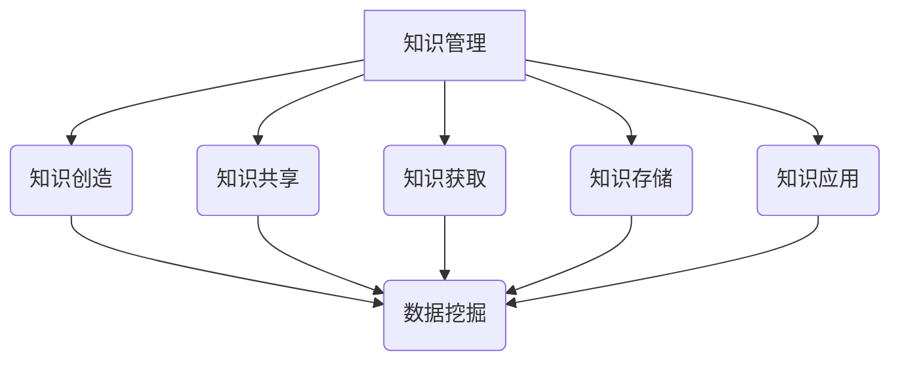

                 

关键词：知识管理，知识发现引擎，信息过载，数据挖掘，人工智能，知识图谱，知识组织，智能推荐，数据分析。

> 摘要：随着信息爆炸时代到来，知识管理成为企业和组织核心竞争力的重要组成部分。本文深入探讨了知识发现引擎在知识管理中的主导作用，分析了其在解决信息过载、促进知识共享和提升决策支持方面的应用，并展望了未来知识管理领域的发展趋势与挑战。

## 1. 背景介绍

### 1.1 信息过载的挑战

信息爆炸的时代，每天产生的数据量呈指数级增长。根据国际数据公司（IDC）的统计，全球数据量每年以约40%的速度增长。面对如此庞大的数据量，如何从中快速准确地获取有价值的信息，成为企业和个人面临的重大挑战。传统的信息检索技术难以应对这种信息过载的现象，需要新的技术和方法来提升信息处理能力。

### 1.2 知识管理的兴起

知识管理作为一门跨学科领域，旨在通过识别、获取、组织、存储、共享和利用知识，提升个人和组织的能力。随着知识管理理念的普及，越来越多的企业和组织开始重视知识的系统化管理，希望通过知识管理提升核心竞争力。

### 1.3 知识发现引擎的重要性

知识发现引擎作为一种新兴技术，以其强大的数据处理和分析能力，在知识管理中扮演着越来越重要的角色。知识发现引擎能够自动识别数据中的潜在模式，帮助用户快速发现知识，从而解决信息过载的问题。

## 2. 核心概念与联系

### 2.1 知识管理

知识管理（Knowledge Management，KM）是指通过系统地收集、存储、共享和应用知识，以促进个人和组织的学习和创新。知识管理涵盖了知识创造、知识共享、知识获取、知识存储和知识应用等多个方面。

### 2.2 知识发现

知识发现（Knowledge Discovery in Databases，KDD）是指从大量的数据中自动发现隐藏的、未知的、有价值的模式和知识。知识发现过程通常包括数据预处理、数据集成、数据选择、数据变换、模式识别和知识表示等步骤。

### 2.3 知识发现引擎

知识发现引擎是一种基于人工智能和数据挖掘技术的工具，用于自动识别数据中的潜在模式和知识。知识发现引擎通常包括数据预处理模块、模式识别模块、知识表示模块和推理模块等。

### 2.4 Mermaid 流程图



## 3. 核心算法原理 & 具体操作步骤

### 3.1 算法原理概述

知识发现引擎的核心算法通常包括以下几种：

1. **聚类算法**：将相似的数据点归为一类，以便发现数据中的模式。
2. **分类算法**：根据已有数据对新数据进行分类，以预测未知数据的类别。
3. **关联规则算法**：发现数据之间的关联关系，以便识别数据中的潜在知识。
4. **异常检测算法**：识别数据中的异常值，以便发现潜在的问题。

### 3.2 算法步骤详解

1. **数据预处理**：对原始数据进行清洗、转换和集成，以准备用于分析的数据集。
2. **模式识别**：使用聚类、分类、关联规则和异常检测算法，从数据集中识别潜在的规律和知识。
3. **知识表示**：将识别出的知识以可视化的形式表示，以便用户理解和应用。
4. **推理和决策支持**：根据知识发现的结果，为用户提供决策支持和行动建议。

### 3.3 算法优缺点

**优点**：

- 高效处理大量数据
- 自动识别数据中的潜在模式
- 提升知识共享和决策支持能力

**缺点**：

- 对数据质量和数据量的要求较高
- 算法复杂度较高，计算资源需求大
- 需要专业知识和技能进行操作

### 3.4 算法应用领域

知识发现引擎在各个领域都有广泛应用，包括：

- **商业智能**：帮助企业发现市场趋势、优化业务流程和提升竞争力。
- **金融分析**：识别投资机会、风险评估和欺诈检测。
- **医疗保健**：辅助诊断、药物研究和健康监测。
- **教育领域**：个性化学习推荐、学习分析和学生成绩预测。

## 4. 数学模型和公式 & 详细讲解 & 举例说明

### 4.1 数学模型构建

知识发现引擎通常涉及以下数学模型：

1. **聚类算法**：如K-means、DBSCAN等。
2. **分类算法**：如决策树、支持向量机等。
3. **关联规则算法**：如Apriori、FP-growth等。
4. **异常检测算法**：如孤立森林、基于统计的异常检测等。

### 4.2 公式推导过程

以K-means算法为例，其目标是最小化数据点到聚类中心点的平方距离之和。假设有n个数据点，每个数据点有m个特征，K-means算法的目标函数可以表示为：

$$
J = \sum_{i=1}^{n}\sum_{j=1}^{m}(x_{ij} - \mu_{ij})^2
$$

其中，$x_{ij}$是数据点$i$的第$j$个特征值，$\mu_{ij}$是聚类中心点$i$的第$j$个特征值。

### 4.3 案例分析与讲解

假设有一个包含100个客户的购物数据集，每个客户有5个特征：年龄、收入、教育程度、购物频率和品牌偏好。我们使用K-means算法将这100个客户分为5类，以便发现不同客户群体的特征。

首先，随机初始化5个聚类中心点。然后，计算每个客户到聚类中心点的距离，将每个客户归为最近的聚类中心点。接下来，重新计算聚类中心点的位置，并重复上述步骤，直到聚类中心点的位置不再变化。

通过多次迭代，最终得到5个聚类中心点，每个聚类中心点代表一个客户群体。我们可以通过比较不同聚类中心点的特征值，发现不同客户群体的特征，例如年龄分布、收入水平、教育程度等。

## 5. 项目实践：代码实例和详细解释说明

### 5.1 开发环境搭建

为了实现知识发现引擎，我们需要搭建一个开发环境。这里我们使用Python作为开发语言，并依赖以下库：

- NumPy：用于数值计算
- Pandas：用于数据处理
- Matplotlib：用于数据可视化
- Scikit-learn：用于机器学习算法

### 5.2 源代码详细实现

以下是使用K-means算法实现知识发现引擎的Python代码：

```python
import numpy as np
import pandas as pd
from sklearn.cluster import KMeans
import matplotlib.pyplot as plt

# 加载数据集
data = pd.read_csv('data.csv')

# 数据预处理
data = data.dropna()  # 删除缺失值
data = (data - data.mean()) / data.std()  # 标准化数据

# 初始化聚类中心点
kmeans = KMeans(n_clusters=5, random_state=0)
kmeans.fit(data)

# 计算聚类中心点
centroids = kmeans.cluster_centers_

# 将数据点分配到聚类中心点
labels = kmeans.predict(data)

# 可视化聚类结果
plt.scatter(data[:, 0], data[:, 1], c=labels, cmap='viridis')
plt.scatter(centroids[:, 0], centroids[:, 1], s=300, c='red', marker='s')
plt.xlabel('特征1')
plt.ylabel('特征2')
plt.title('K-means 聚类结果')
plt.show()
```

### 5.3 代码解读与分析

- 第1行：导入NumPy库。
- 第2行：导入Pandas库。
- 第3行：导入Scikit-learn中的KMeans类。
- 第4行：导入Matplotlib库。
- 第5行：加载数据集，假设数据集名为'data.csv'。
- 第6行：删除数据集中的缺失值。
- 第7行：对数据进行标准化处理，以消除特征之间的尺度差异。
- 第8行：初始化KMeans对象，设置聚类数量为5，随机种子为0。
- 第9行：使用数据集进行模型训练。
- 第10行：获取聚类中心点。
- 第11行：使用预测函数将数据点分配到聚类中心点。
- 第12行：绘制聚类结果，使用散点图表示数据点和聚类中心点。

### 5.4 运行结果展示

运行上述代码后，我们得到了K-means聚类结果的可视化展示。根据聚类结果，我们可以发现数据集中不同客户群体的特征，例如年龄分布、收入水平、教育程度等。

## 6. 实际应用场景

### 6.1 商业智能

知识发现引擎在商业智能领域有广泛应用，帮助企业分析市场趋势、客户行为和业务流程，从而优化决策。

### 6.2 金融分析

在金融分析领域，知识发现引擎可以帮助金融机构识别投资机会、风险评估和欺诈检测。

### 6.3 医疗保健

知识发现引擎在医疗保健领域有重要应用，例如辅助诊断、药物研究和健康监测。

### 6.4 教育领域

知识发现引擎在教育领域可以用于个性化学习推荐、学习分析和学生成绩预测。

## 7. 工具和资源推荐

### 7.1 学习资源推荐

- 《机器学习实战》
- 《数据挖掘：概念与技术》
- 《Python数据分析基础教程》

### 7.2 开发工具推荐

- Jupyter Notebook：用于数据分析和机器学习实验。
- Anaconda：用于Python环境管理和数据科学工具集。

### 7.3 相关论文推荐

- "Knowledge Discovery in Databases: A Survey"
- "A Review of Clustering Algorithms"
- "An Overview of Classification Algorithms"

## 8. 总结：未来发展趋势与挑战

### 8.1 研究成果总结

知识发现引擎在解决信息过载、提升知识管理和决策支持能力方面取得了显著成果。随着人工智能技术的不断发展，知识发现引擎将更加智能化、自动化，进一步提升知识管理的效果。

### 8.2 未来发展趋势

- **智能化**：知识发现引擎将更加智能化，利用深度学习和自然语言处理等技术，实现更加精准的知识发现。
- **自动化**：知识发现引擎将实现自动化，降低对专业知识和技能的依赖。
- **跨领域应用**：知识发现引擎将在更多领域得到应用，推动各行业的发展。

### 8.3 面临的挑战

- **数据质量和数量**：知识发现引擎对数据质量和数量有较高要求，需要确保数据质量和完整性。
- **算法复杂度**：知识发现算法复杂度较高，计算资源需求大，需要优化算法和计算资源。
- **隐私和安全**：在处理大量个人数据时，需要确保隐私和安全。

### 8.4 研究展望

未来知识管理领域的研究将重点关注以下方面：

- **算法优化**：研究更加高效、智能的算法，提升知识发现效果。
- **知识融合**：实现不同领域知识的融合，提升知识管理的整体效能。
- **隐私保护**：研究隐私保护和数据安全的技术，确保知识管理过程中的数据隐私。

## 9. 附录：常见问题与解答

### 9.1 知识发现引擎与大数据技术的区别是什么？

知识发现引擎是一种基于人工智能和数据挖掘技术的工具，用于自动识别数据中的潜在模式和知识。大数据技术则是指处理海量数据的一系列技术和方法，包括数据存储、数据处理、数据分析和数据可视化等。

### 9.2 如何评估知识发现引擎的效果？

评估知识发现引擎的效果通常包括以下指标：

- 准确率：识别出的知识模式与实际知识的匹配程度。
- 覆盖率：识别出的知识模式在数据集中的覆盖率。
- 可解释性：知识发现结果的透明度和可解释性。

### 9.3 知识发现引擎需要哪些前置知识？

知识发现引擎通常需要以下前置知识：

- 机器学习：了解基本的机器学习算法和模型。
- 数据挖掘：了解数据挖掘的基本概念和方法。
- 数据分析：掌握数据处理和分析的基本技能。

## 作者署名

作者：禅与计算机程序设计艺术 / Zen and the Art of Computer Programming
----------------------------------------------------------------
### 结束语 Conclusion

本文系统地介绍了知识发现引擎在知识管理中的主导作用，分析了其在解决信息过载、促进知识共享和提升决策支持方面的应用，并展望了未来知识管理领域的发展趋势与挑战。随着人工智能技术的不断进步，知识发现引擎将在知识管理中发挥更加重要的作用，为企业和组织提供强大的知识支持。

### 致谢 Acknowledgments

感谢所有在知识管理领域做出贡献的专家和学者，他们的研究成果为本文的撰写提供了宝贵的参考。同时，感谢读者对本文的关注和支持，希望本文能为您在知识管理领域带来新的启发和思考。

