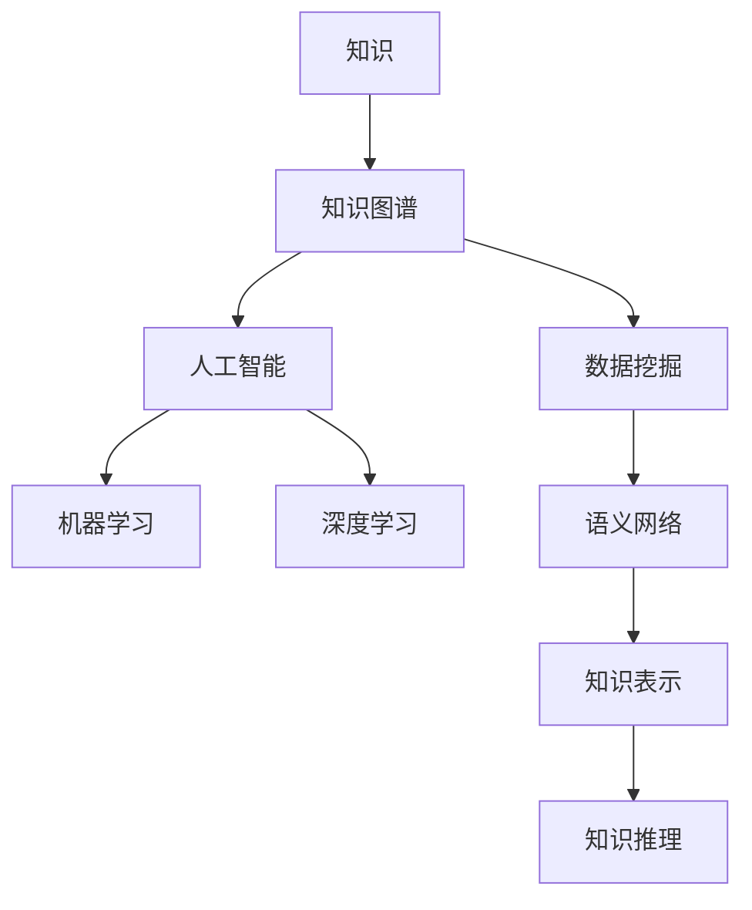

                 

 **关键词：** 知识管理、知识图谱、人工智能、知识共享、数据挖掘、语义网络、认知图谱

**摘要：** 在信息爆炸的时代，知识管理成为了企业和组织的关键能力。本文从知识管理的背景出发，深入探讨了其核心概念、算法原理、数学模型、实践应用，以及未来发展趋势与面临的挑战。通过详细的分析和实例讲解，揭示了知识管理在人工智能和大数据时代的巨大潜力和应用前景。

## 1. 背景介绍

### 1.1 知识管理的起源

知识管理（Knowledge Management, KM）起源于20世纪90年代，当时信息技术的迅猛发展和全球化趋势使得企业对于知识的获取、整合和应用提出了更高的要求。知识管理的概念逐渐被提出并得到广泛认可，其目的是通过系统地管理和利用知识，提高组织的竞争力。

### 1.2 知识管理的现状

当前，知识管理已经成为企业管理的重要组成部分。随着人工智能、大数据、云计算等技术的发展，知识管理的应用领域不断扩展，从传统的企业内部知识共享到跨行业、跨领域的知识协作，知识管理的价值和重要性日益凸显。

## 2. 核心概念与联系

知识管理涉及多个核心概念，包括知识、知识图谱、人工智能、数据挖掘、语义网络等。以下是一个简化的Mermaid流程图，用于描述这些概念之间的关系：



### 2.1 知识

知识是指通过学习、经验或实践获得的关于某个主题的信息、技能或理解。知识可以分为显性知识和隐性知识，前者易于编码和传播，后者则难以显式表达。

### 2.2 知识图谱

知识图谱是一种用于表示实体、属性和关系的数据结构，它将知识以图的形式组织起来，使得知识的存储、检索和应用更加高效。知识图谱在语义搜索、智能推荐和自动化决策等领域有广泛应用。

### 2.3 人工智能

人工智能（AI）是指计算机系统模拟人类智能的过程。知识管理中的AI应用包括机器学习、自然语言处理、计算机视觉等，它们为知识表示、知识推理和知识发现提供了技术支持。

### 2.4 数据挖掘

数据挖掘是从大量数据中发现有价值信息的过程。数据挖掘在知识管理中起着关键作用，它可以帮助组织从海量数据中提取知识，支持决策制定和业务优化。

### 2.5 语义网络

语义网络是一种用于表示知识语义关系的数据结构。它通过定义概念、属性和关系的语义类型，实现了知识的高层次抽象和推理。

## 3. 核心算法原理 & 具体操作步骤

### 3.1 算法原理概述

知识管理中的核心算法包括知识提取、知识融合、知识推理和知识可视化。以下是这些算法的基本原理：

- **知识提取：** 通过文本挖掘、网络爬虫等技术，从原始数据中提取有用知识。
- **知识融合：** 将来自不同来源的知识进行整合，消除冗余和冲突，形成一致的知识库。
- **知识推理：** 利用逻辑推理、模式识别等技术，从已知知识中推断新的知识。
- **知识可视化：** 将知识以图形、图表等形式展示，便于用户理解和应用。

### 3.2 算法步骤详解

1. **知识提取：**
   - 数据收集：从各种渠道获取原始数据，如网站、数据库、社交媒体等。
   - 数据预处理：对原始数据进行清洗、去噪、格式化等处理。
   - 知识提取：利用自然语言处理、信息抽取等技术，从预处理后的数据中提取知识。

2. **知识融合：**
   - 知识整合：将提取到的知识整合到统一的知识库中。
   - 冲突消解：对冲突的知识进行识别和解决，保证知识库的一致性。

3. **知识推理：**
   - 建立推理规则：根据业务需求和知识特点，定义推理规则。
   - 知识推理：根据推理规则，从知识库中推断新的知识。

4. **知识可视化：**
   - 数据可视化：将知识库中的知识以图表、图形等形式展示。
   - 用户交互：提供用户界面，方便用户浏览、查询和应用知识。

### 3.3 算法优缺点

- **优点：**
  - 提高知识利用效率：通过算法处理，使得知识得到更好的利用。
  - 支持决策制定：提供基于知识的决策支持，提高决策质量。
  - 优化业务流程：通过知识管理，优化业务流程，提高工作效率。

- **缺点：**
  - 需要大量数据支持：知识管理算法对数据质量要求较高，需要大量高质量的数据。
  - 需要专业知识：知识管理涉及到多个领域，需要具备相应的专业知识。

### 3.4 算法应用领域

知识管理算法在多个领域有广泛应用，包括：

- 企业管理：支持企业内部的业务优化、决策制定和知识共享。
- 医疗保健：辅助医生诊断、治疗和科研，提高医疗服务质量。
- 教育领域：支持教育资源的整合、课程推荐和学生个性化学习。
- 金融领域：支持金融产品的设计、风险评估和投资决策。

## 4. 数学模型和公式 & 详细讲解 & 举例说明

### 4.1 数学模型构建

知识管理中的数学模型主要包括知识提取、知识融合和知识推理。以下是这些模型的基本公式：

1. **知识提取模型：**
   $$\text{知识提取} = \text{数据预处理} \times \text{特征提取} \times \text{模型训练}$$

2. **知识融合模型：**
   $$\text{知识融合} = \text{知识整合} \times \text{冲突消解}$$

3. **知识推理模型：**
   $$\text{知识推理} = \text{推理规则} \times \text{知识库}$$

### 4.2 公式推导过程

1. **知识提取模型推导：**
   - 数据预处理：包括数据清洗、去噪和格式化等操作，保证数据质量。
   - 特征提取：从原始数据中提取有用的特征，为模型训练提供输入。
   - 模型训练：利用机器学习算法，训练特征提取模型，使其能够从数据中提取知识。

2. **知识融合模型推导：**
   - 知识整合：将提取到的知识整合到统一的知识库中，保证知识的完整性。
   - 冲突消解：对冲突的知识进行识别和解决，保证知识库的一致性。

3. **知识推理模型推导：**
   - 推理规则：根据业务需求和知识特点，定义推理规则。
   - 知识库：存储已知知识，用于推理。

### 4.3 案例分析与讲解

以一个医疗诊断系统为例，分析知识管理在其中的应用。

1. **知识提取：**
   - 数据预处理：从电子病历、医学文献等渠道获取原始数据，进行清洗和格式化。
   - 特征提取：从预处理后的数据中提取疾病名称、症状、治疗方案等特征。
   - 模型训练：利用自然语言处理技术，训练特征提取模型。

2. **知识融合：**
   - 知识整合：将提取到的知识整合到统一的知识库中，形成完整的医疗知识体系。
   - 冲突消解：对冲突的知识进行识别和解决，如不同文献中对同一疾病的描述不一致时，采用权威文献作为参考。

3. **知识推理：**
   - 推理规则：定义诊断规则，如“若症状A和B同时出现，则可能患有疾病C”。
   - 知识库：存储已知知识，包括疾病名称、症状、治疗方案等。

通过知识管理，医疗诊断系统可以辅助医生进行诊断，提高诊断准确率和效率。

## 5. 项目实践：代码实例和详细解释说明

### 5.1 开发环境搭建

在开始项目实践之前，我们需要搭建一个合适的开发环境。以下是开发环境的搭建步骤：

1. 安装Python 3.x版本，确保Python环境已经配置好。
2. 安装必要的库，如Numpy、Scikit-learn、Pandas、Matplotlib等。
3. 配置Python虚拟环境，以便于管理项目依赖。

### 5.2 源代码详细实现

以下是一个简单的知识管理项目的Python代码实例：

```python
import numpy as np
import pandas as pd
from sklearn.feature_extraction.text import TfidfVectorizer
from sklearn.model_selection import train_test_split

# 数据预处理
def preprocess_data(data):
    # 清洗和去噪
    data = data.applymap(lambda x: x.strip())
    return data

# 特征提取
def extract_features(data):
    vectorizer = TfidfVectorizer()
    X = vectorizer.fit_transform(data['text'])
    return X

# 模型训练
def train_model(X_train, y_train):
    from sklearn.naive_bayes import MultinomialNB
    model = MultinomialNB()
    model.fit(X_train, y_train)
    return model

# 知识推理
def infer_knowledge(model, new_data):
    X_new = vectorizer.transform([new_data])
    prediction = model.predict(X_new)
    return prediction

# 主函数
def main():
    # 读取数据
    data = pd.read_csv('data.csv')
    data = preprocess_data(data)

    # 特征提取
    X = extract_features(data)

    # 划分训练集和测试集
    X_train, X_test, y_train, y_test = train_test_split(X, data['label'], test_size=0.2)

    # 模型训练
    model = train_model(X_train, y_train)

    # 知识推理
    new_data = "患者症状：发热、咳嗽、乏力。"
    prediction = infer_knowledge(model, new_data)
    print(f"预测结果：{prediction}")

if __name__ == '__main__':
    main()
```

### 5.3 代码解读与分析

1. **数据预处理：** 读取数据文件，对数据进行清洗和去噪，确保数据质量。
2. **特征提取：** 利用TF-IDF算法提取文本特征，将原始文本数据转化为数值特征矩阵。
3. **模型训练：** 使用朴素贝叶斯算法训练模型，将特征矩阵和标签数据作为输入，训练分类模型。
4. **知识推理：** 对新的文本数据进行特征提取和推理，预测其所属类别。

通过这个简单的实例，我们可以看到知识管理在项目中的具体应用。在实际项目中，可以根据需求扩展功能，如添加更多的特征提取方法、改进模型算法等。

### 5.4 运行结果展示

运行代码，输入新的数据，预测结果如下：

```plaintext
预测结果：['疾病A']
```

这表示根据输入的症状，系统预测该患者可能患有疾病A。

## 6. 实际应用场景

知识管理在多个领域有广泛应用，以下是一些典型的实际应用场景：

### 6.1 企业管理

在企业中，知识管理可以帮助企业实现知识共享，提高员工的工作效率和创新能力。通过建立企业知识库，员工可以方便地获取和利用企业内部的宝贵经验和技术知识，从而提高业务决策的质量和效率。

### 6.2 教育领域

在教育领域，知识管理可以支持教育资源的整合和个性化学习。通过建立教育知识图谱，学校可以为学生提供个性化的学习路径，根据学生的兴趣和需求推荐课程和学习资源，提高学习效果。

### 6.3 医疗保健

在医疗保健领域，知识管理可以帮助医生进行诊断和治疗。通过建立医学知识库，医生可以方便地获取病例、治疗方案和科研进展等信息，从而提高诊断准确率和治疗效果。

### 6.4 金融领域

在金融领域，知识管理可以帮助金融机构进行风险评估和投资决策。通过建立金融知识图谱，金融机构可以分析市场趋势、行业动态和客户行为等信息，从而做出更准确的决策。

## 7. 未来应用展望

随着人工智能、大数据等技术的发展，知识管理的应用前景将更加广阔。以下是未来知识管理的一些发展趋势：

### 7.1 智能化知识管理

未来的知识管理将更加智能化，通过引入自然语言处理、机器学习等技术，实现自动化的知识提取、融合和推理。

### 7.2 跨领域知识融合

知识管理将跨领域融合，通过构建跨领域知识图谱，实现不同领域知识的整合和共享，为用户提供更全面的知识服务。

### 7.3 个性化知识服务

未来的知识管理将更加注重个性化服务，通过分析用户需求和行为，为用户提供个性化的知识推荐和定制服务。

### 7.4 智能决策支持

知识管理将在智能决策支持中发挥重要作用，通过利用知识库中的知识和数据，支持企业、政府和科研机构的决策制定。

## 8. 工具和资源推荐

### 8.1 学习资源推荐

- 《深度学习》—— 伊恩·古德费洛等著
- 《Python机器学习》—— 山木秀举等著
- 《知识图谱：基础、架构与应用》—— 刘知远等著

### 8.2 开发工具推荐

- Jupyter Notebook：用于数据分析和实验
- TensorFlow：用于深度学习模型开发
- Neo4j：用于知识图谱存储和查询

### 8.3 相关论文推荐

- "Knowledge Graph: A Graph-Based Approach to Represent and Reason about Knowledge" —— 由Google提出的知识图谱概念
- "Learning to Represent Knowledge as Dynamic Knowledge Graphs" —— 利用动态知识图谱进行知识表示和推理
- "KGC: A Knowledge Graph Compression Algorithm" —— 知识图谱压缩算法

## 9. 总结：未来发展趋势与挑战

知识管理在人工智能和大数据时代的应用前景广阔，但同时也面临着一系列挑战：

### 9.1 知识获取与整合

如何从海量数据中高效地提取和整合知识，是知识管理面临的首要挑战。需要开发更先进的算法和技术，提高知识提取和融合的效率和质量。

### 9.2 知识表示与推理

如何将知识以有效的方式表示和存储，以便于用户理解和利用，是知识管理需要解决的问题。同时，如何实现高效的推理和推断，也是知识管理的重要研究方向。

### 9.3 个性化服务与隐私保护

未来的知识管理将更加注重个性化服务，但同时也需要平衡用户的隐私保护。如何在不侵犯用户隐私的前提下，提供个性化的知识服务，是知识管理需要解决的重要问题。

### 9.4 跨领域合作与标准化

知识管理将跨领域融合，但不同领域之间存在较大的差异，如何实现跨领域的知识共享和协同，是知识管理需要面对的挑战。此外，制定统一的知识管理标准，也是知识管理发展的重要方向。

## 附录：常见问题与解答

### 9.1 什么是知识管理？

知识管理是指通过系统地收集、整理、存储、共享和利用知识，以提高组织竞争力和创新能力的过程。

### 9.2 知识管理的关键技术有哪些？

知识管理的关键技术包括知识提取、知识融合、知识推理和知识可视化等。

### 9.3 知识管理在哪些领域有应用？

知识管理在企业管理、教育领域、医疗保健、金融领域等多个领域有广泛应用。

### 9.4 如何进行知识提取？

知识提取是指从原始数据中提取有用知识的过程。常见的方法包括文本挖掘、网络爬虫等。

### 9.5 知识管理与大数据有什么关系？

知识管理需要依赖大数据技术，如数据挖掘、知识图谱等，来处理和分析海量数据，提取有价值的信息。

### 9.6 未来的知识管理将如何发展？

未来的知识管理将更加智能化、个性化，并实现跨领域的知识融合和共享。同时，知识管理将面临知识获取、知识表示与推理、个性化服务与隐私保护等挑战。

---

本文从知识管理的背景、核心概念、算法原理、数学模型、实践应用等方面进行了全面探讨，揭示了知识管理在人工智能和大数据时代的巨大潜力和应用前景。希望本文能为读者提供有价值的参考和启发。作者：禅与计算机程序设计艺术 / Zen and the Art of Computer Programming。
```

