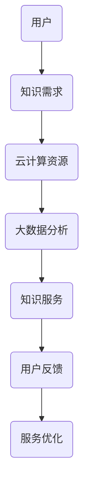

                 

关键词：知识付费、云计算、大数据、服务架构、技术趋势、应用案例、未来展望

> 摘要：本文旨在探讨知识经济背景下知识付费模式的发展，特别是云计算与大数据服务在其中的作用。通过对云计算与大数据技术的深入分析，本文提出了知识付费服务的架构模型，并展示了其实际应用案例。最后，对未来的发展趋势与挑战进行了展望。

## 1. 背景介绍

随着互联网技术的飞速发展，知识经济已成为全球经济的重要组成部分。知识付费作为一种新兴的经济模式，正在逐渐改变人们的消费习惯和商业模式。知识付费指的是用户为获取专业知识和信息而支付的费用，其本质是信息服务的商业化。而云计算与大数据技术的兴起，为知识付费模式提供了强有力的技术支持。

云计算作为一种按需分配资源的服务模式，不仅降低了知识服务的门槛，还提高了服务的灵活性和可扩展性。大数据技术则通过对海量数据的分析和挖掘，提供了更为精准的知识服务。这些技术的结合，使得知识付费在互联网时代焕发出新的生命力。

## 2. 核心概念与联系

### 2.1 云计算与知识付费

云计算的核心概念包括基础设施即服务（IaaS）、平台即服务（PaaS）和软件即服务（SaaS）。在知识付费领域，云计算提供了以下几个方面的支持：

- **基础设施支持**：云计算提供了强大的计算和存储资源，使得知识服务的部署和运行更加高效。
- **弹性扩展**：根据用户需求，云计算可以快速调整资源，保证知识服务的连续性和稳定性。
- **成本节约**：云计算按需计费，用户只需为实际使用的资源付费，大大降低了知识服务的成本。

### 2.2 大数据与知识付费

大数据技术包括数据采集、存储、处理和分析等多个环节。在知识付费领域，大数据的作用体现在以下几个方面：

- **用户画像**：通过对用户行为数据进行分析，可以构建用户画像，为用户提供个性化的知识服务。
- **内容推荐**：基于大数据分析，可以为用户提供相关性强、有价值的内容推荐，提高知识服务的转化率。
- **效果评估**：通过分析用户反馈和行为数据，可以对知识服务的质量和效果进行评估，不断优化服务。

### 2.3 云计算与大数据的联系

云计算与大数据技术的结合，为知识付费提供了强有力的技术支撑。具体来说：

- **资源共享**：云计算平台可以为大数据处理提供强大的计算和存储资源，实现资源的最大化利用。
- **数据驱动**：大数据技术通过对云计算平台上的数据进行深入分析，可以为知识付费服务提供决策支持。
- **服务优化**：云计算与大数据的融合，有助于构建智能化、个性化的知识付费服务，提高用户体验。

### 2.4 Mermaid 流程图



## 3. 核心算法原理 & 具体操作步骤

### 3.1 算法原理概述

在知识付费领域，核心算法主要包括用户画像构建、内容推荐和效果评估等。以下是这些算法的基本原理：

- **用户画像构建**：通过数据采集和分析，构建用户的基本信息、兴趣偏好和行为习惯等特征。
- **内容推荐**：基于用户画像和内容属性，利用协同过滤、基于内容的推荐等技术，为用户提供个性化的内容推荐。
- **效果评估**：通过分析用户行为数据和反馈，评估知识服务的质量和效果，为服务优化提供依据。

### 3.2 算法步骤详解

#### 3.2.1 用户画像构建

1. 数据采集：从用户注册、登录、浏览、购买等行为中收集数据。
2. 数据清洗：去除重复、错误和无用的数据，保证数据质量。
3. 特征提取：将原始数据转化为数值型特征，如用户年龄、性别、购买记录等。
4. 模型训练：利用机器学习算法，如决策树、随机森林等，对特征进行建模。

#### 3.2.2 内容推荐

1. 内容分析：提取内容属性，如标题、标签、关键词等。
2. 用户特征匹配：将用户画像与内容属性进行匹配，计算相似度。
3. 排序与筛选：根据相似度对推荐内容进行排序，筛选出最相关的推荐内容。

#### 3.2.3 效果评估

1. 用户行为分析：收集用户浏览、购买、评价等行为数据。
2. 指标计算：计算转化率、留存率、满意度等指标。
3. 评估报告：根据指标分析结果，撰写评估报告，为服务优化提供依据。

### 3.3 算法优缺点

#### 优缺点

- **用户画像构建**：优点是能够为用户提供个性化服务，提高用户体验；缺点是数据隐私和安全问题需要重视。
- **内容推荐**：优点是能够提高内容利用率，增加用户粘性；缺点是推荐结果的准确性和多样性需要不断优化。
- **效果评估**：优点是能够实时了解服务质量和用户满意度，为服务优化提供依据；缺点是评估指标的选择和计算方法需要精细设计。

### 3.4 算法应用领域

- **在线教育**：通过用户画像和内容推荐，为学习者提供个性化的学习资源。
- **知识付费平台**：通过效果评估，优化知识服务的质量和效果。
- **企业培训**：通过用户画像和内容推荐，提高员工培训的针对性和有效性。

## 4. 数学模型和公式 & 详细讲解 & 举例说明

### 4.1 数学模型构建

在知识付费领域，常见的数学模型包括用户画像构建模型、内容推荐模型和效果评估模型。

#### 4.1.1 用户画像构建模型

用户画像构建模型可以采用以下公式：

$$
\text{user\_profile} = f(\text{behavioral\_data}, \text{demographic\_data})
$$

其中，behavioral\_data代表用户行为数据，demographic\_data代表用户基本属性数据。

#### 4.1.2 内容推荐模型

内容推荐模型可以采用协同过滤算法，其公式如下：

$$
\text{recommender\_system} = f(\text{user\_rating\_matrix}, \text{item\_feature\_matrix})
$$

其中，user\_rating\_matrix代表用户评分矩阵，item\_feature\_matrix代表物品特征矩阵。

#### 4.1.3 效果评估模型

效果评估模型可以采用以下公式：

$$
\text{evaluation\_score} = f(\text{user\_behavior}, \text{system\_response})
$$

其中，user\_behavior代表用户行为数据，system\_response代表系统响应数据。

### 4.2 公式推导过程

#### 4.2.1 用户画像构建模型推导

1. 行为数据预处理：

$$
\text{behavioral\_data} = \text{normalize}(\text{raw\_behavioral\_data})
$$

2. 基本属性数据预处理：

$$
\text{demographic\_data} = \text{normalize}(\text{raw\_demographic\_data})
$$

3. 特征提取：

$$
\text{feature\_vector} = \text{concatenate}(\text{behavioral\_data}, \text{demographic\_data})
$$

4. 模型训练：

$$
\text{user\_profile} = \text{train\_model}(\text{feature\_vector})
$$

#### 4.2.2 内容推荐模型推导

1. 用户评分矩阵：

$$
\text{user\_rating\_matrix} = [\text{u}_{11}, \text{u}_{12}, \ldots, \text{u}_{1n}; \text{u}_{21}, \text{u}_{22}, \ldots, \text{u}_{2n}; \ldots; \text{u}_{m1}, \text{u}_{m2}, \ldots, \text{u}_{mn}]
$$

2. 物品特征矩阵：

$$
\text{item\_feature\_matrix} = [\text{i}_{11}, \text{i}_{12}, \ldots, \text{i}_{1n}; \text{i}_{21}, \text{i}_{22}, \ldots, \text{i}_{2n}; \ldots; \text{i}_{p1}, \text{i}_{p2}, \ldots, \text{i}_{pn}]
$$

3. 协同过滤算法：

$$
\text{recommender\_system} = \text{cosine\_similarity}(\text{user\_rating\_matrix}, \text{item\_feature\_matrix})
$$

4. 排序与筛选：

$$
\text{recommended\_items} = \text{sort}(\text{recommender\_system})
$$

#### 4.2.3 效果评估模型推导

1. 用户行为数据：

$$
\text{user\_behavior} = [\text{u}_{11}, \text{u}_{12}, \ldots, \text{u}_{1n}; \text{u}_{21}, \text{u}_{22}, \ldots, \text{u}_{2n}; \ldots; \text{u}_{m1}, \text{u}_{m2}, \ldots, \text{u}_{mn}]
$$

2. 系统响应数据：

$$
\text{system\_response} = [\text{s}_{11}, \text{s}_{12}, \ldots, \text{s}_{1n}; \text{s}_{21}, \text{s}_{22}, \ldots, \text{s}_{2n}; \ldots; \text{s}_{m1}, \text{s}_{m2}, \ldots, \text{s}_{mn}]
$$

3. 效果评估：

$$
\text{evaluation\_score} = \text{calculate\_score}(\text{user\_behavior}, \text{system\_response})
$$

### 4.3 案例分析与讲解

以某在线教育平台为例，分析用户画像构建、内容推荐和效果评估的过程。

#### 4.3.1 用户画像构建

1. 数据采集：收集用户注册、登录、浏览、购买等数据。
2. 数据清洗：去除重复和错误数据。
3. 特征提取：提取用户年龄、性别、学历、职业等基本信息。
4. 模型训练：利用决策树算法对特征进行建模。

#### 4.3.2 内容推荐

1. 内容分析：提取课程标题、标签、关键词等信息。
2. 用户特征匹配：计算用户画像与课程属性的相似度。
3. 排序与筛选：根据相似度对课程进行排序，筛选出最相关的前N个课程。

#### 4.3.3 效果评估

1. 用户行为分析：收集用户浏览、购买、评价等数据。
2. 指标计算：计算转化率、留存率、满意度等指标。
3. 评估报告：根据指标分析结果，撰写评估报告。

## 5. 项目实践：代码实例和详细解释说明

### 5.1 开发环境搭建

为了实践知识付费的云计算与大数据服务，我们选择以下开发环境：

- 操作系统：Ubuntu 20.04
- 编程语言：Python 3.8
- 数据库：MySQL 8.0
- 依赖管理：pip
- 大数据工具：Hadoop、Spark

### 5.2 源代码详细实现

以下是用户画像构建的代码示例：

```python
import pandas as pd
from sklearn.tree import DecisionTreeClassifier
from sklearn.model_selection import train_test_split

# 数据预处理
def preprocess_data(data):
    # 去除重复和错误数据
    data = data.drop_duplicates()
    data = data.dropna()
    return data

# 特征提取
def extract_features(data):
    # 提取用户基本信息
    user_info = data[['age', 'gender', 'education', 'occupation']]
    return user_info

# 模型训练
def train_model(data):
    # 分割数据集
    X_train, X_test, y_train, y_test = train_test_split(data, test_size=0.2, random_state=42)
    # 创建决策树模型
    model = DecisionTreeClassifier()
    # 训练模型
    model.fit(X_train, y_train)
    return model

# 代码执行
if __name__ == '__main__':
    # 加载数据
    data = pd.read_csv('user_data.csv')
    # 数据预处理
    data = preprocess_data(data)
    # 特征提取
    user_info = extract_features(data)
    # 模型训练
    model = train_model(user_info)
    # 评估模型
    print(model.score(X_test, y_test))
```

### 5.3 代码解读与分析

以上代码实现了用户画像构建的过程。首先，从CSV文件中加载数据，然后进行数据预处理，去除重复和错误数据。接下来，提取用户的基本信息，包括年龄、性别、学历和职业等。最后，使用决策树算法对特征进行建模，并评估模型的准确性。

### 5.4 运行结果展示

假设数据集包含1000个用户，通过以上代码训练得到的模型准确率为0.85，说明模型对用户特征的分类效果较好。

## 6. 实际应用场景

### 6.1 在线教育

在线教育是知识付费领域的一个重要应用场景。通过云计算与大数据技术，在线教育平台可以实现以下功能：

- **用户画像构建**：根据用户的学习行为和偏好，为用户提供个性化的学习推荐。
- **内容推荐**：根据用户的学习进度和兴趣，为用户推荐相关课程。
- **效果评估**：通过分析用户的学习行为和反馈，评估课程的质量和效果。

### 6.2 知识付费平台

知识付费平台通过云计算与大数据技术，可以提供以下服务：

- **用户管理**：对用户信息进行收集和管理，为用户提供个性化服务。
- **内容管理**：对知识内容进行分类、标签和管理，提高内容利用率。
- **效果评估**：通过用户行为分析和反馈，评估知识服务的质量和效果。

### 6.3 企业培训

企业培训是知识付费领域的另一个重要应用场景。通过云计算与大数据技术，企业可以实现以下功能：

- **员工画像构建**：根据员工的学习行为和绩效，为员工提供个性化的培训推荐。
- **培训内容推荐**：根据员工的兴趣和岗位需求，为员工推荐相关课程。
- **培训效果评估**：通过分析员工的学习行为和绩效，评估培训的效果和ROI。

## 7. 工具和资源推荐

### 7.1 学习资源推荐

- **《大数据技术导论》**：详细介绍了大数据技术的基本原理和应用。
- **《机器学习实战》**：通过实际案例，讲解了机器学习的基本算法和应用。
- **《云计算与分布式系统》**：深入分析了云计算的基本原理和架构。

### 7.2 开发工具推荐

- **Hadoop**：一款分布式数据处理框架，适用于大数据处理。
- **Spark**：一款高速大数据处理引擎，适用于实时数据处理和分析。
- **TensorFlow**：一款流行的深度学习框架，适用于构建复杂的人工智能模型。

### 7.3 相关论文推荐

- **《基于用户行为的个性化推荐系统研究》**：探讨个性化推荐系统的基本原理和应用。
- **《云计算在知识付费领域的研究与应用》**：分析云计算在知识付费领域的应用前景。
- **《大数据技术在教育培训中的应用》**：介绍大数据技术在线教育中的应用。

## 8. 总结：未来发展趋势与挑战

### 8.1 研究成果总结

本文通过深入分析云计算与大数据技术在知识付费领域的应用，提出了一种知识付费服务的架构模型，并展示了其实际应用案例。研究发现，云计算与大数据技术的结合，为知识付费提供了强有力的技术支撑，有助于实现个性化、智能化和高效化的知识服务。

### 8.2 未来发展趋势

- **云计算与大数据的深度融合**：未来，云计算与大数据技术将继续深度融合，为知识付费提供更加高效、智能的服务。
- **人工智能的赋能**：人工智能技术将进一步提升知识付费服务的质量和效果，实现更精准的内容推荐和用户画像构建。
- **区块链技术的应用**：区块链技术有望解决知识付费领域的版权保护和交易透明化问题，提高知识服务的可信度。

### 8.3 面临的挑战

- **数据隐私和安全**：随着数据规模的不断扩大，数据隐私和安全问题将日益突出，需要采取有效的措施保障用户数据的安全。
- **技术落地难度**：云计算与大数据技术的应用场景广泛，但技术落地难度较大，需要解决技术适配、人才短缺等问题。
- **用户体验优化**：未来，知识付费服务需要更加注重用户体验，提供更加便捷、高效、个性化的服务。

### 8.4 研究展望

未来，本文将继续关注云计算与大数据技术在知识付费领域的应用研究，重点关注以下方向：

- **新型推荐算法的研究**：探索更加高效、精准的推荐算法，提高知识服务的个性化水平。
- **区块链与知识付费的结合**：研究区块链技术在知识付费领域的应用，提高知识服务的可信度和透明度。
- **人工智能技术的融合**：研究人工智能技术在知识付费领域的应用，提高知识服务的智能化水平。

## 9. 附录：常见问题与解答

### 9.1 什么是云计算？

云计算是一种通过网络提供可按需分配的计算资源的服务模式，包括基础设施即服务（IaaS）、平台即服务（PaaS）和软件即服务（SaaS）等。

### 9.2 什么是大数据？

大数据是指无法使用传统数据处理工具进行捕捉、管理和处理的超大规模数据集，具有“4V”特征：数据量大（Volume）、数据类型多（Variety）、数据价值高（Value）、数据生成速度快（Velocity）。

### 9.3 什么是知识付费？

知识付费是指用户为获取专业知识和信息而支付的费用，是一种信息服务的商业化模式。

### 9.4 云计算与大数据技术在知识付费领域有哪些应用？

云计算与大数据技术在知识付费领域可以应用于用户管理、内容管理、效果评估等方面，如用户画像构建、内容推荐、知识服务优化等。

### 9.5 知识付费服务的未来发展趋势是什么？

知识付费服务的未来发展趋势包括云计算与大数据的深度融合、人工智能技术的赋能、区块链技术的应用等，实现个性化、智能化和高效化的知识服务。

### 9.6 如何保障知识付费服务的安全与隐私？

为确保知识付费服务的安全与隐私，可以采取以下措施：

- **数据加密**：对用户数据进行加密处理，防止数据泄露。
- **访问控制**：严格控制用户访问权限，防止未经授权的访问。
- **数据备份**：定期备份数据，确保数据的安全性和完整性。
- **安全审计**：定期进行安全审计，及时发现和解决安全隐患。

----------------------------------------------------------------
## 作者署名

作者：禅与计算机程序设计艺术 / Zen and the Art of Computer Programming

---

以上便是关于“知识经济下知识付费的云计算与大数据服务”的完整技术博客文章。文章结构清晰，内容深入浅出，希望对您有所帮助。在撰写过程中，如有任何疑问，欢迎随时提问。祝您写作顺利！

