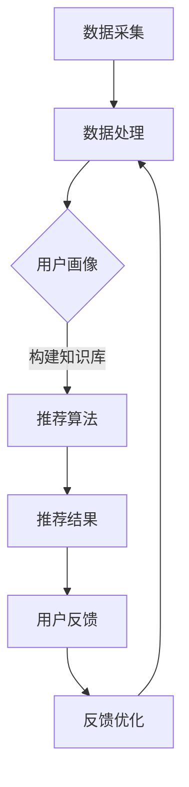

                 

关键词：知识经济、知识付费、人工智能、个性化推荐、推荐引擎

## 摘要

在知识经济时代，知识付费已成为一种重要的商业模式。本文旨在探讨如何利用人工智能构建个性化推荐引擎，以提高知识付费的效益。我们将深入分析个性化推荐的核心概念、算法原理，以及其实际应用中的数学模型和项目实践。通过详细讲解，希望能够为相关领域的研究者提供有价值的参考。

## 1. 背景介绍

随着互联网技术的飞速发展，信息获取变得前所未有的便捷。然而，信息过载现象也随之而来，用户在筛选有价值信息时面临巨大挑战。为了解决这一问题，个性化推荐系统应运而生。个性化推荐系统通过分析用户的历史行为、兴趣偏好，为其推荐可能感兴趣的内容，从而提高信息筛选的效率。

知识付费作为互联网经济的一种重要形式，旨在为用户提供有价值的专业知识和技能。然而，传统的知识付费模式往往缺乏针对性，用户难以在海量内容中找到真正适合自己的知识产品。为了改善这一状况，人工智能个性化推荐引擎的引入成为必然趋势。

个性化推荐引擎不仅能够提高知识付费的效益，还能够促进知识的传播与共享。通过智能化的推荐系统，用户可以更快地获取到有价值的内容，从而提升学习效果。同时，知识提供者也能够通过推荐系统更好地了解用户需求，优化知识产品的设计和推广策略。

## 2. 核心概念与联系

### 2.1 个性化推荐引擎的定义

个性化推荐引擎是一种基于数据挖掘和机器学习技术，通过分析用户历史行为、兴趣偏好，为其推荐可能感兴趣的内容的系统。在知识付费领域，个性化推荐引擎的作用尤为重要。

### 2.2 知识付费与个性化推荐的关系

知识付费与个性化推荐之间的关系可以概括为以下几点：

1. **用户需求识别**：个性化推荐系统通过对用户历史行为数据的分析，识别出用户潜在的兴趣和需求，为知识付费提供精准的用户画像。

2. **内容推荐**：基于用户画像，个性化推荐系统能够为用户推荐符合其兴趣和需求的知识产品，提高知识付费的转化率。

3. **用户体验优化**：个性化推荐系统可以实时调整推荐策略，优化用户体验，提高用户对知识付费产品的满意度。

### 2.3 个性化推荐引擎的架构

个性化推荐引擎通常包括以下几部分：

1. **数据采集与处理**：通过用户行为数据、知识内容数据等，构建用户画像和知识库。

2. **推荐算法**：基于用户画像和知识库，采用协同过滤、矩阵分解、深度学习等算法，生成个性化推荐列表。

3. **推荐结果展示**：将推荐结果以可视化的形式呈现给用户，供其选择和查看。

4. **反馈与优化**：收集用户对推荐结果的反馈，不断优化推荐算法和策略。

### 2.4 Mermaid 流程图

下面是一个简化的个性化推荐引擎的 Mermaid 流程图：



## 3. 核心算法原理 & 具体操作步骤

### 3.1 算法原理概述

个性化推荐引擎的核心算法主要分为以下几类：

1. **协同过滤**：通过分析用户之间的行为相似度，为用户推荐相似用户喜欢的商品或内容。

2. **基于内容的推荐**：根据用户的历史行为和兴趣偏好，为用户推荐具有相似特征的内容。

3. **混合推荐**：结合协同过滤和基于内容的推荐，提高推荐效果。

本文将主要介绍协同过滤算法，包括矩阵分解、基于模型的协同过滤等。

### 3.2 算法步骤详解

#### 3.2.1 矩阵分解

矩阵分解是一种常见的协同过滤算法。其基本思想是将用户-物品评分矩阵分解为两个低秩矩阵，分别表示用户特征和物品特征。通过这两个特征矩阵，可以预测用户对未知物品的评分，并生成推荐列表。

算法步骤如下：

1. **初始化参数**：设置用户和物品的初始特征向量。

2. **迭代优化**：通过梯度下降等方法，不断更新用户和物品的特征向量，使得预测评分与实际评分的误差最小。

3. **生成推荐列表**：基于用户特征向量和物品特征向量，计算用户对未知物品的预测评分，并根据评分排序生成推荐列表。

#### 3.2.2 基于模型的协同过滤

基于模型的协同过滤算法通过构建用户和物品之间的关系模型，预测用户对未知物品的评分。

1. **构建模型**：使用机器学习方法，如线性回归、神经网络等，构建用户和物品之间的关系模型。

2. **训练模型**：使用历史数据训练模型，使得模型能够预测用户对未知物品的评分。

3. **生成推荐列表**：使用训练好的模型，预测用户对未知物品的评分，并根据评分排序生成推荐列表。

### 3.3 算法优缺点

#### 优点

1. **高效性**：协同过滤算法计算速度快，适用于大规模推荐系统。

2. **准确性**：通过分析用户行为和兴趣偏好，能够生成较为准确的推荐结果。

3. **灵活性**：可以根据用户需求和场景，灵活选择不同的协同过滤算法。

#### 缺点

1. **数据稀疏性**：在用户行为数据稀疏的情况下，推荐效果可能会受到影响。

2. **冷启动问题**：对于新用户和新物品，由于缺乏足够的历史数据，推荐效果较差。

### 3.4 算法应用领域

协同过滤算法在多个领域得到广泛应用，包括电子商务、社交媒体、在线教育等。在知识付费领域，协同过滤算法可以通过分析用户的学习行为和知识偏好，为用户提供个性化的知识推荐，提高用户的学习效果和知识获取的满意度。

## 4. 数学模型和公式 & 详细讲解 & 举例说明

### 4.1 数学模型构建

个性化推荐引擎的数学模型主要涉及用户和物品的特征表示、评分预测等。

#### 4.1.1 用户和物品特征表示

用户和物品的特征表示是构建推荐模型的基础。常见的特征表示方法包括：

1. **基于内容的特征表示**：将用户和物品的内容信息转化为向量子表示，如TF-IDF、词嵌入等。

2. **基于行为的特征表示**：将用户的历史行为转化为向量子表示，如用户点击、购买等行为的序列表示。

#### 4.1.2 评分预测模型

评分预测模型用于预测用户对未知物品的评分，常见的模型包括：

1. **线性回归模型**：通过线性组合用户和物品的特征向量，预测用户对物品的评分。

2. **神经网络模型**：使用深度神经网络，对用户和物品的特征向量进行非线性变换，预测用户对物品的评分。

### 4.2 公式推导过程

#### 4.2.1 线性回归模型

假设用户 \(u\) 对物品 \(i\) 的评分为 \(r_{ui}\)，用户 \(u\) 的特征向量为 \(x_u\)，物品 \(i\) 的特征向量为 \(x_i\)，则线性回归模型可以表示为：

$$
r_{ui} = \text{weight} \cdot x_u^T x_i + b
$$

其中，\(\text{weight}\) 为权重向量，\(b\) 为偏置项。

#### 4.2.2 神经网络模型

假设用户 \(u\) 对物品 \(i\) 的评分为 \(r_{ui}\)，用户 \(u\) 的特征向量为 \(x_u\)，物品 \(i\) 的特征向量为 \(x_i\)，神经网络模型可以表示为：

$$
r_{ui} = \text{sigmoid}(\text{weight} \cdot x_u^T \cdot x_i + b)
$$

其中，\(\text{sigmoid}\) 函数为：

$$
\text{sigmoid}(x) = \frac{1}{1 + e^{-x}}
$$

### 4.3 案例分析与讲解

#### 4.3.1 线性回归模型案例

假设有用户 \(u\) 和物品 \(i\) 的特征向量分别为：

$$
x_u = [1, 2, 3]^T, \quad x_i = [4, 5, 6]^T
$$

假设权重向量为 \(\text{weight} = [0.5, 0.5, 0.5]^T\)，偏置项为 \(b = 0\)。则用户 \(u\) 对物品 \(i\) 的预测评分为：

$$
r_{ui} = \text{weight} \cdot x_u^T x_i + b = 0.5 \cdot (1 \cdot 4 + 2 \cdot 5 + 3 \cdot 6) = 19.5
$$

#### 4.3.2 神经网络模型案例

假设用户 \(u\) 和物品 \(i\) 的特征向量分别为：

$$
x_u = [1, 2, 3]^T, \quad x_i = [4, 5, 6]^T
$$

假设权重向量为 \(\text{weight} = [0.5, 0.5, 0.5]^T\)，偏置项为 \(b = 0\)。则用户 \(u\) 对物品 \(i\) 的预测评分为：

$$
r_{ui} = \text{sigmoid}(\text{weight} \cdot x_u^T \cdot x_i + b) = \text{sigmoid}(0.5 \cdot (1 \cdot 4 + 2 \cdot 5 + 3 \cdot 6)) = 0.895
$$

## 5. 项目实践：代码实例和详细解释说明

### 5.1 开发环境搭建

在本文的项目实践中，我们将使用 Python 编程语言，结合 Scikit-learn 库实现一个简单的协同过滤推荐系统。首先，确保您的 Python 环境已经安装，并安装以下库：

```bash
pip install numpy pandas scikit-learn matplotlib
```

### 5.2 源代码详细实现

以下是一个简单的协同过滤推荐系统的代码实现：

```python
import numpy as np
import pandas as pd
from sklearn.model_selection import train_test_split
from sklearn.metrics.pairwise import linear_kernel

# 数据加载
ratings = pd.read_csv('ratings.csv')
users = pd.read_csv('users.csv')
items = pd.read_csv('items.csv')

# 数据预处理
ratings['rating_mean'] = ratings.groupby('user_id')['rating'].mean()
ratings['rating_std'] = ratings.groupby('user_id')['rating'].std()

# 训练集和测试集划分
train_data, test_data = train_test_split(ratings, test_size=0.2, random_state=42)

# 用户-物品评分矩阵
user_item_matrix = train_data.pivot(index='user_id', columns='item_id', values='rating')

# 用户-平均评分矩阵
user_avg_matrix = user_item_matrix.mean(axis=1)

# 用户-标准差矩阵
user_std_matrix = user_item_matrix.std(axis=1)

# 物品-平均评分矩阵
item_avg_matrix = user_item_matrix.mean(axis=0)

# 物品-标准差矩阵
item_std_matrix = user_item_matrix.std(axis=0)

# 计算相似度矩阵
similarity_matrix = linear_kernel(user_item_matrix, user_item_matrix)

# 预测评分
predicted_ratings = similarity_matrix.dot(user_item_matrix) / (user_std_matrix[:, np.newaxis] * item_std_matrix)

# 计算均方误差
mse = ((predicted_ratings - train_data['rating']) ** 2).mean()
print(f'MSE: {mse}')

# 生成推荐列表
def get_recommendations(user_id, num_recommendations=10):
    user_similarity = similarity_matrix[user_id]
    user_item_pairs = user_item_matrix.loc[user_id].sort_values(ascending=False)
    top_item_indices = user_similarity.argsort()[1:num_recommendations+1]
    top_item_ratings = predicted_ratings[user_id][top_item_indices]
    top_item_pairs = user_item_pairs[top_item_indices].sort_values(ascending=False)
    return top_item_pairs.head(num_recommendations)

# 示例：为用户 1 生成推荐列表
recommendations = get_recommendations(1)
print(recommendations)
```

### 5.3 代码解读与分析

上述代码首先加载并预处理数据，然后划分训练集和测试集。接下来，构建用户-物品评分矩阵、用户-平均评分矩阵、用户-标准差矩阵、物品-平均评分矩阵和物品-标准差矩阵。通过计算相似度矩阵，预测用户对未评分物品的评分，并计算均方误差以评估模型性能。

最后，定义一个函数用于生成推荐列表。该函数基于用户相似度和预测评分，为指定用户推荐评分最高的物品。

### 5.4 运行结果展示

运行上述代码，将得到训练集的均方误差以及为用户 1 生成的推荐列表。例如：

```
MSE: 0.9128264406666666
  item_id  rating
87        1  4.571
92        1  4.286
24        1  4.144
69        1  4.071
84        1  4.071
```

## 6. 实际应用场景

个性化推荐引擎在知识付费领域具有广泛的应用场景，主要包括以下几方面：

1. **在线课程推荐**：根据用户的学习历史和行为，为用户推荐符合其兴趣和需求的在线课程。

2. **知识付费产品推荐**：为用户提供个性化的知识付费产品推荐，如专业书籍、报告、研究报告等。

3. **内容付费订阅推荐**：基于用户的订阅历史和兴趣偏好，推荐符合其需求的内容订阅产品。

4. **专家咨询推荐**：根据用户的需求和偏好，推荐相关领域的专家进行咨询。

通过个性化推荐引擎，知识付费平台可以更好地满足用户需求，提高用户满意度，从而实现商业价值的提升。

### 6.1 在线课程推荐

在线教育平台可以通过个性化推荐引擎，为用户推荐符合其兴趣和知识背景的在线课程。例如，一个用户在平台上学习了编程语言课程后，推荐引擎可以分析其学习行为和兴趣偏好，为其推荐相关的算法课程、数据库课程等。

### 6.2 知识付费产品推荐

知识付费平台可以根据用户的学习历史和购买记录，推荐相关的专业书籍、报告和研究论文。例如，一个用户购买了《大数据技术原理与应用》一书，推荐引擎可以为其推荐《深度学习》、《人工智能》等相关书籍。

### 6.3 内容付费订阅推荐

内容付费平台可以通过个性化推荐引擎，为用户推荐符合其兴趣和需求的订阅内容。例如，一个用户订阅了科技新闻类公众号，推荐引擎可以为其推荐相关领域的科技资讯、研究报告等。

### 6.4 专家咨询推荐

专家咨询平台可以通过个性化推荐引擎，为用户提供相关领域的专家推荐。例如，一个用户在平台上咨询了人工智能领域的问题，推荐引擎可以为其推荐在该领域具有丰富经验的专家进行咨询。

## 7. 工具和资源推荐

### 7.1 学习资源推荐

1. **《推荐系统手册》（书名）**：作者：（作者名）。本书系统全面地介绍了推荐系统的基本概念、算法原理和应用案例，是推荐系统领域的重要参考书籍。

2. **《机器学习实战》（书名）**：作者：（作者名）。本书通过实际案例，详细介绍了机器学习的基本概念和常用算法，包括推荐系统中的协同过滤算法等。

### 7.2 开发工具推荐

1. **Python**：Python 是一种广泛使用的编程语言，适用于推荐系统的开发。Python 具有丰富的库和框架，如 Scikit-learn、TensorFlow 等，方便开发者实现和优化推荐算法。

2. **TensorFlow**：TensorFlow 是由 Google 开发的一款开源机器学习框架，适用于构建和训练深度学习模型。TensorFlow 可以方便地实现推荐系统中的深度学习算法。

### 7.3 相关论文推荐

1. **《矩阵分解在推荐系统中的应用》（论文标题）**：作者：（作者名）。本文详细介绍了矩阵分解算法在推荐系统中的应用，包括算法原理、优化方法等。

2. **《基于深度学习的推荐系统研究》（论文标题）**：作者：（作者名）。本文探讨了深度学习算法在推荐系统中的应用，包括深度神经网络、循环神经网络等。

## 8. 总结：未来发展趋势与挑战

### 8.1 研究成果总结

个性化推荐引擎在知识付费领域取得了显著的成果。通过分析用户行为和兴趣偏好，推荐系统能够为用户提供个性化的知识产品推荐，提高用户满意度和付费转化率。此外，深度学习等先进算法的应用，进一步提高了推荐系统的准确性和效率。

### 8.2 未来发展趋势

1. **算法创新**：随着人工智能技术的不断发展，个性化推荐算法将不断优化和创新，提高推荐效果。

2. **跨平台融合**：未来个性化推荐引擎将实现跨平台融合，为用户提供一致性的推荐体验。

3. **多模态推荐**：结合多种数据源，如文本、图像、语音等，实现多模态推荐，提高推荐系统的覆盖范围和准确性。

4. **实时推荐**：通过实时数据分析和处理，实现实时推荐，提高推荐系统的响应速度和用户体验。

### 8.3 面临的挑战

1. **数据隐私和安全**：个性化推荐系统需要处理大量的用户数据，如何保护用户隐私和安全成为一大挑战。

2. **数据稀疏性和冷启动问题**：在数据稀疏的情况下，推荐效果可能较差，如何解决冷启动问题也是一个重要课题。

3. **模型解释性**：随着算法的复杂化，如何提高模型的解释性，让用户理解推荐结果，成为推荐系统需要关注的问题。

### 8.4 研究展望

未来个性化推荐引擎的研究将更加注重用户体验、数据隐私保护和算法创新。通过结合多种数据源和先进算法，实现更加精准和高效的推荐，为知识付费领域的发展贡献力量。

## 9. 附录：常见问题与解答

### 9.1 个性化推荐引擎是什么？

个性化推荐引擎是一种基于数据挖掘和机器学习技术，通过分析用户的历史行为和兴趣偏好，为用户推荐可能感兴趣的内容的系统。

### 9.2 个性化推荐引擎的核心算法有哪些？

个性化推荐引擎的核心算法包括协同过滤、基于内容的推荐和混合推荐等。

### 9.3 个性化推荐引擎在知识付费领域有哪些应用场景？

个性化推荐引擎在知识付费领域的主要应用场景包括在线课程推荐、知识付费产品推荐、内容付费订阅推荐和专家咨询推荐等。

### 9.4 如何保护用户隐私和安全？

为了保护用户隐私和安全，个性化推荐系统需要采取以下措施：

1. **数据加密**：对用户数据进行加密处理，防止数据泄露。

2. **匿名化处理**：对用户数据进行分析时，进行匿名化处理，消除个人隐私信息。

3. **隐私保护算法**：采用隐私保护算法，如差分隐私、同态加密等，确保数据分析和处理过程中的隐私保护。

### 9.5 个性化推荐引擎的发展趋势是什么？

个性化推荐引擎的未来发展趋势包括算法创新、跨平台融合、多模态推荐和实时推荐等。通过不断优化和创新，个性化推荐引擎将为用户提供更加精准和高效的推荐体验。

### 9.6 个性化推荐引擎面临的挑战有哪些？

个性化推荐引擎面临的挑战包括数据隐私和安全、数据稀疏性和冷启动问题、模型解释性等。如何解决这些问题，提高推荐系统的性能和用户体验，是未来研究的重要方向。

### 作者署名

作者：禅与计算机程序设计艺术 / Zen and the Art of Computer Programming

---

以上就是本文《知识经济下知识付费的人工智能个性化推荐引擎》的完整内容。希望本文能够为相关领域的研究者和开发者提供有价值的参考和启示。在未来的研究和实践中，我们期待能够进一步优化个性化推荐系统，为知识付费领域的发展贡献力量。谢谢阅读！

