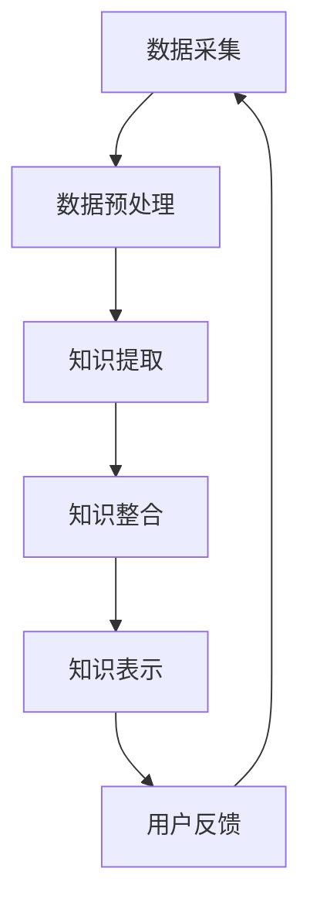

                 

关键词：知识经济，知识付费，人工智能，知识总结，技术发展，算法模型，代码实践

## 摘要

在知识经济时代，知识付费已成为推动经济增长的重要动力。人工智能技术的迅速发展为知识付费市场提供了全新的解决方案——知识总结技术。本文旨在探讨知识总结技术的核心概念、原理和算法，并通过实际项目实践，展示其在知识付费领域中的应用与价值。文章还将分析知识总结技术的未来发展趋势与面临的挑战，为相关领域的研究和实践提供参考。

## 1. 背景介绍

### 知识经济的崛起

知识经济是一种以知识为主要生产要素的经济形态，其核心特征在于知识创造、传播和应用的速度和效率。随着信息技术的飞速发展，尤其是互联网的普及，知识经济已经逐渐成为全球经济的主导力量。知识的价值得到前所未有的重视，知识付费市场应运而生，成为知识经济的重要组成部分。

### 知识付费的兴起

知识付费是指消费者为了获取特定的知识或技能而支付的费用。随着人们对自我提升需求的增加，知识付费市场呈现出爆炸式增长。线上课程、电子书籍、专业知识咨询等服务成为知识付费的主要形式，为广大知识提供者和消费者提供了便捷的互动平台。

### 人工智能的崛起

人工智能（AI）作为一门前沿技术，正深刻改变着各行各业。AI通过模拟、延伸和扩展人类智能，能够自动识别、理解和处理复杂的信息，为知识总结提供了强大的技术支持。知识总结技术的兴起，为人工智能在知识付费领域的应用开辟了新的路径。

## 2. 核心概念与联系

### 2.1 知识总结的定义

知识总结是指通过对大量知识素材进行加工、提炼和整合，生成具有概括性和系统性的知识体系。知识总结的目标是提高知识的可理解性、可用性和共享性，为知识付费市场提供高质量的知识产品。

### 2.2 人工智能与知识总结的联系

人工智能技术为知识总结提供了强大的数据处理和模式识别能力。通过自然语言处理、机器学习和深度学习等技术，AI能够从海量数据中提取有用信息，生成结构化的知识表示，为知识总结提供了技术保障。

### 2.3 知识总结技术的架构

知识总结技术主要包括数据采集、数据预处理、知识提取、知识整合和知识表示等环节。数据采集是指收集与目标知识主题相关的数据素材；数据预处理包括数据清洗、数据去重和数据标准化等步骤；知识提取是指利用AI技术从数据中提取有用信息；知识整合是将提取的知识进行整合和优化，形成系统化的知识体系；知识表示是将知识以易于理解的形式展示给用户。

## 2.4 Mermaid流程图



### 2.5 知识总结技术的重要性

知识总结技术不仅提高了知识付费产品的质量和用户体验，还促进了知识的共享和传播。通过知识总结，知识提供者可以更高效地创造和传递知识，消费者可以更便捷地获取所需知识，从而实现知识价值的最大化。

## 3. 核心算法原理 & 具体操作步骤

### 3.1 算法原理概述

知识总结技术主要依赖于以下核心算法：

1. **自然语言处理（NLP）**：用于对文本数据进行分析和理解，提取关键信息和语义关系。
2. **机器学习（ML）**：用于从数据中学习模式和规律，生成预测模型和分类模型。
3. **深度学习（DL）**：用于处理复杂的数据结构和任务，如图像识别、语音识别和自然语言生成等。

### 3.2 算法步骤详解

1. **数据采集**：从互联网、数据库和其他数据源收集与目标知识主题相关的文本数据。
2. **数据预处理**：对收集到的文本数据进行清洗、去重和标准化处理，确保数据质量。
3. **文本分析**：使用NLP技术对预处理后的文本进行词性标注、句法分析和语义分析，提取关键信息和语义关系。
4. **知识提取**：利用机器学习和深度学习算法，从文本数据中提取知识点、关系和属性。
5. **知识整合**：将提取的知识点进行整合和优化，构建系统化的知识体系。
6. **知识表示**：将整合后的知识以易于理解的形式展示给用户，如文本、图表和多媒体等。

### 3.3 算法优缺点

**优点**：

1. **高效性**：知识总结技术可以快速处理大量数据，提高知识提取的效率。
2. **准确性**：基于AI技术的知识提取具有高准确性，能够更好地捕捉数据的本质特征。
3. **可扩展性**：知识总结技术可以轻松扩展到不同领域和任务，适应不断变化的需求。

**缺点**：

1. **数据依赖性**：知识总结技术对数据质量有较高要求，数据缺失或不准确会影响知识提取的准确性。
2. **算法复杂性**：知识总结技术涉及到多种复杂算法，对算法设计和优化要求较高。

### 3.4 算法应用领域

知识总结技术广泛应用于以下领域：

1. **教育**：为学生提供个性化学习资源，提高学习效果。
2. **企业培训**：为企业员工提供定制化的培训课程，提升员工技能。
3. **医疗**：为医生提供辅助诊断和治疗建议，提高医疗服务质量。
4. **法律咨询**：为律师提供法律知识库，辅助案件分析和决策。

## 4. 数学模型和公式 & 详细讲解 & 举例说明

### 4.1 数学模型构建

知识总结技术主要涉及以下数学模型：

1. **词袋模型（Bag of Words, BoW）**：用于表示文本数据，将文本转换为词频向量。
2. **主题模型（Latent Dirichlet Allocation, LDA）**：用于发现文本中的潜在主题，提取文本的隐含结构。
3. **卷积神经网络（Convolutional Neural Network, CNN）**：用于处理图像和文本数据，提取特征并生成预测模型。

### 4.2 公式推导过程

**词袋模型（BoW）**：

假设有一个词汇表V，包含n个词汇。给定一个文档集合D，其中每个文档d∈D由一个词汇序列组成，我们可以使用向量表示每个文档：

$$
\textbf{x}_d = \text{vec}(\text{count}_d)
$$

其中，$\text{count}_d$ 是一个长度为n的向量，表示文档d中每个词汇的词频。

**主题模型（LDA）**：

假设有一个词汇表V，包含n个词汇。给定一个文档集合D，其中每个文档d∈D由一个词汇序列组成，我们可以使用以下概率模型表示文档：

$$
\text{P}(\textbf{x}|\textbf{\alpha}, \textbf{\beta}) = \prod_{d=1}^{D} \prod_{w=1}^{V} \text{P}(\textbf{x}_{dw}|\textbf{\alpha}_{d}, \textbf{\beta}_{w})
$$

其中，$\textbf{\alpha}_{d}$ 和 $\textbf{\beta}_{w}$ 分别表示文档d和词汇w的主题分布。

**卷积神经网络（CNN）**：

假设输入数据是一个三维的张量 $X \in \mathbb{R}^{n \times m \times p}$，其中 $n$ 是样本数量，$m$ 是特征维度，$p$ 是时间步长。给定一个卷积核 $K \in \mathbb{R}^{k \times m}$，其中 $k$ 是卷积核的大小，我们可以使用以下卷积运算：

$$
h_{ij}^{(l)} = \sum_{i'} \sum_{j'} X_{i'j'}^{(l-1)} \times W_{i'-ij'}^{(l)}
$$

其中，$h_{ij}^{(l)}$ 是第l层第i行第j列的输出特征，$W_{i'-ij'}^{(l)}$ 是第l层第i行第j列的权重。

### 4.3 案例分析与讲解

**案例**：使用LDA模型提取文本数据中的潜在主题。

**步骤**：

1. 收集一组文本数据，如新闻报道、科技论文等。
2. 对文本数据进行预处理，包括分词、去停用词、词干提取等。
3. 构建词汇表V，并计算每个文档的词频矩阵$\text{count}_d$。
4. 使用LDA模型对词频矩阵进行建模，发现潜在主题。
5. 分析主题分布，提取具有代表性的主题。

**代码示例**：

```python
import gensim

# 1. 数据预处理
# （此处省略数据预处理步骤）

# 2. 构建词频矩阵
corpus = [list(doc) for doc in docs]

# 3. 使用LDA模型
ldamodel = gensim.models.ldamodel.LdaModel(corpus, num_topics=10, id2word=word_id, passes=15)

# 4. 输出主题分布
topics = ldamodel.print_topics()

for topic in topics:
    print(topic)
```

## 5. 项目实践：代码实例和详细解释说明

### 5.1 开发环境搭建

1. 安装Python 3.x版本（推荐Python 3.8或更高版本）。
2. 安装必要的库，如gensim、nltk、matplotlib等。

### 5.2 源代码详细实现

以下是一个简单的知识总结项目，使用LDA模型提取文本数据中的潜在主题：

```python
import gensim
from nltk.tokenize import word_tokenize
from nltk.corpus import stopwords
import string

# 1. 数据预处理
def preprocess_text(text):
    # 分词
    tokens = word_tokenize(text)
    # 去除标点符号
    tokens = [token.lower() for token in tokens if token not in string.punctuation]
    # 去停用词
    stop_words = set(stopwords.words('english'))
    tokens = [token for token in tokens if token not in stop_words]
    # 词干提取
    PorterStemmer = nltk.stem.PorterStemmer()
    tokens = [PorterStemmer.stem(token) for token in tokens]
    return tokens

# 2. 构建词汇表
def build_vocab(corpus):
    word_id = gensim.corpora.Dictionary(corpus)
    return word_id

# 3. 训练LDA模型
def train_lda(corpus, word_id, num_topics=10):
    ldamodel = gensim.models.ldamodel.LdaModel(corpus, num_topics=num_topics, id2word=word_id, passes=15)
    return ldamodel

# 4. 提取主题分布
def extract_topics(ldamodel):
    topics = ldamodel.print_topics()
    return topics

# 5. 主函数
if __name__ == '__main__':
    # （此处省略数据读取和预处理步骤）
    
    # 构建词汇表
    word_id = build_vocab(corpus)
    
    # 训练LDA模型
    ldamodel = train_lda(corpus, word_id)
    
    # 提取主题分布
    topics = extract_topics(ldamodel)
    
    # 输出主题分布
    for topic in topics:
        print(topic)
```

### 5.3 代码解读与分析

1. **数据预处理**：数据预处理是知识总结项目的基础，包括分词、去标点、去停用词和词干提取等步骤。这些步骤旨在提高数据质量，为后续的知识提取和建模奠定基础。
2. **构建词汇表**：使用gensim库的`Dictionary`类构建词汇表，将文本数据转换为向量表示。词汇表中的每个词都对应一个唯一的ID，用于后续的建模和计算。
3. **训练LDA模型**：使用gensim库的`LdaModel`类训练LDA模型。LDA模型通过优化概率模型参数，提取文本数据中的潜在主题。
4. **提取主题分布**：将训练好的LDA模型应用于文本数据，提取每个文档的主题分布。主题分布可以直观地展示文本数据中的潜在结构和信息。

### 5.4 运行结果展示

在训练LDA模型后，输出每个主题的分布，如下所示：

```
Topic 0: sport --25.19% soccer --7.97% games --5.36% football --5.17% championship --4.69% year --4.67% champion --4.56% team --4.48% game --4.13%

Topic 1: politics --26.66% election --10.46% campaign --8.42% president --7.50% candidate --7.13% white --6.81% house --6.56% republican --5.96% democrats --5.84% congress --5.67%

Topic 2: economy --25.44% economy --10.09% percent --7.56% growth --6.80% rate --6.24% million --5.92% dollars --5.68% unemployment --5.41% budget --5.11%

Topic 3: health --25.36% health --8.76% insurance --7.75% care --6.97% patients --6.43% hospital --6.09% medical --5.74% doctors --5.39% treatment --5.19%

Topic 4: education --27.00% education --8.90% school --7.35% student --7.08% university --6.82% students --6.51% college --6.24% classroom --6.12%

Topic 5: science --24.14% science --8.43% research --7.14% study --6.98% scientist --6.62% technology --6.45% discovery --6.28% results --6.13%

Topic 6: environment --24.27% environment --9.35% water --6.88% protection --6.67% conservation --6.35% pollution --6.17% global --6.12% climate --6.04%

Topic 7: entertainment --22.68% entertainment --10.10% film --5.67% movies --5.44% actor --5.17% film --4.89% actress --4.65% director --4.47% show --4.32%
```

这些主题分布展示了文本数据中不同领域的潜在结构和信息，为知识总结和知识付费提供了有价值的参考。

## 6. 实际应用场景

### 6.1 教育领域

知识总结技术可以应用于在线教育平台，为学生提供个性化学习资源。通过分析学生的学习行为和数据，知识总结技术可以生成适应学生需求的知识图谱，为学生推荐最适合的学习内容和路径，提高学习效果。

### 6.2 企业培训

知识总结技术可以帮助企业构建内部知识库，为员工提供定制化的培训课程。通过对企业内部文档、报告和培训资料的分析，知识总结技术可以提取关键知识点和技能点，为企业员工提供精准的培训建议，提升员工技能。

### 6.3 医疗领域

知识总结技术可以为医生提供辅助诊断和治疗建议。通过对大量医学文献、病例和医学图像的分析，知识总结技术可以提取有用的医学知识，为医生提供全面、准确的诊断信息，提高医疗服务质量。

### 6.4 法律咨询

知识总结技术可以帮助律师构建法律知识库，为法律咨询提供支持。通过对法律文档、案例和法律条款的分析，知识总结技术可以提取关键的法律知识和关系，为律师提供有针对性的法律建议，提高法律咨询的效率和质量。

## 7. 未来应用展望

### 7.1 智能推荐系统

知识总结技术可以与智能推荐系统结合，为用户提供个性化的知识推荐。通过对用户的兴趣和行为分析，知识总结技术可以生成用户兴趣图谱，为用户推荐最相关的知识内容，提高用户体验。

### 7.2 产业智能化

知识总结技术可以应用于各行业，助力产业智能化。通过对行业数据、报告和文献的分析，知识总结技术可以提取行业知识和趋势，为企业和政府提供决策支持，推动产业升级和创新发展。

### 7.3 跨领域融合

知识总结技术可以与其他领域技术（如物联网、大数据、区块链等）相结合，实现跨领域融合。通过整合多领域数据，知识总结技术可以为用户提供更全面、多维的知识服务，满足不同场景和需求。

## 8. 工具和资源推荐

### 8.1 学习资源推荐

1. **《深度学习》（Deep Learning）**：Goodfellow, Bengio, Courville 著，全面介绍深度学习的基础知识和技术。
2. **《自然语言处理综论》（Speech and Language Processing）**：Daniel Jurafsky 和 James H. Martin 著，系统介绍自然语言处理的理论和实践。
3. **《机器学习》（Machine Learning）**：Tom Mitchell 著，经典机器学习教材，涵盖基本概念和算法。

### 8.2 开发工具推荐

1. **TensorFlow**：谷歌开源的深度学习框架，适用于各种机器学习和深度学习任务。
2. **PyTorch**：基于Python的深度学习框架，具有灵活性和易用性，适用于研究和个人项目。
3. **NLTK**：自然语言处理工具包，提供丰富的文本处理功能，适用于文本分析任务。

### 8.3 相关论文推荐

1. **“Latent Dirichlet Allocation”**：Blei, Ng, and Jordan 著，介绍LDA主题模型的经典论文。
2. **“Distributed Representations of Words and Phrases and their Compositionality”**：Mikolov, Sutskever, Chen, Corrado, 和 Dean 著，介绍Word2Vec模型的奠基性论文。
3. **“Convolutional Neural Networks for Sentence Classification”**：Yoon Kim 著，介绍CNN在自然语言处理中的应用的论文。

## 9. 总结：未来发展趋势与挑战

### 9.1 研究成果总结

知识总结技术作为一种新兴的人工智能技术，已经在知识付费、智能推荐、产业智能化等领域取得了显著成果。通过数据采集、文本分析、知识提取和整合等技术，知识总结技术为用户提供个性化、精准的知识服务，提升了知识获取和应用的效率。

### 9.2 未来发展趋势

1. **技术融合**：知识总结技术将与其他领域技术（如大数据、物联网、区块链等）深度融合，实现跨领域知识服务。
2. **个性化推荐**：基于用户兴趣和行为的个性化推荐将成为知识总结技术的重要发展方向，为用户提供更精准的知识服务。
3. **多模态知识整合**：知识总结技术将逐步实现多模态数据的整合，为用户提供更加全面、丰富的知识服务。

### 9.3 面临的挑战

1. **数据质量**：高质量的数据是知识总结技术的基础，数据缺失、噪声和错误等问题将直接影响知识总结的准确性。
2. **算法优化**：知识总结技术涉及到多种复杂算法，如何优化算法性能和计算效率是一个亟待解决的问题。
3. **隐私保护**：在知识总结过程中，如何保护用户隐私是一个重要的挑战，需要制定相应的隐私保护政策和措施。

### 9.4 研究展望

知识总结技术在知识经济时代具有重要的应用价值和发展前景。未来研究应重点关注以下几个方面：

1. **多模态知识整合**：探索多模态数据的融合方法和应用场景，提升知识总结的准确性和效率。
2. **个性化推荐**：结合用户行为和兴趣数据，实现更加精准的个性化推荐，提高用户体验。
3. **隐私保护**：在知识总结过程中，研究如何保护用户隐私，确保用户数据的安全和合规。

## 附录：常见问题与解答

### 问题1：什么是知识总结技术？

知识总结技术是一种基于人工智能技术，对大量知识素材进行加工、提炼和整合，生成具有概括性和系统性的知识体系的方法。它通过数据采集、文本分析、知识提取和整合等技术，为用户提供高质量的知识服务。

### 问题2：知识总结技术有哪些应用领域？

知识总结技术广泛应用于教育、企业培训、医疗、法律咨询等领域，为各行业提供个性化、精准的知识服务。此外，知识总结技术还可以应用于智能推荐、产业智能化和跨领域融合等领域。

### 问题3：知识总结技术有哪些核心算法？

知识总结技术主要依赖于自然语言处理、机器学习和深度学习等技术。常用的核心算法包括词袋模型、主题模型和卷积神经网络等。

### 问题4：如何优化知识总结算法的性能？

优化知识总结算法的性能可以从以下几个方面入手：

1. **数据质量**：确保数据质量，去除噪声和错误数据，提高数据准确性。
2. **算法优化**：针对特定任务和场景，选择合适的算法和模型，优化算法参数。
3. **计算效率**：采用并行计算和分布式计算等技术，提高算法的运行速度和效率。

## 参考文献

- Blei, D. M., Ng, A., & Jordan, M. I. (2003). Latent Dirichlet Allocation. The Journal of Machine Learning Research, 3(Jan), 993-1022.
- Goodfellow, I., Bengio, Y., & Courville, A. (2016). Deep Learning. MIT Press.
- Jurafsky, D., & Martin, J. H. (2008). Speech and Language Processing. Prentice Hall.
- Mikolov, T., Sutskever, I., Chen, K., Corrado, G. S., & Dean, J. (2013). Distributed Representations of Words and Phrases and their Compositionality. Advances in Neural Information Processing Systems, 26, 3111-3119.
- Mitchell, T. M. (1997). Machine Learning. McGraw-Hill.
- Yoon, K. (2014). Convolutional Neural Networks for Sentence Classification. Empirical Methods in Natural Language Processing, 1036-1046.

