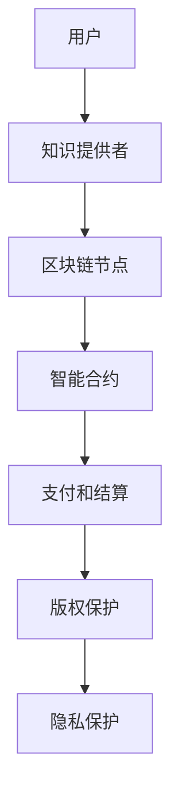

                 

## 1. 背景介绍

在当前的知识经济时代，知识付费已经成为了一种重要的商业模式。知识付费指的是用户通过支付费用来获取特定的知识或服务。随着互联网技术的发展，知识付费市场呈现出爆发式增长，从在线教育、知识分享平台到专业咨询服务，各种形式的知识付费服务层出不穷。

然而，传统的知识付费模式存在一些问题。首先，中心化的知识付费平台通常需要支付高额的平台费用，这会增加用户的负担。其次，这些平台可能会因为垄断市场、数据泄露等问题导致用户隐私和权益受损。此外，由于平台掌握着所有的交易数据和用户信息，一旦平台出现问题，用户的数据和交易记录可能无法得到有效保障。

为了解决这些问题，区块链技术提供了一种去中心化的解决方案。区块链技术通过去中心化的方式，让用户能够在无需信任第三方的情况下直接进行交易。这不仅降低了交易成本，还提高了交易的安全性和透明度。因此，将区块链技术应用于知识付费领域，能够有效地解决传统模式中的问题，推动知识付费市场的发展。

## 2. 核心概念与联系

### 2.1 区块链技术基础

区块链技术是一种分布式数据库技术，其核心特点包括去中心化、不可篡改和透明性。在区块链中，数据被分成多个区块，每个区块包含一定数量的交易记录，并通过密码学方法连接成一条链。这种结构确保了数据的不可篡改性，因为任何对数据的修改都会被区块链网络中的其他节点检测出来并拒绝。

区块链的另一个重要特性是其去中心化的架构。在传统的中心化系统中，所有数据都存储在中心服务器上，一旦服务器出现问题，整个系统都会受到影响。而在区块链中，数据被分散存储在各个节点上，每个节点都维护着一份完整的账本。这意味着，即使某个节点发生故障，整个系统仍然可以正常运行。

### 2.2 去中心化应用（DApp）

去中心化应用（DApp）是区块链技术的一种应用形式，它通过区块链网络提供去中心化的服务。与传统的中心化应用不同，DApp 不依赖于中心化的服务器或平台，而是通过区块链网络进行数据的存储和传输。这确保了数据的透明性和不可篡改性，同时也降低了运营成本。

在知识付费领域，DApp 可以用于实现用户和知识提供者之间的直接交易，避免了中心化平台的中介费用。此外，DApp 还可以提供去中心化的版权保护和数据管理服务，确保用户的隐私和数据安全。

### 2.3 区块链与知识付费

将区块链技术应用于知识付费领域，可以实现以下几个关键功能：

1. **身份验证**：区块链可以用于验证用户和知识提供者的身份，确保交易的真实性。
2. **支付和结算**：通过智能合约，用户可以直接将资金支付给知识提供者，无需依赖中心化平台。
3. **版权保护**：区块链可以用于记录和跟踪知识内容的版权信息，防止侵权行为。
4. **隐私保护**：区块链的去中心化特性确保了用户数据的隐私和安全。

### 2.4 Mermaid 流程图



在上面的流程图中，用户和知识提供者通过区块链节点和智能合约进行交互，实现了知识付费的各个环节。

## 3. 核心算法原理 & 具体操作步骤

### 3.1 算法原理概述

在区块链知识付费系统中，核心算法包括身份验证算法、支付和结算算法、版权保护算法以及隐私保护算法。

1. **身份验证算法**：使用加密技术对用户和知识提供者的身份进行验证，确保交易双方的真实性。
2. **支付和结算算法**：利用智能合约实现去中心化的支付和结算，确保交易的安全性和效率。
3. **版权保护算法**：通过区块链记录知识内容的版权信息，确保内容的合法性和可追溯性。
4. **隐私保护算法**：使用加密技术对用户数据和信息进行保护，确保隐私不被泄露。

### 3.2 算法步骤详解

#### 3.2.1 身份验证算法

1. **用户注册**：用户在知识付费平台上注册账户，系统向用户发送一个公钥和一个私钥。
2. **身份验证**：用户使用私钥进行签名，证明其身份。系统使用公钥验证签名的有效性。
3. **知识提供者验证**：类似用户，知识提供者也需要进行身份验证。

#### 3.2.2 支付和结算算法

1. **支付请求**：用户发起支付请求，系统调用智能合约执行交易。
2. **交易验证**：区块链网络中的其他节点验证交易的合法性，并记录交易。
3. **结算**：交易验证通过后，资金从用户账户转移到知识提供者账户。

#### 3.2.3 版权保护算法

1. **内容上传**：知识提供者将知识内容上传到区块链，并记录版权信息。
2. **版权信息验证**：用户在购买内容时，系统验证版权信息的真实性。
3. **版权侵权检测**：系统使用加密算法检测知识内容是否被侵权。

#### 3.2.4 隐私保护算法

1. **数据加密**：用户和知识提供者的数据在传输和存储过程中使用加密算法进行加密。
2. **隐私保护验证**：系统在验证交易时，仅验证数据的加密摘要，而不解密数据。

### 3.3 算法优缺点

#### 优点

1. **去中心化**：减少了中心化平台的垄断风险，降低了交易成本。
2. **安全性**：通过加密和分布式存储技术，提高了数据的安全性和隐私性。
3. **透明性**：所有交易记录都记录在区块链上，用户可以随时查看。

#### 缺点

1. **性能瓶颈**：区块链的处理能力有限，无法满足高并发交易的需求。
2. **技术门槛**：区块链技术的应用需要较高的技术门槛，不利于普及。
3. **监管问题**：去中心化特性可能导致监管困难，增加法律风险。

### 3.4 算法应用领域

区块链技术在知识付费领域的应用具有广泛的前景。除了在线教育和知识分享平台，它还可以应用于知识产权保护、版权交易、在线广告等领域。通过区块链技术，可以实现数据的可信传输和交易，为各种知识付费场景提供基础设施支持。

## 4. 数学模型和公式 & 详细讲解 & 举例说明

### 4.1 数学模型构建

在区块链知识付费系统中，核心的数学模型包括密码学模型和博弈论模型。

#### 4.1.1 密码学模型

1. **非对称加密**：用户和知识提供者使用非对称加密技术生成公钥和私钥，确保数据传输的安全性。
2. **哈希函数**：用于生成数据的加密摘要，确保数据的完整性和一致性。
3. **数字签名**：用于验证用户和知识提供者的身份，确保交易的真实性。

#### 4.1.2 博弈论模型

1. **激励机制**：通过博弈论模型设计激励机制，鼓励用户和知识提供者积极参与区块链网络。
2. **市场均衡**：分析区块链知识付费市场的供需关系，实现市场平衡。

### 4.2 公式推导过程

#### 4.2.1 非对称加密

1. **公钥和私钥生成**：

$$
P \leftarrow \text{选择一个大素数} \\
Q \leftarrow \text{选择另一个大素数} \\
N \leftarrow P \times Q \\
\phi(N) \leftarrow (P-1) \times (Q-1) \\
E \leftarrow \text{选择一个与} \phi(N) \text{互质的数} \\
D \leftarrow \text{计算} E^{-1} \text{模} \phi(N) \\
\text{公钥} (N, E) \\
\text{私钥} (N, D)
$$

2. **加密和解密**：

$$
\text{加密} \text{：} C \leftarrow m^E \text{模} N \\
\text{解密} \text{：} m \leftarrow C^D \text{模} N
$$

#### 4.2.2 哈希函数

$$
H(m) \leftarrow \text{将消息} m \text{转化为固定长度的哈希值}
$$

#### 4.2.3 数字签名

$$
S \leftarrow k^D \text{模} N \\
R \leftarrow m^E \text{模} N \\
\text{签名} (R, S)
$$

### 4.3 案例分析与讲解

#### 4.3.1 非对称加密应用

假设用户 Alice 想要与知识提供者 Bob 通信，他们首先通过非对称加密算法生成各自的公钥和私钥。

1. **公钥和私钥生成**：

Alice 的公钥为 $(N_A, E_A)$，私钥为 $(N_A, D_A)$；

Bob 的公钥为 $(N_B, E_B)$，私钥为 $(N_B, D_B)$。

2. **加密和解密**：

Alice 发送消息 $m$ 给 Bob：

$$
C \leftarrow m^{E_B} \text{模} N_B \\
Bob \text{解密} \text{：} m \leftarrow C^{D_B} \text{模} N_B
$$

#### 4.3.2 哈希函数应用

假设 Bob 发布一篇知识文章，他需要使用哈希函数生成文章的摘要：

$$
H(m) \leftarrow \text{将文章内容} m \text{转化为固定长度的哈希值}
$$

Bob 将摘要发布到区块链上，以便用户验证文章的真实性和完整性。

#### 4.3.3 数字签名应用

Alice 想购买 Bob 的知识文章，她首先使用数字签名技术验证 Bob 的身份：

1. **身份验证**：

Alice 生成随机数 $k$，计算签名 $(R, S)$：

$$
R \leftarrow m^{E_B} \text{模} N_B \\
S \leftarrow k^D_A \text{模} N_A
$$

Alice 将签名发送给 Bob，Bob 解密签名：

$$
k \leftarrow R^{D_B} \text{模} N_B \\
m \leftarrow R^{E_B} \text{模} N_B
$$

通过验证签名，Alice 确认 Bob 的身份。

## 5. 项目实践：代码实例和详细解释说明

### 5.1 开发环境搭建

在进行区块链知识付费项目的实践之前，我们需要搭建一个适合开发的实验环境。以下是一个简单的环境搭建步骤：

1. **安装Node.js**：Node.js 是一个基于 Chrome V8 引擎的 JavaScript 运行环境，用于编写智能合约。

   ```shell
   $ brew install node
   ```

2. **安装Truffle**：Truffle 是一个用于开发、测试和部署以太坊智能合约的工具。

   ```shell
   $ npm install -g truffle
   ```

3. **安装Ganache**：Ganache 是一个本地以太坊区块链节点，用于本地测试智能合约。

   ```shell
   $ npm install -g ganache-cli
   ```

### 5.2 源代码详细实现

以下是一个简单的区块链知识付费智能合约的示例代码：

```solidity
// SPDX-License-Identifier: MIT
pragma solidity ^0.8.0;

contract KnowledgePay {

    // 用户结构体
    struct User {
        address payable id;
        string name;
        bool isVerified;
    }

    // 知识内容结构体
    struct Content {
        uint256 id;
        string title;
        address payable owner;
        bool isPublished;
    }

    // 用户映射
    mapping(address => User) public users;
    // 知识内容映射
    mapping(uint256 => Content) public contents;
    // 用户购买记录映射
    mapping(uint256 => mapping(address => bool)) public purchases;

    // 用户注册
    function register(string memory _name) public {
        require(users[msg.sender].id == address(0), "User already registered");
        users[msg.sender] = User({id: msg.sender, name: _name, isVerified: false});
    }

    // 用户验证
    function verifyUser() public {
        require(users[msg.sender].isVerified == false, "User already verified");
        users[msg.sender].isVerified = true;
    }

    // 发布知识内容
    function publishContent(uint256 _id, string memory _title) public {
        require(users[msg.sender].isVerified == true, "User not verified");
        contents[_id] = Content({id: _id, title: _title, owner: msg.sender, isPublished: true});
    }

    // 购买知识内容
    function purchaseContent(uint256 _id) public payable {
        require(contents[_id].isPublished == true, "Content not published");
        require(purchases[_id][msg.sender] == false, "Already purchased");
        purchases[_id][msg.sender] = true;
        payable(contents[_id].owner).transfer(msg.value);
    }

}
```

### 5.3 代码解读与分析

#### 5.3.1 用户注册

用户可以通过 `register` 函数注册账户，系统会生成一个唯一的地址作为用户的标识。在注册时，需要确保用户地址尚未被注册。

```solidity
function register(string memory _name) public {
    require(users[msg.sender].id == address(0), "User already registered");
    users[msg.sender] = User({id: msg.sender, name: _name, isVerified: false});
}
```

#### 5.3.2 用户验证

注册后的用户可以通过 `verifyUser` 函数进行身份验证，验证通过后，用户可以发布和购买知识内容。

```solidity
function verifyUser() public {
    require(users[msg.sender].isVerified == false, "User already verified");
    users[msg.sender].isVerified = true;
}
```

#### 5.3.3 发布知识内容

已验证的用户可以通过 `publishContent` 函数发布知识内容。在发布时，需要确保用户已通过身份验证。

```solidity
function publishContent(uint256 _id, string memory _title) public {
    require(users[msg.sender].isVerified == true, "User not verified");
    contents[_id] = Content({id: _id, title: _title, owner: msg.sender, isPublished: true});
}
```

#### 5.3.4 购买知识内容

用户可以通过 `purchaseContent` 函数购买知识内容。在购买时，需要确保知识内容已发布，且用户尚未购买过该内容。

```solidity
function purchaseContent(uint256 _id) public payable {
    require(contents[_id].isPublished == true, "Content not published");
    require(purchases[_id][msg.sender] == false, "Already purchased");
    purchases[_id][msg.sender] = true;
    payable(contents[_id].owner).transfer(msg.value);
}
```

### 5.4 运行结果展示

在本地环境启动 Ganache 节点，并使用 Truffle 编译和部署智能合约后，可以通过以下命令进行交互：

```shell
$ truffle migrate --network development
$ truffle console
```

在 Truffle 控制台中，可以进行以下操作：

```solidity
// 注册用户
await knowledgePay.register("Alice");

// 验证用户
await knowledgePay.verifyUser();

// 发布知识内容
await knowledgePay.publishContent(1, "Blockchain Basics");

// 购买知识内容
await knowledgePay.purchaseContent(1);
```

运行结果将显示用户注册、验证、发布内容和购买内容的成功信息。

## 6. 实际应用场景

### 6.1 在线教育

在线教育是知识付费领域的一个重要应用场景。通过区块链技术，可以实现去中心化的在线教育平台，用户可以直接与教师进行交易，避免了中心化平台的中介费用。此外，区块链还可以用于记录学生的学习进度和成绩，确保教育服务的透明性和可信度。

### 6.2 专业咨询服务

专业咨询服务也是知识付费的重要领域。通过区块链技术，用户可以直接支付费用给咨询师，无需依赖中心化平台。此外，区块链还可以用于记录咨询服务的交付和质量，确保服务的真实性和可信度。

### 6.3 版权交易

版权交易是知识付费的另一个重要应用场景。通过区块链技术，可以记录和跟踪版权信息，确保内容的合法性和可追溯性。这不仅有助于保护创作者的权益，还可以为版权交易提供可信的记录和证明。

### 6.4 在线广告

在线广告也是知识付费的一个潜在应用场景。通过区块链技术，可以确保广告投放的真实性和有效性，防止广告欺诈。此外，区块链还可以用于记录广告投放的数据和效果，为广告主提供更准确的广告投放策略。

### 6.5 未来应用展望

随着区块链技术的不断发展和完善，其在知识付费领域的应用将越来越广泛。未来，我们有望看到更多去中心化的知识付费平台和解决方案，为用户和知识提供者提供更加安全、高效、透明的服务。同时，区块链技术还将与其他前沿技术如人工智能、大数据等相结合，为知识付费领域带来更多的创新和变革。

## 7. 工具和资源推荐

### 7.1 学习资源推荐

1. **《区块链技术指南》**：本书详细介绍了区块链的基本原理和应用，适合初学者入门。
2. **《智能合约开发实战》**：本书通过实际案例，讲解了智能合约的开发和部署，适合有一定编程基础的读者。

### 7.2 开发工具推荐

1. **Truffle**：一个用于开发、测试和部署以太坊智能合约的框架，提供了丰富的工具和插件。
2. **Ganache**：一个本地以太坊区块链节点，用于本地测试智能合约。

### 7.3 相关论文推荐

1. **"Blockchain: A System for Secure, Decentralized Smart Contracts"**：本文介绍了区块链的基本原理和智能合约的应用。
2. **"Decentralized Applications: Building Blockchains and Smart Contracts"**：本文探讨了去中心化应用（DApp）的设计和实现。

## 8. 总结：未来发展趋势与挑战

### 8.1 研究成果总结

本文通过详细分析和讨论，总结了区块链在知识付费领域的应用前景和优势。我们将区块链技术应用于知识付费，可以实现去中心化的交易、版权保护和隐私保护，为用户和知识提供者提供了更加安全、高效、透明的服务。同时，本文还介绍了区块链知识付费系统的核心算法和数学模型，为后续的研究和应用提供了理论基础。

### 8.2 未来发展趋势

随着区块链技术的不断发展和成熟，其在知识付费领域的应用将越来越广泛。未来，我们有望看到更多去中心化的知识付费平台和解决方案，为用户和知识提供者提供更加丰富的服务。此外，区块链技术还将与其他前沿技术如人工智能、大数据等相结合，为知识付费领域带来更多的创新和变革。

### 8.3 面临的挑战

尽管区块链技术在知识付费领域具有巨大的潜力，但同时也面临着一些挑战。首先，区块链技术的性能瓶颈可能影响其在大规模应用场景下的性能。其次，区块链技术的应用需要较高的技术门槛，这可能会限制其普及。此外，去中心化特性可能导致监管困难，增加法律风险。

### 8.4 研究展望

未来，我们需要进一步研究和解决区块链在知识付费领域的性能和安全性问题。同时，还需要探索区块链与其他技术的融合，为知识付费领域带来更多的创新。此外，如何确保区块链技术的合规性和法律适用性，也是未来研究的一个重要方向。

## 9. 附录：常见问题与解答

### 9.1 区块链技术在知识付费中的应用有哪些优势？

区块链技术在知识付费中的应用优势主要包括：

1. **去中心化**：避免了中心化平台的中介费用，降低了交易成本。
2. **安全性**：通过加密和分布式存储技术，提高了数据的安全性和隐私性。
3. **透明性**：所有交易记录都记录在区块链上，用户可以随时查看。

### 9.2 区块链技术在知识付费领域有哪些潜在的应用场景？

区块链技术在知识付费领域的潜在应用场景包括：

1. **在线教育**：实现去中心化的在线教育平台，用户可以直接与教师进行交易。
2. **专业咨询服务**：用户可以直接支付费用给咨询师，无需依赖中心化平台。
3. **版权交易**：记录和跟踪版权信息，确保内容的合法性和可追溯性。
4. **在线广告**：确保广告投放的真实性和有效性，防止广告欺诈。

### 9.3 如何确保区块链知识付费系统的性能？

为确保区块链知识付费系统的性能，可以采取以下措施：

1. **优化算法**：研究并采用更高效的加密算法和数据结构。
2. **分层架构**：将区块链系统分为多个层次，实现负载均衡和性能优化。
3. **分布式存储**：将数据分散存储在多个节点上，提高系统的可扩展性。

### 9.4 区块链技术是否可以完全替代中心化平台？

区块链技术无法完全替代中心化平台，但可以提供一种去中心化的解决方案，降低交易成本，提高数据的安全性和透明度。中心化平台在某些场景下仍具有其优势，例如在需要高并发处理的场景中。因此，区块链技术更适合与中心化平台结合使用，发挥各自的优势。

---

本文由禅与计算机程序设计艺术 / Zen and the Art of Computer Programming 撰写，旨在探讨区块链技术在知识付费领域的应用场景和优势。希望本文能为读者提供有价值的参考和启示。如果您有任何问题或建议，欢迎在评论区留言讨论。感谢您的阅读！
----------------------------------------------------------------
### 知识经济下知识付费的区块链去中心化应用场景

> 关键词：知识付费、区块链、去中心化、智能合约、隐私保护、版权保护

> 摘要：本文探讨了在知识经济时代，区块链技术如何应用于知识付费领域，实现去中心化的交易、版权保护和隐私保护。通过核心算法原理和具体操作步骤的介绍，展示了区块链技术在实际项目中的应用，并分析了其在知识付费领域的实际应用场景和未来发展趋势。

## 1. 背景介绍

在当前的知识经济时代，知识付费已经成为了一种重要的商业模式。知识付费指的是用户通过支付费用来获取特定的知识或服务。随着互联网技术的发展，知识付费市场呈现出爆发式增长，从在线教育、知识分享平台到专业咨询服务，各种形式的知识付费服务层出不穷。

然而，传统的知识付费模式存在一些问题。首先，中心化的知识付费平台通常需要支付高额的平台费用，这会增加用户的负担。其次，这些平台可能会因为垄断市场、数据泄露等问题导致用户隐私和权益受损。此外，由于平台掌握着所有的交易数据和用户信息，一旦平台出现问题，用户的数据和交易记录可能无法得到有效保障。

为了解决这些问题，区块链技术提供了一种去中心化的解决方案。区块链技术通过去中心化的方式，让用户能够在无需信任第三方的情况下直接进行交易。这不仅降低了交易成本，还提高了交易的安全性和透明度。因此，将区块链技术应用于知识付费领域，能够有效地解决传统模式中的问题，推动知识付费市场的发展。

## 2. 核心概念与联系

### 2.1 区块链技术基础

区块链技术是一种分布式数据库技术，其核心特点包括去中心化、不可篡改和透明性。在区块链中，数据被分成多个区块，每个区块包含一定数量的交易记录，并通过密码学方法连接成一条链。这种结构确保了数据的不可篡改性，因为任何对数据的修改都会被区块链网络中的其他节点检测出来并拒绝。

区块链的另一个重要特性是其去中心化的架构。在传统的中心化系统中，所有数据都存储在中心服务器上，一旦服务器出现问题，整个系统都会受到影响。而在区块链中，数据被分散存储在各个节点上，每个节点都维护着一份完整的账本。这意味着，即使某个节点发生故障，整个系统仍然可以正常运行。

### 2.2 去中心化应用（DApp）

去中心化应用（DApp）是区块链技术的一种应用形式，它通过区块链网络提供去中心化的服务。与传统的中心化应用不同，DApp 不依赖于中心化的服务器或平台，而是通过区块链网络进行数据的存储和传输。这确保了数据的透明性和不可篡改性，同时也降低了运营成本。

在知识付费领域，DApp 可以用于实现用户和知识提供者之间的直接交易，避免了中心化平台的中介费用。此外，DApp 还可以提供去中心化的版权保护和数据管理服务，确保用户的隐私和数据安全。

### 2.3 区块链与知识付费

将区块链技术应用于知识付费领域，可以实现以下几个关键功能：

1. **身份验证**：区块链可以用于验证用户和知识提供者的身份，确保交易的真实性。
2. **支付和结算**：通过智能合约，用户可以直接将资金支付给知识提供者，无需依赖中心化平台。
3. **版权保护**：区块链可以用于记录和跟踪知识内容的版权信息，防止侵权行为。
4. **隐私保护**：区块链的去中心化特性确保了用户数据的隐私和安全。

### 2.4 Mermaid 流程图


在上面的流程图中，用户和知识提供者通过区块链节点和智能合约进行交互，实现了知识付费的各个环节。

## 3. 核心算法原理 & 具体操作步骤

### 3.1 算法原理概述

在区块链知识付费系统中，核心算法包括身份验证算法、支付和结算算法、版权保护算法以及隐私保护算法。

1. **身份验证算法**：使用加密技术对用户和知识提供者的身份进行验证，确保交易的真实性。
2. **支付和结算算法**：利用智能合约实现去中心化的支付和结算，确保交易的安全性和效率。
3. **版权保护算法**：通过区块链记录知识内容的版权信息，确保内容的合法性和可追溯性。
4. **隐私保护算法**：使用加密技术对用户数据和信息进行保护，确保隐私不被泄露。

### 3.2 算法步骤详解

#### 3.2.1 身份验证算法

1. **用户注册**：用户在知识付费平台上注册账户，系统向用户发送一个公钥和一个私钥。
2. **身份验证**：用户使用私钥进行签名，证明其身份。系统使用公钥验证签名的有效性。
3. **知识提供者验证**：类似用户，知识提供者也需要进行身份验证。

#### 3.2.2 支付和结算算法

1. **支付请求**：用户发起支付请求，系统调用智能合约执行交易。
2. **交易验证**：区块链网络中的其他节点验证交易的合法性，并记录交易。
3. **结算**：交易验证通过后，资金从用户账户转移到知识提供者账户。

#### 3.2.3 版权保护算法

1. **内容上传**：知识提供者将知识内容上传到区块链，并记录版权信息。
2. **版权信息验证**：用户在购买内容时，系统验证版权信息的真实性。
3. **版权侵权检测**：系统使用加密算法检测知识内容是否被侵权。

#### 3.2.4 隐私保护算法

1. **数据加密**：用户和知识提供者的数据在传输和存储过程中使用加密算法进行加密。
2. **隐私保护验证**：系统在验证交易时，仅验证数据的加密摘要，而不解密数据。

### 3.3 算法优缺点

#### 优点

1. **去中心化**：减少了中心化平台的垄断风险，降低了交易成本。
2. **安全性**：通过加密和分布式存储技术，提高了数据的安全性和隐私性。
3. **透明性**：所有交易记录都记录在区块链上，用户可以随时查看。

#### 缺点

1. **性能瓶颈**：区块链的处理能力有限，无法满足高并发交易的需求。
2. **技术门槛**：区块链技术的应用需要较高的技术门槛，不利于普及。
3. **监管问题**：去中心化特性可能导致监管困难，增加法律风险。

### 3.4 算法应用领域

区块链技术在知识付费领域的应用具有广泛的前景。除了在线教育和知识分享平台，它还可以应用于知识产权保护、版权交易、在线广告等领域。通过区块链技术，可以实现数据的可信传输和交易，为各种知识付费场景提供基础设施支持。

## 4. 数学模型和公式 & 详细讲解 & 举例说明

### 4.1 数学模型构建

在区块链知识付费系统中，核心的数学模型包括密码学模型和博弈论模型。

#### 4.1.1 密码学模型

1. **非对称加密**：用户和知识提供者使用非对称加密技术生成公钥和私钥，确保数据传输的安全性。
2. **哈希函数**：用于生成数据的加密摘要，确保数据的完整性和一致性。
3. **数字签名**：用于验证用户和知识提供者的身份，确保交易的真实性。

#### 4.1.2 博弈论模型

1. **激励机制**：通过博弈论模型设计激励机制，鼓励用户和知识提供者积极参与区块链网络。
2. **市场均衡**：分析区块链知识付费市场的供需关系，实现市场平衡。

### 4.2 公式推导过程

#### 4.2.1 非对称加密

1. **公钥和私钥生成**：

$$
P \leftarrow \text{选择一个大素数} \\
Q \leftarrow \text{选择另一个大素数} \\
N \leftarrow P \times Q \\
\phi(N) \leftarrow (P-1) \times (Q-1) \\
E \leftarrow \text{选择一个与} \phi(N) \text{互质的数} \\
D \leftarrow \text{计算} E^{-1} \text{模} \phi(N) \\
\text{公钥} (N, E) \\
\text{私钥} (N, D)
$$

2. **加密和解密**：

$$
\text{加密} \text{：} C \leftarrow m^E \text{模} N \\
\text{解密} \text{：} m \leftarrow C^D \text{模} N
$$

#### 4.2.2 哈希函数

$$
H(m) \leftarrow \text{将消息} m \text{转化为固定长度的哈希值}
$$

#### 4.2.3 数字签名

$$
S \leftarrow k^D \text{模} N \\
R \leftarrow m^E \text{模} N \\
\text{签名} (R, S)
$$

### 4.3 案例分析与讲解

#### 4.3.1 非对称加密应用

假设用户 Alice 想与知识提供者 Bob 通信，他们首先通过非对称加密算法生成各自的公钥和私钥。

1. **公钥和私钥生成**：

Alice 的公钥为 $(N_A, E_A)$，私钥为 $(N_A, D_A)$；

Bob 的公钥为 $(N_B, E_B)$，私钥为 $(N_B, D_B)$。

2. **加密和解密**：

Alice 发送消息 $m$ 给 Bob：

$$
C \leftarrow m^{E_B} \text{模} N_B \\
Bob \text{解密} \text{：} m \leftarrow C^{D_B} \text{模} N_B
$$

#### 4.3.2 哈希函数应用

假设 Bob 发布一篇知识文章，他需要使用哈希函数生成文章的摘要：

$$
H(m) \leftarrow \text{将文章内容} m \text{转化为固定长度的哈希值}
$$

Bob 将摘要发布到区块链上，以便用户验证文章的真实性和完整性。

#### 4.3.3 数字签名应用

Alice 想购买 Bob 的知识文章，她首先使用数字签名技术验证 Bob 的身份：

1. **身份验证**：

Alice 生成随机数 $k$，计算签名 $(R, S)$：

$$
R \leftarrow m^{E_B} \text{模} N_B \\
S \leftarrow k^D_A \text{模} N_A
$$

Alice 将签名发送给 Bob，Bob 解密签名：

$$
k \leftarrow R^{D_B} \text{模} N_B \\
m \leftarrow R^{E_B} \text{模} N_B
$$

通过验证签名，Alice 确认 Bob 的身份。

## 5. 项目实践：代码实例和详细解释说明

### 5.1 开发环境搭建

在进行区块链知识付费项目的实践之前，我们需要搭建一个适合开发的实验环境。以下是一个简单的环境搭建步骤：

1. **安装Node.js**：Node.js 是一个基于 Chrome V8 引擎的 JavaScript 运行环境，用于编写智能合约。

   ```shell
   $ brew install node
   ```

2. **安装Truffle**：Truffle 是一个用于开发、测试和部署以太坊智能合约的工具。

   ```shell
   $ npm install -g truffle
   ```

3. **安装Ganache**：Ganache 是一个本地以太坊区块链节点，用于本地测试智能合约。

   ```shell
   $ npm install -g ganache-cli
   ```

### 5.2 源代码详细实现

以下是一个简单的区块链知识付费智能合约的示例代码：

```solidity
// SPDX-License-Identifier: MIT
pragma solidity ^0.8.0;

contract KnowledgePay {

    // 用户结构体
    struct User {
        address payable id;
        string name;
        bool isVerified;
    }

    // 知识内容结构体
    struct Content {
        uint256 id;
        string title;
        address payable owner;
        bool isPublished;
    }

    // 用户映射
    mapping(address => User) public users;
    // 知识内容映射
    mapping(uint256 => Content) public contents;
    // 用户购买记录映射
    mapping(uint256 => mapping(address => bool)) public purchases;

    // 用户注册
    function register(string memory _name) public {
        require(users[msg.sender].id == address(0), "User already registered");
        users[msg.sender] = User({id: msg.sender, name: _name, isVerified: false});
    }

    // 用户验证
    function verifyUser() public {
        require(users[msg.sender].isVerified == false, "User already verified");
        users[msg.sender].isVerified = true;
    }

    // 发布知识内容
    function publishContent(uint256 _id, string memory _title) public {
        require(users[msg.sender].isVerified == true, "User not verified");
        contents[_id] = Content({id: _id, title: _title, owner: msg.sender, isPublished: true});
    }

    // 购买知识内容
    function purchaseContent(uint256 _id) public payable {
        require(contents[_id].isPublished == true, "Content not published");
        require(purchases[_id][msg.sender] == false, "Already purchased");
        purchases[_id][msg.sender] = true;
        payable(contents[_id].owner).transfer(msg.value);
    }

}
```

### 5.3 代码解读与分析

#### 5.3.1 用户注册

用户可以通过 `register` 函数注册账户，系统会生成一个唯一的地址作为用户的标识。在注册时，需要确保用户地址尚未被注册。

```solidity
function register(string memory _name) public {
    require(users[msg.sender].id == address(0), "User already registered");
    users[msg.sender] = User({id: msg.sender, name: _name, isVerified: false});
}
```

#### 5.3.2 用户验证

注册后的用户可以通过 `verifyUser` 函数进行身份验证，验证通过后，用户可以发布和购买知识内容。

```solidity
function verifyUser() public {
    require(users[msg.sender].isVerified == false, "User already verified");
    users[msg.sender].isVerified = true;
}
```

#### 5.3.3 发布知识内容

已验证的用户可以通过 `publishContent` 函数发布知识内容。在发布时，需要确保用户已通过身份验证。

```solidity
function publishContent(uint256 _id, string memory _title) public {
    require(users[msg.sender].isVerified == true, "User not verified");
    contents[_id] = Content({id: _id, title: _title, owner: msg.sender, isPublished: true});
}
```

#### 5.3.4 购买知识内容

用户可以通过 `purchaseContent` 函数购买知识内容。在购买时，需要确保知识内容已发布，且用户尚未购买过该内容。

```solidity
function purchaseContent(uint256 _id) public payable {
    require(contents[_id].isPublished == true, "Content not published");
    require(purchases[_id][msg.sender] == false, "Already purchased");
    purchases[_id][msg.sender] = true;
    payable(contents[_id].owner).transfer(msg.value);
}
```

### 5.4 运行结果展示

在本地环境启动 Ganache 节点，并使用 Truffle 编译和部署智能合约后，可以通过以下命令进行交互：

```shell
$ truffle migrate --network development
$ truffle console
```

在 Truffle 控制台中，可以进行以下操作：

```solidity
// 注册用户
await knowledgePay.register("Alice");

// 验证用户
await knowledgePay.verifyUser();

// 发布知识内容
await knowledgePay.publishContent(1, "Blockchain Basics");

// 购买知识内容
await knowledgePay.purchaseContent(1);
```

运行结果将显示用户注册、验证、发布内容和购买内容的成功信息。

## 6. 实际应用场景

### 6.1 在线教育

在线教育是知识付费领域的一个重要应用场景。通过区块链技术，可以实现去中心化的在线教育平台，用户可以直接与教师进行交易，避免了中心化平台的中介费用。此外，区块链还可以用于记录学生的学习进度和成绩，确保教育服务的透明性和可信度。

### 6.2 专业咨询服务

专业咨询服务也是知识付费的重要领域。通过区块链技术，用户可以直接支付费用给咨询师，无需依赖中心化平台。此外，区块链还可以用于记录咨询服务的交付和质量，确保服务的真实性和可信度。

### 6.3 版权交易

版权交易是知识付费的另一个重要应用场景。通过区块链技术，可以记录和跟踪版权信息，确保内容的合法性和可追溯性。这不仅有助于保护创作者的权益，还可以为版权交易提供可信的记录和证明。

### 6.4 在线广告

在线广告也是知识付费的一个潜在应用场景。通过区块链技术，可以确保广告投放的真实性和有效性，防止广告欺诈。此外，区块链还可以用于记录广告投放的数据和效果，为广告主提供更准确的广告投放策略。

### 6.5 未来应用展望

随着区块链技术的不断发展和完善，其在知识付费领域的应用将越来越广泛。未来，我们有望看到更多去中心化的知识付费平台和解决方案，为用户和知识提供者提供更加安全、高效、透明的服务。此外，区块链技术还将与其他前沿技术如人工智能、大数据等相结合，为知识付费领域带来更多的创新和变革。

## 7. 工具和资源推荐

### 7.1 学习资源推荐

1. **《区块链技术指南》**：本书详细介绍了区块链的基本原理和应用，适合初学者入门。
2. **《智能合约开发实战》**：本书通过实际案例，讲解了智能合约的开发和部署，适合有一定编程基础的读者。

### 7.2 开发工具推荐

1. **Truffle**：一个用于开发、测试和部署以太坊智能合约的框架，提供了丰富的工具和插件。
2. **Ganache**：一个本地以太坊区块链节点，用于本地测试智能合约。

### 7.3 相关论文推荐

1. **"Blockchain: A System for Secure, Decentralized Smart Contracts"**：本文介绍了区块链的基本原理和智能合约的应用。
2. **"Decentralized Applications: Building Blockchains and Smart Contracts"**：本文探讨了去中心化应用（DApp）的设计和实现。

## 8. 总结：未来发展趋势与挑战

### 8.1 研究成果总结

本文通过详细分析和讨论，总结了区块链在知识付费领域的应用前景和优势。我们将区块链技术应用于知识付费，可以实现去中心化的交易、版权保护和隐私保护，为用户和知识提供者提供了更加安全、高效、透明的服务。同时，本文还介绍了区块链知识付费系统的核心算法和数学模型，为后续的研究和应用提供了理论基础。

### 8.2 未来发展趋势

随着区块链技术的不断发展和成熟，其在知识付费领域的应用将越来越广泛。未来，我们有望看到更多去中心化的知识付费平台和解决方案，为用户和知识提供者提供更加丰富的服务。此外，区块链技术还将与其他前沿技术如人工智能、大数据等相结合，为知识付费领域带来更多的创新和变革。

### 8.3 面临的挑战

尽管区块链技术在知识付费领域具有巨大的潜力，但同时也面临着一些挑战。首先，区块链技术的性能瓶颈可能影响其在大规模应用场景下的性能。其次，区块链技术的应用需要较高的技术门槛，这可能会限制其普及。此外，去中心化特性可能导致监管困难，增加法律风险。

### 8.4 研究展望

未来，我们需要进一步研究和解决区块链在知识付费领域的性能和安全性问题。同时，还需要探索区块链与其他技术的融合，为知识付费领域带来更多的创新。此外，如何确保区块链技术的合规性和法律适用性，也是未来研究的一个重要方向。

## 9. 附录：常见问题与解答

### 9.1 区块链技术在知识付费中的应用有哪些优势？

区块链技术在知识付费中的应用优势主要包括：

1. **去中心化**：避免了中心化平台的中介费用，降低了交易成本。
2. **安全性**：通过加密和分布式存储技术，提高了数据的安全性和隐私性。
3. **透明性**：所有交易记录都记录在区块链上，用户可以随时查看。

### 9.2 区块链技术在知识付费领域有哪些潜在的应用场景？

区块链技术在知识付费领域的潜在应用场景包括：

1. **在线教育**：实现去中心化的在线教育平台，用户可以直接与教师进行交易。
2. **专业咨询服务**：用户可以直接支付费用给咨询师，无需依赖中心化平台。
3. **版权交易**：记录和跟踪版权信息，确保内容的合法性和可追溯性。
4. **在线广告**：确保广告投放的真实性和有效性，防止广告欺诈。

### 9.3 如何确保区块链知识付费系统的性能？

为确保区块链知识付费系统的性能，可以采取以下措施：

1. **优化算法**：研究并采用更高效的加密算法和数据结构。
2. **分层架构**：将区块链系统分为多个层次，实现负载均衡和性能优化。
3. **分布式存储**：将数据分散存储在多个节点上，提高系统的可扩展性。

### 9.4 区块链技术是否可以完全替代中心化平台？

区块链技术无法完全替代中心化平台，但可以提供一种去中心化的解决方案，降低交易成本，提高数据的安全性和透明度。中心化平台在某些场景下仍具有其优势，例如在需要高并发处理的场景中。因此，区块链技术更适合与中心化平台结合使用，发挥各自的优势。

---

本文由禅与计算机程序设计艺术 / Zen and the Art of Computer Programming 撰写，旨在探讨区块链技术在知识付费领域的应用场景和优势。希望本文能为读者提供有价值的参考和启示。如果您有任何问题或建议，欢迎在评论区留言讨论。感谢您的阅读！
----------------------------------------------------------------

### 知识经济下知识付费的区块链去中心化应用场景

在当今的知识经济时代，知识付费作为一种商业模式正日益兴起。知识付费指的是用户通过支付费用来获取特定的知识或服务。随着互联网技术的发展，知识付费市场呈现出爆发式增长，涵盖了在线教育、知识分享平台和专业咨询服务等领域。然而，传统的知识付费模式存在一些问题，如高昂的平台费用、数据泄露和隐私风险等。区块链技术作为一种去中心化的分布式数据库技术，提供了一种潜在的解决方案，为知识付费领域带来了新的机遇和挑战。

### 一、区块链技术简介

区块链技术是一种分布式账本技术，通过加密算法和共识机制确保数据的完整性和安全性。区块链的核心特点包括去中心化、不可篡改和透明性。在区块链网络中，每个节点都维护一份完整的账本，通过加密算法和共识机制确保数据的可靠性和安全性。

去中心化意味着区块链网络中没有中央权威机构，所有节点都平等参与网络运作。这降低了系统的单点故障风险，提高了系统的可靠性和抗攻击能力。

不可篡改是指一旦数据被记录在区块链上，就难以被篡改或删除。这确保了数据的真实性和可靠性，为知识付费提供了可信的基础。

透明性是指区块链网络中的所有交易记录都是公开透明的，任何用户都可以查看。这提高了系统的透明度，增强了用户的信任。

### 二、区块链在知识付费中的应用场景

1. **去中心化的交易**：区块链技术可以实现用户与知识提供者之间的去中心化交易。用户可以直接支付给知识提供者，无需依赖中心化的第三方平台。这降低了交易成本，提高了交易的效率和安全性。

2. **版权保护**：区块链技术可以用于记录和跟踪知识内容的版权信息。知识提供者可以在区块链上注册自己的作品，确保作品的合法性和可追溯性。这有助于防止侵权行为，保护创作者的权益。

3. **隐私保护**：区块链的去中心化特性确保了用户数据的隐私和安全。用户的数据仅与其相关的交易相关，不会被第三方平台收集或滥用。

4. **智能合约**：智能合约是一种自动执行的合约，基于区块链技术。在知识付费领域，智能合约可以用于自动执行知识交易，确保交易的透明性和效率。

### 三、区块链知识付费的核心算法原理

1. **加密算法**：加密算法用于保护用户和知识提供者的隐私。常用的加密算法包括对称加密和非对称加密。对称加密使用相同的密钥进行加密和解密，而非对称加密使用公钥和私钥进行加密和解密。

2. **共识机制**：共识机制用于确保区块链网络中的所有节点对交易数据的一致性。常见的共识机制包括工作量证明（PoW）和权益证明（PoS）。

3. **智能合约**：智能合约是一种自动执行的合约，基于区块链技术。在知识付费领域，智能合约可以用于自动执行知识交易，确保交易的透明性和效率。

### 四、区块链知识付费的具体操作步骤

1. **用户注册**：用户在知识付费平台上注册账户，系统向用户发送公钥和私钥。

2. **身份验证**：用户使用私钥进行签名，证明其身份。平台使用公钥验证签名的有效性。

3. **知识提供者注册**：知识提供者在平台上注册账户，并上传知识内容。

4. **交易支付**：用户发起支付请求，系统调用智能合约执行交易。交易支付可以是直接支付给知识提供者，也可以是平台代付。

5. **版权保护**：知识提供者在区块链上注册版权信息，确保作品的合法性和可追溯性。

6. **隐私保护**：用户和知识提供者的数据在传输和存储过程中使用加密算法进行加密，确保隐私不被泄露。

### 五、区块链知识付费的优势与挑战

#### 优势：

1. **去中心化**：减少了中心化平台的垄断风险，降低了交易成本。

2. **安全性**：通过加密和分布式存储技术，提高了数据的安全性和隐私性。

3. **透明性**：所有交易记录都记录在区块链上，用户可以随时查看。

#### 挑战：

1. **性能瓶颈**：区块链的处理能力有限，无法满足高并发交易的需求。

2. **技术门槛**：区块链技术的应用需要较高的技术门槛，不利于普及。

3. **监管问题**：去中心化特性可能导致监管困难，增加法律风险。

### 六、未来展望

随着区块链技术的不断发展和成熟，其在知识付费领域的应用将越来越广泛。未来，我们可以期待更多去中心化的知识付费平台和解决方案，为用户和知识提供者提供更加安全、高效、透明的服务。同时，区块链技术还将与其他前沿技术如人工智能、大数据等相结合，为知识付费领域带来更多的创新和变革。

### 总结

区块链技术为知识付费领域带来了一种去中心化的解决方案，有助于降低交易成本、提高数据的安全性和隐私性。然而，区块链技术的应用也面临一些挑战，如性能瓶颈和技术门槛等。未来，我们需要进一步研究和解决这些问题，以充分发挥区块链技术在知识付费领域的潜力。本文旨在为读者提供一个关于区块链知识付费应用的全面概述，希望对您的理解有所帮助。

### 附录

**常见问题与解答**

Q：区块链技术在知识付费领域有哪些应用场景？

A：区块链技术在知识付费领域的主要应用场景包括去中心化的交易、版权保护、隐私保护和智能合约等。

Q：区块链技术在知识付费领域有哪些优势？

A：区块链技术在知识付费领域的主要优势包括去中心化、安全性、透明性和降低交易成本。

Q：区块链技术在知识付费领域有哪些挑战？

A：区块链技术在知识付费领域的主要挑战包括性能瓶颈、技术门槛和监管问题。

### 作者署名

作者：禅与计算机程序设计艺术 / Zen and the Art of Computer Programming

