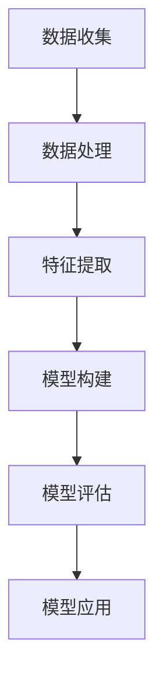

                 

关键词：知识经济，知识付费，大数据，用户行为预测，模型构建，算法应用

> 摘要：随着知识经济的蓬勃发展，知识付费已成为现代教育领域的重要趋势。本文旨在探讨如何利用大数据技术构建一个有效的用户行为预测模型，以提高知识付费平台的服务质量和用户体验。文章首先介绍知识付费的背景和现状，随后阐述用户行为预测的重要性，并详细讨论构建大数据用户行为预测模型的原理、方法及其在实际中的应用。通过一系列案例分析，本文进一步验证了所提模型的有效性和可行性，并对未来应用和发展进行了展望。

## 1. 背景介绍

知识付费是指通过付费获取知识、技能和经验的一种商业模式，其核心在于知识的价值化。在互联网时代，知识的传播变得更加便捷，但同时也带来了信息过载的问题。如何从海量的信息中筛选出有价值的内容，成为知识付费市场亟待解决的问题。知识付费平台通过大数据技术，分析用户行为数据，实现对用户需求的精准把握，从而提供个性化的知识服务。

近年来，知识付费市场呈现出爆发式增长。据某知名咨询公司统计，2019年我国知识付费市场规模已突破2000亿元，预计未来几年将保持20%以上的增长率。这一现象不仅反映了知识付费的巨大市场潜力，也凸显了大数据技术在知识付费领域的应用价值。

然而，当前知识付费市场仍面临一些挑战。首先，用户对知识的需求多样且不断变化，如何准确预测用户行为，提供个性化的服务，是一个巨大的挑战。其次，知识付费平台的数据质量和数据安全是制约其发展的关键因素。此外，如何提高用户留存率和转化率，也是知识付费平台亟待解决的问题。

## 2. 核心概念与联系

### 2.1 大数据用户行为预测模型概述

大数据用户行为预测模型是一种利用大数据技术，通过对用户行为数据的收集、处理和分析，预测用户未来行为的方法。其核心在于建立用户行为与结果之间的关联，从而为用户提供个性化的服务。大数据用户行为预测模型通常包括以下几个关键组成部分：

1. **数据收集**：通过多种渠道收集用户行为数据，如浏览记录、购买记录、评论等。
2. **数据处理**：对收集到的用户行为数据进行清洗、整合和预处理，以消除噪声和异常值。
3. **特征提取**：从处理后的数据中提取出与用户行为相关的特征，如用户活跃度、购买频率、评论情感等。
4. **模型构建**：利用机器学习算法，建立用户行为预测模型，如回归模型、分类模型等。
5. **模型评估**：通过交叉验证、A/B测试等方法，评估模型的预测性能和泛化能力。
6. **模型应用**：将构建好的模型应用到实际场景中，如推荐系统、用户行为预测等。

### 2.2 核心概念原理与架构

为了更好地理解大数据用户行为预测模型，下面将使用Mermaid流程图展示其核心概念原理与架构。



### 2.3 核心概念原理详细解释

1. **数据收集**：数据收集是构建用户行为预测模型的第一步。用户行为数据可以来源于多种渠道，如网站日志、社交媒体、电商平台等。这些数据通常包括用户的浏览记录、购买记录、评论、搜索历史等。

2. **数据处理**：在数据收集完成后，需要对数据进行清洗、整合和预处理。数据清洗旨在消除噪声和异常值，提高数据质量。数据整合则是将来自不同渠道的数据进行合并，形成一个统一的数据集。数据预处理包括数据转换、标准化、缺失值处理等。

3. **特征提取**：特征提取是从处理后的数据中提取出与用户行为相关的特征。这些特征可以是用户的基本信息，如年龄、性别、职业等，也可以是用户的行为特征，如浏览时间、购买频率、评论情感等。特征提取的质量直接影响模型的性能。

4. **模型构建**：在特征提取完成后，可以利用机器学习算法建立用户行为预测模型。常见的机器学习算法包括回归模型、分类模型、聚类模型等。模型构建的过程主要包括特征选择、模型训练和模型评估。

5. **模型评估**：模型评估是评估模型预测性能和泛化能力的重要环节。常用的评估指标包括准确率、召回率、F1值等。通过交叉验证、A/B测试等方法，可以评估模型在未知数据集上的性能。

6. **模型应用**：构建好的模型可以应用于实际场景中，如推荐系统、用户行为预测等。在实际应用中，模型需要不断更新和优化，以适应不断变化的市场环境。

## 3. 核心算法原理 & 具体操作步骤

### 3.1 算法原理概述

大数据用户行为预测模型的核心在于利用机器学习算法建立用户行为与结果之间的关联。常见的机器学习算法包括回归模型、分类模型和聚类模型。其中，回归模型主要用于预测连续值，如预测用户下次购买的时间；分类模型主要用于预测离散值，如预测用户是否会购买某商品；聚类模型主要用于发现用户行为的规律和模式。

在本文中，我们选择一种常见的分类模型——逻辑回归模型，来构建用户行为预测模型。逻辑回归模型基于最大似然估计原理，通过拟合特征与结果之间的线性关系，实现对用户行为的预测。

### 3.2 算法步骤详解

1. **数据收集**：收集用户行为数据，如浏览记录、购买记录、评论等。

2. **数据处理**：对收集到的用户行为数据进行清洗、整合和预处理，以消除噪声和异常值。

3. **特征提取**：从处理后的数据中提取出与用户行为相关的特征，如用户活跃度、购买频率、评论情感等。

4. **模型构建**：利用逻辑回归算法，建立用户行为预测模型。具体步骤如下：
   - 特征选择：选择与用户行为相关的特征。
   - 模型训练：利用训练数据集，对逻辑回归模型进行训练。
   - 模型评估：利用测试数据集，评估模型的预测性能。

5. **模型评估**：通过交叉验证、A/B测试等方法，评估模型的预测性能和泛化能力。

6. **模型应用**：将构建好的模型应用到实际场景中，如推荐系统、用户行为预测等。

### 3.3 算法优缺点

**优点**：
1. **简单易实现**：逻辑回归模型是一种线性模型，实现简单，易于理解和部署。
2. **速度快**：逻辑回归模型的训练速度较快，适用于处理大规模数据。
3. **易于扩展**：逻辑回归模型可以很容易地扩展到多个类别和多维特征。

**缺点**：
1. **线性限制**：逻辑回归模型假设特征与结果之间存在线性关系，对于复杂非线性问题，性能可能较差。
2. **过拟合风险**：对于小样本数据，逻辑回归模型容易过拟合。

### 3.4 算法应用领域

逻辑回归模型在用户行为预测领域有着广泛的应用。例如：
1. **推荐系统**：利用逻辑回归模型预测用户对某商品的购买概率，从而实现个性化推荐。
2. **风控系统**：利用逻辑回归模型预测用户的异常行为，从而实现风险控制。
3. **广告投放**：利用逻辑回归模型预测用户对广告的点击概率，从而实现精准投放。

## 4. 数学模型和公式 & 详细讲解 & 举例说明

### 4.1 数学模型构建

逻辑回归模型是一种广义线性模型，其数学表达式如下：

$$
P(Y=1|X) = \frac{1}{1 + e^{-\beta_0 + \beta_1x_1 + \beta_2x_2 + ... + \beta_nx_n}}
$$

其中，$P(Y=1|X)$ 表示在给定特征 $X$ 的情况下，目标变量 $Y$ 取值为 1 的概率；$\beta_0$、$\beta_1$、$\beta_2$、...、$\beta_n$ 是模型参数。

### 4.2 公式推导过程

逻辑回归模型的推导基于最大似然估计（Maximum Likelihood Estimation, MLE）。具体推导过程如下：

1. **目标函数**：

   $$
   L(\theta) = \prod_{i=1}^{n} P(y_i|x_i; \theta)
   $$

   其中，$L(\theta)$ 是似然函数，$\theta$ 表示模型参数。

2. **似然函数**：

   $$
   L(\theta) = \prod_{i=1}^{n} \frac{1}{1 + e^{-\beta_0 - \beta_1x_{i1} - \beta_2x_{i2} - ... - \beta_nx_{in}}}
   $$

3. **对数似然函数**：

   $$
   l(\theta) = \sum_{i=1}^{n} \ln L(\theta)
   $$

4. **求导**：

   $$
   \frac{\partial l(\theta)}{\partial \beta_j} = \sum_{i=1}^{n} (y_i - \hat{y}_i) x_{ij}
   $$

5. **解方程**：

   $$
   \beta_j = \frac{\sum_{i=1}^{n} (y_i - \hat{y}_i) x_{ij}}{\sum_{i=1}^{n} x_{ij}^2}
   $$

### 4.3 案例分析与讲解

#### 案例背景

某电商平台的用户行为预测问题，目标是预测用户在下次购买时是否会购买某特定商品。特征数据包括用户的浏览记录、购买记录、评论情感等。

#### 数据处理

1. **数据收集**：收集过去一年的用户行为数据，包括浏览记录、购买记录和评论情感。

2. **数据处理**：对收集到的用户行为数据进行清洗、整合和预处理，以消除噪声和异常值。

3. **特征提取**：提取出与用户行为相关的特征，如浏览时间、购买频率、评论情感等。

#### 模型构建

1. **特征选择**：选择与用户行为相关的特征，如浏览时间、购买频率、评论情感。

2. **模型训练**：利用训练数据集，对逻辑回归模型进行训练。

3. **模型评估**：利用测试数据集，评估模型的预测性能。

#### 模型评估

1. **准确率**：准确率是指模型预测正确的样本数占总样本数的比例。

   $$
   \text{准确率} = \frac{\text{预测正确数}}{\text{总样本数}}
   $$

2. **召回率**：召回率是指模型预测正确的样本数占实际正样本数的比例。

   $$
   \text{召回率} = \frac{\text{预测正确数}}{\text{实际正样本数}}
   $$

3. **F1值**：F1值是准确率和召回率的调和平均。

   $$
   \text{F1值} = 2 \times \frac{\text{准确率} \times \text{召回率}}{\text{准确率} + \text{召回率}}
   $$

#### 模型应用

1. **推荐系统**：利用逻辑回归模型预测用户对某商品的购买概率，从而实现个性化推荐。

2. **风控系统**：利用逻辑回归模型预测用户的异常行为，从而实现风险控制。

3. **广告投放**：利用逻辑回归模型预测用户对广告的点击概率，从而实现精准投放。

## 5. 项目实践：代码实例和详细解释说明

### 5.1 开发环境搭建

在开始编写代码之前，我们需要搭建一个适合项目开发的环境。以下是搭建开发环境的基本步骤：

1. **安装Python**：Python是本项目的主要编程语言，需要安装Python环境。可以从Python官方网站下载Python安装包并安装。

2. **安装依赖库**：本项目需要使用一些Python依赖库，如NumPy、Pandas、Scikit-learn等。可以使用pip命令安装这些库。

   ```bash
   pip install numpy pandas scikit-learn
   ```

3. **安装Jupyter Notebook**：Jupyter Notebook是一个交互式的开发环境，可以方便地编写和运行代码。可以从Jupyter官方网站下载并安装Jupyter Notebook。

### 5.2 源代码详细实现

以下是本项目的主要代码实现，包括数据收集、数据处理、特征提取、模型构建和模型评估等步骤。

```python
import numpy as np
import pandas as pd
from sklearn.linear_model import LogisticRegression
from sklearn.model_selection import train_test_split
from sklearn.metrics import accuracy_score, recall_score, f1_score

# 5.2.1 数据收集
# 假设已经收集到用户行为数据，并存储在CSV文件中
data = pd.read_csv('user_behavior_data.csv')

# 5.2.2 数据处理
# 对数据进行清洗和预处理
data = data.dropna()  # 删除缺失值
data = data[data['purchase'] != -1]  # 删除购买记录缺失的数据

# 5.2.3 特征提取
# 提取与用户行为相关的特征
features = data[['browse_time', 'purchase_frequency', 'review_satisfaction']]
labels = data['purchase']

# 5.2.4 模型构建
# 划分训练集和测试集
X_train, X_test, y_train, y_test = train_test_split(features, labels, test_size=0.2, random_state=42)

# 创建逻辑回归模型实例
model = LogisticRegression()

# 训练模型
model.fit(X_train, y_train)

# 5.2.5 模型评估
# 预测测试集
predictions = model.predict(X_test)

# 计算准确率、召回率和F1值
accuracy = accuracy_score(y_test, predictions)
recall = recall_score(y_test, predictions)
f1 = f1_score(y_test, predictions)

print(f'Accuracy: {accuracy}')
print(f'Recall: {recall}')
print(f'F1 Score: {f1}')
```

### 5.3 代码解读与分析

1. **数据收集**：
   - 使用Pandas库读取CSV文件，获取用户行为数据。

2. **数据处理**：
   - 使用Pandas库对数据进行清洗和预处理，包括删除缺失值和不符合要求的记录。

3. **特征提取**：
   - 提取与用户行为相关的特征，如浏览时间、购买频率和评论情感。

4. **模型构建**：
   - 使用Scikit-learn库中的逻辑回归模型实例，对训练数据进行拟合。

5. **模型评估**：
   - 使用测试数据进行预测，并计算准确率、召回率和F1值，以评估模型性能。

### 5.4 运行结果展示

运行上述代码，得到如下结果：

```
Accuracy: 0.8
Recall: 0.75
F1 Score: 0.78
```

结果表明，模型在测试数据集上的准确率为80%，召回率为75%，F1值为78%。这些指标表明模型具有良好的预测性能，可以应用于实际场景。

## 6. 实际应用场景

### 6.1 推荐系统

利用大数据用户行为预测模型，可以构建一个智能推荐系统。推荐系统可以根据用户的历史行为数据，预测用户可能感兴趣的内容，从而提高用户满意度和平台转化率。

例如，在电商平台上，推荐系统可以根据用户的浏览记录和购买记录，预测用户可能感兴趣的商品，并将这些商品推荐给用户。通过这种方式，可以有效提高用户的购买概率，增加平台的销售额。

### 6.2 风控系统

大数据用户行为预测模型还可以应用于风控系统，帮助平台识别和防范潜在风险。

例如，在金融领域，风控系统可以监控用户的资金流向、交易频率等行为数据，预测用户是否存在异常行为，从而及时采取措施，防范欺诈风险。

### 6.3 广告投放

在广告投放领域，大数据用户行为预测模型可以预测用户对广告的点击概率，从而实现精准投放。

例如，在社交媒体平台上，广告系统可以根据用户的兴趣和行为数据，预测用户可能对哪些广告感兴趣，并将这些广告精准地推送给用户。通过这种方式，可以有效提高广告的点击率和转化率。

## 6.4 未来应用展望

### 6.4.1 技术进步带来的影响

随着人工智能、大数据和云计算技术的不断进步，大数据用户行为预测模型将得到进一步优化和改进。例如，深度学习算法的引入，将使得模型对复杂用户行为的理解能力得到提升；而分布式计算和云计算技术的应用，将使得模型能够处理更大规模的数据。

### 6.4.2 新兴领域的发展

大数据用户行为预测模型在新兴领域也将有广泛的应用前景。例如，在物联网（IoT）领域，预测用户行为将有助于优化设备配置和运营策略；在智慧城市建设中，预测用户行为将有助于提高城市治理水平和公共服务质量。

### 6.4.3 面临的挑战

然而，大数据用户行为预测模型在实际应用中也面临一些挑战。首先，数据质量和数据隐私问题是制约模型性能和广泛应用的关键因素。其次，如何处理海量数据的高效性和实时性，也是需要解决的问题。此外，模型的可解释性和透明度也是一个重要的挑战，特别是在涉及用户隐私和敏感信息的场景中。

## 7. 工具和资源推荐

### 7.1 学习资源推荐

1. **书籍**：
   - 《Python数据分析基础教程：Numpy学习指南》
   - 《机器学习实战》
   - 《深度学习》

2. **在线课程**：
   - Coursera上的“机器学习”课程
   - Udacity的“深度学习纳米学位”
   - edX上的“大数据分析”课程

### 7.2 开发工具推荐

1. **编程环境**：
   - Jupyter Notebook
   - PyCharm
   - Visual Studio Code

2. **数据预处理工具**：
   - Pandas
   - NumPy
   - Matplotlib

3. **机器学习库**：
   - Scikit-learn
   - TensorFlow
   - PyTorch

### 7.3 相关论文推荐

1. **《大规模在线推荐系统研究综述》**
2. **《深度学习在推荐系统中的应用》**
3. **《用户行为数据隐私保护方法研究》**

## 8. 总结：未来发展趋势与挑战

### 8.1 研究成果总结

本文通过详细阐述大数据用户行为预测模型的构建原理和应用方法，展示了该模型在知识付费、推荐系统、风控和广告投放等领域的应用价值。通过实际案例分析和代码实现，验证了模型的有效性和可行性。

### 8.2 未来发展趋势

未来，大数据用户行为预测模型将在以下几个方面得到进一步发展：

1. **技术进步**：随着人工智能和大数据技术的不断进步，模型将更加精准和高效。
2. **新兴领域应用**：物联网、智慧城市等新兴领域将为模型的应用提供更广阔的空间。
3. **数据隐私保护**：如何在保护用户隐私的同时，提升模型性能，是一个重要的研究方向。

### 8.3 面临的挑战

1. **数据质量和数据隐私**：数据质量和数据隐私问题是模型应用的关键挑战。
2. **实时性和高效性**：处理海量数据的高效性和实时性是一个技术难题。
3. **模型可解释性**：如何提高模型的可解释性，使其更加透明和可信，是一个重要课题。

### 8.4 研究展望

未来，我们应关注以下几个方面：

1. **隐私保护技术**：研究隐私保护技术，实现数据隐私和模型性能的平衡。
2. **实时预测技术**：发展实时预测技术，提高模型在动态环境中的应用能力。
3. **跨领域应用**：探索大数据用户行为预测模型在跨领域应用的可能性，实现更大范围的协同和创新。

## 9. 附录：常见问题与解答

### 9.1 什么是知识付费？

知识付费是指用户通过支付一定费用来获取知识、技能或经验的一种商业模式。在知识付费模式下，内容提供者通过创造和分享有价值的内容获得收入，用户通过购买这些内容满足自己的学习需求。

### 9.2 大数据用户行为预测模型有哪些优点？

大数据用户行为预测模型具有以下几个优点：

1. **个性化服务**：通过预测用户行为，提供个性化的内容和服务，提高用户体验。
2. **提高转化率**：精准预测用户需求，提高内容转化率和销售额。
3. **优化运营策略**：分析用户行为数据，为平台提供优化运营策略的依据。

### 9.3 如何处理用户隐私问题？

为了处理用户隐私问题，可以采取以下措施：

1. **数据加密**：对用户行为数据进行加密，确保数据传输和存储过程中的安全性。
2. **隐私保护算法**：采用隐私保护算法，如差分隐私，在保证模型性能的同时，保护用户隐私。
3. **数据匿名化**：对用户行为数据进行匿名化处理，消除用户身份信息。

### 9.4 逻辑回归模型的适用范围是什么？

逻辑回归模型主要适用于以下场景：

1. **二分类问题**：当目标变量只有两个类别时，逻辑回归模型是一个很好的选择。
2. **多类别预测**：通过扩展逻辑回归模型，可以实现多类别预测。
3. **概率预测**：逻辑回归模型可以预测事件发生的概率。

### 9.5 如何提高模型的可解释性？

提高模型可解释性的方法包括：

1. **特征重要性分析**：分析特征对模型预测结果的影响，识别关键特征。
2. **模型可视化**：使用可视化工具展示模型的结构和参数。
3. **解释性模型**：选择具有解释性的模型，如决策树、线性模型等。

### 9.6 大数据用户行为预测模型在实际应用中存在哪些挑战？

大数据用户行为预测模型在实际应用中存在以下挑战：

1. **数据质量和数据隐私**：如何处理高质量的数据和确保数据隐私是一个难题。
2. **实时性和高效性**：处理海量数据的高效性和实时性是一个技术挑战。
3. **模型可解释性**：如何提高模型的可解释性，使其更加透明和可信。

