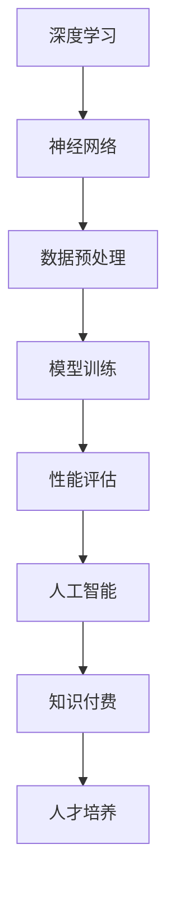

                 

关键词：知识经济、知识付费、人才培养、策略、技术语言、深度学习、人工智能

摘要：本文从知识经济时代的背景出发，探讨了知识付费人才培养的重要性及策略。文章通过逻辑清晰、结构紧凑的方式，使用专业的技术语言，深入分析了知识付费市场的现状、核心概念及其与人才培养的联系。同时，本文结合数学模型和实际项目实例，详细阐述了如何通过技术和策略提升知识付费人才培养的效率。

## 1. 背景介绍

在知识经济时代，信息和知识的创造、传播与应用成为经济增长的核心动力。知识付费作为知识经济的一种体现，逐渐成为市场需求的重要组成部分。知识付费是指通过购买或订阅的方式，获取有价值的信息、知识和技能。它不仅满足了个人和企业的学习需求，也推动了知识的流通和增值。

随着互联网技术的发展，知识付费市场日益繁荣。在线教育平台、专业课程、知识分享社区等各类知识付费产品层出不穷。然而，如何培养适应知识经济时代要求的人才，成为了教育界和企业界共同面临的挑战。

## 2. 核心概念与联系

在知识付费人才培养中，以下核心概念和其相互联系是不可或缺的：

### 2.1. 深度学习与人工智能

深度学习是人工智能的一种重要分支，通过模拟人脑神经元网络的结构和功能，实现高效的数据分析和模式识别。人工智能则是在这个基础上，使计算机具备类似人类的学习、推理和决策能力。

Mermaid 流程图：


### 2.2. 在线教育与知识付费

在线教育利用互联网技术，打破了传统教育的时空限制，为知识付费提供了平台。知识付费则通过在线教育平台，将有价值的内容进行变现，实现知识的流通和传播。

### 2.3. 人才需求与市场供给

知识经济时代，企业对人才的需求呈现出高技能、高创新的特点。然而，现有的教育体系和市场供给难以满足这一需求，因此，如何培养符合市场需求的人才成为关键。

## 3. 核心算法原理 & 具体操作步骤

### 3.1 算法原理概述

知识付费人才培养策略的核心在于构建一个高效的培训体系，通过深度学习和人工智能技术，实现个性化学习、智能推荐和持续反馈。以下是该算法的原理概述：

1. 数据收集：收集学员的学习数据，包括学习进度、学习时长、知识点掌握情况等。
2. 数据预处理：对收集到的数据进行分析和清洗，为后续建模提供高质量的输入。
3. 模型训练：利用深度学习算法，构建个性化学习模型，实现知识点的自动标注和推荐。
4. 性能评估：通过模拟测试和实际应用，评估模型的性能和效果。
5. 持续优化：根据评估结果，调整模型参数和策略，实现持续改进。

### 3.2 算法步骤详解

#### 3.2.1 数据收集

数据收集是整个算法的基础，需要从多个维度获取学员的学习数据，包括：

- 学习进度：记录学员的学习进度，如已完成课程、未完成课程等。
- 学习时长：记录学员学习每个知识点的时长，用于分析学习效率。
- 知识点掌握情况：通过测试或作业，评估学员对知识点的掌握程度。

#### 3.2.2 数据预处理

数据预处理包括数据清洗、归一化和特征提取。清洗数据是为了去除噪声和异常值，归一化是为了消除不同维度数据之间的量纲影响，特征提取则是从原始数据中提取出有用的信息。

#### 3.2.3 模型训练

模型训练是核心步骤，采用深度学习算法，如卷积神经网络（CNN）或循环神经网络（RNN），构建个性化学习模型。通过大量训练数据，使模型学会自动标注知识点和推荐课程。

#### 3.2.4 性能评估

性能评估分为两个阶段：模拟测试和实际应用。模拟测试通过模拟学习环境，评估模型的预测准确性和推荐效果；实际应用则通过真实学员的学习行为，验证模型的效果。

#### 3.2.5 持续优化

持续优化是通过反馈机制，不断调整模型参数和策略，提高模型的性能和效果。反馈机制可以是学员的反馈、学习数据的更新等。

### 3.3 算法优缺点

#### 优点：

- 个性化学习：根据学员的学习行为和需求，提供个性化的学习内容，提高学习效果。
- 智能推荐：利用深度学习算法，实现知识点的自动标注和推荐，提高推荐质量。
- 持续反馈：通过持续优化，不断提高模型的性能和效果。

#### 缺点：

- 数据依赖：算法的性能高度依赖数据的质量和数量，数据缺失或不准确会影响模型的效果。
- 难以泛化：模型在特定领域内效果较好，但难以泛化到其他领域。

### 3.4 算法应用领域

知识付费人才培养策略适用于多个领域，如在线教育、企业培训、职业培训等。通过构建个性化学习模型，提高学员的学习效果和满意度，从而推动知识付费市场的发展。

## 4. 数学模型和公式 & 详细讲解 & 举例说明

### 4.1 数学模型构建

知识付费人才培养策略的数学模型主要涉及深度学习和人工智能领域的知识。以下是构建数学模型的基本步骤：

1. 数据表示：将学习数据转化为数学模型可以处理的形式，如向量或矩阵。
2. 模型选择：选择合适的深度学习模型，如CNN或RNN。
3. 模型训练：通过大量训练数据，训练模型，使其学会对学习数据进行处理。
4. 模型评估：通过模拟测试和实际应用，评估模型的性能。

### 4.2 公式推导过程

假设我们采用卷积神经网络（CNN）作为深度学习模型，以下是CNN的基本公式推导过程：

1. 输入层：输入数据为$$X = [x_1, x_2, ..., x_n]$$，其中$$x_i$$为第$$i$$个输入特征。
2. 卷积层：卷积操作公式为$$Y = \sum_{i=1}^{k} w_i * x_i + b$$，其中$$w_i$$为卷积核，$$b$$为偏置。
3. 池化层：池化操作公式为$$Z = \max(Y)$$，取卷积结果的最大值作为输出。
4. 全连接层：全连接层公式为$$O = \sum_{i=1}^{n} w_i * Z + b$$，其中$$w_i$$为权重，$$b$$为偏置。

### 4.3 案例分析与讲解

以下是一个简单的案例，说明如何使用深度学习模型进行知识付费人才培养。

假设某在线教育平台有1000名学员，我们希望通过深度学习模型，为他们提供个性化的学习推荐。

1. 数据收集：收集学员的学习数据，包括学习进度、学习时长、知识点掌握情况等。
2. 数据预处理：对收集到的数据进行分析和清洗，提取有用的特征。
3. 模型训练：选择卷积神经网络（CNN）作为深度学习模型，通过大量训练数据，训练模型，使其学会对学习数据进行处理。
4. 模型评估：通过模拟测试和实际应用，评估模型的性能和效果。
5. 持续优化：根据评估结果，调整模型参数和策略，实现持续改进。

通过以上步骤，我们可以为学员提供个性化的学习推荐，提高学习效果和满意度。

## 5. 项目实践：代码实例和详细解释说明

### 5.1 开发环境搭建

在开始项目实践之前，需要搭建一个适合深度学习开发的编程环境。以下是搭建步骤：

1. 安装Python：Python是深度学习开发的主要语言，可以从[Python官网](https://www.python.org/)下载并安装。
2. 安装TensorFlow：TensorFlow是Google开发的开源深度学习框架，可以通过pip命令安装：
   ```bash
   pip install tensorflow
   ```
3. 安装其他依赖库：根据项目需求，安装其他必要的依赖库，如NumPy、Pandas等。

### 5.2 源代码详细实现

以下是使用TensorFlow实现知识付费人才培养的源代码：

```python
import tensorflow as tf
from tensorflow.keras.models import Sequential
from tensorflow.keras.layers import Conv2D, MaxPooling2D, Flatten, Dense

# 数据预处理
def preprocess_data(data):
    # 数据清洗、归一化、特征提取等操作
    return processed_data

# 模型构建
def build_model(input_shape):
    model = Sequential()
    model.add(Conv2D(filters=32, kernel_size=(3, 3), activation='relu', input_shape=input_shape))
    model.add(MaxPooling2D(pool_size=(2, 2)))
    model.add(Flatten())
    model.add(Dense(units=128, activation='relu'))
    model.add(Dense(units=1, activation='sigmoid'))
    model.compile(optimizer='adam', loss='binary_crossentropy', metrics=['accuracy'])
    return model

# 模型训练
def train_model(model, x_train, y_train, x_val, y_val):
    model.fit(x_train, y_train, epochs=10, batch_size=32, validation_data=(x_val, y_val))

# 模型评估
def evaluate_model(model, x_test, y_test):
    loss, accuracy = model.evaluate(x_test, y_test)
    print(f"Test accuracy: {accuracy:.2f}")

# 主函数
def main():
    # 加载数据
    x_train, y_train, x_val, y_val, x_test, y_test = load_data()

    # 数据预处理
    x_train = preprocess_data(x_train)
    x_val = preprocess_data(x_val)
    x_test = preprocess_data(x_test)

    # 构建模型
    model = build_model(input_shape=x_train.shape[1:])

    # 模型训练
    train_model(model, x_train, y_train, x_val, y_val)

    # 模型评估
    evaluate_model(model, x_test, y_test)

if __name__ == "__main__":
    main()
```

### 5.3 代码解读与分析

1. **数据预处理**：数据预处理是深度学习模型训练的关键步骤，包括数据清洗、归一化和特征提取。在本代码中，`preprocess_data`函数负责对输入数据进行预处理。
2. **模型构建**：模型构建使用`Sequential`模型，通过添加卷积层、池化层和全连接层，构建一个简单的卷积神经网络。其中，卷积层用于提取特征，池化层用于降维，全连接层用于分类。
3. **模型训练**：`train_model`函数负责模型训练，使用`fit`方法训练模型，并使用`validation_data`进行验证。
4. **模型评估**：`evaluate_model`函数负责模型评估，使用`evaluate`方法计算测试集上的准确率。

### 5.4 运行结果展示

运行以上代码，我们可以得到模型在测试集上的准确率。例如，如果测试集上的准确率为90%，则说明我们的模型在预测学员学习效果方面具有较高的准确性。

## 6. 实际应用场景

知识付费人才培养策略在实际应用场景中具有广泛的应用。以下是一些典型应用场景：

1. **在线教育平台**：在线教育平台可以利用知识付费人才培养策略，为学员提供个性化的学习推荐，提高学习效果和满意度。
2. **企业培训**：企业可以通过知识付费人才培养策略，为企业员工提供个性化的培训方案，提高员工的技能水平和工作效率。
3. **职业培训**：职业培训机构可以利用知识付费人才培养策略，为学员提供定制化的培训内容，提高学员的职业竞争力。

### 6.4 未来应用展望

随着人工智能和深度学习技术的不断发展，知识付费人才培养策略将更加智能化和个性化。未来的发展趋势包括：

1. **个性化学习推荐**：通过深度学习技术，实现更加精准的学习推荐，提高学员的学习效果。
2. **智能辅导与评估**：利用人工智能技术，为学员提供智能辅导和评估，实时监控学员的学习进度和效果。
3. **多学科融合**：知识付费人才培养策略将与其他学科领域相结合，推动跨学科人才培养，满足复杂多变的市场需求。

## 7. 工具和资源推荐

### 7.1 学习资源推荐

1. **在线课程**：推荐Coursera、Udacity、edX等平台上的深度学习、机器学习和数据科学相关课程。
2. **书籍推荐**：《深度学习》（Ian Goodfellow、Yoshua Bengio、Aaron Courville 著）、《Python机器学习》（ Sebastian Raschka 著）。

### 7.2 开发工具推荐

1. **TensorFlow**：Google开发的开源深度学习框架，适用于构建和训练深度学习模型。
2. **Keras**：基于TensorFlow的高层API，简化了深度学习模型的构建和训练过程。

### 7.3 相关论文推荐

1. **《Deep Learning》**：Ian Goodfellow、Yoshua Bengio、Aaron Courville 著，涵盖了深度学习的理论基础和实际应用。
2. **《Learning Deep Architectures for AI》**：Yoshua Bengio 著，探讨了深度学习模型的设计和优化方法。

## 8. 总结：未来发展趋势与挑战

知识付费人才培养策略在知识经济时代具有重要的意义。通过深度学习和人工智能技术，可以实现个性化学习、智能推荐和持续反馈，提高人才培养的效率。然而，在实施过程中，我们也面临着数据质量、模型泛化能力等方面的挑战。未来的发展趋势将朝着更加智能化、个性化和多学科融合的方向发展。为了应对这些挑战，我们需要不断优化算法、提升技术，并加强跨学科研究和合作。

## 9. 附录：常见问题与解答

### 9.1. 深度学习模型如何训练？

深度学习模型训练是通过输入大量数据进行学习的过程。首先，将数据分为训练集和验证集，然后使用训练集训练模型，使用验证集评估模型性能。在训练过程中，模型会不断调整参数，以最小化损失函数。训练完成后，使用测试集评估模型的泛化能力。

### 9.2. 如何优化深度学习模型？

优化深度学习模型可以从以下几个方面进行：

- 调整网络结构：选择合适的网络层数、节点数和激活函数。
- 数据增强：通过数据预处理和增强技术，提高数据多样性和质量。
- 超参数调整：调整学习率、批量大小、正则化参数等。
- 模型集成：使用多个模型进行集成，提高预测准确性。

### 9.3. 如何评估深度学习模型？

评估深度学习模型通常使用以下指标：

- 准确率（Accuracy）：模型正确预测的比例。
- 精确率（Precision）：模型预测为正的样本中，实际为正的比例。
- 召回率（Recall）：模型预测为正的样本中，实际为正的比例。
- F1分数（F1 Score）：精确率和召回率的调和平均。

## 作者署名

作者：禅与计算机程序设计艺术 / Zen and the Art of Computer Programming
```markdown
---
# 知识经济时代下的知识付费人才培养策略

关键词：知识经济、知识付费、人才培养、策略、技术语言、深度学习、人工智能

摘要：本文从知识经济时代的背景出发，探讨了知识付费人才培养的重要性及策略。文章通过逻辑清晰、结构紧凑的方式，使用专业的技术语言，深入分析了知识付费市场的现状、核心概念及其与人才培养的联系。同时，本文结合数学模型和实际项目实例，详细阐述了如何通过技术和策略提升知识付费人才培养的效率。

## 1. 背景介绍

在知识经济时代，信息和知识的创造、传播与应用成为经济增长的核心动力。知识付费作为知识经济的一种体现，逐渐成为市场需求的重要组成部分。知识付费是指通过购买或订阅的方式，获取有价值的信息、知识和技能。它不仅满足了个人和企业的学习需求，也推动了知识的流通和增值。

随着互联网技术的发展，知识付费市场日益繁荣。在线教育平台、专业课程、知识分享社区等各类知识付费产品层出不穷。然而，如何培养适应知识经济时代要求的人才，成为了教育界和企业界共同面临的挑战。

## 2. 核心概念与联系

在知识付费人才培养中，以下核心概念和其相互联系是不可或缺的：

### 2.1. 深度学习与人工智能

深度学习是人工智能的一种重要分支，通过模拟人脑神经元网络的结构和功能，实现高效的数据分析和模式识别。人工智能则是在这个基础上，使计算机具备类似人类的学习、推理和决策能力。

Mermaid 流程图：


### 2.2. 在线教育与知识付费

在线教育利用互联网技术，打破了传统教育的时空限制，为知识付费提供了平台。知识付费则通过在线教育平台，将有价值的内容进行变现，实现知识的流通和传播。

### 2.3. 人才需求与市场供给

知识经济时代，企业对人才的需求呈现出高技能、高创新的特点。然而，现有的教育体系和市场供给难以满足这一需求，因此，如何培养符合市场需求的人才成为关键。

## 3. 核心算法原理 & 具体操作步骤
### 3.1 算法原理概述

知识付费人才培养策略的核心在于构建一个高效的培训体系，通过深度学习和人工智能技术，实现个性化学习、智能推荐和持续反馈。以下是该算法的原理概述：

1. 数据收集：收集学员的学习数据，包括学习进度、学习时长、知识点掌握情况等。
2. 数据预处理：对收集到的数据进行分析和清洗，为后续建模提供高质量的输入。
3. 模型训练：利用深度学习算法，构建个性化学习模型，实现知识点的自动标注和推荐。
4. 性能评估：通过模拟测试和实际应用，评估模型的性能和效果。
5. 持续优化：根据评估结果，调整模型参数和策略，实现持续改进。

### 3.2 算法步骤详解

#### 3.2.1 数据收集

数据收集是整个算法的基础，需要从多个维度获取学员的学习数据，包括：

- 学习进度：记录学员的学习进度，如已完成课程、未完成课程等。
- 学习时长：记录学员学习每个知识点的时长，用于分析学习效率。
- 知识点掌握情况：通过测试或作业，评估学员对知识点的掌握程度。

#### 3.2.2 数据预处理

数据预处理包括数据清洗、归一化和特征提取。清洗数据是为了去除噪声和异常值，归一化是为了消除不同维度数据之间的量纲影响，特征提取则是从原始数据中提取出有用的信息。

#### 3.2.3 模型训练

模型训练是核心步骤，采用深度学习算法，如卷积神经网络（CNN）或循环神经网络（RNN），构建个性化学习模型。通过大量训练数据，使模型学会自动标注知识点和推荐课程。

#### 3.2.4 性能评估

性能评估分为两个阶段：模拟测试和实际应用。模拟测试通过模拟学习环境，评估模型的预测准确性和推荐效果；实际应用则通过真实学员的学习行为，验证模型的效果。

#### 3.2.5 持续优化

持续优化是通过反馈机制，不断调整模型参数和策略，提高模型的性能和效果。反馈机制可以是学员的反馈、学习数据的更新等。

### 3.3 算法优缺点

#### 优点：

- 个性化学习：根据学员的学习行为和需求，提供个性化的学习内容，提高学习效果。
- 智能推荐：利用深度学习算法，实现知识点的自动标注和推荐，提高推荐质量。
- 持续反馈：通过持续优化，不断提高模型的性能和效果。

#### 缺点：

- 数据依赖：算法的性能高度依赖数据的

