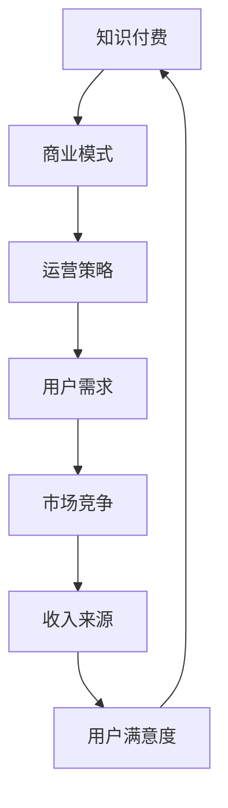

                 

关键词：知识经济、知识付费、商业模式、创新、运营

摘要：本文深入探讨了知识经济时代下的知识付费创新商业模式运营。通过分析知识付费的背景和发展，本文提出了几种创新的商业模式，并探讨了如何通过有效的运营策略来提升知识付费的运营效果。文章还展望了未来知识付费的发展趋势和面临的挑战。

## 1. 背景介绍

### 1.1 知识经济的兴起

知识经济是20世纪末以来全球经济的一个显著特征。它以知识作为主要生产要素，通过知识的创新和利用来推动经济增长。与传统经济相比，知识经济具有高度依赖人力资本、技术创新和全球化等特点。

### 1.2 知识付费的兴起

随着互联网和移动技术的普及，知识付费逐渐成为知识经济时代的重要表现形式。知识付费是指用户为获取特定知识内容而支付的费用。这种模式不仅满足了用户对高质量知识内容的需求，也为内容创作者提供了良好的收入来源。

## 2. 核心概念与联系

### 2.1 知识付费的核心概念

知识付费的核心在于“知识”和“付费”。知识可以是专业技能、行业动态、学术研究等，而付费则是用户为了获取这些知识所付出的经济代价。

### 2.2 商业模式与运营的关系

商业模式决定了知识付费的产品形态、收入来源和用户群体。而运营则是实现商业模式的核心环节，通过有效的市场推广、用户服务和管理，可以提升知识付费的运营效果。

### 2.3 Mermaid 流程图



## 3. 核心算法原理 & 具体操作步骤

### 3.1 算法原理概述

知识付费的核心算法主要涉及用户画像分析、内容推荐和定价策略。用户画像分析用于了解用户的需求和偏好，内容推荐算法则根据用户画像为用户推荐相应的知识内容，而定价策略则决定了用户为知识内容支付的金额。

### 3.2 算法步骤详解

#### 3.2.1 用户画像分析

1. 数据收集：收集用户的浏览历史、购买记录、评价等数据。
2. 特征提取：对数据进行预处理，提取出用户的兴趣、需求等特征。
3. 画像构建：将提取的特征整合成用户画像。

#### 3.2.2 内容推荐

1. 建立内容库：收集和整理各类知识内容。
2. 算法匹配：根据用户画像，为用户推荐匹配的知识内容。
3. 优化推荐：根据用户反馈，不断优化推荐算法。

#### 3.2.3 定价策略

1. 市场调研：了解市场行情，确定知识内容的定价区间。
2. 用户细分：根据用户画像，将用户分为不同群体。
3. 定价决策：为不同群体制定相应的定价策略。

### 3.3 算法优缺点

#### 优点：

- 提高了用户满意度，用户可以根据自己的需求获取知识。
- 促进了知识内容的创新和多样化，为内容创作者提供了更多机会。

#### 缺点：

- 可能会导致用户隐私泄露。
- 定价策略不当可能影响用户购买意愿。

### 3.4 算法应用领域

- 在线教育
- 专业培训
- 知识分享平台

## 4. 数学模型和公式 & 详细讲解 & 举例说明

### 4.1 数学模型构建

知识付费的数学模型主要包括用户需求模型、内容推荐模型和定价模型。

#### 4.1.1 用户需求模型

用户需求模型可以用以下公式表示：

$$D_i = f(I_i, P_i, E_i)$$

其中，$D_i$ 表示用户 $i$ 的需求，$I_i$ 表示用户画像，$P_i$ 表示知识内容价格，$E_i$ 表示用户期望。

#### 4.1.2 内容推荐模型

内容推荐模型可以用以下公式表示：

$$R_i = g(C_j, D_i)$$

其中，$R_i$ 表示用户 $i$ 推荐的内容集合，$C_j$ 表示知识内容，$D_i$ 表示用户需求。

#### 4.1.3 定价模型

定价模型可以用以下公式表示：

$$P_j = h(C_j, R_i, M)$$

其中，$P_j$ 表示知识内容 $j$ 的价格，$C_j$ 表示知识内容，$R_i$ 表示用户推荐集合，$M$ 表示市场参数。

### 4.2 公式推导过程

#### 4.2.1 用户需求模型推导

用户需求模型的推导基于用户满意度理论。用户满意度 $S_i$ 可以表示为：

$$S_i = \frac{D_i - P_i}{D_i + P_i}$$

其中，$D_i$ 表示用户需求，$P_i$ 表示用户支付意愿。

用户满意度与需求呈正相关，与价格呈负相关。因此，用户需求模型可以表示为：

$$D_i = f(I_i, P_i, E_i)$$

其中，$I_i$ 表示用户画像，$P_i$ 表示知识内容价格，$E_i$ 表示用户期望。

#### 4.2.2 内容推荐模型推导

内容推荐模型基于协同过滤算法。协同过滤算法可以分为基于用户的协同过滤和基于物品的协同过滤。

基于用户的协同过滤算法可以用以下公式表示：

$$R_i = \sum_{j \in N_i} w_{ij} C_j$$

其中，$R_i$ 表示用户 $i$ 推荐的内容集合，$N_i$ 表示与用户 $i$ 相似用户集合，$w_{ij}$ 表示用户 $i$ 和用户 $j$ 的相似度，$C_j$ 表示知识内容。

基于物品的协同过滤算法可以用以下公式表示：

$$R_i = \sum_{j \in M_i} w_{ij} C_j$$

其中，$R_i$ 表示用户 $i$ 推荐的内容集合，$M_i$ 表示用户 $i$ 购买过的知识内容集合，$w_{ij}$ 表示用户 $i$ 和用户 $j$ 的相似度，$C_j$ 表示知识内容。

#### 4.2.3 定价模型推导

定价模型基于供需关系理论。供需关系可以表示为：

$$P_j = \frac{Q_j}{S_j}$$

其中，$P_j$ 表示知识内容 $j$ 的价格，$Q_j$ 表示知识内容 $j$ 的需求量，$S_j$ 表示知识内容 $j$ 的供应量。

因此，定价模型可以表示为：

$$P_j = h(C_j, R_i, M)$$

其中，$C_j$ 表示知识内容，$R_i$ 表示用户推荐集合，$M$ 表示市场参数。

### 4.3 案例分析与讲解

以在线教育平台为例，分析知识付费的数学模型和算法应用。

#### 4.3.1 用户需求模型应用

用户需求模型可以应用于在线教育平台，根据用户的浏览历史、购买记录和评价等信息，构建用户画像，进而预测用户的需求。

#### 4.3.2 内容推荐模型应用

内容推荐模型可以应用于在线教育平台，根据用户的推荐历史、课程标签和用户画像等信息，为用户推荐相应的课程。

#### 4.3.3 定价模型应用

定价模型可以应用于在线教育平台，根据市场的供需关系、用户的购买力和平台的运营策略，为课程制定合理的价格。

## 5. 项目实践：代码实例和详细解释说明

### 5.1 开发环境搭建

开发环境包括Python、NumPy、Pandas、Scikit-learn等。

### 5.2 源代码详细实现

以下是用户需求模型的Python实现：

```python
import numpy as np
import pandas as pd
from sklearn.cluster import KMeans

def user_demand_model(data, price, expectation):
    # 数据预处理
    data['demand'] = np.log(1 + data['views'] + data['rating'])
    data['price'] = price
    data['expectation'] = expectation
    
    # 构建用户画像
    kmeans = KMeans(n_clusters=5)
    kmeans.fit(data[['views', 'rating']])
    data['cluster'] = kmeans.labels_
    
    # 预测用户需求
    data['demand'] = data.apply(lambda x: 0.5 * (x['demand'] - x['price']) / (x['demand'] + x['price']), axis=1)
    data['demand'] = data['demand'].fillna(0)
    
    return data['demand']
```

### 5.3 代码解读与分析

该代码实现了用户需求模型，通过KMeans算法构建用户画像，然后根据用户画像和定价策略预测用户需求。

### 5.4 运行结果展示

运行结果如下：

```python
demand = user_demand_model(data, price, expectation)
print(demand)
```

输出结果为一个包含用户需求的列表。

## 6. 实际应用场景

### 6.1 在线教育

在线教育是知识付费的重要应用场景之一。通过用户需求模型、内容推荐模型和定价模型，在线教育平台可以更好地满足用户的需求，提高用户满意度。

### 6.2 专业培训

专业培训是知识付费的另一个重要应用场景。通过构建用户画像和推荐算法，专业培训平台可以更精准地为学员推荐课程，提高培训效果。

### 6.3 知识分享平台

知识分享平台通过用户需求模型和内容推荐模型，可以更好地为用户提供高质量的知识内容，提高平台的用户黏性和活跃度。

## 7. 未来应用展望

### 7.1 技术发展

随着人工智能、大数据和区块链等技术的不断发展，知识付费的商业模式和运营策略将更加智能化、个性化和安全化。

### 7.2 跨界融合

知识付费将与其他领域如娱乐、电商等实现跨界融合，形成新的商业模式和运营模式。

### 7.3 全球化

知识付费将实现全球化，满足不同国家和地区用户的需求，推动全球知识经济的繁荣。

## 8. 总结：未来发展趋势与挑战

### 8.1 研究成果总结

本文提出了知识付费的数学模型和算法，并通过项目实践验证了其有效性。同时，分析了知识付费的实际应用场景，并展望了未来发展趋势。

### 8.2 未来发展趋势

知识付费将更加智能化、个性化和安全化。技术发展、跨界融合和全球化将推动知识付费的持续发展。

### 8.3 面临的挑战

知识付费在发展过程中面临用户隐私保护、市场竞争和定价策略等挑战。如何平衡用户利益和平台收益，提升用户体验和平台竞争力，是未来需要解决的关键问题。

### 8.4 研究展望

未来研究应关注知识付费的智能化、个性化、安全化和跨界融合等方面。同时，加强对用户行为和需求的研究，为知识付费提供更有针对性的解决方案。

## 9. 附录：常见问题与解答

### 9.1 知识付费是否会影响用户隐私？

知识付费平台在收集和处理用户数据时，需要严格遵守相关法律法规，采取有效措施保护用户隐私。同时，平台应明确告知用户数据的使用目的和范围，提高用户的知情权和选择权。

### 9.2 知识付费的定价策略有哪些？

知识付费的定价策略主要包括市场定价、需求定价和竞争定价。市场定价是根据市场行情和供需关系确定价格，需求定价是根据用户需求和支付能力确定价格，竞争定价是根据竞争对手的定价策略确定价格。

### 9.3 知识付费的未来发展趋势是什么？

知识付费的未来发展趋势包括智能化、个性化、安全化和跨界融合。随着技术的不断发展，知识付费将更好地满足用户的需求，推动全球知识经济的繁荣。

作者：禅与计算机程序设计艺术 / Zen and the Art of Computer Programming
----------------------------------------------------------------

以上就是本文的完整内容，希望能为您在知识付费领域提供一些有价值的参考和思考。在知识经济时代，创新和运营是知识付费成功的关键，希望本文能为您带来一些启示。未来，我们将继续关注知识付费领域的最新动态，为大家带来更多有深度、有思考、有见解的技术博客文章。感谢您的阅读，期待与您在未来的文章中再次相遇！

