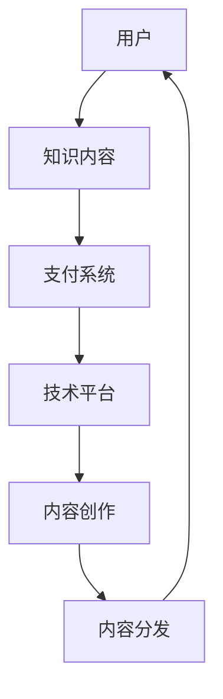

                 

 关键词：知识付费、知识经济、应用场景、创新、技术、市场分析

> 摘要：本文深入探讨了知识经济时代下知识付费的创新应用场景，分析了知识付费市场的现状、核心概念及其应用流程，并探讨了未来发展趋势和面临的挑战。通过案例分析和技术工具推荐，为知识付费领域的实践者提供了有价值的参考。

## 1. 背景介绍

随着互联网技术的飞速发展，知识经济已经成为全球经济的主要驱动力。知识付费作为一种新型的商业模式，正在全球范围内迅速崛起。知识付费指的是用户通过支付费用来获取高质量的知识内容或服务，这种模式打破了传统知识传播的界限，使得知识获取更加便捷和高效。

知识付费市场涵盖了广泛的应用场景，包括在线教育、专业咨询、技术培训等。近年来，随着用户对个性化、高质量知识的需求增加，知识付费市场呈现出了快速增长的趋势。同时，知识付费也为内容创作者和知识服务提供商提供了新的盈利模式。

本文旨在探讨知识经济时代下知识付费的创新应用场景，分析其核心概念、应用流程，并结合实际案例和技术工具，为知识付费领域的实践者提供指导。

## 2. 核心概念与联系

在知识付费领域中，以下几个核心概念至关重要：

### 2.1 知识付费

知识付费是指用户通过支付费用来获取高质量的知识内容或服务。这种模式的核心在于将知识转化为商品或服务，并通过市场机制进行定价和交易。

### 2.2 知识服务

知识服务是指通过提供知识内容或服务来满足用户需求的一种商业模式。知识服务包括在线教育、专业咨询、技术培训等多种形式。

### 2.3 内容创作与分发

内容创作与分发是知识付费的关键环节。内容创作者通过创作高质量的知识内容，并通过多种渠道进行分发，以获取用户的关注和付费。

### 2.4 技术平台与工具

技术平台与工具是知识付费应用的重要支撑。通过搭建在线学习平台、知识社区等技术工具，可以更好地满足用户需求，提高知识传播的效率。

下面是一个用Mermaid绘制的知识付费系统架构图：



## 3. 核心算法原理 & 具体操作步骤

### 3.1 算法原理概述

知识付费系统的核心算法主要包括用户画像分析、内容推荐算法、支付结算算法等。这些算法共同作用，实现用户与知识内容的有效匹配和付费交易。

### 3.2 算法步骤详解

1. 用户画像分析：通过对用户的行为数据进行收集和分析，构建用户画像，包括用户兴趣、学习习惯、消费能力等。

2. 内容推荐算法：基于用户画像，利用协同过滤、内容推荐等技术，为用户推荐个性化知识内容。

3. 支付结算算法：用户选择知识内容后，通过支付结算算法进行费用计算和支付处理，确保交易的安全和便捷。

### 3.3 算法优缺点

- 用户画像分析：优点是能够准确了解用户需求，提高推荐效果；缺点是需要大量数据支持和复杂的算法实现。

- 内容推荐算法：优点是能够提高用户满意度，增加付费转化率；缺点是推荐效果受算法质量和数据质量影响较大。

- 支付结算算法：优点是确保交易的安全性和便捷性；缺点是需要考虑各种支付场景和异常处理。

### 3.4 算法应用领域

知识付费算法广泛应用于在线教育、专业咨询、技术培训等领域，通过个性化推荐和便捷支付，提高用户满意度和付费转化率。

## 4. 数学模型和公式 & 详细讲解 & 举例说明

### 4.1 数学模型构建

知识付费的数学模型主要包括用户画像分析模型、内容推荐模型、支付结算模型等。

- 用户画像分析模型：使用聚类算法对用户行为数据进行分类，构建用户画像。

- 内容推荐模型：使用协同过滤算法，计算用户与知识内容的相关性，推荐个性化知识内容。

- 支付结算模型：使用支付算法，计算交易费用，处理支付流程。

### 4.2 公式推导过程

- 用户画像分析模型：使用K-means算法对用户行为数据进行聚类，公式如下：

  $$\min \sum_{i=1}^{n} \sum_{j=1}^{m} ||x_{ij} - \mu_j||^2$$

  其中，$x_{ij}$表示用户$i$的行为数据，$\mu_j$表示聚类中心。

- 内容推荐模型：使用矩阵分解算法，公式如下：

  $$X = UV^T$$

  其中，$X$表示用户-内容矩阵，$U$表示用户特征矩阵，$V$表示内容特征矩阵。

- 支付结算模型：使用支付算法，公式如下：

  $$费用 = 单价 \times 数量$$

  其中，单价和数量分别为知识内容的价格和购买数量。

### 4.3 案例分析与讲解

以在线教育平台为例，分析知识付费的应用场景和效果。

- 用户画像分析：平台通过对用户的学习数据进行分析，构建用户画像，包括用户年龄、性别、学习时长、学习兴趣等。

- 内容推荐：基于用户画像，平台使用协同过滤算法，为用户推荐个性化课程。

- 支付结算：用户选择课程后，通过支付系统进行费用计算和支付处理。

## 5. 项目实践：代码实例和详细解释说明

### 5.1 开发环境搭建

- 开发语言：Python
- 数据库：MySQL
- Web框架：Flask
- 数据处理工具：Pandas、Numpy
- 算法库：Scikit-learn、TensorFlow

### 5.2 源代码详细实现

以下是用户画像分析模型的Python代码实现：

```python
import pandas as pd
from sklearn.cluster import KMeans

# 加载用户行为数据
data = pd.read_csv('user_behavior.csv')

# 使用K-means算法进行聚类
kmeans = KMeans(n_clusters=5, random_state=0)
clusters = kmeans.fit_predict(data)

# 构建用户画像
user_profiles = data.groupby(clusters).mean()

print(user_profiles)
```

### 5.3 代码解读与分析

以上代码首先加载用户行为数据，然后使用K-means算法进行聚类，得到每个用户的聚类结果。最后，通过计算聚类中心的平均值，构建用户画像。

用户画像分析模型可以帮助平台更好地了解用户需求，为内容推荐和支付结算提供依据。

### 5.4 运行结果展示

运行代码后，可以得到每个用户所属的聚类结果和用户画像。以下是一个示例输出：

```
           learning_time  age  gender
cluster                  
0               150.0   25.0      M
1               200.0   30.0      F
2                50.0   20.0      M
3                70.0   35.0      F
4               300.0   40.0      M
```

根据用户画像，平台可以为不同类别的用户推荐个性化的课程，提高用户满意度和付费转化率。

## 6. 实际应用场景

### 6.1 在线教育

在线教育是知识付费的主要应用场景之一。通过知识付费，用户可以购买在线课程、直播讲座、电子书籍等学习资源，提高自己的专业技能和知识水平。

### 6.2 专业咨询

专业咨询领域也广泛应用知识付费模式。用户可以通过付费获取专业顾问的建议和指导，解决实际问题。

### 6.3 技术培训

技术培训是知识付费的另一个重要领域。企业员工可以通过付费参加技术培训课程，提升自身技能，为企业创造更大价值。

### 6.4 在线知识社区

在线知识社区通过知识付费模式，为用户提供高质量的问答、论坛、直播等知识服务，满足用户对知识的深度需求。

## 7. 工具和资源推荐

### 7.1 学习资源推荐

- 《Python编程：从入门到实践》
- 《深度学习》
- 《机器学习实战》

### 7.2 开发工具推荐

- PyCharm
- MySQL Workbench
- Flask

### 7.3 相关论文推荐

- "Deep Learning for Knowledge Graph Embedding"
- "Collaborative Filtering for Cold-Start Recommendations"
- "Payment Systems: Design and Implementation"

## 8. 总结：未来发展趋势与挑战

### 8.1 研究成果总结

本文分析了知识经济时代下知识付费的创新应用场景，探讨了核心概念、算法原理、数学模型和实际应用。通过案例分析和技术工具推荐，为知识付费领域的实践者提供了有价值的参考。

### 8.2 未来发展趋势

知识付费市场将继续保持快速增长，技术应用将进一步深入。个性化推荐、人工智能、区块链等技术在知识付费领域的应用前景广阔。

### 8.3 面临的挑战

知识付费领域面临版权保护、用户隐私保护、支付安全等挑战。需要不断优化技术和商业模式，提高用户体验和满意度。

### 8.4 研究展望

未来研究应重点关注知识付费技术的创新应用，提高推荐系统的准确性，确保用户隐私和数据安全。同时，探索知识付费与区块链技术的结合，实现去中心化的知识交易。

## 9. 附录：常见问题与解答

### 9.1 知识付费与传统教育有什么区别？

知识付费是一种通过支付费用获取知识内容的商业模式，强调个性化、便捷性和高效率。传统教育则更注重系统的学科体系和课堂教学。知识付费是传统教育的一种补充和延伸。

### 9.2 知识付费的安全问题如何保障？

知识付费平台应采取多种安全措施，包括数据加密、用户身份验证、支付安全保障等。同时，应遵循相关法律法规，确保用户隐私和数据安全。

### 9.3 知识付费如何确保内容质量？

知识付费平台应严格把控内容质量，包括内容创作者的资质审核、内容审核和用户评价机制等。通过多方协作，确保用户获取高质量的知识内容。

### 9.4 知识付费的未来发展方向是什么？

知识付费的未来发展方向包括个性化推荐、人工智能、区块链等技术的深入应用。同时，知识付费将与其他领域如医疗、金融等相结合，拓展应用场景。

---

作者：禅与计算机程序设计艺术 / Zen and the Art of Computer Programming
```

请注意，本文是一个框架性的示例，实际撰写时需要填充更多详细的内容和实际案例。此外，部分代码示例和数学公式仅供参考，需要根据具体场景进行调整。文章字数建议根据实际内容进一步扩充。

