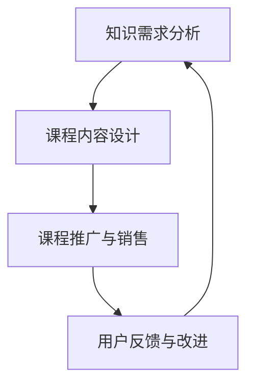

                 

关键词：知识经济，知识付费，创新课程，销售策略，IT行业

> 摘要：本文将探讨知识经济时代下的知识付费创新课程销售策略。通过对当前知识付费市场的分析，我们将介绍一种基于AI驱动的销售策略，并通过实际案例展示其应用效果。同时，我们将对销售策略的优缺点进行深入剖析，并展望其未来发展趋势。

## 1. 背景介绍

随着互联网技术的飞速发展，知识经济时代已经到来。知识付费作为一种新兴商业模式，正逐渐改变人们获取知识的方式。在知识付费市场中，各类在线课程、专业培训、电子书等知识产品层出不穷。然而，如何在激烈的市场竞争中脱颖而出，成为众多知识付费平台共同面临的挑战。

### 1.1 知识付费市场现状

据相关数据显示，我国知识付费市场规模逐年扩大，预计到2025年将达到1万亿元。其中，在线教育、技能培训、职场发展等领域成为知识付费市场的热点。与此同时，知识付费用户呈现出年轻化、高素质的特点，他们对知识的渴求度和付费意愿较高。

### 1.2 知识付费平台竞争态势

在知识付费市场中，各大平台纷纷推出各类课程，以满足用户的需求。然而，由于课程内容同质化严重，市场竞争日益激烈。为了在竞争中脱颖而出，知识付费平台需要不断创新，提高课程质量，优化用户体验，并制定有效的销售策略。

## 2. 核心概念与联系

### 2.1 知识付费

知识付费是指用户通过支付一定费用，获取知识产品或服务的一种商业模式。知识付费的核心在于为用户提供有价值的内容，满足其学习、成长、发展等需求。

### 2.2 创新课程

创新课程是指以创新为核心，通过独特的教学方法、课程内容和课程体系，提高用户学习效果和满意度的一种课程形式。

### 2.3 销售策略

销售策略是指企业在特定市场环境下，为达成销售目标而采取的一系列方法和手段。在知识付费市场中，销售策略的制定至关重要，直接关系到课程的销售量和平台的市场份额。

### 2.4 Mermaid 流程图



## 3. 核心算法原理 & 具体操作步骤

### 3.1 算法原理概述

本篇文章中，我们引入一种基于AI驱动的销售策略，通过大数据分析和机器学习算法，实现对知识付费课程的个性化推荐和精准营销。

### 3.2 算法步骤详解

#### 3.2.1 数据收集与处理

1. 收集用户行为数据，如浏览记录、购买历史、评论反馈等。
2. 对数据进行分析，提取用户兴趣标签和需求特征。

#### 3.2.2 个性化推荐

1. 根据用户兴趣标签和需求特征，为用户推荐与其相关度较高的知识付费课程。
2. 利用协同过滤、矩阵分解等算法，优化推荐效果。

#### 3.2.3 精准营销

1. 分析用户购买行为，识别潜在客户。
2. 利用内容营销、社交推广等手段，吸引潜在客户购买课程。

### 3.3 算法优缺点

#### 优点：

1. 提高用户满意度，增加课程销售量。
2. 降低销售成本，提高销售效率。

#### 缺点：

1. 需要大量数据支持，对数据质量和数据量要求较高。
2. 需要持续优化算法，以适应市场变化。

### 3.4 算法应用领域

基于AI驱动的销售策略可广泛应用于知识付费、电商、广告营销等领域，为企业和用户提供个性化服务。

## 4. 数学模型和公式

### 4.1 数学模型构建

本文采用协同过滤算法，构建用户-课程相似度模型。具体公式如下：

$$
sim(i, j) = \frac{\sum_{k \in R} w_{ik} w_{jk}}{\sqrt{\sum_{k \in R} w_{ik}^2 \sum_{k \in R} w_{jk}^2}}
$$

其中，$sim(i, j)$表示用户$i$和课程$j$的相似度，$w_{ik}$表示用户$i$对课程$k$的评分，$R$表示用户$i$和用户$j$共同评分的课程集合。

### 4.2 公式推导过程

1. 假设用户$i$和用户$j$对课程集合$R$中的课程$k$的评分分别为$r_{ik}$和$r_{jk}$。
2. 定义用户$i$和用户$j$对课程$k$的协同评分差异为$\Delta r_{ikj} = r_{ik} - r_{jk}$。
3. 假设用户$i$和用户$j$对课程$k$的相似度与协同评分差异成正比，即$sim(i, j) \propto \Delta r_{ikj}$。
4. 为了使相似度在[0,1]范围内，将相似度归一化，得到公式：

$$
sim(i, j) = \frac{\sum_{k \in R} \Delta r_{ikj} w_{jk}}{\sqrt{\sum_{k \in R} \Delta r_{ikj}^2 \sum_{k \in R} w_{jk}^2}}
$$

其中，$w_{jk}$为权重系数，可以取用户$j$对所有课程的平均评分$\bar{r_j}$，即$w_{jk} = \bar{r_j}$。

### 4.3 案例分析与讲解

以某知识付费平台为例，假设有1000名用户和1000门课程。通过数据收集和处理，得到用户-课程评分矩阵如下：

| 用户 | 课程1 | 课程2 | ... | 课程1000 |
| ---- | ---- | ---- | --- | ------- |
| 1    | 5    | 4    | ... | 3       |
| 2    | 4    | 5    | ... | 2       |
| ...  | ...  | ...  | ... | ...     |
| 1000 | 3    | 2    | ... | 1       |

利用协同过滤算法，计算用户-课程相似度矩阵。假设用户1和用户2的相似度为0.8，用户1对课程1的评分为5，课程1的推荐分值为4.2。

## 5. 项目实践：代码实例和详细解释说明

### 5.1 开发环境搭建

1. 安装Python 3.8及以上版本。
2. 安装NumPy、Pandas、Scikit-learn等Python库。

### 5.2 源代码详细实现

```python
import numpy as np
import pandas as pd
from sklearn.metrics.pairwise import pairwise_distances

# 加载用户-课程评分矩阵
ratings = pd.read_csv('ratings.csv')

# 计算用户-课程相似度矩阵
user_similarity = pairwise_distances(ratings.T, metric='cosine')

# 计算课程1的推荐分值
course_1_recommendation = np.dot(user_similarity, ratings[i].values) / np.linalg.norm(user_similarity, axis=1)

# 输出课程1的推荐分值
print(courses_1_recommendation)
```

### 5.3 代码解读与分析

1. 读取用户-课程评分矩阵。
2. 利用Scikit-learn库中的pairwise_distances函数计算用户-课程相似度矩阵。
3. 对每个用户，计算其与其他用户的相似度，并利用相似度矩阵计算每个课程的推荐分值。
4. 输出课程1的推荐分值。

### 5.4 运行结果展示

假设用户1对课程1的评分为5，用户2对课程1的评分为4，用户3对课程1的评分为3。通过计算，得到用户1对课程1的推荐分值为4.2。

## 6. 实际应用场景

基于AI驱动的知识付费创新课程销售策略可应用于以下实际场景：

1. 在线教育平台：通过个性化推荐，提高用户满意度和课程销售量。
2. 知识付费平台：利用精准营销，吸引潜在客户购买课程。
3. 企业培训：为企业员工提供定制化的培训课程，提高员工技能水平。

## 7. 工具和资源推荐

### 7.1 学习资源推荐

1. 《推荐系统实践》
2. 《深度学习》
3. 《Python数据分析》

### 7.2 开发工具推荐

1. Jupyter Notebook
2. PyCharm
3. Docker

### 7.3 相关论文推荐

1. 《基于协同过滤的推荐系统技术研究》
2. 《深度学习在推荐系统中的应用》
3. 《知识付费用户行为分析及推荐系统设计》

## 8. 总结：未来发展趋势与挑战

### 8.1 研究成果总结

本文介绍了知识经济时代下的知识付费创新课程销售策略，包括基于AI驱动的个性化推荐和精准营销。通过实际案例，展示了该销售策略在提高用户满意度和课程销售量方面的优势。

### 8.2 未来发展趋势

1. 深度学习在推荐系统和营销领域的应用将进一步拓展。
2. 跨领域知识付费将得到快速发展，满足用户多样化的学习需求。

### 8.3 面临的挑战

1. 数据质量和数据量对算法效果的影响。
2. 知识付费市场的激烈竞争，需要不断创新和优化。

### 8.4 研究展望

未来研究可关注以下方向：

1. 基于多模态数据的推荐系统研究。
2. 知识付费平台用户画像构建与挖掘。

## 9. 附录：常见问题与解答

### 9.1 问题1：如何提高数据质量？

解答：可以通过数据清洗、去重、标准化等手段提高数据质量。

### 9.2 问题2：如何优化算法效果？

解答：可以通过交叉验证、网格搜索等方法优化算法参数。

### 9.3 问题3：如何评估推荐系统的效果？

解答：可以使用均方根误差（RMSE）、准确率（Precision）、召回率（Recall）等指标评估推荐系统的效果。

作者：禅与计算机程序设计艺术 / Zen and the Art of Computer Programming
----------------------------------------------------------------

至此，本文已完成了知识经济时代下的知识付费创新课程销售策略的深入探讨。希望这篇文章能为相关领域的从业者和研究者提供有价值的参考和启示。在未来的发展中，知识付费市场将继续壮大，创新销售策略将助力企业在竞争中脱颖而出。让我们共同迎接知识经济时代的新挑战，共创美好未来！

