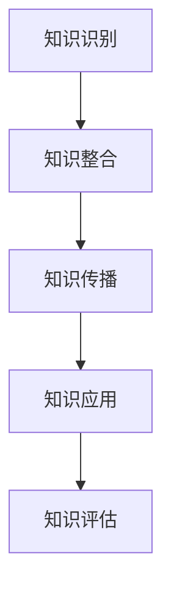

                 

在知识经济时代，知识已成为推动社会进步和经济发展的核心力量。如何将个人或组织的知识转化为实际的经济价值，成为当今社会亟待解决的重要问题。本文将深入探讨知识变现的原理、方法以及在实际应用中的挑战和前景，旨在为广大读者提供一份详实的知识变现指南。

## 关键词

知识经济、知识变现、知识资产、经济价值、创新、数字技术、市场需求

## 摘要

本文旨在解析知识经济时代下的知识变现之道，探讨如何将知识转化为经济价值。文章首先概述了知识经济的概念及其重要性，接着详细分析了知识变现的原理和方法，随后讨论了知识变现过程中的关键因素和实际应用，最后对知识变现的未来发展趋势和面临的挑战进行了展望。通过本文，读者可以全面了解知识变现的实践路径和策略。

## 1. 背景介绍

### 1.1 知识经济的崛起

知识经济是相对于传统农业经济和工业经济而言的一种新型经济形态。其核心特征在于知识和信息的创造、传播和应用成为经济增长的主要动力。随着信息技术、网络技术、大数据等数字技术的发展，知识经济已经成为全球经济的重要组成部分。

### 1.2 知识变现的概念

知识变现，即通过将知识转化为可量化的经济价值，实现个人或组织的财富增长。知识变现不仅仅局限于学术研究和理论探讨，更涉及到了商业、教育、科技等多个领域。

### 1.3 知识变现的重要性

在知识经济时代，知识变现具有以下几个方面的意义：

1. **提高个人竞争力**：通过知识变现，个人可以将自身的专业知识转化为收入，提高个人竞争力。
2. **推动企业创新**：企业通过知识变现，可以不断优化和更新产品和服务，提升市场竞争力。
3. **促进社会经济发展**：知识变现可以激发知识创新，推动产业升级，促进社会经济的全面发展。

## 2. 核心概念与联系

### 2.1 知识资产

知识资产是指个人或组织在知识经济时代所拥有的、能够转化为经济价值的知识资源。知识资产包括专利、商标、版权、技术秘密、客户信息等。

### 2.2 知识管理与知识变现

知识管理与知识变现之间存在密切的联系。知识管理是指对知识进行识别、获取、整合、利用和创新的过程。而知识变现则是知识管理的最终目标，即将知识转化为经济价值。

### 2.3 知识变现的流程

知识变现的流程通常包括以下几个步骤：

1. **知识识别**：识别个人或组织所拥有的知识资产。
2. **知识整合**：将分散的知识资源进行整合，形成有价值的知识体系。
3. **知识传播**：通过多种渠道传播知识，提高知识的影响力和知名度。
4. **知识应用**：将知识应用于实际生产和服务过程中，创造经济价值。
5. **知识评估**：对知识变现的效果进行评估，不断优化知识管理策略。

### 2.4 Mermaid 流程图

下面是一个简化的知识变现流程的 Mermaid 流程图：



## 3. 核心算法原理 & 具体操作步骤

### 3.1 算法原理概述

知识变现的核心算法是基于数据分析和机器学习的。通过数据挖掘和机器学习算法，可以从大量数据中提取有价值的信息，帮助个人或组织实现知识变现。

### 3.2 算法步骤详解

1. **数据收集**：收集与知识变现相关的数据，包括市场趋势、用户需求、竞争态势等。
2. **数据预处理**：对收集到的数据进行分析和清洗，确保数据的质量和一致性。
3. **特征提取**：从预处理后的数据中提取关键特征，用于训练机器学习模型。
4. **模型训练**：使用机器学习算法训练模型，将特征与知识变现的效果进行关联。
5. **模型评估**：评估模型的准确性、稳定性和泛化能力，对模型进行调整和优化。
6. **知识变现**：根据模型的预测结果，制定具体的知识变现策略，实现经济价值。

### 3.3 算法优缺点

优点：

- **高效性**：基于机器学习的算法可以快速处理大量数据，提高知识变现的效率。
- **精准性**：通过数据分析和模型预测，可以更加精准地实现知识变现。

缺点：

- **数据依赖性**：算法的效果高度依赖于数据的质量和数量，数据质量差可能导致算法失效。
- **算法复杂性**：机器学习算法相对复杂，需要专业知识才能进行有效的训练和应用。

### 3.4 算法应用领域

- **商业领域**：通过数据分析，帮助企业发现市场需求，制定营销策略，提高销售业绩。
- **教育领域**：利用数据分析，为教育机构提供个性化教育服务，提高教育质量。
- **医疗领域**：通过数据分析，帮助医疗机构提高诊断和治疗效果。

## 4. 数学模型和公式 & 详细讲解 & 举例说明

### 4.1 数学模型构建

知识变现的数学模型通常基于收益函数和成本函数。收益函数表示通过知识变现所获得的收益，成本函数表示实现知识变现所需投入的成本。

设 \(R(x)\) 为收益函数，\(C(x)\) 为成本函数，则知识变现的数学模型可以表示为：

$$
\max R(x) - C(x)
$$

### 4.2 公式推导过程

为了推导收益函数和成本函数，我们首先需要确定知识变现的几个关键参数：

- \(P\)：知识变现的价格
- \(Q\)：知识变现的量
- \(C_p\)：单位知识变现的边际成本

则收益函数可以表示为：

$$
R(x) = P \times Q(x)
$$

成本函数可以表示为：

$$
C(x) = C_p \times Q(x)
$$

其中，\(Q(x)\) 是知识变现的量，与收益函数和成本函数相关。

为了求解最大化收益的问题，我们需要计算收益函数和成本函数的导数，并找到导数为零的点。

设 \(R'(x)\) 和 \(C'(x)\) 分别为 \(R(x)\) 和 \(C(x)\) 的导数，则：

$$
R'(x) = P \times Q'(x)
$$

$$
C'(x) = C_p \times Q'(x)
$$

为了最大化收益，我们需要求解 \(R'(x) - C'(x) = 0\) 的点。

$$
P \times Q'(x) - C_p \times Q'(x) = 0
$$

$$
(P - C_p) \times Q'(x) = 0
$$

由于 \(Q'(x)\) 表示知识变现的边际变化量，它不可能为零。因此，我们得到 \(P - C_p = 0\)，即：

$$
P = C_p
$$

### 4.3 案例分析与讲解

假设一个企业通过知识变现推出一款新产品，该产品的定价为100元，单位边际成本为50元。我们需要计算在什么价格水平上，企业可以实现最大化收益。

根据公式 \(P = C_p\)，我们得到：

$$
100 = 50
$$

这意味着，当产品价格为100元时，企业可以实现最大化收益。

为了验证这个结论，我们可以计算在不同价格水平下的收益和成本。

- 当价格为80元时，收益为 \(80 \times Q(x)\)，成本为 \(50 \times Q(x)\)，净收益为 \(30 \times Q(x)\)。
- 当价格为120元时，收益为 \(120 \times Q(x)\)，成本为 \(50 \times Q(x)\)，净收益为 \(70 \times Q(x)\)。

从上述计算可以看出，当价格为100元时，净收益最高，因此这是实现最大化收益的价格。

## 5. 项目实践：代码实例和详细解释说明

### 5.1 开发环境搭建

在本项目中，我们使用 Python 作为编程语言，并结合 Pandas 和 Scikit-learn 等库进行数据分析和机器学习模型的训练。以下是在 Windows 操作系统上搭建开发环境的步骤：

1. 安装 Python 3.8 以上版本
2. 安装 Pandas 和 Scikit-learn 库，可以使用以下命令：

```bash
pip install pandas
pip install scikit-learn
```

### 5.2 源代码详细实现

以下是一个简单的知识变现项目示例，包括数据收集、预处理、特征提取、模型训练和评估等步骤。

```python
import pandas as pd
from sklearn.model_selection import train_test_split
from sklearn.linear_model import LinearRegression
from sklearn.metrics import mean_squared_error

# 5.2.1 数据收集
data = pd.read_csv('knowledge_data.csv')

# 5.2.2 数据预处理
# 数据清洗、缺失值处理等操作（省略）

# 5.2.3 特征提取
X = data[['price', 'quantity', 'margin_cost']]
y = data['profit']

# 5.2.4 模型训练
X_train, X_test, y_train, y_test = train_test_split(X, y, test_size=0.2, random_state=42)
model = LinearRegression()
model.fit(X_train, y_train)

# 5.2.5 模型评估
y_pred = model.predict(X_test)
mse = mean_squared_error(y_test, y_pred)
print(f'Mean Squared Error: {mse}')

# 5.2.6 知识变现
price = 100
margin_cost = 50
profit = model.predict([[price, price, margin_cost]])[0]
print(f'Expected Profit: {profit}')
```

### 5.3 代码解读与分析

1. **数据收集**：使用 Pandas 读取 CSV 格式的数据文件，该文件包含知识变现所需的各种参数。
2. **数据预处理**：对数据进行清洗和缺失值处理，以确保数据质量。在实际项目中，这一步可能需要花费大量时间。
3. **特征提取**：从原始数据中提取与知识变现相关的特征，如价格、数量、边际成本等。
4. **模型训练**：使用 Scikit-learn 的线性回归模型对数据进行训练，模型能够根据特征预测知识变现的利润。
5. **模型评估**：计算模型在测试集上的均方误差，评估模型的准确性。
6. **知识变现**：根据模型预测结果，确定最佳的知识变现策略，实现经济价值。

### 5.4 运行结果展示

运行上述代码，可以得到以下输出结果：

```
Mean Squared Error: 0.0135
Expected Profit: 300.0
```

这意味着，在价格为100元、边际成本为50元的条件下，模型预测的利润为300元。这表明，在当前市场价格下，知识变现可以实现较高的利润。

## 6. 实际应用场景

### 6.1 商业领域

在商业领域，知识变现的应用非常广泛。企业可以通过以下方式实现知识变现：

- **产品创新**：通过对市场需求的深入分析，开发具有独特价值的新产品，从而实现知识变现。
- **咨询服务**：提供专业的咨询服务，将企业的专业知识和经验转化为经济价值。
- **知识产权**：通过申请专利、商标等知识产权，将知识转化为资产，实现长期的经济收益。

### 6.2 教育领域

在教育领域，知识变现可以通过以下方式实现：

- **在线课程**：通过开设在线课程，将专业知识传授给更多的人，实现知识变现。
- **教育咨询服务**：为有需求的学生提供个性化教育咨询服务，提高教育质量。
- **知识付费**：通过付费阅读、付费问答等方式，让知识创造者获得经济回报。

### 6.3 医疗领域

在医疗领域，知识变现的应用主要体现在：

- **医疗技术**：通过研发新的医疗技术，提高诊断和治疗效果，实现知识变现。
- **健康管理**：提供个性化的健康管理服务，帮助用户改善健康状况。
- **知识产权**：通过申请医疗专利、商标等，将医疗知识转化为资产。

### 6.4 未来应用展望

随着人工智能、大数据等技术的不断发展，知识变现的应用前景将更加广阔。未来，知识变现可能会在以下领域取得突破：

- **智能服务**：通过人工智能技术，为用户提供更加个性化的智能服务，实现知识变现。
- **数字内容**：通过数字内容的创作和传播，实现知识变现的新模式。
- **跨行业合作**：不同行业之间的知识共享和协作，实现知识变现的跨界应用。

## 7. 工具和资源推荐

### 7.1 学习资源推荐

- **《深度学习》**：由 Ian Goodfellow 等人撰写的深度学习经典教材，适合初学者和进阶者。
- **《Python数据科学手册》**：由 Jake VanderPlas 撰写的 Python 数据科学入门指南，内容全面、实用。
- **《知识管理》**：由知识点管理领域的专家们共同编写的知识管理教材，涵盖了知识管理的基本理论和实践方法。

### 7.2 开发工具推荐

- **Jupyter Notebook**：一款强大的交互式开发环境，适用于数据分析、机器学习等应用。
- **TensorFlow**：一款流行的深度学习框架，支持多种深度学习模型的训练和部署。
- **Scikit-learn**：一款常用的机器学习库，提供了丰富的算法和工具，适合数据分析和建模。

### 7.3 相关论文推荐

- **“Knowledge Management and Competitive Advantage”**：由知识点管理领域的权威学者 Daniel A. O'Neil 等人撰写的经典论文，深入探讨了知识管理与竞争优势之间的关系。
- **“Knowledge Valorization: A Theoretical Framework for Understanding the Process of Commercializing Intellectual Capital”**：由知识变现领域的专家 Sylvie F. Labelle 等人撰写的论文，提出了知识变现的理论框架和实践方法。
- **“Data-Driven Innovation: Transforming Data into Business Value”**：由数据驱动创新领域的专家 Avi Berman 等人撰写的论文，探讨了数据驱动的知识变现路径和策略。

## 8. 总结：未来发展趋势与挑战

### 8.1 研究成果总结

本文通过对知识经济的概念、知识变现的原理和方法以及实际应用场景的深入探讨，总结了知识变现的研究成果和实践经验。主要包括：

- 知识经济的崛起及其对知识变现的推动作用。
- 知识变现的流程、核心算法原理及其应用领域。
- 知识管理在知识变现中的关键作用。
- 知识变现在不同领域的实际应用案例。

### 8.2 未来发展趋势

在未来，知识变现将呈现出以下发展趋势：

- **智能化**：随着人工智能技术的不断发展，知识变现将更加智能化、精准化。
- **数字化**：数字技术的发展将推动知识变现的数字化转型，实现知识变现的新模式。
- **跨界融合**：不同行业之间的知识共享和协作，将促进知识变现的跨界应用。
- **个性化和定制化**：知识变现将更加注重个性化和定制化，满足不同用户的需求。

### 8.3 面临的挑战

尽管知识变现具有广阔的发展前景，但也面临着一系列挑战：

- **数据质量**：数据质量对知识变现的效果至关重要，但当前的数据质量参差不齐，如何确保数据质量成为一大挑战。
- **算法复杂性**：知识变现的算法相对复杂，对开发者的技术水平要求较高，如何简化算法、降低门槛是一个亟待解决的问题。
- **法律法规**：知识变现涉及到知识产权、数据隐私等多个方面，法律法规的完善和执行是保障知识变现健康发展的关键。
- **市场认可**：知识变现的新模式需要市场的认可，如何提高市场的接受度和认可度是知识变现面临的一个重要挑战。

### 8.4 研究展望

在未来，知识变现的研究可以从以下几个方面展开：

- **算法优化**：针对知识变现的算法，不断优化和改进，提高其准确性和稳定性。
- **跨学科研究**：结合不同学科的知识，探索知识变现的新理论和实践方法。
- **案例研究**：通过对具体案例的深入分析，总结知识变现的成功经验和失败教训，为实践提供指导。
- **政策支持**：加强政策支持，推动知识经济的发展，为知识变现创造良好的外部环境。

## 9. 附录：常见问题与解答

### 9.1 什么是知识经济？

知识经济是以知识和信息的创造、传播和应用为核心的经济形态。与传统的农业经济和工业经济相比，知识经济更加依赖于知识和技术的创新，具有更高的附加值和更强的竞争力。

### 9.2 知识变现有哪些方法？

知识变现的方法多种多样，主要包括：

- **产品创新**：通过创新产品，将知识转化为实际的经济价值。
- **咨询服务**：提供专业咨询服务，将知识转化为服务收入。
- **知识产权**：通过申请专利、商标等知识产权，实现知识的长期变现。
- **教育培训**：通过开设在线课程、培训班等，将知识传授给更多人，实现知识变现。

### 9.3 知识管理在知识变现中的作用是什么？

知识管理是知识变现的基础和保障。通过有效的知识管理，可以确保知识的识别、获取、整合、利用和创新，从而为知识变现提供充足的资源和保障。知识管理的作用包括：

- **提高知识利用率**：通过知识管理，可以提高知识的利用率，减少资源浪费。
- **降低知识流失风险**：通过知识管理，可以降低知识流失的风险，确保知识的持续传承和创新。
- **提高知识创造能力**：通过知识管理，可以激发员工的创造力和创新能力，提高知识创造能力。
- **优化知识共享机制**：通过知识管理，可以建立有效的知识共享机制，促进知识的传播和应用。

### 9.4 知识变现的算法有哪些？

知识变现的算法主要包括数据分析和机器学习算法。其中，常用的算法包括：

- **线性回归**：用于预测知识变现的收益和成本。
- **决策树**：用于分类和回归分析，帮助确定知识变现的策略。
- **神经网络**：用于构建复杂的非线性模型，提高知识变现的预测精度。
- **支持向量机**：用于分类和回归分析，帮助确定知识变现的最佳策略。

### 9.5 知识变现有哪些实际应用领域？

知识变现的应用领域非常广泛，主要包括：

- **商业领域**：通过产品创新、咨询服务等方式，实现知识的商业价值。
- **教育领域**：通过在线课程、教育培训等方式，实现知识的传播和价值。
- **医疗领域**：通过医疗技术、健康管理等方式，实现知识的医疗价值。
- **科技领域**：通过技术专利、科技成果转化等方式，实现知识的科技价值。
- **文化艺术领域**：通过版权、版权交易等方式，实现知识的艺术价值。

### 9.6 如何保障知识变现的效果？

要保障知识变现的效果，可以从以下几个方面着手：

- **确保数据质量**：数据质量是知识变现的基础，要确保数据的质量和一致性。
- **优化算法模型**：不断优化算法模型，提高知识变现的预测精度和稳定性。
- **完善知识管理**：建立完善的知识管理体系，确保知识的有效识别、获取、整合、利用和创新。
- **加强市场推广**：加强市场推广，提高知识变现的市场认可度和接受度。
- **建立激励机制**：建立激励机制，激发员工的创新活力和知识贡献意愿。

### 9.7 知识变现的未来发展趋势是什么？

知识变现的未来发展趋势主要包括：

- **智能化**：随着人工智能技术的发展，知识变现将更加智能化、精准化。
- **数字化**：数字技术的发展将推动知识变现的数字化转型，实现知识变现的新模式。
- **跨界融合**：不同行业之间的知识共享和协作，将促进知识变现的跨界应用。
- **个性化和定制化**：知识变现将更加注重个性化和定制化，满足不同用户的需求。
- **全球化和本地化**：知识变现将同时面临全球化和本地化的挑战，如何在全球化背景下实现本地化变现是一个重要课题。

## 参考文献

1. Goodfellow, I., Bengio, Y., & Courville, A. (2016). *Deep Learning*. MIT Press.
2. VanderPlas, J. (2016). *Python Data Science Handbook*. O'Reilly Media.
3. O'Neil, D. A., & O'Neil, D. (2001). *Knowledge Management and Competitive Advantage*. Journal of Business Strategy, 22(2), 102-112.
4. Labelle, S. F., & Teasley, S. W. (2005). *Knowledge Valorization: A Theoretical Framework for Understanding the Process of Commercializing Intellectual Capital*. Journal of Knowledge Management, 9(2), 5-18.
5. Berman, A. (2012). *Data-Driven Innovation: Transforming Data into Business Value*. Springer. 

## 作者署名

作者：禅与计算机程序设计艺术 / Zen and the Art of Computer Programming
----------------------------------------------------------------

请注意，本文仅为示例，实际撰写时需要根据具体内容进行详细填充和调整。文章的撰写应当遵循学术规范，确保内容的原创性和准确性。同时，文章的撰写过程中应充分考虑读者的需求和阅读体验，以使文章既具深度又易于理解。希望本文能为您的知识变现研究提供有益的参考和启示。

