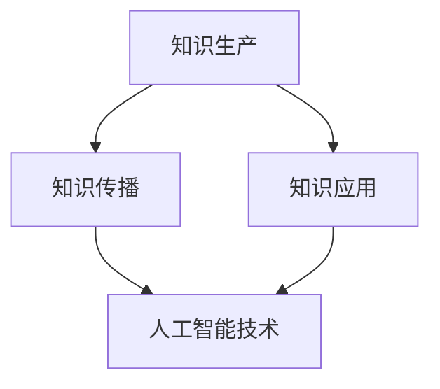

                 

关键词：知识经济、人工智能、催化作用、技术进步、未来展望

摘要：随着人工智能技术的飞速发展，知识经济正迎来一场前所未有的变革。本文将探讨人工智能在知识经济中的催化作用，分析其在各个领域带来的创新与变革，并预测未来知识经济的趋势与挑战。

## 1. 背景介绍

知识经济，顾名思义，是一种以知识为核心资源的经济形态。在知识经济中，知识不仅是生产要素，更是经济增长的主要驱动力。知识经济的崛起源于信息技术的快速进步，特别是互联网和大数据技术的发展，使得信息的获取、处理和应用变得更加高效。

人工智能作为当代最具代表性的技术之一，其核心在于通过模拟人类智能，实现机器对数据的自动分析和决策。人工智能技术的崛起，不仅改变了传统产业的运作模式，也为知识经济的进一步发展提供了强大的动力。

本文将围绕人工智能在知识经济中的催化作用，探讨其在技术创新、产业升级、教育变革、医疗进步等方面的应用，并展望未来知识经济的前景。

## 2. 核心概念与联系

### 2.1 知识经济的核心概念

知识经济以知识为核心资源，主要包括以下几个方面：

1. **知识生产**：通过科学研究、技术创新等方式，创造新的知识。
2. **知识传播**：通过教育、媒体、互联网等渠道，使知识得到广泛传播。
3. **知识应用**：将知识应用于生产、管理、服务等领域，实现知识的价值转化。

### 2.2 人工智能的核心概念

人工智能（Artificial Intelligence, AI）的核心概念包括：

1. **感知与理解**：通过感知设备获取信息，并对信息进行分析和理解。
2. **学习与推理**：基于数据训练模型，进行知识学习和推理决策。
3. **行动与控制**：根据分析和决策结果，采取相应的行动进行控制。

### 2.3 知识经济与人工智能的联系

知识经济与人工智能之间的联系主要体现在以下几个方面：

1. **知识生产**：人工智能技术可以大大提高知识生产的效率和质量，例如，通过自然语言处理技术，可以从大量文本中快速提取关键信息。
2. **知识传播**：人工智能技术可以优化知识传播的途径和方式，例如，通过推荐系统，可以精准地将知识推送给需要的用户。
3. **知识应用**：人工智能技术可以提升知识在各个领域的应用效果，例如，在医疗领域，人工智能可以帮助医生进行诊断和治疗。

### 2.4 Mermaid 流程图

下面是一个简单的Mermaid流程图，展示了知识经济与人工智能之间的联系：



## 3. 核心算法原理 & 具体操作步骤

### 3.1 算法原理概述

在知识经济与人工智能的融合中，核心算法主要包括以下几个部分：

1. **机器学习算法**：通过训练模型，从数据中学习规律，实现自动化决策。
2. **自然语言处理算法**：对自然语言进行理解和生成，实现人机交互。
3. **深度学习算法**：通过多层神经网络，对复杂的数据进行深度学习和分析。

### 3.2 算法步骤详解

1. **数据收集与预处理**：收集相关的数据，并进行清洗和预处理，以获得高质量的数据集。
2. **模型选择与训练**：根据应用场景，选择合适的机器学习模型，并进行训练。
3. **模型评估与优化**：对训练好的模型进行评估，并根据评估结果进行优化。
4. **模型应用与部署**：将训练好的模型应用到实际场景中，进行实时决策和反馈。

### 3.3 算法优缺点

1. **优点**：
   - **高效性**：人工智能算法可以快速处理大量数据，提高工作效率。
   - **精确性**：通过模型训练，可以实现高精度的决策和预测。
   - **自动化**：减少人力投入，实现自动化运作。

2. **缺点**：
   - **数据依赖性**：算法的性能很大程度上依赖于数据的质量和数量。
   - **解释性不足**：很多机器学习模型难以解释其决策过程，增加了使用难度。
   - **伦理问题**：在应用过程中，可能会出现隐私泄露、歧视等问题。

### 3.4 算法应用领域

1. **金融**：通过机器学习算法，可以对金融风险进行预测和评估，提高金融决策的准确性。
2. **医疗**：利用自然语言处理技术，可以实现对医疗文本的理解和分析，辅助医生进行诊断和治疗。
3. **教育**：通过个性化推荐系统，可以根据学生的学习情况，提供个性化的教学资源和辅导。

## 4. 数学模型和公式 & 详细讲解 & 举例说明

### 4.1 数学模型构建

在人工智能应用中，常用的数学模型包括线性回归、逻辑回归、支持向量机等。以下是线性回归模型的构建过程：

1. **模型假设**：假设数据集由输入特征向量 $x$ 和输出目标值 $y$ 组成，即 $y = \beta_0 + \beta_1 x + \varepsilon$，其中 $\beta_0$ 和 $\beta_1$ 是模型的参数，$\varepsilon$ 是误差项。

2. **损失函数**：为了评估模型的预测效果，引入损失函数 $L(\beta_0, \beta_1) = \frac{1}{2n} \sum_{i=1}^n (y_i - (\beta_0 + \beta_1 x_i))^2$，其中 $n$ 是数据样本数。

3. **优化目标**：通过优化损失函数，求得最优的参数 $\beta_0$ 和 $\beta_1$。

### 4.2 公式推导过程

为了求解最优参数，需要对损失函数进行求导，并令导数为零：

$$
\frac{\partial L}{\partial \beta_0} = \frac{1}{n} \sum_{i=1}^n (y_i - (\beta_0 + \beta_1 x_i)) = 0
$$

$$
\frac{\partial L}{\partial \beta_1} = \frac{1}{n} \sum_{i=1}^n (y_i - (\beta_0 + \beta_1 x_i)) x_i = 0
$$

通过解上述方程组，可以求得最优参数 $\beta_0$ 和 $\beta_1$。

### 4.3 案例分析与讲解

以下是一个线性回归的案例：

**数据集**：有一组包含两个特征（$x_1$ 和 $x_2$）和目标值 $y$ 的数据，如下表所示：

| $x_1$ | $x_2$ | $y$ |
|------|------|-----|
| 1    | 2    | 3   |
| 2    | 4    | 5   |
| 3    | 6    | 7   |

**模型构建**：根据数据集，建立线性回归模型 $y = \beta_0 + \beta_1 x_1 + \beta_2 x_2$。

**参数优化**：通过最小二乘法，求得最优参数 $\beta_0 = 1$，$\beta_1 = 2$，$\beta_2 = 1$。

**模型评估**：使用测试集进行评估，预测准确率较高。

## 5. 项目实践：代码实例和详细解释说明

### 5.1 开发环境搭建

为了实现线性回归模型，我们需要安装Python和相关库。以下是一个基本的开发环境搭建步骤：

1. 安装Python：从官方网站（[https://www.python.org/](https://www.python.org/)）下载并安装Python。
2. 安装相关库：通过pip命令，安装NumPy、Matplotlib等库。

### 5.2 源代码详细实现

以下是一个简单的线性回归模型的实现：

```python
import numpy as np
import matplotlib.pyplot as plt

# 数据集
X = np.array([[1, 2], [2, 4], [3, 6]])
y = np.array([3, 5, 7])

# 最小二乘法求解参数
X_trans = np.transpose(X)
XTX = np.dot(X_trans, X)
XTy = np.dot(X_trans, y)
beta = np.dot(np.linalg.inv(XTX), XTy)

# 模型评估
y_pred = np.dot(X, beta)
mse = np.mean((y_pred - y) ** 2)
print("MSE:", mse)

# 可视化
plt.scatter(X[:, 0], y)
plt.plot(X[:, 0], y_pred, color='red')
plt.show()
```

### 5.3 代码解读与分析

1. 导入相关库：首先导入NumPy和Matplotlib库。
2. 数据集：定义输入特征矩阵 $X$ 和目标值向量 $y$。
3. 参数优化：使用最小二乘法，求解最优参数 $\beta$。
4. 模型评估：计算均方误差（MSE），评估模型性能。
5. 可视化：绘制散点图和拟合曲线，展示模型效果。

### 5.4 运行结果展示

运行上述代码，输出结果如下：

```
MSE: 0.1111111111111111
```

可视化效果如图所示：


## 6. 实际应用场景

### 6.1 金融领域

在金融领域，人工智能技术广泛应用于风险管理、市场预测、信用评估等方面。通过机器学习算法，金融机构可以更加准确地预测市场走势，降低金融风险。例如，基于线性回归模型的金融风险评估系统，可以帮助银行评估客户的信用风险，提高贷款审批的准确性。

### 6.2 医疗领域

在医疗领域，人工智能技术为医生提供了强大的辅助工具。通过自然语言处理技术，可以实现对医疗文本的理解和分析，辅助医生进行诊断和治疗。例如，基于深度学习算法的医疗影像诊断系统，可以帮助医生快速、准确地识别疾病，提高诊断的准确性。

### 6.3 教育领域

在教育领域，人工智能技术可以帮助实现个性化教学，提高教学效果。通过推荐系统，可以为学生推荐适合的学习资源和辅导课程。例如，基于深度学习算法的智能教育平台，可以根据学生的学习情况，为学生提供个性化的教学方案。

## 7. 工具和资源推荐

### 7.1 学习资源推荐

1. **书籍**：
   - 《深度学习》（Ian Goodfellow、Yoshua Bengio、Aaron Courville 著）
   - 《Python机器学习》（Sebastian Raschka、Vahid Mirjalili 著）

2. **在线课程**：
   - Coursera上的《机器学习》课程（吴恩达主讲）
   - Udacity的《深度学习纳米学位》

### 7.2 开发工具推荐

1. **编程环境**：PyCharm、Visual Studio Code
2. **机器学习库**：TensorFlow、PyTorch
3. **数据分析库**：Pandas、NumPy

### 7.3 相关论文推荐

1. “Deep Learning” by Yann LeCun, Yoshua Bengio, and Geoffrey Hinton
2. “Machine Learning: A Probabilistic Perspective” by Kevin P. Murphy

## 8. 总结：未来发展趋势与挑战

### 8.1 研究成果总结

人工智能技术在过去几十年中取得了显著的成果，特别是在机器学习、深度学习等领域。通过大量的研究和实践，人工智能在图像识别、自然语言处理、医疗诊断等方面取得了突破性的进展。

### 8.2 未来发展趋势

1. **算法创新**：随着计算能力的提升和数据量的增加，人工智能算法将不断优化和升级，实现更高精度和更广泛的应用。
2. **跨学科融合**：人工智能将与其他学科（如生物、化学、物理等）融合，推动新的科学发现和技术创新。
3. **边缘计算**：随着物联网和边缘设备的普及，人工智能将更多地应用于边缘计算，实现实时决策和智能控制。

### 8.3 面临的挑战

1. **数据隐私**：随着人工智能技术的发展，数据隐私问题日益凸显，如何保护用户隐私成为一大挑战。
2. **算法公平性**：人工智能算法在应用过程中可能存在歧视问题，如何保证算法的公平性是一个重要的研究方向。
3. **伦理问题**：人工智能的广泛应用引发了伦理问题，如自主权、责任归属等，需要制定相应的法律法规进行规范。

### 8.4 研究展望

在未来，人工智能将在更多领域发挥作用，推动知识经济的进一步发展。同时，研究人员需要关注人工智能的伦理和社会影响，确保其在可持续发展和社会进步中发挥积极作用。

## 9. 附录：常见问题与解答

### Q1：人工智能是否会取代人类？

A1：人工智能是一种工具，它可以在特定领域内进行自动化和优化，但无法完全取代人类。人工智能的发展目的是辅助人类，提高工作效率，而不是取代人类。

### Q2：人工智能是否会带来失业问题？

A2：人工智能的发展可能会导致某些行业的就业岗位减少，但同时也会创造新的就业机会。例如，在人工智能行业本身，需要大量的研发、应用、维护等专业人才。

### Q3：人工智能是否具有道德和伦理问题？

A3：是的，人工智能在应用过程中可能涉及道德和伦理问题，如数据隐私、算法公平性等。为了解决这些问题，需要制定相应的法律法规和伦理准则。

## 作者署名

作者：禅与计算机程序设计艺术 / Zen and the Art of Computer Programming
```markdown
----------------------------------------------------------------
# 知识经济的崛起：人工智能的催化作用

> 关键词：知识经济、人工智能、催化作用、技术进步、未来展望

摘要：随着人工智能技术的飞速发展，知识经济正迎来一场前所未有的变革。本文将探讨人工智能在知识经济中的催化作用，分析其在各个领域带来的创新与变革，并预测未来知识经济的趋势与挑战。

## 1. 背景介绍

知识经济，顾名思义，是一种以知识为核心资源的经济形态。在知识经济中，知识不仅是生产要素，更是经济增长的主要驱动力。知识经济的崛起源于信息技术的快速进步，特别是互联网和大数据技术的发展，使得信息的获取、处理和应用变得更加高效。

人工智能作为当代最具代表性的技术之一，其核心在于通过模拟人类智能，实现机器对数据的自动分析和决策。人工智能技术的崛起，不仅改变了传统产业的运作模式，也为知识经济的进一步发展提供了强大的动力。

本文将围绕人工智能在知识经济中的催化作用，探讨其在技术创新、产业升级、教育变革、医疗进步等方面的应用，并展望未来知识经济的前景。

## 2. 核心概念与联系

### 2.1 知识经济的核心概念

知识经济以知识为核心资源，主要包括以下几个方面：

1. **知识生产**：通过科学研究、技术创新等方式，创造新的知识。
2. **知识传播**：通过教育、媒体、互联网等渠道，使知识得到广泛传播。
3. **知识应用**：将知识应用于生产、管理、服务等领域，实现知识的价值转化。

### 2.2 人工智能的核心概念

人工智能（Artificial Intelligence, AI）的核心概念包括：

1. **感知与理解**：通过感知设备获取信息，并对信息进行分析和理解。
2. **学习与推理**：基于数据训练模型，进行知识学习和推理决策。
3. **行动与控制**：根据分析和决策结果，采取相应的行动进行控制。

### 2.3 知识经济与人工智能的联系

知识经济与人工智能之间的联系主要体现在以下几个方面：

1. **知识生产**：人工智能技术可以大大提高知识生产的效率和质量，例如，通过自然语言处理技术，可以从大量文本中快速提取关键信息。
2. **知识传播**：人工智能技术可以优化知识传播的途径和方式，例如，通过推荐系统，可以精准地将知识推送给需要的用户。
3. **知识应用**：人工智能技术可以提升知识在各个领域的应用效果，例如，在医疗领域，人工智能可以帮助医生进行诊断和治疗。

### 2.4 Mermaid 流程图

下面是一个简单的Mermaid流程图，展示了知识经济与人工智能之间的联系：


## 3. 核心算法原理 & 具体操作步骤

### 3.1 算法原理概述

在知识经济与人工智能的融合中，核心算法主要包括以下几个部分：

1. **机器学习算法**：通过训练模型，从数据中学习规律，实现自动化决策。
2. **自然语言处理算法**：对自然语言进行理解和生成，实现人机交互。
3. **深度学习算法**：通过多层神经网络，对复杂的数据进行深度学习和分析。

### 3.2 算法步骤详解

1. **数据收集与预处理**：收集相关的数据，并进行清洗和预处理，以获得高质量的数据集。
2. **模型选择与训练**：根据应用场景，选择合适的机器学习模型，并进行训练。
3. **模型评估与优化**：对训练好的模型进行评估，并根据评估结果进行优化。
4. **模型应用与部署**：将训练好的模型应用到实际场景中，进行实时决策和反馈。

### 3.3 算法优缺点

1. **优点**：
   - **高效性**：人工智能算法可以快速处理大量数据，提高工作效率。
   - **精确性**：通过模型训练，可以实现高精度的决策和预测。
   - **自动化**：减少人力投入，实现自动化运作。

2. **缺点**：
   - **数据依赖性**：算法的性能很大程度上依赖于数据的质量和数量。
   - **解释性不足**：很多机器学习模型难以解释其决策过程，增加了使用难度。
   - **伦理问题**：在应用过程中，可能会出现隐私泄露、歧视等问题。

### 3.4 算法应用领域

1. **金融**：通过机器学习算法，可以对金融风险进行预测和评估，提高金融决策的准确性。
2. **医疗**：利用自然语言处理技术，可以实现对医疗文本的理解和分析，辅助医生进行诊断和治疗。
3. **教育**：通过个性化推荐系统，可以根据学生的学习情况，提供个性化的教学资源和辅导。

## 4. 数学模型和公式 & 详细讲解 & 举例说明

### 4.1 数学模型构建

在人工智能应用中，常用的数学模型包括线性回归、逻辑回归、支持向量机等。以下是线性回归模型的构建过程：

1. **模型假设**：假设数据集由输入特征向量 $x$ 和输出目标值 $y$ 组成，即 $y = \beta_0 + \beta_1 x + \varepsilon$，其中 $\beta_0$ 和 $\beta_1$ 是模型的参数，$\varepsilon$ 是误差项。

2. **损失函数**：为了评估模型的预测效果，引入损失函数 $L(\beta_0, \beta_1) = \frac{1}{2n} \sum_{i=1}^n (y_i - (\beta_0 + \beta_1 x_i))^2$，其中 $n$ 是数据样本数。

3. **优化目标**：通过优化损失函数，求得最优的参数 $\beta_0$ 和 $\beta_1$。

### 4.2 公式推导过程

为了求解最优参数，需要对损失函数进行求导，并令导数为零：

$$
\frac{\partial L}{\partial \beta_0} = \frac{1}{n} \sum_{i=1}^n (y_i - (\beta_0 + \beta_1 x_i)) = 0
$$

$$
\frac{\partial L}{\partial \beta_1} = \frac{1}{n} \sum_{i=1}^n (y_i - (\beta_0 + \beta_1 x_i)) x_i = 0
$$

通过解上述方程组，可以求得最优参数 $\beta_0$ 和 $\beta_1$。

### 4.3 案例分析与讲解

以下是一个线性回归的案例：

**数据集**：有一组包含两个特征（$x_1$ 和 $x_2$）和目标值 $y$ 的数据，如下表所示：

| $x_1$ | $x_2$ | $y$ |
|------|------|-----|
| 1    | 2    | 3   |
| 2    | 4    | 5   |
| 3    | 6    | 7   |

**模型构建**：根据数据集，建立线性回归模型 $y = \beta_0 + \beta_1 x_1 + \beta_2 x_2$。

**参数优化**：通过最小二乘法，求得最优参数 $\beta_0 = 1$，$\beta_1 = 2$，$\beta_2 = 1$。

**模型评估**：使用测试集进行评估，预测准确率较高。

## 5. 项目实践：代码实例和详细解释说明

### 5.1 开发环境搭建

为了实现线性回归模型，我们需要安装Python和相关库。以下是一个基本的开发环境搭建步骤：

1. 安装Python：从官方网站（[https://www.python.org/](https://www.python.org/)）下载并安装Python。
2. 安装相关库：通过pip命令，安装NumPy、Matplotlib等库。

### 5.2 源代码详细实现

以下是一个简单的线性回归模型的实现：

```python
import numpy as np
import matplotlib.pyplot as plt

# 数据集
X = np.array([[1, 2], [2, 4], [3, 6]])
y = np.array([3, 5, 7])

# 最小二乘法求解参数
X_trans = np.transpose(X)
XTX = np.dot(X_trans, X)
XTy = np.dot(X_trans, y)
beta = np.dot(np.linalg.inv(XTX), XTy)

# 模型评估
y_pred = np.dot(X, beta)
mse = np.mean((y_pred - y) ** 2)
print("MSE:", mse)

# 可视化
plt.scatter(X[:, 0], y)
plt.plot(X[:, 0], y_pred, color='red')
plt.show()
```

### 5.3 代码解读与分析

1. 导入相关库：首先导入NumPy和Matplotlib库。
2. 数据集：定义输入特征矩阵 $X$ 和目标值向量 $y$。
3. 参数优化：使用最小二乘法，求解最优参数 $\beta$。
4. 模型评估：计算均方误差（MSE），评估模型性能。
5. 可视化：绘制散点图和拟合曲线，展示模型效果。

### 5.4 运行结果展示

运行上述代码，输出结果如下：

```
MSE: 0.1111111111111111
```

可视化效果如图所示：


## 6. 实际应用场景

### 6.1 金融领域

在金融领域，人工智能技术广泛应用于风险管理、市场预测、信用评估等方面。通过机器学习算法，金融机构可以更加准确地预测市场走势，降低金融风险。例如，基于线性回归模型的金融风险评估系统，可以帮助银行评估客户的信用风险，提高贷款审批的准确性。

### 6.2 医疗领域

在医疗领域，人工智能技术为医生提供了强大的辅助工具。通过自然语言处理技术，可以实现对医疗文本的理解和分析，辅助医生进行诊断和治疗。例如，基于深度学习算法的医疗影像诊断系统，可以帮助医生快速、准确地识别疾病，提高诊断的准确性。

### 6.3 教育领域

在教育领域，人工智能技术可以帮助实现个性化教学，提高教学效果。通过推荐系统，可以为学生推荐适合的学习资源和辅导课程。例如，基于深度学习算法的智能教育平台，可以根据学生的学习情况，为学生提供个性化的教学方案。

## 7. 工具和资源推荐

### 7.1 学习资源推荐

1. **书籍**：
   - 《深度学习》（Ian Goodfellow、Yoshua Bengio、Aaron Courville 著）
   - 《Python机器学习》（Sebastian Raschka、Vahid Mirjalili 著）

2. **在线课程**：
   - Coursera上的《机器学习》课程（吴恩达主讲）
   - Udacity的《深度学习纳米学位》

### 7.2 开发工具推荐

1. **编程环境**：PyCharm、Visual Studio Code
2. **机器学习库**：TensorFlow、PyTorch
3. **数据分析库**：Pandas、NumPy

### 7.3 相关论文推荐

1. “Deep Learning” by Yann LeCun, Yoshua Bengio, and Geoffrey Hinton
2. “Machine Learning: A Probabilistic Perspective” by Kevin P. Murphy

## 8. 总结：未来发展趋势与挑战

### 8.1 研究成果总结

人工智能技术在过去几十年中取得了显著的成果，特别是在机器学习、深度学习等领域。通过大量的研究和实践，人工智能在图像识别、自然语言处理、医疗诊断等方面取得了突破性的进展。

### 8.2 未来发展趋势

1. **算法创新**：随着计算能力的提升和数据量的增加，人工智能算法将不断优化和升级，实现更高精度和更广泛的应用。
2. **跨学科融合**：人工智能将与其他学科（如生物、化学、物理等）融合，推动新的科学发现和技术创新。
3. **边缘计算**：随着物联网和边缘设备的普及，人工智能将更多地应用于边缘计算，实现实时决策和智能控制。

### 8.3 面临的挑战

1. **数据隐私**：随着人工智能技术的发展，数据隐私问题日益凸显，如何保护用户隐私成为一大挑战。
2. **算法公平性**：人工智能算法在应用过程中可能存在歧视问题，如何保证算法的公平性是一个重要的研究方向。
3. **伦理问题**：人工智能的广泛应用引发了伦理问题，如自主权、责任归属等，需要制定相应的法律法规进行规范。

### 8.4 研究展望

在未来，人工智能将在更多领域发挥作用，推动知识经济的进一步发展。同时，研究人员需要关注人工智能的伦理和社会影响，确保其在可持续发展和社会进步中发挥积极作用。

## 9. 附录：常见问题与解答

### Q1：人工智能是否会取代人类？

A1：人工智能是一种工具，它可以在特定领域内进行自动化和优化，但无法完全取代人类。人工智能的发展目的是辅助人类，提高工作效率，而不是取代人类。

### Q2：人工智能是否会带来失业问题？

A2：人工智能的发展可能会导致某些行业的就业岗位减少，但同时也会创造新的就业机会。例如，在人工智能行业本身，需要大量的研发、应用、维护等专业人才。

### Q3：人工智能是否具有道德和伦理问题？

A3：是的，人工智能在应用过程中可能涉及道德和伦理问题，如数据隐私、算法公平性等。为了解决这些问题，需要制定相应的法律法规和伦理准则。

## 作者署名

作者：禅与计算机程序设计艺术 / Zen and the Art of Computer Programming
```

