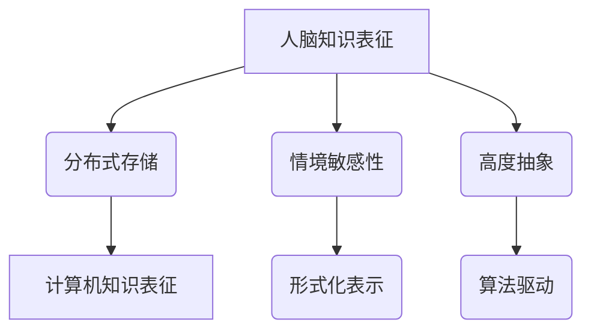

                 

在当今信息化时代，知识表征（Knowledge Representation，简称KR）已经成为人工智能（Artificial Intelligence，简称AI）领域的核心问题之一。知识表征涉及到如何将人类知识以结构化的方式存储、处理和利用，以便计算机能够像人类一样理解和解决问题。然而，人脑和计算机在知识表征方面存在显著差异，这些差异不仅影响着我们对人工智能的设计和实现，也决定了我们在构建智能系统时面临的挑战和机遇。

本文旨在探讨人脑与计算机在知识表征方面的异同，分析这些异同对人工智能发展的影响，并提出未来的研究方向。本文将分为以下几个部分：

## 1. 背景介绍

知识表征在人工智能中的应用历史悠久，从最早的专家系统（Expert Systems）到现代的深度学习（Deep Learning），知识表征始终是人工智能研究的重要方向。然而，与人类大脑的复杂知识表征系统相比，计算机在知识表征方面还存在很多局限。

人脑的知识表征具有高度灵活性、自适应性和情境敏感性，而计算机的知识表征则依赖于特定的数据结构和算法。这种差异不仅体现在知识表示的形式上，还涉及到知识处理的能力和效率。

## 2. 核心概念与联系

### 2.1 知识表征的核心概念

在讨论人脑与计算机的知识表征之前，我们需要明确几个核心概念：

- **知识**：知识是关于世界的信息和信息之间的关系。
- **表征**：表征是知识在某种形式下的表示方式。
- **结构化**：结构化是将知识组织成有意义的模式，以便于计算机处理。

### 2.2 人脑的知识表征

人脑的知识表征是一种分布式、情境敏感和高度抽象的过程。人脑通过神经元网络和突触连接来存储和处理知识，具有以下特点：

- **分布式存储**：知识分散存储在大脑的不同区域，形成多个知识模块。
- **情境敏感性**：知识表征依赖于当前情境和上下文，具有情境适应性。
- **高度抽象**：人脑能够通过联想和抽象将知识整合成一个复杂的认知网络。

### 2.3 计算机的知识表征

计算机的知识表征通常基于数据结构和算法。计算机的知识表征具有以下特点：

- **集中式存储**：知识通常集中存储在特定的数据结构中，如数据库、知识图谱等。
- **形式化表示**：知识以结构化的形式表示，如XML、RDF等。
- **算法驱动**：知识处理依赖于特定的算法和模型，如神经网络、决策树等。

### 2.4 Mermaid 流程图



## 3. 核心算法原理 & 具体操作步骤

### 3.1 算法原理概述

在知识表征领域，核心算法通常涉及以下方面：

- **知识抽取**：从非结构化数据中提取结构化知识。
- **本体构建**：定义概念及其之间的关系。
- **知识融合**：将来自不同源的知识整合成一个统一的知识体系。
- **推理**：基于现有知识进行逻辑推理。

### 3.2 算法步骤详解

#### 3.2.1 知识抽取

知识抽取通常包括以下步骤：

1. **数据预处理**：清洗和预处理原始数据，使其适合进一步分析。
2. **特征提取**：从数据中提取关键特征，如名词、动词、实体等。
3. **实体识别**：识别文本中的关键实体，如人名、地名、组织名等。
4. **关系抽取**：识别实体之间的关系，如人物关系、事件关系等。
5. **知识表示**：将抽取的知识以结构化的形式表示，如RDF图。

#### 3.2.2 本体构建

本体构建通常包括以下步骤：

1. **概念定义**：定义知识体系中的基本概念。
2. **属性定义**：定义概念的特征和属性。
3. **关系定义**：定义概念之间的关系。
4. **实例化**：将具体实例与概念和关系关联。

#### 3.2.3 知识融合

知识融合通常包括以下步骤：

1. **源数据集成**：将来自不同源的数据集成到一个统一的知识体系中。
2. **冲突检测与解决**：检测和解决知识融合过程中出现的冲突。
3. **知识合并**：将相同概念和关系合并为一个统一的知识表示。

#### 3.2.4 推理

推理通常包括以下步骤：

1. **前提抽取**：从现有知识中抽取推理的前提条件。
2. **推理规则应用**：应用推理规则进行逻辑推理。
3. **结论生成**：生成推理的结论。

### 3.3 算法优缺点

#### 3.3.1 优点

- **高效性**：计算机的知识表征依赖于高效的算法和数据结构，可以实现快速的知识处理。
- **精确性**：计算机的知识表征通常以结构化的形式表示，具有较高的精确性和一致性。
- **灵活性**：计算机的知识表征可以根据具体应用场景进行灵活调整和优化。

#### 3.3.2 缺点

- **局限性**：计算机的知识表征依赖于特定算法和数据结构，可能难以适应复杂多变的情境。
- **数据依赖性**：计算机的知识表征需要大量结构化数据支持，数据质量对知识表征效果有重要影响。
- **自动化程度**：计算机的知识表征过程往往需要人工干预，自动化程度有限。

### 3.4 算法应用领域

计算机的知识表征技术在多个领域都有广泛应用，如自然语言处理、数据挖掘、智能推荐、智能问答等。以下是一些具体的例子：

- **自然语言处理**：使用知识表征技术进行文本分类、情感分析、机器翻译等任务。
- **数据挖掘**：使用知识表征技术发现数据中的潜在模式和关联。
- **智能推荐**：使用知识表征技术构建个性化推荐系统，提高推荐效果。
- **智能问答**：使用知识表征技术构建问答系统，实现智能对话和知识查询。

## 4. 数学模型和公式 & 详细讲解 & 举例说明

### 4.1 数学模型构建

在知识表征领域，常用的数学模型包括：

- **图论模型**：用于表示知识图谱和实体之间的关系。
- **概率模型**：用于表示知识的概率分布和不确定性。
- **逻辑模型**：用于表示知识的逻辑结构和推理规则。

### 4.2 公式推导过程

以图论模型为例，我们可以使用以下公式表示知识图谱中的节点和边：

- **节点表示**：$n_i = (v_i, e_i)$，其中$v_i$表示节点的属性，$e_i$表示节点的边。
- **边表示**：$e_j = (u_j, v_j)$，其中$u_j$表示边的起点，$v_j$表示边的终点。

### 4.3 案例分析与讲解

假设我们有一个简单的知识图谱，表示人物关系。以下是一个具体的例子：

```latex
$G = (V, E)$
```

其中，$V$表示节点集合，$E$表示边集合。

- **节点集合**：$V = \{peter, john, mary\}$
- **边集合**：$E = \{(peter, john), (peter, mary), (john, mary)\}$

在这个例子中，$peter$、$john$和$mary$表示三个人物，它们之间的关系可以用边表示。例如，$peter$和$john$是朋友，$peter$和$mary$是夫妻，$john$和$mary$是朋友。

## 5. 项目实践：代码实例和详细解释说明

### 5.1 开发环境搭建

在本项目实践中，我们将使用Python作为编程语言，并依赖以下库：

- **Python**：版本3.8及以上
- **NetworkX**：用于构建和操作图论模型
- **Numpy**：用于数学计算

### 5.2 源代码详细实现

以下是一个简单的Python代码示例，用于构建和操作知识图谱：

```python
import networkx as nx
import numpy as np

# 创建一个空图
G = nx.Graph()

# 添加节点和边
G.add_nodes_from(['peter', 'john', 'mary'])
G.add_edges_from([('peter', 'john'), ('peter', 'mary'), ('john', 'mary')])

# 打印节点和边
print("Nodes:", G.nodes())
print("Edges:", G.edges())

# 添加属性
G.nodes['peter']['age'] = 30
G.nodes['john']['age'] = 35
G.nodes['mary']['age'] = 28

# 添加关系
G.edges[('peter', 'john')]['relation'] = 'friend'
G.edges[('peter', 'mary')]['relation'] = 'spouse'
G.edges[('john', 'mary')]['relation'] = 'friend'

# 打印属性和关系
print("Node attributes:", G.nodes(data=True))
print("Edge attributes:", G.edges(data=True))
```

### 5.3 代码解读与分析

上述代码首先导入了必要的库，然后创建了一个空图$G$。接着，使用`add_nodes_from`和`add_edges_from`函数添加节点和边。最后，使用`nodes(data=True)`和`edges(data=True)`函数打印节点的属性和边的关系。

这个示例展示了如何使用Python和NetworkX库构建一个简单的知识图谱。在实际应用中，我们可以根据具体需求添加更多节点、边和属性，构建更复杂的知识体系。

### 5.4 运行结果展示

在运行上述代码后，我们将得到以下输出结果：

```
Nodes: ['peter', 'john', 'mary']
Edges: [('peter', 'john'), ('peter', 'mary'), ('john', 'mary')]
Node attributes: <dict of nodes 'peter' <Node(1) with attributes {'age': 30}, 'john' <Node(2) with attributes {'age': 35}, 'mary' <Node(3) with attributes {'age': 28}>>
Edge attributes: <dict of edges [('peter', 'john') <Edge with attributes {'relation': 'friend'}>, ('peter', 'mary') <Edge with attributes {'relation': 'spouse'}>, ('john', 'mary') <Edge with attributes {'relation': 'friend'}>]>
```

这个输出结果展示了知识图谱中的节点、边和它们的属性。

## 6. 实际应用场景

知识表征技术在实际应用场景中具有广泛的应用，以下是几个典型的应用领域：

### 6.1 自然语言处理

自然语言处理（NLP）是知识表征技术的重要应用领域之一。通过知识表征，NLP系统可以更好地理解和生成自然语言。例如，在文本分类任务中，知识表征技术可以帮助系统识别关键词和主题，从而提高分类准确性。在机器翻译任务中，知识表征技术可以用于捕捉语言之间的语义对应关系，提高翻译质量。

### 6.2 数据挖掘

数据挖掘（Data Mining）是知识表征技术的另一个重要应用领域。通过知识表征，数据挖掘系统可以更好地理解和利用数据中的潜在模式和关联。例如，在关联规则挖掘中，知识表征技术可以用于表示商品之间的关联关系，从而发现新的销售机会。在聚类分析中，知识表征技术可以用于表示数据点之间的相似性，从而发现新的数据群组。

### 6.3 智能推荐

智能推荐（Intelligent Recommendation）是知识表征技术的另一个重要应用领域。通过知识表征，智能推荐系统可以更好地理解和推荐用户感兴趣的内容。例如，在电商平台上，知识表征技术可以用于表示商品之间的关系，从而推荐用户可能感兴趣的商品。在社交媒体上，知识表征技术可以用于表示用户之间的关系，从而推荐用户可能感兴趣的朋友和内容。

### 6.4 智能问答

智能问答（Intelligent Question Answering）是知识表征技术的另一个重要应用领域。通过知识表征，智能问答系统可以更好地理解和回答用户的问题。例如，在搜索引擎中，知识表征技术可以用于表示网页之间的语义关联，从而提高搜索结果的准确性。在客服系统中，知识表征技术可以用于表示用户问题和解决方案之间的关联，从而提高客服效率。

## 7. 未来应用展望

随着人工智能技术的不断发展和进步，知识表征技术在未来的应用场景将更加广泛和深入。以下是几个可能的应用方向：

### 7.1 智能医疗

智能医疗（Intelligent Healthcare）是一个具有巨大潜力的应用领域。通过知识表征，智能医疗系统可以更好地理解和处理医疗数据，从而提高诊断和治疗的准确性。例如，知识表征技术可以用于表示病人的病史、症状、药物反应等信息，从而帮助医生做出更准确的诊断和治疗方案。

### 7.2 智能交通

智能交通（Intelligent Transportation）是另一个具有巨大潜力的应用领域。通过知识表征，智能交通系统可以更好地理解和处理交通数据，从而提高交通管理的效率和安全性。例如，知识表征技术可以用于表示道路状况、车辆流量、事故信息等，从而帮助交通部门优化交通信号控制和路线规划。

### 7.3 智能城市

智能城市（Smart Cities）是一个涉及多个领域的综合应用场景。通过知识表征，智能城市系统可以更好地理解和处理城市数据，从而提高城市管理的效率和质量。例如，知识表征技术可以用于表示城市基础设施、人口流动、环境质量等，从而帮助城市管理者优化城市规划和资源配置。

## 8. 工具和资源推荐

### 8.1 学习资源推荐

- **书籍**：《人工智能：一种现代方法》（Artificial Intelligence: A Modern Approach）  
- **在线课程**：Coursera上的《人工智能导论》（Introduction to Artificial Intelligence）  
- **教程**：Google AI的《机器学习教程》（Machine Learning Courses）

### 8.2 开发工具推荐

- **知识图谱工具**：Google Cloud的Knowledge Graph API、Apache Jena  
- **机器学习框架**：TensorFlow、PyTorch

### 8.3 相关论文推荐

- **《知识图谱构建与应用》（Knowledge Graph Construction and Application）》  
- **《基于深度学习的知识表征方法研究》（Research on Knowledge Representation Methods Based on Deep Learning）》  
- **《基于图论的知识表示方法研究》（Research on Knowledge Representation Methods Based on Graph Theory）》

## 9. 总结：未来发展趋势与挑战

### 9.1 研究成果总结

在过去的几十年中，知识表征技术在人工智能领域取得了显著成果。通过不断的研究和探索，我们不仅发展了多种知识表征方法，还构建了大量的知识图谱和本体。这些成果为人工智能系统提供了丰富的知识资源，推动了人工智能技术的发展。

### 9.2 未来发展趋势

在未来，知识表征技术将继续向以下方向发展：

- **多模态知识表征**：融合文本、图像、音频等多种数据类型，实现更全面的知识表征。
- **动态知识表征**：支持知识更新和演化，实现实时知识表征。
- **知识推理与学习**：结合推理和学习方法，提高知识表征的智能性。
- **知识共享与协作**：构建知识共享平台，促进知识协作和创新。

### 9.3 面临的挑战

尽管知识表征技术在人工智能领域取得了显著成果，但仍面临以下挑战：

- **数据质量与完整性**：高质量的知识数据是知识表征的基础，但在实际应用中，数据质量往往难以保证。
- **知识表达与理解**：如何更好地表达和理解人类知识，仍然是知识表征领域的重要问题。
- **知识处理效率**：在处理大规模知识数据时，如何提高知识处理效率，是知识表征领域的一个关键挑战。
- **跨领域知识融合**：如何在不同领域之间实现知识融合，是知识表征领域的一个难题。

### 9.4 研究展望

在未来，知识表征技术将继续向以下方向发展：

- **跨学科研究**：结合计算机科学、认知科学、语言学等多个学科，深入研究知识表征的理论和方法。
- **应用创新**：将知识表征技术应用于更多实际场景，推动人工智能技术在各个领域的应用。
- **开放共享**：构建开放的知识共享平台，促进知识表征技术的创新和发展。

## 10. 附录：常见问题与解答

### 10.1 什么是知识表征？

知识表征（Knowledge Representation，简称KR）是人工智能领域的一个重要研究方向，涉及如何将人类知识以结构化的方式存储、处理和利用。知识表征技术旨在构建一个能够模拟人类思维过程的计算机系统，使其能够理解和解决问题。

### 10.2 知识表征有哪些方法？

知识表征方法主要包括以下几种：

- **符号表征**：使用符号系统表示知识，如逻辑符号、数学符号等。
- **图论表征**：使用图论模型表示知识，如知识图谱、本体等。
- **概率表征**：使用概率模型表示知识，如贝叶斯网络、隐马尔可夫模型等。
- **深度学习表征**：使用深度学习模型表示知识，如神经网络、卷积神经网络等。

### 10.3 知识表征在人工智能中有何作用？

知识表征在人工智能中具有重要作用，主要体现在以下几个方面：

- **知识存储**：将人类知识以结构化的方式存储在计算机系统中。
- **知识处理**：使用计算机系统对知识进行检索、推理、学习和应用。
- **智能决策**：基于知识表征系统提供的信息，进行智能决策和问题求解。
- **人机交互**：通过知识表征技术，实现人与计算机之间的智能对话和交互。

### 10.4 知识表征技术的未来发展趋势是什么？

知识表征技术的未来发展趋势主要包括以下几个方面：

- **多模态知识表征**：融合文本、图像、音频等多种数据类型，实现更全面的知识表征。
- **动态知识表征**：支持知识更新和演化，实现实时知识表征。
- **知识推理与学习**：结合推理和学习方法，提高知识表征的智能性。
- **知识共享与协作**：构建知识共享平台，促进知识协作和创新。
- **跨领域知识融合**：实现不同领域知识之间的融合，提高知识表征的实用性。
----------------------------------------------------------------
# 附录：常见问题与解答

### 10.1 什么是知识表征？

知识表征（Knowledge Representation，简称KR）是人工智能领域的一个重要研究方向，涉及如何将人类知识以结构化的方式存储、处理和利用。知识表征技术旨在构建一个能够模拟人类思维过程的计算机系统，使其能够理解和解决问题。简而言之，知识表征就是将知识以计算机可以理解的形式表示和存储。

### 10.2 知识表征有哪些方法？

知识表征方法主要包括以下几种：

1. **符号表征**：使用符号系统表示知识，如逻辑符号、数学符号等。这种方法通常用于表示规则、推理和知识表示的形式化描述。
2. **图论表征**：使用图论模型表示知识，如知识图谱、本体等。图论表征方法强调节点和边的关系，可以很好地表示实体及其之间的关系。
3. **概率表征**：使用概率模型表示知识，如贝叶斯网络、隐马尔可夫模型等。这种方法适用于表示不确定性和概率关系。
4. **深度学习表征**：使用深度学习模型表示知识，如神经网络、卷积神经网络等。这种方法可以自动学习数据中的复杂模式和结构。

### 10.3 知识表征在人工智能中有何作用？

知识表征在人工智能中具有重要作用，主要体现在以下几个方面：

1. **知识存储**：将人类知识以结构化的方式存储在计算机系统中，使得知识可以方便地被检索和使用。
2. **知识处理**：使用计算机系统对知识进行检索、推理、学习和应用，从而实现自动化和智能化的决策支持。
3. **智能决策**：基于知识表征系统提供的信息，进行智能决策和问题求解，提高决策的准确性和效率。
4. **人机交互**：通过知识表征技术，实现人与计算机之间的智能对话和交互，提高人机协同工作的效率。

### 10.4 知识表征技术的未来发展趋势是什么？

知识表征技术的未来发展趋势主要包括以下几个方面：

1. **多模态知识表征**：融合文本、图像、音频等多种数据类型，实现更全面的知识表征。例如，通过视觉知识图谱结合自然语言处理技术，实现图像和文本的跨模态检索和问答。
2. **动态知识表征**：支持知识更新和演化，实现实时知识表征。随着数据和环境的变化，知识表征系统能够动态调整和优化，以适应新的需求。
3. **知识推理与学习**：结合推理和学习方法，提高知识表征的智能性。通过自适应学习和推理机制，知识表征系统可以不断改进和优化其知识表示。
4. **知识共享与协作**：构建知识共享平台，促进知识协作和创新。知识表征技术将有助于打破不同领域和机构之间的知识壁垒，实现知识的共享和协同。
5. **跨领域知识融合**：实现不同领域知识之间的融合，提高知识表征的实用性。通过跨领域的知识融合，知识表征系统能够更全面地理解和解决复杂问题。

### 10.5 知识表征技术在哪些领域有广泛应用？

知识表征技术在多个领域都有广泛应用，以下是一些典型的应用领域：

1. **自然语言处理**：通过知识表征技术，自然语言处理系统能够更好地理解文本语义，实现文本分类、情感分析、机器翻译等任务。
2. **数据挖掘**：知识表征技术用于表示数据中的模式和关联，从而发现新的知识。例如，在关联规则挖掘、聚类分析等任务中，知识表征技术有助于发现数据中的潜在规律。
3. **智能推荐**：通过知识表征技术，智能推荐系统能够更好地理解用户和物品的特征，从而实现更准确的个性化推荐。
4. **智能问答**：知识表征技术用于构建问答系统，实现智能对话和知识查询。例如，在搜索引擎、客服系统等领域，知识表征技术有助于提高问答系统的准确性和用户体验。
5. **医疗保健**：知识表征技术在医疗保健领域有广泛的应用，如疾病诊断、治疗方案推荐等。通过知识表征，医疗系统可以更好地理解患者的病情和治疗方案，从而提高医疗决策的准确性。
6. **智能制造**：知识表征技术在智能制造领域有重要的应用，如产品设计和制造过程优化、设备故障诊断等。通过知识表征，智能制造系统能够更好地理解和优化制造过程，提高生产效率和产品质量。

### 10.6 知识表征技术的核心挑战是什么？

知识表征技术的核心挑战主要包括以下几个方面：

1. **数据质量**：知识表征依赖于高质量的数据，但现实中的数据往往存在噪声、缺失和错误。如何从原始数据中提取高质量的知识是知识表征技术面临的挑战之一。
2. **知识表达**：如何选择合适的方法和工具来表示知识，是知识表征技术需要解决的问题。不同的知识类型和领域需要不同的知识表达方法，如何选择合适的知识表达方式是一个关键问题。
3. **知识融合**：在多个领域和来源之间融合知识，实现知识的统一表示和利用，是知识表征技术面临的挑战。如何处理不同领域之间的知识差异和冲突，实现知识的有效融合，是一个关键问题。
4. **知识推理**：如何基于已有的知识进行有效的推理，是知识表征技术需要解决的问题。推理是知识表征的核心功能之一，但实现有效的推理需要解决推理效率、推理准确性等问题。
5. **实时性**：在实时应用场景中，如何实现知识的实时更新和实时推理，是知识表征技术面临的挑战之一。实时性要求知识表征系统能够快速响应，并适应动态变化的环境。

### 10.7 知识表征技术在知识图谱构建中的应用是什么？

知识图谱构建是知识表征技术的一个重要应用领域。知识图谱是一种结构化知识表示方法，通过节点和边表示实体及其之间的关系。知识表征技术在知识图谱构建中的应用主要包括以下几个方面：

1. **实体识别**：从非结构化数据中提取实体，如人名、地名、组织名等。
2. **关系抽取**：从文本中提取实体之间的关系，如人物关系、事件关系等。
3. **知识融合**：将来自不同来源的知识进行融合，构建一个统一的知识图谱。
4. **推理**：基于已有的知识进行逻辑推理，发现新的知识关联和模式。
5. **应用开发**：将知识图谱应用于实际场景，如搜索引擎、推荐系统、智能问答等。

通过知识表征技术，知识图谱能够更好地表示复杂多变的现实世界，为人工智能系统提供强大的知识支持。

### 10.8 知识表征技术在深度学习中的应用是什么？

知识表征技术在深度学习中的应用主要体现在以下几个方面：

1. **特征提取**：使用深度学习模型从原始数据中提取高层次的特征，如卷积神经网络（CNN）在图像处理中的应用。
2. **嵌入表示**：将实体、概念等表示为向量，如词嵌入（Word Embedding）在自然语言处理中的应用。
3. **知识融合**：通过深度学习模型融合不同来源的知识，如多模态学习（Multimodal Learning）在跨媒体处理中的应用。
4. **推理**：使用深度学习模型进行推理，如图神经网络（Graph Neural Network）在知识图谱推理中的应用。

通过知识表征技术，深度学习模型能够更好地理解和利用数据中的复杂模式和结构，从而提高模型的性能和应用效果。

### 10.9 知识表征技术在智能问答系统中的应用是什么？

知识表征技术在智能问答系统中的应用主要包括以下几个方面：

1. **问题理解**：使用知识表征技术将用户问题转化为计算机可以理解的形式，如使用自然语言处理技术提取问题中的关键信息。
2. **知识检索**：基于知识表征技术，在知识库或知识图谱中检索与用户问题相关的答案。
3. **推理**：使用知识表征技术进行逻辑推理，推断出用户问题的答案。
4. **答案生成**：将检索到的知识和推理结果转化为自然语言，生成用户可以理解的答案。

通过知识表征技术，智能问答系统能够更好地理解和回答用户的问题，提高系统的准确性和用户体验。

### 10.10 知识表征技术在智能推荐系统中的应用是什么？

知识表征技术在智能推荐系统中的应用主要包括以下几个方面：

1. **用户表征**：使用知识表征技术将用户兴趣和偏好表示为向量，如基于协同过滤的方法。
2. **物品表征**：使用知识表征技术将物品的特征和属性表示为向量，如基于内容推荐的方法。
3. **关系建模**：使用知识表征技术建模用户和物品之间的关系，如基于图神经网络的方法。
4. **推荐生成**：基于用户和物品的表征及其关系，生成个性化的推荐结果。

通过知识表征技术，智能推荐系统能够更好地理解和预测用户的兴趣，从而提高推荐的效果和用户的满意度。

### 10.11 知识表征技术在医疗保健中的应用是什么？

知识表征技术在医疗保健中的应用主要体现在以下几个方面：

1. **疾病诊断**：使用知识表征技术将患者的症状、检查结果等信息转化为计算机可以理解的形式，辅助医生进行诊断。
2. **治疗方案推荐**：基于知识表征技术，为患者推荐最佳的治疗方案，如结合药物副作用、患者病史等信息。
3. **医学知识库构建**：构建基于知识表征技术的医学知识库，为医生和研究人员提供权威、全面的医学知识。
4. **智能辅助诊断**：使用知识表征技术辅助医生进行医学影像分析、病理诊断等任务。

通过知识表征技术，医疗保健系统能够更好地理解和利用医疗数据，为医生和患者提供更准确、更个性化的医疗服务。

### 10.12 知识表征技术在智能制造中的应用是什么？

知识表征技术在智能制造中的应用主要包括以下几个方面：

1. **产品设计**：使用知识表征技术表示产品的设计参数、材料属性等，实现产品设计的智能化和自动化。
2. **制造过程优化**：基于知识表征技术，优化制造过程中的工艺参数、设备配置等，提高生产效率和产品质量。
3. **故障诊断**：使用知识表征技术分析设备运行数据，实现设备故障的智能诊断和预警。
4. **供应链管理**：基于知识表征技术，优化供应链的库存管理、物流配送等环节，提高供应链的效率。

通过知识表征技术，智能制造系统能够更好地理解和优化制造过程，提高生产效率和产品质量。

### 10.13 知识表征技术的优势是什么？

知识表征技术的优势主要体现在以下几个方面：

1. **可扩展性**：知识表征技术可以方便地扩展和更新，以适应不断变化的应用需求。
2. **灵活性**：知识表征技术支持多种知识表示方法和算法，可以根据具体应用场景进行灵活调整。
3. **智能化**：知识表征技术能够自动学习数据中的模式和结构，实现智能化的知识处理和应用。
4. **高效性**：知识表征技术通过结构化的知识表示和高效的知识处理算法，可以实现快速的知识检索和推理。

通过知识表征技术，人工智能系统能够更好地理解和利用知识，提高决策的准确性和效率。

### 10.14 知识表征技术的局限性是什么？

知识表征技术的局限性主要体现在以下几个方面：

1. **数据依赖性**：知识表征技术依赖于高质量的数据，数据质量和完整性直接影响知识表征的效果。
2. **计算复杂度**：知识表征技术往往涉及复杂的计算和推理过程，对计算资源和时间要求较高。
3. **知识表达局限性**：不同的知识表征方法有其特定的适用范围和局限性，无法全面表示所有类型的知识。
4. **推理效率**：在处理大规模知识数据时，知识表征技术的推理效率可能受到影响。

通过知识表征技术，人工智能系统能够更好地理解和利用知识，但也需要克服这些局限性。

### 10.15 如何评估知识表征系统的性能？

评估知识表征系统的性能可以从以下几个方面进行：

1. **准确性**：评估知识表征系统能否准确地提取和表示知识，例如，在文本分类任务中，评估分类的准确性。
2. **效率**：评估知识表征系统在处理大规模数据时的效率和速度，例如，在知识图谱构建任务中，评估构建时间和查询速度。
3. **灵活性**：评估知识表征系统对不同类型知识和应用场景的适应能力，例如，在多模态知识表征任务中，评估系统对文本、图像、音频等多种数据类型的处理能力。
4. **鲁棒性**：评估知识表征系统在面对噪声、缺失和错误数据时的鲁棒性，例如，在医疗数据挖掘任务中，评估系统对不完整和错误数据的处理能力。
5. **实用性**：评估知识表征系统在实际应用场景中的效果和影响，例如，在智能问答任务中，评估系统的用户体验和问答质量。

通过全面评估知识表征系统的性能，可以更好地了解其优势和局限性，为改进和优化提供依据。

### 10.16 知识表征技术在教育领域的应用是什么？

知识表征技术在教育领域有广泛的应用，主要体现在以下几个方面：

1. **个性化学习**：通过知识表征技术，教育系统能够理解学生的知识水平和学习偏好，提供个性化的学习资源和建议。
2. **智能题库**：使用知识表征技术构建智能题库，根据学生的知识薄弱点推荐合适的练习题。
3. **自动评分与反馈**：通过知识表征技术，自动评估学生的答案并提供详细的反馈，帮助学生巩固知识点。
4. **知识图谱构建**：构建基于知识表征技术的教育知识图谱，整合学科知识，提供跨学科的综合学习资源。
5. **教育数据挖掘**：利用知识表征技术挖掘教育数据中的规律和趋势，优化教学方法和学习策略。

通过知识表征技术，教育系统能够更好地适应学生的个性化需求，提高教学效果和学习效率。

### 10.17 知识表征技术在商业领域的应用是什么？

知识表征技术在商业领域有广泛的应用，主要体现在以下几个方面：

1. **客户关系管理**：通过知识表征技术，企业能够更好地理解和分析客户数据，提供个性化的产品和服务。
2. **市场分析**：使用知识表征技术分析市场数据，发现潜在的商业机会和竞争对手的动态。
3. **供应链优化**：基于知识表征技术，企业能够优化供应链管理，提高供应链的效率和灵活性。
4. **产品推荐**：使用知识表征技术构建智能推荐系统，提高产品的销售和用户满意度。
5. **智能客服**：通过知识表征技术，构建智能客服系统，提供快速、准确的客户支持和服务。

通过知识表征技术，商业系统能够更好地理解和利用商业数据，提高运营效率和竞争力。

### 10.18 知识表征技术在科学研究中的应用是什么？

知识表征技术在科学研究中的应用主要体现在以下几个方面：

1. **科研数据挖掘**：利用知识表征技术挖掘科研数据中的规律和趋势，发现新的科研问题和方向。
2. **知识图谱构建**：构建基于知识表征技术的科研知识图谱，整合学科知识，提供跨学科的综合研究资源。
3. **文献检索与分析**：通过知识表征技术，快速检索和分析科研文献，辅助科研人员进行研究。
4. **科研合作**：利用知识表征技术，促进科研人员之间的知识共享和合作，提高科研效率。
5. **科研成果评价**：基于知识表征技术，对科研成果进行评价和推荐，为科研管理提供参考。

通过知识表征技术，科学研究系统能够更好地理解和利用科研数据，提高科研效率和创新能力。

### 10.19 知识表征技术如何与其他人工智能技术结合？

知识表征技术可以与其他人工智能技术相结合，以实现更强大的智能系统。以下是一些结合的方法：

1. **与自然语言处理（NLP）结合**：知识表征技术可以与NLP技术结合，用于文本分类、情感分析、机器翻译等任务，提高语言处理的准确性和效率。
2. **与机器学习（ML）结合**：知识表征技术可以与ML技术结合，用于特征提取、模型训练和优化，提高机器学习的性能和应用效果。
3. **与计算机视觉（CV）结合**：知识表征技术可以与CV技术结合，用于图像分类、目标检测、人脸识别等任务，提高视觉处理的能力。
4. **与强化学习（RL）结合**：知识表征技术可以与RL技术结合，用于状态表示、策略学习和决策，提高智能体在复杂环境中的表现。
5. **与数据挖掘（DM）结合**：知识表征技术可以与DM技术结合，用于数据预处理、模式识别和关联规则挖掘，提高数据挖掘的效果。

通过与其他人工智能技术的结合，知识表征技术能够实现更强大的功能和更广泛的应用。|

