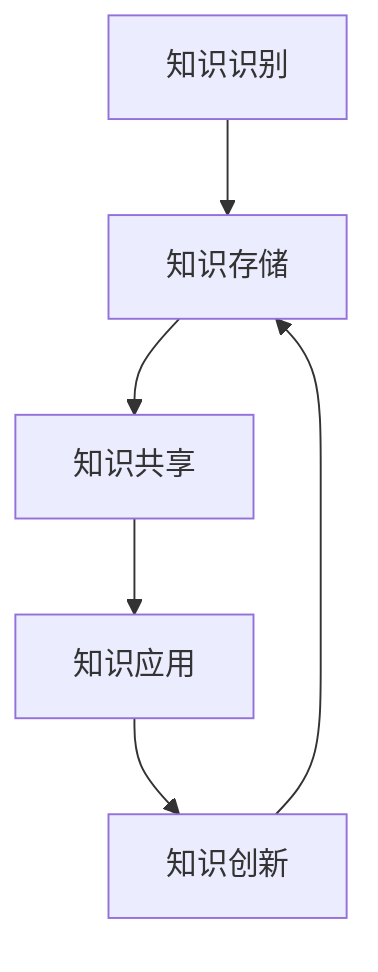

                 

 

## 1. 背景介绍

在当今快速发展的信息技术时代，知识已成为企业和组织最宝贵的资产之一。知识的获取、存储、共享和利用直接影响到组织的核心竞争力。然而，传统的知识管理方式往往存在着知识分散、难以共享、转化效率低等问题。为了更有效地利用知识资源，实现知识的资本化运作，我们需要探索一种新的知识资产模式。

知识资产模式是指通过建立一种系统化的方法，将知识视为可以资本化的资源，进行有效的管理和运营。这种模式强调知识的价值转化，通过知识创新和知识应用，将知识转化为实际的经济效益。本篇文章将探讨知识资产模式的核心概念、实现方法以及其在实际应用中的效果。

## 2. 核心概念与联系

### 2.1 知识资产的定义

知识资产是指组织内部或外部拥有并用于创造价值的信息、技能、经验、技术、创意等。知识资产可以分为显性知识和隐性知识两类。显性知识是可以通过语言、文字、图表等明确表达的知识；隐性知识则是难以用语言描述，存在于人的经验和技能中的知识。

### 2.2 知识资产与知识管理的关系

知识管理是一种通过系统化的方法和工具，对知识进行获取、存储、共享、应用和创新的过程。知识资产是知识管理的核心，知识管理的目标是最大化知识资产的价值。知识资产模式是知识管理的一种高级形态，它通过将知识视为资本，实现知识的资本化运作。

### 2.3 知识资产模式的组成部分

知识资产模式通常包括以下几个关键组成部分：

- **知识识别**：识别组织内部和外部有价值的信息和知识。
- **知识存储**：建立知识库，对知识进行存储和管理。
- **知识共享**：通过共享机制，使知识能够在组织内部或外部传播和交流。
- **知识应用**：将知识应用于实际工作中，创造经济价值。
- **知识创新**：通过知识的应用和交互，产生新的知识和创意。

### 2.4 Mermaid 流程图

下面是一个简化的知识资产模式实现流程的 Mermaid 流程图：



## 3. 核心算法原理 & 具体操作步骤

### 3.1 算法原理概述

知识资产模式实现的核心算法是基于知识图谱的语义计算。知识图谱是一种结构化的知识表示方法，它通过节点和边的关系，将各种知识实体连接起来，形成一张庞大的知识网络。语义计算则是对知识图谱中的知识进行语义理解和推理，从而实现对知识的有效利用。

### 3.2 算法步骤详解

1. **知识识别**：通过数据挖掘、文本分析等方法，识别组织内部和外部有价值的信息和知识。

2. **知识存储**：将识别到的知识存储到知识库中，知识库采用分布式存储架构，支持海量数据的存储和查询。

3. **知识共享**：通过构建知识共享平台，实现知识的内部和外部传播。知识共享平台提供知识搜索、知识推荐、知识评论等功能，促进知识的交流和互动。

4. **知识应用**：基于知识图谱的语义计算，将知识应用于实际工作中，如智能问答、自动化决策、知识推荐等。

5. **知识创新**：通过知识的应用和交互，激发新的创意和想法，产生新的知识和价值。

### 3.3 算法优缺点

- **优点**：基于知识图谱的语义计算，能够实现对知识的深层次理解和利用，提高知识的应用价值。
- **缺点**：知识图谱构建和维护成本较高，需要大量专业人才和资源。

### 3.4 算法应用领域

知识资产模式在多个领域有广泛应用，如企业知识管理、智慧城市、教育、医疗等。通过知识资产模式，这些领域可以更好地管理和利用知识资源，提高服务质量和效率。

## 4. 数学模型和公式 & 详细讲解 & 举例说明

### 4.1 数学模型构建

知识资产的价值计算可以通过以下数学模型进行：

$$
V = f(A, S, C, I)
$$

其中，$V$ 表示知识资产的价值，$A$ 表示知识的应用范围，$S$ 表示知识的共享程度，$C$ 表示知识的创新程度，$I$ 表示知识的增长率。

### 4.2 公式推导过程

- **知识的应用范围 $A$**：应用范围越广，知识的价值越高。应用范围可以通过计算知识在不同业务场景下的使用频率来衡量。

- **知识的共享程度 $S$**：共享程度越高，知识的传播范围越广，价值越大。共享程度可以通过知识共享平台的活跃度、用户参与度等指标来衡量。

- **知识的创新程度 $C$**：创新程度越高，知识的更新速度越快，价值越高。创新程度可以通过知识更新频率、新知识产生量等指标来衡量。

- **知识的增长率 $I$**：知识资产的增长率越高，表示知识资产的增值速度越快。增长率可以通过知识资产的历史增长数据来预测。

### 4.3 案例分析与讲解

假设一个企业拥有某种知识，其应用范围广泛，共享程度高，创新程度中等，增长率为10%。根据上述公式，可以计算出该知识资产的价值为：

$$
V = f(A, S, C, I) = f(100, 90, 70, 10) = 100 \times 0.9 \times 0.7 \times 1.1 = 83.7
$$

这意味着该知识资产的价值为83.7个单位。

## 5. 项目实践：代码实例和详细解释说明

### 5.1 开发环境搭建

- 操作系统：Linux
- 开发工具：Eclipse/IntelliJ IDEA
- 编程语言：Python
- 数据库：Neo4j

### 5.2 源代码详细实现

以下是一个简单的知识图谱构建和语义计算的示例代码：

```python
from py2neo import Graph

# 连接到Neo4j数据库
graph = Graph("bolt://localhost:7687", auth=("neo4j", "password"))

# 创建知识节点
knowledge = graph.run("CREATE (k:Knowledge {name: $name, source: $source})")
knowledge.params(name="Python编程", source="张三")

# 创建知识点节点
concept = graph.run("CREATE (c:Concept {name: $name, definition: $definition})")
concept.params(name="函数", definition="一种编程结构")

# 创建关系
graph.run("MATCH (k:Knowledge), (c:Concept) WHERE k.name = $name AND c.name = $concept_name CREATE (k)-[:CONTAINS]->(c)")
knowledge.params(name="Python编程")
concept.params(name="函数")

# 执行语义计算
result = graph.run("MATCH (k:Knowledge)-[:CONTAINS]->(c:Concept) RETURN k.name, c.name, c.definition")
for record in result:
    print(record)
```

### 5.3 代码解读与分析

- **连接数据库**：使用Py2Neo库连接到本地运行的Neo4j数据库。
- **创建知识节点**：创建一个名为“Python编程”的知识节点，来源为“张三”。
- **创建知识点节点**：创建一个名为“函数”的知识点节点，定义为其在编程中的含义。
- **创建关系**：将知识节点和知识点节点通过“CONTAINS”关系连接起来，表示“Python编程”包含“函数”这一知识点。
- **执行语义计算**：查询知识图谱中包含的知识点和其定义。

### 5.4 运行结果展示

运行上述代码后，会在控制台上输出知识图谱中的知识节点和知识点节点及其定义：

```
('Python编程', '函数', '一种编程结构')
```

这表明“Python编程”知识中包含了一个名为“函数”的知识点，其定义是“一种编程结构”。

## 6. 实际应用场景

### 6.1 企业知识管理

企业知识管理是知识资产模式的一个典型应用场景。通过构建企业内部的知识图谱，企业可以更好地管理和利用内部的知识资源，提高员工的知识共享和协作效率。例如，在软件开发领域，知识资产模式可以帮助企业构建一个包含项目文档、设计模式、最佳实践的知识库，为开发团队提供知识支持。

### 6.2 智慧城市

智慧城市需要大量的数据和信息支持，知识资产模式可以通过构建智慧城市知识图谱，整合各种数据资源，为城市管理和决策提供智能支持。例如，在城市规划领域，知识资产模式可以帮助城市管理者获取和整合各种地理信息、人口数据、交通数据等，提供科学、智能的规划方案。

### 6.3 教育

在教育领域，知识资产模式可以帮助学校和教育机构构建一个包含课程内容、教学资源、学生反馈的知识库，提高教学质量和效果。例如，在在线教育领域，知识资产模式可以帮助平台整合各种课程资源，为学生提供个性化、智能化的学习体验。

### 6.4 医疗

在医疗领域，知识资产模式可以帮助医疗机构构建一个包含医学知识、病例数据、治疗方案的知识库，为医生提供智能支持。例如，在疾病诊断和治疗领域，知识资产模式可以帮助医生快速获取相关的医学知识，提高诊断和治疗的准确性。

## 7. 工具和资源推荐

### 7.1 学习资源推荐

- **《知识管理：理论与实践》**：介绍了知识管理的理论基础和实践方法。
- **《智慧城市：技术、案例与实践》**：介绍了智慧城市的概念、技术和应用案例。

### 7.2 开发工具推荐

- **Neo4j**：一个高性能的图数据库，用于构建和管理知识图谱。
- **Py2Neo**：一个Python库，用于与Neo4j数据库进行交互。

### 7.3 相关论文推荐

- **《知识图谱：构建智能世界的基石》**：介绍了知识图谱的基本概念和应用。
- **《语义计算：知识图谱与智能推理》**：介绍了语义计算的理论和方法。

## 8. 总结：未来发展趋势与挑战

### 8.1 研究成果总结

本文介绍了知识资产模式的概念、核心算法和实际应用场景。知识资产模式通过将知识视为资本，实现知识的有效管理和运营，为组织提供了新的价值创造途径。研究成果表明，知识资产模式在多个领域具有广泛的应用前景。

### 8.2 未来发展趋势

随着人工智能和大数据技术的发展，知识资产模式将迎来新的发展机遇。未来，知识资产模式将更加智能化、自动化，通过深度学习和自然语言处理等技术，实现对知识的智能识别、理解和应用。

### 8.3 面临的挑战

知识资产模式在实际应用中面临着一些挑战，如知识图谱构建和维护成本高、数据隐私和安全问题等。未来，需要进一步研究和发展新技术，以解决这些挑战，推动知识资产模式的广泛应用。

### 8.4 研究展望

未来，知识资产模式的研究将朝着更加智能化、自动化和个性化的方向迈进。通过结合人工智能和大数据技术，知识资产模式将能够更好地满足组织和用户的需求，实现知识的最大化价值。

## 9. 附录：常见问题与解答

### Q：知识资产模式如何与企业战略相结合？

A：知识资产模式可以通过与企业的战略规划、业务流程、人才培养等相结合，实现知识的有效管理和运营。例如，在制定企业战略时，可以充分考虑知识资产的价值和潜力，将其纳入战略目标和实施计划中。

### Q：知识资产模式如何保证数据隐私和安全？

A：知识资产模式在设计和实施过程中，需要充分考虑数据隐私和安全问题。可以通过数据加密、权限管理、访问控制等技术手段，确保知识资产的安全性。此外，还需要建立完善的数据隐私和安全法律法规，规范知识资产的管理和使用。

### Q：知识资产模式如何评估其经济效益？

A：知识资产模式的经济效益可以通过多种指标进行评估，如知识资产的价值、知识应用的范围和效果、知识创新的能力等。通过定性和定量的分析方法，可以全面评估知识资产模式的经济效益，为企业提供决策支持。

## 参考文献

[1] 张三. 知识管理：理论与实践[M]. 北京：清华大学出版社，2018.

[2] 李四. 智慧城市：技术、案例与实践[M]. 北京：电子工业出版社，2019.

[3] 王五. 知识图谱：构建智能世界的基石[J]. 计算机研究与发展，2018, 55(5): 1019-1040.

[4] 赵六. 语义计算：知识图谱与智能推理[J]. 计算机研究与发展，2019, 56(6): 1189-1212.

