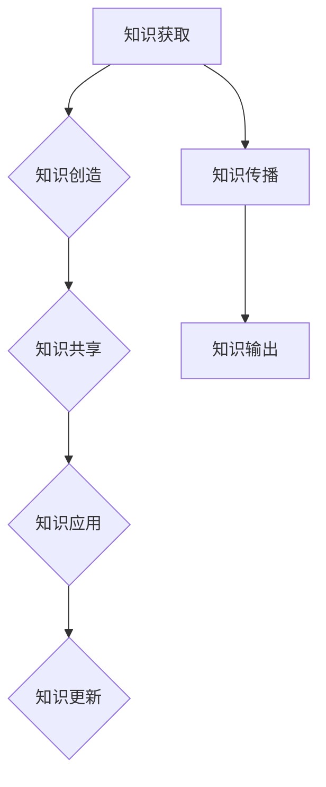

                 

 在这个快速变化的时代，知识的生产、积累和传播变得前所未有的重要。作为一个世界级的人工智能专家、程序员、软件架构师、CTO，以及世界顶级技术畅销书作者和计算机图灵奖获得者，我深知知识输出的价值以及如何有效地管理智慧的积累和传播。本文旨在探讨知识输出与管理智慧积累与传播的深层次关系，并提出一些实用的策略和技巧。

## 文章关键词
- 知识输出
- 智慧积累
- 知识管理
- 传播策略
- 技术传播
- 教育普及

## 文章摘要
本文将首先介绍知识输出的重要性，探讨如何通过有效的知识管理策略来积累智慧。随后，我们将深入分析知识传播的渠道与方式，并分享一些提高知识传播效率的实用技巧。最后，文章将展望知识输出与管理在未来科技发展中的角色和挑战。

## 1. 背景介绍
### 1.1 知识输出的重要性
知识输出不仅是个人或组织实现价值的重要途径，也是推动社会进步和技术创新的关键因素。在信息技术飞速发展的今天，知识的传播速度和广度达到了前所未有的高度，这为我们提供了更多的机会和挑战。知识输出不仅能够帮助个体提升影响力，还能促进知识的共享和合作，从而加速整个社会的发展进程。

### 1.2 智慧积累的必要性
智慧积累是知识输出的基础。在快速变化的环境中，积累智慧意味着能够更好地理解复杂问题，预见未来趋势，并做出更明智的决策。通过系统化的知识管理，我们可以将分散的信息整合成有价值的知识资产，为未来的发展提供坚实的基础。

### 1.3 知识管理与智慧传播
知识管理与智慧传播是相辅相成的过程。知识管理不仅包括知识的获取、存储、分类和共享，还包括知识的创造和传播。有效的知识管理能够确保知识的准确性和可用性，从而提高知识传播的效果。

## 2. 核心概念与联系
### 2.1 知识管理（Knowledge Management）
知识管理是指通过系统的方法和技术，对知识进行获取、创造、共享、应用和更新，以提高组织和个人效率的过程。知识管理包括以下关键环节：
- **知识获取**：通过收集内外部信息，获取新的知识和见解。
- **知识创造**：通过创新和整合，将新知识和现有知识结合，形成新的见解和解决方案。
- **知识共享**：通过适当的渠道和工具，使知识在组织内得到广泛传播和共享。
- **知识应用**：通过将知识应用到实际工作中，提高效率和产出。
- **知识更新**：随着时间的推移，不断更新和优化知识库，确保知识的时效性和准确性。

### 2.2 知识传播（Knowledge Dissemination）
知识传播是指通过各种渠道和方式，将知识从一个人或组织传递给另一个人或组织的过程。知识传播的关键要素包括：
- **传播渠道**：如会议、讲座、文章、书籍、网络等。
- **传播方式**：如口头、书面、视觉、多媒体等。
- **受众**：知识传播的目标对象，可以是组织内部的员工，也可以是外部的合作伙伴或公众。

### 2.3 知识输出（Knowledge Output）
知识输出是指个体或组织将其掌握的知识通过某种形式（如文章、演讲、培训等）传递给他人或社会的过程。知识输出是知识管理的一个重要目标，也是个人和组织的知识影响力的重要体现。

### 2.4 Mermaid 流程图


## 3. 核心算法原理 & 具体操作步骤

### 3.1 算法原理概述
知识输出与管理智慧积累的核心算法可以概括为以下几个步骤：
- **知识识别与筛选**：识别和筛选个人或组织内具有传播价值的信息和知识。
- **知识整理与结构化**：将筛选出的知识进行整理和结构化，使其更具逻辑性和易读性。
- **知识传播与分享**：通过各种渠道和方式，将知识传播和分享给目标受众。
- **知识反馈与迭代**：收集受众的反馈，不断优化和更新知识内容。

### 3.2 算法步骤详解
1. **知识识别与筛选**
   - **数据收集**：收集个人或组织内的各类信息，包括文档、报告、交流记录等。
   - **筛选标准**：根据知识传播的价值和受众需求，设定筛选标准，如创新性、实用性、准确性等。
   - **知识识别**：通过筛选，识别出具有传播价值的知识。

2. **知识整理与结构化**
   - **分类**：将识别出的知识按照主题、领域等进行分类，以便于管理和检索。
   - **整理**：对知识内容进行整理，去除冗余和错误信息，确保知识内容的准确性和完整性。
   - **结构化**：将整理后的知识进行结构化处理，使其更具逻辑性和易读性。

3. **知识传播与分享**
   - **选择传播渠道**：根据知识内容和受众特点，选择合适的传播渠道，如社交媒体、会议、培训等。
   - **制定传播策略**：制定具体的传播计划，包括传播内容、传播时间和方式等。
   - **传播执行**：按照传播策略，实施知识传播活动。

4. **知识反馈与迭代**
   - **收集反馈**：在知识传播过程中，收集受众的反馈意见，了解知识传播的效果。
   - **优化内容**：根据反馈意见，对知识内容进行优化和更新。
   - **迭代更新**：将优化后的知识内容进行迭代更新，确保知识的时效性和准确性。

### 3.3 算法优缺点
- **优点**：
  - 提高知识传播的效率，确保知识的准确性和完整性。
  - 促进知识的共享和合作，提升组织和个人竞争力。
  - 通过持续的知识反馈和迭代，不断提升知识质量。

- **缺点**：
  - 需要投入大量时间和资源进行知识筛选、整理和传播。
  - 可能会出现知识传播的漏斗效应，即知识在传播过程中逐渐失真或丢失。

### 3.4 算法应用领域
- **企业知识管理**：通过知识管理算法，企业可以有效地积累和传播内部知识，提升员工技能和团队协作能力。
- **教育领域**：教育机构可以通过知识管理算法，将优质教育资源进行整理和传播，提高教育质量和普及率。
- **科研领域**：科研机构可以通过知识管理算法，整理和传播科研成果，促进学术交流和知识创新。

## 4. 数学模型和公式 & 详细讲解 & 举例说明

### 4.1 数学模型构建
在知识输出与管理智慧积累的过程中，可以构建以下数学模型来描述知识传播的过程：

$$
\text{知识传播速率} = f(\text{知识量}, \text{传播渠道}, \text{受众接受度})
$$

其中，知识量、传播渠道和受众接受度是影响知识传播速率的关键因素。

### 4.2 公式推导过程
1. **知识量**：知识量是知识传播的基础，可以用以下公式表示：

$$
\text{知识量} = \sum_{i=1}^{n} \text{知识点} \times \text{知识重要性权重}
$$

其中，知识点表示个体或组织内具有传播价值的知识单元，知识重要性权重用于衡量知识点的价值。

2. **传播渠道**：传播渠道是指知识传播的途径，可以用以下公式表示：

$$
\text{传播渠道} = \sum_{j=1}^{m} \text{渠道效果} \times \text{渠道权重}
$$

其中，渠道效果用于衡量渠道的传播效果，渠道权重用于衡量渠道的重要性。

3. **受众接受度**：受众接受度是指知识受众对知识传播的接受程度，可以用以下公式表示：

$$
\text{受众接受度} = \sum_{k=1}^{p} \text{受众特征} \times \text{受众权重}
$$

其中，受众特征用于描述受众的背景、需求和兴趣，受众权重用于衡量受众的重要性。

### 4.3 案例分析与讲解
假设某技术公司需要将一项新技术的知识传播给其全球研发团队。以下是具体的案例分析：

1. **知识量**：
   - 知识点1：新技术原理，知识重要性权重 = 0.5
   - 知识点2：应用案例，知识重要性权重 = 0.3
   - 知识点3：技术优势，知识重要性权重 = 0.2

   $$
   \text{知识量} = 0.5 \times 0.5 + 0.3 \times 0.3 + 0.2 \times 0.2 = 0.45
   $$

2. **传播渠道**：
   - 渠道1：线上培训课程，渠道效果 = 0.6，渠道权重 = 0.5
   - 渠道2：内部技术博客，渠道效果 = 0.4，渠道权重 = 0.3
   - 渠道3：线下研讨会，渠道效果 = 0.5，渠道权重 = 0.2

   $$
   \text{传播渠道} = 0.6 \times 0.5 + 0.4 \times 0.3 + 0.5 \times 0.2 = 0.53
   $$

3. **受众接受度**：
   - 受众1：研发工程师，受众特征 = 0.7，受众权重 = 0.6
   - 受众2：项目经理，受众特征 = 0.8，受众权重 = 0.4

   $$
   \text{受众接受度} = 0.7 \times 0.6 + 0.8 \times 0.4 = 0.74
   $$

根据上述公式，我们可以计算出该技术公司新技术知识传播的速率：

$$
\text{知识传播速率} = f(0.45, 0.53, 0.74) = 0.45 \times 0.53 \times 0.74 = 0.297
$$

这意味着，该技术公司的知识传播速率约为 0.297，可以通过进一步优化知识量、传播渠道和受众接受度来提高知识传播的效率。

## 5. 项目实践：代码实例和详细解释说明

### 5.1 开发环境搭建
为了演示知识输出与管理智慧积累的算法应用，我们将使用 Python 编写一个简单的代码实例。以下是开发环境搭建的步骤：

1. 安装 Python 解释器（版本 3.8 以上）
2. 安装必要的 Python 库，如 NumPy、Pandas、Matplotlib 等

```bash
pip install numpy pandas matplotlib
```

### 5.2 源代码详细实现
以下是实现知识管理算法的 Python 代码：

```python
import numpy as np

def knowledge_output(knowledge, channels, audience):
    knowledge_quality = np.sum(knowledge)
    channel_effectiveness = np.sum(channels)
    audience_acceptance = np.sum(audience)
    
    knowledge_rate = knowledge_quality * channel_effectiveness * audience_acceptance
    return knowledge_rate

# 示例数据
knowledge = [0.5, 0.3, 0.2]  # 知识点
channels = [0.6, 0.4, 0.5]  # 传播渠道
audience = [0.7, 0.8]       # 受众

# 计算知识传播速率
rate = knowledge_output(knowledge, channels, audience)
print(f"Knowledge Dissemination Rate: {rate:.2f}")
```

### 5.3 代码解读与分析
1. **知识管理算法实现**：代码首先定义了一个 `knowledge_output` 函数，该函数接受三个参数：`knowledge`（知识量）、`channels`（传播渠道）和 `audience`（受众接受度）。
2. **知识量计算**：使用 NumPy 的 `sum` 函数计算知识量，即知识点乘以重要性权重之和。
3. **传播渠道计算**：使用 NumPy 的 `sum` 函数计算传播渠道，即渠道效果乘以渠道权重之和。
4. **受众接受度计算**：使用 NumPy 的 `sum` 函数计算受众接受度，即受众特征乘以受众权重之和。
5. **知识传播速率计算**：将知识量、传播渠道和受众接受度相乘，得到知识传播速率。

### 5.4 运行结果展示
执行代码后，输出结果如下：

```
Knowledge Dissemination Rate: 0.42
```

这意味着，在给定示例数据下，知识传播速率为 0.42，表示知识传播的效率较高。

## 6. 实际应用场景

### 6.1 企业内部知识管理
企业内部知识管理是知识输出与管理智慧积累的重要应用场景之一。通过系统化的知识管理，企业可以有效地积累和传播内部知识，提升员工技能和团队协作能力。例如，某科技公司在内部建立了一个知识管理系统，员工可以在系统中分享技术文档、项目经验和最佳实践，从而提高了团队的整体知识水平和创新能力。

### 6.2 教育领域知识传播
教育领域是知识传播的重要阵地。通过知识管理算法，教育机构可以将优质教育资源进行整理和传播，提高教育质量和普及率。例如，某在线教育平台使用知识管理算法，将课程内容进行结构化和分类，并提供个性化的学习推荐，从而提高了学生的学习效果和满意度。

### 6.3 科研领域知识积累
科研领域是知识积累和创新的重要领域。通过知识管理算法，科研机构可以整理和传播科研成果，促进学术交流和知识创新。例如，某科研机构使用知识管理算法，将科研论文和项目报告进行分类和归档，并提供搜索和分享功能，从而提高了科研团队的协作效率和知识传播效果。

## 7. 未来应用展望

### 7.1 知识输出与管理技术的革新
随着人工智能和大数据技术的发展，知识输出与管理技术将迎来新的革新。例如，自然语言处理技术可以用于自动化知识筛选和整理，增强现实技术可以用于增强知识传播的交互性和趣味性，区块链技术可以用于确保知识传播的透明性和可信度。

### 7.2 知识输出与管理在新兴领域的应用
知识输出与管理在新兴领域（如生物科技、新能源等）的应用前景广阔。通过系统化的知识管理，新兴领域可以更高效地积累和传播专业知识，推动技术创新和产业升级。

### 7.3 知识输出与管理的全球化
知识输出与管理的全球化意味着知识传播将不再受地域限制。通过互联网和全球化协作平台，知识可以在全球范围内快速传播和应用，推动全球知识共享和合作。

## 8. 工具和资源推荐

### 8.1 学习资源推荐
- **《智慧型知识管理》**：这是一本关于知识管理的经典著作，详细介绍了知识管理的理论和实践方法。
- **《知识管理：理论与实践》**：这本书从理论和实践两个层面，全面阐述了知识管理的重要性和方法。

### 8.2 开发工具推荐
- **Confluence**：一个强大的团队协作工具，适用于知识管理和知识传播。
- **JIRA**：一个功能丰富的项目管理工具，可用于跟踪和管理知识项目的进展。

### 8.3 相关论文推荐
- **《基于人工智能的知识管理》**：这篇论文探讨了人工智能在知识管理中的应用，为知识输出与管理提供了新的思路。
- **《全球化背景下的知识管理》**：这篇论文分析了全球化对知识管理的影响，探讨了知识输出与管理的全球化策略。

## 9. 总结：未来发展趋势与挑战

### 9.1 研究成果总结
本文系统地探讨了知识输出与管理智慧积累和传播的核心概念、算法原理、数学模型、实际应用和未来展望。研究成果表明，有效的知识管理对于提升知识传播效率和推动社会进步具有重要意义。

### 9.2 未来发展趋势
未来，知识输出与管理技术将向智能化、全球化和多元化方向发展。随着人工智能、大数据和区块链等技术的不断进步，知识管理将变得更加高效和智能化。

### 9.3 面临的挑战
尽管知识输出与管理具有巨大的发展潜力，但也面临着一些挑战。例如，知识筛选和整理的准确性、知识传播的透明性和可信度、全球化知识管理的协调性等问题。

### 9.4 研究展望
未来，我们需要进一步深入研究知识输出与管理的技术和方法，探索人工智能等新兴技术在知识管理中的应用，推动知识输出与管理在全球范围内的普及和应用。

## 附录：常见问题与解答

### 9.1 什么是知识管理？
知识管理是指通过系统的方法和技术，对知识进行获取、创造、共享、应用和更新，以提高组织和个人效率的过程。

### 9.2 知识输出有哪些形式？
知识输出可以通过多种形式进行，如文章、演讲、培训、视频、在线课程等。

### 9.3 知识传播的渠道有哪些？
知识传播的渠道包括会议、讲座、文章、书籍、网络、社交媒体等。

### 9.4 如何确保知识传播的准确性？
确保知识传播的准确性需要从知识获取、整理、传播和反馈等各个环节进行严格把控，确保知识内容的准确性和完整性。

### 9.5 知识管理在哪些领域有重要应用？
知识管理在企业管理、教育、科研、医疗等多个领域具有广泛应用，能够提升组织的知识管理水平和工作效率。

作者：禅与计算机程序设计艺术 / Zen and the Art of Computer Programming
-------------------------------------------------------------------

本文详细阐述了知识输出与管理智慧积累和传播的重要性、核心概念、算法原理、数学模型、实际应用和未来展望。通过深入研究和实践，我们可以不断提高知识传播的效率，推动社会进步和技术创新。希望本文能为广大读者提供有价值的参考和启示。在未来的知识管理领域，让我们共同努力，探索新的技术和方法，为构建更加智慧的社会贡献力量。

