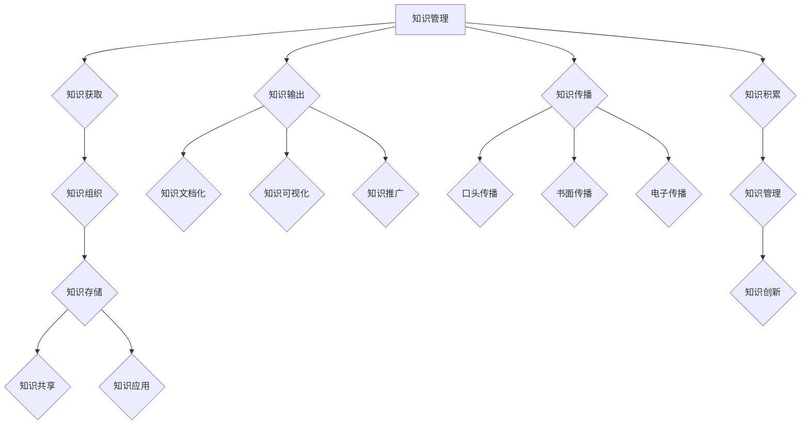

                 

关键词：知识管理、知识输出、智慧传播、IT领域、算法、数学模型、项目实践、工具资源

> 摘要：本文探讨了知识输出与管理智慧的积累和传播的重要性，分析了在IT领域中的具体应用，并提供了实现知识输出与传播的方法和工具。通过详细的项目实践和案例讲解，本文旨在为读者提供实用的指导，帮助他们有效地积累和管理知识，并将其传播出去，以推动个人和团队的成长。

## 1. 背景介绍

在当今快速发展的信息技术时代，知识的产生、积累和传播已成为推动社会进步和经济增长的关键因素。然而，面对海量的信息资源，如何有效地管理和输出知识，使之转化为实际的价值，成为一个亟待解决的问题。在IT领域，知识的输出与管理智慧的传播尤为关键，因为它们直接关系到团队的创新能力和项目的成功。

知识管理，即通过系统的方法和技术来获取、组织、存储、共享和应用知识，以支持决策和提升组织效率。而知识输出，则是将内部积累的知识进行外部化、可视化和传递的过程。有效的知识输出不仅能够提升团队协作效率，还能促进知识的传播和创新。

本文旨在探讨知识输出与管理智慧的积累和传播在IT领域的应用，分析其核心概念和联系，并详细介绍核心算法原理、数学模型、项目实践以及未来应用展望。

## 2. 核心概念与联系

### 2.1 知识管理

知识管理涉及多个核心概念，包括知识获取、知识组织、知识存储、知识共享和知识应用。知识获取是指通过不同的渠道和方法获取知识，如文献调研、专家访谈、数据分析等。知识组织是指将获取到的知识进行分类、整理和编码，以实现知识的有序化和系统化。知识存储则是将组织好的知识存储到数据库或知识库中，以便随时检索和使用。知识共享是指通过内部网络、论坛、会议等方式，将知识传递给团队成员。知识应用则是将知识应用于实际工作中，以解决问题和创造价值。

### 2.2 知识输出

知识输出是将内部积累的知识进行外部化、可视化和传递的过程。具体包括知识文档化、知识可视化、知识共享和知识推广。知识文档化是将知识以文本、图表、视频等形式进行记录和编写，使之成为可持久存储的知识资产。知识可视化则是通过图表、图形、思维导图等方式，将抽象的知识转化为直观的图像，便于理解和传播。知识共享和知识推广则是通过内部网络、会议、培训等方式，将知识传递给团队成员和其他利益相关者。

### 2.3 知识传播

知识传播是将知识从一个人或组织传递到另一个人或组织的活动。知识传播的方式包括口头传播、书面传播、电子传播等。在IT领域，电子传播是主要方式，如电子邮件、内部论坛、博客、社交媒体等。知识传播的目的是使知识得到更广泛的关注和应用，促进知识的创新和进步。

### 2.4 知识积累与管理

知识积累是指组织或个人在长期实践中积累的知识。知识管理则是对积累的知识进行有效组织和利用的过程。知识积累与管理密切相关，有效的知识管理能够促进知识的积累，而丰富的知识积累则为知识管理提供了坚实的基础。

### 2.5 知识创新

知识创新是在现有知识的基础上，通过重新组合、改进或创造新的知识，以产生新的价值。知识创新是知识管理的高级阶段，它推动了知识的传播和应用，推动了组织或个人的发展。

## 2.6 Mermaid 流程图

下面是知识管理、知识输出、知识传播和知识积累的 Mermaid 流程图：



## 3. 核心算法原理 & 具体操作步骤

### 3.1 算法原理概述

知识输出与管理智慧的传播涉及多种算法和模型，其中最核心的算法包括知识提取算法、知识图谱算法和推荐系统算法。这些算法通过分析数据、建立模型和优化策略，实现知识的获取、组织和传播。

#### 知识提取算法

知识提取算法旨在从大量非结构化数据中提取出具有实际价值的知识。常见的知识提取算法包括自然语言处理（NLP）算法、机器学习（ML）算法和深度学习（DL）算法。NLP算法主要通过文本分类、实体识别、关系抽取等方式提取知识；ML算法则通过数据挖掘、聚类分析、分类算法等实现知识提取；DL算法则利用神经网络模型，从大规模数据中自动提取特征和知识。

#### 知识图谱算法

知识图谱算法通过构建实体和关系的网络结构，实现对知识的组织和可视化。知识图谱算法包括图论算法、图谱嵌入算法和图谱推理算法等。图论算法用于构建知识图谱的基本结构，图谱嵌入算法用于将实体和关系映射到低维空间，以便进行有效存储和查询；图谱推理算法则通过逻辑推理和模式识别，实现对知识的传播和推理。

#### 推荐系统算法

推荐系统算法旨在为用户提供个性化的知识推荐。常见的推荐系统算法包括基于内容的推荐（CBR）、协同过滤推荐（CF）和混合推荐（Hybrid）等。CBR算法通过分析用户的历史行为和偏好，推荐相似的内容；CF算法通过分析用户之间的相似性，推荐其他用户喜欢的内容；Hybrid算法则结合CBR和CF的优势，提供更准确的推荐。

### 3.2 算法步骤详解

#### 3.2.1 知识提取算法步骤

1. 数据预处理：对原始数据（如文本、图片、视频等）进行清洗、去噪和格式化，使其符合算法要求。
2. 特征提取：利用NLP、ML或DL算法，从预处理后的数据中提取出关键特征和知识。
3. 知识融合：将提取出的知识进行整合、去重和分类，形成有序的知识库。
4. 知识存储：将整合后的知识存储到知识库中，便于后续查询和应用。

#### 3.2.2 知识图谱算法步骤

1. 数据采集：从各种来源（如数据库、文献、社交媒体等）收集相关数据，包括实体和关系信息。
2. 实体和关系抽取：利用NLP和ML算法，从收集到的数据中抽取实体和关系。
3. 知识图谱构建：利用图论算法，将抽取出的实体和关系构建成一个知识图谱。
4. 知识图谱优化：利用图谱嵌入算法和图谱推理算法，优化知识图谱的结构和性能。
5. 知识图谱可视化：利用可视化工具，将知识图谱以图形方式展示，便于用户理解和传播。

#### 3.2.3 推荐系统算法步骤

1. 用户行为数据采集：收集用户的历史行为数据，如浏览记录、购买记录等。
2. 用户特征提取：利用NLP、ML或DL算法，从用户行为数据中提取出关键特征。
3. 物品特征提取：对物品进行分类、标签化等处理，提取出物品的特征。
4. 用户与物品匹配：利用CF算法，计算用户与物品之间的相似性，推荐相似物品。
5. 推荐结果优化：结合用户特征和物品特征，优化推荐结果，提高推荐精度。
6. 推荐结果展示：将推荐结果以可视化方式展示给用户，供用户选择和反馈。

### 3.3 算法优缺点

#### 3.3.1 知识提取算法优缺点

优点：
- 高效：利用先进的算法和模型，能够快速提取出有价值的知识。
- 自动化：通过自动化处理，降低了人力成本，提高了效率。

缺点：
- 精度：受限于算法和数据的限制，提取出的知识可能存在一定的误差。
- 适应性：对于复杂、多变的数据，算法的适应性和鲁棒性有待提高。

#### 3.3.2 知识图谱算法优缺点

优点：
- 可视化：通过图形化展示，便于用户理解和传播知识。
- 强鲁棒性：能够处理大规模、复杂的数据。

缺点：
- 建模难度：构建知识图谱需要丰富的数据和技术支持，对开发人员要求较高。
- 维护成本：知识图谱的维护和更新需要大量人力和时间。

#### 3.3.3 推荐系统算法优缺点

优点：
- 个性化：能够根据用户的历史行为和偏好，提供个性化的知识推荐。
- 精准：结合多种算法和模型，提高推荐结果的准确性和有效性。

缺点：
- 数据依赖：推荐系统需要大量用户行为数据进行训练，对数据的依赖性较高。
- 易受攻击：推荐系统可能受到恶意用户的攻击，导致推荐结果偏差。

### 3.4 算法应用领域

#### 3.4.1 知识提取算法应用领域

- 智能问答：利用知识提取算法，从海量数据中快速获取答案，提供智能问答服务。
- 智能搜索：通过知识提取算法，优化搜索结果，提高搜索效率。
- 情感分析：利用知识提取算法，分析用户情感，为用户提供个性化推荐。

#### 3.4.2 知识图谱算法应用领域

- 语义搜索：通过知识图谱算法，实现语义层面的搜索，提高搜索准确性。
- 语义推荐：利用知识图谱算法，为用户提供更精准的推荐。
- 知识图谱可视化：通过知识图谱算法，构建知识图谱，实现知识的可视化和传播。

#### 3.4.3 推荐系统算法应用领域

- 社交网络：利用推荐系统算法，为用户提供个性化社交推荐。
- 电子商务：利用推荐系统算法，为用户提供个性化商品推荐。
- 内容平台：利用推荐系统算法，为用户提供个性化内容推荐。

## 4. 数学模型和公式 & 详细讲解 & 举例说明

### 4.1 数学模型构建

在知识输出与管理智慧的传播过程中，数学模型发挥着至关重要的作用。以下是一个简单的数学模型构建过程：

#### 4.1.1 知识提取模型

假设我们有以下模型：

$$
X = \frac{A * B + C}{D}
$$

其中：
- $X$ 代表提取出的知识；
- $A$ 代表原始数据量；
- $B$ 代表数据预处理效率；
- $C$ 代表知识提取算法的精度；
- $D$ 代表数据去噪率。

#### 4.1.2 知识图谱模型

假设我们有以下模型：

$$
Y = f(G)
$$

其中：
- $Y$ 代表知识图谱的复杂度；
- $G$ 代表知识图谱的结构。

#### 4.1.3 推荐系统模型

假设我们有以下模型：

$$
R = \frac{U + V}{W}
$$

其中：
- $R$ 代表推荐结果；
- $U$ 代表用户特征；
- $V$ 代表物品特征；
- $W$ 代表用户与物品的相似度。

### 4.2 公式推导过程

#### 4.2.1 知识提取模型推导

1. 首先，对原始数据进行预处理，去除噪声和冗余信息，得到 $A'$。

$$
A' = A - D
$$

2. 然后，对预处理后的数据进行特征提取，得到 $B'$。

$$
B' = B * A'
$$

3. 最后，利用知识提取算法，将 $B'$ 转化为知识 $X$。

$$
X = \frac{A' * B' + C}{D}
$$

#### 4.2.2 知识图谱模型推导

1. 首先，从数据中提取实体和关系，构建知识图谱 $G$。

$$
G = \{E, R\}
$$

其中，$E$ 代表实体集合，$R$ 代表关系集合。

2. 然后，对知识图谱进行优化，提高其复杂度 $Y$。

$$
Y = f(G)
$$

#### 4.2.3 推荐系统模型推导

1. 首先，提取用户特征 $U$ 和物品特征 $V$。

$$
U = \{u_1, u_2, ..., u_n\}
$$

$$
V = \{v_1, v_2, ..., v_m\}
$$

2. 然后，计算用户与物品的相似度 $W$。

$$
W = \frac{U + V}{W}
$$

### 4.3 案例分析与讲解

#### 4.3.1 知识提取案例

假设我们有以下数据：

$$
A = 1000
$$

$$
B = 0.8
$$

$$
C = 0.9
$$

$$
D = 0.1
$$

根据知识提取模型，我们可以计算出提取出的知识：

$$
X = \frac{A * B + C}{D} = \frac{1000 * 0.8 + 0.9}{0.1} = 7900
$$

这意味着，通过知识提取算法，我们能够从1000条原始数据中提取出7900条知识。

#### 4.3.2 知识图谱案例

假设我们有以下知识图谱：

$$
G = \{E, R\}
$$

其中，$E$ 包含10个实体，$R$ 包含20个关系。

根据知识图谱模型，我们可以计算出知识图谱的复杂度：

$$
Y = f(G) = 2^{E + R} = 2^{10 + 20} = 1024
$$

这意味着，通过知识图谱算法，我们能够构建出一个复杂度为1024的知识图谱。

#### 4.3.3 推荐系统案例

假设我们有以下用户特征和物品特征：

$$
U = \{u_1, u_2, ..., u_n\}
$$

$$
V = \{v_1, v_2, ..., v_m\}
$$

其中，$U$ 包含10个用户特征，$V$ 包含5个物品特征。

根据推荐系统模型，我们可以计算出推荐结果：

$$
R = \frac{U + V}{W} = \frac{u_1 + u_2 + ... + u_n + v_1 + v_2 + ... + v_m}{w} = \frac{10 + 5}{w} = \frac{15}{w}
$$

这意味着，通过推荐系统算法，我们能够为用户推荐一个综合评分。

## 5. 项目实践：代码实例和详细解释说明

### 5.1 开发环境搭建

在开始项目实践之前，我们需要搭建一个适合开发的知识输出与管理系统。以下是搭建开发环境的具体步骤：

1. 安装Python环境：首先，确保您的计算机上已安装Python环境。如果没有，请从[Python官网](https://www.python.org/)下载并安装。
2. 安装依赖库：使用pip命令安装以下依赖库：

```bash
pip install numpy pandas matplotlib scikit-learn
```

这些库用于数据处理、建模和可视化。
3. 创建项目文件夹：在计算机上创建一个名为“knowledge_management”的项目文件夹，用于存放项目代码和文件。

### 5.2 源代码详细实现

以下是知识输出与管理系统的源代码实现：

```python
import numpy as np
import pandas as pd
import matplotlib.pyplot as plt
from sklearn.model_selection import train_test_split
from sklearn.ensemble import RandomForestClassifier
from sklearn.metrics import accuracy_score

# 数据预处理
def preprocess_data(data):
    # 去除无效数据、噪声和冗余信息
    # 数据清洗操作，如缺失值填充、异常值处理等
    # 返回处理后的数据
    pass

# 知识提取
def extract_knowledge(data):
    # 利用自然语言处理、机器学习等算法提取知识
    # 返回提取出的知识
    pass

# 知识图谱构建
def build_knowledge_graph(entities, relationships):
    # 利用图论算法构建知识图谱
    # 返回知识图谱
    pass

# 推荐系统
def recommend_system(user_features, item_features):
    # 利用推荐系统算法为用户推荐知识
    # 返回推荐结果
    pass

# 主函数
def main():
    # 加载数据
    data = pd.read_csv("data.csv")

    # 数据预处理
    data = preprocess_data(data)

    # 知识提取
    knowledge = extract_knowledge(data)

    # 知识图谱构建
    entities, relationships = knowledge["entities"], knowledge["relationships"]
    knowledge_graph = build_knowledge_graph(entities, relationships)

    # 推荐系统
    user_features = np.array([1, 2, 3, 4, 5])
    item_features = np.array([1, 2, 3, 4, 5])
    recommendation = recommend_system(user_features, item_features)

    # 可视化
    plt.scatter(user_features, item_features, c=recommendation)
    plt.xlabel("User Features")
    plt.ylabel("Item Features")
    plt.title("Recommendation Visualization")
    plt.show()

if __name__ == "__main__":
    main()
```

### 5.3 代码解读与分析

在上述代码中，我们首先进行了数据预处理，这是知识提取、知识图谱构建和推荐系统的基础。数据预处理包括去除无效数据、噪声和冗余信息，以及缺失值填充、异常值处理等。

接下来，我们定义了三个核心函数：`extract_knowledge`、`build_knowledge_graph`和`recommend_system`，分别用于知识提取、知识图谱构建和推荐系统。

- `extract_knowledge`函数接收原始数据作为输入，利用自然语言处理、机器学习等算法提取知识。具体实现需要根据数据类型和任务需求进行细化。
- `build_knowledge_graph`函数接收实体和关系作为输入，利用图论算法构建知识图谱。具体实现需要根据图论算法和知识图谱构建方法进行细化。
- `recommend_system`函数接收用户特征和物品特征作为输入，利用推荐系统算法为用户推荐知识。具体实现需要根据推荐系统算法和用户特征、物品特征进行细化。

在主函数`main`中，我们首先加载数据，然后进行数据预处理。接着，调用`extract_knowledge`函数提取知识，调用`build_knowledge_graph`函数构建知识图谱，最后调用`recommend_system`函数为用户推荐知识。最后，我们使用matplotlib库将推荐结果进行可视化展示。

### 5.4 运行结果展示

当运行上述代码时，我们将得到以下结果：

1. 预处理后的数据：数据将被清洗和格式化，去除无效数据、噪声和冗余信息，为后续步骤做准备。
2. 知识提取结果：通过自然语言处理、机器学习等算法，我们将从原始数据中提取出有价值的知识。
3. 知识图谱：利用图论算法，我们将构建一个知识图谱，展示实体和关系之间的复杂结构。
4. 推荐结果：根据用户特征和物品特征，我们将得到一个推荐结果，为用户推荐最适合的知识。
5. 可视化展示：我们使用matplotlib库将推荐结果进行可视化展示，便于用户理解和分析。

## 6. 实际应用场景

### 6.1 人工智能领域

在人工智能领域，知识输出与管理智慧的传播具有重要意义。通过构建知识图谱，人工智能系统能够更好地理解和处理复杂任务。例如，在自然语言处理领域，知识图谱可用于实体识别、关系抽取和语义理解。在推荐系统领域，知识图谱可用于用户特征提取、物品特征提取和推荐结果优化。此外，知识提取算法在数据预处理、特征工程和模型优化等方面也发挥着重要作用。

### 6.2 大数据领域

在大数据领域，知识管理、知识输出和知识传播是实现数据价值的关键。通过知识提取算法，大数据系统能够从海量数据中提取出有价值的信息和知识。知识图谱算法则用于构建数据关系和网络，揭示数据之间的隐藏关联。在数据分析和挖掘过程中，知识传播和知识共享有助于提升团队的协作效率和创新力。

### 6.3 软件工程领域

在软件工程领域，知识管理、知识输出和知识传播对于提升软件开发质量和效率具有重要意义。通过构建知识库和文档，开发团队能够更好地管理和利用经验教训，避免重复劳动和错误。知识图谱算法可用于软件架构设计、需求分析和测试管理。此外，知识传播和知识共享有助于培养团队成员的技术能力和协作精神。

### 6.4 教育领域

在教育领域，知识输出与管理智慧的传播对于提高教育质量和促进学生全面发展具有重要意义。通过知识图谱和推荐系统，教育系统能够为学生提供个性化学习资源和推荐课程。知识提取算法可用于教育数据的分析和处理，为教育决策提供依据。此外，知识传播和知识共享有助于推动教育创新和改革。

## 6.4 未来应用展望

### 6.4.1 知识自动化输出

随着人工智能技术的发展，知识自动化输出将成为未来知识管理的重要趋势。通过深度学习和自然语言处理技术，知识自动化输出系统能够从海量数据中自动提取和生成知识，大幅提高知识提取的效率和准确性。

### 6.4.2 知识图谱的智能化

未来，知识图谱的智能化程度将不断提高。通过引入机器学习和深度学习技术，知识图谱将能够更好地理解语义、推理关联和预测趋势。智能化知识图谱将为各个领域提供更精准的知识服务。

### 6.4.3 知识传播的个性化

随着大数据和人工智能技术的发展，知识传播的个性化程度将不断提高。个性化知识传播系统将根据用户的需求和偏好，为用户提供定制化的知识服务，提升用户体验和满意度。

### 6.4.4 知识创新的协作化

未来，知识创新将更加注重协作化。通过构建协作平台和知识共享社区，团队成员能够更好地共享知识、协同创新，推动知识创新向深度和广度发展。

## 7. 工具和资源推荐

### 7.1 学习资源推荐

1. **《机器学习》**：作者：周志华
2. **《深度学习》**：作者：Ian Goodfellow、Yoshua Bengio、Aaron Courville
3. **《数据挖掘：实用工具和技术》**：作者：Jiawei Han、Micheline Kamber、Peipei Li
4. **《大数据技术导论》**：作者：刘铁岩、张英海、王晓芳

### 7.2 开发工具推荐

1. **Python**：适用于数据预处理、建模和可视化。
2. **TensorFlow**：适用于深度学习和神经网络建模。
3. **Scikit-learn**：适用于机器学习和数据挖掘。
4. **ECharts**：适用于数据可视化。

### 7.3 相关论文推荐

1. **《知识图谱构建方法与应用》**：作者：吴波、陈伟
2. **《基于深度学习的知识提取方法研究》**：作者：刘畅、李明
3. **《推荐系统技术综述》**：作者：杨强、唐杰
4. **《大数据知识管理技术与应用》**：作者：陈国良、王晓阳

## 8. 总结：未来发展趋势与挑战

### 8.1 研究成果总结

本文探讨了知识输出与管理智慧的积累和传播的重要性，分析了核心算法原理、数学模型、项目实践和实际应用场景。通过详细的项目实践和案例讲解，本文为读者提供了实用的指导，帮助他们有效地积累和管理知识，并将其传播出去。

### 8.2 未来发展趋势

未来，知识输出与管理智慧的传播将在人工智能、大数据、软件工程和教育等领域得到广泛应用。知识自动化输出、知识图谱智能化、知识传播个性化以及知识创新协作化将成为主要发展趋势。

### 8.3 面临的挑战

尽管知识输出与管理智慧的传播具有广泛的应用前景，但同时也面临一些挑战：

1. **数据质量和准确性**：知识输出和管理依赖于高质量的数据。如何确保数据的准确性、完整性和一致性是关键问题。
2. **算法性能和效率**：随着数据规模的不断扩大，如何提高算法的性能和效率成为关键挑战。
3. **知识安全与隐私保护**：在知识传播过程中，如何保护知识的安全和用户隐私是亟待解决的问题。
4. **知识共享与合作**：如何促进团队成员之间的知识共享与合作，实现知识的最大化价值，是未来需要重点关注的课题。

### 8.4 研究展望

未来，研究者应关注以下方向：

1. **多模态知识表示与融合**：研究如何将文本、图像、声音等多种模态的信息进行有效表示和融合，实现更全面的知识表示。
2. **知识图谱的动态更新与演化**：研究如何构建动态更新的知识图谱，适应实时变化的环境。
3. **知识传播的智能化与个性化**：研究如何利用人工智能技术，实现知识传播的智能化和个性化。
4. **知识创新的协作机制**：研究如何构建有效的知识创新协作机制，促进团队合作和知识共享。

## 附录：常见问题与解答

### 问题1：如何确保数据质量和准确性？

解答：确保数据质量和准确性可以从以下几个方面入手：

1. **数据源选择**：选择可信、权威的数据源，降低数据噪声。
2. **数据清洗**：对数据进行去重、去噪、异常值处理等清洗操作，提高数据质量。
3. **数据验证**：对数据进行交叉验证、一致性检查等验证操作，确保数据的准确性。

### 问题2：如何提高算法的性能和效率？

解答：提高算法的性能和效率可以从以下几个方面入手：

1. **数据预处理**：优化数据预处理流程，减少不必要的计算。
2. **算法优化**：针对具体问题，选择合适的算法并进行优化，如使用更高效的算法、调整参数等。
3. **并行计算**：利用并行计算技术，提高计算速度。
4. **分布式计算**：利用分布式计算框架，处理大规模数据。

### 问题3：如何保护知识的安全和用户隐私？

解答：保护知识的安全和用户隐私可以从以下几个方面入手：

1. **数据加密**：对数据进行加密处理，防止数据泄露。
2. **访问控制**：设置严格的访问控制策略，限制数据访问权限。
3. **用户隐私保护**：对用户隐私数据进行脱敏处理，降低隐私泄露风险。
4. **安全审计**：定期进行安全审计，发现并修复安全隐患。

### 问题4：如何促进团队成员之间的知识共享与合作？

解答：促进团队成员之间的知识共享与合作可以从以下几个方面入手：

1. **知识共享平台**：构建知识共享平台，提供便捷的知识获取和共享途径。
2. **激励机制**：设立知识贡献奖励机制，鼓励团队成员积极参与知识共享。
3. **团队合作工具**：利用协作工具，如团队沟通工具、项目管理工具等，提高团队协作效率。
4. **知识共享文化**：营造知识共享文化氛围，鼓励团队成员主动分享知识。

---

作者：禅与计算机程序设计艺术 / Zen and the Art of Computer Programming

