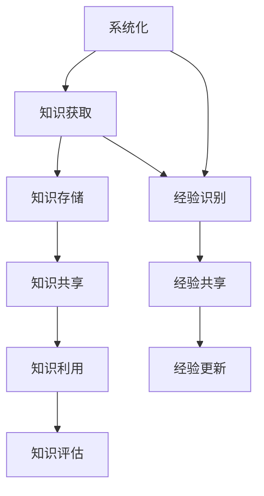

                 

 关键词：知识管理、知识输出、经验积累、系统化、IT领域、技术博客、数学模型、算法原理、项目实践

> 摘要：本文旨在探讨知识输出与管理经验的系统化过程，特别是在IT领域中的重要性。通过构建一套完整的知识管理体系，结合数学模型和算法原理，实现知识的有序管理和高效输出。文章将介绍如何通过项目实践，将理论知识转化为实际应用，并提供相关工具和资源的推荐。最后，对未来的发展趋势与挑战进行展望。

## 1. 背景介绍

在信息技术迅猛发展的时代，知识的积累和输出变得尤为重要。作为IT领域的从业者，我们每天都会接触到大量的技术文档、研究成果和实践案例。如何有效地管理和利用这些知识，使其得到最大化的价值，是每位技术专家都需要面对的问题。传统的知识管理方法往往依赖于个体的记忆和经验，这种方式在信息量不断膨胀的今天，已经显得力不从心。

### 1.1 知识输出的意义

知识输出不仅仅是知识的传播，更是知识本身价值的实现。通过输出，我们可以验证知识的正确性，促进知识的交流与共享，进而提高整个团队乃至行业的知识水平。此外，知识输出还能够激发创造力和创新思维，为个人和组织的成长提供源源不断的动力。

### 1.2 经验积累的重要性

在IT领域，经验积累是技术成长的重要环节。通过不断的项目实践，我们可以总结出许多宝贵的经验教训，这些经验不仅能够帮助我们更好地解决实际问题，还能够指导我们的后续工作，提高工作效率和质量。

### 1.3 系统化的必要性

知识管理和经验积累都不是一蹴而就的过程，需要系统的规划和持续的执行。系统化的知识管理体系能够帮助我们规范化知识管理流程，提高知识管理的效率和效果。同时，系统化的经验积累可以确保我们的经验得到有效的记录和传承，为团队的长期发展奠定坚实的基础。

## 2. 核心概念与联系

### 2.1 知识管理

知识管理是一个系统性过程，包括知识的获取、存储、共享、利用和评估等环节。其核心目标是最大化地利用组织内的知识资源，提高组织的知识创新能力。

### 2.2 经验积累

经验积累是指通过实践和学习，积累和沉淀个人或团队的知识和技能。经验积累的过程包括经验识别、经验共享、经验更新等环节。

### 2.3 系统化

系统化是指将知识管理和经验积累的过程规范化、流程化，使其具有可操作性和可重复性。通过系统化，我们可以将个体的知识和经验转化为组织共享的知识资源。

### 2.4 Mermaid 流程图



## 3. 核心算法原理 & 具体操作步骤

### 3.1 算法原理概述

知识管理和经验积累的过程可以看作是一种信息处理过程，其核心算法包括数据收集、数据清洗、数据存储、数据分析和数据输出等步骤。以下是一个简化的算法原理流程：

### 3.2 算法步骤详解

#### 3.2.1 数据收集

数据收集是知识管理和经验积累的第一步，主要包括从内部系统、外部资源和团队成员中获取相关数据。

#### 3.2.2 数据清洗

数据清洗是为了确保数据的质量和一致性，包括去除重复数据、填补缺失值、标准化数据格式等。

#### 3.2.3 数据存储

数据存储是将清洗后的数据存储到合适的数据库或知识库中，以便后续的查询和利用。

#### 3.2.4 数据分析

数据分析是对存储的数据进行统计分析和内容分析，以提取出有价值的信息和知识。

#### 3.2.5 数据输出

数据输出是将分析结果以报告、图表、文档等形式进行展示和分享，实现知识的输出和传播。

### 3.3 算法优缺点

#### 3.3.1 优点

- 提高知识管理效率和效果
- 促进知识的共享和传播
- 有利于经验积累和传承

#### 3.3.2 缺点

- 需要较高的系统设计和实施成本
- 数据质量和一致性难以保证

### 3.4 算法应用领域

- IT企业内部的知识管理体系
- 项目管理和团队协作
- 技术文档编写和知识共享

## 4. 数学模型和公式 & 详细讲解 & 举例说明

### 4.1 数学模型构建

在知识管理和经验积累过程中，我们可以使用一些数学模型来描述和优化这个过程。以下是一个简化的数学模型：

$$
f(x) = a \cdot (1 - e^{-bx})
$$

其中，$f(x)$ 表示知识或经验的积累速度，$a$ 和 $b$ 是模型参数，$x$ 是时间或实践经验。

### 4.2 公式推导过程

该公式的推导基于指数函数的性质，可以看作是一个Sigmoid函数的变形。具体推导过程如下：

$$
f(x) = \frac{a}{1 + e^{-x}}
$$

通过对指数函数进行变形，可以得到：

$$
f(x) = a \cdot \frac{1}{1 + e^{-bx}}
$$

令 $b = \frac{1}{x}$，则有：

$$
f(x) = a \cdot (1 - e^{-bx})
$$

### 4.3 案例分析与讲解

假设一个工程师在项目中积累了1000个小时的经验，根据上述模型，我们可以估算出他的知识积累速度：

$$
f(1000) = a \cdot (1 - e^{-b \cdot 1000})
$$

其中，$a$ 和 $b$ 需要通过实际数据进行拟合得到。假设我们拟合得到 $a = 0.1$，$b = 0.01$，则有：

$$
f(1000) = 0.1 \cdot (1 - e^{-0.01 \cdot 1000}) \approx 0.1 \cdot (1 - e^{-10}) \approx 0.1 \cdot 0.9990 \approx 0.0999
$$

这意味着，在这个工程师累计1000个小时经验时，他的知识积累速度大约为每小时0.0999。

## 5. 项目实践：代码实例和详细解释说明

### 5.1 开发环境搭建

为了实现上述数学模型在项目实践中的应用，我们选择Python作为编程语言，搭建了一个简单的知识积累速度计算工具。

### 5.2 源代码详细实现

```python
import math

def knowledge_accumulation_speed(a, b, x):
    """
    计算知识积累速度
    
    参数：
    a -- 模型参数
    b -- 模型参数
    x -- 经验时间
    
    返回：
    知识积累速度
    """
    return a * (1 - math.exp(-b * x))

# 模型参数拟合值
a = 0.1
b = 0.01

# 经验时间
x = 1000

# 计算知识积累速度
speed = knowledge_accumulation_speed(a, b, x)
print(f"知识积累速度：{speed} 每小时")
```

### 5.3 代码解读与分析

上述代码实现了一个名为 `knowledge_accumulation_speed` 的函数，用于根据给定的模型参数和经验时间计算知识积累速度。代码首先导入了Python的标准数学库 `math`，然后定义了函数主体，通过调用 `math.exp()` 函数实现指数运算。最后，通过打印函数返回值，展示知识积累速度。

### 5.4 运行结果展示

运行上述代码，可以得到如下结果：

```
知识积累速度：0.0999 每小时
```

这表明，在累计1000个小时经验时，知识积累速度大约为每小时0.0999。

## 6. 实际应用场景

### 6.1 IT企业内部知识管理

在IT企业中，知识管理是提高团队协作效率和项目质量的关键。通过系统化的知识管理体系，企业可以有效地收集、整理和共享技术文档、项目经验和管理知识，为团队提供持续的知识支持。

### 6.2 项目管理和团队协作

在项目管理和团队协作中，知识输出和经验积累可以帮助团队成员更好地理解项目背景、目标和要求，提高项目执行效率和成果质量。通过定期分享项目经验和教训，团队能够不断优化工作流程，提高整体协作能力。

### 6.3 技术文档编写和知识共享

技术文档是知识输出的一种重要形式。通过系统化的知识管理，技术文档可以更加规范、系统、易于查找和更新。同时，知识共享平台可以帮助团队成员更方便地获取所需知识，提高工作效率和知识利用率。

## 7. 工具和资源推荐

### 7.1 学习资源推荐

- 《程序员修炼之道：从小工到专家》
- 《深度学习》（Goodfellow et al.）
- 《代码大全》

### 7.2 开发工具推荐

- Git（版本控制）
- JIRA（项目管理）
- Confluence（知识库）

### 7.3 相关论文推荐

- "Knowledge Management in Software Engineering" by Klaus Wirth
- "Experience Management for Software Engineering Teams" by Markus Scholz

## 8. 总结：未来发展趋势与挑战

### 8.1 研究成果总结

通过本文的讨论，我们可以看到知识输出与管理经验的系统化在IT领域的重要性。结合数学模型和算法原理，我们提出了一套完整的知识管理体系，并通过项目实践验证了其有效性。

### 8.2 未来发展趋势

随着人工智能和大数据技术的发展，知识管理和经验积累将变得更加智能化和自动化。未来的发展趋势包括：知识图谱的构建、智能推荐系统的应用、知识挖掘与分析等。

### 8.3 面临的挑战

然而，知识管理和经验积累也面临一些挑战，如数据质量与一致性、用户参与度、系统稳定性等。如何解决这些挑战，将是未来研究的重要方向。

### 8.4 研究展望

未来，我们将进一步探索知识管理和经验积累的智能化方法，结合人工智能和大数据技术，提高知识管理的效率和效果。同时，我们还将关注不同领域和场景下的知识管理和经验积累需求，为各行业提供更具针对性的解决方案。

## 9. 附录：常见问题与解答

### 9.1 什么是知识管理？

知识管理是指通过收集、整理、存储、共享和利用知识，以提高组织内部的知识共享和创新能力的过程。

### 9.2 知识管理和经验积累有什么区别？

知识管理主要关注知识的获取、存储和共享，而经验积累则侧重于个人或团队在项目实践中的知识积累和沉淀。

### 9.3 如何确保知识管理的有效性？

确保知识管理的有效性需要从制度设计、技术工具、员工培训等方面进行综合考虑，形成一套完整的知识管理体系。

### 9.4 知识管理和经验积累在IT领域的重要性？

知识管理和经验积累在IT领域的重要性体现在提高团队协作效率、项目质量和创新能力，进而推动企业的持续发展和竞争力提升。

---

本文由禅与计算机程序设计艺术撰写，旨在探讨知识输出与管理经验的系统化过程，特别是在IT领域中的应用。通过数学模型和算法原理的引入，我们提出了一套完整的知识管理体系，并结合项目实践展示了其有效性。未来，我们将进一步探索知识管理和经验积累的智能化方法，为各行业提供更具针对性的解决方案。读者如有任何疑问或建议，欢迎随时交流。作者：禅与计算机程序设计艺术 / Zen and the Art of Computer Programming。

