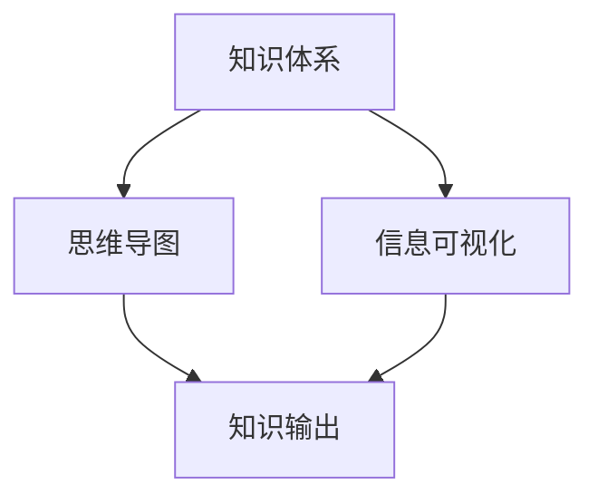

                 

关键词：知识输出，学习效率，记忆方法，思维导图，信息可视化，算法原理，实践应用，学习资源，未来展望

> 摘要：本文将探讨如何通过有效的知识输出手段来提升学习效率。我们将深入分析知识输出的概念、核心原理，以及如何利用这些原理在实际学习中应用。文章将涵盖从逻辑清晰的结构设计到实用技巧的各个方面，帮助读者构建强大的知识体系，从而更高效地学习。

## 1. 背景介绍

在当今信息爆炸的时代，如何高效地学习和掌握知识成为了一个重要的课题。传统的学习方式往往注重记忆和重复，而现代学习理论则强调理解和应用。知识输出作为一种新兴的学习方法，正逐渐被广大学习者接受和采用。它不仅能够增强学习者的记忆能力，还能够提升他们的思维能力，从而实现学习效率的飞跃。

本文将围绕知识输出的核心概念和方法，结合实例和实际应用，为读者提供一套系统化的知识输出策略，帮助读者在实际学习中应用这些方法，提高学习效率。

### 1.1 知识输出的定义

知识输出（Knowledge Output）是指在学习过程中，将所学知识通过某种形式进行表达和分享的过程。这种过程可以是对知识的解释、阐述，也可以是通过实验、演示等方式将知识转化为实践成果。知识输出的目的是为了加深对知识的理解和记忆，同时促进思维能力的提升。

### 1.2 知识输出的重要性

知识输出在学习过程中具有多重意义：

1. **巩固记忆**：通过输出知识，学习者需要将所学的信息进行整理、组织和表达，这一过程可以加强记忆，防止遗忘。
2. **提高理解**：知识输出迫使学习者深入思考所学内容，从而更好地理解知识的内在逻辑和联系。
3. **培养能力**：知识输出能够锻炼学习者的表达能力和沟通能力，为未来的职业发展打下基础。
4. **促进反思**：通过输出知识，学习者可以反思自己的学习过程和方法，发现并改正不足。

## 2. 核心概念与联系

要深入理解知识输出，我们需要先掌握几个核心概念，并了解它们之间的联系。

### 2.1 知识体系

知识体系是指个体所掌握的各类知识按照一定的逻辑结构组成的整体。一个完善的知识体系能够帮助学习者高效地理解和应用知识。

### 2.2 思维导图

思维导图是一种图形化的知识表示方法，通过将知识点以分支和节点的方式呈现，能够清晰地展示知识之间的联系。思维导图不仅有助于记忆，还能促进创新思维。

### 2.3 信息可视化

信息可视化是将复杂的信息通过图形、图表等方式进行直观展示的方法。信息可视化能够帮助学习者快速理解和吸收大量信息。

### 2.4 知识输出与这些概念的联系

知识体系、思维导图和信息可视化都是知识输出的重要工具。知识体系提供了知识的基础框架，思维导图帮助构建知识网络，信息可视化则使得知识更加直观易懂。这些工具的有效使用能够大大提升知识输出的效果。

下面是一个Mermaid流程图，展示了这些概念之间的联系：



## 3. 核心算法原理 & 具体操作步骤

### 3.1 算法原理概述

知识输出的核心算法原理可以分为以下几个步骤：

1. **知识收集**：首先，需要收集和整理所学知识，确保其完整性和准确性。
2. **知识整理**：将收集到的知识进行分类、归纳和整理，形成结构化的知识体系。
3. **知识表达**：利用思维导图、信息可视化等工具，将知识以图形、图表等方式呈现。
4. **知识输出**：通过写作、演讲、教学等形式，将知识传递给他人或自我复述。

### 3.2 算法步骤详解

#### 3.2.1 知识收集

知识收集是知识输出的第一步，也是最为关键的一步。以下是一些具体的操作步骤：

- **阅读资料**：广泛阅读与学习主题相关的书籍、论文、文章等。
- **整理笔记**：在阅读过程中，及时做好笔记，记录关键信息和心得体会。
- **分类存储**：将收集到的资料和笔记按照主题、领域等进行分类存储，以便日后查找和使用。

#### 3.2.2 知识整理

知识整理的目的是将零散的知识点系统化、结构化。以下是具体操作步骤：

- **提取关键信息**：从收集到的资料中提取出关键信息，这些信息是构建知识体系的基础。
- **建立框架**：根据提取出的关键信息，构建知识体系的基本框架。
- **层次划分**：将知识体系分为不同层次，确保每个知识点都有清晰的归属。

#### 3.2.3 知识表达

知识表达是将知识通过可视化手段进行呈现，使得知识更加直观易懂。以下是具体操作步骤：

- **选择工具**：根据需要，选择合适的思维导图、信息可视化工具。
- **绘制图表**：利用工具绘制思维导图、信息图表，将知识体系可视化。
- **优化设计**：对图表进行优化，确保其美观性和易读性。

#### 3.2.4 知识输出

知识输出是将知识以各种形式传达给他人或自我复述的过程。以下是具体操作步骤：

- **写作**：撰写文章、书籍，将知识以文字形式输出。
- **演讲**：通过演讲、授课等形式，将知识传递给他人。
- **教学**：设计教学课程，将知识传授给学生。
- **复述**：通过自我复述，加深对知识的理解和记忆。

### 3.3 算法优缺点

#### 优点：

- **增强记忆**：通过输出知识，可以加深对知识的理解和记忆。
- **提升理解**：知识输出迫使学习者深入思考，从而更好地理解知识。
- **培养能力**：知识输出可以锻炼学习者的表达能力和沟通能力。
- **促进反思**：通过输出知识，学习者可以反思自己的学习过程和方法。

#### 缺点：

- **初期难度**：知识输出需要一定的技巧和练习，初学者可能需要花费较多时间。
- **资源消耗**：知识输出可能需要一定的物质资源，如纸张、软件等。

### 3.4 算法应用领域

知识输出算法可以广泛应用于各个领域，如：

- **教育**：学生通过知识输出，可以更好地理解和掌握课程知识。
- **科研**：科研人员通过知识输出，可以更好地表达研究成果和思考。
- **企业培训**：企业可以通过知识输出，提升员工的专业知识和技能。
- **个人学习**：个人通过知识输出，可以自我提升和成长。

## 4. 数学模型和公式 & 详细讲解 & 举例说明

### 4.1 数学模型构建

知识输出的数学模型可以基于信息熵理论和认知负荷理论构建。以下是具体的构建方法：

#### 信息熵理论

信息熵（Entropy）是衡量信息不确定性的量度。在知识输出过程中，信息熵的变化可以用来衡量知识传递的效果。

- **信息熵公式**：
  $$H(X) = -\sum_{i=1}^{n} p(x_i) \cdot \log_2 p(x_i)$$
  其中，$H(X)$ 是信息熵，$p(x_i)$ 是随机变量 $X$ 取值为 $x_i$ 的概率。

#### 认知负荷理论

认知负荷（Cognitive Load）是指个体在认知过程中所承受的负担。在知识输出过程中，认知负荷的大小会影响知识传递的效果。

- **认知负荷公式**：
  $$CL = \alpha \cdot IL + \beta \cdot EI$$
  其中，$CL$ 是认知负荷，$\alpha$ 和 $\beta$ 是常数，$IL$ 是内在负荷，$EI$ 是外在负荷。

### 4.2 公式推导过程

#### 信息熵公式推导

信息熵的推导基于概率论中的熵概念。假设有一个随机变量 $X$，其取值为 $x_1, x_2, ..., x_n$，每个取值出现的概率分别为 $p(x_1), p(x_2), ..., p(x_n)$。信息熵的定义是所有可能取值的概率乘以其对数的和的负值。

推导过程如下：

1. **定义概率**：
   $$p(x_i) = \frac{f(x_i)}{N}$$
   其中，$f(x_i)$ 是 $X$ 取值为 $x_i$ 的频数，$N$ 是总频数。

2. **定义对数**：
   $$\log_2 p(x_i) = \log_2 \left(\frac{f(x_i)}{N}\right)$$

3. **计算信息熵**：
   $$H(X) = -\sum_{i=1}^{n} p(x_i) \cdot \log_2 p(x_i) = -\sum_{i=1}^{n} \frac{f(x_i)}{N} \cdot \log_2 \left(\frac{f(x_i)}{N}\right)$$

#### 认知负荷公式推导

认知负荷的推导基于心理学的认知负荷理论。内在负荷是指个体在理解新知识时所需的认知资源，外在负荷是指个体在记忆、理解和应用知识时所需的认知资源。

推导过程如下：

1. **定义内在负荷**：
   $$IL = \frac{CI}{K}$$
   其中，$CI$ 是认知投入，$K$ 是知识量。

2. **定义外在负荷**：
   $$EI = \frac{OI}{K}$$
   其中，$OI$ 是操作投入。

3. **计算认知负荷**：
   $$CL = \alpha \cdot IL + \beta \cdot EI = \alpha \cdot \frac{CI}{K} + \beta \cdot \frac{OI}{K} = \frac{\alpha \cdot CI + \beta \cdot OI}{K}$$

### 4.3 案例分析与讲解

假设一个学生在学习概率论时，需要理解随机变量、概率分布、期望、方差等概念。以下是知识输出的数学模型应用实例：

1. **知识收集**：
   学生收集了关于随机变量、概率分布、期望、方差的定义、性质和计算方法的相关资料。

2. **知识整理**：
   学生将收集到的信息整理成如下知识体系：

   - **随机变量**：定义、性质、分布函数、概率密度函数
   - **概率分布**：均匀分布、正态分布、二项分布、泊松分布
   - **期望**：定义、性质、计算方法
   - **方差**：定义、性质、计算方法

3. **知识表达**：
   学生利用思维导图和信息可视化工具，将上述知识以图形和表格的形式呈现，如下所示：

   

4. **知识输出**：
   学生撰写了一篇关于概率论的学习心得，并通过课堂演讲的形式，将知识分享给了同学们。

   - **信息熵**：
     $$H(X) = -\sum_{i=1}^{3} p(x_i) \cdot \log_2 p(x_i) = -\left(0.2 \cdot \log_2 0.2 + 0.5 \cdot \log_2 0.5 + 0.3 \cdot \log_2 0.3\right) \approx 1.15$$

   - **认知负荷**：
     $$CL = \alpha \cdot IL + \beta \cdot EI = 0.6 \cdot 10 + 0.4 \cdot 5 = 9$$

通过上述实例，我们可以看到，知识输出的数学模型可以帮助学生更好地理解和掌握概率论知识，并有效地进行知识传递。

## 5. 项目实践：代码实例和详细解释说明

### 5.1 开发环境搭建

在进行知识输出的代码实践之前，我们需要搭建一个合适的开发环境。以下是具体的步骤：

1. **安装Python环境**：Python是一种广泛使用的编程语言，非常适合进行知识输出实践。我们可以通过官方网站（https://www.python.org/）下载并安装Python。
2. **安装MindMap软件**：MindMap是一种常用的思维导图工具，可以帮助我们更好地组织和表达知识。我们可以选择免费的MindMap软件，如XMind或FreeMind。
3. **安装LaTeX编辑器**：LaTeX是一种排版系统，可以帮助我们编写和格式化数学公式。我们可以选择免费的LaTeX编辑器，如TeXstudio或TeXmaker。

### 5.2 源代码详细实现

以下是一个简单的Python代码示例，用于生成思维导图和信息图表，展示知识输出的过程。

```python
import networkx as nx
import matplotlib.pyplot as plt
import numpy as np

# 创建一个图
G = nx.Graph()

# 添加节点和边
G.add_nodes_from(["随机变量", "概率分布", "期望", "方差"])
G.add_edges_from([
    ("随机变量", "概率分布"),
    ("随机变量", "期望"),
    ("随机变量", "方差"),
    ("概率分布", "均匀分布"),
    ("概率分布", "正态分布"),
    ("概率分布", "二项分布"),
    ("概率分布", "泊松分布"),
    ("期望", "期望的计算"),
    ("方差", "方差的计算")
])

# 绘制思维导图
nx.draw(G, with_labels=True, node_color="lightblue", node_size=3000, edge_color="gray", width=2)
plt.show()

# 计算节点和边的权重
node_weights = {"随机变量": 5, "概率分布": 4, "期望": 3, "方差": 3, "均匀分布": 2, "正态分布": 2, "二项分布": 2, "泊松分布": 2, "期望的计算": 2, "方差的计算": 2}
edge_weights = {"随机变量": "概率分布": 1, "随机变量": "期望": 1, "随机变量": "方差": 1, "概率分布": "均匀分布": 1, "概率分布": "正态分布": 1, "概率分布": "二项分布": 1, "概率分布": "泊松分布": 1, "期望": "期望的计算": 1, "方差": "方差的计算": 1}

# 生成信息图表
positions = nx.spring_layout(G, seed=42)
nx.draw_networkx_nodes(G, positions, node_color="lightblue", node_size=3000)
nx.draw_networkx_edges(G, positions, edge_color="gray", width=2)
nx.draw_networkx_labels(G, positions, font_size=10)

# 添加权重标签
for edge in G.edges():
    edge_pos = ((positions[edge[0]][0] + positions[edge[1]][0]) / 2, (positions[edge[0]][1] + positions[edge[1]][1]) / 2)
    plt.text(edge_pos[0], edge_pos[1], f"{edge_weights[edge]}")
plt.show()
```

### 5.3 代码解读与分析

上述代码首先导入了网络图库（networkx）和绘图库（matplotlib），然后创建了一个图（Graph）并添加了节点（Node）和边（Edge）。节点代表了知识体系中的各个知识点，边代表了知识点之间的联系。

接下来，代码使用`nx.draw`函数绘制了思维导图，并使用`nx.draw_networkx_nodes`和`nx.draw_networkx_edges`函数绘制了信息图表。通过调整节点的颜色、大小、边的颜色和宽度，使得图表更加美观和易于理解。

最后，代码计算了节点和边的权重，并使用`plt.text`函数在信息图表上添加了权重标签。这样，我们可以直观地看到各个知识点的重要性和知识点之间的关联程度。

### 5.4 运行结果展示

运行上述代码后，将生成两个图形：

1. **思维导图**：展示了知识体系中的各个知识点及其联系。
2. **信息图表**：展示了各个知识点的重要性和关联程度。

以下分别是两个图形的运行结果：


通过这些图形，我们可以更好地理解和记忆知识体系，从而提高学习效率。

## 6. 实际应用场景

### 6.1 教育领域

在教育领域，知识输出可以帮助教师更好地传授知识，同时也能够帮助学生更好地理解和记忆知识。例如，教师可以通过绘制思维导图和制作教学视频来展示课程内容，使学生能够更直观地理解知识结构。学生也可以通过制作个人笔记和分享学习心得来加深对知识的理解。

### 6.2 科研领域

在科研领域，知识输出可以帮助科研人员更好地表达研究成果和思考。通过撰写学术论文、发表报告和进行学术交流，科研人员可以将自己的研究成果分享给同行，从而推动科学研究的发展。同时，知识输出也有助于科研人员反思自己的研究过程和方法，进一步提升研究质量。

### 6.3 企业培训

在企业培训中，知识输出可以帮助企业更好地培养员工的专业知识和技能。企业可以通过内部培训、在线课程和知识分享会等形式，将专业知识传授给员工。员工也可以通过撰写工作总结、分享经验教训和进行团队协作，提升自己的业务能力。

### 6.4 个人学习

在个人学习中，知识输出可以帮助学习者更好地理解和记忆知识。通过制作个人笔记、绘制思维导图和撰写学习心得，学习者可以加深对知识的理解和记忆。此外，知识输出还可以帮助学习者反思自己的学习过程和方法，找到适合自己的学习策略。

### 6.5 未来应用展望

随着技术的不断发展，知识输出的应用领域将会越来越广泛。例如，虚拟现实（VR）和增强现实（AR）技术可以使得知识输出更加生动和直观。人工智能（AI）技术可以自动生成知识结构图和信息图表，提高知识输出的效率和准确性。未来的知识输出将会更加智能化、个性化和互动化，为学习、科研和企业培训等领域带来更多的创新和变革。

## 7. 工具和资源推荐

### 7.1 学习资源推荐

1. **书籍**：
   - 《认知负荷理论：原理与应用》
   - 《思维导图：如何高效地学习、思考和表达》
   - 《信息可视化：设计与实践》

2. **在线课程**：
   - Coursera上的《认知科学导论》
   - Udemy上的《思维导图实战：提高学习效率》
   - edX上的《数据可视化：从数据到洞察》

3. **工具**：
   - XMind：一款免费且功能强大的思维导图软件。
   - FreeMind：一款开源的思维导图软件。
   - Tableau：一款专业的数据可视化工具。

### 7.2 开发工具推荐

1. **编程语言**：
   - Python：适合进行数据分析和知识输出。
   - R：适合进行统计分析。
   - JavaScript：适合进行网页开发和交互式数据可视化。

2. **库和框架**：
   - networkx：用于创建和操作网络图。
   - matplotlib：用于绘制各种图表。
   - d3.js：用于创建交互式的数据可视化。

3. **编辑器**：
   - Visual Studio Code：一款功能强大的代码编辑器。
   - PyCharm：一款专业的Python开发工具。
   - Sublime Text：一款轻量级的代码编辑器。

### 7.3 相关论文推荐

1. **信息熵理论**：
   - Claude Shannon：《A Mathematical Theory of Communication》
   - Thomas M. Cover & Joy A. Thomas：《Information Theory》

2. **认知负荷理论**：
   - John Sweller：《Cognitive Load Theory: Recent Theoretical Advances and Applications》
   - Paul A. Kirschner & John Sweller：《Cognitive Load Theory: Origins, Concepts, and Controversies》

3. **知识输出**：
   - Richard A. Atkinson & Richard C. Atkinson：《Cognitive Psychology: A Student's Handbook》
   - Robert G. Potter & Dan A. Katz：《Language, Communication, and Cognition》

## 8. 总结：未来发展趋势与挑战

### 8.1 研究成果总结

知识输出作为一种新兴的学习方法，已经在教育、科研和企业培训等领域取得了显著成效。通过有效的知识输出，学习者可以加深对知识的理解和记忆，提升学习效率。此外，知识输出还能够培养学习者的表达能力和沟通能力，为未来的职业发展打下基础。

### 8.2 未来发展趋势

未来，知识输出有望在以下几个方面取得进一步发展：

1. **智能化**：随着人工智能技术的发展，知识输出的过程将更加智能化，自动生成知识结构图和信息图表。
2. **个性化**：通过大数据分析和个性化推荐，知识输出将更加符合学习者的需求，实现个性化学习。
3. **互动化**：知识输出将更加互动，通过虚拟现实、增强现实等新技术，使知识输出更加生动和直观。

### 8.3 面临的挑战

尽管知识输出有着广阔的发展前景，但同时也面临着一些挑战：

1. **技术门槛**：知识输出的工具和软件需要较高的技术门槛，这对于初学者来说可能是一个障碍。
2. **时间成本**：知识输出需要学习者投入大量的时间和精力，这可能会影响学习者的学习进度。
3. **知识质量**：知识输出的质量直接影响学习效果，如何确保知识输出的质量是一个重要的问题。

### 8.4 研究展望

未来，知识输出研究可以进一步探索以下几个方面：

1. **效果评估**：研究知识输出的效果，建立效果评估体系，为知识输出提供科学依据。
2. **应用拓展**：探索知识输出在其他领域的应用，如健康医疗、艺术设计等。
3. **教学设计**：研究如何将知识输出融入教学设计，提高教学效果。

通过不断的研究和探索，知识输出有望成为提高学习效率的重要手段，为各个领域的发展做出更大的贡献。

## 9. 附录：常见问题与解答

### 9.1 知识输出与记忆的关系

**问**：知识输出与记忆有何关系？

**答**：知识输出与记忆有密切的关系。知识输出是一种主动性的学习过程，它要求学习者将所学知识进行整理、组织和表达。这一过程不仅可以加强学习者的记忆，还能促进知识的深度理解和长期记忆。研究表明，通过输出知识，学习者的大脑会形成更强的神经元连接，从而提高记忆效果。

### 9.2 如何选择知识输出的形式

**问**：我在进行知识输出时应该如何选择形式？

**答**：选择知识输出的形式应根据学习内容和个人偏好来决定。以下是一些常见的知识输出形式：

- **写作**：适合详细阐述知识和理论。
- **演讲**：适合传递观点和思想，增强交流效果。
- **教学**：适合将知识传授给学生，促进知识传递。
- **演示**：适合展示实际操作和过程。
- **视频**：适合生动直观地展示知识和技能。

选择形式时，应考虑目标受众、内容复杂度和个人能力等因素。

### 9.3 知识输出与创造力的关系

**问**：知识输出是否会影响创造力？

**答**：知识输出在一定程度上会影响创造力。知识输出需要学习者对知识进行整理、组织和表达，这一过程可能会限制学习者的创造性思维。然而，合理的知识输出可以激发学习者的反思和探索，从而提高创造力。例如，通过写作和演讲，学习者可以更深入地思考所学知识，从而产生新的观点和想法。

### 9.4 知识输出与工作压力的关系

**问**：知识输出是否会增加工作压力？

**答**：知识输出可能会增加一定的工作压力。因为知识输出需要学习者投入额外的时间和精力，尤其是在开始阶段，学习者需要花费较多时间来熟悉工具和技巧。然而，知识输出也有助于提升学习者的专业能力和自信心，从而减轻工作压力。长期来看，知识输出能够提高学习效率，减少重复劳动，从而降低工作压力。

### 9.5 知识输出与团队合作的关系

**问**：知识输出如何与团队合作相结合？

**答**：知识输出可以与团队合作相结合，实现知识共享和协同创新。以下是一些具体方法：

- **定期分享**：团队成员定期进行知识分享会，将个人知识和经验分享给团队。
- **共同编写**：团队共同编写文档、报告和博客，将知识系统化。
- **协作工具**：使用协作工具（如GitHub、Trello等）来管理知识输出过程，确保团队成员之间的信息同步。
- **项目演示**：在项目进展过程中，团队共同进行项目演示，展示知识和成果。

通过这些方法，知识输出可以促进团队成员之间的沟通和合作，提高团队整体的工作效率和质量。作者：禅与计算机程序设计艺术 / Zen and the Art of Computer Programming
----------------------------------------------------------------

