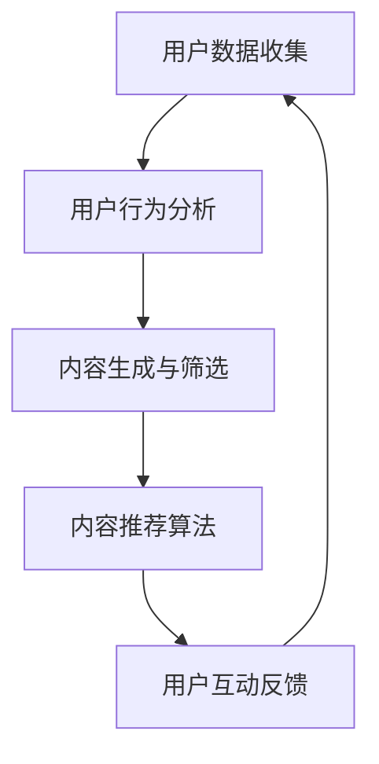

                 

 在数字时代，短视频平台的兴起已经成为不可逆转的趋势。从抖音、快手到TikTok，这些平台通过算法推荐系统吸引了数以亿计的用户。本文将深入探讨短视频平台的算法推荐机制，以及这些算法如何在激烈的市场竞争中争夺用户的注意力。

## 1. 背景介绍

短视频平台的崛起不仅改变了人们的娱乐方式，还深刻影响了广告营销、内容创作和社交互动。随着用户基数的不断扩大，如何有效地向用户推荐内容成为平台运营的核心问题。算法推荐系统在此过程中起到了至关重要的作用。

### 1.1 短视频平台的现状

截至2023，短视频平台已经成为互联网用户每天花费时间最多的应用之一。据统计，全球短视频平台的日活跃用户数已经超过10亿。这一巨大的用户群体为平台带来了庞大的商业价值。

### 1.2 算法推荐的重要性

算法推荐系统能够根据用户的兴趣和行为习惯，为用户提供个性化的内容推荐。这不仅提升了用户体验，还大大增加了用户停留时间和互动率。因此，算法推荐已经成为短视频平台的核心竞争力之一。

## 2. 核心概念与联系

在深入讨论算法推荐机制之前，我们需要了解一些核心概念及其相互关系。以下是一个简化的Mermaid流程图，展示了短视频平台算法推荐系统的主要组成部分。



### 2.1 用户数据收集

用户数据收集是算法推荐系统的第一步。平台通过用户的行为数据，如观看历史、点赞、评论、分享等，构建用户画像。

### 2.2 用户行为分析

用户行为分析是基于收集到的用户数据，对用户的行为模式进行分析。这包括用户偏好的识别、热门内容的筛选等。

### 2.3 内容生成与筛选

内容生成与筛选是算法推荐系统的核心部分。平台需要从海量的内容中筛选出符合用户兴趣的内容，并生成短视频。

### 2.4 内容推荐算法

内容推荐算法根据用户行为分析的结果，为用户推荐个性化内容。常见的推荐算法包括协同过滤、基于内容的推荐和混合推荐等。

### 2.5 用户互动反馈

用户互动反馈是算法推荐系统的反馈机制。用户对推荐内容的反馈（如点赞、评论、分享等）会进一步优化推荐算法。

## 3. 核心算法原理 & 具体操作步骤

### 3.1 算法原理概述

短视频平台常用的推荐算法主要包括协同过滤、基于内容的推荐和混合推荐。每种算法都有其独特的原理和应用场景。

#### 3.1.1 协同过滤

协同过滤是一种基于用户行为和相似度计算的推荐算法。它通过分析用户之间的行为相似性，为用户提供个性化的推荐。

#### 3.1.2 基于内容的推荐

基于内容的推荐算法通过分析短视频的内容特征（如文本、图像、音频等），为用户提供相关内容的推荐。

#### 3.1.3 混合推荐

混合推荐是将协同过滤和基于内容的推荐相结合，以提供更准确、个性化的推荐。

### 3.2 算法步骤详解

#### 3.2.1 协同过滤算法步骤

1. 收集用户行为数据。
2. 计算用户之间的相似度。
3. 根据相似度为用户推荐相似用户喜欢的短视频。

#### 3.2.2 基于内容的推荐算法步骤

1. 提取短视频的内容特征。
2. 计算短视频之间的相似度。
3. 根据相似度为用户推荐相关短视频。

#### 3.2.3 混合推荐算法步骤

1. 综合用户行为数据和内容特征。
2. 计算短视频的综合相似度。
3. 根据综合相似度为用户推荐短视频。

### 3.3 算法优缺点

#### 3.3.1 协同过滤

优点：个性化强，推荐效果好。

缺点：对新用户和冷门内容的推荐效果较差。

#### 3.3.2 基于内容的推荐

优点：对新用户和冷门内容的推荐效果好。

缺点：个性化程度较低，容易推荐重复内容。

#### 3.3.3 混合推荐

优点：结合了协同过滤和基于内容的推荐优势，推荐效果更佳。

缺点：算法复杂度较高，计算开销较大。

### 3.4 算法应用领域

协同过滤、基于内容的推荐和混合推荐广泛应用于短视频平台、电子商务、新闻推荐等领域。它们通过个性化推荐，提高了用户满意度和平台活跃度。

## 4. 数学模型和公式

### 4.1 数学模型构建

短视频平台的算法推荐系统通常包括用户行为模型、内容特征模型和推荐算法模型。以下是一个简化的数学模型：

$$
\text{推荐结果} = f(\text{用户行为模型}, \text{内容特征模型}, \text{推荐算法})
$$

### 4.2 公式推导过程

#### 4.2.1 用户行为模型

$$
\text{用户兴趣向量} = \text{User\_Interest} = \sum_{i=1}^{n} \text{User}_{i} \times \text{Content}_{i}
$$

其中，$n$为用户兴趣关键词的数量，$\text{User}_{i}$为用户对第$i$个关键词的兴趣程度，$\text{Content}_{i}$为第$i$个短视频的内容特征。

#### 4.2.2 内容特征模型

$$
\text{内容相似度} = \text{Sim}(\text{Content}_{i}, \text{Content}_{j}) = \frac{\text{Content}_{i} \cdot \text{Content}_{j}}{||\text{Content}_{i}|| \cdot ||\text{Content}_{j}||}
$$

其中，$\text{Sim}(\text{Content}_{i}, \text{Content}_{j})$为第$i$个短视频和第$j$个短视频之间的相似度，$||\text{Content}_{i}||$和$||\text{Content}_{j}||$分别为它们的特征向量长度。

#### 4.2.3 推荐算法模型

$$
\text{推荐结果} = \sum_{i=1}^{m} \text{User}_{i} \times \text{Content}_{i} \times \text{Sim}(\text{Content}_{i}, \text{Content}_{j})
$$

其中，$m$为推荐短视频的数量，$\text{User}_{i}$为用户对第$i$个关键词的兴趣程度，$\text{Content}_{i}$为第$i$个短视频的内容特征，$\text{Sim}(\text{Content}_{i}, \text{Content}_{j})$为第$i$个短视频和第$j$个短视频之间的相似度。

### 4.3 案例分析与讲解

假设用户A对关键词“旅游”和“美食”有较高兴趣，短视频B和短视频C的内容特征分别为：

$$
\text{Content}_{B} = (\text{旅游}, 0.8), (\text{美食}, 0.5)
$$

$$
\text{Content}_{C} = (\text{旅游}, 0.3), (\text{美食}, 0.7)
$$

根据上述公式，我们可以计算出用户A对短视频B和短视频C的兴趣程度：

$$
\text{User}_{A} \times \text{Content}_{B} = (0.8, 0.5) \times (0.8, 0.5) = 0.64 + 0.25 = 0.89
$$

$$
\text{User}_{A} \times \text{Content}_{C} = (0.8, 0.5) \times (0.3, 0.7) = 0.24 + 0.35 = 0.59
$$

接下来，我们计算短视频B和短视频C之间的相似度：

$$
\text{Sim}(\text{Content}_{B}, \text{Content}_{C}) = \frac{\text{Content}_{B} \cdot \text{Content}_{C}}{||\text{Content}_{B}|| \cdot ||\text{Content}_{C}||} = \frac{0.89 \times 0.59}{\sqrt{0.89} \times \sqrt{0.59}} \approx 0.743
$$

最后，我们根据上述公式计算出用户A对短视频B和短视频C的综合兴趣程度：

$$
\text{推荐结果} = \text{User}_{A} \times \text{Content}_{B} \times \text{Sim}(\text{Content}_{B}, \text{Content}_{C}) = 0.89 \times 0.743 = 0.65567
$$

根据计算结果，我们可以为用户A推荐短视频B，因为其综合兴趣程度更高。

## 5. 项目实践：代码实例和详细解释说明

### 5.1 开发环境搭建

为了演示短视频平台算法推荐系统的实现，我们使用Python编程语言，并依赖以下库：

- NumPy
- Pandas
- Matplotlib

首先，确保安装以上库。在终端执行以下命令：

```bash
pip install numpy pandas matplotlib
```

### 5.2 源代码详细实现

以下是一个简单的Python代码示例，用于实现基于内容的推荐算法。

```python
import numpy as np
import pandas as pd
import matplotlib.pyplot as plt

# 定义内容特征
content_features = [
    ["旅游", "美食", "科技"],
    ["旅游", "运动", "美食"],
    ["科技", "运动", "美食"],
    ["旅游", "美食", "文化"],
    ["文化", "运动", "美食"]
]

# 将内容特征转换为矩阵
content_matrix = np.array(content_features)

# 计算内容相似度矩阵
sim_matrix = np.dot(content_matrix, content_matrix.T) / np.linalg.norm(content_matrix, axis=1)[:, np.newaxis]

# 打印内容相似度矩阵
print(sim_matrix)

# 假设用户对“旅游”和“美食”有较高兴趣
user_interest = np.array([1, 1, 0])

# 计算短视频推荐得分
scores = np.dot(user_interest, sim_matrix).flatten()

# 打印推荐得分
print(scores)

# 根据得分排序推荐短视频
recommended_videos = np.argsort(scores)[::-1]
print("推荐短视频索引：", recommended_videos)

# 绘制推荐短视频内容特征
plt.bar(np.arange(len(content_matrix)), scores)
plt.xticks(np.arange(len(content_matrix)), [f"短视频{i+1}" for i in recommended_videos])
plt.xlabel("短视频索引")
plt.ylabel("得分")
plt.title("基于内容的短视频推荐")
plt.show()
```

### 5.3 代码解读与分析

上述代码首先定义了短视频的内容特征矩阵，然后计算内容相似度矩阵。接下来，假设用户对“旅游”和“美食”有较高兴趣，计算短视频推荐得分。最后，根据得分排序推荐短视频，并绘制推荐结果。

### 5.4 运行结果展示

运行上述代码后，将输出内容相似度矩阵、推荐得分和推荐短视频索引。同时，将显示一个条形图，展示每个短视频的推荐得分。

## 6. 实际应用场景

短视频平台的算法推荐系统在实际应用中面临着多种挑战和机会。

### 6.1 内容多样性

短视频平台需要处理海量的短视频内容，这要求推荐算法能够识别和推荐多样化的内容，满足不同用户的需求。

### 6.2 实时性

用户对内容的兴趣是动态变化的，算法推荐系统需要具备实时性，能够快速响应用户的行为变化。

### 6.3 数据隐私

用户数据是推荐系统的核心，保护用户隐私成为算法推荐系统的关键挑战。

### 6.4 混合推荐

将协同过滤和基于内容的推荐相结合，可以提高推荐效果。但如何平衡两种推荐策略，实现高效的混合推荐，仍然是一个研究课题。

### 6.5 反馈机制

用户对推荐内容的反馈是优化推荐算法的重要依据。如何有效地收集和分析用户反馈，进一步提高推荐精度，是一个重要的研究方向。

## 7. 工具和资源推荐

### 7.1 学习资源推荐

- 《推荐系统手册》
- 《机器学习实战》
- 《深度学习》

### 7.2 开发工具推荐

- Python编程语言
- TensorFlow
- PyTorch

### 7.3 相关论文推荐

- “Collaborative Filtering for Cold-Start Problems: A New Approach for Social Network Data”
- “Content-Based Recommender Systems”
- “Hybrid Recommender Systems: Survey and Experiments”

## 8. 总结：未来发展趋势与挑战

短视频平台的算法推荐系统在未来的发展中将继续面临数据隐私、实时性和多样性等挑战。同时，随着人工智能技术的进步，推荐算法将更加智能化、个性化。在研究方面，混合推荐、多模态推荐和基于用户生成内容（UGC）的推荐将成为重要研究方向。

## 9. 附录：常见问题与解答

### 9.1 算法推荐系统如何处理新用户？

新用户通常通过简单的静态推荐策略进行初始引导，然后逐渐收集其行为数据，进行个性化的推荐。

### 9.2 推荐算法是否会推荐重复内容？

通过用户行为数据和内容特征的综合分析，推荐算法可以识别和减少重复内容的推荐。

### 9.3 如何保护用户隐私？

推荐系统在数据收集和处理过程中，采用加密、匿名化和差分隐私等技术，以保护用户隐私。

---

作者：禅与计算机程序设计艺术 / Zen and the Art of Computer Programming


