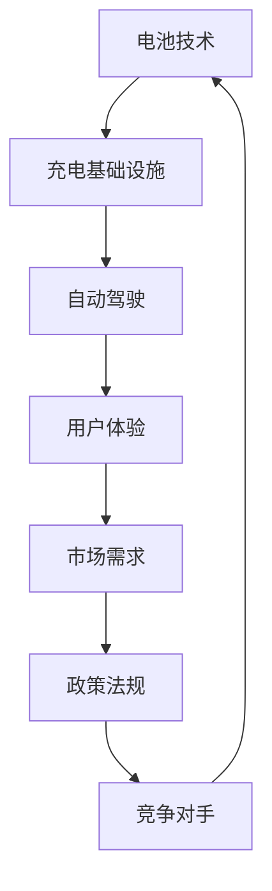

                 

关键词：硅谷，新能源汽车，电动汽车，生态系统，技术创新，市场竞争，充电基础设施，电池技术，自动驾驶，可持续发展，行业趋势。

## 摘要

本文探讨了硅谷新能源汽车市场的快速发展和激烈竞争。随着全球对可持续能源需求的增长，硅谷的电动汽车（EV）生态系统正迅速扩展，吸引了众多初创企业和传统汽车制造商加入。本文首先介绍了硅谷电动汽车市场的发展背景，随后详细分析了该市场的核心概念与联系，包括电池技术、充电基础设施、自动驾驶等。通过对比不同企业的战略和技术路线，本文探讨了硅谷电动汽车市场的竞争格局。最后，本文对未来电动汽车市场的发展趋势和挑战进行了展望，并推荐了相关学习和开发工具资源。

## 1. 背景介绍

硅谷，这个位于美国加利福尼亚州的世界级高科技中心，一直是全球技术创新和商业发展的风向标。随着全球对环境保护和可持续发展的重视，新能源汽车，特别是电动汽车（Electric Vehicle，简称EV），正成为硅谷关注的焦点。电动汽车不仅代表着未来的交通方式，也是能源转型和智能城市建设的核心组成部分。

### 1.1 电动汽车的发展历程

电动汽车的概念并非新鲜事物，其历史可以追溯到19世纪末。然而，真正的快速发展始于21世纪初，随着电池技术的突破、充电基础设施的完善和消费者对环保意识的提升，电动汽车逐渐走进了人们的日常生活。特斯拉（Tesla）的崛起无疑是这个过程中最具代表性的事件。自2008年首款Model S发布以来，特斯拉不仅改变了人们对电动汽车的看法，也推动了整个行业的快速发展。

### 1.2 硅谷电动汽车市场现状

硅谷电动汽车市场具有独特的特点。首先，硅谷拥有众多科技巨头和创新型企业，这些企业在电动汽车的技术研发、生产和销售方面具有强大的实力。其次，硅谷政府对新能源汽车的支持和投资力度较大，为电动汽车的发展提供了良好的政策环境。此外，硅谷消费者对新技术和高性能电动汽车的接受度较高，进一步推动了市场的增长。

### 1.3 市场增长趋势

根据市场研究机构的预测，全球电动汽车市场预计将在未来几年内持续高速增长。硅谷作为技术创新的前沿，无疑将在这一过程中扮演重要角色。预计到2025年，硅谷电动汽车的市场份额将显著提高，同时电动汽车将成为硅谷交通的重要组成部分。

## 2. 核心概念与联系

在探讨硅谷电动汽车市场的竞争格局之前，我们需要了解一些核心概念和它们之间的联系。以下是一个用Mermaid绘制的流程图，展示了这些核心概念和它们之间的关系：



### 2.1 电池技术

电池技术是电动汽车的核心组件之一。电池的性能直接影响到电动汽车的续航里程、充电速度和整体成本。硅谷在电池技术方面有着丰富的研发资源和技术积累，包括固态电池、锂硫电池等新型电池技术的研发。这些技术的突破有望进一步推动电动汽车的发展。

### 2.2 充电基础设施

充电基础设施的完善是电动汽车普及的关键。硅谷在充电桩的建设和布局方面处于领先地位，许多科技公司和创新型企业积极参与充电基础设施的建设。随着充电技术的进步和充电网络的扩展，电动汽车的充电便利性将大幅提升。

### 2.3 自动驾驶

自动驾驶技术是电动汽车发展的重要方向之一。硅谷在自动驾驶技术方面有着丰富的研发资源和实践经验，众多科技公司如特斯拉、Waymo等都在这一领域进行深入研究。自动驾驶技术的成熟将使电动汽车更加智能化和安全化。

### 2.4 用户体验

用户体验是电动汽车市场竞争的关键因素。硅谷企业在设计、性能和用户体验方面具有优势，通过不断提升车辆的舒适性和智能化水平，满足消费者对高品质电动汽车的需求。

### 2.5 市场需求

市场需求是驱动电动汽车市场发展的核心动力。硅谷消费者对新技术和高性能电动汽车的接受度较高，这一市场需求为硅谷电动汽车市场的发展提供了重要支撑。

### 2.6 政策法规

政策法规对电动汽车市场的发展具有重要影响。硅谷政府出台了一系列支持新能源汽车的政策，如税收优惠、补贴等，这些政策有助于降低电动汽车的购买和使用成本，进一步推动市场的发展。

### 2.7 竞争对手

硅谷电动汽车市场竞争激烈，特斯拉、蔚来、理想等企业在市场中占据重要地位。这些企业通过不同的战略和技术路线，争夺市场份额。特斯拉在电动汽车市场上拥有较高的品牌影响力和技术优势，蔚来和理想则在智能化和用户体验方面具有竞争力。

## 3. 核心算法原理 & 具体操作步骤

在电动汽车的发展过程中，核心算法起着至关重要的作用。以下是对电动汽车核心算法原理和具体操作步骤的详细分析：

### 3.1 算法原理概述

电动汽车的核心算法主要包括电池管理系统（Battery Management System，简称BMS）、动力系统控制算法和自动驾驶算法。这些算法共同作用，确保电动汽车的性能、安全性和用户体验。

### 3.2 算法步骤详解

#### 3.2.1 电池管理系统（BMS）

电池管理系统是电动汽车的核心组件之一，负责监测和控制系统中的电池状态。BMS的主要功能包括：

1. **电池状态监测**：监测电池的电压、电流、温度等参数，确保电池在安全范围内运行。
2. **电池状态评估**：通过数据分析，评估电池的健康状况，预测电池的使用寿命。
3. **充电管理**：控制电池的充电过程，确保充电安全和效率。
4. **放电管理**：控制电池的放电过程，优化电池的能量输出。

#### 3.2.2 动力系统控制算法

动力系统控制算法负责控制电动汽车的动力输出，确保车辆在最佳状态下运行。主要步骤包括：

1. **动力匹配**：根据车辆的速度和负载，调整电动机的输出功率。
2. **扭矩控制**：通过控制电动机的扭矩，实现车辆的加速和减速。
3. **能量管理**：优化电池的能量使用，确保车辆在续航里程和性能之间取得平衡。
4. **故障诊断**：监测动力系统的工作状态，及时发现并诊断故障。

#### 3.2.3 自动驾驶算法

自动驾驶算法是电动汽车智能化的重要组成部分，主要功能包括：

1. **感知环境**：通过传感器获取周围环境信息，如道路、车辆、行人等。
2. **路径规划**：根据环境信息，规划车辆的行驶路径。
3. **控制执行**：根据路径规划，控制车辆的转向、加速和制动。
4. **安全监测**：监测车辆的行驶状态，确保车辆在安全范围内运行。

### 3.3 算法优缺点

每种算法都有其优缺点：

- **电池管理系统（BMS）**：优点是能够确保电池的安全性和可靠性，缺点是实时性要求较高，对计算资源的需求较大。
- **动力系统控制算法**：优点是能够优化车辆的动力输出，提高续航里程，缺点是复杂度高，对传感器依赖性强。
- **自动驾驶算法**：优点是能够实现车辆的自动驾驶，提高行驶安全性，缺点是算法复杂，对环境信息的准确性要求高。

### 3.4 算法应用领域

这些算法在电动汽车的各个领域都有广泛的应用：

- **电池管理系统（BMS）**：广泛应用于电动汽车的电池监测和管理。
- **动力系统控制算法**：广泛应用于电动汽车的动力控制和能量管理。
- **自动驾驶算法**：广泛应用于自动驾驶汽车，包括电动汽车和传统汽车。

## 4. 数学模型和公式 & 详细讲解 & 举例说明

在电动汽车的核心算法中，数学模型和公式起着至关重要的作用。以下是对数学模型和公式的详细讲解和举例说明。

### 4.1 数学模型构建

电动汽车的数学模型主要包括电池模型、电动机模型和自动驾驶模型。以下是一个简单的电池模型：

$$
V(t) = V_{max} \cdot (1 - e^{-\frac{t}{\tau}})
$$

其中，$V(t)$ 是电池在时间 $t$ 的电压，$V_{max}$ 是电池的最大电压，$\tau$ 是电池的放电时间常数。

### 4.2 公式推导过程

电池模型的推导基于电池的放电过程。假设电池的放电过程是一个一阶系统，其电压随时间的变化可以用指数函数表示。通过实验数据，可以确定电池的最大电压 $V_{max}$ 和放电时间常数 $\tau$。

### 4.3 案例分析与讲解

以下是一个关于电动机模型的案例：

$$
T = K_t \cdot I
$$

其中，$T$ 是电动机的扭矩，$K_t$ 是电动机的扭矩常数，$I$ 是电动机的电流。

这个公式表明，电动机的扭矩与其电流成正比。通过测量电动机的扭矩常数 $K_t$，可以计算出电动机在不同电流下的扭矩。

### 4.4 电动汽车续航里程的计算

电动汽车的续航里程是消费者关心的重要指标。以下是一个简单的续航里程计算公式：

$$
E = C \cdot I \cdot \eta
$$

其中，$E$ 是续航里程（单位：公里），$C$ 是电池容量（单位：千瓦时），$I$ 是平均电流（单位：安培），$\eta$ 是能量转换效率。

通过这个公式，可以计算出电动汽车在不同使用条件下的续航里程。

## 5. 项目实践：代码实例和详细解释说明

为了更好地理解电动汽车的核心算法和数学模型，以下是一个简单的代码实例，展示了如何使用Python实现电池管理系统的基本功能。

### 5.1 开发环境搭建

在开始编写代码之前，我们需要搭建一个Python开发环境。以下是所需的步骤：

1. 安装Python（版本3.8及以上）
2. 安装必要的Python库，如NumPy、Matplotlib等

### 5.2 源代码详细实现

以下是一个简单的电池管理系统Python代码实例：

```python
import numpy as np
import matplotlib.pyplot as plt

# 电池模型参数
V_max = 400  # 最大电压（伏特）
tau = 3600   # 放电时间常数（秒）

# 初始化电池电压
V = np.zeros((1000, 1))  # 1000秒内的电压数据

# 电池放电过程
for t in range(1000):
    V[t] = V_max * (1 - np.exp(-t / tau))

# 绘制电池电压随时间变化的图像
plt.plot(V)
plt.xlabel('Time (s)')
plt.ylabel('Voltage (V)')
plt.title('Battery Voltage Over Time')
plt.show()
```

### 5.3 代码解读与分析

这个代码实例实现了电池的放电过程，并绘制了电池电压随时间变化的图像。具体步骤如下：

1. 导入必要的Python库。
2. 设置电池模型参数，如最大电压和放电时间常数。
3. 初始化电池电压数组。
4. 循环计算电池在不同时间点的电压，使用指数衰减函数。
5. 使用Matplotlib库绘制电池电压随时间变化的图像。

通过这个实例，我们可以直观地看到电池电压随时间的变化，从而更好地理解电池的工作原理。

### 5.4 运行结果展示

运行上述代码后，我们将看到一个电池电压随时间变化的图像。这个图像显示，电池电压随着放电时间的增加而逐渐下降，符合指数衰减函数的预期。

## 6. 实际应用场景

电动汽车的普及和推广需要考虑多个实际应用场景，包括城市交通、长途运输、共享出行等。以下是对这些应用场景的详细分析：

### 6.1 城市交通

在城市交通中，电动汽车因其零排放、低噪音和高效运行等优点，成为解决交通拥堵和环境污染问题的有效手段。硅谷城市交通繁忙，对电动汽车的需求日益增长。特斯拉、蔚来等企业在城市交通领域的电动汽车产品已经取得了一定的市场份额。

### 6.2 长途运输

长途运输领域对电动汽车的需求也在逐渐增加。由于电动汽车的续航里程不断提高，越来越多的物流公司和货运企业开始考虑使用电动汽车作为运输工具。硅谷的初创企业如Rivian和Lucid等，正致力于研发适用于长途运输的电动汽车。

### 6.3 共享出行

共享出行是电动汽车应用的另一个重要领域。共享出行平台如Lyft、Uber等已经开始推广电动汽车，以减少碳排放和提高能源效率。硅谷的共享出行企业如Waymo和Cruise等，也在积极研发自动驾驶电动汽车，以提供更便捷、更智能的共享出行服务。

### 6.4 未来应用展望

随着技术的不断进步和市场的逐渐成熟，电动汽车的应用场景将进一步扩大。未来，电动汽车有望在更多的领域得到应用，如无人机配送、智能城市建设等。此外，随着充电基础设施的完善和电池技术的突破，电动汽车的续航里程和充电速度将得到显著提升，为更广泛的应用提供支持。

## 7. 工具和资源推荐

为了更好地学习和开发电动汽车相关技术，以下是一些建议的工具和资源：

### 7.1 学习资源推荐

1. **《电动汽车技术基础》**：一本全面介绍电动汽车技术的基础书籍，适合初学者。
2. **在线课程**：如Coursera、Udacity等平台上的电动汽车相关课程。
3. **专业网站**：如Electrek、Green Car Reports等，提供最新的电动汽车新闻和技术动态。

### 7.2 开发工具推荐

1. **MATLAB**：一款强大的数学建模和仿真工具，适用于电动汽车的研发。
2. **Python**：适用于数据分析和算法开发，众多电动汽车相关库，如PyTorch、TensorFlow等。
3. **Eagle**：一款电路设计和PCB布局工具，适用于电动汽车电子系统的设计。

### 7.3 相关论文推荐

1. **“Solid-State Batteries: A New Paradigm for Electrified Transportation”**：一篇关于固态电池的综述论文，介绍了固态电池在电动汽车领域的应用前景。
2. **“Modeling and Control of Electric Vehicle Battery Systems”**：一篇关于电动汽车电池管理系统建模和控制的论文，提供了详细的算法原理和实现步骤。
3. **“Autonomous Driving with Deep Learning”**：一篇关于自动驾驶技术的论文，介绍了深度学习在自动驾驶中的应用。

## 8. 总结：未来发展趋势与挑战

### 8.1 研究成果总结

电动汽车技术的发展取得了显著成果，特别是在电池技术、充电基础设施、自动驾驶等领域。固态电池、锂硫电池等新型电池技术的研发为电动汽车提供了更长的续航里程和更快的充电速度。充电基础设施的完善和自动驾驶技术的进步，进一步提升了电动汽车的实用性和用户体验。

### 8.2 未来发展趋势

未来，电动汽车市场将继续保持快速增长，预计将在全球范围内普及。随着技术的不断进步和市场的逐渐成熟，电动汽车的应用场景将进一步扩大，从城市交通、长途运输到共享出行等领域。此外，电动汽车与智能城市的结合，也将为未来城市发展提供新的思路和方向。

### 8.3 面临的挑战

尽管电动汽车技术取得了显著成果，但仍然面临一些挑战。首先，电池成本和充电基础设施的建设仍是制约电动汽车普及的主要因素。其次，自动驾驶技术虽然取得了很大进展，但完全自动驾驶的实现仍需解决许多技术难题。此外，电动汽车在安全性、可靠性等方面也需进一步提高。

### 8.4 研究展望

未来，电动汽车技术的发展将朝着更加高效、智能、环保的方向发展。在电池技术方面，研发更高能量密度、更低成本的新型电池材料将是一个重要方向。在充电基础设施方面，建立更高效、更便捷的充电网络，提高充电速度和安全性将是关键。在自动驾驶技术方面，通过深度学习和人工智能技术，进一步提升自动驾驶的准确性和安全性。此外，电动汽车与智能城市、智能交通的深度融合，也将为未来城市发展提供新的解决方案。

## 9. 附录：常见问题与解答

### 9.1 电动汽车续航里程如何计算？

电动汽车的续航里程通常由以下公式计算：

$$
E = C \cdot I \cdot \eta
$$

其中，$E$ 是续航里程（公里），$C$ 是电池容量（千瓦时），$I$ 是平均电流（安培），$\eta$ 是能量转换效率。

### 9.2 电池管理系统（BMS）的作用是什么？

电池管理系统（BMS）是电动汽车的核心组件之一，其主要作用包括：

1. **电池状态监测**：监测电池的电压、电流、温度等参数，确保电池在安全范围内运行。
2. **电池状态评估**：评估电池的健康状况，预测电池的使用寿命。
3. **充电管理**：控制电池的充电过程，确保充电安全和效率。
4. **放电管理**：控制电池的放电过程，优化电池的能量输出。

### 9.3 自动驾驶技术的主要挑战有哪些？

自动驾驶技术的主要挑战包括：

1. **环境感知**：需要准确感知周围环境，包括道路、车辆、行人等。
2. **路径规划**：需要根据环境信息规划车辆的行驶路径。
3. **控制执行**：需要实现车辆的转向、加速和制动。
4. **安全性**：需要确保车辆在自动驾驶过程中的安全性。

### 9.4 电动汽车的充电基础设施包括哪些内容？

电动汽车的充电基础设施包括：

1. **充电桩**：用于为电动汽车提供电能的设备。
2. **充电站**：多个充电桩组成的充电设施。
3. **充电网络**：包括充电桩和充电站在内的充电设施网络。
4. **充电协议**：用于充电过程中通信和控制的标准协议。

---

作者：禅与计算机程序设计艺术 / Zen and the Art of Computer Programming
------------------------------------------------------------------------

