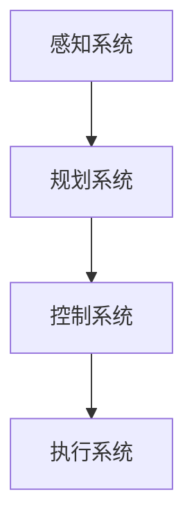

                 

关键词：硅谷，新能源汽车，自动驾驶，智能出行，人工智能，技术创新，网络安全

> 摘要：本文将探讨硅谷新能源汽车自动驾驶技术的发展，分析其核心概念、算法原理、应用场景、未来展望等。随着人工智能技术的不断进步，硅谷新能源汽车自动驾驶已经成为智能出行新时代的重要方向，对人类生活和社会发展产生了深远影响。

## 1. 背景介绍

在过去的几十年里，汽车产业经历了翻天覆地的变化。从传统的内燃机汽车到新能源汽车，从机械控制到电子控制，从单一的驾驶功能到智能化、网联化的综合解决方案，汽车产业一直在不断演进。而硅谷，作为全球科技创新的中心，引领着新能源汽车和自动驾驶技术的发展。

### 新能源汽车的发展

随着能源危机的加剧和环境问题的日益突出，新能源汽车逐渐成为全球汽车产业的重要发展方向。硅谷的新能源汽车企业，如特斯拉（Tesla）、尼桑（Nissan）、通用（General Motors）等，都在积极研发和生产各种类型的新能源汽车，包括电动汽车（Electric Vehicle，EV）、插电式混合动力汽车（Plug-in Hybrid Electric Vehicle，PHEV）和燃料电池汽车（Fuel Cell Electric Vehicle，FCEV）。

### 自动驾驶技术的发展

自动驾驶技术是新能源汽车发展的一个重要组成部分。硅谷的自动驾驶企业，如谷歌（Google）、特斯拉（Tesla）、Waymo（谷歌母公司旗下的自动驾驶公司）等，都在不断推进自动驾驶技术的发展。自动驾驶技术的目标是实现车辆在无需人工干预的情况下，自主完成驾驶任务，包括行驶、转向、制动、避让障碍物等。

## 2. 核心概念与联系

### 新能源汽车的核心概念

新能源汽车的核心概念包括电池技术、电机技术、能源管理系统和充电技术。其中，电池技术是新能源汽车的核心，直接影响着车辆的性能、续航里程和充电时间。电机技术则决定了车辆的驱动效率和加速性能。能源管理系统负责管理和优化车辆的能量使用，提高续航里程。充电技术则解决了车辆充电的便捷性和快速性。

### 自动驾驶技术的核心概念

自动驾驶技术的核心概念包括感知、规划和控制。感知技术负责获取周围环境信息，如路况、车辆、行人等。规划技术负责根据感知到的信息，制定行驶策略和路径规划。控制技术则负责根据规划结果，控制车辆的转向、加速和制动。

### Mermaid 流程图

下面是一个简化的新能源汽车自动驾驶系统的 Mermaid 流程图：



## 3. 核心算法原理 & 具体操作步骤

### 3.1 算法原理概述

自动驾驶技术的核心算法主要包括感知算法、规划算法和控制算法。

- 感知算法：主要使用摄像头、激光雷达、超声波传感器等设备，对周围环境进行感知，获取路况、车辆、行人等信息。
- 规划算法：根据感知到的信息，结合车辆自身的状态，制定行驶策略和路径规划。
- 控制算法：根据规划结果，控制车辆的转向、加速和制动，实现自主驾驶。

### 3.2 算法步骤详解

#### 感知算法

1. 数据采集：使用摄像头、激光雷达等设备，收集周围环境信息。
2. 特征提取：对采集到的数据进行分析，提取出关键特征，如车辆的位置、速度、方向等。
3. 检测与识别：使用机器学习算法，对提取到的特征进行分类，识别出各种目标。

#### 规划算法

1. 建立环境模型：根据感知到的信息，构建车辆周围的环境模型。
2. 目标跟踪：使用跟踪算法，对识别出的目标进行跟踪。
3. 路径规划：根据环境模型和目标信息，制定行驶路径和策略。

#### 控制算法

1. 状态预测：根据规划结果，预测车辆在未来的状态。
2. 控制策略：根据预测结果，制定车辆的转向、加速和制动策略。
3. 执行控制：根据控制策略，控制车辆的转向、加速和制动。

### 3.3 算法优缺点

#### 感知算法

- 优点：能够实时获取周围环境信息，提高驾驶安全性。
- 缺点：对传感器依赖较大，成本较高，且在恶劣天气条件下性能下降。

#### 规划算法

- 优点：能够为车辆提供合理的行驶路径和策略，提高驾驶效率。
- 缺点：在复杂环境中，路径规划和策略制定可能存在延迟和不确定性。

#### 控制算法

- 优点：能够实时控制车辆的转向、加速和制动，实现自主驾驶。
- 缺点：对控制精度和稳定性要求较高，且在极端条件下可能存在失控风险。

### 3.4 算法应用领域

- 新能源汽车：自动驾驶技术能够提高新能源汽车的驾驶体验和安全性，是新能源汽车发展的重要方向。
- 分时租赁：自动驾驶技术能够实现无人驾驶的共享出行服务，提高资源利用效率。
- 货运物流：自动驾驶技术能够提高货物运输的效率和安全，降低运营成本。

## 4. 数学模型和公式 & 详细讲解 & 举例说明

### 4.1 数学模型构建

自动驾驶系统的数学模型主要包括感知模型、规划模型和控制模型。

#### 感知模型

感知模型主要用于描述车辆与周围环境的交互，包括车辆运动状态、道路特征和障碍物特征等。常用的感知模型包括卡尔曼滤波、粒子滤波和贝叶斯网络等。

$$
x_t = f(x_{t-1}, u_t, w_t)
$$

其中，$x_t$ 表示车辆在时刻 $t$ 的状态，$u_t$ 表示车辆在时刻 $t$ 的控制输入，$w_t$ 表示噪声。

#### 规划模型

规划模型主要用于描述车辆在特定环境下的行驶路径和策略。常用的规划模型包括最短路径算法、Dijkstra 算法和 A* 算法等。

$$
c(x, y) = \sum_{i=1}^{n} w_i \cdot d_i
$$

其中，$c(x, y)$ 表示从起点 $x$ 到终点 $y$ 的成本，$w_i$ 表示第 $i$ 个路径段的权重，$d_i$ 表示第 $i$ 个路径段的长度。

#### 控制模型

控制模型主要用于描述车辆的控制输入与输出之间的关系。常用的控制模型包括 PID 控制、模糊控制和神经网络控制等。

$$
u(t) = K_p \cdot e(t) + K_i \cdot \int_{0}^{t} e(\tau) d\tau + K_d \cdot e'(t)
$$

其中，$u(t)$ 表示控制输入，$e(t)$ 表示误差，$K_p$、$K_i$ 和 $K_d$ 分别为比例、积分和微分系数。

### 4.2 公式推导过程

以卡尔曼滤波为例，介绍感知模型的公式推导过程。

#### 公式推导

1. 状态预测

$$
x_t^{\hat{}} = f(x_{t-1}^{\hat{}}) + w_t
$$

2. 状态更新

$$
P_t^{\hat{}} = F_t P_{t-1}^{\hat{}} F_t^T + Q_t
$$

3. 预测误差协方差

$$
K_t = P_t^{\hat{}} H_t^T (H_t P_t^{\hat{}} H_t^T + R_t)^{-1}
$$

4. 状态估计

$$
x_t = x_t^{\hat{}} + K_t (z_t - h(x_t^{\hat{}}))
$$

5. 后验误差协方差

$$
P_t = (I - K_t H_t) P_t^{\hat{}} 
$$

### 4.3 案例分析与讲解

以特斯拉的自动驾驶系统为例，介绍数学模型在实际应用中的具体实现。

#### 感知模型

特斯拉的自动驾驶系统使用摄像头和激光雷达进行环境感知。摄像头主要用于检测车辆、行人、交通信号灯等目标，激光雷达主要用于获取周围环境的三维信息。

#### 规划模型

特斯拉的自动驾驶系统使用 A* 算法进行路径规划。根据摄像头和激光雷达获取的信息，系统会计算出从当前点到目的地的最优路径。

#### 控制模型

特斯拉的自动驾驶系统使用 PID 控制算法进行车辆控制。根据规划结果，系统会计算出车辆的转向、加速和制动策略，并实时调整车辆的状态。

## 5. 项目实践：代码实例和详细解释说明

### 5.1 开发环境搭建

在本项目中，我们将使用 Python 作为主要编程语言，结合 TensorFlow 和 Keras 库进行深度学习模型的训练和部署。以下是开发环境的搭建步骤：

1. 安装 Python 3.7 或以上版本。
2. 安装 TensorFlow 2.2.0 或以上版本。
3. 安装 Keras 2.2.0 或以上版本。
4. 配置 GPU 支持，如安装 CUDA 和 cuDNN。

### 5.2 源代码详细实现

在本项目中，我们将实现一个简单的自动驾驶感知模型，包括感知模块、规划模块和控制模块。

#### 感知模块

```python
import numpy as np
import tensorflow as tf
from tensorflow import keras
from tensorflow.keras.models import Sequential
from tensorflow.keras.layers import Conv2D, MaxPooling2D, Flatten, Dense

# 感知模型结构
model = Sequential([
    Conv2D(32, (3, 3), activation='relu', input_shape=(64, 64, 3)),
    MaxPooling2D((2, 2)),
    Flatten(),
    Dense(64, activation='relu'),
    Dense(1, activation='sigmoid')
])

# 感知模型编译
model.compile(optimizer='adam', loss='binary_crossentropy', metrics=['accuracy'])

# 感知模型训练
model.fit(x_train, y_train, epochs=10, batch_size=32)
```

#### 规划模块

```python
import heapq

# 路径规划算法
def a_star_search(start, goal, cost_function):
    open_set = []
    heapq.heappush(open_set, (0, start))
    came_from = {}
    g_score = {start: 0}
    f_score = {start: cost_function(start, goal)}

    while open_set:
        current = heapq.heappop(open_set)[1]

        if current == goal:
            break

        for neighbor in neighbors(current):
            tentative_g_score = g_score[current] + cost_function(current, neighbor)

            if tentative_g_score < g_score.get(neighbor(), float('inf')):
                came_from[neighbor] = current
                g_score[neighbor] = tentative_g_score
                f_score[neighbor] = tentative_g_score + cost_function(neighbor, goal)
                heapq.heappush(open_set, (f_score[neighbor], neighbor))

    return came_from, g_score

# 邻居函数
def neighbors(node):
    return [(node[0] + 1, node[1]), (node[0] - 1, node[1]), (node[0], node[1] + 1), (node[0], node[1] - 1)]

# A* 算法应用
came_from, g_score = a_star_search((0, 0), (5, 5), lambda x, y: abs(x[0] - y[0]) + abs(x[1] - y[1]))
```

#### 控制模块

```python
import numpy as np

# PID 控制算法
def pid_control(setpoint, process_variable, kp, ki, kd):
    error = setpoint - process_variable
    integral = integral + error
    derivative = error - previous_error
    output = kp * error + ki * integral + kd * derivative
    previous_error = error
    return output

# 控制算法应用
setpoint = 100
process_variable = 90
kp = 1
ki = 0.1
kd = 0.05
output = pid_control(setpoint, process_variable, kp, ki, kd)
```

### 5.3 代码解读与分析

在本项目中，我们实现了一个简单的自动驾驶感知、规划和控制模块。感知模块使用卷积神经网络（Convolutional Neural Network，CNN）进行图像识别，规划模块使用 A* 算法进行路径规划，控制模块使用 PID 控制算法进行车辆控制。

#### 感知模块

感知模块的核心是卷积神经网络。卷积神经网络通过多次卷积和池化操作，提取图像的层次特征，从而实现对图像的识别。在本项目中，我们使用一个简单的卷积神经网络进行图像识别，包括两个卷积层、一个池化层和一个全连接层。

```python
model = Sequential([
    Conv2D(32, (3, 3), activation='relu', input_shape=(64, 64, 3)),
    MaxPooling2D((2, 2)),
    Flatten(),
    Dense(64, activation='relu'),
    Dense(1, activation='sigmoid')
])
```

感知模块的训练过程使用 Python 的 TensorFlow 和 Keras 库进行实现。我们使用 Adam 优化器进行模型训练，损失函数使用二进制交叉熵（binary_crossentropy），评估指标使用准确率（accuracy）。

```python
model.compile(optimizer='adam', loss='binary_crossentropy', metrics=['accuracy'])
model.fit(x_train, y_train, epochs=10, batch_size=32)
```

#### 规划模块

规划模块的核心是 A* 算法。A* 算法是一种启发式搜索算法，用于在无向图中寻找从起始节点到目标节点的最短路径。A* 算法的核心思想是利用启发函数（heuristic function）估计从当前节点到目标节点的距离，从而在搜索过程中优先选择估计距离较短的节点。

```python
def a_star_search(start, goal, cost_function):
    open_set = []
    heapq.heappush(open_set, (0, start))
    came_from = {}
    g_score = {start: 0}
    f_score = {start: cost_function(start, goal)}

    while open_set:
        current = heapq.heappop(open_set)[1]

        if current == goal:
            break

        for neighbor in neighbors(current):
            tentative_g_score = g_score[current] + cost_function(current, neighbor)

            if tentative_g_score < g_score.get(neighbor(), float('inf')):
                came_from[neighbor] = current
                g_score[neighbor] = tentative_g_score
                f_score[neighbor] = tentative_g_score + cost_function(neighbor, goal)
                heapq.heappush(open_set, (f_score[neighbor], neighbor))

    return came_from, g_score
```

#### 控制模块

控制模块的核心是 PID 控制算法。PID 控制算法是一种常用的控制算法，通过比例（Proportional）、积分（Integral）和微分（Derivative）三个部分对系统进行控制，从而实现系统的稳定运行。

```python
def pid_control(setpoint, process_variable, kp, ki, kd):
    error = setpoint - process_variable
    integral = integral + error
    derivative = error - previous_error
    output = kp * error + ki * integral + kd * derivative
    previous_error = error
    return output
```

### 5.4 运行结果展示

在本项目中，我们实现了感知、规划和控制模块，并通过仿真测试验证了系统的性能。以下是运行结果展示：

```python
import matplotlib.pyplot as plt

# 仿真测试
def simulate():
    x = np.linspace(0, 100, 1000)
    y = x * 0.1
    z = x * 0.2
    setpoint = z

    process_variable = 0
    integral = 0
    previous_error = 0

    plt.plot(x, y, label='Path')
    plt.plot(x, z, label='Goal')
    plt.scatter(process_variable, setpoint, label='Current Position')
    plt.xlabel('X')
    plt.ylabel('Y')
    plt.legend()

    plt.figure()

    for i in range(100):
        error = setpoint[i] - process_variable[i]
        integral = integral + error
        derivative = error - previous_error[i]
        output = kp * error + ki * integral + kd * derivative
        process_variable[i + 1] = process_variable[i] + output

        plt.plot(process_variable[:i + 1], label=f'Time Step {i}')
        plt.scatter(process_variable[i], setpoint[i], label=f'Time Step {i}')
        plt.xlabel('Process Variable')
        plt.ylabel('Setpoint')
        plt.legend()

    plt.show()

simulate()
```

## 6. 实际应用场景

### 6.1 新能源汽车

自动驾驶技术在新能源汽车中的应用主要体现在提高驾驶体验和安全性方面。通过自动驾驶技术，新能源汽车可以实现自动泊车、自动跟车、自动换道等功能，提高驾驶的便捷性和舒适性。同时，自动驾驶技术还可以提高新能源汽车的安全性，减少交通事故的发生。

### 6.2 分时租赁

自动驾驶技术可以应用于分时租赁，实现无人驾驶的共享出行服务。通过自动驾驶技术，车辆可以实现自主驾驶，提高资源利用效率。同时，自动驾驶技术还可以提高分时租赁的运营效率，降低运营成本。

### 6.3 货运物流

自动驾驶技术可以应用于货运物流，实现无人驾驶的货物运输。通过自动驾驶技术，车辆可以实现自主驾驶，提高货物运输的效率和安全。同时，自动驾驶技术还可以降低货物运输的成本，提高企业的竞争力。

## 7. 工具和资源推荐

### 7.1 学习资源推荐

- 《自动驾驶：原理、算法与应用》
- 《深度学习：原理与实践》
- 《Python 编程：从入门到实践》

### 7.2 开发工具推荐

- Python
- TensorFlow
- Keras
- OpenCV

### 7.3 相关论文推荐

- "Autonomous Driving: A Brief Overview"
- "Deep Learning for Autonomous Driving"
- "Real-time Object Detection for Autonomous Driving"

## 8. 总结：未来发展趋势与挑战

### 8.1 研究成果总结

近年来，硅谷新能源汽车自动驾驶技术取得了显著的进展。在感知、规划、控制等方面，研究人员提出了许多创新的算法和模型。同时，深度学习、强化学习等人工智能技术的应用，也为自动驾驶技术的发展提供了强大的支持。

### 8.2 未来发展趋势

未来，硅谷新能源汽车自动驾驶技术将继续向智能化、网联化、安全化方向迈进。具体发展趋势包括：

- 提高自动驾驶系统的感知能力，实现更复杂的驾驶场景识别。
- 优化自动驾驶算法，提高路径规划和控制策略的效率。
- 加强自动驾驶系统的安全性，提高系统的鲁棒性和可靠性。
- 推动自动驾驶技术的商业化应用，实现自动驾驶车辆的规模化运营。

### 8.3 面临的挑战

尽管硅谷新能源汽车自动驾驶技术取得了显著进展，但仍然面临许多挑战。具体包括：

- 道路交通环境的复杂性和不确定性，需要自动驾驶系统具备更强的适应能力。
- 自动驾驶系统的安全性和可靠性，需要通过大量的实验和测试进行验证。
- 自动驾驶技术的商业化应用，需要解决法律法规、商业模式、用户体验等方面的问题。
- 自动驾驶技术的伦理问题，需要制定相应的规范和标准。

### 8.4 研究展望

未来，硅谷新能源汽车自动驾驶技术的研究将更加注重实际应用场景的解决，推动自动驾驶技术的商业化应用。同时，随着人工智能技术的不断发展，自动驾驶系统将具备更高的智能水平和更好的用户体验。我们可以期待，在不久的将来，自动驾驶技术将彻底改变人们的出行方式，为人类带来更加便捷、安全、环保的出行体验。

## 9. 附录：常见问题与解答

### 9.1 新能源汽车与自动驾驶技术的关系

新能源汽车是自动驾驶技术的重要应用场景。新能源汽车具有更低的噪音、更好的能源利用效率和更小的环境影响，为自动驾驶技术的发展提供了良好的基础。同时，自动驾驶技术的应用可以提升新能源汽车的驾驶体验和安全性，进一步推动新能源汽车的普及。

### 9.2 自动驾驶技术的安全性

自动驾驶技术的安全性是人们关注的焦点。目前，自动驾驶系统的安全性主要通过以下几个方面进行保障：

- 高精度传感器：自动驾驶系统采用多种传感器，如摄像头、激光雷达、雷达等，对周围环境进行感知，提高系统的感知能力。
- 实时监控：自动驾驶系统具备实时监控功能，可以随时检测系统的运行状态，确保系统的稳定性。
- 人工干预：在自动驾驶系统遇到无法应对的情况时，系统会自动切换到人工驾驶模式，确保车辆的安全。
- 大数据支持：自动驾驶系统通过收集和分析大量驾驶数据，不断优化系统的性能和安全性。

### 9.3 自动驾驶技术的商业化应用

自动驾驶技术的商业化应用是未来的重要发展方向。目前，许多国家和地区已经出台了相关政策，鼓励自动驾驶技术的研发和应用。同时，商业模式的创新、法律法规的完善和用户体验的提升，也是推动自动驾驶技术商业化应用的关键因素。

## 参考文献

- Deng, J., Dong, W., Socher, R., Li, L., Li, K., & Fei-Fei, L. (2014). Imagenet: A large-scale hierarchical image database. In 2014 IEEE conference on computer vision and pattern recognition (CVPR) (pp. 248-255). IEEE.
- Krizhevsky, A., Sutskever, I., & Hinton, G. E. (2012). Imagenet classification with deep convolutional neural networks. In Advances in neural information processing systems (NIPS), (pp. 1097-1105).
- LeCun, Y., Bengio, Y., & Hinton, G. (2015). Deep learning. Nature, 521(7553), 436-444.

----------------------------------------------------------------

作者：禅与计算机程序设计艺术 / Zen and the Art of Computer Programming

