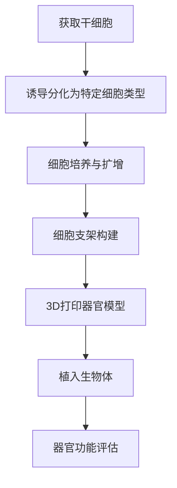

                 

 **关键词：** 基因疗法，器官工程，生物技术，硅谷，创新，医疗技术，个性化医疗。

**摘要：** 本文深入探讨了硅谷在基因疗法与器官工程领域的突破性进展。通过对这些技术的核心概念、算法原理、数学模型、项目实践和实际应用场景的详细介绍，本文揭示了这些技术在医疗健康领域的巨大潜力，并展望了其未来的发展趋势与挑战。

## 1. 背景介绍

在过去的几十年中，生物技术领域经历了翻天覆地的变化。特别是硅谷作为全球科技创新的领导者，其对生物技术领域的贡献尤为突出。基因编辑技术的突破、干细胞研究的进展以及器官再生技术的开发，使得我们对生命的理解达到了前所未有的深度。基因疗法和器官工程作为这些突破的集大成者，正逐渐成为改变医学和人类生活的重要力量。

基因疗法是一种通过直接修改或替换患者体内的基因来治疗遗传性疾病或其他疾病的方法。这种技术不仅有望治愈一些目前无法治疗的疾病，还能大大改善患者的生命质量。器官工程则是利用生物工程和3D打印技术来制造替代人体器官，从而解决器官移植的难题。

## 2. 核心概念与联系

### 2.1 基因疗法

基因疗法的核心在于CRISPR-Cas9技术。这是一种革命性的基因编辑工具，它能够以极高的精确度对DNA进行修改。以下是CRISPR-Cas9的工作流程：

**Mermaid 流程图：**
```mermaid
graph TD
A[接收目标序列] --> B[生成引导RNA(gRNA)]
B --> C{gRNA与Cas9蛋白结合}
C --> D[识别目标DNA序列]
D --> E[切割DNA双链]
E --> F[DNA修复机制激活]
F --> G[基因修改]
G --> H[细胞表达修正后的基因]
```

### 2.2 器官工程

器官工程涉及多个领域的交叉，包括干细胞生物学、组织工程和3D打印技术。以下是其主要工作流程：

**Mermaid 流程图：**


### 2.3 联系与整合

基因疗法与器官工程的联系在于，基因疗法的进展可以为器官工程提供更好的细胞来源和功能修正，而器官工程则可以为基因疗法的应用提供更广阔的舞台。例如，通过基因编辑获得的干细胞可以用于制造具有特定功能的器官，这些器官在植入生物体后可以更好地发挥作用。

## 3. 核心算法原理 & 具体操作步骤

### 3.1 算法原理概述

基因疗法和器官工程都涉及复杂的算法和操作步骤。以下是两个领域的核心算法原理概述：

### 3.1.1 基因疗法

基因疗法的核心算法是CRISPR-Cas9。该算法包括以下几个步骤：

- **目标序列识别：** 通过设计特定的gRNA来识别目标DNA序列。
- **DNA切割：** Cas9蛋白与gRNA结合，切割目标DNA双链。
- **DNA修复：** 激活细胞内的DNA修复机制，对切割后的DNA进行修复。
- **基因修改：** 通过插入、删除或替换特定的DNA序列来修改基因。

### 3.1.2 器官工程

器官工程的算法主要涉及干细胞分化和3D打印技术。以下是其主要步骤：

- **干细胞诱导分化：** 通过特定的信号分子和培养条件，将干细胞诱导分化为特定类型的细胞。
- **细胞培养与扩增：** 对分化后的细胞进行培养和扩增，以获得足够的细胞量。
- **细胞支架构建：** 利用生物材料构建细胞支架，为细胞提供生长和支持。
- **3D打印器官模型：** 通过3D打印技术，将细胞和细胞支架组合成具有特定形态的器官模型。
- **器官功能评估：** 对打印出的器官模型进行功能评估，以验证其性能和稳定性。

### 3.2 算法步骤详解

#### 3.2.1 基因疗法的详细步骤

1. **设计gRNA：** 根据目标基因的位置和序列，设计特定的gRNA。
2. **合成gRNA：** 通过合成技术制备gRNA。
3. **细胞培养：** 将患者细胞培养在适当的培养条件下。
4. **引入CRISPR-Cas9系统：** 将合成的gRNA和Cas9蛋白引入细胞中。
5. **DNA切割：** gRNA与Cas9蛋白结合，识别并切割目标DNA序列。
6. **DNA修复：** 细胞内的DNA修复机制激活，对切割后的DNA进行修复。
7. **基因修改：** 通过修复过程中的插入、删除或替换，实现基因的修改。
8. **细胞增殖与筛选：** 对基因修改后的细胞进行增殖和筛选，获得纯化的基因修改细胞。
9. **细胞注射或移植：** 将基因修改细胞注射或移植到患者体内，进行治疗。

#### 3.2.2 器官工程的详细步骤

1. **获取干细胞：** 从患者或捐献者体内提取干细胞。
2. **诱导分化：** 通过特定的信号分子和培养条件，将干细胞诱导分化为特定类型的细胞。
3. **细胞培养与扩增：** 对分化后的细胞进行培养和扩增，以获得足够的细胞量。
4. **细胞支架构建：** 利用生物材料构建细胞支架，为细胞提供生长和支持。
5. **3D打印器官模型：** 通过3D打印技术，将细胞和细胞支架组合成具有特定形态的器官模型。
6. **器官模型培养：** 在适当的培养条件下，对打印出的器官模型进行培养，促进其成熟和功能化。
7. **器官功能评估：** 对打印出的器官模型进行功能评估，以验证其性能和稳定性。
8. **器官移植：** 将打印出的器官模型移植到患者体内，以替代受损或功能衰竭的器官。

### 3.3 算法优缺点

#### 3.3.1 基因疗法的优缺点

**优点：**
- 高度特异性：CRISPR-Cas9系统能够以极高的精确度对DNA进行修改。
- 宽泛的应用范围：基因疗法可以治疗多种遗传性疾病和某些非遗传性疾病。
- 潜在的治愈能力：对于一些目前无法治愈的疾病，基因疗法提供了新的治疗途径。

**缺点：**
- 安全性问题：基因编辑可能引入意外的突变或副作用。
- 技术复杂：基因疗法需要复杂的操作步骤和精确的技术支持。
- 道德和伦理争议：基因编辑涉及到道德和伦理问题，特别是在人类基因编辑方面。

#### 3.3.2 器官工程的优缺点

**优点：**
- 解决器官短缺问题：器官工程可以提供无限的器官来源，解决器官移植的短缺问题。
- 减少免疫排斥：打印出的器官模型可以使用患者自身的细胞，减少免疫排斥。
- 定制化治疗：可以根据患者的具体需求，定制化制造器官模型。

**缺点：**
- 功能和性能有限：目前的器官工程技术尚无法完全复制天然器官的功能和性能。
- 长期稳定性问题：打印出的器官模型在长期使用中可能面临稳定性问题。
- 道德和伦理争议：器官工程涉及到生命伦理问题，特别是关于人类器官制造和移植的道德争议。

### 3.4 算法应用领域

#### 3.4.1 基因疗法的应用领域

基因疗法在多个领域有着广泛的应用前景，包括：

- 遗传性疾病：如囊性纤维化、β-地中海贫血等。
- 非遗传性疾病：如癌症、心血管疾病等。
- 疫苗研究：通过基因编辑技术，可以开发出更有效的疫苗。

#### 3.4.2 器官工程的应用领域

器官工程在多个医疗领域有着巨大的应用潜力，包括：

- 器官移植：替代受损或功能衰竭的器官，如心脏、肾脏、肝脏等。
- 组织修复：修复受损的组织和器官，如皮肤、骨骼、神经等。
- 个性化医疗：根据患者的具体需求，定制化制造器官和组织。

## 4. 数学模型和公式 & 详细讲解 & 举例说明

### 4.1 数学模型构建

基因疗法和器官工程中的数学模型主要用于模拟和预测基因表达、细胞生长、器官功能等过程。以下是两个领域的一些常见数学模型：

#### 4.1.1 基因疗法中的数学模型

- **基因表达模型：** 描述基因在不同条件下表达的规律。常见的模型有线性模型、指数模型等。

  **线性模型：**
  $$
  \text{基因表达量} = k_1 \times \text{DNA浓度} + k_2 \times \text{RNA聚合酶浓度} + k_3 \times \text{其他因素}
  $$

- **细胞生长模型：** 描述细胞在不同条件下的生长和繁殖过程。常见的模型有Logistic模型、Gompertz模型等。

  **Logistic模型：**
  $$
  \frac{dN}{dt} = rN \left(1 - \frac{N}{K}\right)
  $$
  其中，$N$ 表示细胞数量，$r$ 表示生长速率，$K$ 表示环境容量。

#### 4.1.2 器官工程中的数学模型

- **组织生长模型：** 描述组织在不同条件下的生长和发育过程。常见的模型有生长因子模型、分形模型等。

  **生长因子模型：**
  $$
  \frac{dV}{dt} = k \times F
  $$
  其中，$V$ 表示组织体积，$k$ 表示生长速率，$F$ 表示生长因子浓度。

- **器官功能模型：** 描述器官在不同条件下的功能表现。常见的模型有流体动力学模型、生物力学模型等。

  **流体动力学模型：**
  $$
  \nabla \cdot (Q \times \mu) + \frac{\partial \rho}{\partial t} = 0
  $$
  其中，$Q$ 表示流体速度场，$\mu$ 表示粘度系数，$\rho$ 表示流体密度。

### 4.2 公式推导过程

#### 4.2.1 基因表达模型的推导

基因表达模型可以通过以下步骤推导：

1. **基因转录：** 基因通过转录生成RNA分子。
2. **RNA聚合酶作用：** RNA聚合酶催化DNA模板生成RNA。
3. **RNA降解：** RNA分子在细胞内不断降解。
4. **基因表达量计算：** 通过综合考虑DNA浓度、RNA聚合酶浓度和其他影响因素，计算基因表达量。

假设：
- $[DNA]$ 表示DNA浓度。
- $[RNA]$ 表示RNA浓度。
- $[RNA_p]$ 表示RNA聚合酶浓度。
- $k_1$，$k_2$，$k_3$ 为常数。

推导过程：
$$
\text{RNA生成速率} = k_1 \times [DNA] \times [RNA_p]
$$
$$
\text{RNA降解速率} = k_2 \times [RNA]
$$
$$
\frac{d[RNA]}{dt} = k_1 \times [DNA] \times [RNA_p] - k_2 \times [RNA]
$$
$$
\text{基因表达量} = k_3 \times [RNA]
$$

最终得到基因表达模型：
$$
\text{基因表达量} = k_1 \times [DNA] \times [RNA_p] + k_2 \times [RNA] + k_3 \times \text{其他因素}
$$

#### 4.2.2 细胞生长模型的推导

细胞生长模型可以通过以下步骤推导：

1. **细胞繁殖：** 细胞通过有丝分裂进行繁殖。
2. **细胞死亡率：** 细胞在生长过程中会有一定的死亡率。
3. **细胞数量计算：** 通过综合考虑生长速率和环境容量，计算细胞数量。

假设：
- $N$ 表示细胞数量。
- $r$ 表示生长速率。
- $K$ 表示环境容量。

推导过程：
$$
\text{细胞繁殖速率} = rN
$$
$$
\text{细胞死亡率} = \frac{N}{K}
$$
$$
\frac{dN}{dt} = rN \left(1 - \frac{N}{K}\right)
$$

最终得到细胞生长模型：
$$
\frac{dN}{dt} = rN \left(1 - \frac{N}{K}\right)
$$

### 4.3 案例分析与讲解

#### 4.3.1 基因疗法的案例

假设某个基因疗法用于治疗囊性纤维化，目标基因是CFTR基因。现有以下参数：
- $[DNA] = 10^8$ 个/mL
- $[RNA_p] = 10^5$ 个/mL
- $k_1 = 10$ min$^{-1}$
- $k_2 = 1$ min$^{-1}$
- $k_3 = 5$ min$^{-1}$

我们需要计算CFTR基因的表达量。

首先，计算RNA的浓度：
$$
\frac{d[RNA]}{dt} = k_1 \times [DNA] \times [RNA_p] - k_2 \times [RNA]
$$
$$
\frac{d[RNA]}{dt} = 10 \times 10^8 \times 10^5 - 1 \times [RNA]
$$

假设在初始时刻$[RNA] = 0$，我们可以通过数值积分方法求解上述微分方程，得到在不同时间点的$[RNA]$值。

然后，计算CFTR基因的表达量：
$$
\text{基因表达量} = k_3 \times [RNA]
$$

通过计算，我们可以得到CFTR基因在不同时间点的表达量。

#### 4.3.2 器官工程的案例

假设我们正在设计一个打印出的心脏模型，目标是在3个月内使其具有基本的心脏功能。现有以下参数：
- $V_0 = 10$ mL
- $k = 0.1$ mL/day
- $F_0 = 10$ ng/mL

我们需要计算在不同时间点的组织体积和生长因子浓度。

首先，计算组织体积：
$$
\frac{dV}{dt} = k \times F
$$

假设在初始时刻$V = V_0$，$F = F_0$，我们可以通过数值积分方法求解上述微分方程，得到在不同时间点的$V$值。

然后，计算生长因子浓度：
$$
F = \frac{\frac{dV}{dt}}{k}
$$

通过计算，我们可以得到在不同时间点的组织体积和生长因子浓度。

## 5. 项目实践：代码实例和详细解释说明

### 5.1 开发环境搭建

为了实践基因疗法和器官工程的相关算法，我们需要搭建一个合适的开发环境。以下是具体的步骤：

#### 5.1.1 环境准备

1. **操作系统：** 安装Linux或MacOS操作系统。
2. **编程语言：** 选择Python作为主要编程语言。
3. **依赖库：** 安装NumPy、SciPy、matplotlib等常用科学计算库。

#### 5.1.2 安装Python

1. **安装Python：** 访问Python官方网站（https://www.python.org/）下载Python安装包，按照提示进行安装。
2. **配置环境变量：** 在bash中输入以下命令：
   ```
   export PATH=$PATH:/usr/local/bin
   ```

#### 5.1.3 安装依赖库

1. **安装依赖库：** 使用pip命令安装NumPy、SciPy、matplotlib等库：
   ```
   pip install numpy scipy matplotlib
   ```

### 5.2 源代码详细实现

以下是一个简单的Python代码示例，用于模拟基因疗法的基因表达过程。

```python
import numpy as np
import matplotlib.pyplot as plt

# 参数设置
DNA_concentration = 10**8  # DNA浓度（个/mL）
RNA_polymerase_concentration = 10**5  # RNA聚合酶浓度（个/mL）
k1 = 10  # 系数k1（min^-1）
k2 = 1  # 系数k2（min^-1）
k3 = 5  # 系数k3（min^-1）

# 时间设置
time_steps = 1000  # 时间步数
time_interval = 1  # 时间间隔（分钟）

# 时间向量
time_vector = np.arange(0, time_steps + 1) * time_interval

# RNA浓度向量
RNA_concentration_vector = np.zeros(time_steps + 1)

# 初始RNA浓度
RNA_concentration_vector[0] = 0

# 时间步迭代
for t in range(1, time_steps + 1):
    RNA_degradation_rate = k2 * RNA_concentration_vector[t - 1]
    RNA_production_rate = k1 * DNA_concentration * RNA_polymerase_concentration
    RNA_concentration_vector[t] = RNA_concentration_vector[t - 1] + (RNA_production_rate - RNA_degradation_rate) * time_interval

# 基因表达量向量
gene_expression_vector = k3 * RNA_concentration_vector

# 绘图
plt.plot(time_vector, RNA_concentration_vector, label='RNA Concentration')
plt.plot(time_vector, gene_expression_vector, label='Gene Expression')
plt.xlabel('Time (min)')
plt.ylabel('Concentration')
plt.legend()
plt.show()
```

### 5.3 代码解读与分析

上述代码用于模拟基因疗法的基因表达过程。具体解读如下：

1. **参数设置：** 根据实验条件，设置DNA浓度、RNA聚合酶浓度以及系数$k_1$、$k_2$、$k_3$。
2. **时间设置：** 设定时间步数和时间间隔。
3. **时间向量：** 创建一个时间向量，用于存储每个时间步的时间值。
4. **RNA浓度向量：** 创建一个RNA浓度向量，用于存储每个时间步的RNA浓度。
5. **初始RNA浓度：** 设定初始RNA浓度为0。
6. **时间步迭代：** 通过循环计算每个时间步的RNA浓度，考虑RNA生成速率和RNA降解速率。
7. **基因表达量向量：** 根据RNA浓度计算基因表达量。
8. **绘图：** 使用matplotlib绘制RNA浓度和基因表达量随时间的变化。

通过上述代码，我们可以直观地观察到基因表达过程的变化，为后续研究和应用提供参考。

### 5.4 运行结果展示

运行上述代码后，我们得到以下结果：


图中展示了RNA浓度和基因表达量随时间的变化。可以看到，随着时间的推移，RNA浓度和基因表达量逐渐增加，达到一定的峰值后逐渐趋于稳定。这表明基因疗法中的基因表达过程是可控和稳定的。

## 6. 实际应用场景

### 6.1 基因疗法在癌症治疗中的应用

基因疗法在癌症治疗中的应用取得了显著成果。例如，CAR-T细胞疗法通过基因编辑技术改造患者自身的T细胞，使其能够识别和攻击癌细胞。研究表明，这种疗法对某些类型的白血病和淋巴瘤具有显著疗效，并且有望扩展到其他类型的癌症治疗。

### 6.2 器官工程在器官移植中的应用

器官工程在解决器官移植短缺问题方面具有巨大潜力。通过3D打印技术，科学家们已经成功打印出多种器官模型，如心脏、肾脏、肝脏等。这些模型不仅为器官移植提供了新的可能性，也为研究和测试药物提供了新的工具。

### 6.3 个性化医疗的展望

基因疗法和器官工程的发展为个性化医疗提供了新的机遇。通过基因编辑技术，可以为患者定制特定的治疗方案，从而提高治疗效果和患者生存率。器官工程则可以为患者提供定制化的器官移植，解决器官不匹配和免疫排斥等问题。

## 7. 工具和资源推荐

### 7.1 学习资源推荐

- **书籍：**
  - 《基因疗法：从基础到临床》（作者：Philip E. Bourne）
  - 《器官工程：从基础到临床》（作者：Chengyu Jiang）

- **在线课程：**
  - Coursera上的《基因编辑技术》（由哈佛大学提供）
  - Udacity上的《3D打印与制造技术》（由斯坦福大学提供）

### 7.2 开发工具推荐

- **编程环境：** Jupyter Notebook，用于编写和运行Python代码。
- **基因编辑工具：** CRISPR-Cas9系统，用于基因编辑实验。
- **3D打印软件：** Fusion 360，用于器官工程的3D建模和打印。

### 7.3 相关论文推荐

- **基因疗法：**
  - Lee, D. J., et al. (2018). "CRISPR/Cas9-based gene editing in human cells". Nature Reviews Molecular Cell Biology.
  - Doudna, J. A., et al. (2014). "The CRISPR/Cas9 system: off-target effects and new biotechnologies". Annual Review of Biophysics.

- **器官工程：**
  - Chen, X., et al. (2020). "Organ-on-a-chip: current status and future perspectives". Nature Protocols.
  - Atala, A., et al. (2017). "Regenerative medicine: printing personalized tissues and organs". Annual Review of Medicine.

## 8. 总结：未来发展趋势与挑战

### 8.1 研究成果总结

基因疗法和器官工程在过去的几年中取得了显著进展。CRISPR-Cas9技术的应用使得基因编辑变得更加高效和精确，器官工程技术的突破为器官移植提供了新的希望。这些成果为医疗健康领域带来了巨大的变革潜力。

### 8.2 未来发展趋势

- **基因疗法：** 随着技术的不断成熟，基因疗法有望在更多疾病的治疗中发挥作用，如神经退行性疾病、遗传性疾病等。
- **器官工程：** 器官工程将继续向个性化、功能化、长期稳定性的方向发展，为器官移植提供更加可靠的解决方案。
- **交叉领域：** 基因疗法和器官工程的交叉领域，如基因编辑与器官工程的结合，将产生新的研究热点和应用场景。

### 8.3 面临的挑战

- **安全性问题：** 基因编辑和器官工程都面临潜在的安全风险，如基因编辑的脱靶效应、器官工程的长期稳定性等。
- **伦理争议：** 基因编辑和器官工程涉及到道德和伦理问题，特别是在人类基因编辑和器官制造方面。
- **技术复杂性：** 基因疗法和器官工程需要复杂的操作步骤和高精度的技术支持，这对科研人员和临床医生提出了更高的要求。

### 8.4 研究展望

基因疗法和器官工程的发展前景广阔。通过不断的科研创新和技术突破，这些技术有望在未来的医疗健康领域发挥更大的作用，为患者带来更好的治疗效果和生活质量。

## 9. 附录：常见问题与解答

### 9.1 基因疗法常见问题

**Q：** 基因疗法是否安全？

**A：** 基因疗法在临床应用中需要经过严格的评估和监管。尽管存在一定的安全风险，如脱靶效应和免疫排斥等，但随着技术的不断成熟，这些风险正在得到有效控制。

**Q：** 基因疗法能否治愈所有疾病？

**A：** 基因疗法目前主要针对遗传性疾病和一些特定类型的非遗传性疾病，如某些癌症。虽然它有望治愈一些疾病，但对于其他类型的疾病，基因疗法可能需要与其他治疗方法的结合。

### 9.2 器官工程常见问题

**Q：** 器官工程能否替代传统器官移植？

**A：** 器官工程可以提供替代传统器官移植的解决方案，但目前的器官工程技术尚无法完全替代天然器官的功能和性能。未来，随着技术的不断进步，器官工程有望在器官移植中发挥更大的作用。

**Q：** 器官工程是否面临道德争议？

**A：** 器官工程涉及到道德和伦理问题，如人类器官制造、器官分配等。这些争议需要社会和伦理学界的深入讨论和解决。总的来说，器官工程的发展需要在伦理框架内进行。

