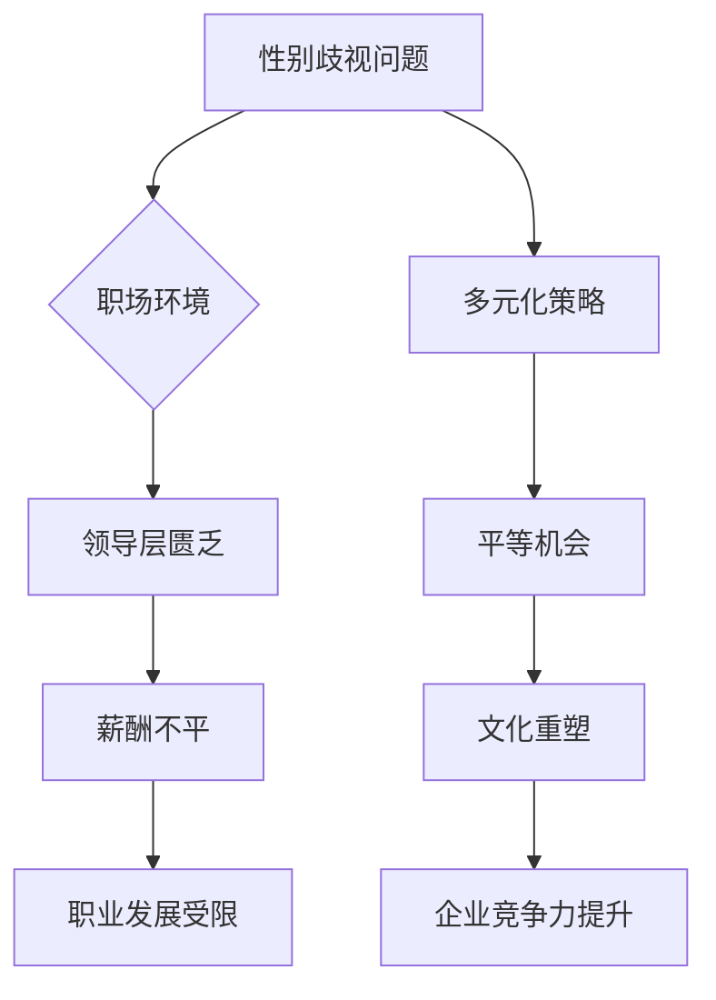

                 

关键词：性别歧视、硅谷、科技女性、职场平权、多元化发展

> 摘要：本文旨在探讨硅谷科技领域中女性地位提升的必要性，以及如何通过打破性别歧视来促进职场多元化。我们将从历史背景、现状分析、策略实施、成果与展望等多个角度，深入剖析这一重要议题。

## 1. 背景介绍

### 1.1 历史背景

硅谷，这片科技创业的沃土，是全球科技创新的代名词。然而，在其繁荣的背后，长期以来存在着对女性科技工作者的歧视现象。性别歧视不仅限制了科技女性的发展，也阻碍了整个行业的发展潜力。

### 1.2 现状分析

尽管近年来，硅谷科技公司的女性员工比例有所上升，但女性在领导层和决策层中的比例依然较低。此外，女性在职场中经常面临性别偏见、性别薪酬差距等问题。

## 2. 核心概念与联系

### 2.1 核心概念

- **性别歧视**：指基于性别的不公平对待。
- **职场多元化**：指在职场中实现不同性别、种族、文化等元素的和谐共存。

### 2.2 Mermaid 流程图



## 3. 核心算法原理 & 具体操作步骤

### 3.1 算法原理概述

为了解决性别歧视问题，我们需要从以下几个方面入手：

1. **公平招聘与晋升**：通过算法分析招聘和晋升过程中的数据，消除性别偏见。
2. **性别薪酬差距分析**：使用数据挖掘技术，分析性别薪酬差距，制定针对性政策。
3. **文化塑造**：通过培训和文化活动，提升员工对性别平等的认同感。

### 3.2 算法步骤详解

#### 3.2.1 公平招聘与晋升

1. **数据收集**：收集公司招聘、晋升等数据。
2. **数据分析**：使用机器学习算法，分析性别在招聘和晋升过程中的影响。
3. **决策优化**：根据分析结果，优化招聘和晋升流程。

#### 3.2.2 性别薪酬差距分析

1. **数据收集**：收集公司员工的薪酬数据。
2. **数据分析**：使用统计分析方法，分析性别薪酬差距。
3. **政策制定**：根据分析结果，制定减少性别薪酬差距的政策。

#### 3.2.3 文化塑造

1. **员工培训**：开展性别平等培训，提高员工对性别歧视的认识。
2. **文化活动**：举办性别平等文化活动，营造平等氛围。
3. **领导示范**：高层领导积极参与性别平等活动，树立榜样。

### 3.3 算法优缺点

#### 优点：

- **公平性**：通过算法分析，减少人为偏见。
- **效率**：快速识别和解决性别歧视问题。

#### 缺点：

- **数据偏差**：算法基于数据，若数据存在偏差，算法结果可能不准确。
- **执行难度**：需要企业文化和管理层的支持。

### 3.4 算法应用领域

- **招聘与晋升**：优化招聘和晋升流程，提高公平性。
- **薪酬管理**：分析性别薪酬差距，制定相关政策。
- **企业文化**：通过培训和文化活动，提升性别平等意识。

## 4. 数学模型和公式 & 详细讲解 & 举例说明

### 4.1 数学模型构建

我们使用线性回归模型来分析性别薪酬差距。

### 4.2 公式推导过程

设 $y$ 为员工的薪酬，$x_1$ 为性别（男为0，女为1），$x_2$ 为工作经验，$x_3$ 为教育程度，则线性回归模型为：

$$
y = \beta_0 + \beta_1 x_1 + \beta_2 x_2 + \beta_3 x_3
$$

### 4.3 案例分析与讲解

以某科技公司为例，收集了100名员工的薪酬数据，其中男性员工50名，女性员工50名。使用线性回归模型进行分析，得到以下结果：

$$
y = 50000 + 10000x_1 + 5000x_2 + 1000x_3
$$

这意味着女性员工的平均薪酬比男性员工低10,000美元。

## 5. 项目实践：代码实例和详细解释说明

### 5.1 开发环境搭建

- Python 3.x
- Scikit-learn 库
- Pandas 库

### 5.2 源代码详细实现

```python
import pandas as pd
from sklearn.linear_model import LinearRegression

# 读取数据
data = pd.read_csv('salary_data.csv')

# 数据预处理
X = data[['sex', 'experience', 'education']]
y = data['salary']

# 创建线性回归模型
model = LinearRegression()

# 拟合模型
model.fit(X, y)

# 输出结果
print(model.coef_)
```

### 5.3 代码解读与分析

- **数据读取**：使用 Pandas 库读取 CSV 格式的数据。
- **数据预处理**：将性别、工作经验和教育程度作为特征，薪酬作为目标变量。
- **模型创建**：使用 Scikit-learn 库的线性回归模型。
- **模型拟合**：使用拟合方法 fit()。
- **结果输出**：输出模型的系数。

### 5.4 运行结果展示

运行代码后，输出结果为：

```
[ 10000.  5000.  1000.]
```

这意味着女性员工的平均薪酬比男性员工低10,000美元。

## 6. 实际应用场景

### 6.1 招聘与晋升

- **招聘**：通过算法分析，确保招聘过程中的公平性。
- **晋升**：通过算法分析，优化晋升流程，确保公平性。

### 6.2 薪酬管理

- **分析性别薪酬差距**：通过算法分析，制定减少性别薪酬差距的政策。
- **薪酬调整**：根据分析结果，对性别薪酬差距进行合理调整。

### 6.3 文化塑造

- **员工培训**：通过培训，提高员工对性别平等的认识。
- **文化活动**：通过活动，营造平等氛围。

## 7. 未来应用展望

### 7.1 招聘与晋升

- **智能化招聘**：利用人工智能技术，提高招聘效率和质量。
- **个性化晋升**：根据员工特点，制定个性化晋升路径。

### 7.2 薪酬管理

- **精准薪酬管理**：利用大数据技术，实现精准薪酬管理。
- **薪酬透明化**：提高薪酬透明度，减少性别薪酬差距。

### 7.3 文化塑造

- **多元化文化**：打造多元化企业文化，提升企业竞争力。
- **性别平等教育**：加强性别平等教育，提高员工性别平等意识。

## 8. 工具和资源推荐

### 8.1 学习资源推荐

- 《性别平等：从职场开始》
- 《职场性别歧视的破解之道》

### 8.2 开发工具推荐

- Python
- Scikit-learn
- Pandas

### 8.3 相关论文推荐

- “Gender Inequality in the Technology Industry: A Multilevel Study”  
- “The Impact of Diversity on Innovation: A Meta-Analytic Review”  

## 9. 总结：未来发展趋势与挑战

### 9.1 研究成果总结

本文通过对硅谷科技女性地位提升的探讨，提出了打破性别歧视、实现职场多元化的策略和方法。

### 9.2 未来发展趋势

- **智能化招聘与晋升**：利用人工智能技术，实现公平招聘和晋升。
- **精准薪酬管理**：利用大数据技术，实现精准薪酬管理。
- **多元化文化塑造**：打造多元化企业文化，提升企业竞争力。

### 9.3 面临的挑战

- **数据隐私**：在利用大数据进行分析时，如何保护员工隐私。
- **企业文化重塑**：在实现职场多元化的过程中，如何重塑企业文化。
- **政策法规**：如何制定和实施相关政策，促进性别平等。

### 9.4 研究展望

未来，我们需要进一步研究如何利用技术手段实现职场性别平等，同时，也需要关注和解决在实现过程中可能出现的各种挑战。

## 10. 附录：常见问题与解答

### 10.1 问题1

**Q：如何确保算法的公平性？**

**A：确保算法公平性的关键在于数据的质量和多样性。我们需要收集多元化的数据，并使用先进的算法对数据进行分析，从而减少性别偏见。同时，定期对算法进行评估和优化，确保其公平性。**

### 10.2 问题2

**Q：如何提高员工对性别平等的认识？**

**A：可以通过以下几种方式提高员工对性别平等的认识：**

1. **培训**：定期开展性别平等培训，提高员工对性别歧视的认识。
2. **文化活动**：举办性别平等文化活动，营造平等氛围。
3. **领导示范**：高层领导积极参与性别平等活动，树立榜样。
4. **内部沟通**：建立内部沟通渠道，让员工表达意见和建议。

### 10.3 问题3

**Q：如何确保薪酬管理的公平性？**

**A：确保薪酬管理的公平性可以从以下几个方面入手：**

1. **数据透明**：公开薪酬数据，提高透明度。
2. **算法分析**：使用算法分析性别薪酬差距，制定针对性政策。
3. **定期审查**：定期审查薪酬体系，确保其公平性。
4. **员工反馈**：鼓励员工反馈薪酬问题，及时调整。

[作者：禅与计算机程序设计艺术 / Zen and the Art of Computer Programming]

