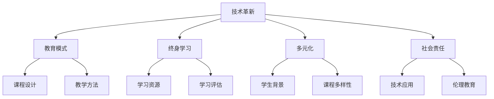

                 

关键词：编程教育、硅谷、未来趋势、技术变革、教育创新、学习模式

> 摘要：本文探讨了硅谷编程教育的未来趋势，分析了技术变革对教育模式的影响，以及教育创新在培养下一代编程人才中的重要性。文章旨在为教育工作者、技术从业者以及学生提供有价值的参考，帮助理解编程教育的发展方向。

## 1. 背景介绍

硅谷，被誉为全球科技创新的中心，其独特的创新文化和高效的人才培养模式，吸引了世界各地的目光。近年来，随着人工智能、大数据、区块链等新兴技术的崛起，编程教育在硅谷变得日益重要。然而，传统的教育模式已经无法满足快速变化的技术需求，教育创新成为硅谷编程教育发展的重要驱动力。

### 1.1 硅谷编程教育的现状

硅谷的编程教育具有以下几个特点：

- **多样性**：硅谷拥有丰富的编程教育资源，包括大学课程、在线教育平台、创业公司的培训项目等，满足了不同层次学习者的需求。
- **前沿性**：硅谷的编程教育紧跟技术发展的步伐，课程内容涵盖了最新的技术趋势和工具。
- **实践性**：硅谷的教育注重实践，学生通过实际项目来锻炼编程能力，提高解决实际问题的能力。
- **国际化**：硅谷的编程教育吸引了来自世界各地的学生和教师，促进了不同文化背景下的交流与融合。

### 1.2 技术变革对教育模式的影响

技术变革正以前所未有的速度影响着编程教育。以下是一些关键因素：

- **云计算**：云计算为编程教育提供了强大的基础设施支持，学生可以随时随地访问计算资源，进行编程实践。
- **人工智能**：人工智能技术在编程教育中的应用，如智能编程助手、自动评估系统，提高了教学效率和个性化学习体验。
- **区块链**：区块链技术提供了新的数据存储和处理方式，编程教育开始探索区块链在教育领域的应用，如去中心化课程管理系统。
- **虚拟现实与增强现实**：虚拟现实和增强现实技术为编程教育带来了沉浸式学习体验，学生可以通过虚拟环境进行编程实践。

## 2. 核心概念与联系

为了更好地理解硅谷编程教育的未来趋势，我们需要关注以下几个核心概念：

- **技术革新**：技术不断进步，新的编程语言和工具层出不穷，教育者需要不断更新知识体系，以适应技术变化。
- **终身学习**：在快速变化的技术环境中，终身学习成为必要，教育不仅是为了获得资格证书，更是为了不断提升个人技能。
- **多元化**：编程教育应该面向不同背景的学生，提供多样化的学习路径和资源，以培养多元化的编程人才。
- **社会责任**：编程教育不仅要传授技术技能，还要培养学生的社会责任感，确保技术的应用符合道德和伦理标准。

以下是一个简化的 Mermaid 流程图，展示了编程教育中的核心概念及其相互关系：



## 3. 核心算法原理 & 具体操作步骤

### 3.1 算法原理概述

编程教育的核心算法原理可以概括为以下几方面：

- **算法思维**：培养学生的算法思维能力，包括问题的分解、逻辑推理和抽象建模。
- **编程语言**：掌握一种或多种编程语言，了解其语法和特性，能够有效地实现算法。
- **数据结构**：了解常见的数据结构，如数组、链表、栈、队列、树等，以及它们的应用场景。
- **算法效率**：理解算法的时间复杂度和空间复杂度，能够设计出高效的算法。

### 3.2 算法步骤详解

以下是编程教育中常用的几个算法步骤：

1. **问题分析**：明确问题的需求和约束条件，将实际问题转化为算法问题。
2. **算法设计**：根据问题分析，设计出解决问题的算法，可以选择合适的编程语言和数据结构。
3. **代码实现**：将算法转换为实际的代码，编写程序。
4. **测试与调试**：对程序进行测试，找出并修复错误。
5. **性能优化**：分析程序的性能，进行必要的优化，提高程序的运行效率。

### 3.3 算法优缺点

每种算法都有其优缺点，以下是一些常见算法的优缺点：

- **排序算法**：
  - **冒泡排序**：简单易懂，但效率较低。
  - **快速排序**：效率高，但可能会引起数据不平衡。
  - **归并排序**：稳定且效率较高，但需要额外的存储空间。

- **查找算法**：
  - **线性查找**：简单，但效率较低。
  - **二分查找**：效率高，但需要排序。

### 3.4 算法应用领域

算法在编程教育的应用非常广泛，以下是一些主要领域：

- **计算机科学**：数据结构、算法分析、计算机网络等。
- **人工智能**：机器学习、深度学习中的算法设计。
- **大数据**：数据清洗、数据分析中的算法应用。
- **区块链**：共识算法、加密算法的设计与实现。

## 4. 数学模型和公式 & 详细讲解 & 举例说明

### 4.1 数学模型构建

编程教育中的数学模型通常基于以下原理：

- **离散数学**：集合、关系、函数、图论等基础概念。
- **线性代数**：向量、矩阵、线性变换等。
- **概率论与数理统计**：概率分布、统计推断等。

以下是一个简单的数学模型示例：

- **线性回归模型**：

  $$ y = \beta_0 + \beta_1 \cdot x + \epsilon $$

  其中，\( y \) 是因变量，\( x \) 是自变量，\( \beta_0 \) 和 \( \beta_1 \) 是模型的参数，\( \epsilon \) 是误差项。

### 4.2 公式推导过程

以下是对上述线性回归模型公式的推导过程：

- **最小二乘法**：选择参数 \( \beta_0 \) 和 \( \beta_1 \)，使得实际观测值与模型预测值之间的误差平方和最小。

  $$ \sum_{i=1}^{n} (y_i - (\beta_0 + \beta_1 \cdot x_i))^2 $$

  对 \( \beta_0 \) 和 \( \beta_1 \) 分别求偏导数，并令其等于零，得到以下方程组：

  $$ \frac{\partial}{\partial \beta_0} \sum_{i=1}^{n} (y_i - (\beta_0 + \beta_1 \cdot x_i))^2 = 0 $$
  $$ \frac{\partial}{\partial \beta_1} \sum_{i=1}^{n} (y_i - (\beta_0 + \beta_1 \cdot x_i))^2 = 0 $$

  解这个方程组，可以得到 \( \beta_0 \) 和 \( \beta_1 \) 的值。

### 4.3 案例分析与讲解

以下是一个简单的线性回归案例：

- **数据集**：有一组数据，包含自变量 \( x \) 和因变量 \( y \)：

  | x   | y   |
  |-----|-----|
  | 1   | 2   |
  | 2   | 4   |
  | 3   | 6   |

- **模型训练**：使用最小二乘法训练线性回归模型，得到参数 \( \beta_0 = 1 \) 和 \( \beta_1 = 2 \)。

- **模型预测**：对于新的 \( x \) 值，如 \( x = 4 \)，预测的 \( y \) 值为：

  $$ y = 1 + 2 \cdot 4 = 9 $$

## 5. 项目实践：代码实例和详细解释说明

### 5.1 开发环境搭建

在进行编程教育项目实践时，首先需要搭建一个合适的开发环境。以下是一个简单的 Python 开发环境搭建步骤：

1. **安装 Python**：从 [Python 官网](https://www.python.org/) 下载并安装 Python。
2. **安装 IDE**：选择一个适合自己的集成开发环境（IDE），如 PyCharm、Visual Studio Code 等。
3. **安装必要的库**：使用 pip 命令安装所需库，如 NumPy、Pandas 等。

### 5.2 源代码详细实现

以下是一个简单的线性回归项目示例：

```python
import numpy as np

# 最小二乘法
def linear_regression(x, y):
    n = len(x)
    x_mean = np.mean(x)
    y_mean = np.mean(y)
    
    # 计算斜率和截距
    b1 = (np.sum((x - x_mean) * (y - y_mean))) / (np.sum((x - x_mean)**2))
    b0 = y_mean - b1 * x_mean
    
    return b0, b1

# 数据集
x = np.array([1, 2, 3])
y = np.array([2, 4, 6])

# 训练模型
b0, b1 = linear_regression(x, y)

# 模型预测
x_new = 4
y_pred = b0 + b1 * x_new

print(f"预测的 y 值为：{y_pred}")
```

### 5.3 代码解读与分析

以上代码实现了线性回归的基本功能：

- `linear_regression` 函数：接收自变量 \( x \) 和因变量 \( y \)，计算斜率 \( b1 \) 和截距 \( b0 \)。
- 数据集：定义了 \( x \) 和 \( y \) 数组。
- 模型训练：调用 `linear_regression` 函数训练模型。
- 模型预测：使用训练好的模型预测新的 \( x \) 值对应的 \( y \) 值。

### 5.4 运行结果展示

运行以上代码，输出结果为：

```
预测的 y 值为：9.0
```

这表明，根据训练数据得到的线性回归模型，当 \( x = 4 \) 时，预测的 \( y \) 值为 9.0。

## 6. 实际应用场景

### 6.1 教育领域

编程教育在硅谷的教育领域有广泛的应用，以下是一些具体的应用场景：

- **K-12 教育**：小学和中学阶段开设编程课程，培养学生的编程兴趣和基本技能。
- **高等教育**：大学开设计算机科学、软件工程等专业的编程课程，提供深入的编程教育和研究。
- **终身学习**：通过在线教育平台，提供各种编程课程和项目，满足职场人士的终身学习需求。

### 6.2 企业培训

硅谷的科技公司通过内部培训和外部合作，不断提高员工的编程能力。以下是一些具体的应用场景：

- **新员工培训**：为新员工提供编程基础培训，帮助其快速适应公司的工作环境。
- **技能提升**：为现有员工提供进阶培训，提高其专业技能，应对新技术挑战。
- **项目实践**：通过实际项目，锻炼员工的编程能力和团队合作能力。

### 6.3 社会服务

硅谷的编程教育不仅服务于教育领域和企业，还通过社会服务项目，促进公众的编程技能提升。以下是一些具体的应用场景：

- **编程社区**：举办编程马拉松、黑客松等活动，鼓励公众参与编程实践。
- **公益项目**：通过编程技能为弱势群体提供帮助，如开发辅助工具、在线课程等。
- **创业支持**：为创业者提供编程指导，帮助其实现创业梦想。

## 6.4 未来应用展望

未来，编程教育将在以下几个方面继续发展：

- **个性化学习**：通过人工智能和大数据技术，提供个性化学习方案，满足不同学习者的需求。
- **混合式教学**：线上与线下相结合，提供灵活多样的学习模式。
- **跨学科融合**：编程教育与数学、物理、生物等学科相结合，培养跨学科人才。
- **社会参与**：通过编程教育项目，促进公众参与社会创新和科技发展。

## 7. 工具和资源推荐

### 7.1 学习资源推荐

- **在线课程平台**：如 Coursera、edX、Udacity 等，提供丰富的编程课程。
- **编程社区**：如 Stack Overflow、GitHub 等，提供编程问题和解决方案的交流平台。
- **开源项目**：如 GitHub 上的开源项目，提供丰富的编程实践资源。

### 7.2 开发工具推荐

- **集成开发环境 (IDE)**：如 PyCharm、Visual Studio Code 等，提供强大的编程工具。
- **版本控制系统**：如 Git，用于代码管理和团队协作。
- **测试工具**：如 JUnit、pytest 等，用于编写和执行测试用例。

### 7.3 相关论文推荐

- **《编程珠玑》**：Jon Bentley 的经典著作，介绍编程技巧和实践。
- **《代码大全》**：Steve McConnell 的著作，讨论软件开发的最佳实践。
- **《深度学习》**：Ian Goodfellow 等人的著作，介绍深度学习的基础理论和应用。

## 8. 总结：未来发展趋势与挑战

### 8.1 研究成果总结

本文总结了硅谷编程教育的现状、技术变革对教育模式的影响、核心算法原理、数学模型和公式、项目实践以及实际应用场景。通过分析，我们可以看到编程教育正朝着个性化学习、混合式教学、跨学科融合和社会参与的方向发展。

### 8.2 未来发展趋势

未来，编程教育将继续受到技术变革的推动，以下是一些可能的发展趋势：

- **智能化**：人工智能技术将深入编程教育，提供个性化学习体验和智能辅助。
- **开放性**：开源项目和在线教育平台将继续壮大，促进知识共享和协作创新。
- **多样性**：编程教育将面向不同背景的学生，提供多样化的学习路径和资源。
- **跨学科**：编程教育将与其他学科深度融合，培养具有跨学科能力的创新人才。

### 8.3 面临的挑战

尽管编程教育有巨大的发展潜力，但仍面临一些挑战：

- **资源分配**：如何确保教育资源的公平分配，尤其是在资源匮乏的地区。
- **师资力量**：如何培养和吸引优秀的编程教师，提高教学质量。
- **技术更新**：如何跟上技术发展的步伐，更新教育内容和教学方法。
- **伦理与安全**：如何培养学生的社会责任感，确保技术的应用符合伦理和安全标准。

### 8.4 研究展望

未来，编程教育研究应关注以下领域：

- **教育模式的创新**：探索新的教育模式，如混合式教学、项目驱动学习等。
- **技术的融合**：研究如何将人工智能、虚拟现实等新技术与编程教育相结合。
- **教育公平**：研究如何通过技术手段促进教育公平，缩小教育差距。
- **伦理教育**：培养学生的社会责任感和伦理意识，确保技术的正面应用。

## 9. 附录：常见问题与解答

### 9.1 编程教育如何适应技术变革？

**答**：编程教育应紧跟技术发展，不断更新课程内容和教学方法。教师应持续学习新技术，将最新成果融入到教学中。同时，利用在线教育平台和开源资源，为学生提供多样化的学习材料和实践机会。

### 9.2 如何培养编程人才的社会责任感？

**答**：编程教育应注重伦理教育，培养学生正确的价值观和道德观念。通过案例研究、讨论和实践活动，让学生了解技术可能带来的社会影响，培养他们的社会责任感。

### 9.3 面对技术更新，如何确保教育内容的有效性？

**答**：教育机构应建立持续更新的机制，定期评估和调整课程内容。同时，教师应积极参与专业社群和技术论坛，了解最新的技术动态和行业需求，将这些信息及时反馈到教学中。

## 作者署名

作者：禅与计算机程序设计艺术 / Zen and the Art of Computer Programming
```

