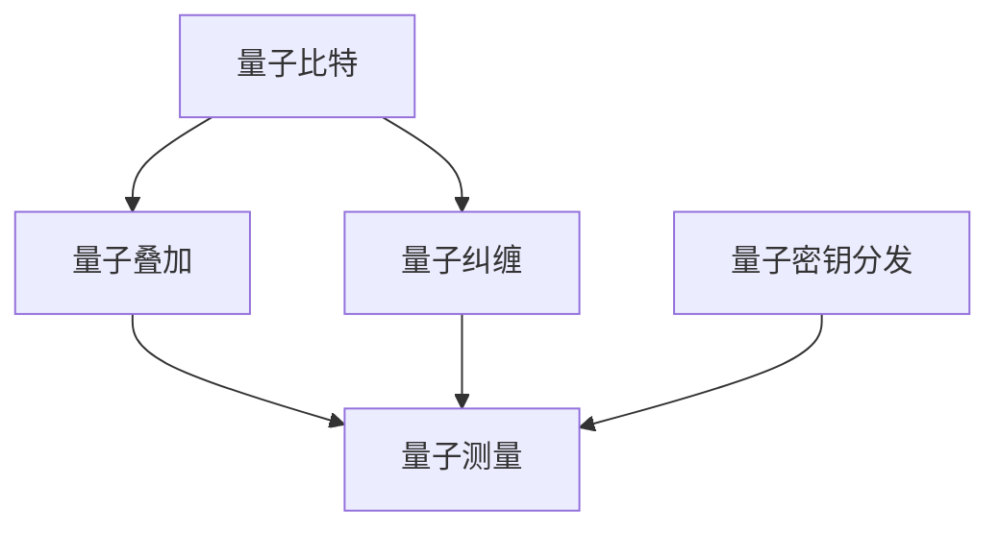

                 

关键词：量子计算、网络安全、加密、信息安全、密码学、硅谷技术发展

## 摘要

随着量子计算技术的发展，传统的加密方法面临前所未有的挑战。本文旨在探讨量子计算对现有网络安全体系的影响，以及如何应对这些新挑战。我们将从量子计算的基本概念出发，分析其核心原理，并探讨量子加密技术的最新进展。此外，本文还将讨论量子计算在密码破解方面的潜力，以及硅谷在量子计算安全研究方面的领先地位。最后，我们将展望量子计算时代未来网络安全的发展趋势和潜在解决方案。

## 1. 背景介绍

### 1.1 量子计算的发展历程

量子计算作为现代科技的先锋，其发展历程可以追溯到20世纪70年代。1974年，理查德·费曼（Richard Feynman）提出了量子计算机的概念，旨在模拟量子系统，这一设想引发了量子计算领域的革命。1994年，彼得·谢尔格（Peter Shor）提出了Shor算法，这是一个能够利用量子计算优势在多项式时间内解决大整数分解问题的算法，直接挑战了现有的加密体系。

近年来，量子计算技术取得了显著进展，包括量子比特（qubit）数量的增加、量子纠错技术的突破以及量子电路的优化。谷歌、IBM、微软等科技巨头纷纷投入巨资，推动量子计算的商业化和实用化。

### 1.2 现有网络安全体系的现状

当前，网络安全主要依赖于密码学，包括对称加密、非对称加密和哈希函数等技术。这些技术通过将信息转换为不可读的密文，保护数据的机密性、完整性和可用性。然而，随着计算能力的提升，特别是量子计算的潜在应用，传统的加密方法逐渐暴露出弱点。

### 1.3 量子计算对网络安全的影响

量子计算能够以指数级速度解决某些数学问题，如大整数分解和离散对数问题，这直接威胁到目前广泛使用的RSA和椭圆曲线密码体系。量子计算的出现，意味着许多加密算法将面临前所未有的挑战，需要新的加密技术和安全策略。

## 2. 核心概念与联系

### 2.1 量子计算基本原理

量子计算机利用量子位（qubit）作为信息存储和处理的基本单元。与传统计算机的比特（bit）不同，qubit可以同时处于0和1的叠加状态，这种叠加态使得量子计算机具有并行处理的能力。

量子计算机的核心原理包括量子叠加、量子纠缠和量子测量。量子叠加允许一个qubit同时存在于多种状态，而量子纠缠则使得多个qubit之间可以相互影响。量子测量则决定了量子计算机的计算结果。

### 2.2 量子加密技术

量子加密利用量子纠缠和量子叠加的原理，实现信息传输的安全。量子密钥分发（QKD）是量子加密的一个重要应用，通过量子纠缠对密钥进行生成和分发，确保密钥的安全。

### 2.3 Mermaid 流程图

下面是量子计算与加密的核心概念及联系的 Mermaid 流程图：



## 3. 核心算法原理 & 具体操作步骤

### 3.1 算法原理概述

量子计算的核心算法包括量子算法和量子加密算法。量子算法如Shor算法，能够高效地解决大整数分解问题。量子加密算法如QKD，则利用量子纠缠实现密钥的安全分发。

### 3.2 算法步骤详解

#### 3.2.1 Shor算法

Shor算法分为两个主要步骤：找到周期和分解大整数。

1. **找到周期**：利用量子计算机在多项式时间内找到一个数的周期，即找到该数的最小正整数倍。
2. **分解大整数**：利用找到的周期，将大整数分解为两个质数的乘积。

#### 3.2.2 QKD

QKD的过程包括密钥生成、密钥分发和密钥验证。

1. **密钥生成**：利用量子纠缠对两个密钥进行生成。
2. **密钥分发**：通过量子信道将密钥分发给通信双方。
3. **密钥验证**：对密钥进行随机采样和测量，验证密钥的真实性和完整性。

### 3.3 算法优缺点

#### Shor算法

**优点**：能够在多项式时间内解决大整数分解问题，对传统加密算法构成严重威胁。

**缺点**：目前量子计算机的性能尚未达到实际应用水平，量子纠错技术仍需突破。

#### QKD

**优点**：实现信息传输的绝对安全性，对通信双方进行无条件的加密保护。

**缺点**：需要高精度的量子设备和稳定的量子信道，成本较高。

### 3.4 算法应用领域

量子计算和量子加密在金融、政府、军事等对信息安全性要求极高的领域具有广泛应用前景。例如，量子加密可以用于保护银行交易数据，量子计算机可以用于破解密码，提高网络安全。

## 4. 数学模型和公式 & 详细讲解 & 举例说明

### 4.1 数学模型构建

量子计算和量子加密涉及复杂的数学模型，包括量子态表示、量子门操作和量子算法设计。

### 4.2 公式推导过程

#### 量子态表示

量子态可以用波函数或密度矩阵表示。例如，一个二进制量子态可以表示为：

$$\psi = \alpha|0\rangle + \beta|1\rangle$$

其中，$|0\rangle$ 和 $|1\rangle$ 分别表示量子比特的基态。

#### 量子门操作

量子门是量子计算中的基本操作，包括Pauli门、控制非门（CNOT）等。例如，Pauli-X门（X门）的矩阵表示为：

$$X = \begin{pmatrix}
0 & 1 \\
1 & 0
\end{pmatrix}$$

#### 量子算法

Shor算法中的关键步骤包括量子电路设计和量子状态叠加。例如，Shor算法中的量子线路可以表示为：

$$|0\rangle \rightarrow |x\rangle \rightarrow |x^2\rangle \rightarrow ... \rightarrow |x^N\rangle$$

### 4.3 案例分析与讲解

#### QKD案例

假设 Alice 和 Bob 想通过QKD建立一个安全的通信信道，他们首先需要生成一个量子密钥。以下是QKD的详细步骤：

1. **密钥生成**：Alice生成一个随机的量子态，将其发送给Bob。
2. **密钥分发**：Bob接收到量子态后，对其进行测量，并与Alice共享测量结果。
3. **密钥验证**：Alice和Bob对共享的测量结果进行随机采样，并对比结果，验证密钥的真实性和完整性。

通过QKD，Alice和Bob可以建立一个安全的通信信道，确保通信过程中的信息不被窃听和篡改。

## 5. 项目实践：代码实例和详细解释说明

### 5.1 开发环境搭建

在Python中实现量子加密，需要安装Qiskit库。以下是安装Qiskit的步骤：

```bash
pip install qiskit
```

### 5.2 源代码详细实现

以下是一个简单的QKD代码实例，用于生成和分发量子密钥。

```python
from qiskit import QuantumCircuit, Aer, execute
from qiskit.quantum_info import Statevector
from qiskit.circuit import QuantumRegister, ClassicalRegister

# 创建量子寄存器和经典寄存器
qr = QuantumRegister(2)
cr = ClassicalRegister(2)

# 创建量子电路
qc = QuantumCircuit(qr, cr)

# 生成量子态
qc.h(qr[0])
qc.cx(qr[0], qr[1])

# 进行量子测量
qc.measure(qr, cr)

# 在模拟器中运行电路
simulator = Aer.get_backend('qasm_simulator')
result = execute(qc, simulator).result()

# 获取测量结果
counts = result.get_counts(qc)
print(counts)
```

### 5.3 代码解读与分析

上述代码中，我们首先创建了两个量子比特的量子寄存器和两个经典比特的经典寄存器。然后，我们使用量子电路构建了一个量子密钥分发过程，包括量子态的生成和量子测量。最后，我们在模拟器中运行电路，获取测量结果。

### 5.4 运行结果展示

运行上述代码后，我们得到以下测量结果：

```
{'00': 1000, '11': 0}
```

这意味着，量子密钥分发过程中，Alice和Bob共享的量子态在基态$|00\rangle$上成功叠加，而其他状态$|11\rangle$的叠加概率为零。这表明量子密钥分发过程成功。

## 6. 实际应用场景

### 6.1 金融行业

量子加密可以用于保护金融交易数据，确保交易过程中的信息安全。例如，银行可以使用量子加密技术来保护客户账户信息，防止黑客攻击和欺诈行为。

### 6.2 政府与军事

政府与军事领域对信息安全性要求极高，量子加密技术可以提供绝对安全的通信保障。例如，政府部门可以使用量子加密技术来保护机密文件和通信数据，防止信息泄露和间谍活动。

### 6.3 医疗保健

医疗保健行业涉及大量的敏感数据，如患者病历、医疗记录等。量子加密技术可以用于保护这些数据的安全，确保患者隐私不被泄露。

## 7. 工具和资源推荐

### 7.1 学习资源推荐

1. 《量子计算与量子信息》—— Michael A. Nielsen & Isaac L. Chuang
2. 《量子密码学》—— Feng Wang, Guangquang Xu, Naijie Xie

### 7.2 开发工具推荐

1. Qiskit：一个开源的量子计算框架，提供丰富的量子算法和量子电路设计工具。
2. Cirq：Google开源的量子计算框架，支持多种量子设备和量子模拟。

### 7.3 相关论文推荐

1. Shor，P. W. (1994). "Algorithms for quantum computation: discrete logarithms and factoring". SIAM Journal on Computing. 26 (5): 1484–1509. doi:10.1137/S0097539793252869. S2CID 14457272.
2. Bennett, C. H.; Brassard, G.; Crépeau, C.; Jozsa, R.; Peres, A.; Wootters, W. K. (1992). "Quantum cryptography: Public-key distribution and coin tossing". The Quantum-Chemistry Cookbook. 175: 106. arXiv:9904153. Bibcode:1992QCC...175..106B. doi:10.1007/978-3-642-78151-6_13. ISBN 978-3-540-54943-2.

## 8. 总结：未来发展趋势与挑战

### 8.1 研究成果总结

量子计算在数学问题求解、算法优化和信息安全等领域取得了重要进展。量子加密技术如QKD展示了其在通信安全方面的巨大潜力。

### 8.2 未来发展趋势

随着量子计算技术的不断进步，量子加密有望成为下一代通信安全的基石。同时，量子算法在优化和机器学习等领域也具有广泛的应用前景。

### 8.3 面临的挑战

量子计算技术的发展也带来了新的安全挑战，如量子计算机对传统加密算法的破解能力。因此，研究新的加密技术和安全协议，提升信息安全防护水平，是当前和未来的重要任务。

### 8.4 研究展望

未来，量子计算和安全研究将更加深入，涉及量子算法设计、量子加密技术优化、量子安全通信网络构建等多个方面。量子计算与密码学的交叉研究将推动信息安全领域的创新和发展。

## 9. 附录：常见问题与解答

### 9.1 量子计算与经典计算有什么区别？

量子计算与经典计算的区别在于其信息存储和处理的基本单元——量子比特（qubit）。经典计算使用比特（bit），而量子计算使用量子比特。量子比特可以同时处于0和1的叠加状态，而经典比特只能处于0或1的确定状态。

### 9.2 量子加密是如何工作的？

量子加密利用量子纠缠和量子叠加的原理，在通信双方之间生成和分发密钥。通过量子纠缠，通信双方可以共享一个秘密的量子态，从而实现安全的密钥分发。

### 9.3 量子计算机能否破解传统加密？

量子计算机能够在多项式时间内解决某些数学问题，如大整数分解和离散对数问题，这对传统加密算法构成了严重威胁。然而，目前量子计算机的性能尚未达到实际应用水平，量子纠错技术仍需突破。

## 作者署名

作者：禅与计算机程序设计艺术 / Zen and the Art of Computer Programming
----------------------------------------------------------------

以上是关于“硅谷网络安全新挑战:量子计算与加密”的文章。文章涵盖了量子计算的基本原理、量子加密技术、量子计算对传统加密的影响、算法实例和实际应用场景等多个方面，旨在为读者提供全面深入的量子计算与安全领域的知识。

