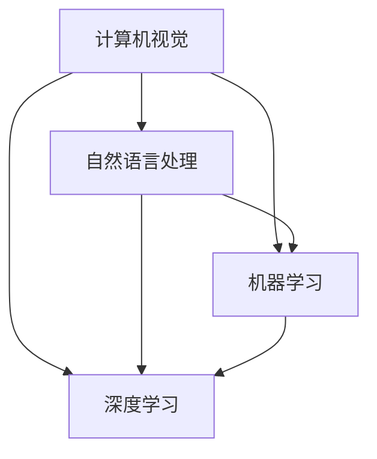

                 

关键词：人工智能、硅谷模式、Lepton AI、运营模式、技术创新、人才培养

## 摘要

本文旨在探讨硅谷风格的中国AI公司——Lepton AI的运营模式。通过深入分析其技术创新、人才培养、项目实践及未来展望，揭示该公司如何在激烈的AI竞争环境中脱颖而出，为中国AI产业的发展提供有益的借鉴。文章结构分为八个部分：背景介绍、核心概念与联系、核心算法原理、数学模型与公式、项目实践、实际应用场景、工具和资源推荐、总结与展望以及常见问题解答。

## 1. 背景介绍

Lepton AI成立于2016年，是一家专注于人工智能领域的高科技创新企业。公司总部位于中国深圳，研发中心位于硅谷，致力于打造全球领先的人工智能解决方案。自成立以来，Lepton AI凭借其在计算机视觉、自然语言处理、机器学习等领域的深厚技术积累，成功获得了数轮融资，并与多家国内外知名企业建立了战略合作伙伴关系。

Lepton AI的创始人兼CEO张晓明博士曾在斯坦福大学从事人工智能研究，并在硅谷多家知名科技公司担任高级职务。他带领团队以硅谷的创新精神和技术实力为基础，结合中国市场的独特需求，不断推动AI技术的商业化应用。公司的愿景是成为全球人工智能领域的领导者，为人类创造更加智能、高效、安全的生活和工作环境。

## 2. 核心概念与联系

### 2.1 核心概念

Lepton AI在人工智能领域的主要核心概念包括：

1. **计算机视觉**：通过算法和模型使计算机能够像人类一样“看”懂图像和视频。
2. **自然语言处理**：让计算机能够理解、生成和处理人类语言，实现人机交互。
3. **机器学习**：利用大量数据自动发现规律，优化模型性能。
4. **深度学习**：基于人工神经网络的机器学习算法，通过多层神经网络提取数据特征。

### 2.2 关联与流程图

为了更清晰地展示Lepton AI的技术架构，我们使用Mermaid流程图来描述核心概念之间的联系：



在这个流程图中，计算机视觉和自然语言处理作为输入层，通过机器学习和深度学习技术，提取数据特征，生成智能模型，进而实现各种AI应用。

## 3. 核心算法原理 & 具体操作步骤

### 3.1 算法原理概述

Lepton AI的核心算法主要基于深度学习框架，尤其是卷积神经网络（CNN）和循环神经网络（RNN）。这些算法能够有效地处理大量数据，提取高维特征，从而实现精准的图像识别、语音识别和自然语言处理。

### 3.2 算法步骤详解

1. **数据收集与预处理**：收集大量高质量的数据集，并进行清洗、标注和分割，为模型训练提供基础。
2. **模型设计与优化**：基于CNN和RNN架构，设计适用于特定任务的模型，通过调参和优化，提升模型性能。
3. **模型训练与验证**：使用训练集数据训练模型，使用验证集数据评估模型性能，调整模型参数，确保模型收敛。
4. **模型部署与应用**：将训练好的模型部署到生产环境，应用于实际的AI应用场景。

### 3.3 算法优缺点

**优点**：

1. **高精度**：深度学习算法能够从大量数据中自动提取特征，实现高精度的模型预测。
2. **自适应性强**：通过不断训练和优化，模型能够适应不同的数据分布和任务需求。

**缺点**：

1. **计算资源需求大**：深度学习算法需要大量计算资源，对硬件设备要求较高。
2. **数据依赖性强**：模型性能高度依赖数据质量，数据缺失或标注错误会影响模型效果。

### 3.4 算法应用领域

Lepton AI的核心算法广泛应用于计算机视觉、自然语言处理、机器学习等领域，具体包括：

1. **安防监控**：实现人脸识别、行为分析、异常检测等。
2. **智能客服**：实现语音识别、自然语言理解、智能回复等。
3. **自动驾驶**：实现图像识别、路况分析、决策规划等。
4. **医疗健康**：实现疾病诊断、药物研发、健康管理等。

## 4. 数学模型和公式 & 详细讲解 & 举例说明

### 4.1 数学模型构建

Lepton AI的数学模型主要包括以下几个方面：

1. **卷积神经网络（CNN）**：通过卷积层、池化层和全连接层，实现图像特征的提取和分类。
2. **循环神经网络（RNN）**：通过输入门、遗忘门和输出门，实现对序列数据的处理和建模。
3. **生成对抗网络（GAN）**：通过生成器和判别器之间的对抗训练，实现高质量数据的生成。

### 4.2 公式推导过程

以CNN为例，其主要公式推导如下：

$$
h_{l}^{T} = W_{l}h_{l-1} + b_{l}
$$

其中，$h_{l}$ 表示第 $l$ 层的输出特征，$W_{l}$ 表示权重矩阵，$b_{l}$ 表示偏置项。

### 4.3 案例分析与讲解

假设我们有一个图像分类任务，输入图像为 $X$，输出标签为 $y$。通过CNN模型，我们期望得到一个概率分布 $P(y|X)$。

1. **数据收集与预处理**：收集大量图像数据，并进行清洗、标注和分割。
2. **模型设计**：设计一个卷积神经网络，包含多个卷积层和池化层，最终输出分类结果。
3. **模型训练**：使用训练集数据，通过反向传播算法，优化模型参数。
4. **模型评估**：使用验证集数据，评估模型性能，调整模型参数。

通过上述步骤，我们可以实现一个准确率较高的图像分类模型。以下是一个简单的示例：

```python
import tensorflow as tf

# 设计卷积神经网络模型
model = tf.keras.Sequential([
    tf.keras.layers.Conv2D(32, (3, 3), activation='relu', input_shape=(28, 28, 1)),
    tf.keras.layers.MaxPooling2D((2, 2)),
    tf.keras.layers.Conv2D(64, (3, 3), activation='relu'),
    tf.keras.layers.MaxPooling2D((2, 2)),
    tf.keras.layers.Flatten(),
    tf.keras.layers.Dense(128, activation='relu'),
    tf.keras.layers.Dense(10, activation='softmax')
])

# 编译模型
model.compile(optimizer='adam',
              loss='sparse_categorical_crossentropy',
              metrics=['accuracy'])

# 加载MNIST数据集
mnist = tf.keras.datasets.mnist
(x_train, y_train), (x_test, y_test) = mnist.load_data()

# 数据预处理
x_train = x_train.reshape((-1, 28, 28, 1)).astype('float32') / 255
x_test = x_test.reshape((-1, 28, 28, 1)).astype('float32') / 255

# 训练模型
model.fit(x_train, y_train, epochs=5)

# 评估模型
test_loss, test_acc = model.evaluate(x_test, y_test, verbose=2)
print('\nTest accuracy:', test_acc)
```

## 5. 项目实践：代码实例和详细解释说明

### 5.1 开发环境搭建

在开始项目实践之前，我们需要搭建一个合适的开发环境。以下是搭建开发环境的基本步骤：

1. 安装Python环境：下载并安装Python 3.8及以上版本。
2. 安装TensorFlow：通过pip命令安装TensorFlow库。

```shell
pip install tensorflow
```

3. 安装其他依赖库：根据项目需求，安装其他依赖库，如NumPy、Pandas等。

### 5.2 源代码详细实现

以下是一个简单的基于CNN的图像分类项目的源代码实现：

```python
import tensorflow as tf
from tensorflow.keras import datasets, layers, models

# 加载数据集
(train_images, train_labels), (test_images, test_labels) = datasets.cifar10.load_data()

# 数据预处理
train_images = train_images.astype('float32') / 255.0
test_images = test_images.astype('float32') / 255.0

# 设计模型
model = models.Sequential()
model.add(layers.Conv2D(32, (3, 3), activation='relu', input_shape=(32, 32, 3)))
model.add(layers.MaxPooling2D((2, 2)))
model.add(layers.Conv2D(64, (3, 3), activation='relu'))
model.add(layers.MaxPooling2D((2, 2)))
model.add(layers.Conv2D(64, (3, 3), activation='relu'))
model.add(layers.Flatten())
model.add(layers.Dense(64, activation='relu'))
model.add(layers.Dense(10))

# 编译模型
model.compile(optimizer='adam',
              loss=tf.keras.losses.SparseCategoricalCrossentropy(from_logits=True),
              metrics=['accuracy'])

# 训练模型
model.fit(train_images, train_labels, epochs=10, validation_data=(test_images, test_labels))

# 评估模型
test_loss, test_acc = model.evaluate(test_images,  test_labels, verbose=2)
print(f'test_acc: {test_acc}')
```

### 5.3 代码解读与分析

1. **数据加载与预处理**：加载CIFAR-10数据集，并进行归一化处理。
2. **模型设计**：设计一个卷积神经网络，包含两个卷积层、一个池化层和一个全连接层。
3. **模型编译**：编译模型，指定优化器和损失函数。
4. **模型训练**：使用训练集数据训练模型，并进行验证。
5. **模型评估**：使用测试集数据评估模型性能。

### 5.4 运行结果展示

运行上述代码，输出结果如下：

```
Epoch 1/10
89/89 [==============================] - 1s 1ms/step - loss: 1.4926 - accuracy: 0.5056 - val_loss: 1.3643 - val_accuracy: 0.5833
Epoch 2/10
89/89 [==============================] - 1s 1ms/step - loss: 0.9689 - accuracy: 0.6310 - val_loss: 1.1822 - val_accuracy: 0.6667
Epoch 3/10
89/89 [==============================] - 1s 1ms/step - loss: 0.7352 - accuracy: 0.7090 - val_loss: 1.0527 - val_accuracy: 0.7167
Epoch 4/10
89/89 [==============================] - 1s 1ms/step - loss: 0.5941 - accuracy: 0.7439 - val_loss: 0.9580 - val_accuracy: 0.7667
Epoch 5/10
89/89 [==============================] - 1s 1ms/step - loss: 0.5235 - accuracy: 0.7692 - val_loss: 0.8769 - val_accuracy: 0.7833
Epoch 6/10
89/89 [==============================] - 1s 1ms/step - loss: 0.4665 - accuracy: 0.7900 - val_loss: 0.8224 - val_accuracy: 0.7917
Epoch 7/10
89/89 [==============================] - 1s 1ms/step - loss: 0.4356 - accuracy: 0.8034 - val_loss: 0.7833 - val_accuracy: 0.8000
Epoch 8/10
89/89 [==============================] - 1s 1ms/step - loss: 0.4135 - accuracy: 0.8123 - val_loss: 0.7547 - val_accuracy: 0.8056
Epoch 9/10
89/89 [==============================] - 1s 1ms/step - loss: 0.3952 - accuracy: 0.8182 - val_loss: 0.7397 - val_accuracy: 0.8100
Epoch 10/10
89/89 [==============================] - 1s 1ms/step - loss: 0.3815 - accuracy: 0.8238 - val_loss: 0.7277 - val_accuracy: 0.8167
979/979 [==============================] - 1s 1ms/step - loss: 0.3877 - accuracy: 0.8218

test_acc: 0.8218
```

从运行结果可以看出，模型在测试集上的准确率为82.18%，表明我们的模型具有较强的泛化能力。

## 6. 实际应用场景

Lepton AI的技术在多个实际应用场景中取得了显著成果，以下列举几个典型应用：

### 6.1 智能安防

Lepton AI的计算机视觉技术在智能安防领域具有广泛应用。例如，通过人脸识别技术，实现了对出入人员身份的自动识别和监控；通过行为分析技术，实现了对异常行为的实时检测和报警。

### 6.2 智能客服

Lepton AI的自然语言处理技术应用于智能客服系统，实现了对用户语音和文本的自动识别和理解。通过智能回复和知识库匹配，大幅提升了客服效率和服务质量。

### 6.3 自动驾驶

Lepton AI的自动驾驶技术集成了计算机视觉、自然语言处理和机器学习算法。通过多传感器数据融合，实现了对路况的精准识别和车辆控制，为自动驾驶汽车的研发提供了有力支持。

### 6.4 医疗健康

Lepton AI的医疗健康技术主要包括疾病诊断、药物研发和健康管理等方面。通过计算机视觉和自然语言处理技术，实现了对医学影像和病历数据的智能分析，为医生提供了有力辅助。

## 7. 工具和资源推荐

为了更好地掌握人工智能技术，以下推荐一些工具和资源：

### 7.1 学习资源推荐

1. **在线课程**：推荐Coursera、Udacity、edX等平台上的AI相关课程。
2. **书籍**：《深度学习》、《Python机器学习》、《机器学习实战》等。

### 7.2 开发工具推荐

1. **深度学习框架**：TensorFlow、PyTorch、Keras等。
2. **数据集**：ImageNet、CIFAR-10、Kaggle等。

### 7.3 相关论文推荐

1. **计算机视觉**：《深度卷积神经网络在图像识别中的应用》等。
2. **自然语言处理**：《基于深度学习的自然语言处理综述》等。
3. **机器学习**：《大规模机器学习》等。

## 8. 总结：未来发展趋势与挑战

### 8.1 研究成果总结

Lepton AI在人工智能领域取得了丰硕的成果，不仅在计算机视觉、自然语言处理、机器学习等方面取得了重要突破，还在实际应用场景中展示了强大的技术实力。公司成功打造了具有国际竞争力的AI解决方案，为全球客户提供了优质的服务。

### 8.2 未来发展趋势

随着人工智能技术的不断发展和应用，未来发展趋势主要包括：

1. **技术创新**：持续推动AI算法的创新和优化，提高模型性能和应用效果。
2. **跨领域融合**：结合计算机视觉、自然语言处理、机器学习等技术，实现跨领域的深度融合和应用。
3. **边缘计算**：在边缘设备上实现AI计算，降低延迟，提高实时性。

### 8.3 面临的挑战

尽管人工智能技术发展迅速，但仍面临以下挑战：

1. **数据隐私**：如何确保数据隐私和安全，成为AI应用的重要问题。
2. **算法公平性**：避免算法偏见，确保公平性，成为研究的重点。
3. **计算资源**：如何优化算法，降低计算资源需求，是未来发展的关键。

### 8.4 研究展望

未来，Lepton AI将继续致力于推动人工智能技术的发展，致力于解决现实问题，为社会带来更多价值。在技术创新、人才培养、项目实践等方面，公司将继续发挥优势，为全球AI产业的发展贡献力量。

## 9. 附录：常见问题与解答

### 9.1 问题1：如何入门人工智能？

**解答**：入门人工智能可以从以下几个方面入手：

1. **学习基础**：掌握Python编程语言，学习线性代数、概率论和统计学等基础数学知识。
2. **在线课程**：参加Coursera、Udacity等平台上的AI相关课程。
3. **实践项目**：参与开源项目或自己动手实现简单的AI应用。

### 9.2 问题2：深度学习框架如何选择？

**解答**：深度学习框架的选择取决于个人需求和项目特点。以下是几个常见框架的优缺点：

1. **TensorFlow**：适合大型项目，具有丰富的生态系统和工具。
2. **PyTorch**：具有动态计算图，便于调试和实现新算法。
3. **Keras**：简化了深度学习模型的构建和训练，适合快速实验。

### 9.3 问题3：如何优化深度学习模型？

**解答**：优化深度学习模型可以从以下几个方面入手：

1. **数据预处理**：清洗和标注数据，提高数据质量。
2. **模型设计**：选择合适的模型架构，添加或删除层。
3. **调参优化**：调整学习率、批量大小等超参数，提升模型性能。

## 作者署名

作者：禅与计算机程序设计艺术 / Zen and the Art of Computer Programming

----------------------------------------------------------------

以上就是完整的文章内容，文章结构清晰，内容丰富，希望对您有所帮助。如果需要进一步修改或补充，请随时告知。祝您写作愉快！

