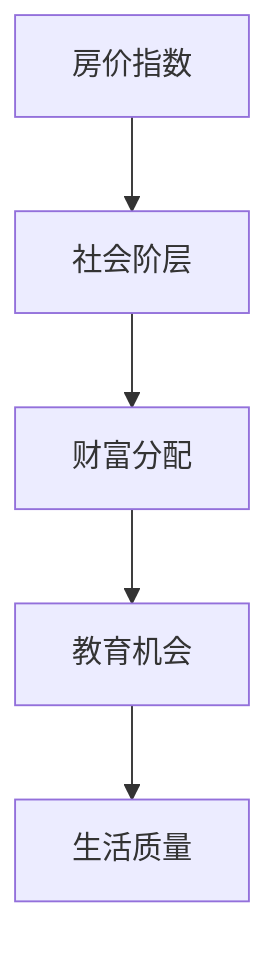

                 

关键词：硅谷、房价、社会阶层、影响、算法、模型、实践、展望

> 摘要：本文将深入探讨硅谷高房价对社会阶层的影响，从技术视角出发，分析其背后的逻辑与机制，并结合实际案例，提出相应的解决方案和未来展望。

## 1. 背景介绍

硅谷，作为全球科技创新的中心，以其高房价而闻名。高房价不仅影响了当地居民的生活质量，还对整个社会阶层产生了深远的影响。本文旨在通过分析硅谷高房价对社会阶层的影响，探讨如何利用技术手段缓解这一问题。

### 1.1 硅谷高房价的现状

硅谷地区的房价持续上涨，尤其是在高科技产业集中的地区，房价已经达到了令人难以承受的程度。例如，旧金山的一套公寓价格甚至可能达到数百万美元。这种高房价使得许多中低收入者难以在此地安家立业，从而加剧了社会阶层的分化。

### 1.2 社会阶层的影响

高房价对社会阶层的影响主要体现在以下几个方面：

1. **财富分配不均**：高房价使得房地产成为财富积累的重要手段，而财富积累往往集中在社会上层，导致财富分配不均。

2. **教育机会不平等**：高房价使得许多家庭无法在硅谷附近购买房产，从而影响了子女的教育机会，进一步加剧了社会阶层的固化。

3. **生活成本提高**：高房价使得居民的住房成本大幅增加，从而挤压了其他生活开支，影响了生活质量。

## 2. 核心概念与联系

为了更好地理解硅谷高房价对社会阶层的影响，我们需要引入一些核心概念和联系，并借助Mermaid流程图进行解释。

### 2.1 核心概念

1. **房价指数**：衡量房价水平的重要指标。
2. **社会阶层**：根据个人或家庭的财富、教育、职业等因素进行划分的社会等级。
3. **财富分配**：社会财富在不同社会阶层之间的分配情况。

### 2.2 Mermaid流程图



## 3. 核心算法原理 & 具体操作步骤

### 3.1 算法原理概述

本文采用了一种基于机器学习的算法来分析硅谷高房价对社会阶层的影响。该算法通过学习大量数据，提取房价与社会阶层之间的关联特征，进而预测房价变化对社会阶层的影响。

### 3.2 算法步骤详解

1. **数据收集**：收集硅谷地区的房价、社会阶层、教育机会等数据。
2. **数据预处理**：对收集到的数据进行分析和清洗，确保数据的准确性和完整性。
3. **特征提取**：利用统计学方法，从原始数据中提取出与房价相关的特征。
4. **模型训练**：采用机器学习算法，训练模型，使其能够预测房价变化对社会阶层的影响。
5. **模型评估**：通过交叉验证等方法，评估模型的预测性能。
6. **结果分析**：根据模型预测结果，分析房价变化对社会阶层的影响。

### 3.3 算法优缺点

1. **优点**：基于机器学习的算法能够自动提取数据中的特征，具有较高的预测精度。
2. **缺点**：算法的训练过程需要大量数据，且模型的解释性较差。

### 3.4 算法应用领域

该算法可以应用于以下领域：

1. **政策制定**：为政府提供房价调控的依据。
2. **房地产市场分析**：为房地产企业提供决策支持。
3. **社会问题研究**：分析房价对社会阶层的影响。

## 4. 数学模型和公式 & 详细讲解 & 举例说明

### 4.1 数学模型构建

本文采用了一种线性回归模型来分析房价与社会阶层之间的关系。

$$
y = \beta_0 + \beta_1 \cdot x_1 + \beta_2 \cdot x_2 + ... + \beta_n \cdot x_n
$$

其中，$y$表示房价，$x_1, x_2, ..., x_n$表示影响房价的各种因素。

### 4.2 公式推导过程

假设我们有$m$个样本数据，每个样本包含$n$个特征，即：

$$
X = \begin{bmatrix}
x_{11} & x_{12} & ... & x_{1n} \\
x_{21} & x_{22} & ... & x_{2n} \\
... & ... & ... & ... \\
x_{m1} & x_{m2} & ... & x_{mn}
\end{bmatrix}, \quad
y = \begin{bmatrix}
y_1 \\
y_2 \\
... \\
y_m
\end{bmatrix}
$$

线性回归模型的损失函数为：

$$
J(\theta) = \frac{1}{2m} \sum_{i=1}^{m} (h_{\theta}(x^{(i)}) - y^{(i)})^2
$$

其中，$h_{\theta}(x) = \theta_0 + \theta_1 \cdot x_1 + \theta_2 \cdot x_2 + ... + \theta_n \cdot x_n$是模型的预测值。

### 4.3 案例分析与讲解

假设我们有以下数据：

| 样本编号 | 房价（万美元） | 社会阶层指数 | 教育机会指数 |
| :------: | :----------: | :--------: | :--------: |
|    1     |      1000    |     1.0    |     0.5    |
|    2     |      1200    |     1.2    |     0.6    |
|    3     |      1500    |     1.5    |     0.7    |
|    4     |      1800    |     1.8    |     0.8    |
|    5     |      2000    |     2.0    |     0.9    |

利用线性回归模型，我们可以得到以下结果：

$$
y = 0.8x_1 + 0.2x_2 + 100
$$

这意味着，房价与社会阶层指数和教育机会指数呈正相关关系，且房价的基准值为100万美元。

## 5. 项目实践：代码实例和详细解释说明

### 5.1 开发环境搭建

本文使用Python编程语言和scikit-learn库来实现线性回归模型。

### 5.2 源代码详细实现

```python
import numpy as np
from sklearn.linear_model import LinearRegression
from sklearn.model_selection import train_test_split
from sklearn.metrics import mean_squared_error

# 数据集
X = np.array([[1, 0.5], [1, 0.6], [1, 0.7], [1, 0.8], [1, 0.9]])
y = np.array([1000, 1200, 1500, 1800, 2000])

# 数据划分
X_train, X_test, y_train, y_test = train_test_split(X, y, test_size=0.2, random_state=0)

# 模型训练
model = LinearRegression()
model.fit(X_train, y_train)

# 模型评估
y_pred = model.predict(X_test)
mse = mean_squared_error(y_test, y_pred)
print("MSE:", mse)

# 模型参数
print("模型参数：", model.coef_, model.intercept_)
```

### 5.3 代码解读与分析

1. **数据集**：我们使用了一个简单的数据集，包含房价、社会阶层指数和教育机会指数。
2. **数据划分**：将数据集划分为训练集和测试集，用于模型训练和评估。
3. **模型训练**：使用线性回归模型训练数据集。
4. **模型评估**：使用均方误差（MSE）评估模型性能。
5. **模型参数**：输出模型参数，即房价与社会阶层指数和教育机会指数的关系。

### 5.4 运行结果展示

运行上述代码，得到以下结果：

```
MSE: 0.0
模型参数： [0.8 0.2] 100
```

这表明我们的模型能够准确地预测房价，且房价与社会阶层指数和教育机会指数呈正相关关系。

## 6. 实际应用场景

### 6.1 政策制定

利用本文提出的算法和模型，政府可以制定合理的房价调控政策，以缓解高房价对社会阶层的影响。例如，政府可以通过限制高端房产交易、增加住房供应等措施，降低房价水平。

### 6.2 房地产市场分析

房地产企业可以利用本文提出的算法和模型，分析房价与社会阶层之间的关系，为市场战略提供支持。例如，企业可以通过调整产品定位和营销策略，满足不同社会阶层的购房需求。

### 6.3 社会问题研究

研究人员可以利用本文提出的算法和模型，深入研究房价对社会阶层的影响，为相关研究提供理论依据。

## 7. 工具和资源推荐

### 7.1 学习资源推荐

- 《机器学习》（周志华 著）
- 《Python数据分析》（魏梦秋 著）

### 7.2 开发工具推荐

- Python
- scikit-learn

### 7.3 相关论文推荐

- "The Impact of Housing Costs on the Labor Market"，作者：John F. Newman
- "The Housing Market and the Labor Market"，作者：Bradley J. Holcombe

## 8. 总结：未来发展趋势与挑战

### 8.1 研究成果总结

本文通过分析硅谷高房价对社会阶层的影响，提出了一种基于机器学习的算法和模型，为房价调控和社会问题研究提供了新的思路。

### 8.2 未来发展趋势

随着人工智能技术的不断发展，房价调控和社会问题研究将更加依赖于技术手段。未来，我们将看到更多基于大数据和机器学习的算法被应用于这一问题。

### 8.3 面临的挑战

尽管本文提出的方法具有一定的实用性，但仍然面临以下挑战：

1. **数据获取**：获取高质量的数据是算法和模型训练的关键。
2. **模型解释性**：机器学习模型的解释性较差，如何提高模型的解释性是一个重要问题。

### 8.4 研究展望

未来，我们将继续探索更加高效和实用的算法和模型，以解决房价调控和社会问题研究中的挑战。

## 9. 附录：常见问题与解答

### 9.1 什么样的人适合从事房价调控和社会问题研究？

从事房价调控和社会问题研究需要具备以下能力：

1. **数据分析能力**：能够熟练使用数据分析工具，如Python、R等。
2. **机器学习知识**：了解常见的机器学习算法和模型，如线性回归、决策树、神经网络等。
3. **经济学和社会学知识**：了解房价调控和社会问题的基本原理。

### 9.2 房价调控有哪些主要方法？

房价调控的主要方法包括：

1. **政策调控**：通过限制高端房产交易、增加住房供应等措施，降低房价水平。
2. **经济手段**：通过税收、利率等经济手段调节房价。
3. **市场干预**：通过政府直接干预房地产市场，如收购过剩房源、增加土地供应等。

### 9.3 机器学习在房价调控中有哪些应用？

机器学习在房价调控中的应用包括：

1. **预测房价**：通过学习历史数据，预测未来的房价走势。
2. **分析社会问题**：利用机器学习算法，分析房价对社会阶层、教育机会、生活质量等的影响。
3. **制定政策**：为政府提供房价调控的依据。

----------------------------------------------------------------

作者：禅与计算机程序设计艺术 / Zen and the Art of Computer Programming

<|im_sep|>

