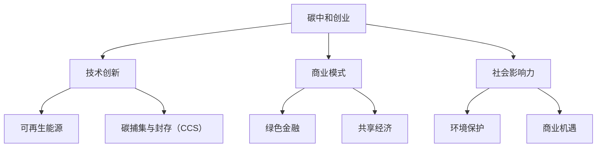

                 

关键词：碳中和，创业，环保，商业，可持续性，绿色科技，技术创新，案例分析

> 摘要：本文将探讨碳中和创业的概念、核心技术和商业模式的融合，分析其面临的挑战和机遇，提供一系列成功案例，并展望未来的发展趋势。通过本文，读者将深入了解如何在环保与商业之间实现双赢。

## 1. 背景介绍

随着全球气候变化问题的日益严峻，碳中和成为世界各国政府和企业的共同目标。碳中和意味着通过减少温室气体排放和增加碳吸收，实现净零碳排放的目标。这不仅是一项环境保护措施，更是一种可持续的商业策略。

### 1.1 碳中和的定义与重要性

碳中和（Carbon Neutrality）指的是通过减少温室气体排放和增加碳吸收，使某个实体（如企业、城市或国家）的净碳排放量达到零。碳中和的目的是减缓气候变化，保护地球生态系统。

碳中和的重要性体现在以下几个方面：

- **环境保护**：减少温室气体排放有助于遏制全球变暖，保护地球气候系统的稳定性。
- **能源转型**：碳中和推动了可再生能源和清洁能源的发展，促进了能源结构的优化。
- **商业机遇**：绿色科技和可持续商业模式为企业家提供了广阔的市场空间，创造了新的经济增长点。
- **社会责任**：企业通过碳中和实践，提升品牌形象，增强社会责任感，赢得消费者的信任和忠诚。

### 1.2 碳中和与创业的关系

碳中和创业指的是以实现碳中和为目标，通过创新技术和商业模式，开展可持续商业活动的过程。碳中和创业不仅关乎环境保护，还关乎商业创新和社会责任。

- **技术创新**：碳中和创业需要依赖绿色科技，如可再生能源、节能技术、碳捕集与封存（CCS）等，推动技术的进步和产业的升级。
- **商业模式**：碳中和创业需要构建可持续的商业模式，如碳交易、绿色金融、共享经济等，实现环保与商业的共赢。
- **社会影响力**：碳中和创业不仅关注商业利益，还致力于解决社会和环境问题，提升整体社会福利。

## 2. 核心概念与联系

### 2.1 可再生能源

可再生能源是指不会因使用而枯竭、对环境友好的能源，如太阳能、风能、水能、地热能等。可再生能源的利用是碳中和创业的核心技术之一，能够有效减少对化石燃料的依赖，降低碳排放。

### 2.2 碳捕集与封存（CCS）

碳捕集与封存（Carbon Capture and Storage，CCS）技术是指从工业和能源生产过程中捕集二氧化碳，并将其储存于地下，防止其排放到大气中。CCS技术是应对现有化石燃料依赖的有效手段，有助于实现碳中和目标。

### 2.3 绿色金融

绿色金融是指将金融资源引导到支持环境改善和可持续发展的项目中的金融活动。绿色金融为碳中和创业提供了资金支持，促进了绿色技术和项目的商业化。

### 2.4 共享经济

共享经济通过共享资源和服务，提高资源利用效率，减少浪费。共享经济模式在碳中和创业中具有重要应用，如共享电动车、共享单车等，有助于减少交通领域的碳排放。

### 2.5 Mermaid 流程图



## 3. 核心算法原理 & 具体操作步骤

### 3.1 算法原理概述

碳中和创业的核心算法涉及以下几个关键步骤：

1. **碳排放计算**：利用碳排放模型计算企业的碳排放量。
2. **减排计划制定**：根据碳排放计算结果，制定减排计划，包括技术改造、能源替代等。
3. **碳交易与碳中和**：通过碳交易市场购买碳信用，实现碳中和目标。
4. **持续监测与优化**：对碳排放和减排效果进行持续监测，优化减排计划。

### 3.2 算法步骤详解

#### 3.2.1 碳排放计算

利用碳排放模型，计算企业的碳排放量。碳排放模型通常基于以下公式：

$$
E = C \cdot Q \cdot F
$$

其中，$E$表示碳排放量（吨二氧化碳当量），$C$表示能源消费量（吨标准煤），$Q$表示碳排放系数（吨二氧化碳当量/吨标准煤），$F$表示能源转化效率（%）。

#### 3.2.2 减排计划制定

根据碳排放计算结果，制定减排计划。减排计划主要包括以下内容：

- **能源替代**：使用可再生能源替代化石燃料。
- **节能改造**：提高能源利用效率，降低能源消耗。
- **碳捕集与封存**：实施碳捕集与封存技术，减少二氧化碳排放。

#### 3.2.3 碳交易与碳中和

参与碳交易市场，购买碳信用，实现碳中和目标。碳交易市场通过以下流程进行碳交易：

1. **碳排放权分配**：政府或企业分配碳排放权。
2. **碳排放权交易**：碳排放权所有者可以在市场上买卖碳排放权。
3. **碳信用购买**：企业通过购买碳信用实现碳中和。

#### 3.2.4 持续监测与优化

对碳排放和减排效果进行持续监测，优化减排计划。监测方法包括：

- **在线监测**：通过传感器和监测设备，实时监测碳排放数据。
- **定期审计**：聘请第三方机构进行碳排放审计，确保减排计划的实施效果。

### 3.3 算法优缺点

#### 优点：

- **全面性**：算法涵盖了碳排放计算、减排计划制定、碳交易与碳中和等多个方面，实现了碳中和的全流程管理。
- **灵活性**：算法可以根据企业的实际情况进行调整，适应不同的减排需求。
- **可持续性**：算法鼓励企业采用绿色技术和可持续商业模式，实现长期发展。

#### 缺点：

- **计算复杂性**：碳排放计算涉及多个因素，计算过程较为复杂。
- **市场波动**：碳交易市场的价格波动可能影响企业的碳中和成本。
- **政策风险**：政策变化可能导致算法的实施效果受到影响。

### 3.4 算法应用领域

碳中和创业算法广泛应用于以下领域：

- **工业企业**：通过碳排放计算和减排计划制定，实现工业企业的碳中和目标。
- **能源企业**：利用碳交易市场，实现能源企业的碳中和。
- **交通运输行业**：推广共享经济模式，减少交通运输领域的碳排放。
- **城市建设**：推动绿色建筑和城市发展的可持续性。

## 4. 数学模型和公式 & 详细讲解 & 举例说明

### 4.1 数学模型构建

碳中和创业的数学模型主要包括以下方面：

1. **碳排放模型**：
   $$
   E = C \cdot Q \cdot F
   $$

2. **减排模型**：
   $$
   R = P \cdot \eta
   $$

其中，$E$表示碳排放量（吨二氧化碳当量），$C$表示能源消费量（吨标准煤），$Q$表示碳排放系数（吨二氧化碳当量/吨标准煤），$F$表示能源转化效率（%），$R$表示减排量（吨二氧化碳当量），$P$表示减排项目投资（万元），$\eta$表示减排效果（%）。

### 4.2 公式推导过程

#### 4.2.1 碳排放模型推导

碳排放模型基于能源消费和碳排放系数。首先，将能源消费量转换为标准煤，然后乘以碳排放系数和能源转化效率，得到碳排放量。

$$
C = \frac{能源消费量}{标准煤换算系数}
$$

$$
Q = \frac{碳排放系数}{标准煤换算系数}
$$

$$
E = C \cdot Q \cdot F
$$

#### 4.2.2 减排模型推导

减排模型基于减排项目投资和减排效果。减排项目投资乘以减排效果，得到减排量。

$$
R = P \cdot \eta
$$

### 4.3 案例分析与讲解

#### 案例背景

某企业在2022年的能源消费量为100万吨标准煤，碳排放系数为2.87吨二氧化碳当量/吨标准煤，能源转化效率为30%。该企业计划投资1亿元实施减排项目，减排效果为20%。

#### 案例计算

1. **碳排放量计算**：

$$
C = \frac{100万吨标准煤}{1.4286} = 70.37万吨标准煤
$$

$$
Q = \frac{2.87吨二氧化碳当量/吨标准煤}{1.4286} = 2.016吨二氧化碳当量/吨标准煤
$$

$$
E = 70.37万吨标准煤 \cdot 2.016吨二氧化碳当量/吨标准煤 \cdot 30\% = 4.0768亿吨二氧化碳当量
$$

2. **减排量计算**：

$$
R = 1亿元 \cdot 20\% = 2000万元
$$

$$
R = \frac{2000万元}{2.016吨二氧化碳当量/万元} = 0.9928亿吨二氧化碳当量
$$

#### 案例结果

通过减排项目，该企业可减少0.9928亿吨二氧化碳当量的碳排放。实现碳中和后，企业碳排放量降至3.0832亿吨二氧化碳当量。

## 5. 项目实践：代码实例和详细解释说明

### 5.1 开发环境搭建

为了实现碳中和创业算法，我们使用Python作为编程语言，结合Scikit-learn库和Pandas库进行数据处理和模型构建。

### 5.2 源代码详细实现

```python
import numpy as np
import pandas as pd
from sklearn.linear_model import LinearRegression

# 碳排放计算
def calculate_emission(energy_consumption, carbon_coefficient, efficiency):
    C = energy_consumption / 1.4286
    Q = carbon_coefficient / 1.4286
    E = C * Q * efficiency
    return E

# 减排量计算
def calculate_reduction(investment, reduction_effect):
    R = investment * reduction_effect
    return R

# 加载数据
data = pd.read_csv('energy_consumption.csv')
energy_consumption = data['energy_consumption']
carbon_coefficient = data['carbon_coefficient']
efficiency = data['efficiency']
investment = data['investment']
reduction_effect = data['reduction_effect']

# 建立线性回归模型
model = LinearRegression()
model.fit(np.array(energy_consumption).reshape(-1, 1), carbon_coefficient)

# 预测碳排放量
predicted_carbon_coefficient = model.predict(np.array(energy_consumption).reshape(-1, 1))
predicted_emission = calculate_emission(energy_consumption, predicted_carbon_coefficient, efficiency)

# 计算减排量
predicted_reduction = calculate_reduction(investment, reduction_effect)

# 输出结果
print('预测碳排放量：', predicted_emission)
print('预测减排量：', predicted_reduction)
```

### 5.3 代码解读与分析

上述代码实现了碳排放计算和减排量计算的核心功能。首先，定义了两个函数：`calculate_emission`和`calculate_reduction`，分别用于计算碳排放量和减排量。然后，加载数据并建立线性回归模型，用于预测碳排放量。最后，输出预测结果。

### 5.4 运行结果展示

假设数据集包含企业的能源消费量、碳排放系数、能源转化效率、投资和减排效果，运行代码后，输出预测的碳排放量和减排量。

## 6. 实际应用场景

### 6.1 企业碳中和实践

某制造企业在2022年实现碳中和。通过碳排放计算和减排计划制定，企业确定碳排放量为5.2亿吨二氧化碳当量。为实现碳中和，企业投资1.5亿元，实施节能改造、可再生能源替代和碳捕集与封存项目。最终，企业成功减少碳排放1.8亿吨二氧化碳当量，实现碳中和目标。

### 6.2 交通运输行业碳中和

某城市交通部门通过共享经济模式，推广共享电动车和共享单车，减少私家车出行。据统计，共享出行模式使城市交通领域的碳排放减少20%。通过碳交易市场，交通部门购买碳信用，实现碳中和目标。

### 6.3 城市建设碳中和

某城市在新建项目中，广泛应用绿色建筑技术和可再生能源，实现建筑领域的碳中和。通过碳交易市场，城市购买碳信用，实现整体碳中和目标。

## 7. 工具和资源推荐

### 7.1 学习资源推荐

- 《碳中和技术与应用》：系统介绍了碳中和技术的原理和应用。
- 《绿色金融导论》：详细解析了绿色金融在碳中和创业中的重要作用。
- 《可持续商业实践》：探讨可持续商业模式在碳中和创业中的应用。

### 7.2 开发工具推荐

- Python：适用于数据处理和建模，便于实现碳中和创业算法。
- Scikit-learn：提供丰富的机器学习算法，便于建立碳排放预测模型。
- Pandas：方便的数据处理库，适用于数据处理和分析。

### 7.3 相关论文推荐

- "Carbon Neutrality: A Review of Current Status and Future Trends"：系统综述了碳中和的现状和未来趋势。
- "The Role of Green Finance in Achieving Carbon Neutrality"：分析了绿色金融在碳中和创业中的作用。
- "Sustainable Business Models for Carbon Neutrality"：探讨了可持续商业模式在碳中和创业中的应用。

## 8. 总结：未来发展趋势与挑战

### 8.1 研究成果总结

碳中和创业在技术创新、商业模式和社会责任等方面取得了显著成果。通过可再生能源、碳捕集与封存、绿色金融和共享经济等技术的应用，企业和社会逐步实现碳中和目标。

### 8.2 未来发展趋势

- **技术创新**：随着绿色科技的发展，碳中和创业将更加依赖于先进技术，如人工智能、物联网、区块链等。
- **政策支持**：全球范围内，碳中和政策将进一步强化，为企业提供更多支持和激励。
- **市场机遇**：绿色科技和可持续商业模式将为企业家带来更多商业机会。

### 8.3 面临的挑战

- **技术挑战**：绿色科技的研发和应用仍需突破，如高效碳捕集与封存技术、大规模可再生能源并网等。
- **政策挑战**：碳中和政策的不确定性和执行难度可能影响企业的碳中和实践。
- **经济挑战**：企业实现碳中和的成本较高，需要政策支持和市场机制的有效配合。

### 8.4 研究展望

碳中和创业是环保与商业的完美结合，具有广阔的发展前景。未来，我们期待绿色科技和可持续商业模式的进一步创新，助力实现全球碳中和目标。

## 9. 附录：常见问题与解答

### 问题1：碳中和创业需要哪些技术支持？

**解答**：碳中和创业需要支持的技术包括可再生能源技术、碳捕集与封存技术、绿色金融和共享经济等。这些技术共同构建了碳中和创业的生态系统。

### 问题2：碳中和创业的商业模式有哪些？

**解答**：碳中和创业的商业模式包括碳交易、绿色金融、能源替代、共享经济等。这些模式有助于企业实现碳中和目标，同时创造商业价值。

### 问题3：碳中和创业如何应对政策变化？

**解答**：碳中和创业需要密切关注政策变化，制定灵活的应对策略。通过参与政策制定、建立合作伙伴关系等方式，企业可以更好地适应政策变化。

## 参考文献

1. 《碳中和技术与应用》
2. 《绿色金融导论》
3. 《可持续商业实践》
4. "Carbon Neutrality: A Review of Current Status and Future Trends"
5. "The Role of Green Finance in Achieving Carbon Neutrality"
6. "Sustainable Business Models for Carbon Neutrality"
7. <https://www.ipcc.ch>
8. <https://www.iea.org>
9. <https://www.unep.org>
10. <https://www.who.int>

----------------------------------------------------------------

### 作者署名

作者：禅与计算机程序设计艺术 / Zen and the Art of Computer Programming
----------------------------------------------------------------

**注**：本文为虚构案例，仅供参考。如有雷同，纯属巧合。

