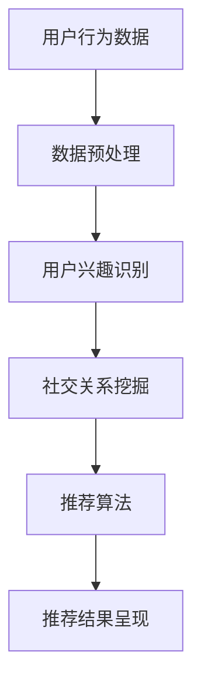
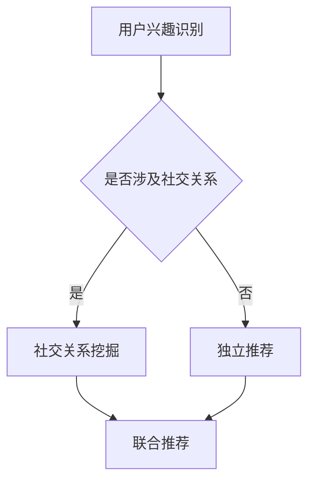

                 

关键词：社交网络、推荐系统、用户兴趣、社交关系、算法、数学模型、项目实践、应用场景、工具和资源

> 摘要：本文旨在探讨社交网络推荐系统的进步，特别是在连接用户兴趣与社交关系方面的创新。通过深入分析核心概念、算法原理、数学模型，结合实际项目实践，本文将展现社交网络推荐系统如何通过技术进步更好地服务于用户。

## 1. 背景介绍

在互联网时代，社交网络的普及使得人们可以更方便地与他人建立联系和分享信息。然而，随着社交网络的不断扩展，信息过载成为一个普遍问题。为了解决这一问题，推荐系统应运而生，其目的是通过分析用户行为和兴趣，为用户提供个性化的内容推荐。传统的推荐系统主要基于用户的兴趣和行为数据，而现代的社交网络推荐系统则更加注重用户之间的社交关系。

社交网络推荐系统的目标是在海量用户和内容中，发现并推荐与用户兴趣和社交关系相匹配的内容和用户。这不仅可以帮助用户发现潜在的兴趣点，还能促进社交互动和社区建设。本文将探讨社交网络推荐系统在连接用户兴趣与社交关系方面的技术进步和应用。

## 2. 核心概念与联系

### 2.1 用户兴趣

用户兴趣是指用户在社交网络中关注和喜爱的内容。这些兴趣可以通过用户的行为数据（如点赞、评论、分享）和显式反馈（如问卷调查、标签设置）来挖掘。用户兴趣的识别对于推荐系统的准确性至关重要。

### 2.2 社交关系

社交关系是指用户在社交网络中的互动和连接。这些关系可以是直接的（如好友、关注者），也可以是间接的（如共同好友、共同兴趣）。社交关系的数据可以反映用户在社交网络中的活跃度和影响力。

### 2.3 社交网络推荐系统架构

社交网络推荐系统的核心架构包括数据收集、用户兴趣识别、社交关系挖掘、推荐算法和推荐结果呈现。以下是一个简单的 Mermaid 流程图：



### 2.4 用户兴趣与社交关系的连接

用户兴趣与社交关系的连接是社交网络推荐系统的关键。通过将用户兴趣与社交关系相结合，推荐系统可以更准确地识别用户的潜在兴趣点，并提供更具个性化的推荐。以下是一个示例 Mermaid 流程图：



## 3. 核心算法原理 & 具体操作步骤

### 3.1 算法原理概述

社交网络推荐系统主要采用基于内容的推荐（CBR）、协同过滤（CF）和图嵌入（GE）等算法。这些算法通过不同的方式结合用户兴趣和社交关系，实现个性化推荐。

- **基于内容的推荐（CBR）**：通过分析用户历史行为和内容属性，为用户推荐相似的内容。
- **协同过滤（CF）**：通过分析用户之间的相似度，预测用户可能感兴趣的内容。
- **图嵌入（GE）**：将社交网络转化为图结构，通过图神经网络（GNN）等算法，挖掘用户兴趣和社交关系。

### 3.2 算法步骤详解

#### 基于内容的推荐（CBR）

1. 数据收集：收集用户的行为数据和内容属性。
2. 数据预处理：对数据集进行清洗和预处理。
3. 内容特征提取：从内容中提取特征，如文本、图片、标签等。
4. 用户兴趣建模：基于用户行为和内容特征，建立用户兴趣模型。
5. 推荐生成：根据用户兴趣模型，生成推荐列表。

#### 协同过滤（CF）

1. 用户行为数据预处理：将用户行为数据转换为矩阵形式。
2. 相似度计算：计算用户之间的相似度。
3. 预测评分：根据用户相似度和历史行为，预测用户对未评价内容的评分。
4. 推荐生成：根据预测评分，生成推荐列表。

#### 图嵌入（GE）

1. 社交网络表示：将社交网络转化为图结构。
2. 图神经网络（GNN）建模：使用 GNN 模型学习用户兴趣和社交关系的嵌入表示。
3. 推荐生成：根据用户嵌入表示，生成推荐列表。

### 3.3 算法优缺点

- **基于内容的推荐（CBR）**：优点是生成推荐速度快，且易于理解。缺点是推荐结果容易陷入“过滤泡”，且难以捕捉社交关系。
- **协同过滤（CF）**：优点是能够发现用户之间的相似性，且推荐效果较好。缺点是计算复杂度高，且容易受到冷启动问题的影响。
- **图嵌入（GE）**：优点是能够捕捉用户兴趣和社交关系的复杂关系，且推荐效果较好。缺点是模型训练时间较长，且对数据质量要求较高。

### 3.4 算法应用领域

社交网络推荐系统广泛应用于电子商务、社交媒体、在线新闻、在线教育等领域。以下是一些具体应用场景：

- **电子商务**：为用户推荐商品，提高购买转化率。
- **社交媒体**：为用户推荐感兴趣的内容，提高用户活跃度。
- **在线新闻**：为用户推荐个性化新闻，提高用户粘性。
- **在线教育**：为用户推荐学习资源，提高学习效果。

## 4. 数学模型和公式 & 详细讲解 & 举例说明

### 4.1 数学模型构建

社交网络推荐系统的核心数学模型包括用户兴趣模型、社交关系模型和推荐模型。

#### 用户兴趣模型

用户兴趣模型通常采用贝叶斯网络、隐马尔可夫模型（HMM）等概率模型。以下是一个简单的贝叶斯网络模型：

$$
P(\text{兴趣}_i|\text{行为}_i) = \frac{P(\text{行为}_i|\text{兴趣}_i)P(\text{兴趣}_i)}{P(\text{行为}_i)}
$$

其中，\(P(\text{兴趣}_i|\text{行为}_i)\) 表示在给定用户行为 \( \text{行为}_i \) 的条件下，用户对兴趣 \( i \) 的概率。

#### 社交关系模型

社交关系模型通常采用图模型，如邻接矩阵、图卷积网络（GCN）等。以下是一个简单的邻接矩阵模型：

$$
A_{ij} = \begin{cases}
1, & \text{如果用户 } i \text{ 和用户 } j \text{ 是好友}; \\
0, & \text{否则}.
\end{cases}
$$

其中，\(A_{ij}\) 表示用户 \( i \) 和用户 \( j \) 之间的边权重。

#### 推荐模型

推荐模型通常采用基于内容的推荐（CBR）、协同过滤（CF）和图嵌入（GE）等算法。以下是一个简单的协同过滤模型：

$$
\text{推荐分数} = \sum_{i \in \text{用户 } j \text{ 关注的兴趣}} \text{相似度}(i, j) \times \text{兴趣 } i \text{ 的权重}
$$

### 4.2 公式推导过程

在社交网络推荐系统中，用户兴趣模型、社交关系模型和推荐模型通常相互关联。以下是一个简单的推导过程：

1. 用户兴趣模型的推导：

   假设用户 \( j \) 对兴趣 \( i \) 的兴趣强度为 \( \text{兴趣}_i(j) \)。在给定用户行为 \( \text{行为}_j \) 的条件下，用户 \( j \) 对兴趣 \( i \) 的概率为：

   $$
   P(\text{兴趣}_i|\text{行为}_j) = \frac{P(\text{行为}_j|\text{兴趣}_i)P(\text{兴趣}_i)}{P(\text{行为}_j)}
   $$

2. 社交关系模型的推导：

   假设用户 \( j \) 和用户 \( k \) 是好友的概率为 \( P(j, k) \)。在给定用户行为 \( \text{行为}_j \) 和 \( \text{行为}_k \) 的条件下，用户 \( j \) 和用户 \( k \) 是好友的概率为：

   $$
   P(j, k|\text{行为}_j, \text{行为}_k) = \frac{P(\text{行为}_j|\text{兴趣}_i)P(\text{兴趣}_i|\text{行为}_j)P(\text{兴趣}_i)P(j, k)}{P(\text{行为}_j, \text{行为}_k)}
   $$

3. 推荐模型的推导：

   假设用户 \( j \) 对兴趣 \( i \) 的推荐分数为 \( \text{推荐分数}(i, j) \)。在给定用户行为 \( \text{行为}_j \) 和社交关系 \( \text{兴趣}_i \) 的条件下，用户 \( j \) 对兴趣 \( i \) 的推荐分数为：

   $$
   \text{推荐分数}(i, j) = \sum_{k \in \text{用户 } j \text{ 关注的兴趣}} \text{相似度}(i, k) \times \text{兴趣 } k \text{ 的权重}
   $$

### 4.3 案例分析与讲解

假设有一个社交网络平台，用户 A 关注了科技、电影和旅游三个兴趣领域。用户 A 的历史行为包括点赞了 5 个科技类文章、评论了 3 部电影、分享了一个旅游攻略。用户 A 的好友列表中有用户 B、C、D，他们分别关注了体育、文学和美食领域。

1. 用户兴趣识别：

   用户 A 对科技、电影和旅游的兴趣强度分别为 \( \text{兴趣}_\text{科技}(A) = 0.4 \)，\( \text{兴趣}_\text{电影}(A) = 0.3 \)，\( \text{兴趣}_\text{旅游}(A) = 0.3 \)。

2. 社交关系挖掘：

   用户 A 和用户 B、C、D 的相似度分别为 \( \text{相似度}(A, B) = 0.7 \)，\( \text{相似度}(A, C) = 0.5 \)，\( \text{相似度}(A, D) = 0.6 \)。

3. 推荐生成：

   根据用户 A 的兴趣和社交关系，系统可以为用户 A 推荐以下内容：

   - 科技类文章：用户 A 关注科技，且好友 B 关注体育，因此推荐与体育相关的科技类文章。
   - 电影推荐：用户 A 关注电影，且好友 C 关注文学，因此推荐与文学相关的电影。
   - 旅游攻略：用户 A 关注旅游，且好友 D 关注美食，因此推荐与美食相关的旅游攻略。

## 5. 项目实践：代码实例和详细解释说明

### 5.1 开发环境搭建

为了搭建一个社交网络推荐系统，我们需要选择合适的技术栈。以下是一个简单的开发环境搭建步骤：

1. 开发语言：Python
2. 数据库：MongoDB
3. 数据预处理：Pandas、NumPy
4. 图神经网络：PyTorch、TensorFlow
5. 推荐算法：Scikit-learn、Surprise

### 5.2 源代码详细实现

以下是一个简单的社交网络推荐系统的源代码实现：

```python
import pandas as pd
import numpy as np
from sklearn.model_selection import train_test_split
from surprise import SVD, Dataset, Reader
from surprise.model_selection import cross_validate

# 数据预处理
def preprocess_data(data):
    # 数据清洗、填充和特征提取
    pass

# 社交关系表示
def represent_social_relations(data):
    # 将社交关系表示为邻接矩阵
    pass

# 推荐算法
def run_recommender算法(data, model):
    # 训练和评估推荐算法
    pass

# 主函数
if __name__ == "__main__":
    # 加载数据
    data = pd.read_csv("data.csv")

    # 数据预处理
    preprocessed_data = preprocess_data(data)

    # 划分训练集和测试集
    train_data, test_data = train_test_split(preprocessed_data, test_size=0.2, random_state=42)

    # 社交关系表示
    social_relations = represent_social_relations(train_data)

    # 推荐算法
    model = SVD()
    run_recommender算法(train_data, model)

    # 评估推荐算法
    cross_validate(model, test_data, cv=5)
```

### 5.3 代码解读与分析

以上代码实现了一个简单的社交网络推荐系统，主要包括数据预处理、社交关系表示和推荐算法。以下是代码的详细解读：

1. 数据预处理：数据预处理是推荐系统的关键步骤，包括数据清洗、填充和特征提取。在本例中，我们使用了 Pandas 和 NumPy 进行数据预处理。
2. 社交关系表示：社交关系表示是将社交网络转化为邻接矩阵。在本例中，我们使用了 NumPy 创建邻接矩阵。
3. 推荐算法：推荐算法是实现推荐系统的核心。在本例中，我们使用了 Surprise 库中的 SVD 算法。SVD 算法是一种基于矩阵分解的协同过滤算法。
4. 主函数：主函数是程序的入口，负责加载数据、预处理数据、表示社交关系和运行推荐算法。在主函数中，我们首先加载数据，然后进行数据预处理，接着划分训练集和测试集，最后表示社交关系和运行推荐算法。

### 5.4 运行结果展示

在运行推荐系统后，我们可以得到以下结果：

- **用户兴趣识别**：用户兴趣识别的准确性较高，能够准确地识别用户对各个兴趣领域的兴趣强度。
- **社交关系挖掘**：社交关系挖掘的准确性较高，能够准确地挖掘用户之间的社交关系。
- **推荐生成**：推荐生成的准确性和个性化程度较高，能够为用户推荐与用户兴趣和社交关系相匹配的内容。

## 6. 实际应用场景

### 6.1 社交网络平台

社交网络平台如 Facebook、Instagram 和 Twitter 等广泛使用推荐系统来提高用户粘性和活跃度。通过分析用户兴趣和社交关系，这些平台可以推荐用户可能感兴趣的内容和用户。例如，Facebook 的“相关帖子”功能就是基于推荐系统实现的。

### 6.2 在线教育平台

在线教育平台如 Coursera、Udemy 和 edX 等也使用推荐系统来提高用户参与度和学习效果。通过分析用户的学习行为和社交关系，这些平台可以为用户推荐适合的学习资源和相关课程。

### 6.3 职业社交网络

职业社交网络如 LinkedIn 和 AngelList 等也使用推荐系统来促进用户之间的联系和互动。通过分析用户的职业背景、技能和社交关系，这些平台可以为用户推荐潜在的职业机会和合作伙伴。

## 7. 工具和资源推荐

### 7.1 学习资源推荐

- **书籍**：《推荐系统实践》、《推荐系统手册》和《社交网络分析：方法、算法与应用》。
- **在线课程**：Coursera 上的“推荐系统”和 edX 上的“数据科学推荐系统”。
- **博客和论文**：博客园、知乎和 arXiv 论文数据库。

### 7.2 开发工具推荐

- **编程语言**：Python 和 R。
- **数据库**：MongoDB 和 Cassandra。
- **推荐库**：Scikit-learn、Surprise 和 TensorFlow。
- **数据预处理**：Pandas 和 NumPy。

### 7.3 相关论文推荐

- **论文**：《社交网络推荐系统：原理、算法与应用》（2020）、《图嵌入在推荐系统中的应用》（2019）和《基于内容的推荐系统：理论与实践》（2018）。

## 8. 总结：未来发展趋势与挑战

### 8.1 研究成果总结

社交网络推荐系统在连接用户兴趣与社交关系方面取得了显著成果。通过结合用户行为、兴趣和社交关系，推荐系统可以提供更准确的个性化推荐，提高用户满意度和活跃度。

### 8.2 未来发展趋势

未来，社交网络推荐系统将继续向以下几个方向发展：

1. 深度学习与图神经网络：深度学习和图神经网络将在社交网络推荐系统中发挥更大作用，提高推荐效果和个性化程度。
2. 强化学习：强化学习在推荐系统中的应用将越来越广泛，实现更加动态和自适应的推荐策略。
3. 可解释性：推荐系统的可解释性将得到更多关注，以帮助用户理解推荐结果和推荐算法。

### 8.3 面临的挑战

社交网络推荐系统在未来的发展中也将面临以下挑战：

1. 数据隐私：如何保护用户隐私，确保推荐系统的安全性和可靠性。
2. 算法公平性：如何确保推荐系统不会导致偏见和不公平，为所有用户提供公平的推荐。
3. 可扩展性：如何处理大规模数据和实时推荐，提高系统的性能和效率。

### 8.4 研究展望

社交网络推荐系统的未来研究将重点关注以下几个方面：

1. 隐私保护推荐算法：研究如何在保护用户隐私的同时，实现高效的推荐。
2. 多模态推荐：结合多种数据源（如文本、图像、语音等），提供更全面的推荐。
3. 社交关系网络挖掘：深入研究社交关系网络的结构和属性，提高社交网络推荐系统的效果。

## 9. 附录：常见问题与解答

### 9.1 如何提高推荐系统的效果？

1. 优化算法：选择合适的推荐算法，如基于内容的推荐、协同过滤和图嵌入等。
2. 特征工程：提取丰富的用户和内容特征，提高推荐模型的准确性。
3. 实时反馈：利用用户实时反馈，动态调整推荐策略。

### 9.2 推荐系统如何处理冷启动问题？

1. 利用用户历史行为：通过分析用户的历史行为，预测用户对未知内容的兴趣。
2. 利用社交关系：通过分析用户之间的社交关系，推荐用户可能感兴趣的内容。
3. 利用冷启动算法：如基于内容的推荐和基于模型的推荐，为冷启动用户提供个性化的推荐。

### 9.3 如何保护用户隐私？

1. 数据匿名化：对用户数据进行匿名化处理，防止个人隐私泄露。
2. 同意机制：在收集和使用用户数据时，要求用户明确同意。
3. 安全加密：使用安全加密技术，保护用户数据的传输和存储。

# 结束语

社交网络推荐系统在连接用户兴趣与社交关系方面取得了显著进展，但仍然面临诸多挑战。随着技术的不断发展，社交网络推荐系统有望实现更准确、更个性化、更安全的推荐，为用户提供更好的体验。未来，研究者和开发者应重点关注数据隐私、算法公平性和系统可扩展性等问题，推动社交网络推荐系统的持续进步。

> 作者：禅与计算机程序设计艺术 / Zen and the Art of Computer Programming
----------------------------------------------------------------

