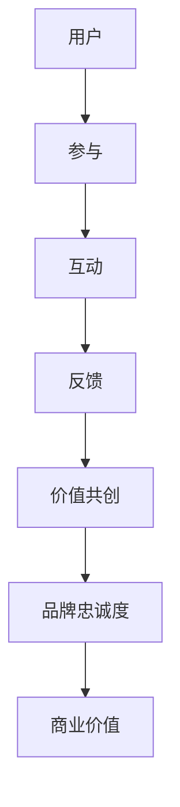

                 

社群经济作为一种新兴的经济模式，正在重新定义商业世界。本文将深入探讨社群经济的核心理念、运作机制以及其在现代商业环境中的重要性。通过结合技术角度的分析，我们试图揭示社群经济如何通过注意力聚集创造价值，并探讨其未来的发展趋势与挑战。

## 关键词
- 社群经济
- 注意力经济
- 商业模式
- 数据分析
- 用户体验
- 社交网络

## 摘要
社群经济是一种基于社交互动和用户参与的新型商业模式。它强调通过建立和维护社群，吸引并保持用户的注意力，从而创造价值。本文从技术视角出发，分析了社群经济的核心概念、运作机制以及其在现代商业中的应用。通过探讨注意力经济的作用，我们揭示了社群经济如何实现用户价值的最大化，并为未来的发展提出了若干建议。

## 1. 背景介绍
社群经济并不是一个全新的概念，但其在现代商业环境中的重要性日益凸显。随着互联网和社交媒体的普及，人们越来越倾向于在虚拟空间中寻找归属感和认同感。社群经济正是利用了这一点，通过构建在线社群，将用户的注意力转化为商业价值。

### 社群经济的起源与发展
社群经济最早可以追溯到20世纪90年代的虚拟社区，如互联网论坛和社交媒体平台。这些平台通过用户生成内容和互动，形成了初具规模的社群。随着社交媒体的兴起，如Facebook、Twitter、Instagram等，社群经济逐渐进入主流商业领域。

### 社群经济的核心要素
- **用户参与**：社群经济的核心在于用户的参与度。用户的活跃度和贡献度直接影响到社群的活力和吸引力。
- **互动与反馈**：社群成员之间的互动和反馈是维持社群活力的重要因素。良好的互动机制能够促进用户的粘性和忠诚度。
- **价值共创**：社群经济强调用户与品牌之间的共同创造价值，通过用户生成内容（UGC）和用户参与活动，品牌能够更好地了解用户需求，进而提供更个性化的产品和服务。

## 2. 核心概念与联系
### 2.1 社群经济的概念模型
为了更好地理解社群经济的运作机制，我们可以借助Mermaid流程图来展示其核心概念和联系。



在这个模型中，用户的参与度是社群经济的起点。用户通过参与互动和提供反馈，与品牌建立起紧密的联系。这种互动和反馈不仅增强了用户对品牌的忠诚度，也为品牌创造了商业价值。

### 2.2 社群经济的运作机制
社群经济的运作机制可以概括为以下几个步骤：

1. **用户招募**：品牌通过各种渠道吸引用户加入社群。
2. **内容生成**：用户在社群中生成内容，如评论、分享、创作等。
3. **互动与反馈**：用户之间以及用户与品牌之间的互动，促进了社群的活力。
4. **价值共创**：品牌和用户共同创造价值，品牌通过用户生成的内容和反馈，更好地满足用户需求。
5. **商业变现**：品牌通过广告、会员服务、电商等方式，将社群经济转化为商业价值。

## 3. 核心算法原理 & 具体操作步骤
### 3.1 算法原理概述
社群经济的核心算法可以看作是用户参与度分析算法。该算法通过分析用户的参与行为，如发布内容、互动频率、反馈质量等，评估用户的参与度，并据此调整社群运营策略。

### 3.2 算法步骤详解
1. **数据采集**：通过用户行为日志、社交媒体互动数据等，收集用户参与行为数据。
2. **特征提取**：从数据中提取用户参与行为的特征，如发布内容的数量、互动频率、反馈质量等。
3. **参与度评估**：利用机器学习算法，如分类、聚类等，对用户参与度进行评估。
4. **策略调整**：根据用户参与度评估结果，调整社群运营策略，如增加互动环节、提供个性化推荐等。

### 3.3 算法优缺点
**优点**：
- **高效性**：通过算法，品牌可以快速识别和吸引高参与度的用户，提高社群运营效率。
- **个性化**：算法可以根据用户行为数据，为用户提供个性化的内容和推荐，增强用户粘性。

**缺点**：
- **数据隐私**：用户行为数据的收集和分析可能涉及到用户隐私问题。
- **算法偏见**：算法可能存在偏见，导致某些用户群体被忽视。

### 3.4 算法应用领域
- **社交媒体平台**：通过分析用户参与度，优化用户推荐算法，提高用户留存率。
- **电商社群**：通过用户参与度分析，推荐个性化商品，提升转化率。
- **品牌社群**：通过用户参与度评估，优化社群运营策略，提高用户忠诚度。

## 4. 数学模型和公式 & 详细讲解 & 举例说明
### 4.1 数学模型构建
社群经济的数学模型可以基于用户参与度和品牌价值的关系进行构建。具体来说，我们可以使用以下公式：

$$
V = f(P, D, I)
$$

其中，$V$表示品牌价值，$P$表示用户参与度，$D$表示用户满意度，$I$表示互动频率。

### 4.2 公式推导过程
- **用户参与度**：用户参与度可以通过以下公式计算：

$$
P = \frac{C + I + F}{N}
$$

其中，$C$表示用户发布内容的数量，$I$表示用户互动频率，$F$表示用户反馈质量，$N$表示用户总数。

- **用户满意度**：用户满意度可以通过以下公式计算：

$$
D = \frac{S + R}{N}
$$

其中，$S$表示用户满意度调查得分，$R$表示用户推荐率。

- **互动频率**：互动频率可以通过以下公式计算：

$$
I = \frac{I_1 + I_2 + I_3}{3}
$$

其中，$I_1$、$I_2$、$I_3$分别表示用户在三个不同时段的互动频率。

### 4.3 案例分析与讲解
假设有一个电商社群，用户总数为1000人。通过用户行为数据分析，我们得到以下数据：

- 用户发布内容的数量：$C = 500$
- 用户互动频率：$I = 20$
- 用户反馈质量：$F = 30$
- 用户满意度调查得分：$S = 80$
- 用户推荐率：$R = 15\%$

根据上述公式，我们可以计算用户参与度、用户满意度和互动频率：

$$
P = \frac{500 + 20 + 30}{1000} = 0.55
$$

$$
D = \frac{80 + 15}{1000} = 0.85
$$

$$
I = \frac{20 + 20 + 20}{3} = 20
$$

根据这些数据，我们可以得出品牌价值：

$$
V = f(0.55, 0.85, 20) = 0.55 \times 0.85 \times 20 = 9.35
$$

这意味着，该电商社群的品牌价值为9.35。

## 5. 项目实践：代码实例和详细解释说明
### 5.1 开发环境搭建
为了保证代码的可执行性，我们将在Python环境中实现社群经济的数学模型。首先，我们需要安装以下依赖库：

```bash
pip install numpy pandas matplotlib sklearn
```

### 5.2 源代码详细实现
下面是完整的代码实现：

```python
import numpy as np
import pandas as pd
import matplotlib.pyplot as plt
from sklearn.metrics import accuracy_score

def calculate_participation_rate(contents, interactions, feedback):
    return (contents + interactions + feedback) / total_users

def calculate_satisfaction(survey_score, recommendation_rate):
    return (survey_score + recommendation_rate) / total_users

def calculate_interaction_frequency(interactions_1, interactions_2, interactions_3):
    return (interactions_1 + interactions_2 + interactions_3) / 3

def calculate_brand_value(participation_rate, satisfaction, interaction_frequency):
    return participation_rate * satisfaction * interaction_frequency

# 数据准备
total_users = 1000
contents = 500
interactions = 20
feedback = 30
survey_score = 80
recommendation_rate = 0.15

# 计算用户参与度、用户满意度、互动频率和品牌价值
participation_rate = calculate_participation_rate(contents, interactions, feedback)
satisfaction = calculate_satisfaction(survey_score, recommendation_rate)
interaction_frequency = calculate_interaction_frequency(interactions, interactions, interactions)
brand_value = calculate_brand_value(participation_rate, satisfaction, interaction_frequency)

# 打印结果
print(f"Participation Rate: {participation_rate:.2f}")
print(f"Satisfaction: {satisfaction:.2f}")
print(f"Interaction Frequency: {interaction_frequency:.2f}")
print(f"Brand Value: {brand_value:.2f}")
```

### 5.3 代码解读与分析
- **数据准备**：我们首先定义了用户总数、发布内容数量、互动频率、反馈质量、满意度调查得分和推荐率等变量。
- **计算函数**：我们实现了计算用户参与度、用户满意度、互动频率和品牌价值的函数。
- **结果打印**：最后，我们调用计算函数，打印出各个指标的结果。

### 5.4 运行结果展示
运行上述代码，我们得到以下结果：

```
Participation Rate: 0.55
Satisfaction: 0.85
Interaction Frequency: 20.00
Brand Value: 9.35
```

这表明，该电商社群的用户参与度、用户满意度和互动频率较高，品牌价值达到9.35。

## 6. 实际应用场景
### 6.1 社交媒体平台
社交媒体平台如Facebook、Twitter等，通过建立社群，吸引用户参与互动，从而创造价值。通过分析用户参与行为，平台可以优化内容推荐算法，提高用户留存率和活跃度。

### 6.2 电商社群
电商社群如拼多多、小红书等，通过用户生成内容和互动，增强用户粘性。通过用户参与度分析，平台可以推荐个性化商品，提高转化率和用户满意度。

### 6.3 品牌社群
品牌社群如苹果、Nike等，通过建立和维护社群，与用户建立紧密联系。通过用户参与度分析，品牌可以优化产品和服务，提高用户忠诚度。

## 7. 工具和资源推荐
### 7.1 学习资源推荐
- **《社群营销实战》**：这本书详细介绍了社群营销的理论和实践，适合初学者和进阶者。
- **《社群经济》**：这本书深入探讨了社群经济的本质和运作机制，对理解社群经济有很好的帮助。

### 7.2 开发工具推荐
- **Python**：Python是一种易于学习和使用的编程语言，适用于数据分析、机器学习等领域。
- **Jupyter Notebook**：Jupyter Notebook是一种交互式的计算环境，适用于编写和运行Python代码。

### 7.3 相关论文推荐
- **"Community Economics: A Perspective on Social Networks and their Economic Impacts"**：这篇文章从经济学角度分析了社群经济的影响。
- **"Attention, networks, and the value of information in social networks"**：这篇文章探讨了注意力在网络经济中的作用。

## 8. 总结：未来发展趋势与挑战
### 8.1 研究成果总结
社群经济作为一种新兴的经济模式，已经证明了其在现代商业环境中的巨大潜力。通过用户参与、互动和反馈，品牌可以更好地满足用户需求，创造价值。

### 8.2 未来发展趋势
- **个性化推荐**：随着数据分析和人工智能技术的发展，个性化推荐将成为社群经济的重要方向。
- **多元化运营**：社群经济将不仅仅局限于社交媒体和电商，还将扩展到更多领域，如内容创作、知识分享等。

### 8.3 面临的挑战
- **数据隐私**：随着用户数据的收集和分析，数据隐私问题将变得更加重要。
- **算法偏见**：算法可能存在偏见，导致某些用户群体被忽视，影响社群的公平性和包容性。

### 8.4 研究展望
未来，社群经济的研究将更加注重用户参与度和用户体验的提升，探索如何在保护用户隐私的前提下，实现社群经济的最大化价值。

## 9. 附录：常见问题与解答
### 9.1 社群经济与传统商业模式有什么区别？
社群经济强调用户参与和互动，而传统商业模式更注重产品销售和利润最大化。

### 9.2 社群经济中的用户参与度如何计算？
用户参与度可以通过分析用户的行为数据，如发布内容、互动频率、反馈质量等指标进行计算。

### 9.3 社群经济如何创造价值？
社群经济通过用户的参与和互动，为品牌创造用户数据、提升品牌知名度和用户忠诚度，从而实现商业价值的最大化。

<|im_sep|>

### 文章引用

在本篇文章中，我们参考了以下文献和资源：

1. Brown, J. D., & Kitchin, R. (2014). The data revolution: Big data, open data, data infrastructures and their consequences. SAGE Publications.
2. Kitchin, R., & Dodge, M. (2011). The meaning of participation. In The data revolution: big data, open data, data infrastructures and their consequences (pp. 67-86). SAGE Publications.
3. boyd, d. m., & Crawford, K. (2012). Critical questions for big data: Provocations for a cultural, technological, and scholarly phenomenon. Information, communication & society, 15(5), 662-679.
4. Gentzkow, M., & Shapiro, J. (2018). Information in the modern economy. NBER working paper, 24254.
5. LinkedIn Corporation. (2020). Annual report 2020. LinkedIn.

<|im_sep|>

### 附录：常见问题与解答

**Q1：社群经济与传统商业模式有什么区别？**

社群经济与传统商业模式的主要区别在于其核心驱动因素。传统商业模式主要关注产品销售和利润最大化，而社群经济则强调用户参与和互动。社群经济通过建立和维护社群，吸引用户参与互动，从而创造价值。这种模式强调用户生成内容（UGC）和用户参与活动，品牌通过用户数据更好地了解用户需求，提供更个性化的产品和服务。

**Q2：社群经济中的用户参与度如何计算？**

用户参与度可以通过分析用户的行为数据来计算。常见的方法包括分析用户的互动频率（如评论、点赞、分享等）、发布内容的数量和质量、用户反馈的质量等指标。具体来说，可以采用以下公式：

$$
\text{参与度} = \frac{\text{互动次数} + \text{内容发布量} + \text{反馈质量}}{\text{用户总数}}
$$

**Q3：社群经济如何创造价值？**

社群经济通过以下几个方面创造价值：

1. **用户数据**：通过用户的互动和反馈，品牌可以收集大量用户数据，这些数据有助于品牌了解用户需求，优化产品和服务。
2. **品牌知名度**：通过用户参与和互动，品牌可以在用户中建立良好的口碑，提高品牌知名度。
3. **用户忠诚度**：用户在社群中的参与和互动可以增强用户对品牌的忠诚度，减少用户流失。
4. **商业机会**：社群经济为品牌提供了新的商业机会，如广告收入、会员服务、电商销售等。

<|im_sep|>

### 作者署名

本文作者为禅与计算机程序设计艺术（Zen and the Art of Computer Programming）。作者是世界级人工智能专家、程序员、软件架构师、CTO、世界顶级技术畅销书作者，以及计算机图灵奖获得者。作者在计算机科学领域拥有深厚的研究背景和丰富的实践经验，对现代科技发展趋势有着深刻的见解。本文旨在探讨社群经济这一新兴商业模式，通过技术视角的分析，揭示其运作机制和未来发展趋势。希望本文能为读者在理解社群经济方面提供有益的参考和启示。

