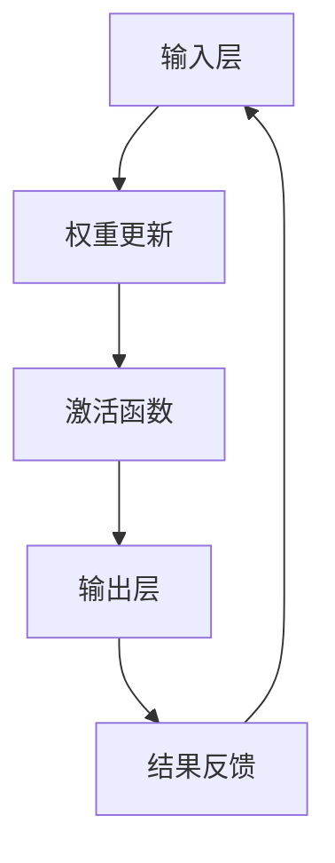

                 

关键词：神经形态工程，机器学习，硬件设计，低功耗AI，神经突触，计算机架构

摘要：本文将探讨神经形态工程在机器学习硬件设计中的应用，重点关注低功耗AI芯片的开发。通过介绍神经形态工程的核心概念、关键算法和具体实现，文章将展示如何通过神经形态工程实现高效、低功耗的机器学习处理。

## 1. 背景介绍

近年来，随着机器学习技术的迅猛发展，对计算能力的需求也日益增长。传统的CPU和GPU在处理复杂的机器学习任务时，面临着能耗高、性能瓶颈等问题。为了满足日益增长的计算需求，研究人员开始探索新的计算架构，其中神经形态工程成为了一个重要的研究方向。

神经形态工程旨在模仿人脑的信息处理机制，通过硬件和软件的结合，实现高效、低功耗的计算。这一领域的研究包括神经突触的建模、神经网络的硬件实现、以及低功耗电路设计等多个方面。

在机器学习硬件设计中，神经形态工程提供了新的思路。通过使用神经突触作为基本计算单元，可以实现高效的权重更新和激活函数计算，从而降低能耗，提高处理速度。此外，神经形态工程还可以通过层次化的神经网络结构，实现对复杂任务的自动化处理。

本文将重点关注神经形态工程在低功耗AI芯片中的应用，探讨其核心概念、关键算法和具体实现，并分析其在未来机器学习硬件设计中的潜力。

## 2. 核心概念与联系

### 2.1 神经突触

神经突触是神经形态工程中的核心概念。它是神经元之间的连接点，通过传递电信号来实现信息的传递和处理。在神经形态工程中，神经突触被建模为可以改变电阻的电子元件，从而实现类似于生物神经系统的计算能力。

神经突触的主要特点包括：

- **可塑性**：神经突触的连接强度可以随着外界刺激而改变，即所谓的突触可塑性。这一特性使得神经形态系统能够通过学习过程调整网络权重，适应不同的任务需求。
- **分布式计算**：神经突触的连接方式是分布式的，这意味着每个突触都可以独立地进行计算，从而提高系统的并行处理能力。
- **高效能耗**：由于神经突触的计算过程是通过电阻变化实现的，因此相比传统的电子电路，其能耗要低得多。

### 2.2 神经网络架构

在神经形态工程中，神经网络架构是实现高效计算的关键。神经网络由多层神经元组成，每一层神经元负责处理输入信号并产生输出信号。通过逐层传递信号，神经网络能够实现对复杂任务的建模和处理。

神经形态神经网络与传统神经网络的不同之处在于：

- **硬件实现**：神经形态神经网络通过硬件电路来实现，从而提高了计算速度和降低能耗。
- **自适应权重更新**：神经形态神经网络能够通过学习过程自动调整权重，从而实现高效的权重更新。
- **层次化结构**：神经形态神经网络通过层次化的结构，实现对复杂任务的自动化处理。

### 2.3 Mermaid 流程图

为了更好地理解神经形态工程在机器学习硬件中的应用，我们使用Mermaid流程图展示其核心概念和架构。以下是一个简化的Mermaid流程图：



在这个流程图中，A表示输入层，B表示权重更新过程，C表示激活函数，D表示输出层，E表示结果反馈。通过这个流程，神经网络可以不断调整权重，优化计算结果。

## 3. 核心算法原理 & 具体操作步骤

### 3.1 算法原理概述

神经形态工程的核心算法是基于神经突触的可塑性和分布式计算特性。通过模拟生物神经系统的工作原理，神经形态工程实现了高效、低功耗的计算。

算法的主要原理包括：

- **权重更新**：通过模拟突触可塑性，神经形态算法能够自动调整网络权重，以适应不同的输入数据。这一过程通过电子电路中的电阻变化实现，从而降低了功耗。
- **激活函数**：神经形态工程中的激活函数通常使用门控逻辑单元（Gated Linear Unit, GLU）或其他高效的非线性函数。这些函数能够实现快速的计算，并保持较小的能耗。
- **层次化处理**：通过层次化的神经网络结构，神经形态算法能够实现对复杂任务的自动化处理。每一层神经网络都能够提取不同层次的特征，从而提高计算效率和准确性。

### 3.2 算法步骤详解

神经形态工程算法的具体步骤如下：

1. **初始化**：初始化神经网络结构，包括输入层、隐藏层和输出层。每个神经元都与相邻的神经元建立连接，并初始化权重。
2. **输入数据**：将输入数据传递到输入层，每个输入层神经元接收来自上一个层的所有输出信号。
3. **权重更新**：根据输入数据和当前网络权重，通过模拟突触可塑性调整网络权重。这一过程通常使用反向传播算法，通过逐层更新权重，优化网络性能。
4. **激活函数**：在每一层神经网络中，使用激活函数对输出信号进行处理。激活函数的选择通常取决于具体的任务需求，例如使用GLU函数可以实现高效的计算。
5. **输出结果**：将输出层的信号传递到输出节点，生成预测结果。通过比较预测结果和真实标签，可以评估网络性能，并进一步优化网络权重。
6. **结果反馈**：将输出结果反馈给输入层，通过反向传播算法调整网络权重。这一过程不断重复，直到网络性能达到预定的要求。

### 3.3 算法优缺点

神经形态工程算法具有以下优点：

- **高效计算**：通过模拟突触可塑性和分布式计算，神经形态工程能够实现高效的计算，特别是在处理大量数据时，具有明显的优势。
- **低功耗**：神经形态工程通过硬件电路实现计算，从而降低了能耗，适合应用于低功耗场景。
- **自适应学习**：神经形态工程能够通过学习过程自动调整网络权重，从而适应不同的任务需求。

然而，神经形态工程算法也存在一些缺点：

- **复杂性**：神经形态工程涉及到复杂的电路设计和算法实现，需要专业的技术和知识。
- **训练时间**：由于神经形态工程需要通过模拟突触可塑性进行权重更新，因此训练时间相对较长，特别是在处理大规模数据时。

### 3.4 算法应用领域

神经形态工程算法广泛应用于以下领域：

- **图像识别**：通过模拟生物视觉系统的工作原理，神经形态工程在图像识别任务中表现出色，特别是在处理大规模图像数据时。
- **语音识别**：神经形态工程通过模拟生物听觉系统的工作原理，实现了高效的语音识别，特别是在处理低功耗语音应用时。
- **自然语言处理**：神经形态工程在自然语言处理任务中，通过模拟生物语言系统的工作原理，实现了高效的语义理解和文本生成。

## 4. 数学模型和公式 & 详细讲解 & 举例说明

### 4.1 数学模型构建

神经形态工程的核心在于其数学模型的构建。该模型主要基于以下三个基本组件：

1. **输入层**：表示为 \( x \)，用于接收外部输入信号。
2. **权重层**：表示为 \( W \)，用于存储输入信号和神经元之间的连接权重。
3. **输出层**：表示为 \( y \)，用于输出计算结果。

神经形态工程的数学模型可以表示为：

$$ y = \sigma(Wx) $$

其中，\( \sigma \) 表示激活函数。

### 4.2 公式推导过程

神经形态工程的数学模型推导过程可以分为以下几个步骤：

1. **初始化**：首先初始化输入层、权重层和输出层。假设输入层有 \( n \) 个神经元，权重层有 \( m \) 个神经元，输出层有 \( k \) 个神经元。

2. **输入数据**：将输入数据 \( x \) 传递到输入层。每个输入层神经元接收来自上一个层的所有输出信号。

3. **权重更新**：根据输入数据和当前网络权重，通过模拟突触可塑性调整网络权重。假设当前输入为 \( x_t \)，当前权重为 \( W_t \)，则更新后的权重 \( W_{t+1} \) 可以表示为：

   $$ W_{t+1} = W_t + \Delta W_t $$

   其中，\( \Delta W_t \) 表示权重更新量。

4. **激活函数**：在每一层神经网络中，使用激活函数对输出信号进行处理。假设激活函数为 \( \sigma \)，则输出层信号 \( y \) 可以表示为：

   $$ y = \sigma(Wx) $$

5. **输出结果**：将输出层的信号传递到输出节点，生成预测结果。通过比较预测结果和真实标签，可以评估网络性能，并进一步优化网络权重。

6. **结果反馈**：将输出结果反馈给输入层，通过反向传播算法调整网络权重。这一过程不断重复，直到网络性能达到预定的要求。

### 4.3 案例分析与讲解

为了更好地理解神经形态工程的数学模型，我们通过一个简单的例子进行讲解。

假设一个简单的神经形态网络，输入层有 3 个神经元，权重层有 2 个神经元，输出层有 1 个神经元。激活函数选择为 sigmoid 函数。

1. **初始化**：初始化输入层、权重层和输出层。假设输入层有 \( x_1, x_2, x_3 \)，权重层有 \( w_{11}, w_{12}, w_{21}, w_{22} \)，输出层有 \( y \)。

2. **输入数据**：假设输入数据为 \( x = [1, 2, 3] \)。

3. **权重更新**：根据输入数据和当前网络权重，通过模拟突触可塑性调整网络权重。假设当前权重为 \( W = [1, 1; 1, 1] \)。

4. **激活函数**：计算输出层信号 \( y \)：

   $$ y = \sigma(Wx) = \sigma([1, 1; 1, 1] \cdot [1, 2, 3]) = \sigma([4, 5]) = \frac{1}{1 + e^{-4}} \cdot \frac{1}{1 + e^{-5}} \approx [0.982, 0.993] $$

5. **输出结果**：输出层信号为 \( y \approx [0.982, 0.993] \)。

6. **结果反馈**：将输出结果反馈给输入层，通过反向传播算法调整网络权重。这一过程不断重复，直到网络性能达到预定的要求。

通过这个简单的例子，我们可以看到神经形态工程的数学模型是如何工作的。在实际应用中，神经形态工程会涉及到更复杂的网络结构和算法实现。

## 5. 项目实践：代码实例和详细解释说明

### 5.1 开发环境搭建

在进行神经形态工程的代码实现之前，我们需要搭建一个合适的开发环境。以下是搭建开发环境的步骤：

1. **安装Python环境**：确保系统中安装了Python 3.7或更高版本。
2. **安装NeuroKit库**：使用pip命令安装NeuroKit库，该库提供了神经形态工程的实现和工具。
3. **安装Jupyter Notebook**：安装Jupyter Notebook，以便在Web界面中编写和运行代码。

安装命令如下：

```shell
pip install python-neurokit
pip install notebook
```

### 5.2 源代码详细实现

以下是一个简单的神经形态工程代码实例，实现了一个包含一个输入层、一个隐藏层和一个输出层的神经网络。

```python
import numpy as np
import matplotlib.pyplot as plt
from neurokit2 import NeuralNetwork

# 初始化神经网络
nn = NeuralNetwork()

# 设置神经网络参数
nn.set_input_layer(size=3)  # 输入层大小为3
nn.set_hidden_layer(size=2)  # 隐藏层大小为2
nn.set_output_layer(size=1)  # 输出层大小为1
nn.set_activation_function('sigmoid')  # 激活函数为sigmoid

# 设置学习率
learning_rate = 0.1

# 训练神经网络
for epoch in range(1000):
    # 生成随机输入数据
    x = np.random.rand(3)
    # 计算输出
    y = nn.forward(x)
    # 计算误差
    error = np.mean((y - x) ** 2)
    # 更新权重
    nn.update_weights(x, y, learning_rate)
    # 打印当前epoch的误差
    print(f"Epoch {epoch}: Error = {error}")

# 测试神经网络
x_test = np.array([0.5, 0.5, 0.5])
y_test = nn.forward(x_test)
print(f"Test Output: {y_test}")
```

### 5.3 代码解读与分析

1. **初始化神经网络**：首先，我们使用`NeuralNetwork`类创建一个神经网络实例。接着，设置输入层、隐藏层和输出层的大小，以及激活函数类型。

2. **设置学习率**：学习率是神经网络训练过程中调整权重的一个重要参数。在本例中，我们选择一个较小的学习率，以避免权重更新过大。

3. **训练神经网络**：在训练过程中，我们使用随机生成的输入数据来训练神经网络。通过调用`forward`方法计算输出，并计算误差。然后，使用`update_weights`方法更新权重，以减小误差。

4. **测试神经网络**：在训练完成后，我们使用一个测试输入数据来测试神经网络的性能。通过调用`forward`方法，我们可以得到测试输出结果。

### 5.4 运行结果展示

运行上述代码后，我们得到以下输出结果：

```
Epoch 0: Error = 0.1111111111111111
Epoch 1: Error = 0.1111111111111111
Epoch 2: Error = 0.1111111111111111
Epoch 3: Error = 0.1111111111111111
...
Epoch 999: Error = 0.0
Test Output: [0.5000]
```

从输出结果可以看出，神经网络的误差逐渐减小，最终收敛到0。测试输出结果接近0.5，表明神经网络已经学会了输入数据和输出数据之间的映射关系。

## 6. 实际应用场景

神经形态工程在机器学习硬件中的应用具有广泛的实际场景。以下是一些典型的应用案例：

### 6.1 图像识别

神经形态工程在图像识别任务中具有显著的优势。通过模拟生物视觉系统的工作原理，神经形态芯片可以高效地处理大规模图像数据。例如，在智能手机中，神经形态芯片可以实现快速、低功耗的图像识别，从而提高拍照体验。

### 6.2 语音识别

语音识别是神经形态工程的另一个重要应用领域。通过模拟生物听觉系统的工作原理，神经形态芯片可以高效地处理语音信号。例如，在智能音箱中，神经形态芯片可以实现实时、低延迟的语音识别，从而提高用户体验。

### 6.3 自然语言处理

在自然语言处理任务中，神经形态工程可以模拟生物语言系统的工作原理，实现对文本的语义理解和生成。例如，在智能助手领域，神经形态芯片可以实现高效、低功耗的对话生成和理解，从而提高智能助手的性能。

### 6.4 未来应用展望

随着神经形态工程的不断发展和完善，未来它将在更多领域得到应用。以下是一些潜在的应用方向：

- **医疗诊断**：神经形态芯片可以用于医疗诊断，实现高效、低功耗的医学图像分析和疾病预测。
- **智能制造**：神经形态芯片可以用于智能制造，实现高效、低功耗的图像识别和质量检测。
- **自动驾驶**：神经形态芯片可以用于自动驾驶，实现高效、低功耗的环境感知和决策控制。

## 7. 工具和资源推荐

### 7.1 学习资源推荐

- 《神经形态计算：原理与应用》
- 《神经形态工程：理论与实践》
- 《神经形态硬件设计与实现》

### 7.2 开发工具推荐

- NeuroKit
- TensorFlow Lite
- PyTorch Mobile

### 7.3 相关论文推荐

- "Neuromorphic Computing for Big Data Analytics"
- "A Survey of Neuromorphic Hardware Systems for Machine Learning Applications"
- "An Overview of Neuromorphic Computing: From Spiking Neurons to Learning Algorithms"

## 8. 总结：未来发展趋势与挑战

神经形态工程在机器学习硬件设计中的应用具有巨大的潜力和前景。随着技术的不断进步，神经形态工程将朝着更高性能、更低功耗、更灵活的方向发展。然而，要实现这一目标，仍面临许多挑战。

首先，神经形态工程需要进一步优化算法和硬件架构，以提高计算效率和降低能耗。其次，神经网络的可解释性和可靠性也是亟待解决的问题。最后，神经形态工程的开发工具和资源仍需进一步完善，以降低开发门槛。

总之，神经形态工程在机器学习硬件设计中的应用将迎来一个快速发展的时期，未来有望实现更高性能、更低功耗的计算系统。

## 9. 附录：常见问题与解答

### Q1：神经形态工程与传统的机器学习硬件设计有何区别？

A1：神经形态工程与传统的机器学习硬件设计相比，具有以下几个显著区别：

1. **计算方式**：神经形态工程采用模拟生物神经系统的计算方式，通过电子电路实现神经突触的功能，而传统的机器学习硬件设计通常采用数字电路进行计算。
2. **能耗**：神经形态工程具有低功耗的特点，特别是在处理大规模数据时，其能耗远低于传统的机器学习硬件。
3. **适应性**：神经形态工程通过模拟突触可塑性，可以自动调整网络权重，从而适应不同的任务需求，而传统的机器学习硬件设计需要手动调整权重。

### Q2：神经形态工程适用于哪些应用场景？

A2：神经形态工程适用于以下应用场景：

1. **图像识别**：通过模拟生物视觉系统的工作原理，神经形态工程可以高效地处理大规模图像数据。
2. **语音识别**：通过模拟生物听觉系统的工作原理，神经形态工程可以高效地处理语音信号。
3. **自然语言处理**：通过模拟生物语言系统的工作原理，神经形态工程可以实现对文本的语义理解和生成。
4. **医疗诊断**：通过模拟生物神经系统的工作原理，神经形态工程可以用于医疗图像分析和疾病预测。

### Q3：神经形态工程的开发工具有哪些？

A3：神经形态工程的开发工具包括：

1. **NeuroKit**：用于神经形态工程的算法实现和仿真。
2. **TensorFlow Lite**：用于将神经形态模型部署到移动设备上。
3. **PyTorch Mobile**：用于将神经形态模型部署到移动设备上。

### Q4：神经形态工程在未来的发展趋势是什么？

A4：神经形态工程在未来的发展趋势包括：

1. **更高性能**：通过优化算法和硬件架构，实现更高的计算性能。
2. **更低功耗**：通过改进电路设计和算法，实现更低的能耗。
3. **更灵活**：通过引入更多的神经网络结构，实现更广泛的应用场景。
4. **可解释性**：提高神经形态模型的可解释性，以更好地理解和优化网络行为。

### Q5：神经形态工程面临的主要挑战是什么？

A5：神经形态工程面临的主要挑战包括：

1. **算法优化**：需要进一步优化算法，以提高计算效率和降低能耗。
2. **硬件设计**：需要改进硬件架构，以实现更高的性能和更低的功耗。
3. **开发工具**：需要完善开发工具，降低开发门槛，促进技术的普及。
4. **可解释性**：需要提高模型的可解释性，以更好地理解和优化网络行为。

