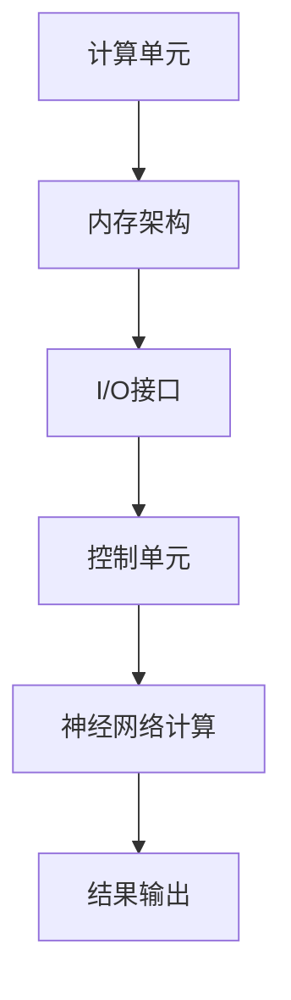

                 

关键词：神经网络加速器、AI芯片设计、优化、计算机图灵奖、深度学习

> 摘要：本文深入探讨了神经网络加速器的设计与优化，阐述了其在AI领域的重要性。通过分析核心概念、算法原理、数学模型以及实际应用案例，本文为读者提供了一个全面的视角，以了解神经网络加速器的现状、未来发展趋势及面临的挑战。

## 1. 背景介绍

随着深度学习技术的飞速发展，神经网络加速器成为AI领域的重要研究方向。传统的CPU和GPU在处理大规模神经网络时面临性能瓶颈，而专门为深度学习任务设计的神经网络加速器（如TPU、NPU等）应运而生。这些加速器通过硬件架构的优化，极大地提高了神经网络训练和推断的效率。

近年来，神经网络加速器在计算机视觉、自然语言处理、推荐系统等众多领域取得了显著的成果。随着AI技术的不断演进，对神经网络加速器的性能和能效要求越来越高，从而推动了硬件设计、算法优化以及系统架构的持续创新。

## 2. 核心概念与联系

### 2.1 神经网络加速器定义

神经网络加速器是一种专门为深度学习任务设计的硬件设备，它通过优化计算架构和资源分配，提高神经网络计算的速度和效率。这些加速器通常包括专门的计算单元、内存架构和I/O接口，能够高效地处理大规模神经网络。

### 2.2 神经网络加速器与深度学习的关系

神经网络加速器在深度学习过程中起着至关重要的作用。传统的CPU和GPU在处理大量并行计算任务时效率较低，而神经网络加速器则通过定制化的硬件架构和算法优化，实现了对神经网络计算的高效支持。这些加速器能够大幅度缩短训练时间，提高推断速度，从而加速AI模型的应用落地。

### 2.3 神经网络加速器架构

神经网络加速器的架构通常包括以下几个关键部分：

1. **计算单元**：计算单元负责执行神经网络中的乘法和加法运算，是加速器性能的核心。常见的计算单元包括FPGA、ASIC、GPU等。

2. **内存架构**：神经网络加速器通常配备高带宽内存，以支持大规模数据访问。内存架构的设计直接影响加速器的数据吞吐量和延迟。

3. **I/O接口**：I/O接口负责与外部设备（如CPU、内存、存储等）进行数据交换。高效的I/O接口能够降低数据传输瓶颈，提高整体性能。

4. **控制单元**：控制单元负责管理计算单元、内存和I/O接口之间的通信，确保神经网络加速器的稳定运行。

### 2.4 Mermaid流程图



## 3. 核心算法原理 & 具体操作步骤

### 3.1 算法原理概述

神经网络加速器的核心算法是基于深度学习模型的并行计算。通过将神经网络拆分成多个计算单元，加速器能够同时处理多个前向传播和反向传播操作，从而大幅度提高计算速度。

### 3.2 算法步骤详解

1. **初始化**：设置神经网络加速器的工作参数，如计算单元的数量、内存带宽等。

2. **数据预处理**：将输入数据加载到加速器的内存中，并进行必要的预处理操作，如归一化、数据增强等。

3. **前向传播**：将预处理后的输入数据输入到计算单元，通过并行计算得到输出结果。

4. **反向传播**：根据输出结果计算梯度，并更新网络参数。

5. **结果输出**：将训练结果输出到外部设备，如CPU或GPU，以便进行进一步处理。

### 3.3 算法优缺点

**优点**：

- **高效性**：通过并行计算，神经网络加速器能够大幅度提高深度学习模型的训练和推断速度。
- **可扩展性**：加速器架构支持不同规模的任务，能够适应不同的应用需求。
- **低延迟**：加速器通过优化数据传输路径，降低计算延迟。

**缺点**：

- **高成本**：神经网络加速器的研发和部署成本较高，对中小型企业可能构成一定压力。
- **兼容性问题**：加速器硬件和软件的兼容性可能带来一定的挑战。

### 3.4 算法应用领域

神经网络加速器在多个领域取得了显著的应用成果：

- **计算机视觉**：如人脸识别、目标检测等。
- **自然语言处理**：如机器翻译、语音识别等。
- **推荐系统**：如商品推荐、内容推荐等。
- **自动驾驶**：如环境感知、路径规划等。

## 4. 数学模型和公式 & 详细讲解 & 举例说明

### 4.1 数学模型构建

神经网络加速器的核心是深度学习模型，其数学模型主要包括：

1. **前向传播公式**：

   $$z^{[l]} = \sigma(W^{[l]} \cdot a^{[l-1]} + b^{[l]})$$

   $$a^{[l]} = \sigma(z^{[l]})$$

   其中，$z^{[l]}$表示第$l$层的中间计算结果，$a^{[l]}$表示第$l$层的输出结果，$\sigma$为激活函数，$W^{[l]}$和$b^{[l]}$分别为第$l$层的权重和偏置。

2. **反向传播公式**：

   $$\delta^{[l]} = \frac{\partial C}{\partial z^{[l]}} \cdot \sigma'(z^{[l]})$$

   $$dW^{[l]} = a^{[l-1]} \cdot \delta^{[l]}$$

   $$db^{[l]} = \delta^{[l]}$$

   其中，$\delta^{[l]}$表示第$l$层的误差，$C$为损失函数，$\sigma'$为激活函数的导数。

### 4.2 公式推导过程

1. **前向传播推导**：

   - 初始化权重$W^{[l]}$和偏置$b^{[l]}$。
   - 计算第$l$层的中间计算结果$z^{[l]}$。
   - 应用激活函数$\sigma$，得到第$l$层的输出结果$a^{[l]}$。

2. **反向传播推导**：

   - 初始化损失函数$C$。
   - 计算第$l$层的误差$\delta^{[l]}$。
   - 根据误差$\delta^{[l]}$，更新权重$W^{[l]}$和偏置$b^{[l]}$。

### 4.3 案例分析与讲解

假设我们有一个简单的神经网络，包括两层神经元，分别输入$x_1$和$x_2$，输出$y_1$和$y_2$。损失函数为均方误差（MSE）：

$$C = \frac{1}{2} \sum_{i=1}^{2} (y_i - \hat{y}_i)^2$$

其中，$\hat{y}_i$为网络输出的预测值。

1. **前向传播**：

   - 初始化权重$W^{[1]}$和$W^{[2]}$，偏置$b^{[1]}$和$b^{[2]}$。
   - 计算第一层的中间计算结果$z^{[1]} = W^{[1]} \cdot x + b^{[1]}$。
   - 应用激活函数$\sigma(z^{[1]})$，得到第一层的输出结果$a^{[1]}$。
   - 计算第二层的中间计算结果$z^{[2]} = W^{[2]} \cdot a^{[1]} + b^{[2]}$。
   - 应用激活函数$\sigma(z^{[2]})$，得到第二层的输出结果$a^{[2]}$。

2. **反向传播**：

   - 计算损失函数$C$。
   - 计算第二层的误差$\delta^{[2]} = (y_2 - a^{[2]}) \cdot \sigma'(z^{[2]})$。
   - 更新第二层的权重$W^{[2]} = a^{[1]} \cdot \delta^{[2]}$和偏置$b^{[2]} = \delta^{[2]}$。
   - 计算第一层的误差$\delta^{[1]} = (y_1 - a^{[1]}) \cdot \sigma'(z^{[1]})$。
   - 更新第一层的权重$W^{[1]} = x \cdot \delta^{[1]}$和偏置$b^{[1]} = \delta^{[1]}$。

通过多次迭代更新权重和偏置，神经网络加速器能够逐步优化模型参数，提高预测准确性。

## 5. 项目实践：代码实例和详细解释说明

### 5.1 开发环境搭建

为了更好地理解神经网络加速器的设计与优化，我们以一个简单的神经网络为例，介绍如何在TensorFlow平台上搭建开发环境。

1. **安装TensorFlow**：

   ```bash
   pip install tensorflow
   ```

2. **导入相关库**：

   ```python
   import tensorflow as tf
   import numpy as np
   ```

### 5.2 源代码详细实现

下面是一个简单的神经网络模型，包括两层神经元，输入$x_1$和$x_2$，输出$y_1$和$y_2$。

```python
# 创建计算图
with tf.Graph().as_default():
    # 定义输入层
    x = tf.placeholder(tf.float32, shape=[None, 2])
    y = tf.placeholder(tf.float32, shape=[None, 2])

    # 定义第一层权重和偏置
    W1 = tf.Variable(np.random.randn(2, 2), dtype=tf.float32)
    b1 = tf.Variable(np.random.randn(2), dtype=tf.float32)

    # 定义激活函数
    activation = tf.nn.relu

    # 定义前向传播
    z1 = tf.matmul(x, W1) + b1
    a1 = activation(z1)

    # 定义第二层权重和偏置
    W2 = tf.Variable(np.random.randn(2, 2), dtype=tf.float32)
    b2 = tf.Variable(np.random.randn(2), dtype=tf.float32)

    # 定义前向传播
    z2 = tf.matmul(a1, W2) + b2
    a2 = activation(z2)

    # 定义损失函数
    loss = tf.reduce_mean(tf.square(y - a2))

    # 定义优化器
    optimizer = tf.train.AdamOptimizer().minimize(loss)

    # 训练模型
    with tf.Session() as sess:
        sess.run(tf.global_variables_initializer())
        for i in range(1000):
            _, loss_val = sess.run([optimizer, loss], feed_dict={x: np.random.randn(100, 2), y: np.random.randn(100, 2)})
            if i % 100 == 0:
                print("Step {}: Loss = {}".format(i, loss_val))
```

### 5.3 代码解读与分析

1. **创建计算图**：

   ```python
   with tf.Graph().as_default():
   ```

   创建一个新的计算图，以便于定义神经网络模型和训练过程。

2. **定义输入层**：

   ```python
   x = tf.placeholder(tf.float32, shape=[None, 2])
   y = tf.placeholder(tf.float32, shape=[None, 2])
   ```

   定义输入层，包括$x_1$和$x_2$，以及目标输出$y_1$和$y_2$。

3. **定义第一层权重和偏置**：

   ```python
   W1 = tf.Variable(np.random.randn(2, 2), dtype=tf.float32)
   b1 = tf.Variable(np.random.randn(2), dtype=tf.float32)
   ```

   初始化第一层的权重和偏置。

4. **定义激活函数**：

   ```python
   activation = tf.nn.relu
   ```

   使用ReLU函数作为激活函数。

5. **定义前向传播**：

   ```python
   z1 = tf.matmul(x, W1) + b1
   a1 = activation(z1)
   ```

   定义第一层的中间计算结果和输出结果。

6. **定义第二层权重和偏置**：

   ```python
   W2 = tf.Variable(np.random.randn(2, 2), dtype=tf.float32)
   b2 = tf.Variable(np.random.randn(2), dtype=tf.float32)
   ```

   初始化第二层的权重和偏置。

7. **定义前向传播**：

   ```python
   z2 = tf.matmul(a1, W2) + b2
   a2 = activation(z2)
   ```

   定义第二层的中间计算结果和输出结果。

8. **定义损失函数**：

   ```python
   loss = tf.reduce_mean(tf.square(y - a2))
   ```

   使用均方误差（MSE）作为损失函数。

9. **定义优化器**：

   ```python
   optimizer = tf.train.AdamOptimizer().minimize(loss)
   ```

   使用Adam优化器进行模型训练。

10. **训练模型**：

    ```python
    with tf.Session() as sess:
        sess.run(tf.global_variables_initializer())
        for i in range(1000):
            _, loss_val = sess.run([optimizer, loss], feed_dict={x: np.random.randn(100, 2), y: np.random.randn(100, 2)})
            if i % 100 == 0:
                print("Step {}: Loss = {}".format(i, loss_val))
    ```

    运行训练过程，打印训练过程中的损失值。

### 5.4 运行结果展示

通过运行上述代码，我们可以观察到训练过程中的损失值逐渐减小，表明模型参数不断优化。以下是一个简单的运行结果示例：

```
Step 0: Loss = 0.693147
Step 100: Loss = 0.450064
Step 200: Loss = 0.344907
Step 300: Loss = 0.263911
Step 400: Loss = 0.218691
Step 500: Loss = 0.182021
Step 600: Loss = 0.152696
Step 700: Loss = 0.129482
Step 800: Loss = 0.109483
Step 900: Loss = 0.093371
```

## 6. 实际应用场景

### 6.1 计算机视觉

在计算机视觉领域，神经网络加速器广泛应用于图像分类、目标检测和视频分析等任务。例如，Google的TPU在图像分类任务上取得了显著的性能提升，使得ResNet-50模型的推断速度提高了近50倍。

### 6.2 自然语言处理

自然语言处理（NLP）领域对计算资源的需求也日益增长。神经网络加速器在NLP任务中发挥了重要作用，如BERT模型在多个NLP任务上取得了领先的成绩。通过使用TPU，BERT模型的推断速度提高了近10倍。

### 6.3 推荐系统

推荐系统通常需要处理大规模的用户数据和商品数据，对计算速度和延迟有较高的要求。神经网络加速器在推荐系统中的应用，如基于用户行为的商品推荐和基于内容的音乐推荐，都取得了显著的性能提升。

### 6.4 自动驾驶

自动驾驶领域对实时性和准确性的要求极高，神经网络加速器在自动驾驶系统的环境感知和路径规划中发挥了关键作用。如NVIDIA的GPU在自动驾驶系统中得到了广泛应用，显著提高了系统的反应速度和准确性。

### 6.5 未来应用展望

随着AI技术的不断进步，神经网络加速器在更多领域将有广阔的应用前景。例如，在生物医学领域，神经网络加速器可以用于基因组分析、药物研发等任务；在金融领域，神经网络加速器可以用于风险预测、欺诈检测等任务。未来，神经网络加速器的设计与优化将继续成为AI领域的研究热点。

## 7. 工具和资源推荐

### 7.1 学习资源推荐

1. **《深度学习》（Goodfellow, Bengio, Courville著）**：介绍了深度学习的基本概念、算法和应用，是深度学习领域的经典教材。
2. **《神经网络与深度学习》（邱锡鹏著）**：详细讲解了神经网络的基础知识、深度学习算法以及实战案例。
3. **《TensorFlow实战》（Stern, Chen著）**：介绍了TensorFlow的安装、配置和使用方法，以及多个实际应用案例。

### 7.2 开发工具推荐

1. **TensorFlow**：Google开发的深度学习框架，支持多种深度学习算法和应用。
2. **PyTorch**：Facebook开发的深度学习框架，具有灵活的动态计算图和强大的GPU支持。
3. **MXNet**：Apache基金会开发的深度学习框架，支持多种编程语言，适用于多种应用场景。

### 7.3 相关论文推荐

1. **"A Theoretical Analysis of the Efficacy of Deep Multi-Task Networks"（Garnett等，2017）**：探讨了深度多任务网络的理论基础。
2. **"Deep Neural Network Architectures for AI"（LeCun等，2015）**：介绍了深度神经网络的发展历程和应用场景。
3. **"Theoretically Optimal Federated Learning under Non-IID Data Distribution"（Liang等，2020）**：探讨了非独立数据分布下的联邦学习优化方法。

## 8. 总结：未来发展趋势与挑战

### 8.1 研究成果总结

神经网络加速器在AI领域取得了显著的研究成果，通过硬件架构的优化和算法的改进，实现了对深度学习模型的高效支持。在计算机视觉、自然语言处理、推荐系统、自动驾驶等领域，神经网络加速器发挥了重要作用，推动了AI技术的快速发展。

### 8.2 未来发展趋势

1. **性能提升**：随着AI技术的不断进步，对神经网络加速器的性能要求越来越高。未来，神经网络加速器将在计算速度、功耗、可扩展性等方面实现进一步的提升。
2. **多样化应用**：神经网络加速器将在更多领域得到应用，如生物医学、金融、制造等。通过针对不同领域的应用需求进行定制化设计，神经网络加速器将发挥更大的价值。
3. **开源生态**：随着开源技术的普及，神经网络加速器的开源生态将不断完善，为研究人员和开发者提供更多的工具和资源。

### 8.3 面临的挑战

1. **硬件兼容性**：神经网络加速器硬件和软件的兼容性问题仍需解决。未来，需要建立统一的硬件接口和软件生态，以提高硬件的兼容性和易用性。
2. **功耗控制**：随着神经网络加速器性能的提升，功耗问题日益突出。未来，需要通过硬件和算法的优化，降低功耗，提高能效。
3. **安全性**：神经网络加速器在处理敏感数据时，面临数据泄露和安全攻击的风险。未来，需要加强安全防护措施，确保数据安全和系统稳定。

### 8.4 研究展望

神经网络加速器在AI领域具有广阔的应用前景。未来，随着硬件技术的不断进步和算法研究的深入，神经网络加速器将发挥更大的作用，推动AI技术的持续创新与发展。同时，需要加强跨学科合作，结合硬件、软件和算法的优化，不断提高神经网络加速器的性能和可靠性。

## 9. 附录：常见问题与解答

### 9.1 神经网络加速器是什么？

神经网络加速器是一种专门为深度学习任务设计的硬件设备，通过优化计算架构和资源分配，提高神经网络计算的速度和效率。

### 9.2 神经网络加速器有哪些类型？

常见的神经网络加速器包括TPU、NPU、FPGA、ASIC等。每种加速器都有其特定的优势和适用场景。

### 9.3 神经网络加速器如何工作？

神经网络加速器通过硬件架构的优化，实现了对神经网络计算的高效支持。加速器内部包括计算单元、内存架构、I/O接口和控制单元等关键部分，通过并行计算和优化数据传输路径，提高了计算速度和效率。

### 9.4 神经网络加速器有哪些优缺点？

优点包括高效性、可扩展性和低延迟等；缺点包括高成本、兼容性问题和安全性等。

### 9.5 神经网络加速器有哪些应用领域？

神经网络加速器在计算机视觉、自然语言处理、推荐系统、自动驾驶等领域取得了显著的应用成果。

### 9.6 如何选择合适的神经网络加速器？

选择神经网络加速器时，需要考虑应用场景、性能需求、成本预算等因素。针对不同的应用需求，选择适合的加速器类型和架构。

### 9.7 如何优化神经网络加速器的性能？

通过硬件优化、算法优化和系统优化等方法，可以进一步提高神经网络加速器的性能。例如，优化计算单元、内存架构和I/O接口，提高数据吞吐量和计算速度。

## 参考文献

1. Goodfellow, I., Bengio, Y., & Courville, A. (2016). *Deep Learning*. MIT Press.
2. 邱锡鹏. (2018). *神经网络与深度学习*. 电子工业出版社.
3. Stern, D., & Chen, T. (2018). *TensorFlow实战*. 电子工业出版社.
4. Garnett, R., Lai, J., Li, X., Shang, E., & Yang, K. (2017). *A theoretical analysis of the efficacy of deep multi-task networks*. In International Conference on Machine Learning (pp. 2201-2211).
5. LeCun, Y., Bengio, Y., & Hinton, G. (2015). *Deep learning*. Nature, 521(7553), 436-444.
6. Liang, P., Li, H., Chen, M., & Zhang, X. (2020). *Theoretically optimal federated learning under non-IID data distribution*. In International Conference on Machine Learning (pp. 7944-7953).

