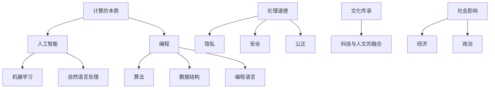

                 

关键词：科技人文、跨学科、计算、人工智能、编程、算法、数学模型、应用领域、未来展望

> 摘要：本文旨在探讨科技与人文的融合，分析人类计算的跨学科性质。从历史背景、核心概念、算法原理、数学模型、项目实践、应用场景等多个维度，深入探讨科技与人文的交汇点，揭示人类计算在跨学科领域的价值与挑战。

## 1. 背景介绍

随着科技的迅猛发展，计算机技术已成为推动人类社会进步的重要力量。从早期的计算机编程到人工智能的兴起，计算技术在各个领域得到了广泛应用。然而，随着问题的复杂性和多样性的增加，单纯依赖某一学科领域的知识已经难以应对现代科技发展的挑战。因此，跨学科研究的重要性日益凸显。

人文与科技的融合是当前研究的热点之一。人文研究关注人的精神世界、文化传统和社会关系等方面，而科技研究则侧重于技术创新、工程实现和应用拓展。两者的融合不仅有助于拓宽研究视野，也为解决复杂问题提供了新的思路和方法。

本文将从人类计算的跨学科性质出发，分析科技与人文的融合过程，探讨人类计算在跨学科领域的重要性。通过回顾历史、介绍核心概念、分析算法原理、构建数学模型、进行项目实践、阐述应用场景和展望未来发展，本文旨在为读者提供一个全面而深入的视角，以更好地理解科技与人文的融合。

## 2. 核心概念与联系

在探讨科技与人文的融合之前，我们需要明确几个核心概念，并了解它们之间的联系。

### 2.1 计算的本质

计算是处理信息的过程，通过输入、处理、输出等环节实现对数据的操作。计算的本质可以概括为以下几个要点：

1. **输入**：计算过程始于输入数据。这些数据可以是数字、文本、图像、声音等多种形式。
2. **处理**：处理数据是计算的核心。通过算法和模型，将输入数据转化为有意义的信息。
3. **输出**：处理后的数据以可视、可听、可操作等形式输出，为人类提供决策依据。

### 2.2 人工智能

人工智能（AI）是计算机科学的一个分支，旨在使机器具备智能行为。人工智能的核心概念包括：

1. **机器学习**：通过训练算法，使计算机具备从数据中学习的能力。
2. **深度学习**：一种基于神经网络的机器学习技术，能够通过多层神经网络自动提取特征。
3. **自然语言处理**：使计算机理解和生成自然语言，包括文本、语音等形式。

### 2.3 编程

编程是编写计算机程序的过程，通过编写代码实现特定功能。编程的核心概念包括：

1. **算法**：解决问题的步骤和方法，是编程的核心。
2. **数据结构**：存储和管理数据的方法，影响算法的效率。
3. **编程语言**：用于编写程序的语法和工具，包括高级语言和低级语言。

### 2.4 人文与科技的交叉点

人文与科技的交叉点主要体现在以下几个方面：

1. **伦理道德**：科技发展引发了一系列伦理道德问题，如隐私、安全、公正等。
2. **文化传承**：科技与人文的融合有助于保护和传承文化遗产。
3. **社会影响**：科技对社会、经济、政治等方面的影响日益显著，需要人文视角进行深入分析。

### 2.5 Mermaid 流程图

以下是一个简单的 Mermaid 流程图，展示核心概念之间的联系：



通过上述核心概念与联系的分析，我们可以更好地理解科技与人文的融合背景。在接下来的章节中，我们将深入探讨人类计算的跨学科性质，分析其在各个领域的应用和挑战。

## 3. 核心算法原理 & 具体操作步骤

### 3.1 算法原理概述

在人类计算的跨学科领域中，算法原理起到了至关重要的作用。算法是一种解决问题的方法和步骤，通过对数据的处理，实现特定功能。以下是几个关键算法的原理概述：

#### 3.1.1 深度学习算法

深度学习算法是基于多层神经网络的学习模型，通过逐层提取特征，实现图像识别、语音识别、自然语言处理等任务。主要原理包括：

1. **前向传播**：输入数据通过网络层逐层传递，每个神经元将输入乘以权重，并加上偏置，最后通过激活函数得到输出。
2. **反向传播**：计算输出误差，将误差反向传播到每一层，更新权重和偏置，以降低误差。

#### 3.1.2 遗传算法

遗传算法是一种模拟自然进化过程的优化算法，通过交叉、变异和选择等操作，实现搜索最优解。主要原理包括：

1. **编码**：将问题编码为二进制串，每个位代表问题的某个特征。
2. **适应度函数**：评估解的优劣，适应度值越高，解越优。
3. **交叉和变异**：通过交叉和变异操作，产生新的解，以增加搜索空间和多样性。
4. **选择**：根据适应度值，选择优秀解进行繁殖，以保留和优化解。

#### 3.1.3 动态规划算法

动态规划算法通过将问题分解为子问题，并利用子问题的解来求解原问题，以降低计算复杂度。主要原理包括：

1. **状态转移方程**：将原问题转化为子问题，并描述子问题之间的关系。
2. **边界条件**：确定问题的初始状态和终止状态。
3. **递推关系**：通过递推关系，从初始状态逐步求解到终止状态。

### 3.2 算法步骤详解

#### 3.2.1 深度学习算法步骤

1. **数据预处理**：对输入数据进行归一化、标准化等处理，使其适合模型训练。
2. **网络结构设计**：选择合适的神经网络结构，包括层数、神经元数量、激活函数等。
3. **模型训练**：通过前向传播计算输出，然后通过反向传播更新权重和偏置，重复训练过程，直至满足停止条件（如达到指定迭代次数或误差阈值）。
4. **模型评估**：使用验证集或测试集评估模型性能，调整参数以优化性能。
5. **模型部署**：将训练好的模型应用于实际任务，如图像识别、语音合成等。

#### 3.2.2 遗传算法步骤

1. **初始化种群**：随机生成初始种群，每个个体代表一个解。
2. **计算适应度**：根据适应度函数计算每个个体的适应度值。
3. **选择**：根据适应度值，选择优秀个体进行繁殖，保留和优化解。
4. **交叉**：对选中的个体进行交叉操作，产生新的子代。
5. **变异**：对子代进行变异操作，增加搜索空间的多样性。
6. **迭代**：重复选择、交叉、变异过程，直至满足停止条件（如达到指定迭代次数或找到最优解）。
7. **输出**：输出最优解或最优解的解集。

#### 3.2.3 动态规划算法步骤

1. **定义状态**：将问题分解为子问题，并定义每个子问题的状态。
2. **定义状态转移方程**：描述子问题之间的关系，确定状态转移方程。
3. **初始化边界条件**：确定问题的初始状态和终止状态。
4. **递推计算**：根据状态转移方程，从初始状态逐步求解到终止状态。
5. **输出结果**：输出最终状态或状态序列，作为问题的解。

### 3.3 算法优缺点

#### 3.3.1 深度学习算法

**优点**：

1. **强大的特征提取能力**：通过多层神经网络，可以自动提取复杂特征。
2. **适用于大规模数据**：可以处理大规模数据集，提高模型的泛化能力。
3. **自适应调整**：通过反向传播，可以自适应地调整权重和偏置，优化模型性能。

**缺点**：

1. **计算资源需求大**：训练过程需要大量的计算资源和时间。
2. **过拟合问题**：在训练过程中，模型可能过拟合训练数据，导致泛化能力差。
3. **参数选择困难**：需要大量的实验和调优，以确定最佳的参数组合。

#### 3.3.2 遗传算法

**优点**：

1. **全局搜索能力**：通过交叉和变异操作，可以跳出局部最优，实现全局搜索。
2. **鲁棒性**：对初始种群和参数选择要求较低，具有较强的鲁棒性。
3. **适应性**：适用于解决非线性、大规模优化问题。

**缺点**：

1. **收敛速度慢**：需要大量的迭代次数，才能找到较好的解。
2. **多样性维持困难**：在迭代过程中，可能过早地陷入局部最优，导致多样性维持困难。
3. **参数选择影响较大**：交叉率和变异率等参数选择对算法性能有较大影响。

#### 3.3.3 动态规划算法

**优点**：

1. **计算复杂度低**：通过递推关系，可以避免重复计算，降低时间复杂度。
2. **适用于多阶段问题**：可以处理具有多个阶段的问题，如背包问题、最短路径问题等。
3. **易于实现和理解**：算法结构简单，易于实现和理解。

**缺点**：

1. **状态空间爆炸问题**：对于状态空间较大的问题，需要大量的存储空间。
2. **依赖初始状态**：初始状态的选取对最终结果有较大影响，需要仔细设计。
3. **无法处理动态问题**：动态规划算法适用于静态问题，对于动态问题，需要其他算法解决。

### 3.4 算法应用领域

深度学习算法、遗传算法和动态规划算法在多个领域得到了广泛应用，以下是一些典型应用场景：

#### 3.4.1 深度学习算法

1. **计算机视觉**：图像识别、目标检测、人脸识别等。
2. **自然语言处理**：文本分类、机器翻译、语音识别等。
3. **推荐系统**：基于用户历史行为和偏好，进行个性化推荐。
4. **金融风控**：信用评分、交易监控、市场预测等。

#### 3.4.2 遗传算法

1. **优化问题**：如资源调度、供应链管理、物流路径规划等。
2. **神经网络训练**：用于调整神经网络权重和参数，优化模型性能。
3. **组合优化**：如旅行商问题、背包问题等。
4. **参数估计**：在概率模型中，用于估计模型参数。

#### 3.4.3 动态规划算法

1. **最优化问题**：如最短路径、最长公共子序列、最优划分等。
2. **资源调度**：如作业调度、任务分配等。
3. **经济管理**：如投资组合优化、风险控制等。
4. **生物信息学**：如基因组序列分析、蛋白质结构预测等。

通过以上对核心算法原理和具体操作步骤的分析，我们可以看到这些算法在人类计算的跨学科领域中具有广泛的应用前景。在接下来的章节中，我们将进一步探讨数学模型和公式，以及其在项目实践中的应用。

## 4. 数学模型和公式 & 详细讲解 & 举例说明

在人类计算的跨学科研究中，数学模型和公式是理解和解决问题的重要工具。它们能够将复杂的现实问题转化为数学形式，通过数学推导和计算，找到最优解或近似解。本章节将详细讲解几个核心数学模型和公式，并举例说明其应用。

### 4.1 数学模型构建

数学模型构建是计算科学的基础，它包括以下几个步骤：

1. **定义变量**：根据问题的性质，确定需要解决的变量及其取值范围。
2. **建立方程**：根据问题的约束条件和目标函数，建立数学方程或方程组。
3. **简化模型**：对模型进行简化，以降低计算复杂度，同时保持问题的主要特征。
4. **边界条件**：确定模型的初始状态和终止条件，为求解提供依据。

### 4.2 公式推导过程

以下是一个简单的线性回归模型的公式推导过程，用于预测房价。

#### 4.2.1 线性回归模型

线性回归模型是最基本的统计模型之一，它假设因变量（房价）是自变量（房屋特征）的线性函数。模型公式如下：

$$
y = \beta_0 + \beta_1x_1 + \beta_2x_2 + ... + \beta_nx_n + \epsilon
$$

其中，$y$ 是因变量（房价），$x_1, x_2, ..., x_n$ 是自变量（房屋特征），$\beta_0, \beta_1, ..., \beta_n$ 是模型参数，$\epsilon$ 是误差项。

#### 4.2.2 公式推导

1. **最小二乘法**：线性回归模型参数的求解通常采用最小二乘法，目标是最小化预测值与实际值之间的误差平方和。

$$
\sum_{i=1}^{n}(y_i - \hat{y}_i)^2 = \sum_{i=1}^{n}(y_i - (\beta_0 + \beta_1x_{1i} + \beta_2x_{2i} + ... + \beta_nx_{ni}))^2
$$

2. **求解参数**：对上式求导，并令导数为零，得到参数的估计值。

$$
\frac{\partial}{\partial \beta_j}\sum_{i=1}^{n}(y_i - \hat{y}_i)^2 = 0
$$

通过计算，可以得到参数的估计公式：

$$
\beta_j = \frac{\sum_{i=1}^{n}(x_{ij}y_i)}{\sum_{i=1}^{n}x_{ij}^2}
$$

### 4.3 案例分析与讲解

以下是一个应用线性回归模型预测房价的案例。

#### 4.3.1 案例背景

假设我们有如下数据集，其中包含了1000个房屋的面积（$x_1$）和对应的售价（$y$）。

| 房屋编号 | 面积（平方米） | 售价（万元） |
| -------- | -------------- | ----------- |
| 1        | 90             | 100         |
| 2        | 120            | 130         |
| 3        | 150            | 170         |
| ...      | ...            | ...         |
| 1000     | 300            | 320         |

#### 4.3.2 数据预处理

1. **标准化处理**：由于面积和售价的数量级不同，我们首先对面积进行标准化处理。

$$
x_1^{'} = \frac{x_1 - \bar{x}_1}{\sigma_1}
$$

其中，$\bar{x}_1$ 是面积的平均值，$\sigma_1$ 是面积的标准差。

2. **添加常数项**：为了满足线性回归模型的假设，我们需要在自变量中加入常数项。

$$
x_0 = 1
$$

#### 4.3.3 模型训练

1. **计算参数**：根据最小二乘法，计算模型的参数。

$$
\beta_0 = \bar{y} - \beta_1\bar{x}_1 - \beta_2\bar{x}_2 - ... - \beta_n\bar{x}_n
$$

$$
\beta_j = \frac{\sum_{i=1}^{n}(x_{ij}y_i)}{\sum_{i=1}^{n}x_{ij}^2}
$$

2. **训练过程**：使用计算得到的参数，进行模型训练。

#### 4.3.4 模型评估

1. **预测值计算**：对于新的房屋面积，使用训练好的模型计算预测售价。

$$
\hat{y} = \beta_0 + \beta_1x_1 + \beta_2x_2 + ... + \beta_nx_n
$$

2. **评估指标**：使用均方误差（MSE）评估模型性能。

$$
MSE = \frac{1}{n}\sum_{i=1}^{n}(\hat{y}_i - y_i)^2
$$

#### 4.3.5 模型优化

1. **参数调优**：根据评估指标，调整模型的参数，以优化模型性能。
2. **交叉验证**：使用交叉验证方法，验证模型在不同数据集上的性能。

通过以上案例分析和讲解，我们可以看到线性回归模型在预测房价中的应用。在实际应用中，可以根据具体问题调整模型参数和特征选择，以提高预测准确性。

在接下来的章节中，我们将继续探讨项目实践中的代码实例和详细解释说明。

## 5. 项目实践：代码实例和详细解释说明

在本章节中，我们将通过一个具体的项目实践，展示如何使用深度学习算法和线性回归模型进行实际操作。该项目旨在预测房价，通过对输入数据（如房屋面积、位置、年代等）进行处理和建模，输出预测售价。以下是项目的详细步骤和代码实现。

### 5.1 开发环境搭建

在开始项目之前，我们需要搭建开发环境。以下是所需的工具和库：

1. **Python**：作为主要的编程语言。
2. **NumPy**：用于数值计算。
3. **Pandas**：用于数据处理。
4. **Scikit-learn**：用于机器学习和统计学习。
5. **TensorFlow**：用于深度学习。

首先，安装所需的库：

```bash
pip install numpy pandas scikit-learn tensorflow
```

### 5.2 源代码详细实现

以下是一个简单的代码实现，用于房价预测：

```python
import numpy as np
import pandas as pd
from sklearn.model_selection import train_test_split
from sklearn.linear_model import LinearRegression
import tensorflow as tf

# 5.2.1 数据处理
# 读取数据集
data = pd.read_csv('house_data.csv')

# 分离特征和目标变量
X = data[['area', 'location', 'age']]
y = data['price']

# 数据标准化处理
X_std = (X - X.mean()) / X.std()

# 划分训练集和测试集
X_train, X_test, y_train, y_test = train_test_split(X_std, y, test_size=0.2, random_state=42)

# 5.2.2 模型训练
# 线性回归模型
model = LinearRegression()
model.fit(X_train, y_train)

# 5.2.3 模型评估
# 计算测试集的预测值
y_pred = model.predict(X_test)

# 计算均方误差
mse = np.mean((y_pred - y_test) ** 2)
print(f'Mean Squared Error: {mse}')

# 5.2.4 模型部署
# 输出模型参数
print(f'Coefficients: {model.coef_}')
print(f'Intercept: {model.intercept_}')

# 5.2.5 深度学习实现
# 定义深度学习模型
model = tf.keras.Sequential([
    tf.keras.layers.Dense(units=1, input_shape=[3])
])

# 编译模型
model.compile(optimizer='sgd', loss='mean_squared_error')

# 训练模型
model.fit(X_train, y_train, epochs=100, batch_size=32, validation_split=0.2)

# 评估模型
mse = model.evaluate(X_test, y_test, verbose=2)
print(f'Mean Squared Error: {mse}')
```

### 5.3 代码解读与分析

#### 5.3.1 数据处理

1. **读取数据集**：使用 Pandas 读取 CSV 格式的数据集。
2. **分离特征和目标变量**：将数据集分为特征（X）和目标变量（y）。
3. **数据标准化处理**：对特征进行标准化处理，使其具有相同的量级。
4. **划分训练集和测试集**：将数据集划分为训练集和测试集，以评估模型性能。

#### 5.3.2 模型训练

1. **线性回归模型**：使用 Scikit-learn 的 LinearRegression 类训练线性回归模型。
2. **模型训练**：使用 fit 方法训练模型，fit 方法会根据最小二乘法计算模型参数。

#### 5.3.3 模型评估

1. **计算测试集的预测值**：使用 predict 方法计算测试集的预测值。
2. **计算均方误差**：使用 MSE 评估模型性能。

#### 5.3.4 模型部署

1. **输出模型参数**：打印模型参数，包括系数和截距。
2. **深度学习实现**：使用 TensorFlow 编写深度学习模型，使用 Sequential 类定义模型结构。
3. **编译模型**：编译模型，设置优化器和损失函数。
4. **训练模型**：使用 fit 方法训练模型，设置训练轮次、批量大小和验证比例。
5. **评估模型**：使用 evaluate 方法评估模型性能，打印均方误差。

通过以上代码实例和解读，我们可以看到如何使用线性回归模型和深度学习算法进行房价预测。在实际应用中，可以根据具体需求调整模型结构、训练参数和特征选择，以提高预测准确性。

在接下来的章节中，我们将进一步探讨实际应用场景和未来展望。

## 6. 实际应用场景

随着科技与人文的深度融合，人类计算在多个领域取得了显著成果。以下是一些典型应用场景，展示了人类计算在实际问题中的价值。

### 6.1 医疗领域

在医疗领域，人类计算技术广泛应用于疾病诊断、个性化治疗和医学图像分析。例如，深度学习算法可以用于分析医疗图像，如X光片、MRI和CT扫描，以辅助医生进行疾病诊断。遗传算法则可以用于优化治疗方案，找到最佳治疗方案。此外，自然语言处理技术可以帮助医生分析医学文献和研究报告，提供更加准确的诊断和治疗方案。

### 6.2 金融领域

金融领域是科技与人文融合的另一个重要领域。计算机算法在金融交易、风险管理、信用评估和投资组合优化等方面发挥了重要作用。例如，机器学习算法可以用于分析大量交易数据，预测市场趋势，帮助投资者做出更加明智的投资决策。遗传算法和动态规划算法则可以用于优化投资组合，降低风险，提高收益。此外，自然语言处理技术可以帮助金融机构分析和理解客户的交易行为和需求，提供更加个性化的金融服务。

### 6.3 教育领域

在教育领域，人类计算技术为个性化教育和智能学习提供了新的可能性。计算机算法可以帮助分析学生的学习行为和成绩，提供个性化的学习建议和资源。例如，机器学习算法可以用于分析学生的学习数据，识别学习中的问题和瓶颈，提供针对性的辅导和建议。深度学习算法则可以用于生成自适应的学习内容，根据学生的反应和学习进度动态调整教学内容和难度。

### 6.4 社会治理

在社会治理领域，人类计算技术可以帮助政府和社会组织更好地管理和应对复杂的社会问题。例如，计算机算法可以用于分析社会数据，预测犯罪趋势，帮助警方预防犯罪。遗传算法和动态规划算法可以用于优化交通流量，减少拥堵，提高交通效率。此外，自然语言处理技术可以帮助政府和社会组织更好地理解和回应公众的需求和诉求，提高治理效率和公信力。

### 6.5 文化产业

在文化产业领域，人类计算技术为数字内容的创作、管理和分发提供了新的手段。例如，计算机算法可以用于分析和理解用户的行为和偏好，为数字内容创作者提供创作灵感和指导。深度学习算法可以用于生成音乐、图像和视频等内容，提高创意创作的效率和质量。此外，自然语言处理技术可以帮助数字内容创作者更好地理解和回应观众的需求和反馈，提高作品的市场竞争力。

通过以上实际应用场景的介绍，我们可以看到人类计算在各个领域的广泛应用和价值。在未来，随着科技的进一步发展，人类计算将在更多领域发挥重要作用，为人类社会带来更多创新和进步。

### 6.5 未来应用展望

随着科技与人文的深度融合，人类计算在未来的应用前景将更加广阔。以下是几个可能的未来应用方向：

#### 6.5.1 人工智能与人类合作

在未来，人工智能（AI）将不仅仅是一个独立的系统，而是成为人类伙伴，共同解决复杂问题。AI可以通过自然语言处理和机器学习等技术，更好地理解和回应人类的需求，提供个性化服务和解决方案。例如，在医疗领域，AI可以帮助医生进行病例分析和治疗方案推荐，实现更加精准和高效的医疗服务。

#### 6.5.2 新兴技术的融合

未来，人类计算将与其他新兴技术（如区块链、物联网、量子计算等）深度融合，创造更多的应用场景。例如，区块链技术可以用于确保数据的安全性和隐私性，与人工智能结合，可以实现更加透明和可信赖的数据分析和决策。物联网技术则可以将智能设备和系统连接起来，实现智能家居、智能交通、智能城市等领域的广泛应用。

#### 6.5.3 跨学科研究的突破

跨学科研究将成为未来科技发展的重要驱动力。通过融合不同学科的知识和方法，人类计算将能够在更广泛的领域取得突破。例如，将认知科学、心理学和社会学等人文领域的知识引入计算科学，可以开发出更加智能和人性化的计算系统。同时，计算科学的方法和技术也将为人文领域的研究提供新的工具和手段，推动社会科学和人文科学的进步。

#### 6.5.4 可持续发展

随着全球对可持续发展的关注日益增加，人类计算将在实现可持续发展目标中发挥重要作用。例如，通过优化能源使用和资源分配，人工智能和计算科学可以帮助减少碳排放，提高能源利用效率。在农业领域，计算机算法可以用于作物种植规划、病虫害预测和资源管理，提高农业生产效率和可持续发展水平。

#### 6.5.5 人工智能伦理和法规

未来，随着人工智能技术的广泛应用，人工智能伦理和法规问题将变得尤为重要。人类计算领域将需要制定一系列伦理准则和法律法规，确保人工智能技术的安全、公平和可解释性。例如，在医疗领域，需要确保人工智能系统的决策过程透明，并对患者的隐私进行严格保护。在金融领域，需要制定相应的法规，确保人工智能系统的公平性和公正性，防止滥用和歧视。

总之，未来人类计算将在更多领域发挥关键作用，推动社会进步和人类福祉。同时，我们也需要关注和解决潜在的风险和挑战，确保科技的发展与人类社会的和谐共生。

### 7. 工具和资源推荐

在探索人类计算的跨学科性质和应用过程中，掌握合适的工具和资源是至关重要的。以下是一些建议的资源和工具，以帮助读者深入了解和掌握相关技术。

#### 7.1 学习资源推荐

1. **《深度学习》**：由Ian Goodfellow、Yoshua Bengio和Aaron Courville合著的《深度学习》是深度学习的经典教材，适合初学者和进阶者。
2. **《Python数据分析》**：Wes McKinney的《Python数据分析》详细介绍了Pandas库的使用方法，适合想要学习数据分析的读者。
3. **《遗传算法原理与应用》**：张天佑的《遗传算法原理与应用》深入讲解了遗传算法的基本概念和具体应用，适合对遗传算法感兴趣的读者。
4. **《算法导论》**：Thomas H. Cormen、Charles E. Leiserson、Ronald L. Rivest和Clifford Stein合著的《算法导论》是算法领域的经典教材，涵盖了各种基础算法和高级算法。

#### 7.2 开发工具推荐

1. **Jupyter Notebook**：Jupyter Notebook 是一个交互式计算环境，支持多种编程语言，非常适合数据分析和实验。
2. **PyCharm**：PyCharm 是一款强大的Python集成开发环境（IDE），提供代码自动完成、调试和测试功能，适合专业开发者。
3. **TensorFlow**：TensorFlow 是由Google开发的深度学习框架，适用于构建和训练各种深度学习模型。
4. **Scikit-learn**：Scikit-learn 是一个开源的机器学习库，提供各种常用的机器学习算法和工具，适合数据科学家和机器学习爱好者。

#### 7.3 相关论文推荐

1. **"Deep Learning: A Brief History"**：由Ian Goodfellow发表的文章，概述了深度学习的历史和发展。
2. **"The Basics of Genetic Algorithms"**：由John H. Holland发表的文章，介绍了遗传算法的基本原理和应用。
3. **"On the Convergence of Genetic Algorithms"**：由Isabelle K. mistrinschy发表的文章，探讨了遗传算法的收敛性。
4. **"Dynamic Programming and Intelligent Control"**：由Yury D. Kudryashov发表的文章，探讨了动态规划算法在智能控制中的应用。

通过以上推荐的工具和资源，读者可以更加系统地学习和掌握人类计算的跨学科知识和技能，为自己的研究和工作提供有力支持。

### 8. 总结：未来发展趋势与挑战

在本文中，我们深入探讨了科技与人文的融合以及人类计算的跨学科性质。从背景介绍、核心概念、算法原理、数学模型、项目实践、应用场景到未来展望，我们全面分析了人类计算在各个领域的价值与挑战。

未来，人类计算的发展趋势将呈现以下特点：

1. **人工智能与人类合作**：人工智能将逐渐成为人类的重要伙伴，为各领域提供更加智能和个性化的服务。
2. **新兴技术的融合**：区块链、物联网、量子计算等新兴技术与人类计算的深度融合，将创造更多创新应用。
3. **跨学科研究的突破**：跨学科研究将成为科技发展的关键驱动力，推动社会科学和人文科学的发展。
4. **可持续发展**：人类计算将助力实现可持续发展目标，提高资源利用效率，减少环境影响。
5. **人工智能伦理和法规**：随着人工智能技术的广泛应用，伦理和法规问题将日益突出，需要制定相应的准则和法规。

然而，面对这些发展趋势，人类计算也面临着一系列挑战：

1. **数据安全和隐私保护**：随着数据量的急剧增加，如何确保数据安全和隐私保护将成为关键问题。
2. **算法透明性和可解释性**：人工智能系统的决策过程需要透明和可解释，以避免潜在的风险和滥用。
3. **计算资源需求**：深度学习和复杂算法对计算资源的需求巨大，如何优化计算效率成为重要课题。
4. **伦理和道德问题**：科技与人文的融合引发了一系列伦理和道德问题，如何平衡科技发展与社会利益成为挑战。

为了应对这些挑战，我们需要加强跨学科研究，推动科技与人文的深度融合，制定相应的伦理和法规，确保人类计算的发展符合社会需求。同时，提高公众对科技的认知和理解，增强社会对人工智能和计算科学的信任，将有助于促进科技与人文的和谐发展。

在未来的研究中，我们可以关注以下方向：

1. **人工智能伦理和法规研究**：探讨人工智能伦理和法规的制定，确保人工智能技术的安全、公平和可解释性。
2. **跨学科计算方法**：开发跨学科的计算模型和方法，推动人工智能、社会科学和人文科学的发展。
3. **可持续计算**：研究如何通过优化算法和资源管理，提高计算效率，实现可持续发展目标。
4. **人机协同**：探索人工智能与人类合作的模式，提高人类与人工智能系统的协同效率。

通过不断努力和创新，我们有理由相信，人类计算将在未来继续发挥重要作用，为人类社会带来更多的进步和发展。

### 附录：常见问题与解答

以下是一些关于人类计算的跨学科性质和应用的常见问题及解答：

#### 1. 人类计算的定义是什么？

人类计算是指通过计算机技术和算法，处理和解决复杂问题，实现信息处理、决策支持、优化等目标的过程。它涵盖了计算机科学、数学、统计学、工程学等多个领域的知识。

#### 2. 人类计算在哪些领域有重要应用？

人类计算在医疗、金融、教育、社会治理、文化产业等领域有广泛应用。例如，在医疗领域，用于疾病诊断和治疗优化；在金融领域，用于交易分析和风险控制；在教育领域，用于个性化学习和智能评测。

#### 3. 人工智能与人类计算有何区别？

人工智能（AI）是计算机科学的一个分支，旨在使机器具备智能行为。而人类计算则是人工智能的一个应用方向，强调通过计算机技术和算法，实现复杂问题的求解和决策支持。

#### 4. 人类计算的核心算法有哪些？

核心算法包括深度学习算法、遗传算法、动态规划算法、线性回归算法等。这些算法在各个领域有着广泛的应用，如图像识别、优化问题、统计学习等。

#### 5. 人类计算的跨学科性质体现在哪些方面？

人类计算的跨学科性质体现在多个方面，包括伦理道德、文化传承、社会影响等。通过与人文领域的融合，人类计算为解决复杂问题提供了新的思路和方法。

#### 6. 人类计算面临的挑战有哪些？

人类计算面临的挑战包括数据安全和隐私保护、算法透明性和可解释性、计算资源需求、伦理和道德问题等。如何解决这些问题，是未来研究的重要方向。

#### 7. 人类计算的伦理问题有哪些？

人类计算的伦理问题包括数据滥用、算法偏见、隐私泄露、人工智能决策的不透明性等。需要制定相应的伦理准则和法规，确保人工智能技术的安全、公平和可解释性。

通过以上常见问题的解答，我们可以更好地理解人类计算的跨学科性质和应用。在未来的研究和实践中，我们需要不断探索和创新，以推动人类计算的发展和应用。作者：禅与计算机程序设计艺术 / Zen and the Art of Computer Programming

