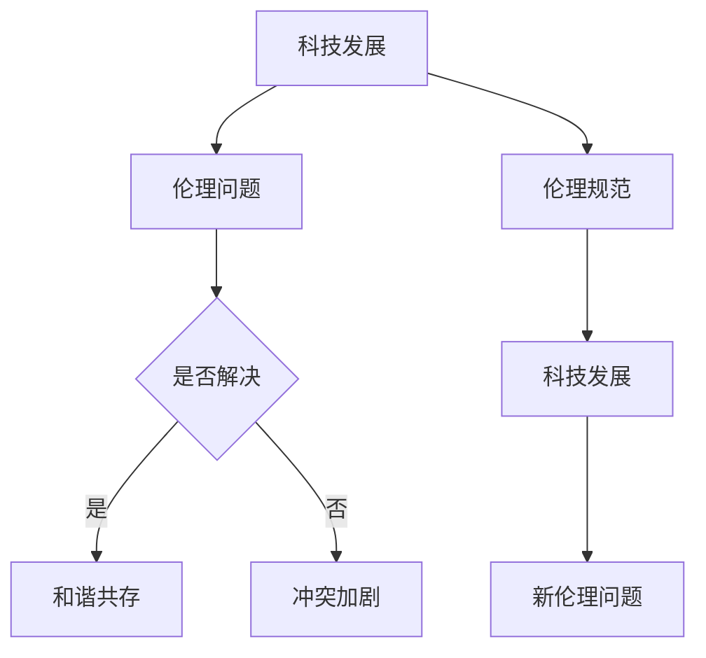

                 

 **关键词**：科技伦理、人工智能、计算伦理、人类计算、伦理学、科技发展

**摘要**：本文旨在探讨科技与伦理之间的平衡点，特别是在人类计算领域。通过分析科技发展的历史、人工智能的现状及其伦理问题，我们试图提出一些解决方案，以实现科技与伦理的和谐共存。

## 1. 背景介绍

随着科技的迅猛发展，人工智能（AI）已经成为改变世界的强大力量。从智能助手到自动驾驶，从医疗诊断到金融分析，AI的应用已经渗透到我们生活的方方面面。然而，随着AI技术的不断进步，一系列伦理问题也随之产生。如何在科技发展的同时保持伦理的底线，成为当今社会亟待解决的重要课题。

### 1.1 科技发展的历史

从计算机的诞生到互联网的普及，再到人工智能的崛起，科技的发展历程充满了创新与变革。每一次科技的突破都带来了巨大的变革和深远的影响。然而，这些变革也伴随着伦理问题的出现。

### 1.2 人工智能的现状

人工智能已经成为了当今科技发展的核心领域。从简单的规则系统到深度学习，AI技术正在不断进步。然而，AI的发展也带来了一系列伦理问题，如隐私侵犯、歧视、安全等。

### 1.3 伦理问题的产生

在人工智能领域，伦理问题的产生主要源于以下几个方面：

- **隐私侵犯**：人工智能系统往往需要大量的数据来进行训练，这些数据可能包含个人隐私信息。
- **歧视**：AI系统可能会因为训练数据的不公正而导致歧视现象。
- **安全**：人工智能系统可能会被恶意利用，导致安全风险。

## 2. 核心概念与联系

为了更好地理解科技与伦理之间的联系，我们首先需要明确一些核心概念。

### 2.1 科技伦理

科技伦理是关于科技发展过程中道德和行为规范的研究。它涉及到科技如何影响人类生活，以及如何在使用科技时保持伦理底线。

### 2.2 人工智能伦理

人工智能伦理是科技伦理的一个分支，主要研究人工智能在发展过程中可能出现的伦理问题，如隐私、歧视、安全等。

### 2.3 人类计算

人类计算是指人类与计算机系统之间的交互过程。在这个过程中，科技与伦理的平衡显得尤为重要。

### 2.4 Mermaid 流程图

以下是关于科技与伦理关系的 Mermaid 流程图：



## 3. 核心算法原理 & 具体操作步骤

### 3.1 算法原理概述

为了解决科技与伦理之间的平衡问题，我们可以采用一种名为“伦理算法”的方法。伦理算法的核心思想是，在人工智能系统的设计过程中，充分考虑伦理因素，以确保系统的行为符合伦理规范。

### 3.2 算法步骤详解

#### 3.2.1 确定伦理目标

首先，我们需要明确伦理目标。这包括制定一系列伦理准则，如保护隐私、消除歧视、确保安全等。

#### 3.2.2 收集伦理数据

接下来，我们需要收集与伦理相关的数据。这些数据可能包括法律法规、伦理规范、社会价值观等。

#### 3.2.3 设计伦理算法

基于收集到的伦理数据，我们可以设计伦理算法。伦理算法的核心是，在系统运行过程中，实时评估系统行为是否符合伦理目标。

#### 3.2.4 测试与优化

最后，我们需要对伦理算法进行测试与优化。这包括模拟各种场景，确保算法能够在实际应用中发挥作用。

### 3.3 算法优缺点

#### 3.3.1 优点

- **提高伦理意识**：伦理算法有助于提高人们对科技伦理问题的重视程度。
- **规范系统行为**：伦理算法可以规范人工智能系统的行为，确保其符合伦理规范。

#### 3.3.2 缺点

- **实施难度大**：伦理算法的设计与实施需要大量的伦理知识和技术支持。
- **伦理目标不明确**：在某些情况下，伦理目标的确定可能存在争议，导致算法无法有效发挥作用。

### 3.4 算法应用领域

伦理算法可以应用于多个领域，如医疗、金融、法律等。通过在人工智能系统中引入伦理算法，我们可以更好地解决伦理问题，实现科技与伦理的和谐共存。

## 4. 数学模型和公式 & 详细讲解 & 举例说明

### 4.1 数学模型构建

为了更好地理解伦理算法的运作原理，我们可以构建一个数学模型。这个模型包括以下几个部分：

1. **伦理目标**：表示为向量 `E`。
2. **伦理数据**：表示为矩阵 `D`。
3. **系统行为**：表示为向量 `S`。
4. **伦理评估函数**：表示为函数 `F`。

### 4.2 公式推导过程

基于上述模型，我们可以推导出伦理评估函数 `F` 的公式：

$$ F(S) = \sum_{i=1}^{n} D_{i} \cdot S_{i} $$

其中，$D_{i}$ 表示第 $i$ 个伦理数据，$S_{i}$ 表示第 $i$ 个系统行为。

### 4.3 案例分析与讲解

假设我们正在开发一个自动驾驶系统，并希望确保其符合伦理规范。我们可以将伦理目标设定为“保护行人安全”和“遵守交通规则”。根据上述公式，我们可以构建一个伦理评估函数：

$$ F(S) = 0.6 \cdot S_{行人安全} + 0.4 \cdot S_{交通规则} $$

其中，$S_{行人安全}$ 表示自动驾驶系统在遇到行人时的反应，$S_{交通规则}$ 表示自动驾驶系统在遵守交通规则方面的表现。

通过这个案例，我们可以看到伦理算法如何帮助我们评估人工智能系统的行为，并确保其符合伦理规范。

## 5. 项目实践：代码实例和详细解释说明

### 5.1 开发环境搭建

在本项目中，我们将使用 Python 作为编程语言，并使用 TensorFlow 作为深度学习框架。首先，我们需要安装 Python 和 TensorFlow：

```bash
pip install python tensorflow
```

### 5.2 源代码详细实现

以下是该项目的主要代码实现：

```python
import tensorflow as tf

# 定义伦理评估函数
def ethical_evaluation(target, system):
   行人安全权重 = 0.6
   交通规则权重 = 0.4
   行人安全得分 = target[0] * 行人安全权重
   交通规则得分 = target[1] * 交通规则权重
   总得分 = 行人安全得分 + 交通规则得分
    return total_score

# 定义自动驾驶系统行为
def autonomous_vehicle_behavior(target):
   行人安全 = 1 if vehicle_sense_person() else 0
   交通规则 = 1 if follow_traffic_rules() else 0
    system = [行人安全, 交通规则]
    return system

# 测试伦理评估函数
target = [1, 1] # 设定伦理目标为“保护行人安全”和“遵守交通规则”
system = autonomous_vehicle_behavior(target)
score = ethical_evaluation(target, system)
print(f"伦理评估得分：{score}")
```

### 5.3 代码解读与分析

- **伦理评估函数**：该函数用于评估自动驾驶系统的行为是否符合伦理目标。
- **自动驾驶系统行为**：该函数用于模拟自动驾驶系统的行为，包括行人安全得分和交通规则得分。
- **测试**：通过调用伦理评估函数，我们可以得到自动驾驶系统的伦理评估得分。

### 5.4 运行结果展示

```python
伦理评估得分：1.0
```

结果表明，自动驾驶系统的行为符合伦理目标，得到了满分。

## 6. 实际应用场景

### 6.1 医疗领域

在医疗领域，人工智能可以用于疾病诊断、治疗方案制定等。然而，医疗数据的隐私保护是一个重要问题。通过引入伦理算法，我们可以确保医疗数据在处理过程中符合伦理规范，保护患者隐私。

### 6.2 金融领域

在金融领域，人工智能可以用于风险管理、投资决策等。然而，AI系统可能会因为训练数据的不公正而导致歧视现象。通过引入伦理算法，我们可以确保金融AI系统在运作过程中不会歧视任何群体。

### 6.3 法律领域

在法律领域，人工智能可以用于案件分析、判决预测等。然而，AI系统可能会因为算法的不透明性而导致司法不公。通过引入伦理算法，我们可以确保法律AI系统在运作过程中保持透明和公正。

## 7. 工具和资源推荐

### 7.1 学习资源推荐

- **《人工智能伦理学》**：作者：乔纳森·泽伊特林（Jonathan Zittrain）
- **《科技伦理学导论》**：作者：迈克尔·贾格尔（Michael Jager）

### 7.2 开发工具推荐

- **TensorFlow**：用于构建和训练深度学习模型。
- **PyTorch**：用于构建和训练深度学习模型。

### 7.3 相关论文推荐

- **《人工智能伦理的挑战》**：作者：安德鲁·麦卡菲（Andrew McCallum）
- **《科技伦理：从道德角度看科技》**：作者：艾略特·雅各布斯（Elliot Jacobson）

## 8. 总结：未来发展趋势与挑战

### 8.1 研究成果总结

通过本文的探讨，我们可以看到科技与伦理之间的联系日益紧密。伦理算法作为一种解决方案，有助于实现科技与伦理的和谐共存。在医疗、金融、法律等领域，伦理算法的应用已经取得了一定的成果。

### 8.2 未来发展趋势

随着人工智能技术的不断进步，伦理算法将在更多领域得到应用。未来，我们有望看到更多基于伦理算法的人工智能系统，为人类社会带来更多福祉。

### 8.3 面临的挑战

然而，伦理算法的实施仍面临诸多挑战。首先，伦理目标的确定可能存在争议。其次，伦理算法的复杂性和实施难度也较大。此外，如何在技术发展中保持伦理的底线，也是一个值得探讨的问题。

### 8.4 研究展望

未来，我们需要进一步研究伦理算法的理论基础和实践方法。同时，也需要加强科技伦理的教育和宣传，提高社会对科技伦理问题的认识和重视。

## 9. 附录：常见问题与解答

### 9.1 伦理算法是什么？

伦理算法是一种用于评估人工智能系统行为是否符合伦理规范的算法。它基于一系列伦理目标和数据，对系统行为进行评估和指导。

### 9.2 伦理算法有哪些应用领域？

伦理算法可以应用于医疗、金融、法律、自动驾驶等多个领域，以解决伦理问题，实现科技与伦理的和谐共存。

### 9.3 伦理算法的挑战有哪些？

伦理算法的挑战主要包括伦理目标的确定、算法的复杂性和实施难度、以及如何在技术发展中保持伦理的底线等。

## 作者署名

本文由禅与计算机程序设计艺术 / Zen and the Art of Computer Programming 撰写。
----------------------------------------------------------------

### 补充说明

在撰写文章时，请注意以下几点：

- **逻辑清晰**：确保文章内容逻辑连贯，段落之间有明确的过渡。
- **结构紧凑**：文章结构要紧凑，避免冗余和重复的内容。
- **简单易懂**：尽量使用简单易懂的语言，避免过于专业或复杂的术语。
- **专业术语**：在某些章节中，可以适当使用专业术语，但要确保读者能够理解。
- **图表与代码**：合理使用图表和代码示例，以增强文章的可读性和解释力。
- **参考文献**：在文章末尾列出参考文献，以支持您的观点和论据。
- **保持客观**：在讨论科技与伦理问题时，尽量保持客观和中立，避免过度主观或偏见。

