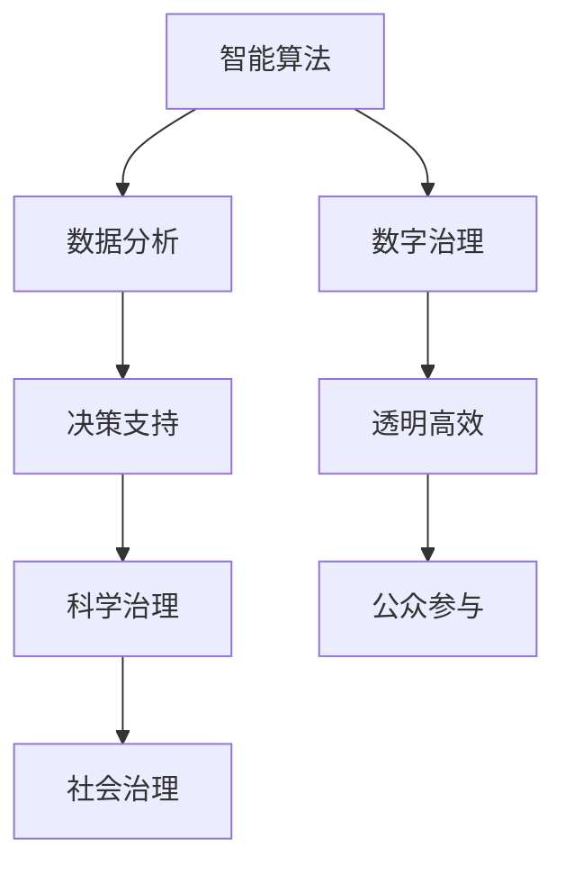

                 

关键词：社会治理、科技创新、智能算法、数据分析、数字治理

> 摘要：本文深入探讨了科技创新在社会治理领域的应用与影响，通过分析智能算法、数据分析、数字治理等核心概念，提出了未来社会治理的新思路。本文旨在为读者提供一种全新的视角，以科技为驱动，推动社会治理的智能化、高效化发展。

## 1. 背景介绍

### 社会治理的挑战

随着全球社会的快速发展，社会治理面临着诸多挑战。城市化进程加快、人口老龄化、环境问题、社会不平等、网络安全等问题日益突出。传统的治理模式已经难以适应现代社会的复杂性和动态性。因此，如何借助科技创新，提升社会治理的效率和效果，成为了一个亟待解决的问题。

### 科技创新的发展

科技创新，特别是人工智能、大数据、物联网等技术的迅猛发展，为社会治理提供了新的工具和手段。智能算法能够处理海量数据，发现潜在问题；数据分析能够提供科学依据，辅助决策；数字治理则使得社会治理更加透明、高效。

## 2. 核心概念与联系

### 智能算法

智能算法是人工智能的核心技术之一，包括机器学习、深度学习、自然语言处理等。这些算法能够从大量数据中提取有用信息，进行预测、分类、聚类等操作。

### 数据分析

数据分析是对数据进行清洗、处理、分析，从中提取有价值的信息。数据分析在社会治理中起着至关重要的作用，能够为决策提供科学依据。

### 数字治理

数字治理是指利用数字技术进行社会治理，包括电子政务、智慧城市、在线教育等。数字治理使得社会治理更加高效、透明。

下面是一个核心概念与联系的 Mermaid 流程图：



## 3. 核心算法原理 & 具体操作步骤

### 3.1 算法原理概述

智能算法的核心在于模拟人类的思维方式，通过学习和推理，实现对未知事物的认知和判断。智能算法的基本原理包括：

- **监督学习**：通过已知的数据集，训练模型，实现对未知数据的预测。
- **无监督学习**：没有预定的标签，通过数据自身的规律进行分类和聚类。
- **深度学习**：通过多层神经网络，对复杂的数据进行建模和分析。

### 3.2 算法步骤详解

1. **数据收集**：收集相关的数据，如人口数据、经济数据、环境数据等。
2. **数据预处理**：对数据进行清洗、标准化、缺失值处理等。
3. **模型选择**：根据问题的特点，选择合适的算法模型。
4. **模型训练**：使用训练数据，对模型进行训练。
5. **模型评估**：使用验证数据，对模型进行评估。
6. **模型应用**：将模型应用到实际问题中，进行预测或决策。

### 3.3 算法优缺点

**优点**：

- **高效性**：能够处理海量数据，提升工作效率。
- **准确性**：通过学习，能够提高预测和分类的准确性。
- **灵活性**：能够适应不同的场景和需求。

**缺点**：

- **复杂性**：算法模型复杂，需要专业的知识和技能。
- **数据依赖**：算法的性能依赖于数据的质量和数量。
- **隐私问题**：数据隐私和安全问题需要得到妥善解决。

### 3.4 算法应用领域

智能算法在社会治理中的应用广泛，如：

- **公共安全**：通过视频监控、人脸识别等，提高公共安全水平。
- **城市管理**：通过交通流量分析、资源调度等，提升城市管理水平。
- **社会福利**：通过数据分析，优化社会福利分配，提高公平性。

## 4. 数学模型和公式 & 详细讲解 & 举例说明

### 4.1 数学模型构建

社会治理中的数学模型通常包括以下几类：

- **预测模型**：如时间序列预测、回归分析等。
- **分类模型**：如逻辑回归、支持向量机等。
- **聚类模型**：如K-均值聚类、层次聚类等。

### 4.2 公式推导过程

以逻辑回归模型为例，其公式推导过程如下：

$$
\begin{aligned}
    & \ln\left(\frac{P(Y=1|X=x)}{1-P(Y=1|X=x)}\right) = \beta_0 + \beta_1x_1 + \beta_2x_2 + ... + \beta_nx_n \\
    & \Rightarrow P(Y=1|X=x) = \frac{1}{1 + e^{-(\beta_0 + \beta_1x_1 + \beta_2x_2 + ... + \beta_nx_n)}}
\end{aligned}
$$

### 4.3 案例分析与讲解

以某城市交通流量预测为例，使用时间序列预测模型进行预测。首先收集过去一周的交通流量数据，然后使用ARIMA模型进行预测，最后得到未来一周的交通流量预测结果。通过对预测结果的分析，可以优化交通调度，减少拥堵。

## 5. 项目实践：代码实例和详细解释说明

### 5.1 开发环境搭建

首先，我们需要搭建一个Python开发环境。安装Python、Jupyter Notebook以及相关的库，如Numpy、Pandas、Scikit-learn等。

### 5.2 源代码详细实现

以下是一个简单的Python代码示例，用于实现一个线性回归模型：

```python
import numpy as np
import pandas as pd
from sklearn.linear_model import LinearRegression
from sklearn.model_selection import train_test_split

# 数据准备
data = pd.read_csv('data.csv')
X = data[['x1', 'x2']]
y = data['y']

# 数据分割
X_train, X_test, y_train, y_test = train_test_split(X, y, test_size=0.2, random_state=42)

# 模型训练
model = LinearRegression()
model.fit(X_train, y_train)

# 模型评估
score = model.score(X_test, y_test)
print('Model Score:', score)

# 模型应用
print('Prediction:', model.predict([[x1, x2]]))
```

### 5.3 代码解读与分析

这段代码首先导入必要的库，然后读取数据，进行数据分割，训练模型，评估模型，最后使用模型进行预测。

### 5.4 运行结果展示

通过运行代码，可以得到模型的得分和预测结果。这可以帮助我们评估模型的性能，并为实际应用提供依据。

## 6. 实际应用场景

### 6.1 公共安全

智能算法在公共安全领域有着广泛的应用。通过视频监控和人工智能技术，可以对犯罪活动进行实时监测和预测，提高公共安全水平。

### 6.2 城市管理

智能算法可以用于城市交通管理、资源调度等方面。通过分析交通流量数据，可以优化交通信号控制，减少拥堵；通过分析能源使用数据，可以优化能源分配，提高能源利用效率。

### 6.3 社会福利

智能算法可以用于社会福利分配，如精准扶贫、社会福利评估等。通过分析人口数据、经济数据等，可以更准确地识别需要帮助的人群，提高社会福利的公平性和有效性。

## 7. 工具和资源推荐

### 7.1 学习资源推荐

- 《Python编程：从入门到实践》
- 《深度学习》
- 《大数据技术基础》

### 7.2 开发工具推荐

- Jupyter Notebook
- PyCharm
- VSCode

### 7.3 相关论文推荐

- "Deep Learning for Public Safety: A Review"
- "The Use of Big Data in Urban Management"
- "Artificial Intelligence in Social Welfare"

## 8. 总结：未来发展趋势与挑战

### 8.1 研究成果总结

近年来，智能算法、数据分析、数字治理等领域取得了显著的研究成果，为社会治理提供了强有力的技术支撑。

### 8.2 未来发展趋势

未来，社会治理将更加智能化、高效化。智能算法将在社会治理中发挥更加重要的作用，数据分析将成为决策的重要依据，数字治理将提升社会治理的透明度和公众参与度。

### 8.3 面临的挑战

然而，社会治理在科技创新中也面临着诸多挑战，如数据隐私、算法公平性、技术依赖等。这些挑战需要我们深入研究和解决，以实现科技驱动的社会治理。

### 8.4 研究展望

未来，社会治理的研究将朝着智能化、个性化、自适应化方向发展。通过跨学科合作，将人工智能、大数据、物联网等新技术与社会科学相结合，为社会治理提供更加全面、深入的解决方案。

## 9. 附录：常见问题与解答

### 问题1：智能算法在社会治理中的应用有哪些？

答：智能算法在社会治理中的应用包括公共安全监控、城市管理、社会福利分配等多个方面。通过视频监控、数据分析等技术，可以提升社会治理的效率和效果。

### 问题2：数据分析在社会治理中的作用是什么？

答：数据分析在社会治理中起着至关重要的作用。通过数据分析，可以提供科学依据，辅助决策，优化社会治理模式。

### 问题3：数字治理如何提升社会治理的透明度？

答：数字治理通过电子政务、智慧城市等手段，使得社会治理过程更加透明。公众可以通过互联网查询政府信息，参与社会治理，提高社会治理的透明度和公众参与度。

---

作者：禅与计算机程序设计艺术 / Zen and the Art of Computer Programming


