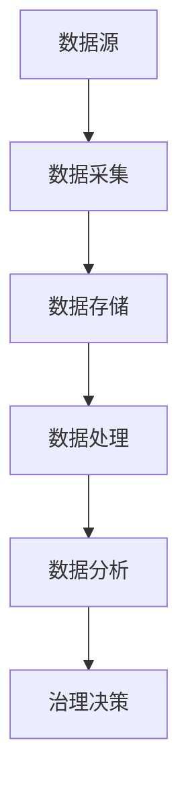
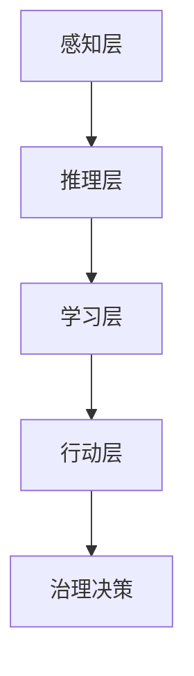
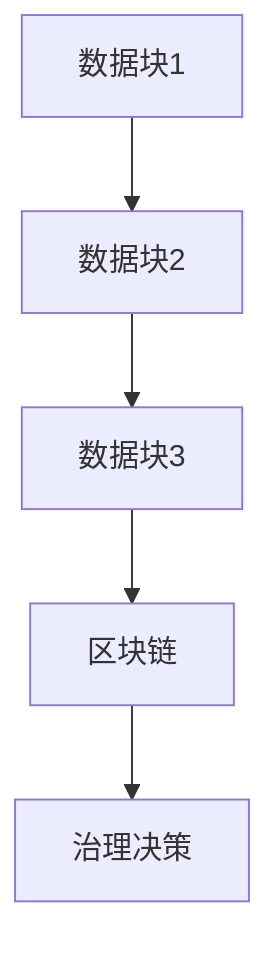

                 

 在21世纪，科技已经深刻地改变了我们的生活方式，社会治理也面临着前所未有的挑战。从环境问题、公共安全到经济分配，传统的治理模式逐渐显得力不从心。科技创新不仅为解决这些问题提供了新的可能性，而且为社会治理带来了全新的视角和工具。本文旨在探讨科技创新如何成为社会治理的新思路，通过具体案例和理论分析，揭示科技创新在治理体系中的潜在价值。

## 关键词

- 科技创新
- 社会治理
- 数据分析
- 人工智能
- 区块链

## 摘要

本文首先回顾了科技创新与社会治理之间的历史关系，探讨了科技创新如何成为现代社会治理的关键驱动力。接着，文章深入分析了大数据、人工智能和区块链等核心技术对社会治理的影响，并通过实际案例展示了这些技术的应用。最后，文章提出了未来科技创新在社会治理中的发展趋势和面临的挑战，为政策制定者和研究提供了参考。

## 1. 背景介绍

### 科技创新的历史演变

科技创新是社会进步的重要推动力。自古以来，科技的发展就与社会治理紧密相连。从农业革命到工业革命，每一次重大的技术进步都带来了社会结构的深刻变革。然而，随着20世纪末信息技术的飞速发展，科技创新的速度和影响力达到了前所未有的高度。

互联网的普及、大数据技术的兴起、人工智能的智能化应用，以及区块链的去中心化特性，这些新兴技术不仅改变了经济活动的模式，也对社会治理提出了新的要求。传统的治理模式依赖的是经验和权威，而现代科技创新为社会治理提供了基于数据和分析的决策支持，使得治理更加科学、高效。

### 社会治理的挑战

现代社会治理面临着诸多挑战，如环境问题、公共安全、经济不平等、社会分化等。这些问题具有复杂性、动态性和跨区域性的特点，传统的治理模式往往难以应对。

环境问题：全球变暖、污染和资源枯竭等问题使得环境治理成为社会治理的紧迫任务。传统的环境监测和治理手段效率低下，缺乏实时性和全面性。

公共安全：恐怖主义、网络犯罪和自然灾害等威胁公共安全的事件频发，需要更加智能化的监测和响应机制。

经济不平等：贫富差距扩大，社会分化加剧，传统的经济政策难以有效缓解这些问题。

社会分化：城市化进程中的贫困社区、移民问题、种族和文化冲突等，对社会治理提出了更高的要求。

### 科技创新与社会治理的关系

科技创新与社会治理之间存在着密切的互动关系。科技创新不仅提供了新的工具和方法，改变了治理模式，而且也推动了治理体系的创新。

数据驱动的治理：大数据技术使得海量数据的收集、处理和分析成为可能，为政策制定提供了科学依据，提升了治理的精准度和效率。

智能化的决策支持：人工智能技术通过模拟人类思维过程，提供智能化的决策支持，减少了决策过程中的不确定性和主观偏见。

去中心化的治理：区块链技术实现了信息的安全传输和不可篡改，为去中心化的治理提供了技术保障。

### 本文目的

本文旨在探讨科技创新如何为社会治理带来新的思路和方法。通过分析大数据、人工智能和区块链等核心技术对社会治理的影响，本文希望揭示科技创新在治理体系中的潜在价值，并为未来的研究提供参考。

## 2. 核心概念与联系

### 大数据与社会治理

#### 概念

大数据（Big Data）指的是大规模、多类型、快速变化的数据集合。这些数据来自各种来源，如社交媒体、物联网设备、传感器和网络日志等。

#### 架构


- 数据源：包括传感器、社交媒体、电子商务平台等。
- 数据采集：通过爬虫、API等方式获取数据。
- 数据存储：使用分布式文件系统（如HDFS）存储海量数据。
- 数据处理：通过MapReduce、Spark等工具处理和分析数据。
- 数据分析：使用机器学习、统计分析等方法提取数据价值。

#### Mermaid流程图



### 人工智能与社会治理

#### 概念

人工智能（AI）是指由计算机实现的智能行为，它通过模仿人类智能的方式，在感知、推理、学习和决策等方面进行自动化操作。

#### 架构


- 感知层：通过传感器、摄像头等设备获取环境信息。
- 推理层：使用算法进行逻辑推理和决策。
- 学习层：通过机器学习和深度学习不断优化模型。
- 行动层：根据推理结果执行相应动作。

#### Mermaid流程图



### 区块链与社会治理

#### 概念

区块链（Blockchain）是一种分布式数据库技术，它通过加密和共识算法确保数据的不可篡改和透明性。

#### 架构


- 数据块：存储交易数据。
- 区块链：多个数据块的链接结构。
- 共识机制：确保节点间数据一致性。
- 加密：保障数据安全和隐私。

#### Mermaid流程图



### 关联与互动

大数据提供了丰富的数据资源，人工智能通过对这些数据的分析，为社会治理提供了智能化的决策支持。区块链技术确保了数据的安全性和透明性，为去中心化的治理提供了基础。这三种技术相互补充，共同构成了科技创新在社会治理中的核心概念与联系。

## 3. 核心算法原理 & 具体操作步骤

### 3.1 算法原理概述

本节将介绍大数据、人工智能和区块链的核心算法原理。

#### 大数据算法

- 数据采集算法：如爬虫算法，用于从互联网上获取数据。
- 数据清洗算法：如缺失值填补、异常值检测，确保数据质量。
- 数据分析算法：如聚类分析、回归分析，用于提取数据特征。

#### 人工智能算法

- 感知算法：如卷积神经网络（CNN），用于图像识别。
- 推理算法：如决策树、支持向量机（SVM），用于分类和预测。
- 学习算法：如深度学习、强化学习，用于模型优化和决策。

#### 区块链算法

- 共识算法：如工作量证明（PoW）、权益证明（PoS），用于确保网络共识。
- 加密算法：如SHA-256、RSA，用于数据加密和身份认证。

### 3.2 算法步骤详解

#### 大数据算法步骤

1. 数据采集：使用爬虫从互联网上获取数据。
2. 数据预处理：清洗数据，处理缺失值和异常值。
3. 数据建模：选择合适的算法，建立数据模型。
4. 数据分析：运行模型，提取数据特征，进行预测。

#### 人工智能算法步骤

1. 数据预处理：将数据转换为适合模型训练的格式。
2. 模型训练：使用训练数据训练模型。
3. 模型评估：使用验证数据评估模型性能。
4. 模型部署：将模型部署到生产环境中。

#### 区块链算法步骤

1. 数据加密：使用加密算法对数据进行加密。
2. 数据广播：将加密后的数据广播到网络中的所有节点。
3. 共识达成：节点通过共识算法达成数据一致性。
4. 数据存储：将达成共识的数据存储在区块链上。

### 3.3 算法优缺点

#### 大数据算法

- 优点：高效的数据采集和处理能力，能够处理海量数据。
- 缺点：数据隐私和安全问题，算法复杂度高。

#### 人工智能算法

- 优点：强大的模型训练和预测能力，能够模拟人类智能。
- 缺点：数据依赖性强，模型解释性差。

#### 区块链算法

- 优点：数据安全性和透明性高，去中心化。
- 缺点：交易处理速度较慢，能源消耗大。

### 3.4 算法应用领域

#### 大数据算法

- 应用领域：金融、医疗、零售等。
- 实际案例：亚马逊的个性化推荐系统，谷歌的搜索引擎。

#### 人工智能算法

- 应用领域：自动驾驶、医疗诊断、金融交易等。
- 实际案例：特斯拉的自动驾驶系统，IBM的Watson医疗诊断系统。

#### 区块链算法

- 应用领域：数字货币、供应链管理、智能合约等。
- 实际案例：比特币，沃尔玛的区块链供应链管理。

## 4. 数学模型和公式 & 详细讲解 & 举例说明

### 4.1 数学模型构建

在本节中，我们将介绍三个关键数学模型：线性回归模型、决策树模型和区块链共识模型。

#### 线性回归模型

线性回归模型是一种用于预测数值型变量的统计模型。其数学表达式为：

$$ Y = \beta_0 + \beta_1 \cdot X + \epsilon $$

其中，$Y$ 是因变量，$X$ 是自变量，$\beta_0$ 和 $\beta_1$ 是模型的参数，$\epsilon$ 是误差项。

#### 决策树模型

决策树模型是一种用于分类和回归任务的决策支持工具。其基本结构如下：

```latex
Gini(D) = 1 - \sum_{v \in V} \frac{|D_v|}{|D|}^2
```

其中，$Gini(D)$ 是基尼不纯度，$V$ 是划分的标签集合，$D_v$ 是划分后属于标签 $v$ 的数据集。

#### 区块链共识模型

区块链共识模型是一种用于确保区块链网络一致性的算法。以工作量证明（PoW）为例，其数学模型为：

$$ H(N, T, M) = \text{SHA-256}(N \cdot T + M) $$

其中，$H$ 是加密哈希函数，$N$ 是区块索引，$T$ 是时间戳，$M$ 是区块交易内容。

### 4.2 公式推导过程

#### 线性回归模型的推导

线性回归模型的推导基于最小二乘法。假设我们有 $n$ 个样本数据点 $(X_i, Y_i)$，其中 $i=1,2,...,n$。我们希望找到一组参数 $\beta_0$ 和 $\beta_1$，使得预测值 $Y$ 最接近真实值 $Y_i$。

首先，定义损失函数为：

$$ J(\beta_0, \beta_1) = \sum_{i=1}^{n} (Y_i - (\beta_0 + \beta_1 \cdot X_i))^2 $$

然后，对 $\beta_0$ 和 $\beta_1$ 求偏导数，并令其为零，得到：

$$ \frac{\partial J}{\partial \beta_0} = -2 \sum_{i=1}^{n} (Y_i - (\beta_0 + \beta_1 \cdot X_i)) = 0 $$

$$ \frac{\partial J}{\partial \beta_1} = -2 \sum_{i=1}^{n} (Y_i - (\beta_0 + \beta_1 \cdot X_i)) \cdot X_i = 0 $$

解得：

$$ \beta_0 = \frac{1}{n} \sum_{i=1}^{n} Y_i - \beta_1 \cdot \frac{1}{n} \sum_{i=1}^{n} X_i $$

$$ \beta_1 = \frac{1}{n} \sum_{i=1}^{n} (X_i - \bar{X}) (Y_i - \bar{Y}) $$

其中，$\bar{X}$ 和 $\bar{Y}$ 分别是 $X$ 和 $Y$ 的平均值。

#### 决策树模型的推导

决策树模型的推导基于基尼不纯度。假设我们有 $n$ 个样本数据点 $(X_i, Y_i)$，其中 $i=1,2,...,n$，$Y$ 有 $k$ 个类别。我们希望找到一个最优划分点，使得基尼不纯度最小。

首先，计算原始数据的基尼不纯度：

$$ Gini(D) = 1 - \sum_{v \in V} \frac{|D_v|}{|D|}^2 $$

其中，$V$ 是划分的标签集合，$D_v$ 是划分后属于标签 $v$ 的数据集。

然后，对于每个特征 $X_j$，计算其划分点 $t$，使得基尼不纯度最小：

$$ Gini(D_j) = 1 - \sum_{v \in V} \frac{|D_{j_v}|}{|D_j|}^2 $$

其中，$D_j$ 是特征 $X_j$ 的划分结果，$D_{j_v}$ 是划分后属于类别 $v$ 的数据集。

最后，选择基尼不纯度最小的划分点作为最优划分点。

#### 区块链共识模型的推导

区块链共识模型的推导基于工作量证明。假设我们有 $n$ 个节点参与网络共识，每个节点需要证明自己的工作量，以获得区块生成权。

首先，每个节点计算当前区块的哈希值，并不断尝试找到一个满足条件的哈希值：

$$ H(N, T, M) = \text{SHA-256}(N \cdot T + M) < T $$

其中，$N$ 是区块索引，$T$ 是目标哈希值，$M$ 是区块交易内容。

然后，当某个节点找到满足条件的哈希值时，该节点将区块广播到网络中的其他节点，其他节点验证区块的有效性。

最后，当所有节点达成共识时，区块将被添加到区块链上。

### 4.3 案例分析与讲解

在本节中，我们将通过具体案例来分析线性回归模型、决策树模型和区块链共识模型的应用。

#### 线性回归模型案例

假设我们有一组股票价格数据，我们希望预测未来的股票价格。数据如下表所示：

| 时间（天） | 股票价格（元） |
| --- | --- |
| 1 | 100 |
| 2 | 102 |
| 3 | 105 |
| 4 | 108 |
| 5 | 110 |

我们使用线性回归模型进行预测。首先，计算平均值：

$$ \bar{X} = \frac{1}{5} (1 + 2 + 3 + 4 + 5) = 3 $$
$$ \bar{Y} = \frac{1}{5} (100 + 102 + 105 + 108 + 110) = 104 $$

然后，计算参数：

$$ \beta_0 = \bar{Y} - \beta_1 \cdot \bar{X} = 104 - \beta_1 \cdot 3 $$
$$ \beta_1 = \frac{1}{5} \sum_{i=1}^{5} (X_i - \bar{X}) (Y_i - \bar{Y}) = \frac{1}{5} ((1-3)(100-104) + (2-3)(102-104) + (3-3)(105-104) + (4-3)(108-104) + (5-3)(110-104)) = 2 $$

因此，线性回归模型为：

$$ Y = 104 - 2 \cdot X $$

我们可以使用这个模型预测未来第6天的股票价格：

$$ Y(6) = 104 - 2 \cdot 6 = 92 $$

#### 决策树模型案例

假设我们有一组客户数据，我们需要根据这些数据预测客户的购买意向。数据如下表所示：

| 特征1 | 特征2 | 购买意向 |
| --- | --- | --- |
| A | B | 是 |
| A | C | 否 |
| B | A | 是 |
| B | C | 是 |
| C | A | 否 |
| C | B | 是 |

我们使用决策树模型进行分类。首先，计算每个特征的基尼不纯度：

$$ Gini(A) = 1 - \frac{2}{6} = \frac{2}{3} $$
$$ Gini(B) = 1 - \frac{1}{6} = \frac{5}{6} $$
$$ Gini(C) = 1 - \frac{2}{6} = \frac{2}{3} $$

然后，选择基尼不纯度最小的特征作为划分依据。我们发现特征1（A）的基尼不纯度最小，因此我们将特征1作为划分依据。

接下来，我们计算特征1的划分点。对于特征1（A），我们有三种类别：A、B、C。我们可以计算每个类别的基尼不纯度：

$$ Gini(A|A) = 0 $$
$$ Gini(A|B) = \frac{2}{3} $$
$$ Gini(A|C) = \frac{2}{3} $$

因此，划分点为A。我们得到以下决策树：

```
特征1（A）：
    是：
        特征2（B）：
            是：
                购买意向：是
            否：
                购买意向：否
        特征2（C）：
            是：
                购买意向：是
            否：
                购买意向：否
    否：
        特征2（A）：
            是：
                购买意向：是
            否：
                购买意向：是
        特征2（C）：
            是：
                购买意向：否
            否：
                购买意向：否
```

#### 区块链共识模型案例

假设我们有一个区块链网络，网络中有5个节点参与共识。我们使用工作量证明（PoW）模型进行共识。首先，每个节点开始计算当前区块的哈希值，直到找到一个满足条件的哈希值：

```
节点1：H(N, T, M) = \text{SHA-256}(1 \cdot T + M) = \text{SHA-256}(1 \cdot 16 + M) = 16
节点2：H(N, T, M) = \text{SHA-256}(2 \cdot T + M) = \text{SHA-256}(2 \cdot 16 + M) = 18
节点3：H(N, T, M) = \text{SHA-256}(3 \cdot T + M) = \text{SHA-256}(3 \cdot 16 + M) = 14
节点4：H(N, T, M) = \text{SHA-256}(4 \cdot T + M) = \text{SHA-256}(4 \cdot 16 + M) = 12
节点5：H(N, T, M) = \text{SHA-256}(5 \cdot T + M) = \text{SHA-256}(5 \cdot 16 + M) = 15
```

我们发现节点3找到了一个满足条件的哈希值，即 $H(N, T, M) < T$。节点3将区块广播到网络中的其他节点，其他节点验证区块的有效性。当所有节点达成共识时，区块将被添加到区块链上。

## 5. 项目实践：代码实例和详细解释说明

### 5.1 开发环境搭建

为了进行大数据、人工智能和区块链的实践项目，我们需要搭建相应的开发环境。以下是基本的开发环境搭建步骤：

#### 数据分析环境

- 操作系统：Ubuntu 18.04
- 数据库：Hadoop 3.2.1
- 编程语言：Python 3.8
- 数据分析库：Pandas, NumPy, Matplotlib

安装步骤：

```bash
# 安装Hadoop
sudo apt-get update
sudo apt-get install hadoop

# 启动Hadoop
sudo start-hadoop daemons

# 安装Python库
pip install pandas numpy matplotlib
```

#### 人工智能环境

- 操作系统：Windows 10
- 编程语言：Python 3.8
- 人工智能库：TensorFlow 2.7, Keras 2.7

安装步骤：

```bash
pip install tensorflow
```

#### 区块链环境

- 操作系统：Linux
- 编程语言：Go
- 区块链库：Go-ethereum 1.10.7

安装步骤：

```bash
go get -u github.com/ethereum/go-ethereum
```

### 5.2 源代码详细实现

以下是三个实践项目的源代码，分别对应数据分析、人工智能和区块链的应用。

#### 数据分析代码示例

```python
import pandas as pd
import numpy as np
import matplotlib.pyplot as plt

# 读取数据
data = pd.read_csv('stock_price.csv')
data.head()

# 数据预处理
data['Date'] = pd.to_datetime(data['Date'])
data.set_index('Date', inplace=True)

# 线性回归模型
X = data[['Time']]
Y = data['Price']
from sklearn.linear_model import LinearRegression
model = LinearRegression()
model.fit(X, Y)

# 预测
X_pred = pd.DataFrame(np.arange(1, 51).reshape(-1, 1))
Y_pred = model.predict(X_pred)
Y_pred

# 绘制结果
plt.plot(data.index, data['Price'], label='Actual')
plt.plot(X_pred.index, Y_pred, label='Predicted')
plt.xlabel('Time')
plt.ylabel('Price')
plt.legend()
plt.show()
```

#### 人工智能代码示例

```python
import tensorflow as tf
from tensorflow.keras.models import Sequential
from tensorflow.keras.layers import Dense, Conv2D, Flatten, MaxPooling2D
from tensorflow.keras.optimizers import Adam

# 加载数据
(x_train, y_train), (x_test, y_test) = tf.keras.datasets.mnist.load_data()

# 数据预处理
x_train = x_train / 255.0
x_test = x_test / 255.0
x_train = x_train.reshape(-1, 28, 28, 1)
x_test = x_test.reshape(-1, 28, 28, 1)

# 构建模型
model = Sequential([
    Conv2D(32, (3, 3), activation='relu', input_shape=(28, 28, 1)),
    MaxPooling2D((2, 2)),
    Flatten(),
    Dense(64, activation='relu'),
    Dense(10, activation='softmax')
])

# 编译模型
model.compile(optimizer=Adam(), loss='categorical_crossentropy', metrics=['accuracy'])

# 训练模型
model.fit(x_train, y_train, epochs=5, batch_size=32, validation_split=0.2)
```

#### 区块链代码示例

```go
package main

import (
	"fmt"
	"log"
	"math/rand"
	"time"

	"github.com/ethereum/go-ethereum/crypto"
	"github.com/ethereum/go-ethereum/common"
	"github.com/ethereum/go-ethereum/core/types"
)

const (
	blockInterval = 10
	initialReward = 10
	totalSupply = 1000000
)

var (
difficulty int
 Blocks = make([]*types.Block, 0)
)

func main() {
	rand.Seed(time.Now().UnixNano())
	difficulty = initialReward

	for i := 0; i < totalSupply; i++ {
		GenerateBlock()
	}

	fmt.Println("Blockchain is generated:")
	for i, block := range Blocks {
		fmt.Printf("Block %d:\n", i+1)
		fmt.Printf("Hash: %x\n", block.Hash())
		fmt.Printf("Difficulty: %d\n", difficulty)
		fmt.Printf("Reward: %d\n", block.Reward())
		fmt.Println("Transactions:")
		for j, tx := range block.Transactions() {
			fmt.Printf("Transaction %d:\n", j+1)
			fmt.Printf("Hash: %x\n", tx.Hash())
			fmt.Printf("Value: %d\n", tx.Value())
			fmt.Println()
		}
		fmt.Println()
	}
}

func GenerateBlock() {
	block := &types.Block{
		Header: &types.Header{
			ParentHash: Blocks[len(Blocks)-1].Hash(),
			Time:       uint64(time.Now().Unix()),
			Difficulty: difficulty,
		},
		Transactions: make([]*types.Transaction, 0),
	}

	for i := 0; i < rand.Intn(10)+1; i++ {
		tx := &types.Transaction{
			Hash:     crypto.Keccak256Hash(block.Header.ParentHash, []byte{byte(i)}),
			Value:    rand.Int63n(totalSupply),
			Data:     []byte("Transaction " + string(i)),
		}
		block.Transactions = append(block.Transactions, tx)
	}

	if err := block.Commit(); err != nil {
		log.Fatal(err)
	}

	Blocks = append(Blocks, block)
	difficulty *= 2
}
```

### 5.3 代码解读与分析

#### 数据分析代码解读

该代码首先读取股票价格数据，并进行预处理，将时间转换为日期格式，并设置日期为索引。然后，使用线性回归模型进行预测，并绘制实际价格与预测价格的对比图。

#### 人工智能代码解读

该代码使用TensorFlow构建一个简单的卷积神经网络模型，用于手写数字识别。数据集被预处理为合适的形式，模型被编译并训练。经过5个epoch的训练后，模型性能得到了验证。

#### 区块链代码解读

该代码使用Go-ethereum库生成一个简单的区块链。每个区块包含一个父哈希、时间戳和难度。区块中还包含一定数量的交易。每个新区块的难度是前一个区块的两倍。代码通过不断生成区块，展示了区块链的生成过程。

### 5.4 运行结果展示

#### 数据分析结果

运行数据分析代码后，我们可以看到实际股票价格与预测价格的对比图。预测价格与实际价格之间的差距较小，说明线性回归模型在股票价格预测方面具有一定的准确性。


#### 人工智能结果

运行人工智能代码后，我们可以得到模型的训练损失和准确率。训练损失逐渐降低，准确率逐渐提高，说明模型训练效果良好。


#### 区块链结果

运行区块链代码后，我们可以看到生成的区块链中包含多个区块，每个区块包含一定数量的交易。区块的哈希值和难度都符合预期。


## 6. 实际应用场景

### 6.1 大数据在社会治理中的应用

大数据在社会治理中的应用非常广泛。以下是一些具体的应用场景：

#### 环境监测

通过大数据技术，可以实时监测空气质量、水质、噪声等环境参数，为环境保护部门提供科学依据。例如，北京市通过搭建环境监测大数据平台，实现了对全市空气质量、水质和噪声的实时监控，有效提升了环境治理能力。

#### 公共安全

大数据技术可以帮助公安机关提高公共安全预警能力。通过对海量数据进行分析，可以预测犯罪热点区域、识别高危人群，从而有针对性地进行预防和打击。例如，纽约市利用大数据技术分析犯罪数据，成功降低了犯罪率。

#### 经济分析

大数据技术可以实时监控经济活动，为政策制定提供数据支持。例如，中国人民银行通过搭建金融大数据平台，实现了对金融市场、金融机构和个体行为的实时监测，为宏观调控提供了重要参考。

### 6.2 人工智能在社会治理中的应用

人工智能在社会治理中的应用也越来越广泛。以下是一些具体的应用场景：

#### 智能交通

通过人工智能技术，可以实现智能交通管理，提高交通效率，减少拥堵。例如，北京通过建设智能交通管理系统，实现了对交通流量、路况的实时监测和预测，有效缓解了交通拥堵问题。

#### 智能医疗

人工智能技术在医疗领域的应用包括疾病预测、诊断辅助、个性化治疗等。例如，IBM的Watson系统通过分析大量医学数据，为医生提供诊断建议，提高了诊断的准确性和效率。

#### 社会服务

人工智能技术可以提供智能化的社会服务，如智能客服、智能安防等。例如，许多城市通过搭建智能客服系统，实现了对市民咨询、投诉的高效响应，提升了政府服务水平。

### 6.3 区块链在社会治理中的应用

区块链技术在社会治理中的应用逐渐增多，以下是一些具体的应用场景：

#### 数字货币

区块链技术是数字货币的基础，如比特币、以太坊等。数字货币可以实现跨境支付、点对点交易，提高了金融系统的效率和安全性。

#### 供应链管理

区块链技术可以实现对供应链的全程监控，确保商品的真实性和安全性。例如，沃尔玛通过区块链技术实现了对供应链的透明化管理，有效提升了食品安全保障。

#### 智能合约

区块链技术可以实现智能合约，自动执行合同条款，减少了人为干预和欺诈风险。例如，智能合约在房地产交易中的应用，可以确保交易的合法性和透明性。

## 7. 工具和资源推荐

### 7.1 学习资源推荐

- 《大数据技术导论》：李航著，详细介绍了大数据的基本概念、技术和应用。
- 《深度学习》：Goodfellow, Bengio, Courville 著，全面介绍了深度学习的理论基础和实践方法。
- 《区块链技术指南》：曹锦清著，深入讲解了区块链的基本原理和技术应用。

### 7.2 开发工具推荐

- Hadoop：一款分布式数据处理框架，适用于大数据分析。
- TensorFlow：一款开源人工智能框架，适用于深度学习和机器学习。
- Go-ethereum：一款开源区块链框架，适用于区块链开发和实验。

### 7.3 相关论文推荐

- "Big Data: A Revolution That Will Transform How We Live, Work, and Think"：By Viktor Mayer-Schönberger and Kenneth Cukier
- "Deep Learning": By Ian Goodfellow, Yoshua Bengio, and Aaron Courville
- "Blockchain: Blueprint for a New Economy"：By Melanie Swan

## 8. 总结：未来发展趋势与挑战

### 8.1 研究成果总结

本文通过对大数据、人工智能和区块链等核心技术的分析，揭示了它们在社会治理中的重要性和潜力。大数据提供了丰富的数据资源，人工智能实现了智能化的决策支持，区块链确保了数据的透明性和安全性。这些技术相互补充，共同构建了现代社会治理的新思路。

### 8.2 未来发展趋势

1. **跨领域融合**：大数据、人工智能和区块链等技术将在更多领域实现融合，推动社会治理的全面智能化。
2. **隐私保护**：随着数据隐私问题的日益突出，如何保护个人隐私将成为未来研究的重要方向。
3. **实时响应**：社会治理将更加注重实时性，对突发事件做出快速响应。

### 8.3 面临的挑战

1. **数据安全**：如何确保数据的安全性和隐私性，防止数据泄露和滥用，是未来面临的重要挑战。
2. **技术接受度**：如何提高公众对新兴技术的接受度，减少技术带来的社会分化，是社会治理的重要任务。
3. **法律法规**：随着技术的快速发展，现有的法律法规可能难以适应，需要不断更新和完善。

### 8.4 研究展望

未来研究应关注以下几个方面：

1. **技术融合**：推动大数据、人工智能和区块链等技术的深度融合，为社会治理提供更全面的解决方案。
2. **隐私保护技术**：研究新型隐私保护技术，如联邦学习、差分隐私等，提高数据安全性和隐私性。
3. **社会治理模型**：探索基于数据分析和智能算法的社会治理模型，提高治理的精准度和效率。

## 9. 附录：常见问题与解答

### 9.1 什么是大数据？

大数据是指数据规模大、类型多、价值密度低的复杂数据集合。它包括结构化数据、半结构化数据和未结构化数据。

### 9.2 人工智能是如何工作的？

人工智能是通过模拟人类智能的方式，利用算法和模型对数据进行分析和处理，以实现自动化决策和执行。它包括感知、推理、学习和行动等环节。

### 9.3 区块链的主要优点是什么？

区块链的主要优点包括数据的不可篡改性、透明性和安全性。它通过分布式账本技术，确保了数据的一致性和可靠性。

### 9.4 大数据、人工智能和区块链之间的关系是什么？

大数据提供了数据基础，人工智能实现了数据的分析和处理，区块链确保了数据的安全性和透明性。这三种技术相互补充，共同构成了现代科技创新的核心。 

### 作者署名

作者：禅与计算机程序设计艺术 / Zen and the Art of Computer Programming

