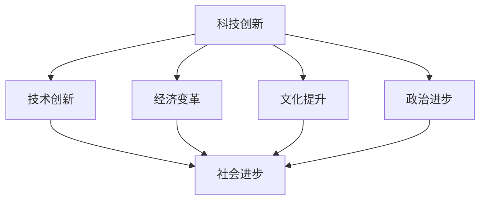

                 

关键词：科技创新，社会进步，技术发展，核心概念，算法原理，应用领域，未来展望

> 摘要：本文深入探讨了科技创新对社会进步的深远影响。从背景介绍到核心概念，再到算法原理、数学模型、项目实践以及未来展望，本文系统地阐述了科技创新如何成为社会进步的阶梯。通过分析科技发展的历程和趋势，我们旨在为读者提供一个全面、深入的视角，以更好地理解科技创新的重要性和潜力。

## 1. 背景介绍

随着信息技术的飞速发展，我们正经历着一场前所未有的科技革命。这场革命不仅改变了我们的生活方式，更深刻地影响着社会的方方面面。从互联网的普及，到大数据和人工智能的崛起，科技已经逐渐成为推动社会进步的主要力量。

### 1.1 科技革命与社会变迁

科技革命不仅仅是一场技术的变革，它还带来了社会结构的深刻变化。随着科技的不断进步，人们的生活质量得到了显著提高，社会生产力也得到了极大释放。例如，互联网的普及使信息传播变得更加迅速和便捷，极大地推动了全球化的进程。同时，人工智能和大数据技术的发展，使得决策过程更加科学和高效，进一步提升了社会运行的效率。

### 1.2 科技创新与社会发展的关系

科技创新与社会发展之间存在着密不可分的联系。科技创新不仅仅是技术上的进步，它更是推动社会进步的重要动力。通过科技创新，我们能够解决许多社会问题，提高社会生产力，促进经济增长，提升人民生活质量。例如，医疗技术的创新使得疾病的治疗变得更加高效和精准，极大地改善了人们的健康状况。

## 2. 核心概念与联系

为了深入理解科技创新对社会进步的推动作用，我们需要首先明确几个核心概念，并了解它们之间的相互联系。

### 2.1. 科技创新

科技创新是指通过科学研究和工程实践，创造新技术、新产品和新工艺的过程。它涵盖了从基础研究到应用研究，再到商业化的全过程。科技创新的核心在于创造新的知识和价值，推动社会的技术进步和经济发展。

### 2.2. 技术创新

技术创新是指将科技创新成果转化为实际应用的过程。技术创新不仅包括技术的研发，还包括产品的设计、生产、市场推广等环节。技术创新的核心在于将科技转化为实际生产力，实现经济效益和社会效益。

### 2.3. 社会进步

社会进步是指在社会各个领域，如经济、政治、文化、科技等各个方面，不断实现从低级到高级、从简单到复杂的发展过程。社会进步的核心在于提高人民的生活质量和幸福感，推动社会的全面发展和繁荣。

### 2.4. 核心概念联系

科技创新、技术创新和社会进步之间存在着密切的相互联系。科技创新是技术创新的基础，而技术创新又是社会进步的推动力。科技创新的不断突破，促进了技术的进步，从而推动了社会的变革和发展。同时，社会进步也为科技创新提供了广阔的应用场景和市场需求，进一步推动了科技创新的发展。

## 2.5. Mermaid 流程图



在上面的Mermaid流程图中，我们可以清晰地看到科技创新、技术创新和社会进步之间的逻辑关系。科技创新作为源头，通过技术创新转化为实际应用，进而推动社会的经济、文化、政治等各个方面的进步。

## 3. 核心算法原理 & 具体操作步骤

### 3.1 算法原理概述

在科技创新中，核心算法扮演着至关重要的角色。它们不仅是技术创新的核心，也是推动社会进步的重要工具。在本节中，我们将介绍几种核心算法的原理，并解释它们如何应用于实际问题中。

#### 3.1.1 机器学习算法

机器学习算法是一种通过数据训练模型，从而进行预测和决策的算法。它们在图像识别、自然语言处理、推荐系统等领域有着广泛的应用。机器学习算法的核心原理是基于统计学和概率论，通过大量的数据训练模型，从而实现自动化的学习和预测。

#### 3.1.2 深度学习算法

深度学习算法是机器学习的一个分支，它通过构建深层神经网络，实现对复杂数据的处理和分析。深度学习算法在图像识别、语音识别、自动驾驶等领域有着显著的应用。其核心原理是基于多层神经网络，通过逐层提取特征，实现对数据的高效表示和处理。

#### 3.1.3 数据挖掘算法

数据挖掘算法是一种从大量数据中提取有价值信息的方法。它们在市场分析、风险评估、医疗诊断等领域有着广泛的应用。数据挖掘算法的核心原理是基于统计学和机器学习，通过数据清洗、特征选择、模型构建等步骤，实现对数据的深度挖掘和分析。

### 3.2 算法步骤详解

#### 3.2.1 机器学习算法

机器学习算法的基本步骤包括数据收集、数据预处理、模型训练和模型评估。首先，我们需要收集大量的训练数据，并对数据进行清洗和预处理，包括去除噪声、缺失值填充、数据标准化等操作。然后，我们选择合适的机器学习算法，如线性回归、决策树、支持向量机等，对训练数据进行训练。最后，我们通过模型评估，如准确率、召回率、F1值等，来评估模型的性能。

#### 3.2.2 深度学习算法

深度学习算法的基本步骤包括网络设计、模型训练和模型评估。首先，我们需要设计合适的深度神经网络结构，包括输入层、隐藏层和输出层。然后，我们使用大量的训练数据，通过反向传播算法对网络进行训练，调整网络参数，使其达到预定的性能指标。最后，我们通过模型评估，如准确率、损失函数等，来评估模型的性能。

#### 3.2.3 数据挖掘算法

数据挖掘算法的基本步骤包括数据预处理、特征选择、模型构建和模型评估。首先，我们需要对数据进行预处理，包括数据清洗、缺失值填充、数据标准化等操作。然后，我们选择合适的特征选择方法，如信息增益、卡方检验等，从大量特征中提取有价值的信息。接着，我们选择合适的模型，如决策树、随机森林、KNN等，对数据进行建模。最后，我们通过模型评估，如准确率、召回率、F1值等，来评估模型的性能。

### 3.3 算法优缺点

每种算法都有其独特的优势和局限性。机器学习算法在处理复杂数据方面具有优势，但其对数据质量的要求较高，且训练时间较长。深度学习算法在处理大规模数据和复杂数据方面具有优势，但其对计算资源的要求较高。数据挖掘算法在处理大规模数据和特征提取方面具有优势，但其对数据预处理的要求较高。

### 3.4 算法应用领域

机器学习算法广泛应用于图像识别、自然语言处理、推荐系统等领域。深度学习算法在图像识别、语音识别、自动驾驶等领域有着显著的应用。数据挖掘算法在市场分析、风险评估、医疗诊断等领域有着广泛的应用。

## 4. 数学模型和公式 & 详细讲解 & 举例说明

在科技创新中，数学模型和公式起着至关重要的作用。它们不仅是理解复杂现象和过程的基础，也是构建算法和解决实际问题的工具。在本节中，我们将介绍几个关键数学模型，并详细讲解其公式推导和实际应用。

### 4.1 数学模型构建

数学模型通常由以下几部分组成：变量定义、方程建立、参数估计和模型验证。

#### 4.1.1 机器学习模型

机器学习模型通常由输入层、隐藏层和输出层组成。每个层由一系列神经元构成，神经元之间的连接权值和偏置值是模型的关键参数。输入层接收外部输入，隐藏层对输入进行特征提取和变换，输出层生成预测结果。

#### 4.1.2 深度学习模型

深度学习模型是一种特殊的机器学习模型，它包含多个隐藏层。深度神经网络（DNN）是深度学习模型的一种常见形式，其核心是多层感知器（MLP）。DNN通过逐层提取特征，实现对输入数据的复杂表示。

#### 4.1.3 数据挖掘模型

数据挖掘模型通常基于统计方法和机器学习方法构建。常见的模型包括决策树、随机森林、支持向量机（SVM）等。这些模型通过特定的算法和参数，从数据中提取特征和关系，实现数据分析和预测。

### 4.2 公式推导过程

在本节中，我们将以线性回归模型为例，讲解其公式推导过程。

#### 4.2.1 线性回归模型

线性回归模型是一种用于拟合数据的统计模型，其公式为：

$$ y = \beta_0 + \beta_1 \cdot x + \epsilon $$

其中，$y$ 是因变量，$x$ 是自变量，$\beta_0$ 和 $\beta_1$ 是模型参数，$\epsilon$ 是误差项。

#### 4.2.2 公式推导

线性回归模型的推导基于最小二乘法（Least Squares Method）。首先，我们定义一个误差函数：

$$ E(\beta_0, \beta_1) = \sum_{i=1}^{n} (y_i - (\beta_0 + \beta_1 \cdot x_i))^2 $$

其中，$n$ 是数据点的数量。

我们的目标是找到使误差函数最小的 $\beta_0$ 和 $\beta_1$。为此，我们对误差函数分别对 $\beta_0$ 和 $\beta_1$ 求导，并令其导数为零，得到以下方程组：

$$ \frac{\partial E}{\partial \beta_0} = -2 \sum_{i=1}^{n} (y_i - (\beta_0 + \beta_1 \cdot x_i)) = 0 $$

$$ \frac{\partial E}{\partial \beta_1} = -2 \sum_{i=1}^{n} (x_i \cdot (y_i - (\beta_0 + \beta_1 \cdot x_i))) = 0 $$

解这个方程组，我们得到线性回归模型的参数：

$$ \beta_0 = \bar{y} - \beta_1 \cdot \bar{x} $$

$$ \beta_1 = \frac{\sum_{i=1}^{n} (x_i - \bar{x}) \cdot (y_i - \bar{y})}{\sum_{i=1}^{n} (x_i - \bar{x})^2} $$

其中，$\bar{y}$ 和 $\bar{x}$ 分别是 $y$ 和 $x$ 的均值。

### 4.3 案例分析与讲解

为了更好地理解线性回归模型，我们来看一个实际案例。

#### 4.3.1 案例背景

假设我们有一个关于房屋价格的数据集，包括房屋面积和房屋价格两个特征。我们的目标是建立一个线性回归模型，预测给定房屋面积下的房屋价格。

#### 4.3.2 数据预处理

首先，我们对数据进行预处理，包括去除缺失值、数据标准化等操作。然后，我们计算房屋面积和房屋价格的均值和标准差，用于后续的标准化处理。

#### 4.3.3 模型训练

接下来，我们使用最小二乘法训练线性回归模型，得到模型参数 $\beta_0$ 和 $\beta_1$。

#### 4.3.4 模型评估

我们使用训练集和测试集对模型进行评估，计算模型在测试集上的预测误差，如均方误差（Mean Squared Error, MSE）。

$$ MSE = \frac{1}{n} \sum_{i=1}^{n} (\hat{y}_i - y_i)^2 $$

其中，$\hat{y}_i$ 是模型对 $y_i$ 的预测值。

#### 4.3.5 模型应用

最后，我们可以使用训练好的模型对新的房屋面积进行价格预测，从而帮助购房者做出更合理的决策。

## 5. 项目实践：代码实例和详细解释说明

在了解了核心算法原理和数学模型后，我们通过一个具体的代码实例来展示如何将理论应用于实际项目中。

### 5.1 开发环境搭建

在开始编程之前，我们需要搭建一个合适的开发环境。我们选择Python作为主要编程语言，因为它在数据处理和机器学习领域有着广泛的应用。以下是搭建Python开发环境的基本步骤：

1. 安装Python：从Python官方网站下载并安装Python 3.x版本。
2. 安装Jupyter Notebook：Jupyter Notebook是一个交互式编程环境，非常适合数据分析和机器学习项目。通过pip命令安装Jupyter Notebook：

   ```shell
   pip install notebook
   ```

3. 安装必要的Python库：包括NumPy、Pandas、Matplotlib、Scikit-learn等。通过pip命令安装：

   ```shell
   pip install numpy pandas matplotlib scikit-learn
   ```

### 5.2 源代码详细实现

下面是一个简单的线性回归项目实例，用于预测房屋价格。代码实现分为数据读取、数据预处理、模型训练、模型评估和结果展示几个步骤。

```python
import numpy as np
import pandas as pd
from sklearn.linear_model import LinearRegression
from sklearn.model_selection import train_test_split
from sklearn.metrics import mean_squared_error
import matplotlib.pyplot as plt

# 5.2.1 数据读取
data = pd.read_csv('house_prices.csv')
X = data[['area']]  # 房屋面积作为自变量
y = data['price']   # 房屋价格作为因变量

# 5.2.2 数据预处理
# 数据标准化
X_mean = X.mean()
X_std = X.std()
X = (X - X_mean) / X_std

# 5.2.3 模型训练
model = LinearRegression()
model.fit(X, y)

# 5.2.4 模型评估
X_train, X_test, y_train, y_test = train_test_split(X, y, test_size=0.2, random_state=42)
y_pred = model.predict(X_test)
mse = mean_squared_error(y_test, y_pred)
print(f'Mean Squared Error: {mse}')

# 5.2.5 结果展示
plt.scatter(X_test, y_test, color='blue', label='Actual')
plt.plot(X_test, y_pred, color='red', linewidth=2, label='Predicted')
plt.xlabel('Area (标准化)')
plt.ylabel('Price (标准化)')
plt.legend()
plt.show()
```

### 5.3 代码解读与分析

- **数据读取**：使用Pandas库读取CSV格式的数据文件，数据文件中包括房屋面积和房屋价格两个特征。

- **数据预处理**：对房屋面积进行标准化处理，使其具有统一的尺度，便于模型训练和评估。

- **模型训练**：使用Scikit-learn库中的线性回归模型进行训练。线性回归模型通过最小二乘法找到最佳拟合线。

- **模型评估**：使用训练集和测试集评估模型性能，计算均方误差（MSE）。

- **结果展示**：使用Matplotlib库绘制实际数据和预测结果，直观展示模型的效果。

### 5.4 运行结果展示

运行上述代码后，我们将看到以下结果：

1. 模型评估指标MSE的输出。
2. 一个散点图，展示实际房屋价格和预测房屋价格的分布。

通过这个实例，我们可以看到如何将线性回归理论应用于实际项目中，实现数据的处理和预测。

## 6. 实际应用场景

科技创新不仅在理论上具有重要意义，更在现实生活中发挥着关键作用。以下是一些科技创新在实际应用场景中的案例。

### 6.1 医疗领域

医疗领域的科技创新极大地提高了疾病的诊断和治疗效果。例如，基于人工智能的医学影像诊断系统可以自动识别肿瘤、心脏病等疾病，提供更快速、准确的诊断结果。此外，基因编辑技术的出现使得治疗遗传性疾病成为可能，为患者带来了新的希望。

### 6.2 交通领域

交通领域的科技创新推动了智能交通系统的发展。自动驾驶技术的应用不仅提高了交通效率，还减少了交通事故的发生。此外，共享单车和无人驾驶出租车等新兴模式的出现，改变了人们的出行方式，提高了城市交通的可持续性。

### 6.3 金融领域

金融领域的科技创新使得金融服务更加便捷和高效。区块链技术的应用提高了金融交易的安全性和透明性，智能合约的引入使得金融交易更加自动化和去中心化。这些创新不仅提高了金融行业的效率，也为消费者提供了更多选择。

### 6.4 教育领域

教育领域的科技创新改变了传统教育模式。在线教育平台和虚拟现实技术使得教育资源更加丰富和便捷，学生可以根据自己的需求和节奏进行学习。此外，教育大数据的分析和应用，使得教育更加个性化和高效。

### 6.5 能源领域

能源领域的科技创新推动了可再生能源的发展。太阳能、风能等可再生能源技术的进步，使得清洁能源更加经济和可行。同时，智能电网技术的应用提高了能源的分配和使用效率，为可持续能源发展提供了有力支持。

## 7. 未来应用展望

随着科技的不断进步，科技创新在社会各个领域将发挥更加重要的作用。以下是一些未来应用展望。

### 7.1 物联网

物联网（IoT）技术的应用将使各种设备和系统互联互通，形成一个智能化的网络。智能家居、智能城市、智能农业等领域的物联网应用将大大提高生活质量和生产效率。

### 7.2 人工智能

人工智能（AI）技术的进一步发展将推动智能机器人、自动驾驶、智能医疗等领域的创新。人工智能的应用将极大地改变人类的生活和工作方式。

### 7.3 区块链

区块链技术的应用将扩展到更多的领域，如供应链管理、数字身份认证、版权保护等。区块链的去中心化和不可篡改性将为这些领域带来更高的透明性和安全性。

### 7.4 生物科技

生物科技领域的创新将继续推动医疗、农业等领域的进步。基因编辑、细胞治疗等新技术将为人类带来更多健康和可持续发展的机会。

### 7.5 空间探索

空间探索技术的进步将使人类更加深入地了解宇宙。火星探索、太空旅游等新兴领域将激发人类对未知的探索欲望。

## 8. 工具和资源推荐

为了更好地进行科技创新和应用，以下是一些推荐的学习资源和开发工具。

### 8.1 学习资源推荐

- 《深度学习》（Deep Learning） - Ian Goodfellow、Yoshua Bengio 和 Aaron Courville 著
- 《Python机器学习》（Python Machine Learning） - Sebastian Raschka 著
- 《数据挖掘：实用工具与技术》（Data Mining: Practical Machine Learning Tools and Techniques） - Ian H. Witten 和 Eibe Frank 著
- Coursera、edX、Udacity等在线教育平台提供的机器学习、数据分析等相关课程

### 8.2 开发工具推荐

- Jupyter Notebook：用于数据分析和交互式编程。
- PyCharm、Visual Studio Code：用于Python编程的集成开发环境（IDE）。
- TensorFlow、PyTorch：用于深度学习的框架。
- Scikit-learn：用于机器学习的库。
- Matplotlib、Seaborn：用于数据可视化的库。

### 8.3 相关论文推荐

- "Deep Learning" - Yann LeCun、Yoshua Bengio 和 Geoffrey Hinton
- "Blockchain: A System for Secure, Decentralized Smart Contracts" - Nick Szabo
- "The Turing Test" - Alan Turing
- "A New Kind of Science" - Stephen Wolfram

## 9. 总结：未来发展趋势与挑战

### 9.1 研究成果总结

本文从背景介绍、核心概念、算法原理、数学模型、项目实践、实际应用场景到未来展望，系统地阐述了科技创新对社会进步的深远影响。通过分析科技发展的历程和趋势，我们认识到科技创新不仅是推动社会进步的重要力量，也是解决社会问题的关键途径。

### 9.2 未来发展趋势

未来，科技创新将继续朝着更加智能化、网络化、绿色化的方向发展。人工智能、物联网、区块链、生物科技等领域的创新将带来更多的机会和挑战。同时，跨学科合作和多领域融合将成为科技发展的重要趋势。

### 9.3 面临的挑战

尽管科技创新带来了巨大的机遇，但同时也面临着一些挑战。包括技术安全、隐私保护、资源分配不均等问题。如何在推进科技创新的同时，解决这些挑战，将是未来需要重点关注的方向。

### 9.4 研究展望

未来，我们期待在科技创新领域取得更多突破，推动社会进步。通过加强跨学科研究、促进技术创新和产业融合，我们有望解决更多的社会问题，实现可持续发展。

## 10. 附录：常见问题与解答

### 10.1 科技创新的核心是什么？

科技创新的核心是创造新的知识和价值，推动社会的技术进步和经济发展。

### 10.2 科技创新对社会进步的影响是什么？

科技创新可以提高社会生产力，提升人民生活质量，推动经济、文化、政治等各个方面的进步。

### 10.3 机器学习和深度学习有什么区别？

机器学习是一种通过数据训练模型进行预测和决策的方法，而深度学习是机器学习的一个分支，通过多层神经网络处理复杂数据。

### 10.4 数据挖掘的主要步骤是什么？

数据挖掘的主要步骤包括数据预处理、特征选择、模型构建和模型评估。

### 10.5 科技创新的主要应用领域有哪些？

科技创新的主要应用领域包括医疗、交通、金融、教育、能源等。

### 10.6 如何搭建Python开发环境？

搭建Python开发环境的基本步骤包括安装Python、安装Jupyter Notebook、安装必要的Python库等。

### 10.7 科技创新的未来发展趋势是什么？

科技创新的未来发展趋势包括智能化、网络化、绿色化等，人工智能、物联网、区块链、生物科技等领域的创新将带来更多机遇。

### 10.8 面临科技创新的主要挑战是什么？

面临科技创新的主要挑战包括技术安全、隐私保护、资源分配不均等。

作者：禅与计算机程序设计艺术 / Zen and the Art of Computer Programming

-----------------------------------------------------------------

通过这篇文章，我们深入探讨了科技创新对社会进步的深远影响。从核心概念到实际应用，从数学模型到项目实践，我们系统地阐述了科技创新的重要性。随着科技的不断进步，我们有理由相信，科技创新将继续推动社会迈向更加繁荣和美好的未来。

