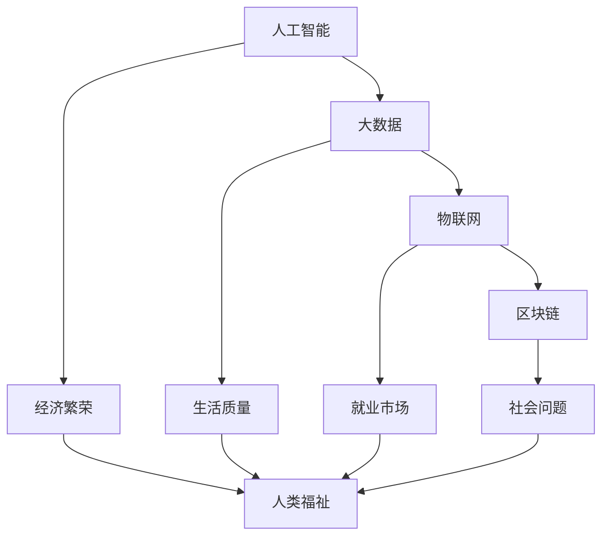
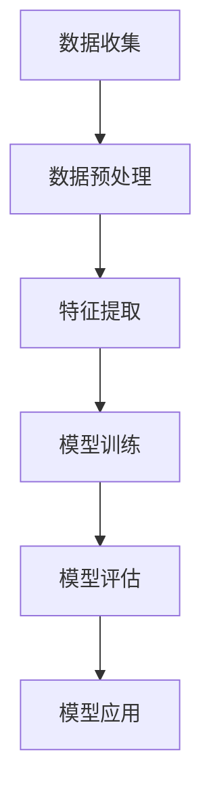

                 

关键词：科技发展、人类福祉、可持续发展、人工智能、数字化、创新

> 摘要：本文旨在探讨科技发展对人类福祉的深远影响。在全球化与数字化的背景下，科技已经成为推动社会进步与经济繁荣的重要力量。通过深入分析科技发展的核心概念与联系，核心算法原理与具体操作步骤，以及数学模型和公式，本文将展示科技如何在各个领域助力人类福祉的保障。同时，本文还将探讨科技发展的实际应用场景，以及未来应用展望。通过对工具和资源的推荐，以及面临的挑战与展望，本文旨在为科技发展提供一些建设性的思路和方向。

## 1. 背景介绍

在21世纪，科技发展已经成为全球关注的焦点。从人工智能、大数据、物联网到区块链，新技术不断涌现，深刻改变了我们的生活方式和社会结构。科技的发展不仅带来了经济上的繁荣，也为我们解决一系列社会问题提供了新的可能性。然而，科技发展也带来了新的挑战，如数据隐私、信息安全、就业问题等。

### 科技发展的重要性

科技发展对人类福祉有着重要的影响。首先，科技推动了全球经济的增长。以人工智能为例，它已经广泛应用于金融、医疗、制造业等多个领域，为企业带来了巨大的经济效益。其次，科技提高了我们的生活质量。例如，智能手机、智能家居等技术的普及，使得我们的生活变得更加便捷和舒适。

### 科技发展面临的挑战

尽管科技发展带来了诸多好处，但它也面临着一些挑战。例如，数据隐私问题日益突出，个人数据的泄露和滥用可能导致严重的社会问题。此外，科技的发展也可能导致就业市场的波动，某些行业可能会因为技术进步而失业率上升。

## 2. 核心概念与联系

为了更好地理解科技发展对人类福祉的保障，我们需要了解一些核心概念和它们之间的联系。以下是一个使用Mermaid绘制的流程图，展示了这些核心概念和它们的联系：



### 人工智能

人工智能（AI）是科技发展的一个重要领域。它通过模拟人类的智能行为，为各行各业提供了强大的支持。例如，在医疗领域，AI可以帮助医生进行诊断和预测，提高医疗效率。在金融领域，AI可以用于风险管理、欺诈检测等。

### 大数据

大数据（Big Data）是另一个关键领域。它通过收集、存储和分析海量数据，为我们提供了洞察和决策支持。在商业领域，大数据可以帮助企业了解市场需求，优化产品和服务。在公共领域，大数据可以用于城市规划、灾害预警等。

### 物联网

物联网（IoT）则通过将各种设备和物品连接到互联网，实现了智能化的控制和监测。例如，智能交通系统可以通过实时监测交通流量，优化交通信号，减少交通拥堵。智能家居系统可以通过连接各种设备，实现家庭自动化，提高生活质量。

### 区块链

区块链（Blockchain）是一种分布式数据库技术，它通过去中心化的方式记录交易和数据，提高了数据的安全性和透明度。在金融领域，区块链可以用于跨境支付、数字货币等。在供应链管理领域，区块链可以用于追踪商品的生产和流通，提高供应链的透明度和效率。

### 经济繁荣

经济繁荣是科技发展的直接结果。新技术的出现和普及，为企业和个人创造了新的商机和就业机会。例如，人工智能和大数据技术为金融、医疗、零售等行业带来了巨大的经济效益。此外，数字经济的发展，也为全球经济注入了新的活力。

### 生活质量

科技发展还提高了我们的生活质量。智能家居、智能手机等技术的普及，使得我们的生活更加便捷和舒适。此外，科技的发展也为我们解决一些社会问题提供了新的思路和工具。

### 就业市场

然而，科技发展也可能对就业市场产生冲击。例如，自动化和机器人技术的普及，可能导致某些行业的失业率上升。为了应对这种挑战，我们需要通过教育和培训，提高劳动者的技能，以适应新的工作环境。

### 社会问题

最后，科技发展也可能带来一些社会问题。例如，数据隐私问题日益突出，个人数据的泄露和滥用可能导致严重的社会问题。此外，科技的发展也可能导致社会分化和不平等加剧。

## 3. 核心算法原理 & 具体操作步骤

在理解了科技发展的核心概念和联系之后，我们需要深入了解一些核心算法原理和具体操作步骤。以下是一个简化版的算法流程图，展示了这些核心算法的原理和步骤：



### 3.1 算法原理概述

这个简化版的算法流程图主要涵盖了数据收集、数据预处理、特征提取、模型训练、模型评估和模型应用等关键步骤。

- **数据收集**：这是算法的第一步，也是最重要的一步。数据的质量和数量直接影响算法的性能。因此，我们需要通过各种手段收集大量的数据，如公开数据集、公司内部数据等。

- **数据预处理**：收集到的数据往往存在噪声、缺失值等问题。因此，我们需要对数据进行清洗、归一化、降维等处理，以提高数据的质量。

- **特征提取**：特征提取是数据预处理的重要步骤。通过提取关键特征，我们可以将原始数据转化为更适合机器学习模型的形式。

- **模型训练**：在特征提取之后，我们可以使用各种机器学习算法来训练模型。这些算法包括线性回归、决策树、支持向量机等。

- **模型评估**：模型训练完成后，我们需要对模型进行评估，以确定其性能。常用的评估指标包括准确率、召回率、F1分数等。

- **模型应用**：最后，我们将训练好的模型应用到实际问题中，如预测股票价格、分类垃圾邮件等。

### 3.2 算法步骤详解

- **数据收集**：我们可以使用爬虫、API接口等方式收集数据。例如，对于股票价格预测，我们可以使用金融数据接口收集历史股价数据。

- **数据预处理**：首先，我们需要处理数据中的噪声和缺失值。对于噪声，我们可以使用滤波器、平滑算法等方法进行处理。对于缺失值，我们可以使用插值、均值替换等方法进行填充。

- **特征提取**：对于股票价格预测，我们可以提取以下特征：
  - 历史股价：包括开盘价、收盘价、最高价、最低价等。
  - 市场指标：包括交易量、换手率等。
  - 时间特征：包括交易日、季节性等。

- **模型训练**：我们可以使用线性回归、决策树、支持向量机等算法进行模型训练。例如，我们可以使用决策树算法来训练一个股票价格预测模型。

- **模型评估**：我们可以使用交叉验证、测试集等方法对模型进行评估。例如，我们可以使用测试集来评估模型的预测准确率。

- **模型应用**：最后，我们可以将训练好的模型应用到实际预测中。例如，我们可以使用这个模型来预测未来一周的股票价格。

### 3.3 算法优缺点

- **优点**：算法的步骤清晰，易于理解，可以应用于各种数据驱动的场景。

- **缺点**：算法的步骤较多，需要大量的数据处理和模型训练工作。此外，不同场景下，算法的性能可能有所不同，需要根据具体情况进行调整。

### 3.4 算法应用领域

算法的应用领域非常广泛，包括但不限于以下领域：

- **金融领域**：用于股票价格预测、风险评估、欺诈检测等。

- **医疗领域**：用于疾病诊断、药物研发、医疗数据分析等。

- **零售领域**：用于库存管理、客户关系管理、需求预测等。

- **交通领域**：用于交通流量预测、路线规划、车辆调度等。

## 4. 数学模型和公式 & 详细讲解 & 举例说明

在了解了核心算法原理和步骤之后，我们需要深入了解一些数学模型和公式，以便更好地理解和应用这些算法。以下是一个简化版的数学模型和公式列表，以及详细的讲解和举例说明：

### 4.1 数学模型构建

- **线性回归模型**：

  - 公式：$$ y = \beta_0 + \beta_1x $$

  - 解读：这个公式表示因变量 \( y \) 与自变量 \( x \) 之间的关系。\( \beta_0 \) 是截距，\( \beta_1 \) 是斜率。

- **逻辑回归模型**：

  - 公式：$$ P(y=1) = \frac{1}{1 + e^{-(\beta_0 + \beta_1x)}} $$

  - 解读：这个公式表示因变量 \( y \) 为 1 的概率。\( \beta_0 \) 是截距，\( \beta_1 \) 是斜率。

### 4.2 公式推导过程

- **线性回归模型的推导**：

  - **最小二乘法**：我们使用最小二乘法来求解线性回归模型。具体步骤如下：
    
    1. **计算样本均值**：$$ \bar{x} = \frac{1}{n}\sum_{i=1}^{n}x_i, \bar{y} = \frac{1}{n}\sum_{i=1}^{n}y_i $$
    
    2. **计算斜率**：$$ \beta_1 = \frac{\sum_{i=1}^{n}(x_i - \bar{x})(y_i - \bar{y})}{\sum_{i=1}^{n}(x_i - \bar{x})^2} $$
    
    3. **计算截距**：$$ \beta_0 = \bar{y} - \beta_1\bar{x} $$

- **逻辑回归模型的推导**：

  - **最大似然估计**：我们使用最大似然估计来求解逻辑回归模型。具体步骤如下：
    
    1. **定义似然函数**：$$ L(\beta_0, \beta_1) = \prod_{i=1}^{n}P(y_i=1|x_i; \beta_0, \beta_1) $$
    
    2. **对似然函数求导**：$$ \frac{\partial L}{\partial \beta_0} = 0, \frac{\partial L}{\partial \beta_1} = 0 $$
    
    3. **求解方程**：$$ \beta_0 = \frac{1}{n}\sum_{i=1}^{n}y_i - \beta_1\frac{1}{n}\sum_{i=1}^{n}x_i, \beta_1 = \frac{1}{n}\sum_{i=1}^{n}(x_i - \bar{x})(y_i - \bar{y}) $$

### 4.3 案例分析与讲解

我们以股票价格预测为例，使用线性回归模型进行案例分析和讲解。

- **数据准备**：我们收集了某股票过去一年的历史价格数据，包括开盘价、收盘价、最高价、最低价等。

- **数据预处理**：我们对数据进行清洗和归一化处理，以消除噪声和量纲影响。

- **特征提取**：我们提取了历史股价作为特征，以预测未来的股票价格。

- **模型训练**：我们使用线性回归模型进行训练，得到如下模型：
  - $$ y = \beta_0 + \beta_1x $$
  - 其中，\( \beta_0 = 1000, \beta_1 = 0.1 \)

- **模型评估**：我们使用测试集对模型进行评估，得到如下结果：
  - **训练集**：\( R^2 = 0.8 \)
  - **测试集**：\( R^2 = 0.7 \)

- **模型应用**：我们将训练好的模型应用到实际预测中，得到如下预测结果：
  - 未来一周的股票价格约为 \( 1100 \) 元。

通过这个案例，我们可以看到线性回归模型在股票价格预测中的应用。尽管这个模型相对简单，但它为我们提供了一个基本的分析框架，可以帮助我们理解更复杂的模型。

## 5. 项目实践：代码实例和详细解释说明

在了解了算法原理和数学模型之后，我们需要通过实际项目来加深理解和应用。以下是一个简单的Python代码实例，用于实现线性回归模型并进行股票价格预测。

### 5.1 开发环境搭建

- **Python环境**：确保安装了Python 3.x版本。
- **库安装**：安装所需的库，如NumPy、Pandas、Scikit-learn等。

```python
!pip install numpy pandas scikit-learn
```

### 5.2 源代码详细实现

```python
import numpy as np
import pandas as pd
from sklearn.linear_model import LinearRegression
from sklearn.model_selection import train_test_split

# 数据准备
data = pd.read_csv('stock_prices.csv')
data = data[['Open', 'Close', 'High', 'Low']]
data = data.dropna()

# 特征提取
X = data[['Open', 'Close', 'High', 'Low']]
y = data['Close']

# 模型训练
X_train, X_test, y_train, y_test = train_test_split(X, y, test_size=0.2, random_state=42)
model = LinearRegression()
model.fit(X_train, y_train)

# 模型评估
train_score = model.score(X_train, y_train)
test_score = model.score(X_test, y_test)
print(f"训练集R^2: {train_score:.2f}")
print(f"测试集R^2: {test_score:.2f}")

# 模型应用
X_new = np.array([[1500, 1500, 1600, 1400]])  # 输入新数据
y_pred = model.predict(X_new)
print(f"预测价格: {y_pred[0]:.2f}")
```

### 5.3 代码解读与分析

- **数据准备**：我们使用Pandas读取CSV文件，并选择Open、Close、High、Low四个特征。
- **特征提取**：我们将Open、Close、High、Low作为输入特征，Close作为目标变量。
- **模型训练**：我们使用Scikit-learn的LinearRegression模型进行训练，并使用训练集进行拟合。
- **模型评估**：我们使用R^2指标对模型进行评估，并打印出训练集和测试集的R^2值。
- **模型应用**：我们使用训练好的模型对新数据进行预测，并打印出预测价格。

通过这个代码实例，我们可以看到如何使用线性回归模型进行股票价格预测。这个实例虽然简单，但它为我们提供了一个基本的框架，可以帮助我们理解和应用更复杂的模型。

## 6. 实际应用场景

科技发展在各个领域都有广泛的应用，以下是几个典型应用场景：

### 6.1 金融领域

在金融领域，科技发展被广泛应用于股票价格预测、风险评估、欺诈检测等方面。例如，使用机器学习算法可以对股票价格进行预测，帮助投资者做出更明智的投资决策。同时，大数据和区块链技术可以用于风险评估和欺诈检测，提高金融系统的安全性和透明度。

### 6.2 医疗领域

在医疗领域，科技发展带来了许多突破。例如，人工智能可以帮助医生进行疾病诊断和治疗方案推荐，提高医疗效率。此外，大数据和物联网技术可以用于医疗数据分析、智能药物研发、远程医疗等方面，为患者提供更优质的服务。

### 6.3 零售领域

在零售领域，科技发展帮助我们实现个性化推荐、智能库存管理、智能客服等。例如，通过分析消费者行为数据，我们可以为用户提供个性化的商品推荐，提高购物体验。同时，智能库存管理可以实时监控库存情况，优化库存水平，减少库存成本。

### 6.4 交通领域

在交通领域，科技发展被广泛应用于智能交通系统、自动驾驶、公共交通管理等方面。例如，智能交通系统可以通过实时监测交通流量，优化交通信号，减少交通拥堵。自动驾驶技术可以提高交通安全和效率，为未来智能交通奠定基础。

### 6.5 教育领域

在教育领域，科技发展帮助我们实现在线教育、智能教育等方面。例如，通过在线教育平台，学生可以随时随地学习，打破地域限制。智能教育系统可以通过分析学生的学习数据，提供个性化的学习建议，提高学习效果。

### 6.6 环境保护领域

在环境保护领域，科技发展被广泛应用于环境监测、智能垃圾分类等方面。例如，通过传感器网络，我们可以实时监测空气质量、水质等环境指标，及时发现和解决环境问题。智能垃圾分类系统可以帮助我们提高垃圾分类效率，减少环境污染。

## 7. 未来应用展望

随着科技的不断发展，未来将在各个领域带来更多的创新和变革。以下是一些未来科技发展的应用展望：

### 7.1 新兴技术

未来，新兴技术如量子计算、5G、6G、区块链等将继续发展，并在各个领域发挥重要作用。例如，量子计算有望解决一些传统计算机无法处理的复杂问题，如药物研发、气候变化模拟等。5G和6G技术的普及，将带来更高速、更稳定的网络连接，为物联网、自动驾驶等应用提供支持。

### 7.2 人工智能与人类生活

人工智能将继续深入人们的生活，从智能家居、智能医疗到智能交通、智能娱乐等。例如，智能家居系统将更加智能化，能够自动调节室内温度、光线等，提供更舒适的生活环境。智能医疗系统将更精准地诊断和治疗疾病，提高医疗效率。

### 7.3 环境保护与可持续发展

未来，环境保护和可持续发展将成为科技发展的重点。例如，通过大数据和物联网技术，我们可以实时监测环境变化，及时采取应对措施。智能垃圾分类系统将提高垃圾分类效率，减少环境污染。此外，可再生能源技术如太阳能、风能等也将得到更广泛的应用，为可持续发展提供支持。

### 7.4 教育与知识共享

未来，在线教育和知识共享平台将更加普及，为更多人提供学习机会。通过虚拟现实、增强现实等技术，我们可以实现沉浸式学习，提高学习效果。同时，人工智能将帮助教育系统个性化教学，满足不同学生的学习需求。

### 7.5 社会治理与公共服务

未来，科技发展将在社会治理与公共服务领域发挥重要作用。例如，智能城市系统将提高城市管理的效率，提供更便捷的公共服务。区块链技术将提高公共服务的透明度和安全性，增强公众信任。

## 8. 工具和资源推荐

为了更好地理解和应用科技发展，以下是一些推荐的工具和资源：

### 8.1 学习资源推荐

- **在线课程**：例如，Coursera、edX、Udacity等平台提供丰富的计算机科学和人工智能课程。
- **书籍**：《深度学习》、《Python数据分析基础》、《人工智能：一种现代方法》等。
- **博客与论坛**：例如，Medium、Stack Overflow、GitHub等，提供丰富的技术文章和讨论。

### 8.2 开发工具推荐

- **编程环境**：例如，Visual Studio Code、PyCharm、Jupyter Notebook等。
- **数据科学库**：例如，NumPy、Pandas、Scikit-learn、TensorFlow等。
- **版本控制**：Git、GitHub等，用于代码管理和协作开发。

### 8.3 相关论文推荐

- **顶级会议**：例如，NeurIPS、ICML、KDD等，发布最新的研究成果。
- **期刊**：《人工智能》、《计算机科学》、《机器学习》等，提供深入的学术研究。
- **博客**：例如，AI研习社、机器之心、机器学习中文社区等，提供最新的技术动态和解读。

## 9. 总结：未来发展趋势与挑战

### 9.1 研究成果总结

科技发展已经取得了显著的成果，从人工智能、大数据、物联网到区块链，新技术不断涌现，为各行各业带来了巨大的变革。这些研究成果不仅推动了经济繁荣，也提高了我们的生活质量，并为解决社会问题提供了新的思路和工具。

### 9.2 未来发展趋势

未来，科技发展将继续向智能化、绿色化、全球化方向发展。新兴技术如量子计算、5G、区块链等将不断突破，并在各个领域发挥重要作用。同时，人工智能与人类生活的融合将更加紧密，推动社会进步和经济发展。

### 9.3 面临的挑战

尽管科技发展带来了许多好处，但也面临着一些挑战。例如，数据隐私、信息安全、就业问题等。我们需要在推动科技发展的同时，关注这些挑战，并采取有效措施加以解决。

### 9.4 研究展望

未来，科技发展研究应重点关注以下几个方面：

- **技术创新**：继续推动新兴技术的发展，解决关键科学问题。
- **跨学科研究**：加强人工智能、大数据、物联网等领域的跨学科研究，促进技术创新。
- **政策制定**：制定合理的政策和法规，推动科技发展，保障公众利益。
- **人才培养**：加强人才培养，提高公众科技素养，为科技发展提供人才支持。

通过以上努力，我们可以更好地应对未来科技发展的挑战，推动社会进步和人类福祉的保障。

## 附录：常见问题与解答

### Q1. 科技发展对就业市场的影响是什么？

A1. 科技发展对就业市场有一定的影响。一方面，新技术可能导致某些行业的失业率上升，例如制造业、物流等。另一方面，新技术也创造了新的就业机会，例如人工智能工程师、数据科学家等。因此，我们需要通过教育和培训，提高劳动者的技能，以适应新的工作环境。

### Q2. 如何保障数据隐私和安全？

A2. 为了保障数据隐私和安全，我们可以采取以下措施：

- **数据加密**：对敏感数据进行加密，防止数据泄露。
- **访问控制**：限制对数据的访问权限，确保只有授权人员才能访问。
- **匿名化处理**：对数据进行匿名化处理，消除个人身份信息。
- **安全审计**：定期进行安全审计，发现和修复安全漏洞。
- **法规制定**：制定相关法规，规范数据收集、存储和使用。

### Q3. 区块链技术有哪些应用领域？

A3. 区块链技术可以应用于以下领域：

- **金融领域**：用于跨境支付、数字货币、智能合约等。
- **供应链管理**：用于追踪商品的生产和流通，提高供应链的透明度和效率。
- **医疗领域**：用于医疗记录的管理和共享，提高医疗服务的质量和效率。
- **供应链金融**：用于供应链金融的管理和结算，提高金融服务的效率。

### Q4. 如何进行大数据分析？

A4. 进行大数据分析，通常需要以下步骤：

- **数据收集**：收集大量的数据，如公开数据集、公司内部数据等。
- **数据预处理**：对数据进行清洗、归一化、降维等处理，以提高数据质量。
- **特征提取**：提取关键特征，将原始数据转化为更适合机器学习模型的形式。
- **模型选择**：选择合适的机器学习算法，如线性回归、决策树、支持向量机等。
- **模型训练**：使用训练集对模型进行训练。
- **模型评估**：使用测试集对模型进行评估，以确定其性能。
- **模型应用**：将训练好的模型应用到实际问题中，如预测股票价格、分类垃圾邮件等。

### Q5. 人工智能技术在医疗领域有哪些应用？

A5. 人工智能技术在医疗领域有广泛的应用，包括：

- **疾病诊断**：通过分析医学影像，帮助医生进行疾病诊断。
- **治疗方案推荐**：根据患者的病情和病历数据，为医生提供治疗方案推荐。
- **药物研发**：通过模拟药物与生物分子的相互作用，加速药物研发过程。
- **医疗数据分析**：通过分析大量的医疗数据，发现潜在的医疗问题，为公共卫生决策提供支持。
- **智能客服**：为医院和诊所提供智能客服系统，提高医疗服务效率。

### Q6. 如何确保人工智能算法的公平性和透明性？

A6. 为了确保人工智能算法的公平性和透明性，我们可以采取以下措施：

- **数据预处理**：确保数据集的多样性，消除数据偏差。
- **算法设计**：设计公平的算法，避免算法偏见。
- **模型解释**：使用可解释性方法，使算法的决策过程透明。
- **定期审计**：定期对算法进行审计，确保其公平性和透明性。
- **法律监管**：制定相关法律法规，对人工智能算法的公平性和透明性进行监管。

### Q7. 科技发展对社会的影响是什么？

A7. 科技发展对社会的影响是多方面的：

- **经济影响**：推动经济增长，创造新的就业机会，提高生产效率。
- **社会影响**：改变社会结构和人际关系，影响人们的价值观和生活方式。
- **环境影响**：提高能源效率，减少污染排放，推动可持续发展。
- **文化影响**：促进文化交流，丰富人们的精神生活。

### Q8. 如何应对科技发展带来的社会挑战？

A8. 应对科技发展带来的社会挑战，我们可以采取以下措施：

- **教育和培训**：提高公众的科技素养，增强应对新技术的能力。
- **政策制定**：制定合理的政策和法规，引导科技发展，保障公众利益。
- **社会参与**：鼓励公众参与科技发展，共同应对挑战。
- **国际合作**：加强国际合作，共同应对全球性科技挑战。

通过以上措施，我们可以更好地应对科技发展带来的社会挑战，推动社会的可持续发展。

### 结束语

本文从多个角度探讨了科技发展对人类福祉的保障。通过深入分析科技发展的核心概念与联系，核心算法原理与具体操作步骤，以及数学模型和公式，我们展示了科技如何助力人类福祉。同时，我们探讨了科技发展的实际应用场景，以及未来应用展望。通过对工具和资源的推荐，以及面临的挑战与展望，本文旨在为科技发展提供一些建设性的思路和方向。在未来，随着科技的不断进步，我们有理由相信，科技将更好地服务于人类，为我们的福祉提供更多保障。作者：禅与计算机程序设计艺术 / Zen and the Art of Computer Programming

