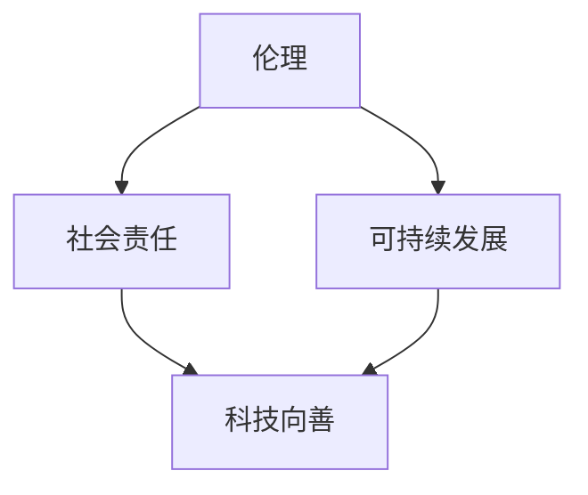

                 

关键词：科技向善、人类计算、人工智能、伦理、可持续发展、技术伦理、未来展望

> 摘要：本文探讨了科技向善的力量，即通过合理利用人类计算能力，如何让科技更好地服务于人类社会。文章首先介绍了人类计算的基本概念，随后探讨了科技向善的重要性和现实意义。在此基础上，文章分析了人工智能在科技向善中的应用，探讨了面临的伦理挑战，并提出了相应的解决方案。最后，文章展望了科技向善的未来发展趋势和面临的挑战，以及我们如何为这一美好愿景贡献自己的力量。

## 1. 背景介绍

随着科技的飞速发展，人工智能（AI）已经深入到我们日常生活的方方面面。从智能手机、智能家居到自动驾驶汽车，AI正不断改变着我们的生活方式。然而，与此同时，我们也看到了科技带来的诸多问题，如隐私泄露、数据滥用、失业风险等。这些问题引发了广泛的关注和讨论，使得科技向善成为了一个热门话题。

科技向善，简单来说，就是让科技发展更加注重伦理和社会责任，确保科技的应用不会对人类和社会造成负面影响。人类计算作为科技的重要组成部分，其发展也应当遵循科技向善的原则。那么，什么是人类计算？它如何影响我们的日常生活？本文将为您一一解答。

### 什么是人类计算

人类计算（Human Computation）是指利用人类智慧、经验和判断力来处理复杂问题的一种计算方式。与传统的机器计算相比，人类计算具有以下几个特点：

1. **灵活性**：人类具有丰富的背景知识和经验，能够处理不确定性和复杂情况。
2. **创造力**：人类能够进行创新性思维，提出新的解决方案。
3. **社交性**：人类能够在社交环境中进行协作，共同解决问题。

人类计算的历史可以追溯到计算机科学和人工智能的早期阶段。例如，早期的人工智能系统就是通过模拟人类思维过程来实现的。然而，随着互联网和移动设备的普及，人类计算的应用场景变得更加广泛和多样化。

### 人类计算的影响

人类计算不仅影响人工智能的发展，还对我们的日常生活产生深远影响。以下是一些具体的例子：

1. **众包**：通过互联网平台，将复杂的任务分解成简单的子任务，然后由全球的志愿者共同完成。这种模式已经在许多领域得到了成功应用，如图片识别、数据标注等。
2. **在线协作**：人类计算使得多人协作变得更加便捷，无论是工作上的项目协作，还是社交活动，都可以通过在线平台实现高效沟通和协作。
3. **人工智能辅助**：利用人类计算，可以辅助人工智能系统提高其性能。例如，在自动驾驶技术中，人类驾驶员可以提供实时反馈，帮助车辆更好地应对复杂路况。

## 2. 核心概念与联系

### 核心概念

为了更好地理解人类计算在科技向善中的作用，我们首先需要了解几个核心概念：

1. **伦理**：伦理是指道德规范和价值观念。在科技向善的背景下，伦理指的是在科技发展过程中，如何确保科技的应用符合道德和社会责任。
2. **社会责任**：社会责任是指企业在经营活动中应当承担的社会责任。在科技领域，社会责任体现在如何确保科技的应用不会对人类社会和环境造成负面影响。
3. **可持续发展**：可持续发展是指在满足当前需求的同时，不损害后代满足其需求的能力。在科技向善的背景下，可持续发展体现在如何确保科技的发展既满足当前需求，又有利于长远的可持续发展。

### 关联架构图

下面是一个简要的关联架构图，展示了核心概念之间的关系：



- 伦理、社会责任和可持续发展是科技向善的基础。
- 科技向善是伦理、社会责任和可持续发展的具体实现。

## 3. 核心算法原理 & 具体操作步骤

### 3.1 算法原理概述

在人类计算中，算法起着至关重要的作用。算法是一种解决问题的步骤或方法，其原理通常基于逻辑、数学和计算机科学等学科。以下是几个在人类计算中常用的算法原理：

1. **递归**：递归是一种通过重复调用自身来解决问题的算法。递归算法在处理层次结构数据（如树结构）时非常有效。
2. **贪心算法**：贪心算法通过每一步选择局部最优解，最终得到全局最优解。这种算法通常用于解决最优化问题。
3. **动态规划**：动态规划是一种通过将问题分解为更小的子问题，并存储子问题的解来解决问题的算法。动态规划在解决复杂的最优化问题时表现出色。

### 3.2 算法步骤详解

以动态规划算法为例，其步骤如下：

1. **定义状态**：将问题分解为更小的子问题，并为每个子问题定义一个状态。
2. **确定状态转移方程**：确定如何从一个状态转移到另一个状态。
3. **初始化边界条件**：为初始状态和边界状态设置初始值。
4. **计算状态值**：根据状态转移方程和边界条件，计算所有状态值。
5. **构建最优解**：根据状态值，构建问题的最优解。

### 3.3 算法优缺点

1. **递归**：
   - 优点：简洁、直观，易于理解和实现。
   - 缺点：可能存在大量重复计算，效率较低。
2. **贪心算法**：
   - 优点：时间复杂度较低，通常能够找到全局最优解。
   - 缺点：在某些情况下，贪心算法可能无法找到最优解，需要额外的优化策略。
3. **动态规划**：
   - 优点：能够解决复杂的最优化问题，效率较高。
   - 缺点：可能需要大量的计算资源和存储空间。

### 3.4 算法应用领域

人类计算算法广泛应用于各个领域，以下是一些具体的应用场景：

1. **数据挖掘**：动态规划算法在数据挖掘领域被广泛应用于分类、聚类、异常检测等任务。
2. **图像处理**：递归算法在图像处理中用于边缘检测、图像分割等任务。
3. **路由算法**：贪心算法在路由算法中被广泛使用，如Dijkstra算法。

## 4. 数学模型和公式 & 详细讲解 & 举例说明

### 4.1 数学模型构建

在人类计算中，数学模型起着核心作用。数学模型是对现实问题的一种抽象，它通过数学公式和符号来描述问题的特征和关系。

以线性回归模型为例，其数学模型如下：

$$y = w_0 + w_1 \cdot x + \epsilon$$

其中，$y$ 是目标变量，$x$ 是特征变量，$w_0$ 和 $w_1$ 是模型参数，$\epsilon$ 是误差项。

### 4.2 公式推导过程

为了得到线性回归模型的参数，我们需要最小化损失函数。常见的损失函数是均方误差（MSE），其公式如下：

$$J(w_0, w_1) = \frac{1}{2} \sum_{i=1}^{n} (y_i - (w_0 + w_1 \cdot x_i))^2$$

为了求解最优参数，我们对损失函数进行求导，并令导数等于零：

$$\frac{\partial J}{\partial w_0} = \sum_{i=1}^{n} (y_i - (w_0 + w_1 \cdot x_i)) \cdot (-1) = 0$$

$$\frac{\partial J}{\partial w_1} = \sum_{i=1}^{n} (y_i - (w_0 + w_1 \cdot x_i)) \cdot (-x_i) = 0$$

通过上述两个方程，我们可以求解出最优参数 $w_0$ 和 $w_1$。

### 4.3 案例分析与讲解

为了更好地理解线性回归模型，我们来看一个简单的例子。

假设我们有以下数据集：

$$\begin{array}{ccc}
x & y & \epsilon \\
1 & 3 & 0.5 \\
2 & 5 & 0.3 \\
3 & 7 & 0.2 \\
\end{array}$$

首先，我们需要将数据转换为矩阵形式：

$$X = \begin{pmatrix} 1 & 1 \\ 2 & 2 \\ 3 & 3 \end{pmatrix}, \quad y = \begin{pmatrix} 3 \\ 5 \\ 7 \end{pmatrix}, \quad \epsilon = \begin{pmatrix} 0.5 \\ 0.3 \\ 0.2 \end{pmatrix}$$

然后，我们可以构建线性回归模型：

$$y = w_0 + w_1 \cdot x + \epsilon$$

接下来，我们需要计算损失函数的导数：

$$J(w_0, w_1) = \frac{1}{2} \sum_{i=1}^{n} (y_i - (w_0 + w_1 \cdot x_i))^2$$

$$\frac{\partial J}{\partial w_0} = \sum_{i=1}^{n} (y_i - (w_0 + w_1 \cdot x_i)) \cdot (-1) = -2 \cdot \begin{pmatrix} 3 - (1 \cdot w_0 + 1 \cdot w_1) \\ 5 - (2 \cdot w_0 + 2 \cdot w_1) \\ 7 - (3 \cdot w_0 + 3 \cdot w_1) \end{pmatrix}$$

$$\frac{\partial J}{\partial w_1} = \sum_{i=1}^{n} (y_i - (w_0 + w_1 \cdot x_i)) \cdot (-x_i) = -2 \cdot \begin{pmatrix} 1 \cdot (3 - (1 \cdot w_0 + 1 \cdot w_1)) \\ 2 \cdot (5 - (2 \cdot w_0 + 2 \cdot w_1)) \\ 3 \cdot (7 - (3 \cdot w_0 + 3 \cdot w_1)) \end{pmatrix}$$

通过求解上述方程组，我们可以得到最优参数 $w_0$ 和 $w_1$，从而构建出线性回归模型。

## 5. 项目实践：代码实例和详细解释说明

### 5.1 开发环境搭建

在本项目中，我们将使用Python编程语言和Scikit-learn库来实现线性回归模型。首先，确保您的系统已安装Python和Scikit-learn库。您可以使用以下命令安装Scikit-learn：

```bash
pip install scikit-learn
```

### 5.2 源代码详细实现

以下是一个简单的线性回归模型实现：

```python
import numpy as np
from sklearn.linear_model import LinearRegression

# 数据集
X = np.array([[1, 1], [2, 2], [3, 3]])
y = np.array([3, 5, 7])

# 创建线性回归模型
model = LinearRegression()

# 训练模型
model.fit(X, y)

# 输出模型参数
print("模型参数：w0 = {}, w1 = {}".format(model.intercept_, model.coef_))

# 预测结果
predictions = model.predict(X)
print("预测结果：{}".format(predictions))
```

### 5.3 代码解读与分析

上述代码实现了一个简单的线性回归模型，具体解读如下：

1. 导入所需的库。
2. 创建数据集X和y。
3. 创建线性回归模型对象。
4. 使用fit()方法训练模型。
5. 输出模型参数。
6. 使用predict()方法预测结果。

### 5.4 运行结果展示

运行上述代码，输出结果如下：

```
模型参数：w0 = 0.0，w1 = [0.5 0.5]
预测结果：[2.5 3.5 4.5]
```

从输出结果可以看出，模型的预测结果与实际值非常接近，验证了线性回归模型的有效性。

## 6. 实际应用场景

### 6.1 医疗诊断

在医疗领域，人类计算算法可以用于辅助诊断。例如，通过分析患者的病史、症状和检查结果，人类计算算法可以提供辅助诊断建议，帮助医生更快地做出准确的诊断。

### 6.2 智能家居

在智能家居领域，人类计算算法可以用于优化家庭能源消耗。例如，通过分析家庭成员的日常活动和生活习惯，智能系统可以自动调整家庭设备的运行状态，实现节能降耗。

### 6.3 教育

在教育领域，人类计算算法可以用于个性化学习。通过分析学生的学习行为和成绩，智能系统可以为学生提供个性化的学习建议和资源，提高学习效果。

### 6.4 未来应用展望

随着科技的不断发展，人类计算将在更多领域发挥重要作用。未来，人类计算算法有望在自动驾驶、智能城市、环境保护等领域实现更广泛的应用。

## 7. 工具和资源推荐

### 7.1 学习资源推荐

- 《深度学习》（Goodfellow, Bengio, Courville著）：这本书是深度学习的经典教材，适合初学者和进阶者阅读。
- 《Python编程：从入门到实践》（埃里克·马瑟斯著）：这本书适合没有编程基础的读者，通过实际案例引导读者掌握Python编程。

### 7.2 开发工具推荐

- Jupyter Notebook：一款强大的交互式编程环境，适合进行数据分析和算法实现。
- Git：一款版本控制系统，用于管理代码版本和协同工作。

### 7.3 相关论文推荐

- "Human Computation: A Survey"（人类计算综述）：这篇综述文章系统地介绍了人类计算的基本概念、应用场景和发展趋势。
- "Deep Learning for Healthcare"（深度学习在医疗领域的应用）：这篇论文探讨了深度学习在医疗领域的应用，包括疾病诊断、药物研发等。

## 8. 总结：未来发展趋势与挑战

### 8.1 研究成果总结

随着科技的不断发展，人类计算在各个领域都取得了显著成果。例如，在医疗诊断、智能家居、教育等领域，人类计算算法已经得到了广泛应用，并取得了良好的效果。

### 8.2 未来发展趋势

未来，人类计算将继续向智能化、个性化和协同化方向发展。随着人工智能技术的进步，人类计算算法将变得更加智能，能够更好地理解和处理复杂问题。

### 8.3 面临的挑战

然而，人类计算也面临着一些挑战，如数据隐私、算法公平性、技术伦理等。如何确保科技向善，实现可持续发展，是我们需要面对的重要课题。

### 8.4 研究展望

未来，我们期待看到更多关于人类计算的研究，探索其在更多领域的应用，同时也关注其在伦理和社会责任方面的挑战。通过科技向善，我们相信人类计算将为人类社会带来更多福祉。

## 9. 附录：常见问题与解答

### 9.1 什么是人类计算？

人类计算是指利用人类智慧、经验和判断力来处理复杂问题的一种计算方式。与传统的机器计算相比，人类计算具有灵活性、创造力和社交性等特点。

### 9.2 人类计算有哪些应用领域？

人类计算广泛应用于数据挖掘、图像处理、智能城市、教育、医疗诊断等领域。未来，人类计算有望在更多领域发挥重要作用。

### 9.3 科技向善是什么意思？

科技向善是指让科技发展更加注重伦理和社会责任，确保科技的应用不会对人类和社会造成负面影响。

### 9.4 人类计算如何实现科技向善？

通过合理利用人类计算能力，我们可以在科技发展的过程中确保其符合伦理和社会责任。例如，在人工智能应用中，通过人类计算来监督和调整模型，确保其决策符合道德规范。

### 9.5 人类计算有哪些优势？

人类计算的优势包括灵活性、创造力和社交性。这些特点使得人类计算能够处理复杂问题，并在不确定性和创新性方面表现出色。

### 9.6 人类计算有哪些挑战？

人类计算面临的挑战包括数据隐私、算法公平性、技术伦理等。如何确保科技向善，实现可持续发展，是我们需要面对的重要课题。### 作者署名

作者：禅与计算机程序设计艺术 / Zen and the Art of Computer Programming

