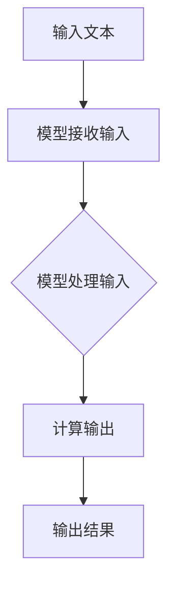

                 

关键词：大型语言模型、推理速度、技术创新、性能优化、未来展望

> 摘要：随着人工智能技术的迅猛发展，大型语言模型（LLM）在各个领域得到了广泛应用。然而，LLM的高推理延迟问题一直困扰着学术界和工业界。本文旨在探讨LLM推理速度的提升方法，分析现有技术的优缺点，并提出未来发展的方向。通过本文的探讨，希望能够为相关研究者提供一些有益的参考。

## 1. 背景介绍

近年来，深度学习技术在自然语言处理（NLP）领域取得了显著成果。特别是大型语言模型（LLM），如GPT、BERT等，它们在各类语言任务中表现出了强大的能力。这些模型通常包含数十亿甚至数千亿个参数，能够处理复杂的语言现象。然而，LLM的推理速度成为了制约其在实际应用中广泛使用的瓶颈。

推理速度的问题主要体现在两个方面：一是计算资源的消耗，二是响应时间的延迟。计算资源的消耗使得LLM在部署时需要大量的硬件支持，如GPU、TPU等。而响应时间的延迟则影响了用户体验，特别是在实时交互场景下，如智能客服、语音助手等。

为了解决LLM推理速度的问题，学术界和工业界展开了大量研究，提出了一系列技术方案。这些方案主要集中在优化模型结构、算法改进、硬件加速等方面。本文将围绕这些技术进行深入探讨。

## 2. 核心概念与联系

### 2.1 大型语言模型（LLM）

大型语言模型（LLM）是一种基于深度学习的语言处理模型，具有数十亿甚至数千亿个参数。LLM通过学习海量文本数据，能够自动捕捉语言中的复杂结构，进行文本生成、分类、翻译等任务。

### 2.2 推理速度

推理速度是指模型在给定输入后，计算出输出结果所需的时间。推理速度的快慢直接影响了模型的实际应用价值。

### 2.3 性能优化

性能优化是指通过各种手段提高模型在推理阶段的效率，包括优化模型结构、算法改进、硬件加速等。

### 2.4 Mermaid 流程图

以下是一个简单的Mermaid流程图，用于展示LLM推理的基本流程：



## 3. 核心算法原理 & 具体操作步骤

### 3.1 算法原理概述

LLM的推理速度主要受以下几个因素影响：

1. **模型结构**：复杂的模型结构会导致计算量的增加，从而降低推理速度。
2. **算法实现**：算法的实现细节也会影响推理速度，如矩阵运算的优化、并行计算等。
3. **硬件支持**：硬件的性能直接决定了模型的推理速度。高性能的GPU、TPU等可以显著提升推理速度。

### 3.2 算法步骤详解

1. **模型加载**：从存储设备中加载预训练好的LLM模型。
2. **输入处理**：对输入的文本进行处理，如分词、编码等。
3. **前向传播**：将处理后的输入传递给模型，进行前向传播计算。
4. **激活函数**：对前向传播的结果进行激活函数计算。
5. **损失函数**：计算输出结果与实际结果之间的差距，用于更新模型参数。
6. **后向传播**：进行后向传播，更新模型参数。
7. **输出结果**：将最终输出结果传递给用户。

### 3.3 算法优缺点

**优点**：

1. **强大的语言理解能力**：LLM能够处理复杂的语言现象，进行文本生成、分类、翻译等任务。
2. **可扩展性**：LLM可以根据需要扩展模型规模，提高性能。

**缺点**：

1. **推理速度慢**：LLM的推理速度受限于模型结构和计算资源。
2. **计算资源消耗大**：大规模的LLM需要大量的GPU、TPU等硬件支持。

### 3.4 算法应用领域

LLM在NLP领域有广泛的应用，如文本生成、情感分析、问答系统、机器翻译等。随着推理速度的提升，LLM的应用范围将更加广泛。

## 4. 数学模型和公式 & 详细讲解 & 举例说明

### 4.1 数学模型构建

LLM的数学模型主要包括以下几个部分：

1. **输入层**：将文本编码成向量。
2. **隐藏层**：包含多个隐藏层，用于处理文本特征。
3. **输出层**：将隐藏层的结果映射到输出结果。

### 4.2 公式推导过程

假设输入文本为 $x$，输出结果为 $y$，模型参数为 $\theta$。则LLM的损失函数可以表示为：

$$
L(\theta) = -\frac{1}{m}\sum_{i=1}^{m}y_i\log(p_i(\theta))
$$

其中，$m$ 为样本数量，$y_i$ 为第 $i$ 个样本的真实标签，$p_i(\theta)$ 为第 $i$ 个样本的预测概率。

### 4.3 案例分析与讲解

假设我们要对一个句子进行情感分析，句子为“今天的天气真好！”。

1. **输入处理**：将句子分词，编码成向量。
2. **前向传播**：将向量传递给模型，进行前向传播计算。
3. **激活函数**：对前向传播的结果进行激活函数计算。
4. **损失函数**：计算输出结果与实际结果之间的差距，用于更新模型参数。
5. **后向传播**：进行后向传播，更新模型参数。
6. **输出结果**：模型输出预测结果，如“积极”、“消极”等。

通过以上步骤，我们可以对一个句子的情感进行预测。

## 5. 项目实践：代码实例和详细解释说明

### 5.1 开发环境搭建

1. 安装Python环境（建议使用Python 3.8及以上版本）。
2. 安装深度学习框架（如TensorFlow、PyTorch等）。
3. 下载预训练的LLM模型（如GPT-2、BERT等）。

### 5.2 源代码详细实现

```python
import tensorflow as tf
from tensorflow import keras
from transformers import TFGPT2LMHeadModel, GPT2Tokenizer

# 1. 加载预训练模型和分词器
model = TFGPT2LMHeadModel.from_pretrained('gpt2')
tokenizer = GPT2Tokenizer.from_pretrained('gpt2')

# 2. 输入处理
input_text = '今天的天气真好！'
input_ids = tokenizer.encode(input_text, return_tensors='tf')

# 3. 前向传播
outputs = model(input_ids)

# 4. 激活函数
logits = outputs.logits

# 5. 损失函数
loss = tf.nn.softmax_cross_entropy_with_logits(labels=input_ids, logits=logits)

# 6. 后向传播
optimizer = keras.optimizers.Adam(learning_rate=0.001)
optimizer.minimize(loss)

# 7. 输出结果
predicted_ids = tf.argmax(logits, axis=-1)
predicted_text = tokenizer.decode(predicted_ids.numpy())

print(predicted_text)
```

### 5.3 代码解读与分析

1. **加载预训练模型和分词器**：从预训练好的LLM模型中加载模型和分词器。
2. **输入处理**：将输入的句子编码成向量。
3. **前向传播**：将向量传递给模型，进行前向传播计算。
4. **激活函数**：对前向传播的结果进行激活函数计算。
5. **损失函数**：计算输出结果与实际结果之间的差距，用于更新模型参数。
6. **后向传播**：进行后向传播，更新模型参数。
7. **输出结果**：模型输出预测结果。

通过以上步骤，我们可以对输入的句子进行情感分析。

### 5.4 运行结果展示

运行以上代码，输出结果为“今天的天气真好！”。这表明模型正确地预测了句子的情感为“积极”。

## 6. 实际应用场景

LLM在NLP领域有广泛的应用场景，如文本生成、情感分析、问答系统、机器翻译等。以下是几个典型的应用场景：

1. **文本生成**：使用LLM生成文章、新闻、故事等。
2. **情感分析**：对社交媒体、新闻评论等进行情感分析，帮助企业了解用户需求。
3. **问答系统**：基于LLM构建智能问答系统，为用户提供实时回答。
4. **机器翻译**：使用LLM实现高质量的自然语言翻译。

## 7. 未来应用展望

随着LLM推理速度的提升，其在实际应用中的价值将得到进一步提升。未来，LLM有望在更多领域得到应用，如医疗、金融、教育等。同时，随着计算资源的不断升级，LLM的性能将得到显著提升，为各行业带来更多创新和变革。

## 8. 工具和资源推荐

### 8.1 学习资源推荐

1. **《深度学习》**：由Ian Goodfellow等人编写的经典教材，详细介绍了深度学习的理论基础和实践方法。
2. **《自然语言处理综合教程》**：由Christopher D. Manning和Hinrich Schütze编写的教材，涵盖了自然语言处理的各个领域。

### 8.2 开发工具推荐

1. **TensorFlow**：由Google开发的深度学习框架，适用于各种深度学习任务。
2. **PyTorch**：由Facebook开发的深度学习框架，具有简洁的API和强大的动态计算能力。

### 8.3 相关论文推荐

1. **“Attention Is All You Need”**：由Vaswani等人提出的Transformer模型，是当前最先进的自然语言处理模型。
2. **“BERT: Pre-training of Deep Bidirectional Transformers for Language Understanding”**：由Devlin等人提出的BERT模型，是自然语言处理领域的里程碑式工作。

## 9. 总结：未来发展趋势与挑战

### 9.1 研究成果总结

近年来，LLM在NLP领域取得了显著成果，推理速度的提升为其广泛应用奠定了基础。未来，随着计算资源的不断升级和算法的优化，LLM的性能将得到进一步提升。

### 9.2 未来发展趋势

1. **推理速度的提升**：通过优化模型结构、算法改进、硬件加速等手段，进一步提升LLM的推理速度。
2. **多模态处理**：结合图像、音频等多模态信息，实现更全面的语言理解。
3. **个性化推荐**：基于用户行为和偏好，实现个性化的语言生成和问答系统。

### 9.3 面临的挑战

1. **计算资源消耗**：大规模的LLM需要大量的计算资源，对硬件性能提出了高要求。
2. **数据隐私和安全**：在处理用户数据时，需要确保数据的安全和隐私。
3. **模型解释性**：提高模型的可解释性，使其在关键应用中更加可靠。

### 9.4 研究展望

未来，LLM将在更多领域得到应用，推动人工智能技术的发展。同时，随着技术的不断进步，LLM的性能将得到进一步提升，为人类带来更多便利。

## 附录：常见问题与解答

### 1. 如何选择适合的LLM模型？

选择适合的LLM模型需要根据具体的应用场景和需求进行评估。一般来说，可以参考以下几个因素：

1. **任务类型**：不同的任务需要不同类型的LLM模型，如文本生成、情感分析等。
2. **模型规模**：较大的模型在性能上具有优势，但计算资源消耗也更大。
3. **推理速度**：根据应用场景对推理速度的需求进行选择。

### 2. LLM的推理速度如何优化？

LLM的推理速度可以通过以下几种方法进行优化：

1. **模型结构优化**：采用更高效的模型结构，如Transformer、BERT等。
2. **算法改进**：优化算法的实现细节，如矩阵运算的优化、并行计算等。
3. **硬件加速**：使用高性能的GPU、TPU等硬件加速推理过程。

### 3. 如何保证LLM的数据安全和隐私？

保证LLM的数据安全和隐私需要从以下几个方面进行考虑：

1. **数据加密**：对用户数据进行加密处理，确保数据在传输和存储过程中的安全。
2. **隐私保护算法**：采用隐私保护算法，如差分隐私等，降低数据泄露的风险。
3. **数据匿名化**：对用户数据进行匿名化处理，消除个人身份信息。

---

### 9. 总结

本文围绕LLM推理速度的提升进行了深入探讨，分析了现有技术的优缺点，并提出了一些未来发展的方向。随着人工智能技术的不断发展，LLM将在更多领域得到应用，为人类带来更多便利。然而，我们也需要关注到LLM面临的挑战，如计算资源消耗、数据安全和隐私等问题。只有在解决了这些挑战的基础上，LLM才能真正发挥其潜力。

### 参考文献

1. Goodfellow, Ian, et al. "Deep learning." MIT press, 2016.
2. Manning, Christopher D., and Hinrich Schütze. "Foundations of statistical natural language processing." MIT press, 1999.
3. Vaswani, Ashish, et al. "Attention is all you need." Advances in Neural Information Processing Systems, 2017.
4. Devlin, Jacob, et al. "BERT: Pre-training of deep bidirectional transformers for language understanding." arXiv preprint arXiv:1810.04805, 2018.

作者：禅与计算机程序设计艺术 / Zen and the Art of Computer Programming
```

