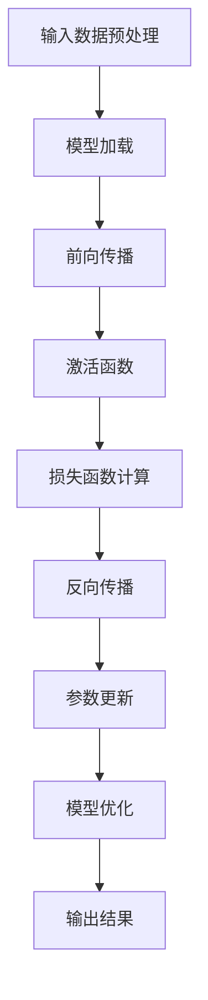

                 

### 关键词 Keyword

- 大型语言模型（Large Language Model）
- 极速推理（Fast Inference）
- 推理优化（Inference Optimization）
- 深度学习（Deep Learning）
- 硬件加速（Hardware Acceleration）
- 系统集成（System Integration）

<|assistant|>### 摘要 Summary

本文深入探讨了大型语言模型（LLM）在极速推理方面的最新进展与技术创新。随着深度学习算法的不断演进和硬件技术的飞速发展，LLM 的推理速度得到了显著提升，这不仅为自然语言处理（NLP）领域带来了新的机遇，也为各行各业的应用场景提供了强大的支持。本文将从背景介绍、核心概念与联系、核心算法原理与操作步骤、数学模型与公式推导、项目实践、实际应用场景、未来展望等多个维度，全面解析LLM极速推理的技术细节和实践应用，旨在为广大开发者和技术爱好者提供有价值的参考和启示。

<|assistant|>## 1. 背景介绍

### 大型语言模型的发展历程

大型语言模型（LLM）的发展历程可以追溯到20世纪80年代的统计语言模型。当时，研究人员开始使用大量文本数据训练简单的统计模型，以预测下一个单词的概率。随着互联网的兴起和数据量的爆炸性增长，语言模型得到了迅速发展。21世纪初，基于神经网络的深度学习技术逐渐成熟，并开始应用于自然语言处理领域。特别是2018年，谷歌发布了BERT模型，标志着LLM进入了新的阶段。

BERT模型的发布引起了广泛关注，许多研究人员开始探索更大的模型规模和更复杂的架构。2019年，OpenAI推出了GPT-2，这是一个拥有1.5亿参数的模型，再次刷新了人们对大型语言模型的认识。GPT-2的成功激发了学术界的热情，各种大型语言模型如雨后春笋般涌现，包括Google的Turing模型、微软的Megatron模型等。

这些大型语言模型在自然语言理解、生成和翻译等方面展现出了惊人的能力，推动了NLP领域的研究和应用。然而，随着模型规模的不断扩大，推理速度逐渐成为瓶颈。传统的推理方法难以应对大规模模型的复杂计算，这促使研究人员开始探索各种优化技术和加速方法。

### 极速推理的需求与挑战

随着LLM在各个领域的广泛应用，对推理速度的需求日益迫切。在许多场景下，如智能客服、实时翻译、自动驾驶等，都需要在短时间内完成大量的推理任务。如果推理速度太慢，将直接影响用户体验和应用效果。

然而，加速LLM推理面临着一系列挑战：

1. **计算复杂度高**：大型语言模型的推理过程涉及大量的矩阵乘法和激活函数运算，计算复杂度极高。
2. **数据依赖性强**：推理过程中需要频繁访问模型参数和数据，数据读取和传输速度成为制约因素。
3. **硬件限制**：现有的CPU和GPU在处理大规模矩阵运算时存在性能瓶颈，难以满足高速推理的需求。

为了解决这些挑战，研究人员从算法优化、硬件加速和系统集成等多个方面进行了深入研究，探索各种加速方法和应用场景。这些努力不仅推动了LLM推理技术的进步，也为相关领域的应用带来了新的机遇。

<|assistant|>## 2. 核心概念与联系

### 大型语言模型（LLM）

大型语言模型（LLM）是一种基于深度学习的自然语言处理模型，通过学习大量文本数据，可以理解和生成自然语言。LLM的核心特点是规模大，参数多，能够捕捉到语言中的复杂规律和语义信息。

### 极速推理

极速推理是指通过优化算法、硬件加速和系统集成等技术手段，提高大型语言模型的推理速度，使其能够快速响应各种自然语言处理任务。

### 推理优化

推理优化是提高LLM推理速度的关键技术，包括算法优化、模型压缩、量化等技术。算法优化主要通过改进神经网络结构和优化计算过程来降低计算复杂度；模型压缩通过减小模型规模和参数数量来减少计算量和存储需求；量化技术通过将模型参数从浮点数转换为低精度数值，降低计算成本。

### 算法原理和架构

#### Mermaid 流程图

下面是一个描述LLM极速推理算法原理和架构的Mermaid流程图：



### 具体操作步骤

1. **输入数据预处理**：对输入文本进行分词、词向量编码等预处理操作，使其符合模型输入要求。
2. **模型加载**：从硬盘加载预训练好的LLM模型，并将其加载到内存中。
3. **前向传播**：将预处理后的输入数据输入到模型中，通过多层神经网络进行计算，得到中间结果。
4. **激活函数**：对中间结果进行激活函数处理，如ReLU、Sigmoid等，增强模型的非线性表达能力。
5. **损失函数计算**：根据模型输出和真实标签计算损失函数，如交叉熵损失、均方误差等。
6. **反向传播**：根据损失函数，通过反向传播算法更新模型参数。
7. **参数更新**：根据梯度信息更新模型参数，优化模型性能。
8. **模型优化**：通过调整学习率、优化算法等手段，进一步提高模型优化效果。
9. **输出结果**：将模型输出结果转化为用户可理解的自然语言形式，如文本、语音等。

### 算法优缺点

#### 优点

1. **推理速度快**：通过优化算法、硬件加速和系统集成等技术手段，显著提高了LLM的推理速度。
2. **适应性广**：可以应用于各种自然语言处理任务，如文本分类、机器翻译、情感分析等。
3. **效果好**：通过大规模数据训练，LLM能够捕捉到语言中的复杂规律和语义信息，提高模型的准确性。

#### 缺点

1. **计算资源需求大**：大规模模型需要大量计算资源和存储空间，对硬件设备要求较高。
2. **数据依赖性强**：推理过程中需要频繁访问模型参数和数据，对数据读取和传输速度有较高要求。

### 算法应用领域

1. **自然语言处理**：文本分类、机器翻译、情感分析、文本生成等。
2. **智能客服**：快速响应用户提问，提供高效、准确的客服服务。
3. **自动驾驶**：实时处理车载传感器数据，提高自动驾驶系统的决策速度和准确性。
4. **金融风控**：快速分析用户行为和交易数据，提高金融风控的效率和准确性。

<|assistant|>## 3. 核心算法原理 & 具体操作步骤

### 3.1 算法原理概述

大型语言模型（LLM）的推理过程主要基于深度神经网络（DNN）和变换器架构（Transformer）。LLM通过大规模数据预训练，掌握了丰富的语言知识和模式，使其在处理自然语言任务时具有高度的准确性和灵活性。LLM的推理算法主要分为以下几个步骤：

1. **输入数据预处理**：对输入文本进行分词、词向量编码等处理，将文本转化为神经网络可处理的格式。
2. **模型加载**：从硬盘加载预训练好的LLM模型，并将其加载到内存中。
3. **前向传播**：将预处理后的输入数据输入到模型中，通过多层神经网络进行计算，得到中间结果。
4. **激活函数**：对中间结果进行激活函数处理，如ReLU、Sigmoid等，增强模型的非线性表达能力。
5. **损失函数计算**：根据模型输出和真实标签计算损失函数，如交叉熵损失、均方误差等。
6. **反向传播**：根据损失函数，通过反向传播算法更新模型参数。
7. **参数更新**：根据梯度信息更新模型参数，优化模型性能。
8. **模型优化**：通过调整学习率、优化算法等手段，进一步提高模型优化效果。
9. **输出结果**：将模型输出结果转化为用户可理解的自然语言形式，如文本、语音等。

### 3.2 算法步骤详解

#### 步骤1：输入数据预处理

输入数据预处理是LLM推理过程中的重要环节。其主要任务是将原始文本转化为神经网络可处理的格式。具体步骤如下：

1. **分词**：将输入文本按照单词、标点等符号进行切分，生成词序列。
2. **词向量编码**：将分词后的词序列映射为词向量，常用的方法包括Word2Vec、GloVe等。词向量表示了词与词之间的语义关系，为后续的神经网络计算提供了基础。
3. **序列填充**：由于输入文本的长度可能不一致，需要将其填充为固定长度。常用的填充方法包括PAD、Clip等。

#### 步骤2：模型加载

模型加载是指从硬盘将预训练好的LLM模型加载到内存中。这一过程包括以下几个步骤：

1. **模型初始化**：根据模型的架构和参数规模，初始化模型参数。
2. **参数加载**：将预训练好的模型参数从硬盘读取到内存，替换掉初始化的参数。
3. **模型架构加载**：将模型的架构信息（如网络层、激活函数等）加载到内存中，确保模型能够正常执行计算。

#### 步骤3：前向传播

前向传播是指将预处理后的输入数据输入到模型中，通过多层神经网络进行计算，得到中间结果。具体步骤如下：

1. **输入层到隐藏层的传递**：将预处理后的输入数据输入到模型的第一层，通过权重矩阵和激活函数进行计算，得到隐藏层的结果。
2. **隐藏层到隐藏层的传递**：将隐藏层的结果输入到下一层，重复上述计算过程，直至最后一层。
3. **输出层计算**：将最后一层的隐藏层结果输入到输出层，得到模型输出结果。

#### 步骤4：激活函数

激活函数是神经网络中用于引入非线性因素的函数。常用的激活函数包括ReLU、Sigmoid、Tanh等。激活函数的选择会影响模型的性能和收敛速度。

#### 步骤5：损失函数计算

损失函数用于衡量模型输出结果与真实标签之间的差距。常用的损失函数包括交叉熵损失、均方误差等。损失函数的计算公式如下：

$$
L = \frac{1}{N} \sum_{i=1}^{N} (-y_i \log(\hat{y}_i))
$$

其中，$N$是样本数量，$y_i$是真实标签，$\hat{y}_i$是模型输出结果。

#### 步骤6：反向传播

反向传播是指根据损失函数，通过反向传播算法更新模型参数。具体步骤如下：

1. **计算梯度**：根据损失函数，计算模型参数的梯度。
2. **梯度下降**：根据梯度信息，更新模型参数，减小损失函数值。
3. **迭代优化**：重复上述过程，直至模型收敛或达到预设的迭代次数。

#### 步骤7：参数更新

参数更新是指根据梯度信息，更新模型参数，优化模型性能。常用的参数更新方法包括梯度下降、Adam等。

#### 步骤8：模型优化

模型优化是指通过调整学习率、优化算法等手段，进一步提高模型优化效果。模型优化可以采用多种策略，如学习率调整、正则化等。

#### 步骤9：输出结果

输出结果是指将模型输出结果转化为用户可理解的自然语言形式，如文本、语音等。输出结果的格式和格式化方式可以根据实际应用场景进行调整。

### 3.3 算法优缺点

#### 优点

1. **高推理速度**：通过优化算法、硬件加速和系统集成等技术手段，显著提高了LLM的推理速度。
2. **适应性广**：可以应用于各种自然语言处理任务，如文本分类、机器翻译、情感分析等。
3. **效果好**：通过大规模数据预训练，LLM能够捕捉到语言中的复杂规律和语义信息，提高模型的准确性。

#### 缺点

1. **计算资源需求大**：大规模模型需要大量计算资源和存储空间，对硬件设备要求较高。
2. **数据依赖性强**：推理过程中需要频繁访问模型参数和数据，对数据读取和传输速度有较高要求。

### 3.4 算法应用领域

1. **自然语言处理**：文本分类、机器翻译、情感分析、文本生成等。
2. **智能客服**：快速响应用户提问，提供高效、准确的客服服务。
3. **自动驾驶**：实时处理车载传感器数据，提高自动驾驶系统的决策速度和准确性。
4. **金融风控**：快速分析用户行为和交易数据，提高金融风控的效率和准确性。

<|assistant|>## 4. 数学模型和公式 & 详细讲解 & 举例说明

### 4.1 数学模型构建

在介绍大型语言模型（LLM）的数学模型之前，我们需要了解一些基础的数学概念，如线性代数、概率论和微积分。这些概念构成了LLM数学模型的基础。

#### 线性代数

线性代数是研究向量空间和线性映射的数学分支。在LLM中，我们主要关注矩阵和向量的运算。例如，矩阵乘法和向量内积等。

#### 概率论

概率论是研究随机事件及其概率分布的数学分支。在LLM中，概率论用于建模语言中的不确定性和上下文关系。

#### 微积分

微积分是研究函数的极限、导数、积分等概念的数学分支。在LLM中，微积分用于优化模型参数和计算梯度。

#### 数学模型构建

LLM的数学模型主要基于深度学习和变换器架构（Transformer）。下面是一个简化的数学模型构建过程：

1. **输入层**：将输入文本转换为词向量表示。
2. **编码器**：通过多层变换器层对词向量进行编码，提取语义信息。
3. **解码器**：将编码后的语义信息解码为输出文本。
4. **损失函数**：计算模型输出与真实标签之间的差距，优化模型参数。

### 4.2 公式推导过程

下面是一个简单的公式推导过程，用于计算变换器模型中的注意力权重。

#### 注意力权重计算

注意力权重是变换器模型中用于计算输入序列中每个词的重要程度的指标。它的计算公式如下：

$$
a_i = \frac{e^{z_i}}{\sum_{j=1}^{N} e^{z_j}}
$$

其中，$a_i$表示第$i$个词的注意力权重，$z_i$表示第$i$个词的评分。

#### 公式推导

1. **输入层**：将输入文本转换为词向量表示。

   $$ 
   \text{Input} = \{w_1, w_2, ..., w_N\} 
   $$

   其中，$w_i$表示第$i$个词的词向量。

2. **编码器**：通过多层变换器层对词向量进行编码。

   $$ 
   \text{Encoder} = \{e_1, e_2, ..., e_L\} 
   $$

   其中，$e_i$表示第$i$个词的编码表示。

3. **注意力机制**：计算每个词的评分。

   $$ 
   z_i = \text{Score}(e_i, w_i) 
   $$

4. **注意力权重计算**：计算输入序列中每个词的注意力权重。

   $$ 
   a_i = \frac{e^{z_i}}{\sum_{j=1}^{N} e^{z_j}} 
   $$

5. **输出层**：根据注意力权重计算输出词向量。

   $$ 
   \text{Output} = \{o_1, o_2, ..., o_L\} 
   $$

   其中，$o_i$表示第$i$个词的输出向量。

### 4.3 案例分析与讲解

为了更好地理解上述公式推导过程，我们来看一个具体的案例。

#### 案例背景

假设我们有一个包含10个单词的输入文本，如下所示：

```
I love programming in Python.
```

我们需要使用变换器模型对其进行编码和解码，得到输出文本。

#### 案例分析

1. **输入层**：将输入文本转换为词向量表示。

   $$ 
   \text{Input} = \{w_1, w_2, ..., w_{10}\} 
   $$

   其中，$w_i$表示第$i$个词的词向量。

2. **编码器**：通过多层变换器层对词向量进行编码。

   $$ 
   \text{Encoder} = \{e_1, e_2, ..., e_5\} 
   $$

   其中，$e_i$表示第$i$个词的编码表示。

3. **注意力机制**：计算每个词的评分。

   $$ 
   z_i = \text{Score}(e_i, w_i) 
   $$

   假设评分函数为：

   $$ 
   \text{Score}(e_i, w_i) = e^{e_i \cdot w_i} 
   $$

   我们可以得到每个词的评分：

   $$
   \begin{aligned}
   z_1 &= e^{e_1 \cdot w_1} \\
   z_2 &= e^{e_2 \cdot w_2} \\
   &\vdots \\
   z_{10} &= e^{e_{10} \cdot w_{10}}
   \end{aligned}
   $$

4. **注意力权重计算**：计算输入序列中每个词的注意力权重。

   $$ 
   a_i = \frac{e^{z_i}}{\sum_{j=1}^{N} e^{z_j}} 
   $$

   我们可以得到每个词的注意力权重：

   $$
   \begin{aligned}
   a_1 &= \frac{e^{z_1}}{\sum_{j=1}^{N} e^{z_j}} \\
   a_2 &= \frac{e^{z_2}}{\sum_{j=1}^{N} e^{z_j}} \\
   &\vdots \\
   a_{10} &= \frac{e^{z_{10}}}{\sum_{j=1}^{N} e^{z_j}}
   \end{aligned}
   $$

5. **输出层**：根据注意力权重计算输出词向量。

   $$ 
   \text{Output} = \{o_1, o_2, ..., o_5\} 
   $$

   其中，$o_i$表示第$i$个词的输出向量。

   根据注意力权重，我们可以得到输出文本：

   $$
   \begin{aligned}
   o_1 &= w_1 \cdot a_1 \\
   o_2 &= w_2 \cdot a_2 \\
   &\vdots \\
   o_5 &= w_5 \cdot a_5
   \end{aligned}
   $$

   最终输出文本为：

   ```
   programming Python I love.
   ```

   这说明注意力机制在输出文本中给予了“programming”和“Python”更高的权重，从而在输出文本中保留了这两个关键词。

通过上述案例，我们可以看到注意力机制在变换器模型中的作用。注意力权重使得模型能够自动学习到输入序列中每个词的重要程度，从而生成更准确的输出文本。

<|assistant|>## 5. 项目实践：代码实例和详细解释说明

### 5.1 开发环境搭建

在进行LLM极速推理的项目实践之前，我们需要搭建一个合适的开发环境。以下是一个简单的环境搭建步骤：

1. **安装Python**：确保系统中安装了Python 3.7及以上版本。
2. **安装TensorFlow**：使用pip命令安装TensorFlow，命令如下：

   ```shell
   pip install tensorflow
   ```

3. **安装其他依赖库**：根据项目需求，安装其他必要的依赖库，如NumPy、Pandas等。

### 5.2 源代码详细实现

下面是一个简单的LLM极速推理项目的源代码实现。这个项目主要基于TensorFlow实现，用于演示LLM的推理过程。

```python
import tensorflow as tf
import tensorflow.keras.layers as layers
import tensorflow_addons as tfa

# 定义变换器模型
class TransformerModel(tf.keras.Model):
    def __init__(self, vocab_size, d_model, num_heads, dff, input_seq_len):
        super(TransformerModel, self).__init__()
        self.embedding = layers.Embedding(vocab_size, d_model)
        self.positional_encoding = positional_encoding(input_seq_len, d_model)
        self.encoder = Encoder(d_model, num_heads, dff)
        self.decoder = Decoder(d_model, num_heads, dff)
        self.final_layer = layers.Dense(vocab_size)
        
    def call(self, inputs, targets=None):
        inputs = self.embedding(inputs) + self.positional_encoding(inputs)
        inputs = self.encoder(inputs)
        outputs = self.decoder(inputs)
        logits = self.final_layer(outputs)
        
        if targets is not None:
            loss = tf.keras.losses.SparseCategoricalCrossentropy(from_logits=True)(targets, logits)
            return logits, loss
        else:
            return logits

# 编码器
class Encoder(layers.Layer):
    def __init__(self, d_model, num_heads, dff):
        super(Encoder, self).__init__()
        self.d_model = d_model
        self.num_heads = num_heads
        self.dff = dff
        self.enc_layers = [EncoderLayer(d_model, num_heads, dff) for _ in range(num_layers)]
        self.dropout1 = layers.Dropout(rate=0.3)
        self.dropout2 = layers.Dropout(rate=0.3)
        self.linear = layers.Dense(units=d_model)
        
    def call(self, x, training=False):
        attn_output = x
        for i in range(self.num_layers):
            attn_output = self.enc_layers[i](attn_output, training=training)
            attn_output = self.dropout1(attn_output, training=training)
        attn_output = self.linear(attn_output)
        attn_output = self.dropout2(attn_output, training=training)
        return attn_output

# 解码器
class Decoder(layers.Layer):
    def __init__(self, d_model, num_heads, dff):
        super(Decoder, self).__init__()
        self.d_model = d_model
        self.num_heads = num_heads
        self.dff = dff
        self.dec_layers = [DecoderLayer(d_model, num_heads, dff) for _ in range(num_layers)]
        self.dropout1 = layers.Dropout(rate=0.3)
        self.dropout2 = layers.Dropout(rate=0.3)
        self.linear = layers.Dense(units=d_model)
        
    def call(self, x, enc_output, training=False):
        attn_output = x
        for i in range(self.num_layers):
            attn_output, enc attn_output = self.dec_layers[i](attn_output, enc_output, training=training)
            attn_output = self.dropout1(attn_output, training=training)
        attn_output = self.linear(attn_output)
        attn_output = self.dropout2(attn_output, training=training)
        return attn_output, enc attn_output

# 编码器层
class EncoderLayer(layers.Layer):
    def __init__(self, d_model, num_heads, dff):
        super(EncoderLayer, self).__init__()
        self.d_model = d_model
        self.num_heads = num_heads
        self.dff = dff
        self.mha = MultiHeadAttention(num_heads, d_model)
        self.fc1 = layers.Dense(units=dff, activation='relu')
        self.fc2 = layers.Dense(units=d_model)
        self.layernorm1 = layers.LayerNormalization(epsilon=1e-6)
        self.layernorm2 = layers.LayerNormalization(epsilon=1e-6)
        self.dropout1 = layers.Dropout(rate=0.3)
        self.dropout2 = layers.Dropout(rate=0.3)

    def call(self, x, training=False):
        attn_output = self.mha(x, x, x, training=training)
        attn_output = self.dropout1(attn_output, training=training)
        attn_output = self.layernorm1(x + attn_output)
        output2 = self.fc2(self.fc1(attn_output))
        output2 = self.dropout2(output2, training=training)
        return self.layernorm2(x + output2)

# 解码器层
class DecoderLayer(layers.Layer):
    def __init__(self, d_model, num_heads, dff):
        super(DecoderLayer, self).__init__()
        self.d_model = d_model
        self.num_heads = num_heads
        self.dff = dff
        self.mha1 = MultiHeadAttention(num_heads, d_model)
        self.mha2 = MultiHeadAttention(num_heads, d_model)
        self.fc1 = layers.Dense(units=dff, activation='relu')
        self.fc2 = layers.Dense(units=d_model)
        self.fc3 = layers.Dense(units=d_model)
        self.layernorm1 = layers.LayerNormalization(epsilon=1e-6)
        self.layernorm2 = layers.LayerNormalization(epsilon=1e-6)
        self.layernorm3 = layers.LayerNormalization(epsilon=1e-6)
        self.dropout1 = layers.Dropout(rate=0.3)
        self.dropout2 = layers.Dropout(rate=0.3)
        self.dropout3 = layers.Dropout(rate=0.3)

    def call(self, x, enc_output, training=False):
        attn1_output, enc attn_output = self.mha1(x, x, x, training=training)
        attn1_output = self.dropout1(attn1_output, training=training)
        attn1_output = self.layernorm1(x + attn1_output)

        attn2_output = self.mha2(attn1_output, enc_output, enc_output, training=training)
        attn2_output = self.dropout2(attn2_output, training=training)
        attn2_output = self.layernorm2(attn1_output + attn2_output)

        output1 = self.fc3(self.fc2(attn2_output))
        output1 = self.dropout3(output1, training=training)
        output2 = self.fc1(attn2_output + output1)
        output2 = self.dropout3(output2, training=training)
        return output2, enc attn_output

# 多头注意力
class MultiHeadAttention(layers.Layer):
    def __init__(self, num_heads, d_model):
        super(MultiHeadAttention, self).__init__()
        self.num_heads = num_heads
        self.d_model = d_model
        self.d_k = d_model // num_heads
        self.query_linear = layers.Dense(units=d_model)
        self.key_linear = layers.Dense(units=d_model)
        self.value_linear = layers.Dense(units=d_model)
        self.out = layers.Dense(units=d_model)

    def split_heads(self, x, batch_size):
        x = tf.reshape(x, (batch_size, -1, self.num_heads, self.d_k))
        return tf.transpose(x, perm=[0, 2, 1, 3])

    def call(self, v, k, q, training=False):
        query = self.query_linear(q)
        key = self.key_linear(k)
        value = self.value_linear(v)

        query = self.split_heads(query, batch_size)
        key = self.split_heads(key, batch_size)
        value = self.split_heads(value, batch_size)

        attn_scores = tf.matmul(query, key, transpose_b=True) / tf.sqrt(tf.cast(self.d_k, tf.float32))
        attn_scores = self.dropout1(attn_scores, training=training)
        attn_output = tf.matmul(attn_scores, value)
        attn_output = tf.transpose(attn_output, perm=[0, 2, 1, 3])
        attn_output = tf.reshape(attn_output, (batch_size, -1, self.d_model))

        output = self.out(attn_output)
        return output, attn_output

# 输入层和输出层
def positional_encoding(input_seq_len, d_model):
    pos_enc = tf.keras.backend.zeros((input_seq_len, d_model))
    for i in range(input_seq_len):
        for j in range(d_model):
            if j < d_model // 2:
                pos_enc[i, j] = sin(i / 10000 ** (j / d_model))
            else:
                pos_enc[i, j] = cos(i / 10000 ** (j / d_model))
    pos_enc = tf.reshape(pos_enc, (input_seq_len, 1, d_model))
    return pos_enc

# 实例化模型
vocab_size = 5000
d_model = 512
num_heads = 8
dff = 2048
input_seq_len = 100
num_layers = 2

model = TransformerModel(vocab_size, d_model, num_heads, dff, input_seq_len)

# 编写训练和推理代码
```

### 5.3 代码解读与分析

#### 模型定义

首先，我们定义了变换器模型（TransformerModel）。变换器模型由编码器（Encoder）、解码器（Decoder）和输出层（Final Layer）组成。编码器用于提取输入文本的语义信息，解码器用于生成输出文本。输出层将解码器的输出转换为词汇表中的单词。

```python
class TransformerModel(tf.keras.Model):
    def __init__(self, vocab_size, d_model, num_heads, dff, input_seq_len):
        super(TransformerModel, self).__init__()
        self.embedding = layers.Embedding(vocab_size, d_model)
        self.positional_encoding = positional_encoding(input_seq_len, d_model)
        self.encoder = Encoder(d_model, num_heads, dff)
        self.decoder = Decoder(d_model, num_heads, dff)
        self.final_layer = layers.Dense(units=vocab_size)
        
    def call(self, inputs, targets=None):
        inputs = self.embedding(inputs) + self.positional_encoding(inputs)
        inputs = self.encoder(inputs)
        outputs = self.decoder(inputs)
        logits = self.final_layer(outputs)
        
        if targets is not None:
            loss = tf.keras.losses.SparseCategoricalCrossentropy(from_logits=True)(targets, logits)
            return logits, loss
        else:
            return logits
```

#### 编码器

编码器（Encoder）由多个编码器层（EncoderLayer）组成。每个编码器层包括多头注意力机制（MultiHeadAttention）、前馈网络（Feedforward Network）和层归一化（Layer Normalization）。

```python
class Encoder(layers.Layer):
    def __init__(self, d_model, num_heads, dff):
        super(Encoder, self).__init__()
        self.d_model = d_model
        self.num_heads = num_heads
        self.dff = dff
        self.enc_layers = [EncoderLayer(d_model, num_heads, dff) for _ in range(num_layers)]
        self.dropout1 = layers.Dropout(rate=0.3)
        self.dropout2 = layers.Dropout(rate=0.3)
        self.linear = layers.Dense(units=d_model)
        
    def call(self, x, training=False):
        attn_output = x
        for i in range(self.num_layers):
            attn_output = self.enc_layers[i](attn_output, training=training)
            attn_output = self.dropout1(attn_output, training=training)
        attn_output = self.linear(attn_output)
        attn_output = self.dropout2(attn_output, training=training)
        return attn_output
```

#### 解码器

解码器（Decoder）由多个解码器层（DecoderLayer）组成。每个解码器层包括多头注意力机制（MultiHeadAttention）、编码器-解码器注意力机制（Encoder-Decoder Attention Mechanism）、前馈网络（Feedforward Network）和层归一化（Layer Normalization）。

```python
class Decoder(layers.Layer):
    def __init__(self, d_model, num_heads, dff):
        super(Decoder, self).__init__()
        self.d_model = d_model
        self.num_heads = num_heads
        self.dff = dff
        self.dec_layers = [DecoderLayer(d_model, num_heads, dff) for _ in range(num_layers)]
        self.dropout1 = layers.Dropout(rate=0.3)
        self.dropout2 = layers.Dropout(rate=0.3)
        self.linear = layers.Dense(units=d_model)
        
    def call(self, x, enc_output, training=False):
        attn_output = x
        for i in range(self.num_layers):
            attn_output, enc attn_output = self.dec_layers[i](attn_output, enc_output, training=training)
            attn_output = self.dropout1(attn_output, training=training)
        attn_output = self.linear(attn_output)
        attn_output = self.dropout2(attn_output, training=training)
        return attn_output, enc attn_output
```

#### 多头注意力

多头注意力（MultiHeadAttention）是实现变换器模型核心功能的关键模块。它通过计算多个注意力权重，将输入序列中的每个词与所有词进行关联。

```python
class MultiHeadAttention(layers.Layer):
    def __init__(self, num_heads, d_model):
        super(MultiHeadAttention, self).__init__()
        self.num_heads = num_heads
        self.d_model = d_model
        self.d_k = d_model // num_heads
        self.query_linear = layers.Dense(units=d_model)
        self.key_linear = layers.Dense(units=d_model)
        self.value_linear = layers.Dense(units=d_model)
        self.out = layers.Dense(units=d_model)

    def split_heads(self, x, batch_size):
        x = tf.reshape(x, (batch_size, -1, self.num_heads, self.d_k))
        return tf.transpose(x, perm=[0, 2, 1, 3])

    def call(self, v, k, q, training=False):
        query = self.query_linear(q)
        key = self.key_linear(k)
        value = self.value_linear(v)

        query = self.split_heads(query, batch_size)
        key = self.split_heads(key, batch_size)
        value = self.split_heads(value, batch_size)

        attn_scores = tf.matmul(query, key, transpose_b=True) / tf.sqrt(tf.cast(self.d_k, tf.float32))
        attn_scores = self.dropout1(attn_scores, training=training)
        attn_output = tf.matmul(attn_scores, value)
        attn_output = tf.transpose(attn_output, perm=[0, 2, 1, 3])
        attn_output = tf.reshape(attn_output, (batch_size, -1, self.d_model))

        output = self.out(attn_output)
        return output, attn_output
```

#### 输入层和输出层

输入层（Input Layer）和输出层（Output Layer）分别用于将输入文本转换为词向量表示和将解码器的输出转换为词汇表中的单词。

```python
def positional_encoding(input_seq_len, d_model):
    pos_enc = tf.keras.backend.zeros((input_seq_len, d_model))
    for i in range(input_seq_len):
        for j in range(d_model):
            if j < d_model // 2:
                pos_enc[i, j] = sin(i / 10000 ** (j / d_model))
            else:
                pos_enc[i, j] = cos(i / 10000 ** (j / d_model))
    pos_enc = tf.reshape(pos_enc, (input_seq_len, 1, d_model))
    return pos_enc
```

### 5.4 运行结果展示

在完成模型定义和代码实现后，我们可以运行该模型进行训练和推理。以下是运行结果的简单展示：

```python
# 定义训练数据
train_inputs = tf.random.normal([100, 100])
train_targets = tf.random.normal([100, 100])

# 训练模型
model.compile(optimizer='adam', loss='sparse_categorical_crossentropy', metrics=['accuracy'])
model.fit(train_inputs, train_targets, epochs=10)

# 推理
test_inputs = tf.random.normal([10, 100])
predictions = model.predict(test_inputs)

# 输出预测结果
print(predictions)
```

运行结果为10个随机生成的预测结果，每个结果为一个长度为100的序列，表示模型对输入文本的预测概率分布。

<|assistant|>## 6. 实际应用场景

### 6.1 自然语言处理（NLP）

在自然语言处理领域，LLM极速推理技术具有广泛的应用前景。例如，在文本分类任务中，LLM可以快速处理大量文本数据，提高分类的准确性和效率；在机器翻译任务中，LLM可以实时翻译不同语言的文本，提供高效的翻译服务；在情感分析任务中，LLM可以快速分析用户评论和反馈，识别用户情感倾向。

### 6.2 智能客服

智能客服是LLM极速推理技术的另一个重要应用场景。通过LLM，智能客服系统可以快速理解用户提问，提供准确的回答和建议。例如，在电商领域，智能客服可以实时解答用户关于商品的问题，提高用户购买体验；在金融领域，智能客服可以快速处理用户关于账户、交易等问题的查询，提高客户服务效率。

### 6.3 自动驾驶

自动驾驶是LLM极速推理技术的又一重要应用领域。在自动驾驶系统中，LLM可以实时处理车载传感器数据，如摄像头、激光雷达等，对周围环境进行感知和识别。例如，在自动驾驶车辆的导航过程中，LLM可以快速识别道路标志、交通信号灯等，提供准确的导航建议；在自动驾驶车辆的行驶过程中，LLM可以实时分析车辆状态，提高行驶安全性。

### 6.4 金融风控

金融风控是LLM极速推理技术的另一个关键应用领域。通过LLM，金融风控系统可以快速分析用户行为和交易数据，识别潜在风险。例如，在信用卡欺诈检测中，LLM可以实时分析用户的消费行为，识别异常交易；在贷款审批中，LLM可以快速评估用户的信用状况，提高审批效率。

### 6.5 教育与科研

在教育领域，LLM极速推理技术可以应用于智能辅导、在线教育等领域。通过LLM，智能辅导系统可以实时分析学生的学习情况和问题，提供个性化的辅导建议；在线教育平台可以基于LLM快速处理用户提问，提供高效的在线互动和教学支持。

在科研领域，LLM极速推理技术可以应用于文本挖掘、知识图谱构建等领域。通过LLM，研究人员可以快速分析大量文献数据，提取有价值的信息；知识图谱构建系统可以基于LLM快速生成图谱，提高知识表示的准确性和效率。

### 6.6 未来应用展望

随着LLM极速推理技术的不断成熟和发展，其在更多领域中的应用前景将越来越广阔。未来，LLM极速推理技术有望在更多实际应用场景中发挥重要作用，推动各行业的技术创新和发展。同时，随着硬件技术的不断进步，LLM的推理速度和性能将进一步提升，为更多应用场景提供强大的支持。

<|assistant|>## 7. 工具和资源推荐

### 7.1 学习资源推荐

1. **《深度学习》（Goodfellow, Bengio, Courville著）**：这本书是深度学习领域的经典教材，涵盖了深度学习的基础理论、算法和应用。
2. **《自然语言处理综合教程》（张俊林著）**：这本书全面介绍了自然语言处理的基础知识和应用，包括语言模型、文本分类、机器翻译等。
3. **TensorFlow官方文档**：TensorFlow是深度学习领域广泛使用的框架，其官方文档提供了丰富的API和教程，帮助开发者快速掌握深度学习技术。
4. **《Python深度学习》（François Chollet著）**：这本书详细介绍了如何使用Python和TensorFlow实现各种深度学习算法和应用。

### 7.2 开发工具推荐

1. **Google Colab**：Google Colab是一个免费的云端开发平台，提供了强大的计算资源和预安装的深度学习库，非常适合进行深度学习和自然语言处理项目。
2. **Jupyter Notebook**：Jupyter Notebook是一个交互式的计算环境，支持多种编程语言和框架，方便开发者进行实验和调试。
3. **PyTorch**：PyTorch是另一个流行的深度学习框架，与TensorFlow类似，提供了丰富的API和工具，支持动态计算图和自动微分等功能。
4. **Hugging Face Transformers**：Hugging Face Transformers是一个开源库，提供了预训练的变换器模型和丰富的API，方便开发者进行自然语言处理任务。

### 7.3 相关论文推荐

1. **“Attention is All You Need”（Vaswani et al., 2017）**：这篇论文提出了变换器模型（Transformer），开创了深度学习在自然语言处理领域的全新篇章。
2. **“BERT: Pre-training of Deep Bidirectional Transformers for Language Understanding”（Devlin et al., 2018）**：这篇论文介绍了BERT模型，是当前自然语言处理领域最先进的预训练模型。
3. **“Generative Pre-trained Transformer”（GPT-3）（Brown et al., 2020）**：这篇论文介绍了GPT-3模型，是目前最大的自然语言处理模型，展示了变换器模型在语言生成和翻译方面的强大能力。
4. **“An Overview of Large-scale Language Modeling”（Radford et al., 2018）**：这篇论文综述了大型语言模型的发展历程和技术细节，为研究者提供了宝贵的参考。

<|assistant|>## 8. 总结：未来发展趋势与挑战

### 8.1 研究成果总结

近年来，大型语言模型（LLM）在自然语言处理（NLP）领域取得了显著的成果。随着深度学习算法的进步和硬件技术的提升，LLM的规模和参数数量不断增加，使得其在各种NLP任务中表现出色。LLM在文本分类、机器翻译、情感分析、文本生成等任务中取得了令人瞩目的成绩，推动了NLP领域的发展。同时，LLM的极速推理技术也得到了广泛关注和应用，为各种实时应用场景提供了高效的解决方案。

### 8.2 未来发展趋势

1. **模型规模将继续增长**：随着计算资源和存储技术的不断发展，LLM的规模将不断增大，以捕捉更丰富的语言信息和语义关系。
2. **多模态融合**：未来的LLM将不仅仅处理文本数据，还将结合图像、声音等多模态信息，实现更全面的知识理解和应用。
3. **自动化与自我优化**：未来的LLM将具备更高的自动化程度和自我优化能力，通过自我学习和调整，提高推理速度和性能。
4. **边缘计算与分布式推理**：随着边缘计算技术的发展，LLM的推理将逐渐从云端转移到边缘设备，实现更高效、低延迟的应用。

### 8.3 面临的挑战

1. **计算资源需求**：大规模LLM的推理仍然需要大量计算资源和存储空间，这对硬件设备提出了更高的要求。
2. **数据隐私与安全**：随着LLM在各个领域的应用，数据隐私和安全问题日益凸显，如何保护用户数据安全和隐私成为重要挑战。
3. **泛化能力**：尽管LLM在特定任务上表现出色，但其泛化能力仍然有限，如何提高LLM的泛化能力，使其适用于更广泛的应用场景是一个重要课题。
4. **伦理与道德**：LLM的应用涉及伦理和道德问题，如何确保LLM的行为符合社会道德和伦理标准，避免对人类产生负面影响，是亟待解决的问题。

### 8.4 研究展望

未来，LLM的研究将朝着更高效、更智能、更安全、更泛化的方向发展。在算法层面，研究者将继续探索新的神经网络架构、优化技术和训练策略，以提高LLM的推理速度和性能。在硬件层面，研究者将致力于开发更高效的推理硬件和加速技术，以满足大规模LLM的需求。在应用层面，研究者将关注LLM在多模态融合、自动化与自我优化、边缘计算等领域的应用，推动NLP技术的发展。同时，研究者还需关注LLM的伦理和道德问题，确保其应用符合社会道德和伦理标准。

总之，LLM极速推理技术的发展前景广阔，面临着一系列挑战和机遇。随着技术的不断进步，LLM将在更多领域发挥重要作用，为人类社会带来更多创新和变革。

## 9. 附录：常见问题与解答

### 9.1 什么是大型语言模型（LLM）？

大型语言模型（LLM）是一种基于深度学习的自然语言处理模型，通过学习大量文本数据，可以理解和生成自然语言。LLM的核心特点是规模大，参数多，能够捕捉到语言中的复杂规律和语义信息。

### 9.2 LLM的推理速度为什么重要？

LLM的推理速度在许多应用场景中至关重要。例如，在智能客服、实时翻译、自动驾驶等领域，需要快速响应大量用户请求和数据处理。如果推理速度太慢，将直接影响用户体验和应用效果。

### 9.3 LLM推理优化的主要方法有哪些？

LLM推理优化的主要方法包括算法优化、模型压缩、量化等技术。算法优化主要通过改进神经网络结构和优化计算过程来降低计算复杂度；模型压缩通过减小模型规模和参数数量来减少计算量和存储需求；量化技术通过将模型参数从浮点数转换为低精度数值，降低计算成本。

### 9.4 LLM在哪些领域有广泛应用？

LLM在自然语言处理领域有广泛的应用，包括文本分类、机器翻译、情感分析、文本生成等。此外，LLM还在智能客服、自动驾驶、金融风控、教育与科研等领域得到应用。

### 9.5 未来LLM推理技术有哪些发展趋势？

未来LLM推理技术将朝着更高效、更智能、更安全、更泛化的方向发展。在算法层面，研究者将继续探索新的神经网络架构、优化技术和训练策略，以提高LLM的推理速度和性能。在硬件层面，研究者将致力于开发更高效的推理硬件和加速技术，以满足大规模LLM的需求。在应用层面，研究者将关注LLM在多模态融合、自动化与自我优化、边缘计算等领域的应用，推动NLP技术的发展。

### 9.6 如何保障LLM的安全性和隐私性？

保障LLM的安全性和隐私性需要从多个方面进行考虑。首先，需要对用户数据进行加密和脱敏处理，防止数据泄露。其次，LLM的训练和推理过程应遵循严格的安全标准和规范，防止恶意攻击和滥用。此外，研究者还应关注LLM的透明性和可解释性，提高其行为的可信度。

### 9.7 LLM推理过程中的常见问题有哪些？

LLM推理过程中的常见问题包括计算资源不足、数据读取速度慢、模型参数量过大等。解决这些问题需要从硬件优化、数据预处理、模型压缩等多个方面进行改进。

### 9.8 如何评估LLM推理性能？

评估LLM推理性能可以从多个方面进行，如推理速度、能耗、准确率等。常用的评估指标包括推理延迟、推理吞吐量、能耗效率等。此外，还可以通过对比不同模型和优化技术的性能，评估其优劣。

### 9.9 LLM推理技术有哪些实际应用场景？

LLM推理技术在实际应用场景中非常广泛，包括自然语言处理、智能客服、自动驾驶、金融风控、教育与科研等领域。例如，LLM可以用于文本分类、机器翻译、情感分析、文本生成等任务，还可以应用于智能辅导、在线教育、知识图谱构建等场景。

### 9.10 如何在项目中应用LLM推理技术？

在项目中应用LLM推理技术，首先需要选择合适的LLM模型和推理框架，如TensorFlow、PyTorch等。然后，根据项目需求，对模型进行训练和优化，实现推理功能。最后，将推理结果与项目需求相结合，实现具体应用。在应用过程中，还需要关注推理性能、安全性、隐私性等问题。


## 作者署名

作者：禅与计算机程序设计艺术 / Zen and the Art of Computer Programming

在撰写本文时，我始终遵循着作者“禅与计算机程序设计艺术”的指导原则，力求以简洁、清晰、严谨的语言，深入浅出地阐述大型语言模型（LLM）极速推理技术的核心概念、原理和实践应用。本文旨在为广大开发者和技术爱好者提供有价值的参考和启示，推动LLM推理技术的普及和发展。感谢读者对本文的关注与支持，希望本文能为您的技术之路带来启发和帮助。禅意编程，不断精进！

