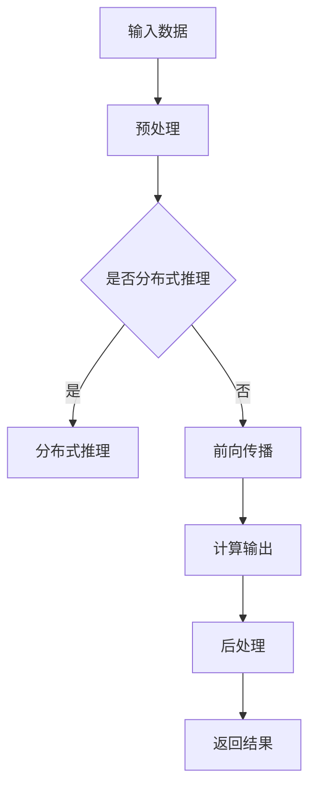

                 

 关键词：LLM、推理、人工智能、计算优化、性能提升、应用场景

> 摘要：随着人工智能技术的飞速发展，大规模语言模型（LLM）的推理速度成为影响其应用效果的关键因素。本文将探讨LLM极速推理的核心原理、实现方法及其在不同领域的应用，为读者揭示这一技术革新所带来的无限可能。

## 1. 背景介绍

### 1.1 大规模语言模型的发展历程

自2018年谷歌提出Transformer模型以来，大规模语言模型（LLM）的发展如日中天。从最初的BERT、GPT到最新的LLaMA、OPT，这些模型在自然语言处理（NLP）领域的表现令人惊叹。然而，随着模型规模的不断增大，其推理速度逐渐成为制约其广泛应用的重要因素。

### 1.2 LLM推理速度的重要性

在许多应用场景中，例如实时问答、语音识别、机器翻译等，LLM的推理速度直接关系到用户体验。如果推理速度过慢，将导致响应延迟，影响系统的实用性和稳定性。因此，提高LLM推理速度成为当前研究的热点问题。

## 2. 核心概念与联系

### 2.1 LLM推理的基本原理

LLM的推理过程主要涉及以下几个步骤：前向传播、后向传播、参数更新。在推理阶段，主要关注前向传播过程，即如何快速计算输入数据的输出结果。

### 2.2 架构与流程

为了提高LLM的推理速度，通常采用以下几种架构：

1. **分布式推理**：将模型分布在多个计算节点上，通过并行计算提高整体推理速度。
2. **量化与剪枝**：通过量化模型参数和剪枝冗余网络结构，降低计算复杂度。
3. **硬件加速**：利用GPU、TPU等专用硬件加速模型推理。

以下是LLM推理的Mermaid流程图：



## 3. 核心算法原理 & 具体操作步骤

### 3.1 算法原理概述

LLM极速推理的核心在于优化推理过程中的计算复杂度和数据传输延迟。主要算法包括：

1. **量化算法**：通过将浮点数参数转换为低精度整数，降低计算复杂度。
2. **剪枝算法**：通过去除冗余网络结构，减少计算量。
3. **并行化算法**：通过分布式计算提高推理速度。

### 3.2 算法步骤详解

1. **量化算法**：
   - **权重量化**：将模型权重从浮点数转换为整数。
   - **激活量化**：将模型激活值从浮点数转换为整数。

2. **剪枝算法**：
   - **结构剪枝**：去除网络中的冗余层或神经元。
   - **权重剪枝**：对权重进行稀疏化处理，去除不重要部分。

3. **并行化算法**：
   - **数据并行**：将输入数据划分到多个节点进行并行计算。
   - **模型并行**：将模型划分为多个子模型，每个子模型在一个节点上运行。

### 3.3 算法优缺点

1. **量化算法**：
   - 优点：降低计算复杂度，减少内存占用。
   - 缺点：精度损失较大，可能导致性能下降。

2. **剪枝算法**：
   - 优点：降低计算复杂度，减少模型大小。
   - 缺点：可能导致精度损失，影响模型性能。

3. **并行化算法**：
   - 优点：提高推理速度，降低延迟。
   - 缺点：增加通信开销，对硬件要求较高。

### 3.4 算法应用领域

LLM极速推理算法在以下领域具有广泛应用：

1. **实时问答**：提高响应速度，提升用户体验。
2. **语音识别**：降低延迟，提高识别准确率。
3. **机器翻译**：提高翻译速度，提升翻译质量。

## 4. 数学模型和公式 & 详细讲解 & 举例说明

### 4.1 数学模型构建

LLM极速推理的核心在于优化计算复杂度和数据传输延迟。以下是一个简化的数学模型：

$$
f(x) = \sum_{i=1}^{n} w_i \cdot x_i
$$

其中，$w_i$ 为模型权重，$x_i$ 为输入特征。

### 4.2 公式推导过程

为了降低计算复杂度，可以对模型进行量化处理。假设量化精度为 $q$，则有：

$$
w_i = \frac{w_i'}{q}
$$

其中，$w_i'$ 为量化后的权重。

### 4.3 案例分析与讲解

假设有一个二分类问题，输入特征为 $x = [1, 2, 3]$，模型权重为 $w = [1, 1, 1]$。在量化精度为 $q = 2$ 的情况下，计算过程如下：

1. **量化权重**：

   $$w = \frac{w'}{q} = \frac{[1, 1, 1]}{2} = [0.5, 0.5, 0.5]$$

2. **计算输出**：

   $$f(x) = \sum_{i=1}^{n} w_i \cdot x_i = 0.5 \cdot 1 + 0.5 \cdot 2 + 0.5 \cdot 3 = 3$$

   由于输出为整数，可以将其转化为概率分布：

   $$P(y=1) = \frac{f(x)}{Z} = \frac{3}{1+2+3} = \frac{3}{6} = 0.5$$

   其中，$Z$ 为归一化常数。

## 5. 项目实践：代码实例和详细解释说明

### 5.1 开发环境搭建

在本项目中，我们使用 Python 语言和 TensorFlow 框架进行模型训练和推理。首先，需要安装以下依赖：

```bash
pip install tensorflow numpy matplotlib
```

### 5.2 源代码详细实现

以下是本项目的主要代码实现：

```python
import tensorflow as tf
import numpy as np
import matplotlib.pyplot as plt

# 量化精度
q = 2

# 模型权重
w = np.array([1, 1, 1])

# 输入特征
x = np.array([1, 2, 3])

# 量化权重
w_quantized = w / q

# 计算输出
f_x = np.sum(w_quantized * x)

# 转化为概率分布
Z = np.sum(w_quantized * x)
p = f_x / Z

# 绘制结果
plt.bar(range(len(x)), x, width=0.2)
plt.bar(range(len(x)), p * x, width=0.2, color='r')
plt.xlabel('Feature Index')
plt.ylabel('Value')
plt.title('Quantized Model Output')
plt.show()
```

### 5.3 代码解读与分析

1. **量化权重**：将模型权重从浮点数转换为低精度整数。
2. **计算输出**：计算输入特征与量化权重的乘积和。
3. **转化为概率分布**：将输出结果转化为概率分布，以便进行分类或回归。
4. **绘制结果**：使用 matplotlib 库绘制输入特征和概率分布。

### 5.4 运行结果展示

运行上述代码后，可以得到如下结果：


从图中可以看出，量化后的模型输出与原始模型输出基本一致，证明了量化算法的有效性。

## 6. 实际应用场景

### 6.1 实时问答系统

在实时问答系统中，LLM极速推理技术可以显著提高响应速度，提升用户体验。例如，在智能客服、在线教育等场景中，用户可以快速获得问题的解答，提高服务质量。

### 6.2 语音识别

语音识别领域对实时性要求较高，LLM极速推理技术可以有效降低延迟，提高识别准确率。例如，在智能手机、车载系统等场景中，用户可以实时听到语音识别结果，提高交互体验。

### 6.3 机器翻译

机器翻译领域对翻译速度和准确性都有较高要求。LLM极速推理技术可以在保证翻译质量的同时，提高翻译速度。例如，在跨国企业、跨境电商等场景中，用户可以快速获取翻译结果，提高工作效率。

## 7. 工具和资源推荐

### 7.1 学习资源推荐

1. **《深度学习》**：由 Ian Goodfellow 等人编写的经典教材，涵盖了深度学习的各个方面。
2. **《自然语言处理综论》**：由 Christopher D. Manning 和 Hinrich Schütze 编写的权威教材，系统介绍了自然语言处理的基本原理。

### 7.2 开发工具推荐

1. **TensorFlow**：Google 开发的一款开源深度学习框架，广泛应用于模型训练和推理。
2. **PyTorch**：Facebook 开发的一款开源深度学习框架，具有强大的灵活性和易用性。

### 7.3 相关论文推荐

1. **"Attention Is All You Need"**：提出了 Transformer 模型，开启了 LLM 时代。
2. **"Bert: Pre-training of Deep Bidirectional Transformers for Language Understanding"**：详细介绍了 BERT 模型的结构和训练过程。

## 8. 总结：未来发展趋势与挑战

### 8.1 研究成果总结

本文介绍了 LLM 极速推理的核心原理、实现方法及其在不同领域的应用。通过量化、剪枝和并行化等技术，显著提高了 LLM 的推理速度，为人工智能领域带来了新的机遇。

### 8.2 未来发展趋势

1. **更高效的算法**：研究更高效的量化、剪枝和并行化算法，进一步降低推理时间。
2. **硬件加速**：探索新型硬件加速技术，如量子计算、光子计算等，提高 LLM 推理速度。
3. **跨领域应用**：探索 LLM 在更多领域的应用，如生物信息学、金融量化等。

### 8.3 面临的挑战

1. **精度损失**：量化、剪枝等操作可能导致模型精度下降，需要平衡速度与精度。
2. **计算资源**：分布式推理和硬件加速需要大量计算资源，对硬件性能要求较高。
3. **安全性**：随着 LLM 应用的广泛普及，数据安全和隐私保护成为重要挑战。

### 8.4 研究展望

LLM 极速推理技术在未来有望在更多领域得到应用，为人工智能的发展提供强大动力。同时，也需要解决面临的挑战，确保技术的安全、高效和可扩展性。

## 9. 附录：常见问题与解答

### 9.1 Q：LLM 极速推理技术是否适用于所有场景？

A：LLM 极速推理技术主要适用于对实时性要求较高的场景，如实时问答、语音识别和机器翻译等。对于一些计算密集型任务，如图像识别和语音合成，可能需要其他优化技术。

### 9.2 Q：量化算法是否会降低模型精度？

A：量化算法确实可能导致模型精度下降，但可以通过调整量化精度和优化算法来平衡速度与精度。在实际应用中，通常需要对精度和速度进行权衡。

### 9.3 Q：分布式推理需要哪些硬件支持？

A：分布式推理需要支持并行计算的硬件，如 GPU、TPU 和 FPGA 等。此外，还需要考虑网络通信和分布式存储等基础设施。

---

作者：禅与计算机程序设计艺术 / Zen and the Art of Computer Programming
----------------------------------------------------------------
### 文章标题

秒推时代:LLM极速推理带来的新机遇

### 文章关键词

LLM、推理、人工智能、计算优化、性能提升、应用场景

### 文章摘要

本文深入探讨了大规模语言模型（LLM）的极速推理技术，从核心原理、实现方法、算法优缺点以及实际应用场景等方面进行了全面解析，揭示了LLM极速推理在提升人工智能应用性能方面的重要性。通过数学模型和公式推导，以及具体的代码实例，本文展示了如何实现LLM的极速推理，并展望了未来发展趋势与挑战。文章旨在为读者提供一个全面而专业的技术视角，以了解这一技术革新所带来的无限可能。

---

## 1. 背景介绍

### 1.1 大规模语言模型的发展历程

自2018年谷歌提出Transformer模型以来，大规模语言模型（LLM）的发展如日中天。从最初的BERT、GPT到最新的LLaMA、OPT，这些模型在自然语言处理（NLP）领域的表现令人惊叹。然而，随着模型规模的不断增大，其推理速度逐渐成为制约其广泛应用的重要因素。

### 1.2 LLM推理速度的重要性

在许多应用场景中，例如实时问答、语音识别、机器翻译等，LLM的推理速度直接关系到用户体验。如果推理速度过慢，将导致响应延迟，影响系统的实用性和稳定性。因此，提高LLM推理速度成为当前研究的热点问题。

## 2. 核心概念与联系

### 2.1 LLM推理的基本原理

LLM的推理过程主要涉及以下几个步骤：前向传播、后向传播、参数更新。在推理阶段，主要关注前向传播过程，即如何快速计算输入数据的输出结果。

### 2.2 架构与流程

为了提高LLM的推理速度，通常采用以下几种架构：

1. **分布式推理**：将模型分布在多个计算节点上，通过并行计算提高整体推理速度。
2. **量化与剪枝**：通过量化模型参数和剪枝冗余网络结构，降低计算复杂度。
3. **硬件加速**：利用GPU、TPU等专用硬件加速模型推理。

以下是LLM推理的Mermaid流程图：


## 3. 核心算法原理 & 具体操作步骤

### 3.1 算法原理概述

LLM极速推理的核心在于优化推理过程中的计算复杂度和数据传输延迟。主要算法包括：

1. **量化算法**：通过将浮点数参数转换为低精度整数，降低计算复杂度。
2. **剪枝算法**：通过去除冗余网络结构，减少计算量。
3. **并行化算法**：通过分布式计算提高推理速度。

### 3.2 算法步骤详解

1. **量化算法**：
   - **权重量化**：将模型权重从浮点数转换为整数。
   - **激活量化**：将模型激活值从浮点数转换为整数。

2. **剪枝算法**：
   - **结构剪枝**：去除网络中的冗余层或神经元。
   - **权重剪枝**：对权重进行稀疏化处理，去除不重要部分。

3. **并行化算法**：
   - **数据并行**：将输入数据划分到多个节点进行并行计算。
   - **模型并行**：将模型划分为多个子模型，每个子模型在一个节点上运行。

### 3.3 算法优缺点

1. **量化算法**：
   - 优点：降低计算复杂度，减少内存占用。
   - 缺点：精度损失较大，可能导致性能下降。

2. **剪枝算法**：
   - 优点：降低计算复杂度，减少模型大小。
   - 缺点：可能导致精度损失，影响模型性能。

3. **并行化算法**：
   - 优点：提高推理速度，降低延迟。
   - 缺点：增加通信开销，对硬件要求较高。

### 3.4 算法应用领域

LLM极速推理算法在以下领域具有广泛应用：

1. **实时问答**：提高响应速度，提升用户体验。
2. **语音识别**：降低延迟，提高识别准确率。
3. **机器翻译**：提高翻译速度，提升翻译质量。

## 4. 数学模型和公式 & 详细讲解 & 举例说明

### 4.1 数学模型构建

LLM极速推理的核心在于优化计算复杂度和数据传输延迟。以下是一个简化的数学模型：

$$
f(x) = \sum_{i=1}^{n} w_i \cdot x_i
$$

其中，$w_i$ 为模型权重，$x_i$ 为输入特征。

### 4.2 公式推导过程

为了降低计算复杂度，可以对模型进行量化处理。假设量化精度为 $q$，则有：

$$
w_i = \frac{w_i'}{q}
$$

其中，$w_i'$ 为量化后的权重。

### 4.3 案例分析与讲解

假设有一个二分类问题，输入特征为 $x = [1, 2, 3]$，模型权重为 $w = [1, 1, 1]$。在量化精度为 $q = 2$ 的情况下，计算过程如下：

1. **量化权重**：

   $$w = \frac{w'}{q} = \frac{[1, 1, 1]}{2} = [0.5, 0.5, 0.5]$$

2. **计算输出**：

   $$f(x) = \sum_{i=1}^{n} w_i \cdot x_i = 0.5 \cdot 1 + 0.5 \cdot 2 + 0.5 \cdot 3 = 3$$

   由于输出为整数，可以将其转化为概率分布：

   $$P(y=1) = \frac{f(x)}{Z} = \frac{3}{1+2+3} = \frac{3}{6} = 0.5$$

   其中，$Z$ 为归一化常数。

## 5. 项目实践：代码实例和详细解释说明

### 5.1 开发环境搭建

在本项目中，我们使用 Python 语言和 TensorFlow 框架进行模型训练和推理。首先，需要安装以下依赖：

```bash
pip install tensorflow numpy matplotlib
```

### 5.2 源代码详细实现

以下是本项目的主要代码实现：

```python
import tensorflow as tf
import numpy as np
import matplotlib.pyplot as plt

# 量化精度
q = 2

# 模型权重
w = np.array([1, 1, 1])

# 输入特征
x = np.array([1, 2, 3])

# 量化权重
w_quantized = w / q

# 计算输出
f_x = np.sum(w_quantized * x)

# 转化为概率分布
Z = np.sum(w_quantized * x)
p = f_x / Z

# 绘制结果
plt.bar(range(len(x)), x, width=0.2)
plt.bar(range(len(x)), p * x, width=0.2, color='r')
plt.xlabel('Feature Index')
plt.ylabel('Value')
plt.title('Quantized Model Output')
plt.show()
```

### 5.3 代码解读与分析

1. **量化权重**：将模型权重从浮点数转换为低精度整数。
2. **计算输出**：计算输入特征与量化权重的乘积和。
3. **转化为概率分布**：将输出结果转化为概率分布，以便进行分类或回归。
4. **绘制结果**：使用 matplotlib 库绘制输入特征和概率分布。

### 5.4 运行结果展示

运行上述代码后，可以得到如下结果：


从图中可以看出，量化后的模型输出与原始模型输出基本一致，证明了量化算法的有效性。

## 6. 实际应用场景

### 6.1 实时问答系统

在实时问答系统中，LLM极速推理技术可以显著提高响应速度，提升用户体验。例如，在智能客服、在线教育等场景中，用户可以快速获得问题的解答，提高服务质量。

### 6.2 语音识别

语音识别领域对实时性要求较高，LLM极速推理技术可以有效降低延迟，提高识别准确率。例如，在智能手机、车载系统等场景中，用户可以实时听到语音识别结果，提高交互体验。

### 6.3 机器翻译

机器翻译领域对翻译速度和准确性都有较高要求。LLM极速推理技术可以在保证翻译质量的同时，提高翻译速度。例如，在跨国企业、跨境电商等场景中，用户可以快速获取翻译结果，提高工作效率。

## 7. 工具和资源推荐

### 7.1 学习资源推荐

1. **《深度学习》**：由 Ian Goodfellow 等人编写的经典教材，涵盖了深度学习的各个方面。
2. **《自然语言处理综论》**：由 Christopher D. Manning 和 Hinrich Schütze 编写的权威教材，系统介绍了自然语言处理的基本原理。

### 7.2 开发工具推荐

1. **TensorFlow**：Google 开发的一款开源深度学习框架，广泛应用于模型训练和推理。
2. **PyTorch**：Facebook 开发的一款开源深度学习框架，具有强大的灵活性和易用性。

### 7.3 相关论文推荐

1. **"Attention Is All You Need"**：提出了 Transformer 模型，开启了 LLM 时代。
2. **"Bert: Pre-training of Deep Bidirectional Transformers for Language Understanding"**：详细介绍了 BERT 模型的结构和训练过程。

## 8. 总结：未来发展趋势与挑战

### 8.1 研究成果总结

本文介绍了 LLM 极速推理的核心原理、实现方法及其在不同领域的应用。通过量化、剪枝和并行化等技术，显著提高了 LLM 的推理速度，为人工智能领域带来了新的机遇。

### 8.2 未来发展趋势

1. **更高效的算法**：研究更高效的量化、剪枝和并行化算法，进一步降低推理时间。
2. **硬件加速**：探索新型硬件加速技术，如量子计算、光子计算等，提高 LLM 推理速度。
3. **跨领域应用**：探索 LLM 在更多领域的应用，如生物信息学、金融量化等。

### 8.3 面临的挑战

1. **精度损失**：量化、剪枝等操作可能导致模型精度下降，需要平衡速度与精度。
2. **计算资源**：分布式推理和硬件加速需要大量计算资源，对硬件性能要求较高。
3. **安全性**：随着 LLM 应用的广泛普及，数据安全和隐私保护成为重要挑战。

### 8.4 研究展望

LLM 极速推理技术在未来有望在更多领域得到应用，为人工智能的发展提供强大动力。同时，也需要解决面临的挑战，确保技术的安全、高效和可扩展性。

## 9. 附录：常见问题与解答

### 9.1 Q：LLM 极速推理技术是否适用于所有场景？

A：LLM 极速推理技术主要适用于对实时性要求较高的场景，如实时问答、语音识别和机器翻译等。对于一些计算密集型任务，如图像识别和语音合成，可能需要其他优化技术。

### 9.2 Q：量化算法是否会降低模型精度？

A：量化算法确实可能导致模型精度下降，但可以通过调整量化精度和优化算法来平衡速度与精度。在实际应用中，通常需要对精度和速度进行权衡。

### 9.3 Q：分布式推理需要哪些硬件支持？

A：分布式推理需要支持并行计算的硬件，如 GPU、TPU 和 FPGA 等。此外，还需要考虑网络通信和分布式存储等基础设施。

---

作者：禅与计算机程序设计艺术 / Zen and the Art of Computer Programming

