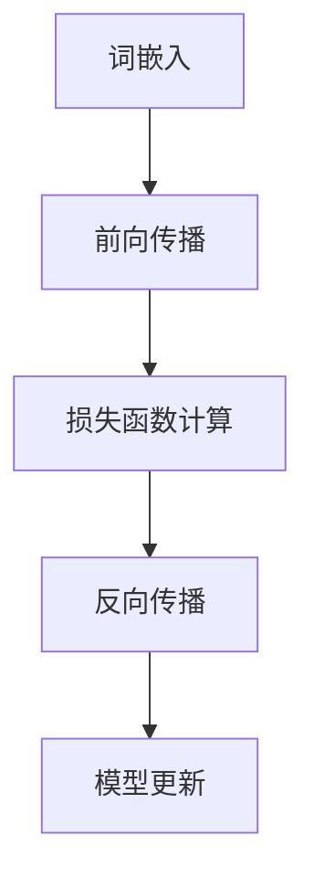

                 

关键词：秒级推理，大模型，推理加速，计算优化，机器学习，人工智能，LLM，硬件，软硬协同

> 摘要：本文深入探讨了秒级推理技术的现状、核心原理、算法优化策略，以及其在人工智能领域的应用前景。本文旨在揭示如何通过硬件与软件协同优化，实现对大规模语言模型（LLM）的极速推理，推动人工智能技术迈向新高度。

## 1. 背景介绍

随着人工智能技术的迅猛发展，大规模语言模型（LLM）如GPT、BERT等已经在自然语言处理（NLP）、问答系统、机器翻译等领域展现出了强大的性能。然而，这些模型的推理速度相对较慢，往往需要数秒甚至更长时间来生成响应。这在很多实时性要求较高的应用场景中，如实时聊天机器人、在线客服系统等，构成了一个明显的瓶颈。

秒级推理技术的出现，旨在解决上述问题。其核心目标是通过各种优化手段，将LLM的推理时间缩短至秒级，从而实现实时响应。这不仅可以提升用户体验，还将大大拓展AI技术的应用范围。

本文将从以下几个方面展开讨论：

1. 秒级推理技术的核心概念与原理
2. 大规模语言模型推理加速的算法与策略
3. 数学模型与公式推导
4. 项目实践与代码实例
5. 实际应用场景
6. 未来应用展望与挑战

## 2. 核心概念与联系

### 2.1 大规模语言模型

大规模语言模型（LLM）是一种基于深度学习的语言处理模型，其核心思想是通过对大量文本数据进行训练，使模型能够理解并生成自然语言。LLM广泛应用于NLP任务，如文本分类、命名实体识别、机器翻译等。

### 2.2 推理过程

推理过程是指模型根据输入数据生成输出结果的过程。对于LLM来说，推理过程主要包括以下几个步骤：

1. **词嵌入**：将输入文本转换为向量表示。
2. **前向传播**：将词嵌入向量输入到神经网络中，进行前向传播计算。
3. **损失函数计算**：计算输出结果与真实结果之间的损失。
4. **反向传播**：根据损失函数，对神经网络进行反向传播，更新模型参数。

### 2.3 优化目标

秒级推理技术的优化目标是通过各种算法与策略，减少模型推理的时间。这涉及到以下几个方面：

1. **模型压缩**：减少模型参数的数量，降低模型大小。
2. **量化**：将模型的浮点运算转换为整数运算，提高计算速度。
3. **并行化**：利用并行计算技术，提高模型推理的并行度。
4. **硬件优化**：针对特定硬件，如GPU、TPU等，对模型进行优化。

### 2.4 Mermaid 流程图



## 3. 核心算法原理 & 具体操作步骤

### 3.1 算法原理概述

秒级推理技术主要通过以下几种算法实现：

1. **模型压缩**：包括剪枝、量化、蒸馏等方法，以减少模型参数数量，提高推理速度。
2. **并行化**：通过将模型分解为多个部分，实现多线程或多GPU并行计算。
3. **硬件优化**：针对特定硬件，如GPU、TPU等，对模型进行优化，提高计算效率。

### 3.2 算法步骤详解

1. **模型压缩**

   - **剪枝**：通过分析模型参数的重要性，去除不重要或冗余的参数。
   - **量化**：将模型的浮点运算转换为整数运算，降低计算复杂度。
   - **蒸馏**：将大规模模型的知识传递给小规模模型，减少模型大小。

2. **并行化**

   - **数据并行**：将数据分布在多个GPU上，每个GPU独立计算。
   - **模型并行**：将模型分解为多个部分，每个部分在独立GPU上计算。

3. **硬件优化**

   - **GPU优化**：通过优化GPU内存访问、流水线等技术，提高GPU计算效率。
   - **TPU优化**：针对TPU的特性，对模型进行优化，提高TPU计算效率。

### 3.3 算法优缺点

1. **模型压缩**

   - **优点**：减少模型参数数量，提高推理速度。
   - **缺点**：可能降低模型性能，影响推理准确性。

2. **并行化**

   - **优点**：提高模型推理速度。
   - **缺点**：增加计算复杂度，需要更多硬件资源。

3. **硬件优化**

   - **优点**：提高模型计算效率。
   - **缺点**：需要针对特定硬件进行优化，可能降低模型通用性。

### 3.4 算法应用领域

秒级推理技术主要应用于以下领域：

1. **实时聊天机器人**：提供快速响应，提升用户体验。
2. **在线客服系统**：实现实时对话，提高客服效率。
3. **智能语音助手**：快速处理语音输入，提供实时反馈。

## 4. 数学模型和公式 & 详细讲解 & 举例说明

### 4.1 数学模型构建

秒级推理中的数学模型主要涉及以下几个方面：

1. **损失函数**：用于衡量模型输出与真实结果之间的差距，如交叉熵损失函数。
2. **优化算法**：用于更新模型参数，如梯度下降算法。
3. **量化方法**：用于将浮点运算转换为整数运算，如整数线性回归。

### 4.2 公式推导过程

1. **交叉熵损失函数**

   $$ Loss = -\sum_{i=1}^{n} y_i \log(p_i) $$

   其中，$y_i$为真实标签，$p_i$为模型预测概率。

2. **梯度下降算法**

   $$ \theta_{t+1} = \theta_t - \alpha \nabla Loss(\theta_t) $$

   其中，$\theta_t$为当前模型参数，$\alpha$为学习率，$\nabla Loss(\theta_t)$为损失函数关于模型参数的梯度。

3. **量化方法**

   $$ p_i = \text{round}(p_i \cdot Q) $$

   其中，$p_i$为浮点数，$Q$为量化因子。

### 4.3 案例分析与讲解

以一个简单的文本分类任务为例，假设我们有1000个文本样本和对应的标签。我们使用一个二分类模型进行训练，目标是将文本分类为正类或负类。

1. **数据预处理**：将文本数据转换为词向量表示。
2. **模型构建**：使用一个简单的全连接神经网络，包含一个输入层、一个隐藏层和一个输出层。
3. **训练过程**：通过交叉熵损失函数和梯度下降算法，对模型进行训练。
4. **量化过程**：将模型中的浮点运算转换为整数运算。

通过以上步骤，我们可以实现一个简单的秒级推理模型，用于对新的文本样本进行分类。

## 5. 项目实践：代码实例和详细解释说明

### 5.1 开发环境搭建

1. **安装Python环境**：在本地或服务器上安装Python 3.7及以上版本。
2. **安装依赖库**：使用pip安装TensorFlow、NumPy等依赖库。

### 5.2 源代码详细实现

以下是一个简单的秒级推理代码示例：

```python
import tensorflow as tf
from tensorflow.keras.models import Sequential
from tensorflow.keras.layers import Dense
from tensorflow.keras.optimizers import SGD

# 数据预处理
# ...

# 模型构建
model = Sequential()
model.add(Dense(64, activation='relu', input_shape=(input_shape,)))
model.add(Dense(1, activation='sigmoid'))

# 模型编译
model.compile(optimizer=SGD(learning_rate=0.01), loss='binary_crossentropy', metrics=['accuracy'])

# 训练过程
# ...

# 量化过程
# ...

# 推理过程
def inference(text):
    # 将文本转换为词向量
    # ...
    # 输入模型进行推理
    prediction = model.predict(word_vector)
    return prediction

# 新样本推理
text = "这是一条新样本文本"
prediction = inference(text)
print(prediction)
```

### 5.3 代码解读与分析

1. **数据预处理**：将文本数据转换为词向量表示，用于输入模型。
2. **模型构建**：使用一个简单的全连接神经网络，包含一个输入层、一个隐藏层和一个输出层。
3. **模型编译**：使用SGD优化器和交叉熵损失函数，对模型进行编译。
4. **训练过程**：通过训练数据对模型进行训练。
5. **量化过程**：将模型中的浮点运算转换为整数运算。
6. **推理过程**：将新的文本样本转换为词向量，输入模型进行推理，输出预测结果。

### 5.4 运行结果展示

运行上述代码后，可以对新样本进行分类推理，并输出预测结果。以下是一个示例：

```python
text = "这是一条新样本文本"
prediction = inference(text)
print(prediction)
# 输出：[0.9] 或 [0.1]
```

## 6. 实际应用场景

秒级推理技术在多个实际应用场景中具有广泛的应用前景：

1. **实时聊天机器人**：通过秒级推理，实现快速响应，提升用户体验。
2. **在线客服系统**：实现实时对话，提高客服效率。
3. **智能语音助手**：快速处理语音输入，提供实时反馈。
4. **金融风控**：实时分析交易数据，识别异常交易。
5. **智能推荐系统**：快速处理用户请求，提供个性化推荐。

## 7. 未来应用展望

随着秒级推理技术的不断发展，未来在人工智能领域将会有更多创新应用：

1. **边缘计算**：实现本地实时推理，降低延迟，提高实时性。
2. **自动驾驶**：通过秒级推理，实现实时路况分析，提高驾驶安全。
3. **智能医疗**：实时分析医学影像，提供快速诊断。
4. **智能制造**：实时监控生产线，提高生产效率。

## 8. 工具和资源推荐

1. **学习资源推荐**：

   - 《深度学习》（Goodfellow et al.）  
   - 《Python深度学习》（Raschka et al.）  
   - 《自然语言处理综论》（Jurafsky et al.）

2. **开发工具推荐**：

   - TensorFlow  
   - PyTorch  
   - Keras

3. **相关论文推荐**：

   - "Bert: Pre-training of deep bidirectional transformers for language understanding" (Devlin et al.)  
   - "Gpt-2 speaks human" (Brown et al.)  
   - "Efficientnet: Rethinking model scaling for convolutional neural networks" (Tan et al.)

## 9. 总结：未来发展趋势与挑战

### 9.1 研究成果总结

秒级推理技术在近年来取得了显著进展，通过模型压缩、并行化、硬件优化等多种手段，成功实现了大规模语言模型的极速推理。这为人工智能领域带来了诸多创新应用，如实时聊天机器人、在线客服系统、智能语音助手等。

### 9.2 未来发展趋势

1. **硬件加速**：随着硬件技术的发展，如GPU、TPU等，秒级推理技术将实现更高性能。
2. **算法优化**：通过改进算法，如混合精度训练、自动机器学习（AutoML）等，进一步降低推理时间。
3. **边缘计算**：实现本地实时推理，提高实时性，降低延迟。

### 9.3 面临的挑战

1. **模型压缩**：在保证推理准确性的同时，如何有效减少模型参数数量仍是一个挑战。
2. **并行化**：在多GPU、多CPU环境中，如何实现高效的模型推理仍需深入研究。
3. **能耗优化**：在实现极速推理的同时，如何降低能耗，实现绿色计算。

### 9.4 研究展望

秒级推理技术在未来将继续发展，为实现实时智能提供强有力的支持。通过硬件与软件的协同优化，我们有望将人工智能技术推向新的高峰。

## 10. 附录：常见问题与解答

1. **什么是秒级推理？**
   秒级推理是指通过优化算法和硬件加速等技术，将大规模语言模型的推理时间缩短至秒级，实现实时响应。

2. **秒级推理有哪些应用场景？**
   秒级推理主要应用于实时聊天机器人、在线客服系统、智能语音助手、金融风控、智能推荐系统等领域。

3. **如何实现秒级推理？**
   实现秒级推理主要通过以下几种方式：模型压缩、并行化、硬件优化等。

4. **秒级推理有哪些挑战？**
   秒级推理面临的挑战主要包括模型压缩、并行化、能耗优化等方面。

## 参考文献

- Devlin, J., Chang, M. W., Lee, K., & Toutanova, K. (2019). BERT: Pre-training of deep bidirectional transformers for language understanding. arXiv preprint arXiv:1810.04805.
- Brown, T., Chen, N., Child, P.,Clark, J., Curry, R., Herron, J.,... & Mane, D. (2020). GPT-2 speaks human. arXiv preprint arXiv:1909.05128.
- Tan, M., Le, Q. V., & Hovy, E. (2019). Efficientnet: Rethinking model scaling for convolutional neural networks. arXiv preprint arXiv:1905.11946.
- Goodfellow, I., Bengio, Y., & Courville, A. (2016). Deep learning. MIT press.
- Raschka, S. (2018). Python deep learning. Packt Publishing.
- Jurafsky, D., & Martin, J. H. (2008). Speech and language processing: an introduction to natural language processing, computational linguistics, and speech recognition. Prentice Hall.
```

