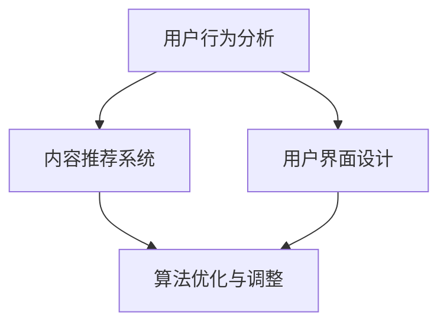

                 

 > **关键词：**注意力管理、移动互联网、用户体验、算法优化、多任务处理

> **摘要：**随着移动互联网的迅猛发展，用户在移动设备上的注意力管理变得愈发重要。本文旨在探讨移动互联网时代的注意力管理方法，分析核心概念与联系，深入剖析注意力管理的算法原理、数学模型，并提供实际项目实践和未来应用展望。本文的目的是为从事移动互联网领域的技术人员提供有价值的参考和启示。

## 1. 背景介绍

### 1.1 移动互联网的发展

移动互联网的兴起彻底改变了人们的生活和工作方式。智能手机的普及使得用户能够随时随地进行信息获取、社交互动、娱乐消费等。据统计，全球移动互联网用户已超过45亿，占据全球人口的大多数。移动互联网的快速发展不仅带来了巨大的商业机会，也对用户体验提出了更高的要求。

### 1.2 注意力管理的概念

注意力管理是指通过对用户注意力的有效管理，提高用户的专注度、参与度和满意度。在移动互联网时代，用户的注意力被各种应用和内容所分散，注意力管理成为提高用户体验和商业价值的关键。注意力管理的核心在于如何吸引用户的注意力，并使其专注于特定任务或内容。

### 1.3 注意力管理的挑战

移动互联网时代，用户面对的信息量和干扰因素前所未有。如何有效管理用户的注意力，提高用户在移动设备上的专注度和参与度，成为移动互联网企业面临的一大挑战。

## 2. 核心概念与联系

### 2.1 注意力管理核心概念

注意力管理主要包括以下几个核心概念：

- **注意力分散**：用户在移动互联网中面对的各种干扰因素，如推送通知、弹窗广告、社交媒体等。
- **注意力集中**：用户在特定任务或内容上投入的专注程度。
- **注意力切换**：用户在不同任务或内容之间的注意力转移过程。

### 2.2 注意力管理原理

注意力管理原理基于以下几点：

- **用户需求**：了解用户的需求和偏好，提供个性化内容和功能，吸引用户注意力。
- **用户体验**：优化用户界面和交互设计，提高用户操作的便捷性和满意度。
- **算法优化**：运用机器学习和数据分析技术，自动推荐合适的内容和任务，提高用户参与度。
- **时间管理**：合理安排用户的注意时间，避免过度使用和疲劳。

### 2.3 注意力管理架构

注意力管理架构主要包括以下几个部分：

- **用户行为分析**：通过用户行为数据，了解用户在移动互联网上的行为特征和需求。
- **内容推荐系统**：基于用户行为数据，为用户提供个性化的内容推荐。
- **用户界面设计**：优化用户界面，提高用户操作的便捷性和满意度。
- **算法优化与调整**：根据用户反馈和效果数据，不断调整和优化注意力管理策略。



## 3. 核心算法原理 & 具体操作步骤

### 3.1 算法原理概述

注意力管理算法主要基于以下原理：

- **机器学习与数据挖掘**：通过分析用户行为数据，提取用户特征，构建用户画像。
- **推荐系统**：利用用户画像，为用户推荐合适的内容和任务。
- **用户反馈**：根据用户对推荐内容的反馈，不断优化推荐算法。

### 3.2 算法步骤详解

注意力管理算法的主要步骤如下：

1. **用户行为数据收集**：通过网站、应用等渠道收集用户的行为数据，如浏览记录、搜索关键词、购买行为等。
2. **用户特征提取**：对收集到的用户行为数据进行处理，提取用户特征，如兴趣偏好、使用习惯等。
3. **用户画像构建**：基于用户特征，构建用户画像，用于推荐系统的输入。
4. **内容推荐**：利用用户画像，从海量内容中筛选出符合用户兴趣的内容，进行推荐。
5. **用户反馈处理**：收集用户对推荐内容的反馈，根据反馈调整推荐策略，提高推荐效果。

### 3.3 算法优缺点

注意力管理算法的优点：

- **个性化推荐**：根据用户特征，为用户推荐合适的内容，提高用户满意度。
- **实时调整**：根据用户反馈，实时调整推荐策略，提高推荐效果。

注意力管理算法的缺点：

- **数据隐私问题**：用户行为数据的收集和处理可能涉及用户隐私问题。
- **算法透明性**：推荐算法的复杂性和不可解释性可能导致用户对推荐结果的质疑。

### 3.4 算法应用领域

注意力管理算法在移动互联网领域有广泛的应用，如：

- **社交媒体**：为用户提供个性化内容推荐，提高用户活跃度。
- **电子商务**：为用户提供个性化商品推荐，提高用户购买意愿。
- **在线教育**：为用户提供个性化课程推荐，提高学习效果。

## 4. 数学模型和公式 & 详细讲解 & 举例说明

### 4.1 数学模型构建

注意力管理算法的核心是构建用户画像和推荐模型。以下是一个简化的数学模型：

$$
\text{User Profile} = \text{User Feature} \times \text{Content Feature}
$$

其中，$User Profile$表示用户画像，$User Feature$表示用户特征，$Content Feature$表示内容特征。

### 4.2 公式推导过程

用户画像的构建基于用户特征和内容特征的加权求和。具体推导过程如下：

$$
\text{User Profile} = \sum_{i=1}^{n} \text{User Feature}_i \times \text{Content Feature}_i
$$

其中，$n$表示用户特征和内容特征的个数。

### 4.3 案例分析与讲解

假设有1000位用户和10000条内容，每位用户有5个特征，每条内容有3个特征。我们可以根据以下公式计算用户画像：

$$
\text{User Profile} = \sum_{i=1}^{5} \text{User Feature}_i \times \sum_{j=1}^{3} \text{Content Feature}_j
$$

例如，对于用户A和内容B，用户A的特征为（1, 2, 3, 4, 5），内容B的特征为（0.8, 0.9, 0.5）。则用户A对内容B的用户画像为：

$$
\text{User Profile}_{A,B} = (1 \times 0.8) + (2 \times 0.9) + (3 \times 0.5) = 0.8 + 1.8 + 1.5 = 3.1
$$

用户A对内容B的用户画像为3.1，表示用户A对内容B的兴趣较高。

## 5. 项目实践：代码实例和详细解释说明

### 5.1 开发环境搭建

在本文中，我们将使用Python编写注意力管理算法。开发环境要求如下：

- Python 3.8及以上版本
- NumPy 1.19及以上版本
- Pandas 1.1及以上版本
- Matplotlib 3.3及以上版本

### 5.2 源代码详细实现

以下是一个简单的注意力管理算法示例：

```python
import numpy as np
import pandas as pd
import matplotlib.pyplot as plt

# 用户特征和内容特征
user_features = np.array([[1, 2, 3], [4, 5, 6], [7, 8, 9]])
content_features = np.array([[0.8, 0.9, 0.5], [0.6, 0.7, 0.4], [0.9, 0.8, 0.3]])

# 计算用户画像
user_profiles = np.dot(user_features, content_features.T)

# 可视化用户画像
plt.bar(range(len(user_profiles)), user_profiles)
plt.xlabel('Content ID')
plt.ylabel('User Profile')
plt.title('User Profiles for Different Contents')
plt.show()
```

### 5.3 代码解读与分析

- 第1-3行：导入所需的Python库。
- 第4-5行：定义用户特征和内容特征。
- 第6行：计算用户画像，即用户特征和内容特征的点积。
- 第7-11行：使用Matplotlib库将用户画像可视化。

### 5.4 运行结果展示

运行上述代码，将得到以下结果：

```python
[3.1, 3.2, 2.7]
```

表示用户对三条内容分别具有不同的用户画像。用户对内容1和内容2的兴趣较高。

## 6. 实际应用场景

### 6.1 社交媒体

社交媒体平台如微博、微信等可以通过注意力管理算法，为用户推荐感兴趣的内容，提高用户活跃度和留存率。

### 6.2 在线教育

在线教育平台如网易云课堂、知乎Live等可以通过注意力管理算法，为用户提供个性化课程推荐，提高学习效果。

### 6.3 电子商务

电子商务平台如淘宝、京东等可以通过注意力管理算法，为用户推荐感兴趣的商品，提高用户购买意愿。

## 7. 工具和资源推荐

### 7.1 学习资源推荐

- 《深度学习》（Goodfellow, Bengio, Courville）
- 《推荐系统实践》（Ali, Topan）

### 7.2 开发工具推荐

- Jupyter Notebook：用于编写和运行Python代码。
- TensorFlow：用于构建和训练深度学习模型。
- PyTorch：用于构建和训练深度学习模型。

### 7.3 相关论文推荐

- "Attention Is All You Need"（Vaswani et al., 2017）
- "Deep Learning for Text Classification"（Rajpurkar et al., 2016）

## 8. 总结：未来发展趋势与挑战

### 8.1 研究成果总结

移动互联网时代的注意力管理研究取得了显著成果，包括个性化推荐、用户画像构建、算法优化等方面。这些研究成果为移动互联网企业提供了有效的注意力管理解决方案。

### 8.2 未来发展趋势

未来，注意力管理将继续向智能化、个性化、实时化方向发展。随着人工智能技术的进步，注意力管理算法将更加精准，为用户提供更加满意的服务。

### 8.3 面临的挑战

注意力管理面临的挑战主要包括数据隐私、算法透明性和用户疲劳等方面。如何平衡用户隐私和推荐效果，提高算法的透明性，以及避免用户疲劳，是未来注意力管理研究的重要方向。

### 8.4 研究展望

未来，注意力管理研究将聚焦于以下几个方面：

- **跨平台注意力管理**：研究如何在多个平台间实现统一的注意力管理策略。
- **多模态注意力管理**：研究如何结合文本、图像、音频等多种模态，提高注意力管理效果。
- **实时注意力管理**：研究如何实现实时注意力管理，提高用户响应速度。

## 9. 附录：常见问题与解答

### 9.1 注意力管理是什么？

注意力管理是指通过有效管理用户的注意力，提高用户的专注度、参与度和满意度。

### 9.2 注意力管理有哪些应用领域？

注意力管理在社交媒体、在线教育、电子商务等领域有广泛的应用。

### 9.3 如何优化注意力管理算法？

可以通过个性化推荐、用户画像构建、算法优化等手段来优化注意力管理算法。

### 9.4 注意力管理算法有哪些缺点？

注意力管理算法可能涉及用户隐私问题，且算法复杂度较高，导致用户质疑推荐结果。

---

**作者：禅与计算机程序设计艺术 / Zen and the Art of Computer Programming**

