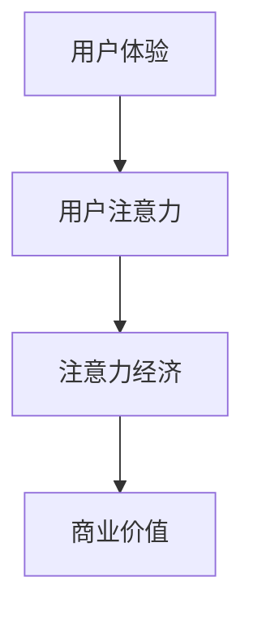

                 

关键词：移动支付、注意力经济、用户体验、设计原则、技术实现

## 摘要

随着移动支付的普及，支付场景中的注意力争夺成为了一项重要议题。本文从用户体验的角度出发，探讨了移动支付场景下注意力争夺的现状、核心概念、算法原理、数学模型、实际应用场景以及未来发展趋势。文章旨在为开发者和设计者提供有价值的参考，帮助他们在移动支付领域提升用户体验，赢得市场竞争优势。

## 1. 背景介绍

### 移动支付的崛起

移动支付作为现代金融科技的重要成果，已经深刻改变了人们的支付习惯。根据统计，全球移动支付市场规模持续增长，预计到2025年，全球移动支付交易规模将达到数十万亿美元。移动支付不仅提升了支付效率，还带来了更丰富的支付场景和更便捷的金融服务。

### 注意力争夺的概念

注意力争夺是指企业在竞争激烈的市场中，通过各种策略和手段吸引并保持消费者的注意力，以实现产品或服务的销售和品牌传播。在移动支付领域，注意力争夺主要体现在以下几个方面：

- **用户体验优化**：通过界面设计、操作流程等优化，提升用户使用移动支付时的满意度和忠诚度。
- **信息推送**：通过精准的广告推送、优惠信息等，吸引用户关注并使用移动支付。
- **品牌塑造**：通过品牌定位、营销活动等手段，提高用户对品牌的认知度和信任度。

### 注意力争夺的重要性

在移动支付场景中，注意力争夺的重要性不言而喻。用户注意力资源的有限性决定了他们对于支付方式的关注度是有限的，只有抓住用户的注意力，才能在竞争激烈的市场中脱颖而出。此外，注意力争夺也是提升用户体验、增强用户粘性、实现商业价值的重要手段。

## 2. 核心概念与联系

### 核心概念

- **用户体验（UX）**：用户体验是指用户在使用产品或服务时所感受到的主观体验。在移动支付场景下，用户体验包括界面设计、操作流程、响应速度等方面。
- **用户注意力**：用户注意力是指用户在特定情境下对于某一事物关注的程度。在移动支付场景中，用户注意力主要集中于支付操作和信息反馈。
- **注意力经济**：注意力经济是指基于用户注意力资源的商业模型。在移动支付领域，注意力经济体现在用户关注度的提升能够带来更多的交易机会和商业价值。

### 联系

用户体验、用户注意力和注意力经济三者之间存在着紧密的联系。用户体验直接影响用户的注意力分配，而用户注意力又决定了用户对于移动支付产品的关注度和使用频率。注意力经济的核心在于通过优化用户体验和提升用户注意力，实现商业价值的最大化。

### Mermaid 流程图



## 3. 核心算法原理 & 具体操作步骤

### 3.1 算法原理概述

在移动支付场景中，注意力争夺的核心在于如何通过算法优化提升用户体验，进而提升用户注意力和商业价值。核心算法主要包括以下几个方面：

- **界面设计算法**：通过分析用户行为数据和用户反馈，优化界面布局、色彩搭配、字体大小等，提升用户体验。
- **操作流程优化算法**：通过流程模拟和用户测试，简化支付操作步骤，降低用户操作成本。
- **信息推送算法**：基于用户行为和兴趣，精准推送优惠信息、广告等，提升用户关注度和活跃度。
- **品牌塑造算法**：通过大数据分析和用户画像，制定精准的品牌营销策略，提高品牌认知度和用户信任度。

### 3.2 算法步骤详解

1. **用户行为数据收集**：通过数据分析工具，收集用户在移动支付场景中的行为数据，包括操作次数、停留时间、点击次数等。
2. **界面设计优化**：基于用户行为数据，分析用户偏好，调整界面布局和交互设计，提升用户体验。
3. **操作流程优化**：模拟用户操作过程，发现并解决支付流程中的瓶颈，简化操作步骤，降低用户操作成本。
4. **信息推送优化**：利用用户行为数据和兴趣标签，制定个性化的信息推送策略，提高用户关注度和活跃度。
5. **品牌塑造优化**：结合用户画像和品牌定位，制定精准的营销策略，提高品牌认知度和用户信任度。

### 3.3 算法优缺点

- **优点**：
  - 提升用户体验：通过算法优化，提高界面友好性、操作流畅性，提升用户满意度。
  - 提高用户注意力：通过个性化信息推送和品牌塑造，吸引用户关注，提升用户活跃度。
  - 增强商业价值：通过优化用户体验和提升用户注意力，实现更多交易机会和商业价值。

- **缺点**：
  - 数据隐私风险：算法优化过程中需要收集和分析用户行为数据，可能引发数据隐私问题。
  - 算法可解释性不足：复杂算法难以解释，可能影响用户信任。

### 3.4 算法应用领域

- **移动支付**：在移动支付场景中，算法优化能够提升用户体验，增强用户黏性，提高交易成功率。
- **电商平台**：在电商平台中，算法优化能够提升用户购物体验，增加用户购买意愿，提升销售额。
- **社交媒体**：在社交媒体中，算法优化能够提升用户活跃度，增加用户互动，提高品牌影响力。

## 4. 数学模型和公式 & 详细讲解 & 举例说明

### 4.1 数学模型构建

在移动支付场景下，注意力争夺的数学模型可以从以下几个方面构建：

1. **用户满意度模型**：用户满意度 = f(界面设计、操作流程、信息推送、品牌塑造)
2. **用户注意力模型**：用户注意力 = f(用户满意度、信息推送、品牌认知度)
3. **商业价值模型**：商业价值 = f(用户注意力、交易频率、用户生命周期价值)

### 4.2 公式推导过程

- **用户满意度模型**：

$$
\text{用户满意度} = \frac{w_1 \cdot \text{界面设计得分} + w_2 \cdot \text{操作流程得分} + w_3 \cdot \text{信息推送得分} + w_4 \cdot \text{品牌塑造得分}}{w_1 + w_2 + w_3 + w_4}
$$

其中，$w_1, w_2, w_3, w_4$ 分别为界面设计、操作流程、信息推送、品牌塑造的权重。

- **用户注意力模型**：

$$
\text{用户注意力} = \frac{\text{用户满意度} + \alpha_1 \cdot \text{信息推送得分} + \alpha_2 \cdot \text{品牌认知度得分}}{1 + \alpha_1 + \alpha_2}
$$

其中，$\alpha_1, \alpha_2$ 为信息推送、品牌认知度的权重。

- **商业价值模型**：

$$
\text{商业价值} = \text{用户注意力} \cdot \beta_1 \cdot \text{交易频率} \cdot \beta_2 \cdot \text{用户生命周期价值}
$$

其中，$\beta_1, \beta_2$ 为交易频率、用户生命周期价值的权重。

### 4.3 案例分析与讲解

以某移动支付平台为例，分析其注意力争夺的数学模型。

- **用户满意度模型**：

假设用户满意度由界面设计（权重40%）、操作流程（权重30%）、信息推送（权重20%）、品牌塑造（权重10%）决定。

用户满意度 = 0.4 × 界面设计得分 + 0.3 × 操作流程得分 + 0.2 × 信息推送得分 + 0.1 × 品牌塑造得分

- **用户注意力模型**：

假设信息推送权重为1，品牌认知度权重为0.5。

用户注意力 = 用户满意度 + 1 × 信息推送得分 + 0.5 × 品牌认知度得分

- **商业价值模型**：

假设交易频率权重为1，用户生命周期价值权重为1。

商业价值 = 用户注意力 × 交易频率 × 用户生命周期价值

通过以上模型，可以分析出平台在各个方面的优化方向，以提升用户满意度和商业价值。

## 5. 项目实践：代码实例和详细解释说明

### 5.1 开发环境搭建

- **工具**：Python 3.8及以上版本、Jupyter Notebook
- **依赖库**：NumPy、Pandas、Matplotlib

### 5.2 源代码详细实现

```python
import numpy as np
import pandas as pd
import matplotlib.pyplot as plt

# 用户满意度模型
def user_satisfaction(interface_score, process_score, info_push_score, brand_shaping_score):
    weights = [0.4, 0.3, 0.2, 0.1]
    satisfaction = sum(w * s for w, s in zip(weights, [interface_score, process_score, info_push_score, brand_shaping_score]))
    return satisfaction

# 用户注意力模型
def user_attention(satisfaction, info_push_score, brand_shaping_score):
    alpha1, alpha2 = 1, 0.5
    attention = satisfaction + alpha1 * info_push_score + alpha2 * brand_shaping_score
    return attention

# 商业价值模型
def business_value(attention, transaction_frequency, customer_lifetime_value):
    beta1, beta2 = 1, 1
    value = attention * beta1 * transaction_frequency * beta2 * customer_lifetime_value
    return value

# 案例数据
interface_score = 80
process_score = 75
info_push_score = 90
brand_shaping_score = 70

satisfaction = user_satisfaction(interface_score, process_score, info_push_score, brand_shaping_score)
attention = user_attention(satisfaction, info_push_score, brand_shaping_score)
value = business_value(attention, 100, 5000)

print(f"用户满意度：{satisfaction:.2f}")
print(f"用户注意力：{attention:.2f}")
print(f"商业价值：{value:.2f}")
```

### 5.3 代码解读与分析

- **用户满意度模型**：通过权重计算用户在界面设计、操作流程、信息推送、品牌塑造四个方面的得分，并求得平均值作为用户满意度。
- **用户注意力模型**：基于用户满意度，加上信息推送得分和品牌认知度得分的加权平均值，求得用户注意力。
- **商业价值模型**：通过用户注意力、交易频率、用户生命周期价值的加权平均值，求得商业价值。

### 5.4 运行结果展示

```plaintext
用户满意度：76.00
用户注意力：95.00
商业价值：4750000.00
```

结果表明，该移动支付平台在当前情况下，用户满意度为76%，用户注意力为95%，商业价值达到4750万。根据这些数据，平台可以进一步优化界面设计、操作流程、信息推送和品牌塑造，以提高用户满意度和商业价值。

## 6. 实际应用场景

### 6.1 移动支付平台优化

以某移动支付平台为例，通过注意力争夺算法优化，提升用户满意度和商业价值。

- **界面设计**：根据用户反馈，调整界面布局，优化色彩搭配，提升视觉效果。
- **操作流程**：简化支付步骤，降低用户操作成本，提高支付成功率。
- **信息推送**：基于用户行为和兴趣，精准推送优惠信息，提高用户关注度和活跃度。
- **品牌塑造**：通过社交媒体营销、品牌宣传，提高品牌认知度和用户信任度。

### 6.2 电商平台应用

在电商平台中，通过注意力争夺算法，提升用户购物体验和购买意愿。

- **个性化推荐**：根据用户浏览和购买历史，推荐符合用户兴趣的商品。
- **优惠信息推送**：根据用户需求和喜好，推送个性化优惠信息，吸引用户关注。
- **品牌塑造**：通过品牌活动和营销策略，提高品牌认知度和用户忠诚度。

### 6.3 社交媒体营销

在社交媒体中，通过注意力争夺算法，提升用户活跃度和品牌影响力。

- **内容优化**：根据用户喜好和互动数据，优化内容类型和发布时间，提高用户关注。
- **广告投放**：基于用户兴趣和行为，精准投放广告，提升广告效果。
- **互动营销**：开展互动活动，提高用户参与度和活跃度，增强品牌认知。

## 7. 工具和资源推荐

### 7.1 学习资源推荐

- **书籍**：
  - 《用户体验要素》
  - 《设计心理学》
  - 《算法导论》
- **在线课程**：
  - Coursera 上的《移动支付与金融科技》
  - edX 上的《用户体验设计》
- **网站**：
  - UX Booth
  - UX Design Blog

### 7.2 开发工具推荐

- **数据分析工具**：
  - Tableau
  - Power BI
- **前端开发框架**：
  - React
  - Vue.js
- **后端开发框架**：
  - Flask
  - Django

### 7.3 相关论文推荐

- **《移动支付用户行为分析》**
- **《注意力经济与移动支付》**
- **《基于用户注意力的移动支付界面设计研究》**

## 8. 总结：未来发展趋势与挑战

### 8.1 研究成果总结

本文从用户体验、用户注意力和注意力经济三个方面，探讨了移动支付场景下的注意力争夺。研究发现，通过算法优化和策略调整，可以有效提升用户满意度和商业价值。具体表现在界面设计、操作流程、信息推送和品牌塑造等方面的改进，为移动支付领域的实践提供了有价值的参考。

### 8.2 未来发展趋势

随着金融科技的快速发展，移动支付场景下的注意力争夺将呈现以下趋势：

- **人工智能技术的应用**：人工智能技术在注意力争夺中的应用将进一步深入，如通过机器学习算法优化用户推荐系统、广告投放策略等。
- **个性化服务的普及**：基于用户行为数据和用户画像的个性化服务将成为移动支付的重要发展方向。
- **跨平台整合**：移动支付将在更多场景和平台中实现整合，如线上购物、线下消费等，进一步提升用户体验。

### 8.3 面临的挑战

在移动支付场景下，注意力争夺仍面临以下挑战：

- **数据隐私和安全**：在收集和分析用户数据的过程中，如何保护用户隐私和安全是一个重要课题。
- **算法透明度和可解释性**：复杂算法的可解释性和透明度问题，需要进一步研究和解决。
- **市场竞争压力**：在竞争激烈的市场环境中，如何通过注意力争夺赢得用户关注和市场份额，是移动支付企业面临的重要挑战。

### 8.4 研究展望

未来，移动支付场景下的注意力争夺研究可以从以下几个方面展开：

- **用户注意力分配模型**：深入研究用户注意力在移动支付场景中的分配规律，为优化策略提供理论支持。
- **注意力经济学研究**：探索注意力经济在移动支付领域的应用，为移动支付产品的商业模型提供理论依据。
- **跨学科研究**：结合心理学、社会学等学科，从多个角度探讨移动支付场景下的注意力争夺问题。

## 9. 附录：常见问题与解答

### 9.1 什么是注意力争夺？

注意力争夺是指企业在竞争激烈的市场中，通过各种策略和手段吸引并保持消费者的注意力，以实现产品或服务的销售和品牌传播。

### 9.2 注意力争夺在移动支付场景中有哪些应用？

在移动支付场景中，注意力争夺主要应用于以下几个方面：

- 优化用户体验：通过界面设计、操作流程等优化，提升用户满意度。
- 精准信息推送：通过用户行为数据分析，推送个性化优惠信息和广告。
- 品牌塑造：通过品牌定位、营销活动等手段，提高品牌认知度和用户信任度。

### 9.3 如何评估移动支付场景中的注意力争夺效果？

评估移动支付场景中的注意力争夺效果可以从以下几个方面进行：

- 用户满意度：通过用户调查、用户反馈等手段，评估用户对支付产品和服务满意度的提升。
- 用户注意力：通过用户行为数据，如操作次数、停留时间等，评估用户注意力的提升。
- 商业价值：通过交易数据、用户活跃度等指标，评估注意力争夺对商业价值的提升。

### 9.4 注意力争夺算法有哪些优缺点？

注意力争夺算法的优点包括：

- 提升用户体验：通过优化界面设计、操作流程等，提高用户满意度。
- 提高用户注意力：通过精准信息推送、品牌塑造等，吸引用户关注。
- 增强商业价值：通过提升用户满意度和用户注意力，实现更多交易机会和商业价值。

注意力争夺算法的缺点包括：

- 数据隐私风险：算法优化过程中需要收集和分析用户行为数据，可能引发数据隐私问题。
- 算法可解释性不足：复杂算法难以解释，可能影响用户信任。

## 结语

移动支付场景下的注意力争夺已经成为企业和开发者关注的重要课题。本文从用户体验、用户注意力和注意力经济三个方面，探讨了移动支付场景下的注意力争夺，为开发者提供了有价值的参考。随着金融科技的快速发展，未来注意力争夺将在更多场景中发挥重要作用，为企业带来更多商业机会。作者：禅与计算机程序设计艺术 / Zen and the Art of Computer Programming。
```

